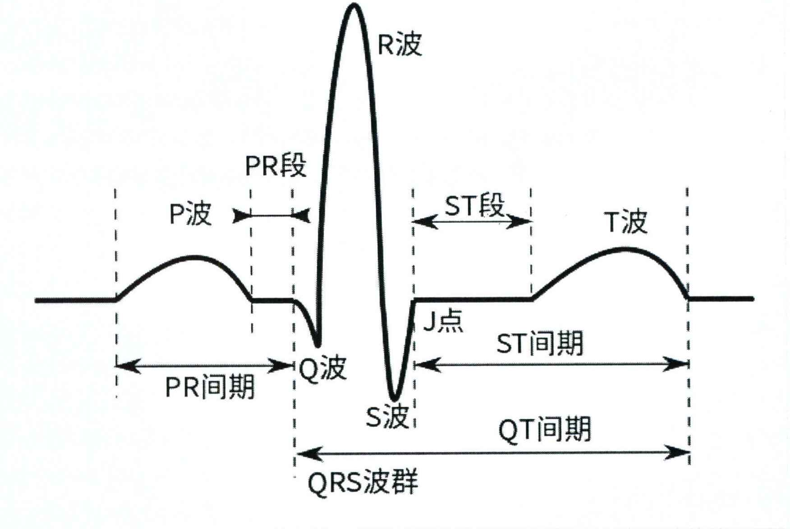
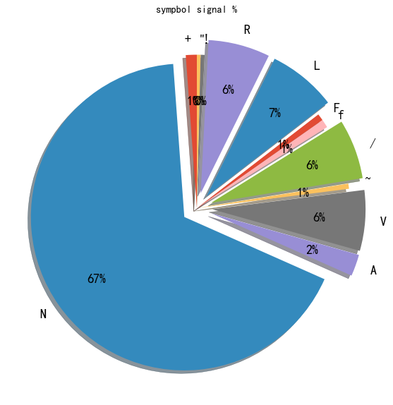
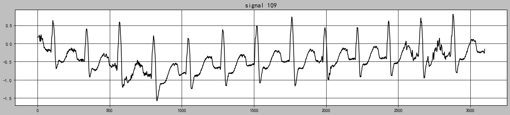
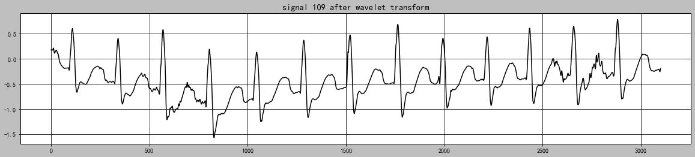
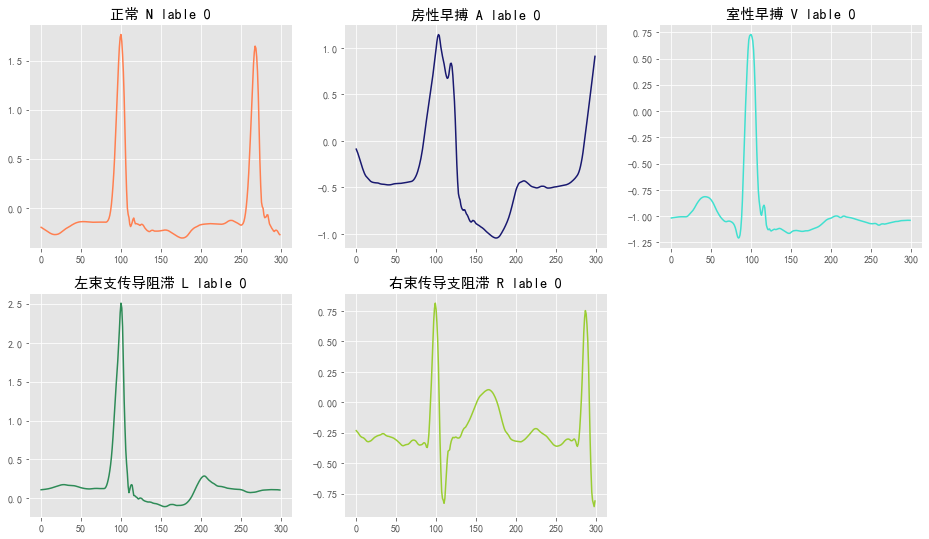
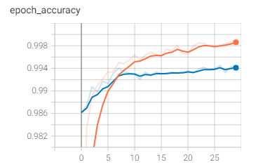
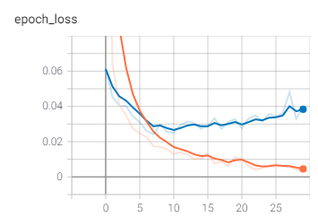
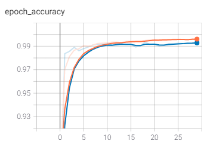
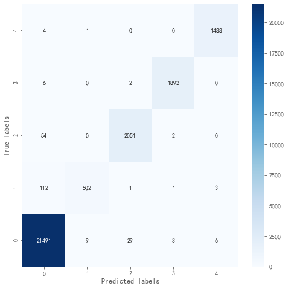

# 心律失常诊断


## 使用WFDB读取数据


### 读取.hea文件


```python
from IPython.display import display
import wfdb
record = wfdb.rdheader('../mit-bih-arrhythmia-database-1.0.0/100')
# display(record.__dict__)
```

### 读取record数据

使用rdrecord函数，该函数的返回值为一个wfdb中定义的record对象。
```python
def rdrecord(record_name, sampfrom=0, sampto=None, channels=None,
             physical=True, pb_dir=None, m2s=True, smooth_frames=True,
            ignore_skew=False, return_res=64, force_channels=True,
           channel_names=None, warn_empty=False):
```
常用的重要参数：

- record_name : 储存心电信号的路径;
- sampfrom : 起始位置；
- sampto : 终止位置；
- channels :optional，选择读取某个通道的数据，默认读取全部通道；


```python
from IPython.display import display
import wfdb
record=wfdb.rdrecord('../mit-bih-arrhythmia-database-1.0.0/100') 
# display(record.__dict__)
```

几个经常使用的属性值:
1. fs：采样频率；
2. n_sig：信号通道数；
3. sig_len：信号长度；
4. p_signal：模拟信号值，储存形式为ndarray或者是list；
5. d_signal：数字信号值，储存形式为ndarray或者是list。

这些属性都能直接进行访问（如：使用record.fs可以直接读取到采样频率)。

### 读取.art文件


```python
import wfdb
annotation=wfdb.rdann('../mit-bih-arrhythmia-database-1.0.0/100', 'atr')
# display(annotation.__dict__)
```

其中的symbol为心拍注释（包括了正常类型N和各种异常类型）

常见的心拍注释
- 正常心拍    |    Normal beat                 |    N      |        N
- 左束支传导阻滞 |   Left bundle branch block beat   |     LBBB     |      L 
- 右束传导支阻滞 |   Right bundle branch block beat    |   RBBB      |     R 
- 房性早搏    |    Atrial premature beat          |    APB      |     A 
- 室性早搏    |    Premature ventricular contraction  |   PVC      |      V 

## 数据预处理和模型数据集构建



### 数据分布统计


```python
import os
type=[]
rootdir = '../mit-bih-arrhythmia-database-1.0.0'           # 设置根路径 
files = os.listdir(rootdir) #列出文件夹下所有的目录与文件
name_list=[]            
last_name_list=[]         # last_name_list=[100,101,...234]
MLII=[]                 # 用MLII型导联采集的人
type={}                 # 标记及其数量
for file in files:
    if file[0:3] in name_list:   # 根据数据库实际情况调整熟知，这里判断的是每个文件的前三个字符
        continue
    else:
        name_list.append(file[0:3])
for name in name_list:      # 遍历每一个数据文件
    if name[0] not in ['1', '2', '3', '4', '5', '6', '7', '8', '9', '0']:       # 跳过无用的文件
        continue
    last_name_list.append(name)
    record = wfdb.rdrecord(rootdir+'/'+name)  # 读取一条记录（100），不用加扩展名
```

**对每一条数据的MLII导联通道的心拍类型做一个统计**


```python
import pandas as pd

for name in last_name_list:      # 遍历每一个人
    if 'MLII' in record.sig_name:       # 选取一种导联方式（这里以MLII导联为例）
        MLII.append(name)               # 记录下这个文件
    annotation = wfdb.rdann(rootdir+'/'+name, 'atr')  # 然后读取一条记录的atr文件，扩展名atr
    for symbol in annotation.symbol:            # 同时记录下这个文件对应的标记类型
        if symbol in list(type.keys()):
            type[symbol]+=1
        else:
            type[symbol]=1
print('sympbol_name',type)
type_frampe = pd.DataFrame(list(type.values()))
type_pie_data = list(type_frampe.values.reshape(1,-1)[0])
```

    sympbol_name {'+': 33566, 'N': 1951352, 'A': 66196, 'V': 185380, '~': 16016, '|': 3432, 'Q': 858, '/': 182728, 'f': 25532, 'x': 5018, 'F': 20878, 'j': 5954, 'L': 209950, 'a': 3900, 'J': 2158, 'R': 188734, '[': 156, '!': 12272, ']': 156, 'E': 2756, 'S': 52, '"': 11362, 'e': 416}


```python
plt.figure(figsize=(10,10))
plt.style.use('ggplot')

label=['+', 'N', 'A', 'V', '~', '/', 'f', 'F', 'L', 'R', '!', '"']
explode = (0, 0.1, 0.1, 0.1, 0, 0.1, 0, 0, 0.1, 0.1, 0, 0)  # only "explode" the 2nd slice (i.e. 'Hogs')

plt.pie([33566, 1951352, 66196, 185380, 16016, 182728, 25532, 20878, 209950, 188734, 12272, 11362],labels=label, autopct='%.0f%%', shadow=True, startangle= 90, textprops={'fontsize': 18}, pctdistance = 0.7, labeldistance = 1.1, explode=explode)
plt.title('sympbol signal %')
```


    Text(0.5, 1.0, 'sympbol signal %')


​    

​    


数据裁剪转换成EXCEL TODO


```python
import pywt
import matplotlib.pyplot as plt

# 测试集在数据集中所占的比例
RATIO = 0.3
```

### 小波变换去噪算法

小波变换有两个变量：尺度a（scale）和平移量 b（translation）

尺度a控制小波函数的伸缩， 平移量b控制小波函数的平移。尺度就对应于频率(反比），平移量b就对应于时间。

$$
\psi_{a, b}(t)=\frac{1}{\sqrt{a}} \psi\left(\frac{t-b}{a}\right)
$$

函数x在标度a的子空间上的投影形式

$$
x_{a}(t)=\int_{\mathbb{R}} W T_{\psi}\{x\}(a, b) \cdot \psi_{a, b}(t) d b
$$

小波系数公式：

$$
W T_{\psi}\{x\}(a, b)=\left\langle x, \psi_{a, b}\right\rangle=\int_{\mathbb{R}} x(t) \psi_{a, b}(t) d t
$$

阈值公式：

$$
\lambda=\frac{median|w|\sqrt{2lnN}}{0.6745}
$$


```python
# 小波去噪预处理
def denoise(data):
    # 小波变换
    coeffs = pywt.wavedec(data=data, wavelet='db5', level=9)
    cA9, cD9, cD8, cD7, cD6, cD5, cD4, cD3, cD2, cD1 = coeffs

    # 阈值去噪
    threshold = (np.median(np.abs(cD1)) / 0.6745) * (np.sqrt(2 * np.log(len(cD1))))
    cD1.fill(0)
    cD2.fill(0)
    for i in range(1, len(coeffs) - 2):
        coeffs[i] = pywt.threshold(coeffs[i], threshold)

    # 小波反变换,获取去噪后的信号
    rdata = pywt.waverec(coeffs=coeffs, wavelet='db5')
    return rdata
```


```python
# 109 噪声数据-基线漂移数据
record_109 = wfdb.rdrecord('../mit-bih-arrhythmia-database-1.0.0/109',sampfrom=0, sampto=3100, channel_names=['MLII'])
data_109 = record_109.p_signal.flatten()
plt.figure(figsize=(20, 4))
plt.style.use('grayscale')
plt.plot(list(data_109))
plt.title('signal 109')
```


    Text(0.5, 1.0, 'signal 109')


​    

​    


```python
rdata_109 = denoise(data_109)
plt.figure(figsize=(20, 4))
plt.plot(list(rdata_109))
plt.title('signal 109 after wavelet transform')
```


    Text(0.5, 1.0, 'signal 109 after wavelet transform')


​    

​    


### 模型训练集和测试集建立


```python
 numberSet = ['100', '101', '103', '105', '106', '107', '108', '109', '111', '112', '113', '114', '115',
                 '116', '117', '119', '121', '122', '123', '124', '200', '201', '202', '203', '205', '208',
                 '210', '212', '213', '214', '215', '217', '219', '220', '221', '222', '223', '228', '230',
                 '231', '232', '233', '234']
dataSet = []
lableSet = []
for number in numberSet:
    ecgClassSet = ['N', 'A', 'V', 'L', 'R']

    # 读取心电数据记录
    print("正在读取 " + number + " 号心电数据...")
    record = wfdb.rdrecord('../mit-bih-arrhythmia-database-1.0.0/' + number, channel_names=['MLII'])
    data = record.p_signal.flatten() # flatten是numpy.ndarray.flatten的一个函数，即返回一个一维数组。
    rdata = denoise(data=data) # 小波去噪预处理

    # 获取心电数据记录中R波的位置和对应的标签
    annotation = wfdb.rdann('../mit-bih-arrhythmia-database-1.0.0/' + number, 'atr')
    Rlocation = annotation.sample
    Rclass = annotation.symbol

    # 去掉前后的不稳定数据
    start = 10
    end = 5
    i = start
    j = len(annotation.symbol) - end

    # 因为只选择NAVLR五种心电类型,所以要选出该条记录中所需要的那些带有特定标签的数据,舍弃其余标签的点
    # dataSet在R波前后截取长度为300的数据点
    # lableSet将NAVLR按顺序转换为[0, 1, 2, 3, 4]
    while i < j:
        try:
            lable = ecgClassSet.index(Rclass[i])
            x_train = rdata[Rlocation[i] - 99:Rlocation[i] + 201]
            dataSet.append(x_train)
            lableSet.append(lable)
            i += 1
        except ValueError:
            i += 1
```

    正在读取 100 号心电数据...
    正在读取 101 号心电数据...
    正在读取 103 号心电数据...
    正在读取 105 号心电数据...
    正在读取 106 号心电数据...
    正在读取 107 号心电数据...
    正在读取 108 号心电数据...
    正在读取 109 号心电数据...
    正在读取 111 号心电数据...
    正在读取 112 号心电数据...
    正在读取 113 号心电数据...
    正在读取 114 号心电数据...
    正在读取 115 号心电数据...
    正在读取 116 号心电数据...
    正在读取 117 号心电数据...
    正在读取 119 号心电数据...
    正在读取 121 号心电数据...
    正在读取 122 号心电数据...
    正在读取 123 号心电数据...
    正在读取 124 号心电数据...
    正在读取 200 号心电数据...
    正在读取 201 号心电数据...
    正在读取 202 号心电数据...
    正在读取 203 号心电数据...
    正在读取 205 号心电数据...
    正在读取 208 号心电数据...
    正在读取 210 号心电数据...
    正在读取 212 号心电数据...
    正在读取 213 号心电数据...
    正在读取 214 号心电数据...
    正在读取 215 号心电数据...
    正在读取 217 号心电数据...
    正在读取 219 号心电数据...
    正在读取 220 号心电数据...
    正在读取 221 号心电数据...
    正在读取 222 号心电数据...
    正在读取 223 号心电数据...
    正在读取 228 号心电数据...
    正在读取 230 号心电数据...
    正在读取 231 号心电数据...
    正在读取 232 号心电数据...
    正在读取 233 号心电数据...
    正在读取 234 号心电数据...


```python
# 转numpy数组,打乱顺序
dataSet = np.array(dataSet).reshape(-1, 300)  #不知道300个采样点数据一行的有几行 所以用reshape(-1, 300)
lableSet = np.array(lableSet).reshape(-1, 1)
train_ds = np.hstack((dataSet, lableSet))
np.random.shuffle(train_ds) #shuffle() 方法将序列的所有元素随机排序。
```


```python
train_ds.shape
```


    (92192, 301)


```python
# NAVLR类别个数统计
c0=c1=c2=c3=c4=0
for i in lableSet:
    if i == 0:
        c0+=1
    elif i == 1:
        c1+=1
    elif i == 2:
        c2+=1
    elif i == 3:
        c3+=1
    elif i == 4:
        c4+=1
print('N|0:',c0)
print('A|1:',c1)
print('V|2:',c2)
print('L|3:',c3)
print('R|4:',c4)
```

    N|0: 71723
    A|1: 1950
    V|2: 6974
    L|3: 6578
    R|4: 4967


```python
# 数据集及其标签集
X = train_ds[:, :300].reshape(-1, 300, 1) # shape:(92192, 300, 1)
Y = train_ds[:, 300] # shape:(92192,)
```


```python
# 测试集及其标签集
shuffle_index = np.random.permutation(len(X))
test_length = int(RATIO * len(shuffle_index))
test_index = shuffle_index[:test_length]
train_index = shuffle_index[test_length:]
X_test, Y_test = X[test_index], Y[test_index]
X_train, Y_train = X[train_index], Y[train_index]
```


```python
print(X_train.shape)
print(Y_train.shape)
print(X_test.shape)
print(Y_test.shape)
```

    (64535, 300, 1)
    (64535,)
    (27657, 300, 1)
    (27657,)


```python
from pylab import *
mpl.rcParams['font.sans-serif'] = ['SimHei'] # 中文显示
plt.rcParams['axes.unicode_minus']=False #用来正常显示负号
plt.style.use('ggplot')
```

### 五种心律类别可视化


```python
plt.figure(figsize=(16, 14))

plt.subplot(3, 3, 1)
list_X0 = list(X_train[1].flatten())
plt.title('正常 N lable %d'%Y_train[1])
plt.plot(list_X0, color='coral')

plt.subplot(3, 3, 2)
list_X1 = list(X_train[130].flatten())
plt.title('房性早搏 A lable %d'%Y_train[303])
plt.plot(list_X1, color='midnightblue')

plt.subplot(3, 3, 3)
list_X2 = list(X_train[0].flatten())
plt.title('室性早搏 V lable %d'%Y_train[0])
plt.plot(list_X2, color='turquoise')

plt.subplot(3, 3, 4)
list_X3 = list(X_train[27065].flatten())
plt.title('左束支传导阻滞 L lable %d'%Y_train[27065])
plt.plot(list_X3, color='seagreen')

plt.subplot(3, 3, 5)
list_X4 = list(X_train[8].flatten())
plt.title('右束传导支阻滞 R lable %d'%Y_train[8])
plt.plot(list_X4, color='yellowgreen')
plt.show()
```


​    

​    


## 深度学习Model Build

### 构建CNN模型


```python
import numpy as np
import seaborn as sns
import tensorflow as tf
from sklearn.metrics import confusion_matrix
```


```python
# 构建CNN模型
def CNN():
    newModel = tf.keras.models.Sequential([
        tf.keras.layers.InputLayer(input_shape=(300, 1)),
        # 第一个卷积层, 4 个 21x1 卷积核
        tf.keras.layers.Conv1D(filters=4, kernel_size=21, strides=1, padding='SAME', activation='relu'),
        # 第一个池化层, 最大池化,4 个 3x1 卷积核, 步长为 2
        tf.keras.layers.MaxPool1D(pool_size=3, strides=2, padding='SAME'),
        # 第二个卷积层, 16 个 23x1 卷积核
        tf.keras.layers.Conv1D(filters=16, kernel_size=23, strides=1, padding='SAME', activation='relu'),
        # 第二个池化层, 最大池化,4 个 3x1 卷积核, 步长为 2
        tf.keras.layers.MaxPool1D(pool_size=3, strides=2, padding='SAME'),
        # 第三个卷积层, 32 个 25x1 卷积核
        tf.keras.layers.Conv1D(filters=32, kernel_size=25, strides=1, padding='SAME', activation='relu'),
        # 第三个池化层, 平均池化,4 个 3x1 卷积核, 步长为 2
        tf.keras.layers.AvgPool1D(pool_size=3, strides=2, padding='SAME'),
        # 第四个卷积层, 64 个 27x1 卷积核
        tf.keras.layers.Conv1D(filters=64, kernel_size=27, strides=1, padding='SAME', activation='relu'),
        # 打平层,方便全连接层处理
        tf.keras.layers.Flatten(),
        # 全连接层,128 个节点
        tf.keras.layers.Dense(128, activation='relu'),
        # Dropout层,dropout = 0.2
        tf.keras.layers.Dropout(rate=0.2),
        # 全连接层,5 个节点
        tf.keras.layers.Dense(5, activation='softmax')
    ])
    return newModel
```


```python
# 项目目录
project_path = "./"
# 日志目录
log_dir = project_path + "CNN_logs\\" + datetime.datetime.now().strftime("%Y%m%d-%H%M%S")
# 模型目录
model_path = project_path + "ECG_CNN.h5"

# 构建CNN模型
model = CNN()
model.compile(optimizer='adam',
              loss='sparse_categorical_crossentropy', # 多类的对数损失
              metrics=['accuracy'])
model.summary()
# 定义TensorBoard对象
tensorboard_callback = tf.keras.callbacks.TensorBoard(log_dir=log_dir, histogram_freq=1)
# 训练与验证
model.fit(X_train, Y_train, epochs=30,
          batch_size=128,
          validation_split=RATIO,
          callbacks=[tensorboard_callback])
model.save(filepath=model_path)
```

    Model: "sequential"
    _________________________________________________________________
    Layer (type)                 Output Shape              Param #   
    =================================================================
    conv1d (Conv1D)              (None, 300, 4)            88        
    _________________________________________________________________
    max_pooling1d (MaxPooling1D) (None, 150, 4)            0         
    _________________________________________________________________
    conv1d_1 (Conv1D)            (None, 150, 16)           1488      
    _________________________________________________________________
    max_pooling1d_1 (MaxPooling1 (None, 75, 16)            0         
    _________________________________________________________________
    conv1d_2 (Conv1D)            (None, 75, 32)            12832     
    _________________________________________________________________
    average_pooling1d (AveragePo (None, 38, 32)            0         
    _________________________________________________________________
    conv1d_3 (Conv1D)            (None, 38, 64)            55360     
    _________________________________________________________________
    flatten (Flatten)            (None, 2432)              0         
    _________________________________________________________________
    dense (Dense)                (None, 128)               311424    
    _________________________________________________________________
    dropout (Dropout)            (None, 128)               0         
    _________________________________________________________________
    dense_1 (Dense)              (None, 5)                 645       
    =================================================================
    Total params: 381,837
    Trainable params: 381,837
    Non-trainable params: 0
    _________________________________________________________________
    Epoch 1/30
    186/353 [==============>...............] - ETA: 5:36 - loss: 1.5945 - accuracy: 0.30 - ETA: 1:51 - loss: 1.5304 - accuracy: 0.42 - ETA: 1:23 - loss: 1.4624 - accuracy: 0.49 - ETA: 1:05 - loss: 1.3921 - accuracy: 0.54 - ETA: 56s - loss: 1.3525 - accuracy: 0.5732 - ETA: 50s - loss: 1.3255 - accuracy: 0.597 - ETA: 46s - loss: 1.3037 - accuracy: 0.614 - ETA: 43s - loss: 1.2841 - accuracy: 0.628 - ETA: 40s - loss: 1.2674 - accuracy: 0.639 - ETA: 39s - loss: 1.2537 - accuracy: 0.647 - ETA: 38s - loss: 1.2422 - accuracy: 0.655 - ETA: 38s - loss: 1.2318 - accuracy: 0.662 - ETA: 37s - loss: 1.2224 - accuracy: 0.668 - ETA: 37s - loss: 1.2132 - accuracy: 0.673 - ETA: 36s - loss: 1.2045 - accuracy: 0.678 - ETA: 35s - loss: 1.1957 - accuracy: 0.682 - ETA: 34s - loss: 1.1865 - accuracy: 0.686 - ETA: 34s - loss: 1.1781 - accuracy: 0.690 - ETA: 33s - loss: 1.1703 - accuracy: 0.693 - ETA: 33s - loss: 1.1627 - accuracy: 0.696 - ETA: 32s - loss: 1.1554 - accuracy: 0.699 - ETA: 32s - loss: 1.1486 - accuracy: 0.701 - ETA: 32s - loss: 1.1421 - accuracy: 0.704 - ETA: 31s - loss: 1.1357 - accuracy: 0.706 - ETA: 31s - loss: 1.1293 - accuracy: 0.708 - ETA: 31s - loss: 1.1231 - accuracy: 0.710 - ETA: 31s - loss: 1.1170 - accuracy: 0.712 - ETA: 30s - loss: 1.1111 - accuracy: 0.714 - ETA: 30s - loss: 1.1052 - accuracy: 0.715 - ETA: 30s - loss: 1.0994 - accuracy: 0.717 - ETA: 29s - loss: 1.0937 - accuracy: 0.719 - ETA: 29s - loss: 1.0882 - accuracy: 0.720 - ETA: 28s - loss: 1.0828 - accuracy: 0.722 - ETA: 28s - loss: 1.0774 - accuracy: 0.723 - ETA: 28s - loss: 1.0721 - accuracy: 0.724 - ETA: 28s - loss: 1.0669 - accuracy: 0.726 - ETA: 27s - loss: 1.0618 - accuracy: 0.727 - ETA: 27s - loss: 1.0569 - accuracy: 0.728 - ETA: 27s - loss: 1.0520 - accuracy: 0.730 - ETA: 26s - loss: 1.0471 - accuracy: 0.731 - ETA: 26s - loss: 1.0423 - accuracy: 0.732 - ETA: 26s - loss: 1.0375 - accuracy: 0.733 - ETA: 26s - loss: 1.0328 - accuracy: 0.734 - ETA: 26s - loss: 1.0281 - accuracy: 0.736 - ETA: 26s - loss: 1.0234 - accuracy: 0.737 - ETA: 26s - loss: 1.0188 - accuracy: 0.738 - ETA: 26s - loss: 1.0144 - accuracy: 0.739 - ETA: 25s - loss: 1.0100 - accuracy: 0.740 - ETA: 25s - loss: 1.0057 - accuracy: 0.741 - ETA: 25s - loss: 1.0015 - accuracy: 0.742 - ETA: 25s - loss: 0.9972 - accuracy: 0.743 - ETA: 25s - loss: 0.9931 - accuracy: 0.744 - ETA: 24s - loss: 0.9889 - accuracy: 0.745 - ETA: 24s - loss: 0.9848 - accuracy: 0.746 - ETA: 24s - loss: 0.9807 - accuracy: 0.747 - ETA: 24s - loss: 0.9766 - accuracy: 0.748 - ETA: 24s - loss: 0.9725 - accuracy: 0.749 - ETA: 24s - loss: 0.9685 - accuracy: 0.750 - ETA: 23s - loss: 0.9646 - accuracy: 0.750 - ETA: 23s - loss: 0.9607 - accuracy: 0.751 - ETA: 23s - loss: 0.9568 - accuracy: 0.752 - ETA: 23s - loss: 0.9529 - accuracy: 0.753 - ETA: 23s - loss: 0.9491 - accuracy: 0.754 - ETA: 23s - loss: 0.9453 - accuracy: 0.755 - ETA: 23s - loss: 0.9416 - accuracy: 0.756 - ETA: 23s - loss: 0.9378 - accuracy: 0.757 - ETA: 22s - loss: 0.9341 - accuracy: 0.757 - ETA: 22s - loss: 0.9305 - accuracy: 0.758 - ETA: 22s - loss: 0.9268 - accuracy: 0.759 - ETA: 22s - loss: 0.9233 - accuracy: 0.760 - ETA: 22s - loss: 0.9197 - accuracy: 0.761 - ETA: 22s - loss: 0.9161 - accuracy: 0.762 - ETA: 22s - loss: 0.9126 - accuracy: 0.762 - ETA: 21s - loss: 0.9091 - accuracy: 0.763 - ETA: 21s - loss: 0.9057 - accuracy: 0.764 - ETA: 21s - loss: 0.9022 - accuracy: 0.765 - ETA: 21s - loss: 0.8988 - accuracy: 0.766 - ETA: 21s - loss: 0.8954 - accuracy: 0.766 - ETA: 21s - loss: 0.8921 - accuracy: 0.767 - ETA: 21s - loss: 0.8887 - accuracy: 0.768 - ETA: 21s - loss: 0.8854 - accuracy: 0.769 - ETA: 21s - loss: 0.8821 - accuracy: 0.770 - ETA: 21s - loss: 0.8788 - accuracy: 0.770 - ETA: 20s - loss: 0.8756 - accuracy: 0.771 - ETA: 20s - loss: 0.8723 - accuracy: 0.772 - ETA: 20s - loss: 0.8691 - accuracy: 0.773 - ETA: 20s - loss: 0.8660 - accuracy: 0.773 - ETA: 20s - loss: 0.8629 - accuracy: 0.774 - ETA: 20s - loss: 0.8598 - accuracy: 0.775 - ETA: 20s - loss: 0.8567 - accuracy: 0.776 - ETA: 20s - loss: 0.8537 - accuracy: 0.776 - ETA: 20s - loss: 0.8507 - accuracy: 0.777 - ETA: 20s - loss: 0.8478 - accuracy: 0.778 - ETA: 19s - loss: 0.8448 - accuracy: 0.779 - ETA: 19s - loss: 0.8419 - accuracy: 0.779 - ETA: 19s - loss: 0.8390 - accuracy: 0.780 - ETA: 19s - loss: 0.8361 - accuracy: 0.781 - ETA: 19s - loss: 0.8332 - accuracy: 0.782 - ETA: 19s - loss: 0.8304 - accuracy: 0.782 - ETA: 19s - loss: 0.8276 - accuracy: 0.783 - ETA: 19s - loss: 0.8248 - accuracy: 0.784 - ETA: 19s - loss: 0.8220 - accuracy: 0.784 - ETA: 18s - loss: 0.8192 - accuracy: 0.785 - ETA: 18s - loss: 0.8165 - accuracy: 0.786 - ETA: 18s - loss: 0.8137 - accuracy: 0.786 - ETA: 18s - loss: 0.8110 - accuracy: 0.787 - ETA: 18s - loss: 0.8083 - accuracy: 0.788 - ETA: 18s - loss: 0.8056 - accuracy: 0.788 - ETA: 18s - loss: 0.8030 - accuracy: 0.789 - ETA: 18s - loss: 0.8003 - accuracy: 0.790 - ETA: 18s - loss: 0.7977 - accuracy: 0.790 - ETA: 18s - loss: 0.7951 - accuracy: 0.791 - ETA: 18s - loss: 0.7926 - accuracy: 0.792 - ETA: 17s - loss: 0.7900 - accuracy: 0.792 - ETA: 17s - loss: 0.7875 - accuracy: 0.793 - ETA: 17s - loss: 0.7850 - accuracy: 0.794 - ETA: 17s - loss: 0.7826 - accuracy: 0.794 - ETA: 17s - loss: 0.7801 - accuracy: 0.795 - ETA: 17s - loss: 0.7777 - accuracy: 0.796 - ETA: 17s - loss: 0.7753 - accuracy: 0.796 - ETA: 17s - loss: 0.7729 - accuracy: 0.797 - ETA: 17s - loss: 0.7705 - accuracy: 0.797 - ETA: 17s - loss: 0.7682 - accuracy: 0.798 - ETA: 17s - loss: 0.7658 - accuracy: 0.799 - ETA: 16s - loss: 0.7635 - accuracy: 0.799 - ETA: 16s - loss: 0.7612 - accuracy: 0.800 - ETA: 16s - loss: 0.7589 - accuracy: 0.800 - ETA: 16s - loss: 0.7566 - accuracy: 0.801 - ETA: 16s - loss: 0.7544 - accuracy: 0.802 - ETA: 16s - loss: 0.7521 - accuracy: 0.802 - ETA: 16s - loss: 0.7499 - accuracy: 0.803 - ETA: 16s - loss: 0.7476 - accuracy: 0.803 - ETA: 16s - loss: 0.7454 - accuracy: 0.804 - ETA: 16s - loss: 0.7432 - accuracy: 0.804 - ETA: 16s - loss: 0.7411 - accuracy: 0.805 - ETA: 16s - loss: 0.7389 - accuracy: 0.806 - ETA: 15s - loss: 0.7368 - accuracy: 0.806 - ETA: 15s - loss: 0.7346 - accuracy: 0.807 - ETA: 15s - loss: 0.7325 - accuracy: 0.807 - ETA: 15s - loss: 0.7304 - accuracy: 0.808 - ETA: 15s - loss: 0.7283 - accuracy: 0.808 - ETA: 15s - loss: 0.7263 - accuracy: 0.809 - ETA: 15s - loss: 0.7242 - accuracy: 0.809 - ETA: 15s - loss: 0.7222 - accuracy: 0.810 - ETA: 15s - loss: 0.7201 - accuracy: 0.811 - ETA: 15s - loss: 0.7181 - accuracy: 0.811 - ETA: 15s - loss: 0.7161 - accuracy: 0.812 - ETA: 15s - loss: 0.7142 - accuracy: 0.812 - ETA: 14s - loss: 0.7122 - accuracy: 0.813 - ETA: 14s - loss: 0.7102 - accuracy: 0.813 - ETA: 14s - loss: 0.7083 - accuracy: 0.814 - ETA: 14s - loss: 0.7064 - accuracy: 0.814 - ETA: 14s - loss: 0.7045 - accuracy: 0.815 - ETA: 14s - loss: 0.7026 - accuracy: 0.815 - ETA: 14s - loss: 0.7007 - accuracy: 0.816 - ETA: 14s - loss: 0.6989 - accuracy: 0.816 - ETA: 14s - loss: 0.6970 - accuracy: 0.817 - ETA: 14s - loss: 0.6952 - accuracy: 0.817 - ETA: 14s - loss: 0.6933 - accuracy: 0.818 - ETA: 14s - loss: 0.6915 - accuracy: 0.818 - ETA: 14s - loss: 0.6897 - accuracy: 0.819 - ETA: 13s - loss: 0.6879 - accuracy: 0.819 - ETA: 13s - loss: 0.6861 - accuracy: 0.819 - ETA: 13s - loss: 0.6844 - accuracy: 0.820 - ETA: 13s - loss: 0.6826 - accuracy: 0.820 - ETA: 13s - loss: 0.6809 - accuracy: 0.821 - ETA: 13s - loss: 0.6792 - accuracy: 0.821 - ETA: 13s - loss: 0.6774 - accuracy: 0.822 - ETA: 13s - loss: 0.6757 - accuracy: 0.822 - ETA: 13s - loss: 0.6740 - accuracy: 0.823 - ETA: 13s - loss: 0.6724 - accuracy: 0.823 - ETA: 13s - loss: 0.6707 - accuracy: 0.824 - ETA: 13s - loss: 0.6690 - accuracy: 0.824 - ETA: 13s - loss: 0.6674 - accuracy: 0.824 - ETA: 13s - loss: 0.6658 - accuracy: 0.825 - ETA: 12s - loss: 0.6641 - accuracy: 0.825 - ETA: 12s - loss: 0.6625 - accuracy: 0.826 - ETA: 12s - loss: 0.6609 - accuracy: 0.826 - ETA: 12s - loss: 0.6593 - accuracy: 0.827 - ETA: 12s - loss: 0.6577 - accuracy: 0.827 - ETA: 12s - loss: 0.6562 - accuracy: 0.827 - ETA: 12s - loss: 0.6546 - accuracy: 0.828 - ETA: 12s - loss: 0.6530 - accuracy: 0.828 - ETA: 12s - loss: 0.6515 - accuracy: 0.829 - ETA: 12s - loss: 0.6499 - accuracy: 0.829 - ETA: 12s - loss: 0.6484 - accuracy: 0.8300353/353 [==============================] - ETA: 12s - loss: 0.6469 - accuracy: 0.830 - ETA: 11s - loss: 0.6454 - accuracy: 0.830 - ETA: 11s - loss: 0.6439 - accuracy: 0.831 - ETA: 11s - loss: 0.6424 - accuracy: 0.831 - ETA: 11s - loss: 0.6409 - accuracy: 0.831 - ETA: 11s - loss: 0.6394 - accuracy: 0.832 - ETA: 11s - loss: 0.6380 - accuracy: 0.832 - ETA: 11s - loss: 0.6365 - accuracy: 0.833 - ETA: 11s - loss: 0.6351 - accuracy: 0.833 - ETA: 11s - loss: 0.6337 - accuracy: 0.833 - ETA: 11s - loss: 0.6322 - accuracy: 0.834 - ETA: 11s - loss: 0.6308 - accuracy: 0.834 - ETA: 11s - loss: 0.6294 - accuracy: 0.835 - ETA: 11s - loss: 0.6280 - accuracy: 0.835 - ETA: 10s - loss: 0.6267 - accuracy: 0.835 - ETA: 10s - loss: 0.6253 - accuracy: 0.836 - ETA: 10s - loss: 0.6239 - accuracy: 0.836 - ETA: 10s - loss: 0.6226 - accuracy: 0.836 - ETA: 10s - loss: 0.6212 - accuracy: 0.837 - ETA: 10s - loss: 0.6199 - accuracy: 0.837 - ETA: 10s - loss: 0.6185 - accuracy: 0.837 - ETA: 10s - loss: 0.6172 - accuracy: 0.838 - ETA: 10s - loss: 0.6159 - accuracy: 0.838 - ETA: 10s - loss: 0.6146 - accuracy: 0.838 - ETA: 10s - loss: 0.6133 - accuracy: 0.839 - ETA: 10s - loss: 0.6120 - accuracy: 0.839 - ETA: 10s - loss: 0.6107 - accuracy: 0.840 - ETA: 9s - loss: 0.6094 - accuracy: 0.840 - ETA: 9s - loss: 0.6081 - accuracy: 0.84 - ETA: 9s - loss: 0.6069 - accuracy: 0.84 - ETA: 9s - loss: 0.6056 - accuracy: 0.84 - ETA: 9s - loss: 0.6044 - accuracy: 0.84 - ETA: 9s - loss: 0.6031 - accuracy: 0.84 - ETA: 9s - loss: 0.6019 - accuracy: 0.84 - ETA: 9s - loss: 0.6007 - accuracy: 0.84 - ETA: 9s - loss: 0.5994 - accuracy: 0.84 - ETA: 9s - loss: 0.5982 - accuracy: 0.84 - ETA: 9s - loss: 0.5970 - accuracy: 0.84 - ETA: 9s - loss: 0.5958 - accuracy: 0.84 - ETA: 9s - loss: 0.5946 - accuracy: 0.84 - ETA: 8s - loss: 0.5934 - accuracy: 0.84 - ETA: 8s - loss: 0.5922 - accuracy: 0.84 - ETA: 8s - loss: 0.5910 - accuracy: 0.84 - ETA: 8s - loss: 0.5899 - accuracy: 0.84 - ETA: 8s - loss: 0.5887 - accuracy: 0.84 - ETA: 8s - loss: 0.5875 - accuracy: 0.84 - ETA: 8s - loss: 0.5864 - accuracy: 0.84 - ETA: 8s - loss: 0.5852 - accuracy: 0.84 - ETA: 8s - loss: 0.5841 - accuracy: 0.84 - ETA: 8s - loss: 0.5829 - accuracy: 0.84 - ETA: 8s - loss: 0.5818 - accuracy: 0.84 - ETA: 8s - loss: 0.5807 - accuracy: 0.84 - ETA: 8s - loss: 0.5796 - accuracy: 0.84 - ETA: 7s - loss: 0.5784 - accuracy: 0.84 - ETA: 7s - loss: 0.5773 - accuracy: 0.84 - ETA: 7s - loss: 0.5762 - accuracy: 0.84 - ETA: 7s - loss: 0.5751 - accuracy: 0.84 - ETA: 7s - loss: 0.5740 - accuracy: 0.84 - ETA: 7s - loss: 0.5729 - accuracy: 0.85 - ETA: 7s - loss: 0.5718 - accuracy: 0.85 - ETA: 7s - loss: 0.5707 - accuracy: 0.85 - ETA: 7s - loss: 0.5697 - accuracy: 0.85 - ETA: 7s - loss: 0.5686 - accuracy: 0.85 - ETA: 7s - loss: 0.5675 - accuracy: 0.85 - ETA: 7s - loss: 0.5665 - accuracy: 0.85 - ETA: 7s - loss: 0.5654 - accuracy: 0.85 - ETA: 7s - loss: 0.5644 - accuracy: 0.85 - ETA: 6s - loss: 0.5633 - accuracy: 0.85 - ETA: 6s - loss: 0.5623 - accuracy: 0.85 - ETA: 6s - loss: 0.5612 - accuracy: 0.85 - ETA: 6s - loss: 0.5602 - accuracy: 0.85 - ETA: 6s - loss: 0.5592 - accuracy: 0.85 - ETA: 6s - loss: 0.5582 - accuracy: 0.85 - ETA: 6s - loss: 0.5572 - accuracy: 0.85 - ETA: 6s - loss: 0.5562 - accuracy: 0.85 - ETA: 6s - loss: 0.5552 - accuracy: 0.85 - ETA: 6s - loss: 0.5542 - accuracy: 0.85 - ETA: 6s - loss: 0.5532 - accuracy: 0.85 - ETA: 6s - loss: 0.5522 - accuracy: 0.85 - ETA: 6s - loss: 0.5512 - accuracy: 0.85 - ETA: 6s - loss: 0.5502 - accuracy: 0.85 - ETA: 6s - loss: 0.5493 - accuracy: 0.85 - ETA: 5s - loss: 0.5483 - accuracy: 0.85 - ETA: 5s - loss: 0.5473 - accuracy: 0.85 - ETA: 5s - loss: 0.5464 - accuracy: 0.85 - ETA: 5s - loss: 0.5454 - accuracy: 0.85 - ETA: 5s - loss: 0.5445 - accuracy: 0.85 - ETA: 5s - loss: 0.5435 - accuracy: 0.85 - ETA: 5s - loss: 0.5426 - accuracy: 0.85 - ETA: 5s - loss: 0.5416 - accuracy: 0.85 - ETA: 5s - loss: 0.5407 - accuracy: 0.85 - ETA: 5s - loss: 0.5398 - accuracy: 0.85 - ETA: 5s - loss: 0.5388 - accuracy: 0.85 - ETA: 5s - loss: 0.5379 - accuracy: 0.85 - ETA: 5s - loss: 0.5370 - accuracy: 0.85 - ETA: 5s - loss: 0.5361 - accuracy: 0.85 - ETA: 4s - loss: 0.5352 - accuracy: 0.86 - ETA: 4s - loss: 0.5343 - accuracy: 0.86 - ETA: 4s - loss: 0.5334 - accuracy: 0.86 - ETA: 4s - loss: 0.5325 - accuracy: 0.86 - ETA: 4s - loss: 0.5316 - accuracy: 0.86 - ETA: 4s - loss: 0.5307 - accuracy: 0.86 - ETA: 4s - loss: 0.5298 - accuracy: 0.86 - ETA: 4s - loss: 0.5289 - accuracy: 0.86 - ETA: 4s - loss: 0.5281 - accuracy: 0.86 - ETA: 4s - loss: 0.5272 - accuracy: 0.86 - ETA: 4s - loss: 0.5263 - accuracy: 0.86 - ETA: 4s - loss: 0.5255 - accuracy: 0.86 - ETA: 4s - loss: 0.5246 - accuracy: 0.86 - ETA: 4s - loss: 0.5237 - accuracy: 0.86 - ETA: 3s - loss: 0.5229 - accuracy: 0.86 - ETA: 3s - loss: 0.5220 - accuracy: 0.86 - ETA: 3s - loss: 0.5212 - accuracy: 0.86 - ETA: 3s - loss: 0.5203 - accuracy: 0.86 - ETA: 3s - loss: 0.5195 - accuracy: 0.86 - ETA: 3s - loss: 0.5187 - accuracy: 0.86 - ETA: 3s - loss: 0.5178 - accuracy: 0.86 - ETA: 3s - loss: 0.5170 - accuracy: 0.86 - ETA: 3s - loss: 0.5162 - accuracy: 0.86 - ETA: 3s - loss: 0.5154 - accuracy: 0.86 - ETA: 3s - loss: 0.5145 - accuracy: 0.86 - ETA: 3s - loss: 0.5137 - accuracy: 0.86 - ETA: 3s - loss: 0.5129 - accuracy: 0.86 - ETA: 3s - loss: 0.5121 - accuracy: 0.86 - ETA: 2s - loss: 0.5113 - accuracy: 0.86 - ETA: 2s - loss: 0.5105 - accuracy: 0.86 - ETA: 2s - loss: 0.5097 - accuracy: 0.86 - ETA: 2s - loss: 0.5089 - accuracy: 0.86 - ETA: 2s - loss: 0.5081 - accuracy: 0.86 - ETA: 2s - loss: 0.5073 - accuracy: 0.86 - ETA: 2s - loss: 0.5065 - accuracy: 0.86 - ETA: 2s - loss: 0.5057 - accuracy: 0.86 - ETA: 2s - loss: 0.5050 - accuracy: 0.86 - ETA: 2s - loss: 0.5042 - accuracy: 0.86 - ETA: 2s - loss: 0.5034 - accuracy: 0.86 - ETA: 2s - loss: 0.5026 - accuracy: 0.86 - ETA: 2s - loss: 0.5019 - accuracy: 0.86 - ETA: 2s - loss: 0.5011 - accuracy: 0.86 - ETA: 1s - loss: 0.5004 - accuracy: 0.86 - ETA: 1s - loss: 0.4996 - accuracy: 0.86 - ETA: 1s - loss: 0.4988 - accuracy: 0.86 - ETA: 1s - loss: 0.4981 - accuracy: 0.87 - ETA: 1s - loss: 0.4973 - accuracy: 0.87 - ETA: 1s - loss: 0.4966 - accuracy: 0.87 - ETA: 1s - loss: 0.4959 - accuracy: 0.87 - ETA: 1s - loss: 0.4951 - accuracy: 0.87 - ETA: 1s - loss: 0.4944 - accuracy: 0.87 - ETA: 1s - loss: 0.4936 - accuracy: 0.87 - ETA: 1s - loss: 0.4929 - accuracy: 0.87 - ETA: 1s - loss: 0.4922 - accuracy: 0.87 - ETA: 1s - loss: 0.4915 - accuracy: 0.87 - ETA: 1s - loss: 0.4907 - accuracy: 0.87 - ETA: 0s - loss: 0.4900 - accuracy: 0.87 - ETA: 0s - loss: 0.4893 - accuracy: 0.87 - ETA: 0s - loss: 0.4886 - accuracy: 0.87 - ETA: 0s - loss: 0.4879 - accuracy: 0.87 - ETA: 0s - loss: 0.4872 - accuracy: 0.87 - ETA: 0s - loss: 0.4865 - accuracy: 0.87 - ETA: 0s - loss: 0.4858 - accuracy: 0.87 - ETA: 0s - loss: 0.4851 - accuracy: 0.87 - ETA: 0s - loss: 0.4844 - accuracy: 0.87 - ETA: 0s - loss: 0.4837 - accuracy: 0.87 - ETA: 0s - loss: 0.4830 - accuracy: 0.87 - ETA: 0s - loss: 0.4823 - accuracy: 0.87 - ETA: 0s - loss: 0.4816 - accuracy: 0.87 - ETA: 0s - loss: 0.4810 - accuracy: 0.87 - ETA: 0s - loss: 0.4803 - accuracy: 0.87 - 28s 78ms/step - loss: 0.4796 - accuracy: 0.8749 - val_loss: 0.0612 - val_accuracy: 0.9862
    Epoch 2/30
    186/353 [==============>...............] - ETA: 22s - loss: 0.0641 - accuracy: 0.984 - ETA: 20s - loss: 0.0641 - accuracy: 0.982 - ETA: 21s - loss: 0.0726 - accuracy: 0.980 - ETA: 22s - loss: 0.0748 - accuracy: 0.979 - ETA: 22s - loss: 0.0738 - accuracy: 0.979 - ETA: 22s - loss: 0.0719 - accuracy: 0.979 - ETA: 22s - loss: 0.0696 - accuracy: 0.980 - ETA: 22s - loss: 0.0674 - accuracy: 0.981 - ETA: 22s - loss: 0.0653 - accuracy: 0.981 - ETA: 22s - loss: 0.0636 - accuracy: 0.982 - ETA: 22s - loss: 0.0621 - accuracy: 0.982 - ETA: 22s - loss: 0.0610 - accuracy: 0.983 - ETA: 22s - loss: 0.0601 - accuracy: 0.983 - ETA: 22s - loss: 0.0595 - accuracy: 0.983 - ETA: 21s - loss: 0.0591 - accuracy: 0.983 - ETA: 21s - loss: 0.0589 - accuracy: 0.983 - ETA: 21s - loss: 0.0589 - accuracy: 0.983 - ETA: 21s - loss: 0.0594 - accuracy: 0.983 - ETA: 22s - loss: 0.0599 - accuracy: 0.983 - ETA: 22s - loss: 0.0607 - accuracy: 0.983 - ETA: 21s - loss: 0.0613 - accuracy: 0.982 - ETA: 21s - loss: 0.0618 - accuracy: 0.982 - ETA: 21s - loss: 0.0622 - accuracy: 0.982 - ETA: 22s - loss: 0.0628 - accuracy: 0.982 - ETA: 22s - loss: 0.0633 - accuracy: 0.982 - ETA: 22s - loss: 0.0638 - accuracy: 0.982 - ETA: 22s - loss: 0.0642 - accuracy: 0.982 - ETA: 21s - loss: 0.0646 - accuracy: 0.982 - ETA: 21s - loss: 0.0649 - accuracy: 0.982 - ETA: 21s - loss: 0.0653 - accuracy: 0.981 - ETA: 21s - loss: 0.0657 - accuracy: 0.981 - ETA: 21s - loss: 0.0660 - accuracy: 0.981 - ETA: 21s - loss: 0.0664 - accuracy: 0.981 - ETA: 21s - loss: 0.0667 - accuracy: 0.981 - ETA: 21s - loss: 0.0670 - accuracy: 0.981 - ETA: 21s - loss: 0.0673 - accuracy: 0.981 - ETA: 21s - loss: 0.0676 - accuracy: 0.981 - ETA: 21s - loss: 0.0678 - accuracy: 0.981 - ETA: 21s - loss: 0.0681 - accuracy: 0.981 - ETA: 20s - loss: 0.0684 - accuracy: 0.981 - ETA: 20s - loss: 0.0686 - accuracy: 0.981 - ETA: 20s - loss: 0.0689 - accuracy: 0.981 - ETA: 20s - loss: 0.0691 - accuracy: 0.981 - ETA: 20s - loss: 0.0693 - accuracy: 0.981 - ETA: 20s - loss: 0.0696 - accuracy: 0.981 - ETA: 20s - loss: 0.0698 - accuracy: 0.981 - ETA: 20s - loss: 0.0701 - accuracy: 0.981 - ETA: 20s - loss: 0.0703 - accuracy: 0.981 - ETA: 20s - loss: 0.0705 - accuracy: 0.981 - ETA: 20s - loss: 0.0706 - accuracy: 0.981 - ETA: 20s - loss: 0.0708 - accuracy: 0.980 - ETA: 20s - loss: 0.0710 - accuracy: 0.980 - ETA: 19s - loss: 0.0711 - accuracy: 0.980 - ETA: 19s - loss: 0.0713 - accuracy: 0.980 - ETA: 19s - loss: 0.0714 - accuracy: 0.980 - ETA: 19s - loss: 0.0715 - accuracy: 0.980 - ETA: 19s - loss: 0.0716 - accuracy: 0.980 - ETA: 19s - loss: 0.0717 - accuracy: 0.980 - ETA: 19s - loss: 0.0718 - accuracy: 0.980 - ETA: 19s - loss: 0.0719 - accuracy: 0.980 - ETA: 19s - loss: 0.0720 - accuracy: 0.980 - ETA: 19s - loss: 0.0721 - accuracy: 0.980 - ETA: 19s - loss: 0.0721 - accuracy: 0.980 - ETA: 19s - loss: 0.0722 - accuracy: 0.980 - ETA: 18s - loss: 0.0723 - accuracy: 0.980 - ETA: 18s - loss: 0.0723 - accuracy: 0.980 - ETA: 18s - loss: 0.0724 - accuracy: 0.980 - ETA: 18s - loss: 0.0724 - accuracy: 0.980 - ETA: 18s - loss: 0.0725 - accuracy: 0.980 - ETA: 18s - loss: 0.0725 - accuracy: 0.980 - ETA: 18s - loss: 0.0726 - accuracy: 0.980 - ETA: 18s - loss: 0.0727 - accuracy: 0.980 - ETA: 18s - loss: 0.0727 - accuracy: 0.980 - ETA: 18s - loss: 0.0728 - accuracy: 0.980 - ETA: 18s - loss: 0.0728 - accuracy: 0.980 - ETA: 18s - loss: 0.0729 - accuracy: 0.980 - ETA: 18s - loss: 0.0729 - accuracy: 0.980 - ETA: 18s - loss: 0.0730 - accuracy: 0.980 - ETA: 18s - loss: 0.0730 - accuracy: 0.980 - ETA: 18s - loss: 0.0730 - accuracy: 0.980 - ETA: 18s - loss: 0.0730 - accuracy: 0.980 - ETA: 18s - loss: 0.0731 - accuracy: 0.980 - ETA: 17s - loss: 0.0731 - accuracy: 0.980 - ETA: 17s - loss: 0.0731 - accuracy: 0.980 - ETA: 17s - loss: 0.0732 - accuracy: 0.980 - ETA: 17s - loss: 0.0732 - accuracy: 0.980 - ETA: 17s - loss: 0.0732 - accuracy: 0.980 - ETA: 17s - loss: 0.0733 - accuracy: 0.980 - ETA: 17s - loss: 0.0733 - accuracy: 0.980 - ETA: 17s - loss: 0.0733 - accuracy: 0.980 - ETA: 17s - loss: 0.0733 - accuracy: 0.980 - ETA: 17s - loss: 0.0733 - accuracy: 0.980 - ETA: 17s - loss: 0.0733 - accuracy: 0.980 - ETA: 17s - loss: 0.0733 - accuracy: 0.980 - ETA: 17s - loss: 0.0734 - accuracy: 0.980 - ETA: 17s - loss: 0.0734 - accuracy: 0.980 - ETA: 17s - loss: 0.0734 - accuracy: 0.980 - ETA: 16s - loss: 0.0734 - accuracy: 0.980 - ETA: 16s - loss: 0.0734 - accuracy: 0.980 - ETA: 16s - loss: 0.0734 - accuracy: 0.980 - ETA: 16s - loss: 0.0734 - accuracy: 0.980 - ETA: 16s - loss: 0.0734 - accuracy: 0.980 - ETA: 16s - loss: 0.0734 - accuracy: 0.980 - ETA: 16s - loss: 0.0734 - accuracy: 0.980 - ETA: 16s - loss: 0.0734 - accuracy: 0.980 - ETA: 16s - loss: 0.0734 - accuracy: 0.980 - ETA: 16s - loss: 0.0734 - accuracy: 0.980 - ETA: 16s - loss: 0.0734 - accuracy: 0.980 - ETA: 16s - loss: 0.0734 - accuracy: 0.980 - ETA: 16s - loss: 0.0733 - accuracy: 0.980 - ETA: 16s - loss: 0.0733 - accuracy: 0.980 - ETA: 15s - loss: 0.0733 - accuracy: 0.980 - ETA: 15s - loss: 0.0733 - accuracy: 0.980 - ETA: 15s - loss: 0.0733 - accuracy: 0.980 - ETA: 15s - loss: 0.0733 - accuracy: 0.980 - ETA: 15s - loss: 0.0732 - accuracy: 0.980 - ETA: 15s - loss: 0.0732 - accuracy: 0.980 - ETA: 15s - loss: 0.0732 - accuracy: 0.980 - ETA: 15s - loss: 0.0732 - accuracy: 0.980 - ETA: 15s - loss: 0.0731 - accuracy: 0.980 - ETA: 15s - loss: 0.0731 - accuracy: 0.980 - ETA: 15s - loss: 0.0731 - accuracy: 0.980 - ETA: 15s - loss: 0.0731 - accuracy: 0.980 - ETA: 15s - loss: 0.0730 - accuracy: 0.980 - ETA: 15s - loss: 0.0730 - accuracy: 0.980 - ETA: 15s - loss: 0.0730 - accuracy: 0.980 - ETA: 14s - loss: 0.0729 - accuracy: 0.980 - ETA: 14s - loss: 0.0729 - accuracy: 0.980 - ETA: 14s - loss: 0.0729 - accuracy: 0.980 - ETA: 14s - loss: 0.0729 - accuracy: 0.980 - ETA: 14s - loss: 0.0728 - accuracy: 0.980 - ETA: 14s - loss: 0.0728 - accuracy: 0.980 - ETA: 14s - loss: 0.0728 - accuracy: 0.980 - ETA: 14s - loss: 0.0727 - accuracy: 0.980 - ETA: 14s - loss: 0.0727 - accuracy: 0.980 - ETA: 14s - loss: 0.0727 - accuracy: 0.980 - ETA: 14s - loss: 0.0726 - accuracy: 0.980 - ETA: 14s - loss: 0.0726 - accuracy: 0.980 - ETA: 14s - loss: 0.0726 - accuracy: 0.980 - ETA: 14s - loss: 0.0725 - accuracy: 0.980 - ETA: 14s - loss: 0.0725 - accuracy: 0.980 - ETA: 14s - loss: 0.0725 - accuracy: 0.980 - ETA: 14s - loss: 0.0724 - accuracy: 0.980 - ETA: 13s - loss: 0.0724 - accuracy: 0.980 - ETA: 13s - loss: 0.0723 - accuracy: 0.980 - ETA: 13s - loss: 0.0723 - accuracy: 0.980 - ETA: 13s - loss: 0.0723 - accuracy: 0.980 - ETA: 13s - loss: 0.0722 - accuracy: 0.980 - ETA: 13s - loss: 0.0722 - accuracy: 0.980 - ETA: 13s - loss: 0.0722 - accuracy: 0.980 - ETA: 13s - loss: 0.0722 - accuracy: 0.980 - ETA: 13s - loss: 0.0721 - accuracy: 0.980 - ETA: 13s - loss: 0.0721 - accuracy: 0.980 - ETA: 13s - loss: 0.0721 - accuracy: 0.980 - ETA: 13s - loss: 0.0720 - accuracy: 0.980 - ETA: 13s - loss: 0.0720 - accuracy: 0.980 - ETA: 13s - loss: 0.0720 - accuracy: 0.980 - ETA: 13s - loss: 0.0719 - accuracy: 0.980 - ETA: 13s - loss: 0.0719 - accuracy: 0.980 - ETA: 12s - loss: 0.0719 - accuracy: 0.980 - ETA: 12s - loss: 0.0718 - accuracy: 0.980 - ETA: 12s - loss: 0.0718 - accuracy: 0.980 - ETA: 12s - loss: 0.0718 - accuracy: 0.980 - ETA: 12s - loss: 0.0717 - accuracy: 0.980 - ETA: 12s - loss: 0.0717 - accuracy: 0.980 - ETA: 12s - loss: 0.0717 - accuracy: 0.980 - ETA: 12s - loss: 0.0716 - accuracy: 0.980 - ETA: 12s - loss: 0.0716 - accuracy: 0.980 - ETA: 12s - loss: 0.0716 - accuracy: 0.980 - ETA: 12s - loss: 0.0715 - accuracy: 0.980 - ETA: 12s - loss: 0.0715 - accuracy: 0.980 - ETA: 12s - loss: 0.0715 - accuracy: 0.980 - ETA: 12s - loss: 0.0714 - accuracy: 0.980 - ETA: 12s - loss: 0.0714 - accuracy: 0.980 - ETA: 11s - loss: 0.0713 - accuracy: 0.980 - ETA: 11s - loss: 0.0713 - accuracy: 0.980 - ETA: 11s - loss: 0.0713 - accuracy: 0.980 - ETA: 11s - loss: 0.0712 - accuracy: 0.980 - ETA: 11s - loss: 0.0712 - accuracy: 0.980 - ETA: 11s - loss: 0.0711 - accuracy: 0.980 - ETA: 11s - loss: 0.0711 - accuracy: 0.980 - ETA: 11s - loss: 0.0711 - accuracy: 0.980 - ETA: 11s - loss: 0.0710 - accuracy: 0.980 - ETA: 11s - loss: 0.0710 - accuracy: 0.980 - ETA: 11s - loss: 0.0710 - accuracy: 0.980 - ETA: 11s - loss: 0.0709 - accuracy: 0.9809353/353 [==============================] - ETA: 11s - loss: 0.0709 - accuracy: 0.980 - ETA: 11s - loss: 0.0708 - accuracy: 0.981 - ETA: 11s - loss: 0.0708 - accuracy: 0.981 - ETA: 11s - loss: 0.0708 - accuracy: 0.981 - ETA: 10s - loss: 0.0707 - accuracy: 0.981 - ETA: 10s - loss: 0.0707 - accuracy: 0.981 - ETA: 10s - loss: 0.0707 - accuracy: 0.981 - ETA: 10s - loss: 0.0706 - accuracy: 0.981 - ETA: 10s - loss: 0.0706 - accuracy: 0.981 - ETA: 10s - loss: 0.0706 - accuracy: 0.981 - ETA: 10s - loss: 0.0706 - accuracy: 0.981 - ETA: 10s - loss: 0.0705 - accuracy: 0.981 - ETA: 10s - loss: 0.0705 - accuracy: 0.981 - ETA: 10s - loss: 0.0705 - accuracy: 0.981 - ETA: 10s - loss: 0.0705 - accuracy: 0.981 - ETA: 10s - loss: 0.0704 - accuracy: 0.981 - ETA: 10s - loss: 0.0704 - accuracy: 0.981 - ETA: 10s - loss: 0.0704 - accuracy: 0.981 - ETA: 10s - loss: 0.0703 - accuracy: 0.981 - ETA: 9s - loss: 0.0703 - accuracy: 0.981 - ETA: 9s - loss: 0.0703 - accuracy: 0.98 - ETA: 9s - loss: 0.0703 - accuracy: 0.98 - ETA: 9s - loss: 0.0702 - accuracy: 0.98 - ETA: 9s - loss: 0.0702 - accuracy: 0.98 - ETA: 9s - loss: 0.0702 - accuracy: 0.98 - ETA: 9s - loss: 0.0702 - accuracy: 0.98 - ETA: 9s - loss: 0.0701 - accuracy: 0.98 - ETA: 9s - loss: 0.0701 - accuracy: 0.98 - ETA: 9s - loss: 0.0701 - accuracy: 0.98 - ETA: 9s - loss: 0.0701 - accuracy: 0.98 - ETA: 9s - loss: 0.0700 - accuracy: 0.98 - ETA: 9s - loss: 0.0700 - accuracy: 0.98 - ETA: 9s - loss: 0.0700 - accuracy: 0.98 - ETA: 9s - loss: 0.0700 - accuracy: 0.98 - ETA: 8s - loss: 0.0699 - accuracy: 0.98 - ETA: 8s - loss: 0.0699 - accuracy: 0.98 - ETA: 8s - loss: 0.0699 - accuracy: 0.98 - ETA: 8s - loss: 0.0699 - accuracy: 0.98 - ETA: 8s - loss: 0.0698 - accuracy: 0.98 - ETA: 8s - loss: 0.0698 - accuracy: 0.98 - ETA: 8s - loss: 0.0698 - accuracy: 0.98 - ETA: 8s - loss: 0.0698 - accuracy: 0.98 - ETA: 8s - loss: 0.0697 - accuracy: 0.98 - ETA: 8s - loss: 0.0697 - accuracy: 0.98 - ETA: 8s - loss: 0.0697 - accuracy: 0.98 - ETA: 8s - loss: 0.0697 - accuracy: 0.98 - ETA: 8s - loss: 0.0696 - accuracy: 0.98 - ETA: 8s - loss: 0.0696 - accuracy: 0.98 - ETA: 7s - loss: 0.0696 - accuracy: 0.98 - ETA: 7s - loss: 0.0696 - accuracy: 0.98 - ETA: 7s - loss: 0.0695 - accuracy: 0.98 - ETA: 7s - loss: 0.0695 - accuracy: 0.98 - ETA: 7s - loss: 0.0695 - accuracy: 0.98 - ETA: 7s - loss: 0.0695 - accuracy: 0.98 - ETA: 7s - loss: 0.0695 - accuracy: 0.98 - ETA: 7s - loss: 0.0694 - accuracy: 0.98 - ETA: 7s - loss: 0.0694 - accuracy: 0.98 - ETA: 7s - loss: 0.0694 - accuracy: 0.98 - ETA: 7s - loss: 0.0694 - accuracy: 0.98 - ETA: 7s - loss: 0.0693 - accuracy: 0.98 - ETA: 7s - loss: 0.0693 - accuracy: 0.98 - ETA: 7s - loss: 0.0693 - accuracy: 0.98 - ETA: 7s - loss: 0.0693 - accuracy: 0.98 - ETA: 6s - loss: 0.0692 - accuracy: 0.98 - ETA: 6s - loss: 0.0692 - accuracy: 0.98 - ETA: 6s - loss: 0.0692 - accuracy: 0.98 - ETA: 6s - loss: 0.0692 - accuracy: 0.98 - ETA: 6s - loss: 0.0691 - accuracy: 0.98 - ETA: 6s - loss: 0.0691 - accuracy: 0.98 - ETA: 6s - loss: 0.0691 - accuracy: 0.98 - ETA: 6s - loss: 0.0691 - accuracy: 0.98 - ETA: 6s - loss: 0.0690 - accuracy: 0.98 - ETA: 6s - loss: 0.0690 - accuracy: 0.98 - ETA: 6s - loss: 0.0690 - accuracy: 0.98 - ETA: 6s - loss: 0.0690 - accuracy: 0.98 - ETA: 6s - loss: 0.0689 - accuracy: 0.98 - ETA: 6s - loss: 0.0689 - accuracy: 0.98 - ETA: 6s - loss: 0.0689 - accuracy: 0.98 - ETA: 5s - loss: 0.0689 - accuracy: 0.98 - ETA: 5s - loss: 0.0688 - accuracy: 0.98 - ETA: 5s - loss: 0.0688 - accuracy: 0.98 - ETA: 5s - loss: 0.0688 - accuracy: 0.98 - ETA: 5s - loss: 0.0688 - accuracy: 0.98 - ETA: 5s - loss: 0.0687 - accuracy: 0.98 - ETA: 5s - loss: 0.0687 - accuracy: 0.98 - ETA: 5s - loss: 0.0687 - accuracy: 0.98 - ETA: 5s - loss: 0.0687 - accuracy: 0.98 - ETA: 5s - loss: 0.0686 - accuracy: 0.98 - ETA: 5s - loss: 0.0686 - accuracy: 0.98 - ETA: 5s - loss: 0.0686 - accuracy: 0.98 - ETA: 5s - loss: 0.0686 - accuracy: 0.98 - ETA: 5s - loss: 0.0685 - accuracy: 0.98 - ETA: 5s - loss: 0.0685 - accuracy: 0.98 - ETA: 4s - loss: 0.0685 - accuracy: 0.98 - ETA: 4s - loss: 0.0685 - accuracy: 0.98 - ETA: 4s - loss: 0.0685 - accuracy: 0.98 - ETA: 4s - loss: 0.0684 - accuracy: 0.98 - ETA: 4s - loss: 0.0684 - accuracy: 0.98 - ETA: 4s - loss: 0.0684 - accuracy: 0.98 - ETA: 4s - loss: 0.0684 - accuracy: 0.98 - ETA: 4s - loss: 0.0684 - accuracy: 0.98 - ETA: 4s - loss: 0.0684 - accuracy: 0.98 - ETA: 4s - loss: 0.0683 - accuracy: 0.98 - ETA: 4s - loss: 0.0683 - accuracy: 0.98 - ETA: 4s - loss: 0.0683 - accuracy: 0.98 - ETA: 4s - loss: 0.0683 - accuracy: 0.98 - ETA: 4s - loss: 0.0683 - accuracy: 0.98 - ETA: 3s - loss: 0.0683 - accuracy: 0.98 - ETA: 3s - loss: 0.0682 - accuracy: 0.98 - ETA: 3s - loss: 0.0682 - accuracy: 0.98 - ETA: 3s - loss: 0.0682 - accuracy: 0.98 - ETA: 3s - loss: 0.0682 - accuracy: 0.98 - ETA: 3s - loss: 0.0682 - accuracy: 0.98 - ETA: 3s - loss: 0.0682 - accuracy: 0.98 - ETA: 3s - loss: 0.0681 - accuracy: 0.98 - ETA: 3s - loss: 0.0681 - accuracy: 0.98 - ETA: 3s - loss: 0.0681 - accuracy: 0.98 - ETA: 3s - loss: 0.0681 - accuracy: 0.98 - ETA: 3s - loss: 0.0681 - accuracy: 0.98 - ETA: 3s - loss: 0.0681 - accuracy: 0.98 - ETA: 3s - loss: 0.0681 - accuracy: 0.98 - ETA: 3s - loss: 0.0680 - accuracy: 0.98 - ETA: 2s - loss: 0.0680 - accuracy: 0.98 - ETA: 2s - loss: 0.0680 - accuracy: 0.98 - ETA: 2s - loss: 0.0680 - accuracy: 0.98 - ETA: 2s - loss: 0.0680 - accuracy: 0.98 - ETA: 2s - loss: 0.0680 - accuracy: 0.98 - ETA: 2s - loss: 0.0679 - accuracy: 0.98 - ETA: 2s - loss: 0.0679 - accuracy: 0.98 - ETA: 2s - loss: 0.0679 - accuracy: 0.98 - ETA: 2s - loss: 0.0679 - accuracy: 0.98 - ETA: 2s - loss: 0.0679 - accuracy: 0.98 - ETA: 2s - loss: 0.0679 - accuracy: 0.98 - ETA: 2s - loss: 0.0678 - accuracy: 0.98 - ETA: 2s - loss: 0.0678 - accuracy: 0.98 - ETA: 2s - loss: 0.0678 - accuracy: 0.98 - ETA: 2s - loss: 0.0678 - accuracy: 0.98 - ETA: 1s - loss: 0.0678 - accuracy: 0.98 - ETA: 1s - loss: 0.0678 - accuracy: 0.98 - ETA: 1s - loss: 0.0678 - accuracy: 0.98 - ETA: 1s - loss: 0.0677 - accuracy: 0.98 - ETA: 1s - loss: 0.0677 - accuracy: 0.98 - ETA: 1s - loss: 0.0677 - accuracy: 0.98 - ETA: 1s - loss: 0.0677 - accuracy: 0.98 - ETA: 1s - loss: 0.0677 - accuracy: 0.98 - ETA: 1s - loss: 0.0677 - accuracy: 0.98 - ETA: 1s - loss: 0.0677 - accuracy: 0.98 - ETA: 1s - loss: 0.0677 - accuracy: 0.98 - ETA: 1s - loss: 0.0676 - accuracy: 0.98 - ETA: 1s - loss: 0.0676 - accuracy: 0.98 - ETA: 1s - loss: 0.0676 - accuracy: 0.98 - ETA: 1s - loss: 0.0676 - accuracy: 0.98 - ETA: 0s - loss: 0.0676 - accuracy: 0.98 - ETA: 0s - loss: 0.0676 - accuracy: 0.98 - ETA: 0s - loss: 0.0676 - accuracy: 0.98 - ETA: 0s - loss: 0.0676 - accuracy: 0.98 - ETA: 0s - loss: 0.0676 - accuracy: 0.98 - ETA: 0s - loss: 0.0675 - accuracy: 0.98 - ETA: 0s - loss: 0.0675 - accuracy: 0.98 - ETA: 0s - loss: 0.0675 - accuracy: 0.98 - ETA: 0s - loss: 0.0675 - accuracy: 0.98 - ETA: 0s - loss: 0.0675 - accuracy: 0.98 - ETA: 0s - loss: 0.0675 - accuracy: 0.98 - ETA: 0s - loss: 0.0675 - accuracy: 0.98 - ETA: 0s - loss: 0.0675 - accuracy: 0.98 - ETA: 0s - loss: 0.0675 - accuracy: 0.98 - ETA: 0s - loss: 0.0675 - accuracy: 0.98 - 25s 72ms/step - loss: 0.0674 - accuracy: 0.9820 - val_loss: 0.0453 - val_accuracy: 0.9874
    Epoch 3/30
    186/353 [==============>...............] - ETA: 21s - loss: 0.1010 - accuracy: 0.968 - ETA: 22s - loss: 0.0898 - accuracy: 0.974 - ETA: 22s - loss: 0.0841 - accuracy: 0.975 - ETA: 22s - loss: 0.0770 - accuracy: 0.977 - ETA: 21s - loss: 0.0715 - accuracy: 0.978 - ETA: 21s - loss: 0.0686 - accuracy: 0.980 - ETA: 22s - loss: 0.0679 - accuracy: 0.980 - ETA: 22s - loss: 0.0685 - accuracy: 0.980 - ETA: 22s - loss: 0.0684 - accuracy: 0.980 - ETA: 22s - loss: 0.0679 - accuracy: 0.980 - ETA: 22s - loss: 0.0674 - accuracy: 0.981 - ETA: 22s - loss: 0.0667 - accuracy: 0.981 - ETA: 22s - loss: 0.0660 - accuracy: 0.981 - ETA: 22s - loss: 0.0652 - accuracy: 0.981 - ETA: 22s - loss: 0.0644 - accuracy: 0.981 - ETA: 22s - loss: 0.0638 - accuracy: 0.981 - ETA: 22s - loss: 0.0635 - accuracy: 0.981 - ETA: 22s - loss: 0.0630 - accuracy: 0.981 - ETA: 22s - loss: 0.0625 - accuracy: 0.982 - ETA: 22s - loss: 0.0620 - accuracy: 0.982 - ETA: 22s - loss: 0.0615 - accuracy: 0.982 - ETA: 22s - loss: 0.0612 - accuracy: 0.982 - ETA: 21s - loss: 0.0609 - accuracy: 0.982 - ETA: 21s - loss: 0.0606 - accuracy: 0.982 - ETA: 21s - loss: 0.0604 - accuracy: 0.982 - ETA: 21s - loss: 0.0601 - accuracy: 0.982 - ETA: 21s - loss: 0.0599 - accuracy: 0.982 - ETA: 21s - loss: 0.0596 - accuracy: 0.982 - ETA: 21s - loss: 0.0594 - accuracy: 0.982 - ETA: 21s - loss: 0.0592 - accuracy: 0.982 - ETA: 21s - loss: 0.0591 - accuracy: 0.982 - ETA: 21s - loss: 0.0590 - accuracy: 0.983 - ETA: 21s - loss: 0.0589 - accuracy: 0.983 - ETA: 21s - loss: 0.0588 - accuracy: 0.983 - ETA: 21s - loss: 0.0587 - accuracy: 0.983 - ETA: 21s - loss: 0.0585 - accuracy: 0.983 - ETA: 21s - loss: 0.0584 - accuracy: 0.983 - ETA: 21s - loss: 0.0583 - accuracy: 0.983 - ETA: 21s - loss: 0.0582 - accuracy: 0.983 - ETA: 21s - loss: 0.0581 - accuracy: 0.983 - ETA: 21s - loss: 0.0580 - accuracy: 0.983 - ETA: 20s - loss: 0.0579 - accuracy: 0.983 - ETA: 20s - loss: 0.0578 - accuracy: 0.983 - ETA: 21s - loss: 0.0577 - accuracy: 0.983 - ETA: 21s - loss: 0.0576 - accuracy: 0.983 - ETA: 22s - loss: 0.0575 - accuracy: 0.983 - ETA: 22s - loss: 0.0574 - accuracy: 0.983 - ETA: 22s - loss: 0.0574 - accuracy: 0.983 - ETA: 22s - loss: 0.0573 - accuracy: 0.983 - ETA: 22s - loss: 0.0572 - accuracy: 0.983 - ETA: 22s - loss: 0.0570 - accuracy: 0.983 - ETA: 22s - loss: 0.0569 - accuracy: 0.983 - ETA: 22s - loss: 0.0568 - accuracy: 0.983 - ETA: 22s - loss: 0.0567 - accuracy: 0.984 - ETA: 22s - loss: 0.0566 - accuracy: 0.984 - ETA: 22s - loss: 0.0565 - accuracy: 0.984 - ETA: 22s - loss: 0.0564 - accuracy: 0.984 - ETA: 22s - loss: 0.0562 - accuracy: 0.984 - ETA: 22s - loss: 0.0561 - accuracy: 0.984 - ETA: 22s - loss: 0.0560 - accuracy: 0.984 - ETA: 22s - loss: 0.0559 - accuracy: 0.984 - ETA: 22s - loss: 0.0557 - accuracy: 0.984 - ETA: 22s - loss: 0.0556 - accuracy: 0.984 - ETA: 22s - loss: 0.0555 - accuracy: 0.984 - ETA: 22s - loss: 0.0554 - accuracy: 0.984 - ETA: 22s - loss: 0.0553 - accuracy: 0.984 - ETA: 22s - loss: 0.0553 - accuracy: 0.984 - ETA: 22s - loss: 0.0552 - accuracy: 0.984 - ETA: 22s - loss: 0.0551 - accuracy: 0.984 - ETA: 22s - loss: 0.0550 - accuracy: 0.984 - ETA: 22s - loss: 0.0549 - accuracy: 0.984 - ETA: 22s - loss: 0.0548 - accuracy: 0.984 - ETA: 22s - loss: 0.0548 - accuracy: 0.984 - ETA: 22s - loss: 0.0547 - accuracy: 0.984 - ETA: 22s - loss: 0.0546 - accuracy: 0.984 - ETA: 22s - loss: 0.0545 - accuracy: 0.984 - ETA: 22s - loss: 0.0544 - accuracy: 0.984 - ETA: 21s - loss: 0.0543 - accuracy: 0.984 - ETA: 21s - loss: 0.0543 - accuracy: 0.984 - ETA: 21s - loss: 0.0542 - accuracy: 0.984 - ETA: 21s - loss: 0.0542 - accuracy: 0.984 - ETA: 21s - loss: 0.0541 - accuracy: 0.984 - ETA: 21s - loss: 0.0540 - accuracy: 0.984 - ETA: 21s - loss: 0.0540 - accuracy: 0.984 - ETA: 21s - loss: 0.0539 - accuracy: 0.984 - ETA: 21s - loss: 0.0539 - accuracy: 0.984 - ETA: 21s - loss: 0.0538 - accuracy: 0.984 - ETA: 21s - loss: 0.0538 - accuracy: 0.984 - ETA: 21s - loss: 0.0537 - accuracy: 0.984 - ETA: 21s - loss: 0.0537 - accuracy: 0.984 - ETA: 21s - loss: 0.0536 - accuracy: 0.984 - ETA: 21s - loss: 0.0536 - accuracy: 0.985 - ETA: 21s - loss: 0.0535 - accuracy: 0.985 - ETA: 21s - loss: 0.0535 - accuracy: 0.985 - ETA: 21s - loss: 0.0534 - accuracy: 0.985 - ETA: 21s - loss: 0.0534 - accuracy: 0.985 - ETA: 21s - loss: 0.0533 - accuracy: 0.985 - ETA: 21s - loss: 0.0533 - accuracy: 0.985 - ETA: 21s - loss: 0.0533 - accuracy: 0.985 - ETA: 20s - loss: 0.0532 - accuracy: 0.985 - ETA: 20s - loss: 0.0532 - accuracy: 0.985 - ETA: 20s - loss: 0.0532 - accuracy: 0.985 - ETA: 20s - loss: 0.0532 - accuracy: 0.985 - ETA: 20s - loss: 0.0532 - accuracy: 0.985 - ETA: 20s - loss: 0.0531 - accuracy: 0.985 - ETA: 20s - loss: 0.0531 - accuracy: 0.985 - ETA: 20s - loss: 0.0531 - accuracy: 0.985 - ETA: 20s - loss: 0.0531 - accuracy: 0.985 - ETA: 20s - loss: 0.0531 - accuracy: 0.985 - ETA: 20s - loss: 0.0531 - accuracy: 0.985 - ETA: 20s - loss: 0.0530 - accuracy: 0.985 - ETA: 20s - loss: 0.0530 - accuracy: 0.985 - ETA: 20s - loss: 0.0530 - accuracy: 0.985 - ETA: 20s - loss: 0.0530 - accuracy: 0.985 - ETA: 20s - loss: 0.0530 - accuracy: 0.985 - ETA: 20s - loss: 0.0530 - accuracy: 0.985 - ETA: 19s - loss: 0.0529 - accuracy: 0.985 - ETA: 19s - loss: 0.0529 - accuracy: 0.985 - ETA: 19s - loss: 0.0529 - accuracy: 0.985 - ETA: 19s - loss: 0.0529 - accuracy: 0.985 - ETA: 19s - loss: 0.0529 - accuracy: 0.985 - ETA: 19s - loss: 0.0529 - accuracy: 0.985 - ETA: 19s - loss: 0.0528 - accuracy: 0.985 - ETA: 19s - loss: 0.0528 - accuracy: 0.985 - ETA: 19s - loss: 0.0528 - accuracy: 0.985 - ETA: 19s - loss: 0.0528 - accuracy: 0.985 - ETA: 19s - loss: 0.0528 - accuracy: 0.985 - ETA: 19s - loss: 0.0527 - accuracy: 0.985 - ETA: 18s - loss: 0.0527 - accuracy: 0.985 - ETA: 18s - loss: 0.0527 - accuracy: 0.985 - ETA: 18s - loss: 0.0527 - accuracy: 0.985 - ETA: 18s - loss: 0.0526 - accuracy: 0.985 - ETA: 18s - loss: 0.0526 - accuracy: 0.985 - ETA: 18s - loss: 0.0526 - accuracy: 0.985 - ETA: 18s - loss: 0.0525 - accuracy: 0.985 - ETA: 18s - loss: 0.0525 - accuracy: 0.985 - ETA: 18s - loss: 0.0525 - accuracy: 0.985 - ETA: 18s - loss: 0.0524 - accuracy: 0.985 - ETA: 18s - loss: 0.0524 - accuracy: 0.985 - ETA: 18s - loss: 0.0524 - accuracy: 0.985 - ETA: 18s - loss: 0.0524 - accuracy: 0.985 - ETA: 17s - loss: 0.0523 - accuracy: 0.985 - ETA: 17s - loss: 0.0523 - accuracy: 0.985 - ETA: 17s - loss: 0.0523 - accuracy: 0.985 - ETA: 17s - loss: 0.0523 - accuracy: 0.985 - ETA: 17s - loss: 0.0522 - accuracy: 0.985 - ETA: 17s - loss: 0.0522 - accuracy: 0.985 - ETA: 17s - loss: 0.0522 - accuracy: 0.985 - ETA: 17s - loss: 0.0522 - accuracy: 0.985 - ETA: 17s - loss: 0.0521 - accuracy: 0.985 - ETA: 17s - loss: 0.0521 - accuracy: 0.985 - ETA: 16s - loss: 0.0521 - accuracy: 0.985 - ETA: 16s - loss: 0.0520 - accuracy: 0.985 - ETA: 16s - loss: 0.0520 - accuracy: 0.985 - ETA: 16s - loss: 0.0520 - accuracy: 0.985 - ETA: 16s - loss: 0.0520 - accuracy: 0.985 - ETA: 16s - loss: 0.0519 - accuracy: 0.985 - ETA: 16s - loss: 0.0519 - accuracy: 0.985 - ETA: 16s - loss: 0.0519 - accuracy: 0.985 - ETA: 16s - loss: 0.0519 - accuracy: 0.985 - ETA: 16s - loss: 0.0518 - accuracy: 0.985 - ETA: 15s - loss: 0.0518 - accuracy: 0.985 - ETA: 15s - loss: 0.0518 - accuracy: 0.985 - ETA: 15s - loss: 0.0517 - accuracy: 0.985 - ETA: 15s - loss: 0.0517 - accuracy: 0.985 - ETA: 15s - loss: 0.0517 - accuracy: 0.985 - ETA: 15s - loss: 0.0517 - accuracy: 0.985 - ETA: 15s - loss: 0.0517 - accuracy: 0.985 - ETA: 15s - loss: 0.0516 - accuracy: 0.985 - ETA: 15s - loss: 0.0516 - accuracy: 0.985 - ETA: 15s - loss: 0.0516 - accuracy: 0.985 - ETA: 14s - loss: 0.0516 - accuracy: 0.985 - ETA: 14s - loss: 0.0515 - accuracy: 0.985 - ETA: 14s - loss: 0.0515 - accuracy: 0.985 - ETA: 14s - loss: 0.0515 - accuracy: 0.985 - ETA: 14s - loss: 0.0515 - accuracy: 0.985 - ETA: 14s - loss: 0.0514 - accuracy: 0.985 - ETA: 14s - loss: 0.0514 - accuracy: 0.985 - ETA: 14s - loss: 0.0514 - accuracy: 0.985 - ETA: 14s - loss: 0.0514 - accuracy: 0.985 - ETA: 14s - loss: 0.0513 - accuracy: 0.985 - ETA: 14s - loss: 0.0513 - accuracy: 0.985 - ETA: 13s - loss: 0.0513 - accuracy: 0.985 - ETA: 13s - loss: 0.0513 - accuracy: 0.985 - ETA: 13s - loss: 0.0512 - accuracy: 0.985 - ETA: 13s - loss: 0.0512 - accuracy: 0.9858353/353 [==============================] - ETA: 13s - loss: 0.0512 - accuracy: 0.985 - ETA: 13s - loss: 0.0512 - accuracy: 0.985 - ETA: 13s - loss: 0.0511 - accuracy: 0.985 - ETA: 13s - loss: 0.0511 - accuracy: 0.985 - ETA: 13s - loss: 0.0511 - accuracy: 0.985 - ETA: 13s - loss: 0.0510 - accuracy: 0.985 - ETA: 13s - loss: 0.0510 - accuracy: 0.985 - ETA: 12s - loss: 0.0510 - accuracy: 0.985 - ETA: 12s - loss: 0.0510 - accuracy: 0.985 - ETA: 12s - loss: 0.0509 - accuracy: 0.985 - ETA: 12s - loss: 0.0509 - accuracy: 0.985 - ETA: 12s - loss: 0.0509 - accuracy: 0.985 - ETA: 12s - loss: 0.0508 - accuracy: 0.985 - ETA: 12s - loss: 0.0508 - accuracy: 0.985 - ETA: 12s - loss: 0.0508 - accuracy: 0.985 - ETA: 12s - loss: 0.0508 - accuracy: 0.985 - ETA: 12s - loss: 0.0507 - accuracy: 0.985 - ETA: 12s - loss: 0.0507 - accuracy: 0.985 - ETA: 11s - loss: 0.0507 - accuracy: 0.986 - ETA: 11s - loss: 0.0506 - accuracy: 0.986 - ETA: 11s - loss: 0.0506 - accuracy: 0.986 - ETA: 11s - loss: 0.0506 - accuracy: 0.986 - ETA: 11s - loss: 0.0506 - accuracy: 0.986 - ETA: 11s - loss: 0.0505 - accuracy: 0.986 - ETA: 11s - loss: 0.0505 - accuracy: 0.986 - ETA: 11s - loss: 0.0505 - accuracy: 0.986 - ETA: 11s - loss: 0.0504 - accuracy: 0.986 - ETA: 11s - loss: 0.0504 - accuracy: 0.986 - ETA: 11s - loss: 0.0504 - accuracy: 0.986 - ETA: 11s - loss: 0.0503 - accuracy: 0.986 - ETA: 10s - loss: 0.0503 - accuracy: 0.986 - ETA: 10s - loss: 0.0503 - accuracy: 0.986 - ETA: 10s - loss: 0.0502 - accuracy: 0.986 - ETA: 10s - loss: 0.0502 - accuracy: 0.986 - ETA: 10s - loss: 0.0502 - accuracy: 0.986 - ETA: 10s - loss: 0.0501 - accuracy: 0.986 - ETA: 10s - loss: 0.0501 - accuracy: 0.986 - ETA: 10s - loss: 0.0501 - accuracy: 0.986 - ETA: 10s - loss: 0.0501 - accuracy: 0.986 - ETA: 10s - loss: 0.0500 - accuracy: 0.986 - ETA: 10s - loss: 0.0500 - accuracy: 0.986 - ETA: 9s - loss: 0.0500 - accuracy: 0.986 - ETA: 9s - loss: 0.0500 - accuracy: 0.98 - ETA: 9s - loss: 0.0499 - accuracy: 0.98 - ETA: 9s - loss: 0.0499 - accuracy: 0.98 - ETA: 9s - loss: 0.0499 - accuracy: 0.98 - ETA: 9s - loss: 0.0499 - accuracy: 0.98 - ETA: 9s - loss: 0.0498 - accuracy: 0.98 - ETA: 9s - loss: 0.0498 - accuracy: 0.98 - ETA: 9s - loss: 0.0498 - accuracy: 0.98 - ETA: 9s - loss: 0.0498 - accuracy: 0.98 - ETA: 9s - loss: 0.0497 - accuracy: 0.98 - ETA: 9s - loss: 0.0497 - accuracy: 0.98 - ETA: 8s - loss: 0.0497 - accuracy: 0.98 - ETA: 8s - loss: 0.0497 - accuracy: 0.98 - ETA: 8s - loss: 0.0496 - accuracy: 0.98 - ETA: 8s - loss: 0.0496 - accuracy: 0.98 - ETA: 8s - loss: 0.0496 - accuracy: 0.98 - ETA: 8s - loss: 0.0496 - accuracy: 0.98 - ETA: 8s - loss: 0.0495 - accuracy: 0.98 - ETA: 8s - loss: 0.0495 - accuracy: 0.98 - ETA: 8s - loss: 0.0495 - accuracy: 0.98 - ETA: 8s - loss: 0.0495 - accuracy: 0.98 - ETA: 8s - loss: 0.0494 - accuracy: 0.98 - ETA: 8s - loss: 0.0494 - accuracy: 0.98 - ETA: 7s - loss: 0.0494 - accuracy: 0.98 - ETA: 7s - loss: 0.0493 - accuracy: 0.98 - ETA: 7s - loss: 0.0493 - accuracy: 0.98 - ETA: 7s - loss: 0.0493 - accuracy: 0.98 - ETA: 7s - loss: 0.0493 - accuracy: 0.98 - ETA: 7s - loss: 0.0492 - accuracy: 0.98 - ETA: 7s - loss: 0.0492 - accuracy: 0.98 - ETA: 7s - loss: 0.0492 - accuracy: 0.98 - ETA: 7s - loss: 0.0492 - accuracy: 0.98 - ETA: 7s - loss: 0.0491 - accuracy: 0.98 - ETA: 7s - loss: 0.0491 - accuracy: 0.98 - ETA: 7s - loss: 0.0491 - accuracy: 0.98 - ETA: 7s - loss: 0.0491 - accuracy: 0.98 - ETA: 6s - loss: 0.0490 - accuracy: 0.98 - ETA: 6s - loss: 0.0490 - accuracy: 0.98 - ETA: 6s - loss: 0.0490 - accuracy: 0.98 - ETA: 6s - loss: 0.0490 - accuracy: 0.98 - ETA: 6s - loss: 0.0489 - accuracy: 0.98 - ETA: 6s - loss: 0.0489 - accuracy: 0.98 - ETA: 6s - loss: 0.0489 - accuracy: 0.98 - ETA: 6s - loss: 0.0489 - accuracy: 0.98 - ETA: 6s - loss: 0.0488 - accuracy: 0.98 - ETA: 6s - loss: 0.0488 - accuracy: 0.98 - ETA: 6s - loss: 0.0488 - accuracy: 0.98 - ETA: 6s - loss: 0.0488 - accuracy: 0.98 - ETA: 5s - loss: 0.0487 - accuracy: 0.98 - ETA: 5s - loss: 0.0487 - accuracy: 0.98 - ETA: 5s - loss: 0.0487 - accuracy: 0.98 - ETA: 5s - loss: 0.0487 - accuracy: 0.98 - ETA: 5s - loss: 0.0486 - accuracy: 0.98 - ETA: 5s - loss: 0.0486 - accuracy: 0.98 - ETA: 5s - loss: 0.0486 - accuracy: 0.98 - ETA: 5s - loss: 0.0486 - accuracy: 0.98 - ETA: 5s - loss: 0.0486 - accuracy: 0.98 - ETA: 5s - loss: 0.0485 - accuracy: 0.98 - ETA: 5s - loss: 0.0485 - accuracy: 0.98 - ETA: 5s - loss: 0.0485 - accuracy: 0.98 - ETA: 5s - loss: 0.0485 - accuracy: 0.98 - ETA: 5s - loss: 0.0484 - accuracy: 0.98 - ETA: 4s - loss: 0.0484 - accuracy: 0.98 - ETA: 4s - loss: 0.0484 - accuracy: 0.98 - ETA: 4s - loss: 0.0484 - accuracy: 0.98 - ETA: 4s - loss: 0.0484 - accuracy: 0.98 - ETA: 4s - loss: 0.0483 - accuracy: 0.98 - ETA: 4s - loss: 0.0483 - accuracy: 0.98 - ETA: 4s - loss: 0.0483 - accuracy: 0.98 - ETA: 4s - loss: 0.0483 - accuracy: 0.98 - ETA: 4s - loss: 0.0483 - accuracy: 0.98 - ETA: 4s - loss: 0.0482 - accuracy: 0.98 - ETA: 4s - loss: 0.0482 - accuracy: 0.98 - ETA: 4s - loss: 0.0482 - accuracy: 0.98 - ETA: 3s - loss: 0.0482 - accuracy: 0.98 - ETA: 3s - loss: 0.0482 - accuracy: 0.98 - ETA: 3s - loss: 0.0482 - accuracy: 0.98 - ETA: 3s - loss: 0.0481 - accuracy: 0.98 - ETA: 3s - loss: 0.0481 - accuracy: 0.98 - ETA: 3s - loss: 0.0481 - accuracy: 0.98 - ETA: 3s - loss: 0.0481 - accuracy: 0.98 - ETA: 3s - loss: 0.0481 - accuracy: 0.98 - ETA: 3s - loss: 0.0480 - accuracy: 0.98 - ETA: 3s - loss: 0.0480 - accuracy: 0.98 - ETA: 3s - loss: 0.0480 - accuracy: 0.98 - ETA: 3s - loss: 0.0480 - accuracy: 0.98 - ETA: 3s - loss: 0.0480 - accuracy: 0.98 - ETA: 2s - loss: 0.0479 - accuracy: 0.98 - ETA: 2s - loss: 0.0479 - accuracy: 0.98 - ETA: 2s - loss: 0.0479 - accuracy: 0.98 - ETA: 2s - loss: 0.0479 - accuracy: 0.98 - ETA: 2s - loss: 0.0479 - accuracy: 0.98 - ETA: 2s - loss: 0.0479 - accuracy: 0.98 - ETA: 2s - loss: 0.0478 - accuracy: 0.98 - ETA: 2s - loss: 0.0478 - accuracy: 0.98 - ETA: 2s - loss: 0.0478 - accuracy: 0.98 - ETA: 2s - loss: 0.0478 - accuracy: 0.98 - ETA: 2s - loss: 0.0478 - accuracy: 0.98 - ETA: 2s - loss: 0.0477 - accuracy: 0.98 - ETA: 2s - loss: 0.0477 - accuracy: 0.98 - ETA: 1s - loss: 0.0477 - accuracy: 0.98 - ETA: 1s - loss: 0.0477 - accuracy: 0.98 - ETA: 1s - loss: 0.0477 - accuracy: 0.98 - ETA: 1s - loss: 0.0477 - accuracy: 0.98 - ETA: 1s - loss: 0.0476 - accuracy: 0.98 - ETA: 1s - loss: 0.0476 - accuracy: 0.98 - ETA: 1s - loss: 0.0476 - accuracy: 0.98 - ETA: 1s - loss: 0.0476 - accuracy: 0.98 - ETA: 1s - loss: 0.0476 - accuracy: 0.98 - ETA: 1s - loss: 0.0475 - accuracy: 0.98 - ETA: 1s - loss: 0.0475 - accuracy: 0.98 - ETA: 1s - loss: 0.0475 - accuracy: 0.98 - ETA: 0s - loss: 0.0475 - accuracy: 0.98 - ETA: 0s - loss: 0.0475 - accuracy: 0.98 - ETA: 0s - loss: 0.0475 - accuracy: 0.98 - ETA: 0s - loss: 0.0474 - accuracy: 0.98 - ETA: 0s - loss: 0.0474 - accuracy: 0.98 - ETA: 0s - loss: 0.0474 - accuracy: 0.98 - ETA: 0s - loss: 0.0474 - accuracy: 0.98 - ETA: 0s - loss: 0.0474 - accuracy: 0.98 - ETA: 0s - loss: 0.0474 - accuracy: 0.98 - ETA: 0s - loss: 0.0473 - accuracy: 0.98 - ETA: 0s - loss: 0.0473 - accuracy: 0.98 - ETA: 0s - loss: 0.0473 - accuracy: 0.98 - ETA: 0s - loss: 0.0473 - accuracy: 0.98 - 30s 85ms/step - loss: 0.0473 - accuracy: 0.9871 - val_loss: 0.0404 - val_accuracy: 0.9907
    Epoch 4/30
    186/353 [==============>...............] - ETA: 22s - loss: 0.0107 - accuracy: 0.992 - ETA: 21s - loss: 0.0158 - accuracy: 0.992 - ETA: 24s - loss: 0.0174 - accuracy: 0.991 - ETA: 29s - loss: 0.0180 - accuracy: 0.991 - ETA: 30s - loss: 0.0191 - accuracy: 0.991 - ETA: 29s - loss: 0.0215 - accuracy: 0.990 - ETA: 28s - loss: 0.0230 - accuracy: 0.990 - ETA: 27s - loss: 0.0243 - accuracy: 0.990 - ETA: 27s - loss: 0.0253 - accuracy: 0.990 - ETA: 27s - loss: 0.0260 - accuracy: 0.990 - ETA: 26s - loss: 0.0265 - accuracy: 0.990 - ETA: 26s - loss: 0.0270 - accuracy: 0.990 - ETA: 25s - loss: 0.0274 - accuracy: 0.990 - ETA: 25s - loss: 0.0277 - accuracy: 0.990 - ETA: 25s - loss: 0.0280 - accuracy: 0.990 - ETA: 24s - loss: 0.0282 - accuracy: 0.990 - ETA: 24s - loss: 0.0283 - accuracy: 0.990 - ETA: 24s - loss: 0.0283 - accuracy: 0.990 - ETA: 24s - loss: 0.0282 - accuracy: 0.990 - ETA: 23s - loss: 0.0283 - accuracy: 0.991 - ETA: 23s - loss: 0.0283 - accuracy: 0.991 - ETA: 23s - loss: 0.0282 - accuracy: 0.991 - ETA: 23s - loss: 0.0282 - accuracy: 0.991 - ETA: 23s - loss: 0.0281 - accuracy: 0.991 - ETA: 23s - loss: 0.0281 - accuracy: 0.991 - ETA: 23s - loss: 0.0280 - accuracy: 0.991 - ETA: 23s - loss: 0.0279 - accuracy: 0.991 - ETA: 23s - loss: 0.0278 - accuracy: 0.991 - ETA: 23s - loss: 0.0277 - accuracy: 0.991 - ETA: 23s - loss: 0.0277 - accuracy: 0.991 - ETA: 23s - loss: 0.0276 - accuracy: 0.991 - ETA: 23s - loss: 0.0276 - accuracy: 0.991 - ETA: 23s - loss: 0.0275 - accuracy: 0.991 - ETA: 22s - loss: 0.0275 - accuracy: 0.991 - ETA: 22s - loss: 0.0274 - accuracy: 0.991 - ETA: 22s - loss: 0.0274 - accuracy: 0.991 - ETA: 22s - loss: 0.0274 - accuracy: 0.991 - ETA: 22s - loss: 0.0274 - accuracy: 0.991 - ETA: 22s - loss: 0.0274 - accuracy: 0.991 - ETA: 22s - loss: 0.0275 - accuracy: 0.991 - ETA: 22s - loss: 0.0276 - accuracy: 0.991 - ETA: 22s - loss: 0.0277 - accuracy: 0.991 - ETA: 22s - loss: 0.0278 - accuracy: 0.991 - ETA: 21s - loss: 0.0278 - accuracy: 0.991 - ETA: 21s - loss: 0.0279 - accuracy: 0.991 - ETA: 22s - loss: 0.0280 - accuracy: 0.991 - ETA: 22s - loss: 0.0281 - accuracy: 0.991 - ETA: 22s - loss: 0.0282 - accuracy: 0.991 - ETA: 22s - loss: 0.0282 - accuracy: 0.991 - ETA: 22s - loss: 0.0283 - accuracy: 0.991 - ETA: 22s - loss: 0.0284 - accuracy: 0.991 - ETA: 22s - loss: 0.0284 - accuracy: 0.991 - ETA: 22s - loss: 0.0285 - accuracy: 0.991 - ETA: 22s - loss: 0.0286 - accuracy: 0.991 - ETA: 22s - loss: 0.0287 - accuracy: 0.991 - ETA: 22s - loss: 0.0288 - accuracy: 0.991 - ETA: 21s - loss: 0.0289 - accuracy: 0.991 - ETA: 21s - loss: 0.0289 - accuracy: 0.991 - ETA: 21s - loss: 0.0290 - accuracy: 0.991 - ETA: 21s - loss: 0.0291 - accuracy: 0.991 - ETA: 21s - loss: 0.0292 - accuracy: 0.991 - ETA: 21s - loss: 0.0293 - accuracy: 0.991 - ETA: 21s - loss: 0.0293 - accuracy: 0.991 - ETA: 21s - loss: 0.0294 - accuracy: 0.991 - ETA: 20s - loss: 0.0295 - accuracy: 0.991 - ETA: 20s - loss: 0.0295 - accuracy: 0.991 - ETA: 20s - loss: 0.0296 - accuracy: 0.991 - ETA: 20s - loss: 0.0296 - accuracy: 0.991 - ETA: 20s - loss: 0.0297 - accuracy: 0.991 - ETA: 20s - loss: 0.0297 - accuracy: 0.991 - ETA: 20s - loss: 0.0298 - accuracy: 0.991 - ETA: 20s - loss: 0.0298 - accuracy: 0.991 - ETA: 20s - loss: 0.0298 - accuracy: 0.991 - ETA: 20s - loss: 0.0299 - accuracy: 0.991 - ETA: 20s - loss: 0.0300 - accuracy: 0.991 - ETA: 20s - loss: 0.0300 - accuracy: 0.991 - ETA: 20s - loss: 0.0301 - accuracy: 0.991 - ETA: 20s - loss: 0.0301 - accuracy: 0.991 - ETA: 20s - loss: 0.0302 - accuracy: 0.991 - ETA: 19s - loss: 0.0302 - accuracy: 0.991 - ETA: 19s - loss: 0.0303 - accuracy: 0.991 - ETA: 19s - loss: 0.0303 - accuracy: 0.991 - ETA: 19s - loss: 0.0303 - accuracy: 0.991 - ETA: 19s - loss: 0.0304 - accuracy: 0.991 - ETA: 19s - loss: 0.0304 - accuracy: 0.991 - ETA: 19s - loss: 0.0305 - accuracy: 0.991 - ETA: 19s - loss: 0.0305 - accuracy: 0.991 - ETA: 19s - loss: 0.0305 - accuracy: 0.991 - ETA: 19s - loss: 0.0306 - accuracy: 0.991 - ETA: 19s - loss: 0.0306 - accuracy: 0.991 - ETA: 19s - loss: 0.0306 - accuracy: 0.991 - ETA: 19s - loss: 0.0307 - accuracy: 0.991 - ETA: 19s - loss: 0.0307 - accuracy: 0.991 - ETA: 18s - loss: 0.0307 - accuracy: 0.991 - ETA: 18s - loss: 0.0308 - accuracy: 0.991 - ETA: 18s - loss: 0.0308 - accuracy: 0.991 - ETA: 18s - loss: 0.0308 - accuracy: 0.991 - ETA: 18s - loss: 0.0309 - accuracy: 0.991 - ETA: 18s - loss: 0.0309 - accuracy: 0.991 - ETA: 18s - loss: 0.0309 - accuracy: 0.991 - ETA: 18s - loss: 0.0309 - accuracy: 0.991 - ETA: 18s - loss: 0.0310 - accuracy: 0.991 - ETA: 18s - loss: 0.0310 - accuracy: 0.991 - ETA: 18s - loss: 0.0310 - accuracy: 0.991 - ETA: 18s - loss: 0.0310 - accuracy: 0.991 - ETA: 18s - loss: 0.0310 - accuracy: 0.991 - ETA: 17s - loss: 0.0310 - accuracy: 0.991 - ETA: 17s - loss: 0.0310 - accuracy: 0.991 - ETA: 17s - loss: 0.0311 - accuracy: 0.991 - ETA: 17s - loss: 0.0311 - accuracy: 0.991 - ETA: 17s - loss: 0.0311 - accuracy: 0.991 - ETA: 17s - loss: 0.0311 - accuracy: 0.991 - ETA: 17s - loss: 0.0311 - accuracy: 0.991 - ETA: 17s - loss: 0.0311 - accuracy: 0.991 - ETA: 17s - loss: 0.0312 - accuracy: 0.991 - ETA: 17s - loss: 0.0312 - accuracy: 0.991 - ETA: 17s - loss: 0.0312 - accuracy: 0.991 - ETA: 17s - loss: 0.0312 - accuracy: 0.991 - ETA: 17s - loss: 0.0312 - accuracy: 0.991 - ETA: 17s - loss: 0.0312 - accuracy: 0.991 - ETA: 16s - loss: 0.0312 - accuracy: 0.991 - ETA: 16s - loss: 0.0313 - accuracy: 0.991 - ETA: 16s - loss: 0.0313 - accuracy: 0.991 - ETA: 16s - loss: 0.0313 - accuracy: 0.991 - ETA: 16s - loss: 0.0313 - accuracy: 0.991 - ETA: 16s - loss: 0.0313 - accuracy: 0.991 - ETA: 16s - loss: 0.0313 - accuracy: 0.991 - ETA: 16s - loss: 0.0313 - accuracy: 0.991 - ETA: 16s - loss: 0.0313 - accuracy: 0.991 - ETA: 16s - loss: 0.0313 - accuracy: 0.991 - ETA: 16s - loss: 0.0314 - accuracy: 0.991 - ETA: 16s - loss: 0.0314 - accuracy: 0.991 - ETA: 16s - loss: 0.0314 - accuracy: 0.991 - ETA: 16s - loss: 0.0314 - accuracy: 0.991 - ETA: 16s - loss: 0.0314 - accuracy: 0.991 - ETA: 16s - loss: 0.0314 - accuracy: 0.991 - ETA: 15s - loss: 0.0315 - accuracy: 0.991 - ETA: 15s - loss: 0.0315 - accuracy: 0.991 - ETA: 15s - loss: 0.0315 - accuracy: 0.991 - ETA: 15s - loss: 0.0315 - accuracy: 0.991 - ETA: 15s - loss: 0.0315 - accuracy: 0.991 - ETA: 15s - loss: 0.0315 - accuracy: 0.991 - ETA: 15s - loss: 0.0315 - accuracy: 0.991 - ETA: 15s - loss: 0.0315 - accuracy: 0.991 - ETA: 15s - loss: 0.0316 - accuracy: 0.991 - ETA: 15s - loss: 0.0316 - accuracy: 0.991 - ETA: 15s - loss: 0.0316 - accuracy: 0.991 - ETA: 15s - loss: 0.0316 - accuracy: 0.991 - ETA: 15s - loss: 0.0316 - accuracy: 0.991 - ETA: 15s - loss: 0.0316 - accuracy: 0.991 - ETA: 14s - loss: 0.0317 - accuracy: 0.991 - ETA: 14s - loss: 0.0317 - accuracy: 0.991 - ETA: 14s - loss: 0.0317 - accuracy: 0.991 - ETA: 14s - loss: 0.0317 - accuracy: 0.991 - ETA: 14s - loss: 0.0318 - accuracy: 0.991 - ETA: 14s - loss: 0.0318 - accuracy: 0.991 - ETA: 14s - loss: 0.0318 - accuracy: 0.991 - ETA: 14s - loss: 0.0318 - accuracy: 0.991 - ETA: 14s - loss: 0.0318 - accuracy: 0.991 - ETA: 14s - loss: 0.0319 - accuracy: 0.991 - ETA: 14s - loss: 0.0319 - accuracy: 0.991 - ETA: 14s - loss: 0.0319 - accuracy: 0.991 - ETA: 13s - loss: 0.0319 - accuracy: 0.991 - ETA: 13s - loss: 0.0320 - accuracy: 0.991 - ETA: 13s - loss: 0.0320 - accuracy: 0.991 - ETA: 13s - loss: 0.0320 - accuracy: 0.991 - ETA: 13s - loss: 0.0320 - accuracy: 0.991 - ETA: 13s - loss: 0.0320 - accuracy: 0.991 - ETA: 13s - loss: 0.0321 - accuracy: 0.991 - ETA: 13s - loss: 0.0321 - accuracy: 0.991 - ETA: 13s - loss: 0.0321 - accuracy: 0.991 - ETA: 13s - loss: 0.0321 - accuracy: 0.991 - ETA: 13s - loss: 0.0322 - accuracy: 0.991 - ETA: 13s - loss: 0.0322 - accuracy: 0.991 - ETA: 13s - loss: 0.0322 - accuracy: 0.991 - ETA: 12s - loss: 0.0322 - accuracy: 0.991 - ETA: 12s - loss: 0.0322 - accuracy: 0.991 - ETA: 12s - loss: 0.0322 - accuracy: 0.991 - ETA: 12s - loss: 0.0323 - accuracy: 0.991 - ETA: 12s - loss: 0.0323 - accuracy: 0.991 - ETA: 12s - loss: 0.0323 - accuracy: 0.991 - ETA: 12s - loss: 0.0323 - accuracy: 0.991 - ETA: 12s - loss: 0.0323 - accuracy: 0.991 - ETA: 12s - loss: 0.0323 - accuracy: 0.991 - ETA: 12s - loss: 0.0324 - accuracy: 0.991 - ETA: 12s - loss: 0.0324 - accuracy: 0.9914353/353 [==============================] - ETA: 12s - loss: 0.0324 - accuracy: 0.991 - ETA: 12s - loss: 0.0324 - accuracy: 0.991 - ETA: 11s - loss: 0.0324 - accuracy: 0.991 - ETA: 11s - loss: 0.0324 - accuracy: 0.991 - ETA: 11s - loss: 0.0324 - accuracy: 0.991 - ETA: 11s - loss: 0.0325 - accuracy: 0.991 - ETA: 11s - loss: 0.0325 - accuracy: 0.991 - ETA: 11s - loss: 0.0325 - accuracy: 0.991 - ETA: 11s - loss: 0.0325 - accuracy: 0.991 - ETA: 11s - loss: 0.0325 - accuracy: 0.991 - ETA: 11s - loss: 0.0325 - accuracy: 0.991 - ETA: 11s - loss: 0.0325 - accuracy: 0.991 - ETA: 11s - loss: 0.0326 - accuracy: 0.991 - ETA: 11s - loss: 0.0326 - accuracy: 0.991 - ETA: 11s - loss: 0.0326 - accuracy: 0.991 - ETA: 10s - loss: 0.0326 - accuracy: 0.991 - ETA: 10s - loss: 0.0326 - accuracy: 0.991 - ETA: 10s - loss: 0.0326 - accuracy: 0.991 - ETA: 10s - loss: 0.0326 - accuracy: 0.991 - ETA: 10s - loss: 0.0326 - accuracy: 0.991 - ETA: 10s - loss: 0.0327 - accuracy: 0.991 - ETA: 10s - loss: 0.0327 - accuracy: 0.991 - ETA: 10s - loss: 0.0327 - accuracy: 0.991 - ETA: 10s - loss: 0.0327 - accuracy: 0.991 - ETA: 10s - loss: 0.0327 - accuracy: 0.991 - ETA: 10s - loss: 0.0327 - accuracy: 0.991 - ETA: 10s - loss: 0.0327 - accuracy: 0.991 - ETA: 10s - loss: 0.0327 - accuracy: 0.991 - ETA: 9s - loss: 0.0327 - accuracy: 0.991 - ETA: 9s - loss: 0.0327 - accuracy: 0.99 - ETA: 9s - loss: 0.0328 - accuracy: 0.99 - ETA: 9s - loss: 0.0328 - accuracy: 0.99 - ETA: 9s - loss: 0.0328 - accuracy: 0.99 - ETA: 9s - loss: 0.0328 - accuracy: 0.99 - ETA: 9s - loss: 0.0328 - accuracy: 0.99 - ETA: 9s - loss: 0.0328 - accuracy: 0.99 - ETA: 9s - loss: 0.0328 - accuracy: 0.99 - ETA: 9s - loss: 0.0328 - accuracy: 0.99 - ETA: 9s - loss: 0.0328 - accuracy: 0.99 - ETA: 9s - loss: 0.0328 - accuracy: 0.99 - ETA: 9s - loss: 0.0328 - accuracy: 0.99 - ETA: 8s - loss: 0.0328 - accuracy: 0.99 - ETA: 8s - loss: 0.0329 - accuracy: 0.99 - ETA: 8s - loss: 0.0329 - accuracy: 0.99 - ETA: 8s - loss: 0.0329 - accuracy: 0.99 - ETA: 8s - loss: 0.0329 - accuracy: 0.99 - ETA: 8s - loss: 0.0329 - accuracy: 0.99 - ETA: 8s - loss: 0.0329 - accuracy: 0.99 - ETA: 8s - loss: 0.0329 - accuracy: 0.99 - ETA: 8s - loss: 0.0329 - accuracy: 0.99 - ETA: 8s - loss: 0.0329 - accuracy: 0.99 - ETA: 8s - loss: 0.0329 - accuracy: 0.99 - ETA: 8s - loss: 0.0329 - accuracy: 0.99 - ETA: 8s - loss: 0.0329 - accuracy: 0.99 - ETA: 7s - loss: 0.0329 - accuracy: 0.99 - ETA: 7s - loss: 0.0329 - accuracy: 0.99 - ETA: 7s - loss: 0.0330 - accuracy: 0.99 - ETA: 7s - loss: 0.0330 - accuracy: 0.99 - ETA: 7s - loss: 0.0330 - accuracy: 0.99 - ETA: 7s - loss: 0.0330 - accuracy: 0.99 - ETA: 7s - loss: 0.0330 - accuracy: 0.99 - ETA: 7s - loss: 0.0330 - accuracy: 0.99 - ETA: 7s - loss: 0.0330 - accuracy: 0.99 - ETA: 7s - loss: 0.0330 - accuracy: 0.99 - ETA: 7s - loss: 0.0330 - accuracy: 0.99 - ETA: 7s - loss: 0.0330 - accuracy: 0.99 - ETA: 7s - loss: 0.0330 - accuracy: 0.99 - ETA: 7s - loss: 0.0330 - accuracy: 0.99 - ETA: 7s - loss: 0.0330 - accuracy: 0.99 - ETA: 6s - loss: 0.0330 - accuracy: 0.99 - ETA: 6s - loss: 0.0330 - accuracy: 0.99 - ETA: 6s - loss: 0.0330 - accuracy: 0.99 - ETA: 6s - loss: 0.0330 - accuracy: 0.99 - ETA: 6s - loss: 0.0330 - accuracy: 0.99 - ETA: 6s - loss: 0.0330 - accuracy: 0.99 - ETA: 6s - loss: 0.0331 - accuracy: 0.99 - ETA: 6s - loss: 0.0331 - accuracy: 0.99 - ETA: 6s - loss: 0.0331 - accuracy: 0.99 - ETA: 6s - loss: 0.0331 - accuracy: 0.99 - ETA: 6s - loss: 0.0331 - accuracy: 0.99 - ETA: 6s - loss: 0.0331 - accuracy: 0.99 - ETA: 6s - loss: 0.0331 - accuracy: 0.99 - ETA: 6s - loss: 0.0331 - accuracy: 0.99 - ETA: 5s - loss: 0.0331 - accuracy: 0.99 - ETA: 5s - loss: 0.0331 - accuracy: 0.99 - ETA: 5s - loss: 0.0331 - accuracy: 0.99 - ETA: 5s - loss: 0.0331 - accuracy: 0.99 - ETA: 5s - loss: 0.0331 - accuracy: 0.99 - ETA: 5s - loss: 0.0331 - accuracy: 0.99 - ETA: 5s - loss: 0.0331 - accuracy: 0.99 - ETA: 5s - loss: 0.0331 - accuracy: 0.99 - ETA: 5s - loss: 0.0331 - accuracy: 0.99 - ETA: 5s - loss: 0.0331 - accuracy: 0.99 - ETA: 5s - loss: 0.0331 - accuracy: 0.99 - ETA: 5s - loss: 0.0331 - accuracy: 0.99 - ETA: 5s - loss: 0.0331 - accuracy: 0.99 - ETA: 5s - loss: 0.0332 - accuracy: 0.99 - ETA: 4s - loss: 0.0332 - accuracy: 0.99 - ETA: 4s - loss: 0.0332 - accuracy: 0.99 - ETA: 4s - loss: 0.0332 - accuracy: 0.99 - ETA: 4s - loss: 0.0332 - accuracy: 0.99 - ETA: 4s - loss: 0.0332 - accuracy: 0.99 - ETA: 4s - loss: 0.0332 - accuracy: 0.99 - ETA: 4s - loss: 0.0332 - accuracy: 0.99 - ETA: 4s - loss: 0.0332 - accuracy: 0.99 - ETA: 4s - loss: 0.0332 - accuracy: 0.99 - ETA: 4s - loss: 0.0332 - accuracy: 0.99 - ETA: 4s - loss: 0.0332 - accuracy: 0.99 - ETA: 4s - loss: 0.0332 - accuracy: 0.99 - ETA: 4s - loss: 0.0332 - accuracy: 0.99 - ETA: 4s - loss: 0.0332 - accuracy: 0.99 - ETA: 3s - loss: 0.0332 - accuracy: 0.99 - ETA: 3s - loss: 0.0333 - accuracy: 0.99 - ETA: 3s - loss: 0.0333 - accuracy: 0.99 - ETA: 3s - loss: 0.0333 - accuracy: 0.99 - ETA: 3s - loss: 0.0333 - accuracy: 0.99 - ETA: 3s - loss: 0.0333 - accuracy: 0.99 - ETA: 3s - loss: 0.0333 - accuracy: 0.99 - ETA: 3s - loss: 0.0333 - accuracy: 0.99 - ETA: 3s - loss: 0.0333 - accuracy: 0.99 - ETA: 3s - loss: 0.0333 - accuracy: 0.99 - ETA: 3s - loss: 0.0333 - accuracy: 0.99 - ETA: 3s - loss: 0.0333 - accuracy: 0.99 - ETA: 3s - loss: 0.0333 - accuracy: 0.99 - ETA: 2s - loss: 0.0333 - accuracy: 0.99 - ETA: 2s - loss: 0.0333 - accuracy: 0.99 - ETA: 2s - loss: 0.0333 - accuracy: 0.99 - ETA: 2s - loss: 0.0333 - accuracy: 0.99 - ETA: 2s - loss: 0.0333 - accuracy: 0.99 - ETA: 2s - loss: 0.0333 - accuracy: 0.99 - ETA: 2s - loss: 0.0333 - accuracy: 0.99 - ETA: 2s - loss: 0.0334 - accuracy: 0.99 - ETA: 2s - loss: 0.0334 - accuracy: 0.99 - ETA: 2s - loss: 0.0334 - accuracy: 0.99 - ETA: 2s - loss: 0.0334 - accuracy: 0.99 - ETA: 2s - loss: 0.0334 - accuracy: 0.99 - ETA: 2s - loss: 0.0334 - accuracy: 0.99 - ETA: 2s - loss: 0.0334 - accuracy: 0.99 - ETA: 1s - loss: 0.0334 - accuracy: 0.99 - ETA: 1s - loss: 0.0334 - accuracy: 0.99 - ETA: 1s - loss: 0.0334 - accuracy: 0.99 - ETA: 1s - loss: 0.0334 - accuracy: 0.99 - ETA: 1s - loss: 0.0334 - accuracy: 0.99 - ETA: 1s - loss: 0.0334 - accuracy: 0.99 - ETA: 1s - loss: 0.0334 - accuracy: 0.99 - ETA: 1s - loss: 0.0334 - accuracy: 0.99 - ETA: 1s - loss: 0.0334 - accuracy: 0.99 - ETA: 1s - loss: 0.0334 - accuracy: 0.99 - ETA: 1s - loss: 0.0334 - accuracy: 0.99 - ETA: 1s - loss: 0.0335 - accuracy: 0.99 - ETA: 1s - loss: 0.0335 - accuracy: 0.99 - ETA: 1s - loss: 0.0335 - accuracy: 0.99 - ETA: 0s - loss: 0.0335 - accuracy: 0.99 - ETA: 0s - loss: 0.0335 - accuracy: 0.99 - ETA: 0s - loss: 0.0335 - accuracy: 0.99 - ETA: 0s - loss: 0.0335 - accuracy: 0.99 - ETA: 0s - loss: 0.0335 - accuracy: 0.99 - ETA: 0s - loss: 0.0335 - accuracy: 0.99 - ETA: 0s - loss: 0.0335 - accuracy: 0.99 - ETA: 0s - loss: 0.0335 - accuracy: 0.99 - ETA: 0s - loss: 0.0335 - accuracy: 0.99 - ETA: 0s - loss: 0.0335 - accuracy: 0.99 - ETA: 0s - loss: 0.0335 - accuracy: 0.99 - ETA: 0s - loss: 0.0335 - accuracy: 0.99 - ETA: 0s - loss: 0.0335 - accuracy: 0.99 - ETA: 0s - loss: 0.0335 - accuracy: 0.99 - ETA: 0s - loss: 0.0335 - accuracy: 0.99 - 27s 75ms/step - loss: 0.0335 - accuracy: 0.9912 - val_loss: 0.0403 - val_accuracy: 0.9899
    Epoch 5/30
    186/353 [==============>...............] - ETA: 22s - loss: 0.0112 - accuracy: 0.992 - ETA: 24s - loss: 0.0126 - accuracy: 0.992 - ETA: 24s - loss: 0.0128 - accuracy: 0.992 - ETA: 23s - loss: 0.0128 - accuracy: 0.992 - ETA: 24s - loss: 0.0131 - accuracy: 0.992 - ETA: 24s - loss: 0.0129 - accuracy: 0.992 - ETA: 23s - loss: 0.0134 - accuracy: 0.992 - ETA: 23s - loss: 0.0140 - accuracy: 0.992 - ETA: 23s - loss: 0.0143 - accuracy: 0.992 - ETA: 23s - loss: 0.0147 - accuracy: 0.992 - ETA: 23s - loss: 0.0148 - accuracy: 0.993 - ETA: 23s - loss: 0.0158 - accuracy: 0.993 - ETA: 23s - loss: 0.0170 - accuracy: 0.993 - ETA: 23s - loss: 0.0179 - accuracy: 0.992 - ETA: 23s - loss: 0.0187 - accuracy: 0.992 - ETA: 23s - loss: 0.0192 - accuracy: 0.992 - ETA: 23s - loss: 0.0196 - accuracy: 0.992 - ETA: 23s - loss: 0.0200 - accuracy: 0.992 - ETA: 22s - loss: 0.0204 - accuracy: 0.992 - ETA: 22s - loss: 0.0208 - accuracy: 0.992 - ETA: 22s - loss: 0.0212 - accuracy: 0.992 - ETA: 22s - loss: 0.0216 - accuracy: 0.992 - ETA: 22s - loss: 0.0219 - accuracy: 0.992 - ETA: 22s - loss: 0.0222 - accuracy: 0.992 - ETA: 22s - loss: 0.0225 - accuracy: 0.992 - ETA: 22s - loss: 0.0228 - accuracy: 0.992 - ETA: 22s - loss: 0.0231 - accuracy: 0.992 - ETA: 22s - loss: 0.0234 - accuracy: 0.992 - ETA: 21s - loss: 0.0236 - accuracy: 0.992 - ETA: 21s - loss: 0.0238 - accuracy: 0.992 - ETA: 21s - loss: 0.0241 - accuracy: 0.992 - ETA: 21s - loss: 0.0244 - accuracy: 0.992 - ETA: 21s - loss: 0.0246 - accuracy: 0.992 - ETA: 21s - loss: 0.0248 - accuracy: 0.991 - ETA: 21s - loss: 0.0250 - accuracy: 0.991 - ETA: 21s - loss: 0.0251 - accuracy: 0.991 - ETA: 21s - loss: 0.0253 - accuracy: 0.991 - ETA: 21s - loss: 0.0254 - accuracy: 0.991 - ETA: 21s - loss: 0.0255 - accuracy: 0.991 - ETA: 21s - loss: 0.0257 - accuracy: 0.991 - ETA: 21s - loss: 0.0258 - accuracy: 0.991 - ETA: 21s - loss: 0.0259 - accuracy: 0.991 - ETA: 21s - loss: 0.0259 - accuracy: 0.991 - ETA: 21s - loss: 0.0260 - accuracy: 0.991 - ETA: 21s - loss: 0.0261 - accuracy: 0.991 - ETA: 21s - loss: 0.0262 - accuracy: 0.991 - ETA: 21s - loss: 0.0263 - accuracy: 0.991 - ETA: 20s - loss: 0.0263 - accuracy: 0.991 - ETA: 20s - loss: 0.0264 - accuracy: 0.991 - ETA: 20s - loss: 0.0265 - accuracy: 0.991 - ETA: 20s - loss: 0.0266 - accuracy: 0.991 - ETA: 20s - loss: 0.0267 - accuracy: 0.991 - ETA: 20s - loss: 0.0268 - accuracy: 0.991 - ETA: 20s - loss: 0.0268 - accuracy: 0.991 - ETA: 20s - loss: 0.0269 - accuracy: 0.991 - ETA: 20s - loss: 0.0269 - accuracy: 0.991 - ETA: 20s - loss: 0.0270 - accuracy: 0.991 - ETA: 20s - loss: 0.0270 - accuracy: 0.991 - ETA: 20s - loss: 0.0271 - accuracy: 0.991 - ETA: 19s - loss: 0.0271 - accuracy: 0.991 - ETA: 19s - loss: 0.0271 - accuracy: 0.991 - ETA: 19s - loss: 0.0272 - accuracy: 0.991 - ETA: 19s - loss: 0.0272 - accuracy: 0.991 - ETA: 19s - loss: 0.0273 - accuracy: 0.991 - ETA: 19s - loss: 0.0273 - accuracy: 0.991 - ETA: 19s - loss: 0.0274 - accuracy: 0.991 - ETA: 19s - loss: 0.0274 - accuracy: 0.991 - ETA: 19s - loss: 0.0274 - accuracy: 0.991 - ETA: 19s - loss: 0.0275 - accuracy: 0.991 - ETA: 19s - loss: 0.0275 - accuracy: 0.991 - ETA: 19s - loss: 0.0275 - accuracy: 0.991 - ETA: 19s - loss: 0.0275 - accuracy: 0.991 - ETA: 19s - loss: 0.0276 - accuracy: 0.991 - ETA: 19s - loss: 0.0276 - accuracy: 0.991 - ETA: 18s - loss: 0.0276 - accuracy: 0.991 - ETA: 18s - loss: 0.0276 - accuracy: 0.991 - ETA: 18s - loss: 0.0276 - accuracy: 0.991 - ETA: 18s - loss: 0.0277 - accuracy: 0.991 - ETA: 18s - loss: 0.0277 - accuracy: 0.991 - ETA: 18s - loss: 0.0277 - accuracy: 0.991 - ETA: 18s - loss: 0.0277 - accuracy: 0.991 - ETA: 18s - loss: 0.0277 - accuracy: 0.991 - ETA: 18s - loss: 0.0277 - accuracy: 0.991 - ETA: 18s - loss: 0.0277 - accuracy: 0.991 - ETA: 18s - loss: 0.0278 - accuracy: 0.991 - ETA: 18s - loss: 0.0278 - accuracy: 0.991 - ETA: 18s - loss: 0.0278 - accuracy: 0.991 - ETA: 18s - loss: 0.0278 - accuracy: 0.991 - ETA: 18s - loss: 0.0279 - accuracy: 0.991 - ETA: 18s - loss: 0.0279 - accuracy: 0.991 - ETA: 17s - loss: 0.0279 - accuracy: 0.991 - ETA: 17s - loss: 0.0279 - accuracy: 0.991 - ETA: 17s - loss: 0.0279 - accuracy: 0.991 - ETA: 17s - loss: 0.0279 - accuracy: 0.991 - ETA: 17s - loss: 0.0279 - accuracy: 0.991 - ETA: 17s - loss: 0.0280 - accuracy: 0.991 - ETA: 17s - loss: 0.0280 - accuracy: 0.991 - ETA: 17s - loss: 0.0280 - accuracy: 0.991 - ETA: 17s - loss: 0.0280 - accuracy: 0.991 - ETA: 17s - loss: 0.0280 - accuracy: 0.991 - ETA: 17s - loss: 0.0280 - accuracy: 0.991 - ETA: 17s - loss: 0.0280 - accuracy: 0.991 - ETA: 17s - loss: 0.0281 - accuracy: 0.991 - ETA: 17s - loss: 0.0281 - accuracy: 0.991 - ETA: 17s - loss: 0.0281 - accuracy: 0.991 - ETA: 17s - loss: 0.0281 - accuracy: 0.991 - ETA: 17s - loss: 0.0281 - accuracy: 0.991 - ETA: 17s - loss: 0.0281 - accuracy: 0.991 - ETA: 17s - loss: 0.0281 - accuracy: 0.991 - ETA: 17s - loss: 0.0281 - accuracy: 0.991 - ETA: 17s - loss: 0.0281 - accuracy: 0.991 - ETA: 16s - loss: 0.0281 - accuracy: 0.991 - ETA: 16s - loss: 0.0281 - accuracy: 0.991 - ETA: 16s - loss: 0.0281 - accuracy: 0.991 - ETA: 16s - loss: 0.0281 - accuracy: 0.991 - ETA: 16s - loss: 0.0281 - accuracy: 0.991 - ETA: 16s - loss: 0.0281 - accuracy: 0.991 - ETA: 16s - loss: 0.0281 - accuracy: 0.991 - ETA: 16s - loss: 0.0281 - accuracy: 0.991 - ETA: 16s - loss: 0.0281 - accuracy: 0.991 - ETA: 16s - loss: 0.0280 - accuracy: 0.991 - ETA: 16s - loss: 0.0280 - accuracy: 0.991 - ETA: 16s - loss: 0.0280 - accuracy: 0.991 - ETA: 16s - loss: 0.0280 - accuracy: 0.991 - ETA: 16s - loss: 0.0280 - accuracy: 0.991 - ETA: 16s - loss: 0.0280 - accuracy: 0.991 - ETA: 16s - loss: 0.0280 - accuracy: 0.991 - ETA: 15s - loss: 0.0280 - accuracy: 0.991 - ETA: 15s - loss: 0.0280 - accuracy: 0.991 - ETA: 15s - loss: 0.0280 - accuracy: 0.991 - ETA: 15s - loss: 0.0280 - accuracy: 0.991 - ETA: 15s - loss: 0.0280 - accuracy: 0.991 - ETA: 15s - loss: 0.0280 - accuracy: 0.991 - ETA: 15s - loss: 0.0280 - accuracy: 0.991 - ETA: 15s - loss: 0.0280 - accuracy: 0.991 - ETA: 15s - loss: 0.0280 - accuracy: 0.991 - ETA: 15s - loss: 0.0280 - accuracy: 0.991 - ETA: 15s - loss: 0.0280 - accuracy: 0.991 - ETA: 15s - loss: 0.0280 - accuracy: 0.991 - ETA: 15s - loss: 0.0280 - accuracy: 0.991 - ETA: 15s - loss: 0.0280 - accuracy: 0.991 - ETA: 14s - loss: 0.0280 - accuracy: 0.991 - ETA: 14s - loss: 0.0280 - accuracy: 0.991 - ETA: 14s - loss: 0.0280 - accuracy: 0.991 - ETA: 14s - loss: 0.0280 - accuracy: 0.991 - ETA: 14s - loss: 0.0280 - accuracy: 0.991 - ETA: 14s - loss: 0.0280 - accuracy: 0.991 - ETA: 14s - loss: 0.0280 - accuracy: 0.991 - ETA: 14s - loss: 0.0280 - accuracy: 0.991 - ETA: 14s - loss: 0.0280 - accuracy: 0.991 - ETA: 14s - loss: 0.0280 - accuracy: 0.991 - ETA: 14s - loss: 0.0280 - accuracy: 0.991 - ETA: 14s - loss: 0.0280 - accuracy: 0.991 - ETA: 14s - loss: 0.0280 - accuracy: 0.991 - ETA: 13s - loss: 0.0280 - accuracy: 0.991 - ETA: 13s - loss: 0.0280 - accuracy: 0.991 - ETA: 13s - loss: 0.0280 - accuracy: 0.991 - ETA: 13s - loss: 0.0280 - accuracy: 0.991 - ETA: 13s - loss: 0.0280 - accuracy: 0.991 - ETA: 13s - loss: 0.0280 - accuracy: 0.991 - ETA: 13s - loss: 0.0280 - accuracy: 0.991 - ETA: 13s - loss: 0.0280 - accuracy: 0.991 - ETA: 13s - loss: 0.0280 - accuracy: 0.991 - ETA: 13s - loss: 0.0280 - accuracy: 0.991 - ETA: 13s - loss: 0.0280 - accuracy: 0.991 - ETA: 13s - loss: 0.0280 - accuracy: 0.991 - ETA: 13s - loss: 0.0281 - accuracy: 0.991 - ETA: 13s - loss: 0.0281 - accuracy: 0.991 - ETA: 13s - loss: 0.0281 - accuracy: 0.991 - ETA: 12s - loss: 0.0281 - accuracy: 0.991 - ETA: 12s - loss: 0.0281 - accuracy: 0.991 - ETA: 12s - loss: 0.0281 - accuracy: 0.991 - ETA: 12s - loss: 0.0281 - accuracy: 0.991 - ETA: 12s - loss: 0.0281 - accuracy: 0.991 - ETA: 12s - loss: 0.0281 - accuracy: 0.991 - ETA: 12s - loss: 0.0281 - accuracy: 0.991 - ETA: 12s - loss: 0.0281 - accuracy: 0.991 - ETA: 12s - loss: 0.0281 - accuracy: 0.991 - ETA: 12s - loss: 0.0282 - accuracy: 0.991 - ETA: 12s - loss: 0.0282 - accuracy: 0.991 - ETA: 12s - loss: 0.0282 - accuracy: 0.991 - ETA: 12s - loss: 0.0282 - accuracy: 0.991 - ETA: 12s - loss: 0.0282 - accuracy: 0.991 - ETA: 12s - loss: 0.0282 - accuracy: 0.991 - ETA: 11s - loss: 0.0282 - accuracy: 0.991 - ETA: 11s - loss: 0.0282 - accuracy: 0.9917353/353 [==============================] - ETA: 11s - loss: 0.0282 - accuracy: 0.991 - ETA: 11s - loss: 0.0282 - accuracy: 0.991 - ETA: 11s - loss: 0.0282 - accuracy: 0.991 - ETA: 11s - loss: 0.0283 - accuracy: 0.991 - ETA: 11s - loss: 0.0283 - accuracy: 0.991 - ETA: 11s - loss: 0.0283 - accuracy: 0.991 - ETA: 11s - loss: 0.0283 - accuracy: 0.991 - ETA: 11s - loss: 0.0283 - accuracy: 0.991 - ETA: 11s - loss: 0.0283 - accuracy: 0.991 - ETA: 11s - loss: 0.0283 - accuracy: 0.991 - ETA: 11s - loss: 0.0283 - accuracy: 0.991 - ETA: 11s - loss: 0.0283 - accuracy: 0.991 - ETA: 10s - loss: 0.0283 - accuracy: 0.991 - ETA: 10s - loss: 0.0283 - accuracy: 0.991 - ETA: 10s - loss: 0.0283 - accuracy: 0.991 - ETA: 10s - loss: 0.0283 - accuracy: 0.991 - ETA: 10s - loss: 0.0283 - accuracy: 0.991 - ETA: 10s - loss: 0.0283 - accuracy: 0.991 - ETA: 10s - loss: 0.0284 - accuracy: 0.991 - ETA: 10s - loss: 0.0284 - accuracy: 0.991 - ETA: 10s - loss: 0.0284 - accuracy: 0.991 - ETA: 10s - loss: 0.0284 - accuracy: 0.991 - ETA: 10s - loss: 0.0284 - accuracy: 0.991 - ETA: 10s - loss: 0.0284 - accuracy: 0.991 - ETA: 10s - loss: 0.0284 - accuracy: 0.991 - ETA: 9s - loss: 0.0284 - accuracy: 0.991 - ETA: 9s - loss: 0.0284 - accuracy: 0.99 - ETA: 9s - loss: 0.0284 - accuracy: 0.99 - ETA: 9s - loss: 0.0284 - accuracy: 0.99 - ETA: 9s - loss: 0.0284 - accuracy: 0.99 - ETA: 9s - loss: 0.0284 - accuracy: 0.99 - ETA: 9s - loss: 0.0284 - accuracy: 0.99 - ETA: 9s - loss: 0.0284 - accuracy: 0.99 - ETA: 9s - loss: 0.0284 - accuracy: 0.99 - ETA: 9s - loss: 0.0284 - accuracy: 0.99 - ETA: 9s - loss: 0.0284 - accuracy: 0.99 - ETA: 9s - loss: 0.0284 - accuracy: 0.99 - ETA: 9s - loss: 0.0284 - accuracy: 0.99 - ETA: 9s - loss: 0.0284 - accuracy: 0.99 - ETA: 8s - loss: 0.0284 - accuracy: 0.99 - ETA: 8s - loss: 0.0284 - accuracy: 0.99 - ETA: 8s - loss: 0.0284 - accuracy: 0.99 - ETA: 8s - loss: 0.0284 - accuracy: 0.99 - ETA: 8s - loss: 0.0284 - accuracy: 0.99 - ETA: 8s - loss: 0.0284 - accuracy: 0.99 - ETA: 8s - loss: 0.0284 - accuracy: 0.99 - ETA: 8s - loss: 0.0284 - accuracy: 0.99 - ETA: 8s - loss: 0.0284 - accuracy: 0.99 - ETA: 8s - loss: 0.0284 - accuracy: 0.99 - ETA: 8s - loss: 0.0284 - accuracy: 0.99 - ETA: 8s - loss: 0.0284 - accuracy: 0.99 - ETA: 8s - loss: 0.0284 - accuracy: 0.99 - ETA: 8s - loss: 0.0284 - accuracy: 0.99 - ETA: 7s - loss: 0.0284 - accuracy: 0.99 - ETA: 7s - loss: 0.0284 - accuracy: 0.99 - ETA: 7s - loss: 0.0284 - accuracy: 0.99 - ETA: 7s - loss: 0.0284 - accuracy: 0.99 - ETA: 7s - loss: 0.0284 - accuracy: 0.99 - ETA: 7s - loss: 0.0284 - accuracy: 0.99 - ETA: 7s - loss: 0.0284 - accuracy: 0.99 - ETA: 7s - loss: 0.0284 - accuracy: 0.99 - ETA: 7s - loss: 0.0284 - accuracy: 0.99 - ETA: 7s - loss: 0.0284 - accuracy: 0.99 - ETA: 7s - loss: 0.0284 - accuracy: 0.99 - ETA: 7s - loss: 0.0284 - accuracy: 0.99 - ETA: 7s - loss: 0.0284 - accuracy: 0.99 - ETA: 7s - loss: 0.0284 - accuracy: 0.99 - ETA: 6s - loss: 0.0284 - accuracy: 0.99 - ETA: 6s - loss: 0.0284 - accuracy: 0.99 - ETA: 6s - loss: 0.0284 - accuracy: 0.99 - ETA: 6s - loss: 0.0284 - accuracy: 0.99 - ETA: 6s - loss: 0.0284 - accuracy: 0.99 - ETA: 6s - loss: 0.0284 - accuracy: 0.99 - ETA: 6s - loss: 0.0284 - accuracy: 0.99 - ETA: 6s - loss: 0.0284 - accuracy: 0.99 - ETA: 6s - loss: 0.0284 - accuracy: 0.99 - ETA: 6s - loss: 0.0284 - accuracy: 0.99 - ETA: 6s - loss: 0.0284 - accuracy: 0.99 - ETA: 6s - loss: 0.0284 - accuracy: 0.99 - ETA: 6s - loss: 0.0284 - accuracy: 0.99 - ETA: 6s - loss: 0.0284 - accuracy: 0.99 - ETA: 5s - loss: 0.0283 - accuracy: 0.99 - ETA: 5s - loss: 0.0283 - accuracy: 0.99 - ETA: 5s - loss: 0.0283 - accuracy: 0.99 - ETA: 5s - loss: 0.0283 - accuracy: 0.99 - ETA: 5s - loss: 0.0283 - accuracy: 0.99 - ETA: 5s - loss: 0.0283 - accuracy: 0.99 - ETA: 5s - loss: 0.0283 - accuracy: 0.99 - ETA: 5s - loss: 0.0283 - accuracy: 0.99 - ETA: 5s - loss: 0.0283 - accuracy: 0.99 - ETA: 5s - loss: 0.0283 - accuracy: 0.99 - ETA: 5s - loss: 0.0283 - accuracy: 0.99 - ETA: 5s - loss: 0.0283 - accuracy: 0.99 - ETA: 5s - loss: 0.0283 - accuracy: 0.99 - ETA: 5s - loss: 0.0283 - accuracy: 0.99 - ETA: 4s - loss: 0.0283 - accuracy: 0.99 - ETA: 4s - loss: 0.0283 - accuracy: 0.99 - ETA: 4s - loss: 0.0283 - accuracy: 0.99 - ETA: 4s - loss: 0.0283 - accuracy: 0.99 - ETA: 4s - loss: 0.0283 - accuracy: 0.99 - ETA: 4s - loss: 0.0283 - accuracy: 0.99 - ETA: 4s - loss: 0.0283 - accuracy: 0.99 - ETA: 4s - loss: 0.0283 - accuracy: 0.99 - ETA: 4s - loss: 0.0283 - accuracy: 0.99 - ETA: 4s - loss: 0.0283 - accuracy: 0.99 - ETA: 4s - loss: 0.0283 - accuracy: 0.99 - ETA: 4s - loss: 0.0283 - accuracy: 0.99 - ETA: 4s - loss: 0.0283 - accuracy: 0.99 - ETA: 4s - loss: 0.0283 - accuracy: 0.99 - ETA: 3s - loss: 0.0283 - accuracy: 0.99 - ETA: 3s - loss: 0.0283 - accuracy: 0.99 - ETA: 3s - loss: 0.0283 - accuracy: 0.99 - ETA: 3s - loss: 0.0283 - accuracy: 0.99 - ETA: 3s - loss: 0.0283 - accuracy: 0.99 - ETA: 3s - loss: 0.0283 - accuracy: 0.99 - ETA: 3s - loss: 0.0283 - accuracy: 0.99 - ETA: 3s - loss: 0.0283 - accuracy: 0.99 - ETA: 3s - loss: 0.0283 - accuracy: 0.99 - ETA: 3s - loss: 0.0283 - accuracy: 0.99 - ETA: 3s - loss: 0.0283 - accuracy: 0.99 - ETA: 3s - loss: 0.0283 - accuracy: 0.99 - ETA: 3s - loss: 0.0283 - accuracy: 0.99 - ETA: 3s - loss: 0.0283 - accuracy: 0.99 - ETA: 2s - loss: 0.0283 - accuracy: 0.99 - ETA: 2s - loss: 0.0283 - accuracy: 0.99 - ETA: 2s - loss: 0.0283 - accuracy: 0.99 - ETA: 2s - loss: 0.0283 - accuracy: 0.99 - ETA: 2s - loss: 0.0283 - accuracy: 0.99 - ETA: 2s - loss: 0.0283 - accuracy: 0.99 - ETA: 2s - loss: 0.0282 - accuracy: 0.99 - ETA: 2s - loss: 0.0282 - accuracy: 0.99 - ETA: 2s - loss: 0.0282 - accuracy: 0.99 - ETA: 2s - loss: 0.0282 - accuracy: 0.99 - ETA: 2s - loss: 0.0282 - accuracy: 0.99 - ETA: 2s - loss: 0.0282 - accuracy: 0.99 - ETA: 2s - loss: 0.0282 - accuracy: 0.99 - ETA: 2s - loss: 0.0282 - accuracy: 0.99 - ETA: 2s - loss: 0.0282 - accuracy: 0.99 - ETA: 1s - loss: 0.0282 - accuracy: 0.99 - ETA: 1s - loss: 0.0282 - accuracy: 0.99 - ETA: 1s - loss: 0.0282 - accuracy: 0.99 - ETA: 1s - loss: 0.0282 - accuracy: 0.99 - ETA: 1s - loss: 0.0282 - accuracy: 0.99 - ETA: 1s - loss: 0.0282 - accuracy: 0.99 - ETA: 1s - loss: 0.0282 - accuracy: 0.99 - ETA: 1s - loss: 0.0282 - accuracy: 0.99 - ETA: 1s - loss: 0.0282 - accuracy: 0.99 - ETA: 1s - loss: 0.0282 - accuracy: 0.99 - ETA: 1s - loss: 0.0282 - accuracy: 0.99 - ETA: 1s - loss: 0.0282 - accuracy: 0.99 - ETA: 1s - loss: 0.0282 - accuracy: 0.99 - ETA: 1s - loss: 0.0282 - accuracy: 0.99 - ETA: 0s - loss: 0.0282 - accuracy: 0.99 - ETA: 0s - loss: 0.0282 - accuracy: 0.99 - ETA: 0s - loss: 0.0282 - accuracy: 0.99 - ETA: 0s - loss: 0.0282 - accuracy: 0.99 - ETA: 0s - loss: 0.0282 - accuracy: 0.99 - ETA: 0s - loss: 0.0282 - accuracy: 0.99 - ETA: 0s - loss: 0.0282 - accuracy: 0.99 - ETA: 0s - loss: 0.0282 - accuracy: 0.99 - ETA: 0s - loss: 0.0282 - accuracy: 0.99 - ETA: 0s - loss: 0.0282 - accuracy: 0.99 - ETA: 0s - loss: 0.0282 - accuracy: 0.99 - ETA: 0s - loss: 0.0282 - accuracy: 0.99 - ETA: 0s - loss: 0.0282 - accuracy: 0.99 - ETA: 0s - loss: 0.0282 - accuracy: 0.99 - ETA: 0s - loss: 0.0282 - accuracy: 0.99 - 26s 73ms/step - loss: 0.0282 - accuracy: 0.9918 - val_loss: 0.0344 - val_accuracy: 0.9917
    Epoch 6/30
    186/353 [==============>...............] - ETA: 22s - loss: 0.0159 - accuracy: 0.992 - ETA: 21s - loss: 0.0174 - accuracy: 0.992 - ETA: 21s - loss: 0.0162 - accuracy: 0.993 - ETA: 22s - loss: 0.0154 - accuracy: 0.993 - ETA: 22s - loss: 0.0144 - accuracy: 0.994 - ETA: 22s - loss: 0.0135 - accuracy: 0.994 - ETA: 22s - loss: 0.0136 - accuracy: 0.995 - ETA: 22s - loss: 0.0135 - accuracy: 0.995 - ETA: 21s - loss: 0.0134 - accuracy: 0.995 - ETA: 21s - loss: 0.0132 - accuracy: 0.995 - ETA: 21s - loss: 0.0132 - accuracy: 0.995 - ETA: 21s - loss: 0.0132 - accuracy: 0.995 - ETA: 21s - loss: 0.0131 - accuracy: 0.995 - ETA: 21s - loss: 0.0132 - accuracy: 0.995 - ETA: 21s - loss: 0.0133 - accuracy: 0.995 - ETA: 21s - loss: 0.0133 - accuracy: 0.995 - ETA: 21s - loss: 0.0133 - accuracy: 0.995 - ETA: 21s - loss: 0.0136 - accuracy: 0.995 - ETA: 21s - loss: 0.0138 - accuracy: 0.995 - ETA: 21s - loss: 0.0139 - accuracy: 0.995 - ETA: 21s - loss: 0.0141 - accuracy: 0.995 - ETA: 21s - loss: 0.0143 - accuracy: 0.995 - ETA: 21s - loss: 0.0144 - accuracy: 0.995 - ETA: 21s - loss: 0.0145 - accuracy: 0.995 - ETA: 20s - loss: 0.0147 - accuracy: 0.995 - ETA: 20s - loss: 0.0148 - accuracy: 0.995 - ETA: 20s - loss: 0.0149 - accuracy: 0.995 - ETA: 20s - loss: 0.0151 - accuracy: 0.995 - ETA: 20s - loss: 0.0152 - accuracy: 0.995 - ETA: 20s - loss: 0.0154 - accuracy: 0.995 - ETA: 20s - loss: 0.0156 - accuracy: 0.995 - ETA: 20s - loss: 0.0157 - accuracy: 0.995 - ETA: 20s - loss: 0.0159 - accuracy: 0.995 - ETA: 20s - loss: 0.0160 - accuracy: 0.995 - ETA: 20s - loss: 0.0161 - accuracy: 0.995 - ETA: 20s - loss: 0.0163 - accuracy: 0.995 - ETA: 20s - loss: 0.0164 - accuracy: 0.995 - ETA: 20s - loss: 0.0165 - accuracy: 0.995 - ETA: 20s - loss: 0.0166 - accuracy: 0.995 - ETA: 20s - loss: 0.0167 - accuracy: 0.995 - ETA: 20s - loss: 0.0167 - accuracy: 0.995 - ETA: 19s - loss: 0.0168 - accuracy: 0.995 - ETA: 19s - loss: 0.0169 - accuracy: 0.995 - ETA: 19s - loss: 0.0169 - accuracy: 0.995 - ETA: 19s - loss: 0.0170 - accuracy: 0.995 - ETA: 19s - loss: 0.0171 - accuracy: 0.995 - ETA: 19s - loss: 0.0171 - accuracy: 0.995 - ETA: 19s - loss: 0.0172 - accuracy: 0.995 - ETA: 19s - loss: 0.0172 - accuracy: 0.995 - ETA: 19s - loss: 0.0173 - accuracy: 0.995 - ETA: 19s - loss: 0.0173 - accuracy: 0.995 - ETA: 19s - loss: 0.0173 - accuracy: 0.995 - ETA: 19s - loss: 0.0174 - accuracy: 0.995 - ETA: 19s - loss: 0.0174 - accuracy: 0.995 - ETA: 19s - loss: 0.0174 - accuracy: 0.995 - ETA: 19s - loss: 0.0175 - accuracy: 0.995 - ETA: 19s - loss: 0.0175 - accuracy: 0.995 - ETA: 19s - loss: 0.0175 - accuracy: 0.995 - ETA: 19s - loss: 0.0175 - accuracy: 0.995 - ETA: 19s - loss: 0.0176 - accuracy: 0.995 - ETA: 19s - loss: 0.0176 - accuracy: 0.995 - ETA: 19s - loss: 0.0176 - accuracy: 0.995 - ETA: 18s - loss: 0.0176 - accuracy: 0.995 - ETA: 18s - loss: 0.0177 - accuracy: 0.995 - ETA: 18s - loss: 0.0177 - accuracy: 0.995 - ETA: 18s - loss: 0.0177 - accuracy: 0.995 - ETA: 18s - loss: 0.0178 - accuracy: 0.995 - ETA: 18s - loss: 0.0178 - accuracy: 0.994 - ETA: 18s - loss: 0.0178 - accuracy: 0.994 - ETA: 18s - loss: 0.0178 - accuracy: 0.994 - ETA: 18s - loss: 0.0179 - accuracy: 0.994 - ETA: 18s - loss: 0.0179 - accuracy: 0.994 - ETA: 18s - loss: 0.0179 - accuracy: 0.994 - ETA: 18s - loss: 0.0179 - accuracy: 0.994 - ETA: 18s - loss: 0.0180 - accuracy: 0.994 - ETA: 18s - loss: 0.0180 - accuracy: 0.994 - ETA: 18s - loss: 0.0180 - accuracy: 0.994 - ETA: 18s - loss: 0.0180 - accuracy: 0.994 - ETA: 18s - loss: 0.0181 - accuracy: 0.994 - ETA: 18s - loss: 0.0181 - accuracy: 0.994 - ETA: 18s - loss: 0.0181 - accuracy: 0.994 - ETA: 18s - loss: 0.0181 - accuracy: 0.994 - ETA: 18s - loss: 0.0182 - accuracy: 0.994 - ETA: 18s - loss: 0.0182 - accuracy: 0.994 - ETA: 17s - loss: 0.0182 - accuracy: 0.994 - ETA: 17s - loss: 0.0182 - accuracy: 0.994 - ETA: 17s - loss: 0.0183 - accuracy: 0.994 - ETA: 17s - loss: 0.0183 - accuracy: 0.994 - ETA: 17s - loss: 0.0183 - accuracy: 0.994 - ETA: 17s - loss: 0.0183 - accuracy: 0.994 - ETA: 17s - loss: 0.0184 - accuracy: 0.994 - ETA: 17s - loss: 0.0184 - accuracy: 0.994 - ETA: 17s - loss: 0.0184 - accuracy: 0.994 - ETA: 17s - loss: 0.0184 - accuracy: 0.994 - ETA: 17s - loss: 0.0185 - accuracy: 0.994 - ETA: 17s - loss: 0.0185 - accuracy: 0.994 - ETA: 17s - loss: 0.0185 - accuracy: 0.994 - ETA: 16s - loss: 0.0185 - accuracy: 0.994 - ETA: 16s - loss: 0.0185 - accuracy: 0.994 - ETA: 16s - loss: 0.0186 - accuracy: 0.994 - ETA: 16s - loss: 0.0186 - accuracy: 0.994 - ETA: 16s - loss: 0.0186 - accuracy: 0.994 - ETA: 16s - loss: 0.0186 - accuracy: 0.994 - ETA: 16s - loss: 0.0186 - accuracy: 0.994 - ETA: 16s - loss: 0.0187 - accuracy: 0.994 - ETA: 16s - loss: 0.0187 - accuracy: 0.994 - ETA: 16s - loss: 0.0187 - accuracy: 0.994 - ETA: 16s - loss: 0.0187 - accuracy: 0.994 - ETA: 16s - loss: 0.0188 - accuracy: 0.994 - ETA: 16s - loss: 0.0188 - accuracy: 0.994 - ETA: 16s - loss: 0.0188 - accuracy: 0.994 - ETA: 15s - loss: 0.0188 - accuracy: 0.994 - ETA: 15s - loss: 0.0188 - accuracy: 0.994 - ETA: 15s - loss: 0.0189 - accuracy: 0.994 - ETA: 15s - loss: 0.0189 - accuracy: 0.994 - ETA: 15s - loss: 0.0189 - accuracy: 0.994 - ETA: 15s - loss: 0.0189 - accuracy: 0.994 - ETA: 15s - loss: 0.0190 - accuracy: 0.994 - ETA: 15s - loss: 0.0190 - accuracy: 0.994 - ETA: 15s - loss: 0.0190 - accuracy: 0.994 - ETA: 15s - loss: 0.0190 - accuracy: 0.994 - ETA: 15s - loss: 0.0191 - accuracy: 0.994 - ETA: 15s - loss: 0.0191 - accuracy: 0.994 - ETA: 15s - loss: 0.0191 - accuracy: 0.994 - ETA: 15s - loss: 0.0192 - accuracy: 0.994 - ETA: 14s - loss: 0.0192 - accuracy: 0.994 - ETA: 14s - loss: 0.0192 - accuracy: 0.994 - ETA: 14s - loss: 0.0193 - accuracy: 0.994 - ETA: 14s - loss: 0.0193 - accuracy: 0.994 - ETA: 14s - loss: 0.0193 - accuracy: 0.994 - ETA: 14s - loss: 0.0193 - accuracy: 0.994 - ETA: 14s - loss: 0.0194 - accuracy: 0.994 - ETA: 14s - loss: 0.0194 - accuracy: 0.994 - ETA: 14s - loss: 0.0194 - accuracy: 0.994 - ETA: 14s - loss: 0.0194 - accuracy: 0.994 - ETA: 14s - loss: 0.0195 - accuracy: 0.994 - ETA: 14s - loss: 0.0195 - accuracy: 0.994 - ETA: 14s - loss: 0.0195 - accuracy: 0.994 - ETA: 14s - loss: 0.0196 - accuracy: 0.994 - ETA: 13s - loss: 0.0196 - accuracy: 0.994 - ETA: 13s - loss: 0.0196 - accuracy: 0.994 - ETA: 13s - loss: 0.0196 - accuracy: 0.994 - ETA: 13s - loss: 0.0197 - accuracy: 0.994 - ETA: 13s - loss: 0.0197 - accuracy: 0.994 - ETA: 13s - loss: 0.0197 - accuracy: 0.994 - ETA: 13s - loss: 0.0197 - accuracy: 0.994 - ETA: 13s - loss: 0.0197 - accuracy: 0.994 - ETA: 13s - loss: 0.0198 - accuracy: 0.994 - ETA: 13s - loss: 0.0198 - accuracy: 0.994 - ETA: 13s - loss: 0.0198 - accuracy: 0.994 - ETA: 13s - loss: 0.0198 - accuracy: 0.994 - ETA: 13s - loss: 0.0199 - accuracy: 0.994 - ETA: 13s - loss: 0.0199 - accuracy: 0.994 - ETA: 13s - loss: 0.0199 - accuracy: 0.994 - ETA: 13s - loss: 0.0199 - accuracy: 0.994 - ETA: 12s - loss: 0.0199 - accuracy: 0.994 - ETA: 12s - loss: 0.0200 - accuracy: 0.994 - ETA: 12s - loss: 0.0200 - accuracy: 0.994 - ETA: 12s - loss: 0.0200 - accuracy: 0.994 - ETA: 12s - loss: 0.0200 - accuracy: 0.994 - ETA: 12s - loss: 0.0200 - accuracy: 0.994 - ETA: 12s - loss: 0.0201 - accuracy: 0.994 - ETA: 12s - loss: 0.0201 - accuracy: 0.994 - ETA: 12s - loss: 0.0201 - accuracy: 0.994 - ETA: 12s - loss: 0.0201 - accuracy: 0.994 - ETA: 12s - loss: 0.0201 - accuracy: 0.994 - ETA: 12s - loss: 0.0202 - accuracy: 0.994 - ETA: 12s - loss: 0.0202 - accuracy: 0.994 - ETA: 12s - loss: 0.0202 - accuracy: 0.994 - ETA: 12s - loss: 0.0202 - accuracy: 0.994 - ETA: 12s - loss: 0.0202 - accuracy: 0.994 - ETA: 11s - loss: 0.0203 - accuracy: 0.994 - ETA: 11s - loss: 0.0203 - accuracy: 0.994 - ETA: 11s - loss: 0.0203 - accuracy: 0.994 - ETA: 11s - loss: 0.0203 - accuracy: 0.994 - ETA: 11s - loss: 0.0203 - accuracy: 0.994 - ETA: 11s - loss: 0.0203 - accuracy: 0.994 - ETA: 11s - loss: 0.0204 - accuracy: 0.994 - ETA: 11s - loss: 0.0204 - accuracy: 0.994 - ETA: 11s - loss: 0.0204 - accuracy: 0.994 - ETA: 11s - loss: 0.0204 - accuracy: 0.994 - ETA: 11s - loss: 0.0204 - accuracy: 0.994 - ETA: 11s - loss: 0.0205 - accuracy: 0.994 - ETA: 11s - loss: 0.0205 - accuracy: 0.994 - ETA: 11s - loss: 0.0205 - accuracy: 0.994 - ETA: 11s - loss: 0.0205 - accuracy: 0.9941353/353 [==============================] - ETA: 10s - loss: 0.0205 - accuracy: 0.994 - ETA: 10s - loss: 0.0206 - accuracy: 0.994 - ETA: 10s - loss: 0.0206 - accuracy: 0.994 - ETA: 10s - loss: 0.0206 - accuracy: 0.994 - ETA: 10s - loss: 0.0206 - accuracy: 0.994 - ETA: 10s - loss: 0.0206 - accuracy: 0.994 - ETA: 10s - loss: 0.0206 - accuracy: 0.994 - ETA: 10s - loss: 0.0207 - accuracy: 0.994 - ETA: 10s - loss: 0.0207 - accuracy: 0.994 - ETA: 10s - loss: 0.0207 - accuracy: 0.994 - ETA: 10s - loss: 0.0207 - accuracy: 0.994 - ETA: 10s - loss: 0.0207 - accuracy: 0.994 - ETA: 10s - loss: 0.0207 - accuracy: 0.994 - ETA: 10s - loss: 0.0208 - accuracy: 0.994 - ETA: 9s - loss: 0.0208 - accuracy: 0.994 - ETA: 9s - loss: 0.0208 - accuracy: 0.99 - ETA: 9s - loss: 0.0208 - accuracy: 0.99 - ETA: 9s - loss: 0.0208 - accuracy: 0.99 - ETA: 9s - loss: 0.0208 - accuracy: 0.99 - ETA: 9s - loss: 0.0209 - accuracy: 0.99 - ETA: 9s - loss: 0.0209 - accuracy: 0.99 - ETA: 9s - loss: 0.0209 - accuracy: 0.99 - ETA: 9s - loss: 0.0209 - accuracy: 0.99 - ETA: 9s - loss: 0.0209 - accuracy: 0.99 - ETA: 9s - loss: 0.0209 - accuracy: 0.99 - ETA: 9s - loss: 0.0210 - accuracy: 0.99 - ETA: 9s - loss: 0.0210 - accuracy: 0.99 - ETA: 9s - loss: 0.0210 - accuracy: 0.99 - ETA: 9s - loss: 0.0210 - accuracy: 0.99 - ETA: 8s - loss: 0.0210 - accuracy: 0.99 - ETA: 8s - loss: 0.0211 - accuracy: 0.99 - ETA: 8s - loss: 0.0211 - accuracy: 0.99 - ETA: 8s - loss: 0.0211 - accuracy: 0.99 - ETA: 8s - loss: 0.0211 - accuracy: 0.99 - ETA: 8s - loss: 0.0211 - accuracy: 0.99 - ETA: 8s - loss: 0.0212 - accuracy: 0.99 - ETA: 8s - loss: 0.0212 - accuracy: 0.99 - ETA: 8s - loss: 0.0212 - accuracy: 0.99 - ETA: 8s - loss: 0.0212 - accuracy: 0.99 - ETA: 8s - loss: 0.0212 - accuracy: 0.99 - ETA: 8s - loss: 0.0213 - accuracy: 0.99 - ETA: 8s - loss: 0.0213 - accuracy: 0.99 - ETA: 8s - loss: 0.0213 - accuracy: 0.99 - ETA: 8s - loss: 0.0213 - accuracy: 0.99 - ETA: 7s - loss: 0.0213 - accuracy: 0.99 - ETA: 7s - loss: 0.0213 - accuracy: 0.99 - ETA: 7s - loss: 0.0214 - accuracy: 0.99 - ETA: 7s - loss: 0.0214 - accuracy: 0.99 - ETA: 7s - loss: 0.0214 - accuracy: 0.99 - ETA: 7s - loss: 0.0214 - accuracy: 0.99 - ETA: 7s - loss: 0.0214 - accuracy: 0.99 - ETA: 7s - loss: 0.0214 - accuracy: 0.99 - ETA: 7s - loss: 0.0214 - accuracy: 0.99 - ETA: 7s - loss: 0.0215 - accuracy: 0.99 - ETA: 7s - loss: 0.0215 - accuracy: 0.99 - ETA: 7s - loss: 0.0215 - accuracy: 0.99 - ETA: 7s - loss: 0.0215 - accuracy: 0.99 - ETA: 7s - loss: 0.0215 - accuracy: 0.99 - ETA: 7s - loss: 0.0215 - accuracy: 0.99 - ETA: 6s - loss: 0.0215 - accuracy: 0.99 - ETA: 6s - loss: 0.0215 - accuracy: 0.99 - ETA: 6s - loss: 0.0216 - accuracy: 0.99 - ETA: 6s - loss: 0.0216 - accuracy: 0.99 - ETA: 6s - loss: 0.0216 - accuracy: 0.99 - ETA: 6s - loss: 0.0216 - accuracy: 0.99 - ETA: 6s - loss: 0.0216 - accuracy: 0.99 - ETA: 6s - loss: 0.0216 - accuracy: 0.99 - ETA: 6s - loss: 0.0217 - accuracy: 0.99 - ETA: 6s - loss: 0.0217 - accuracy: 0.99 - ETA: 6s - loss: 0.0217 - accuracy: 0.99 - ETA: 6s - loss: 0.0217 - accuracy: 0.99 - ETA: 6s - loss: 0.0217 - accuracy: 0.99 - ETA: 6s - loss: 0.0217 - accuracy: 0.99 - ETA: 6s - loss: 0.0217 - accuracy: 0.99 - ETA: 5s - loss: 0.0218 - accuracy: 0.99 - ETA: 5s - loss: 0.0218 - accuracy: 0.99 - ETA: 5s - loss: 0.0218 - accuracy: 0.99 - ETA: 5s - loss: 0.0218 - accuracy: 0.99 - ETA: 5s - loss: 0.0218 - accuracy: 0.99 - ETA: 5s - loss: 0.0218 - accuracy: 0.99 - ETA: 5s - loss: 0.0218 - accuracy: 0.99 - ETA: 5s - loss: 0.0218 - accuracy: 0.99 - ETA: 5s - loss: 0.0219 - accuracy: 0.99 - ETA: 5s - loss: 0.0219 - accuracy: 0.99 - ETA: 5s - loss: 0.0219 - accuracy: 0.99 - ETA: 5s - loss: 0.0219 - accuracy: 0.99 - ETA: 5s - loss: 0.0219 - accuracy: 0.99 - ETA: 5s - loss: 0.0219 - accuracy: 0.99 - ETA: 5s - loss: 0.0219 - accuracy: 0.99 - ETA: 5s - loss: 0.0219 - accuracy: 0.99 - ETA: 4s - loss: 0.0220 - accuracy: 0.99 - ETA: 4s - loss: 0.0220 - accuracy: 0.99 - ETA: 4s - loss: 0.0220 - accuracy: 0.99 - ETA: 4s - loss: 0.0220 - accuracy: 0.99 - ETA: 4s - loss: 0.0220 - accuracy: 0.99 - ETA: 4s - loss: 0.0220 - accuracy: 0.99 - ETA: 4s - loss: 0.0220 - accuracy: 0.99 - ETA: 4s - loss: 0.0220 - accuracy: 0.99 - ETA: 4s - loss: 0.0221 - accuracy: 0.99 - ETA: 4s - loss: 0.0221 - accuracy: 0.99 - ETA: 4s - loss: 0.0221 - accuracy: 0.99 - ETA: 4s - loss: 0.0221 - accuracy: 0.99 - ETA: 4s - loss: 0.0221 - accuracy: 0.99 - ETA: 4s - loss: 0.0221 - accuracy: 0.99 - ETA: 4s - loss: 0.0221 - accuracy: 0.99 - ETA: 3s - loss: 0.0221 - accuracy: 0.99 - ETA: 3s - loss: 0.0222 - accuracy: 0.99 - ETA: 3s - loss: 0.0222 - accuracy: 0.99 - ETA: 3s - loss: 0.0222 - accuracy: 0.99 - ETA: 3s - loss: 0.0222 - accuracy: 0.99 - ETA: 3s - loss: 0.0222 - accuracy: 0.99 - ETA: 3s - loss: 0.0222 - accuracy: 0.99 - ETA: 3s - loss: 0.0222 - accuracy: 0.99 - ETA: 3s - loss: 0.0222 - accuracy: 0.99 - ETA: 3s - loss: 0.0223 - accuracy: 0.99 - ETA: 3s - loss: 0.0223 - accuracy: 0.99 - ETA: 3s - loss: 0.0223 - accuracy: 0.99 - ETA: 3s - loss: 0.0223 - accuracy: 0.99 - ETA: 3s - loss: 0.0223 - accuracy: 0.99 - ETA: 3s - loss: 0.0223 - accuracy: 0.99 - ETA: 2s - loss: 0.0223 - accuracy: 0.99 - ETA: 2s - loss: 0.0223 - accuracy: 0.99 - ETA: 2s - loss: 0.0224 - accuracy: 0.99 - ETA: 2s - loss: 0.0224 - accuracy: 0.99 - ETA: 2s - loss: 0.0224 - accuracy: 0.99 - ETA: 2s - loss: 0.0224 - accuracy: 0.99 - ETA: 2s - loss: 0.0224 - accuracy: 0.99 - ETA: 2s - loss: 0.0224 - accuracy: 0.99 - ETA: 2s - loss: 0.0224 - accuracy: 0.99 - ETA: 2s - loss: 0.0224 - accuracy: 0.99 - ETA: 2s - loss: 0.0224 - accuracy: 0.99 - ETA: 2s - loss: 0.0224 - accuracy: 0.99 - ETA: 2s - loss: 0.0225 - accuracy: 0.99 - ETA: 2s - loss: 0.0225 - accuracy: 0.99 - ETA: 2s - loss: 0.0225 - accuracy: 0.99 - ETA: 2s - loss: 0.0225 - accuracy: 0.99 - ETA: 1s - loss: 0.0225 - accuracy: 0.99 - ETA: 1s - loss: 0.0225 - accuracy: 0.99 - ETA: 1s - loss: 0.0225 - accuracy: 0.99 - ETA: 1s - loss: 0.0225 - accuracy: 0.99 - ETA: 1s - loss: 0.0225 - accuracy: 0.99 - ETA: 1s - loss: 0.0225 - accuracy: 0.99 - ETA: 1s - loss: 0.0225 - accuracy: 0.99 - ETA: 1s - loss: 0.0225 - accuracy: 0.99 - ETA: 1s - loss: 0.0226 - accuracy: 0.99 - ETA: 1s - loss: 0.0226 - accuracy: 0.99 - ETA: 1s - loss: 0.0226 - accuracy: 0.99 - ETA: 1s - loss: 0.0226 - accuracy: 0.99 - ETA: 1s - loss: 0.0226 - accuracy: 0.99 - ETA: 1s - loss: 0.0226 - accuracy: 0.99 - ETA: 1s - loss: 0.0226 - accuracy: 0.99 - ETA: 0s - loss: 0.0226 - accuracy: 0.99 - ETA: 0s - loss: 0.0226 - accuracy: 0.99 - ETA: 0s - loss: 0.0226 - accuracy: 0.99 - ETA: 0s - loss: 0.0226 - accuracy: 0.99 - ETA: 0s - loss: 0.0226 - accuracy: 0.99 - ETA: 0s - loss: 0.0226 - accuracy: 0.99 - ETA: 0s - loss: 0.0226 - accuracy: 0.99 - ETA: 0s - loss: 0.0227 - accuracy: 0.99 - ETA: 0s - loss: 0.0227 - accuracy: 0.99 - ETA: 0s - loss: 0.0227 - accuracy: 0.99 - ETA: 0s - loss: 0.0227 - accuracy: 0.99 - ETA: 0s - loss: 0.0227 - accuracy: 0.99 - ETA: 0s - loss: 0.0227 - accuracy: 0.99 - ETA: 0s - loss: 0.0227 - accuracy: 0.99 - ETA: 0s - loss: 0.0227 - accuracy: 0.99 - ETA: 0s - loss: 0.0227 - accuracy: 0.99 - 26s 73ms/step - loss: 0.0227 - accuracy: 0.9937 - val_loss: 0.0311 - val_accuracy: 0.9913
    Epoch 7/30
    186/353 [==============>...............] - ETA: 30s - loss: 0.0261 - accuracy: 0.992 - ETA: 27s - loss: 0.0481 - accuracy: 0.986 - ETA: 25s - loss: 0.0480 - accuracy: 0.986 - ETA: 25s - loss: 0.0450 - accuracy: 0.987 - ETA: 25s - loss: 0.0421 - accuracy: 0.988 - ETA: 25s - loss: 0.0396 - accuracy: 0.989 - ETA: 25s - loss: 0.0373 - accuracy: 0.990 - ETA: 25s - loss: 0.0355 - accuracy: 0.990 - ETA: 26s - loss: 0.0340 - accuracy: 0.991 - ETA: 25s - loss: 0.0328 - accuracy: 0.991 - ETA: 25s - loss: 0.0318 - accuracy: 0.991 - ETA: 25s - loss: 0.0309 - accuracy: 0.991 - ETA: 25s - loss: 0.0300 - accuracy: 0.992 - ETA: 25s - loss: 0.0293 - accuracy: 0.992 - ETA: 25s - loss: 0.0286 - accuracy: 0.992 - ETA: 25s - loss: 0.0280 - accuracy: 0.992 - ETA: 26s - loss: 0.0274 - accuracy: 0.992 - ETA: 26s - loss: 0.0269 - accuracy: 0.992 - ETA: 26s - loss: 0.0263 - accuracy: 0.992 - ETA: 26s - loss: 0.0258 - accuracy: 0.992 - ETA: 26s - loss: 0.0254 - accuracy: 0.992 - ETA: 26s - loss: 0.0251 - accuracy: 0.992 - ETA: 26s - loss: 0.0248 - accuracy: 0.992 - ETA: 26s - loss: 0.0246 - accuracy: 0.992 - ETA: 26s - loss: 0.0244 - accuracy: 0.993 - ETA: 26s - loss: 0.0242 - accuracy: 0.993 - ETA: 26s - loss: 0.0239 - accuracy: 0.993 - ETA: 25s - loss: 0.0238 - accuracy: 0.993 - ETA: 25s - loss: 0.0236 - accuracy: 0.993 - ETA: 26s - loss: 0.0234 - accuracy: 0.993 - ETA: 27s - loss: 0.0232 - accuracy: 0.993 - ETA: 27s - loss: 0.0230 - accuracy: 0.993 - ETA: 27s - loss: 0.0229 - accuracy: 0.993 - ETA: 27s - loss: 0.0227 - accuracy: 0.993 - ETA: 27s - loss: 0.0226 - accuracy: 0.993 - ETA: 27s - loss: 0.0225 - accuracy: 0.993 - ETA: 27s - loss: 0.0225 - accuracy: 0.993 - ETA: 27s - loss: 0.0224 - accuracy: 0.993 - ETA: 27s - loss: 0.0224 - accuracy: 0.993 - ETA: 27s - loss: 0.0223 - accuracy: 0.993 - ETA: 27s - loss: 0.0222 - accuracy: 0.993 - ETA: 27s - loss: 0.0222 - accuracy: 0.993 - ETA: 26s - loss: 0.0222 - accuracy: 0.993 - ETA: 26s - loss: 0.0221 - accuracy: 0.993 - ETA: 26s - loss: 0.0221 - accuracy: 0.993 - ETA: 26s - loss: 0.0220 - accuracy: 0.993 - ETA: 26s - loss: 0.0220 - accuracy: 0.993 - ETA: 26s - loss: 0.0220 - accuracy: 0.993 - ETA: 25s - loss: 0.0220 - accuracy: 0.993 - ETA: 25s - loss: 0.0220 - accuracy: 0.993 - ETA: 25s - loss: 0.0219 - accuracy: 0.993 - ETA: 25s - loss: 0.0219 - accuracy: 0.993 - ETA: 25s - loss: 0.0220 - accuracy: 0.993 - ETA: 25s - loss: 0.0220 - accuracy: 0.993 - ETA: 25s - loss: 0.0220 - accuracy: 0.993 - ETA: 25s - loss: 0.0220 - accuracy: 0.993 - ETA: 25s - loss: 0.0220 - accuracy: 0.993 - ETA: 25s - loss: 0.0220 - accuracy: 0.993 - ETA: 25s - loss: 0.0219 - accuracy: 0.993 - ETA: 25s - loss: 0.0219 - accuracy: 0.993 - ETA: 25s - loss: 0.0219 - accuracy: 0.993 - ETA: 25s - loss: 0.0219 - accuracy: 0.993 - ETA: 24s - loss: 0.0219 - accuracy: 0.993 - ETA: 24s - loss: 0.0219 - accuracy: 0.993 - ETA: 24s - loss: 0.0219 - accuracy: 0.993 - ETA: 24s - loss: 0.0220 - accuracy: 0.993 - ETA: 24s - loss: 0.0220 - accuracy: 0.993 - ETA: 24s - loss: 0.0220 - accuracy: 0.993 - ETA: 24s - loss: 0.0220 - accuracy: 0.993 - ETA: 23s - loss: 0.0220 - accuracy: 0.993 - ETA: 23s - loss: 0.0221 - accuracy: 0.993 - ETA: 23s - loss: 0.0221 - accuracy: 0.993 - ETA: 23s - loss: 0.0221 - accuracy: 0.993 - ETA: 23s - loss: 0.0222 - accuracy: 0.993 - ETA: 23s - loss: 0.0222 - accuracy: 0.993 - ETA: 23s - loss: 0.0222 - accuracy: 0.993 - ETA: 23s - loss: 0.0223 - accuracy: 0.993 - ETA: 23s - loss: 0.0223 - accuracy: 0.993 - ETA: 22s - loss: 0.0224 - accuracy: 0.993 - ETA: 22s - loss: 0.0224 - accuracy: 0.993 - ETA: 22s - loss: 0.0224 - accuracy: 0.993 - ETA: 22s - loss: 0.0225 - accuracy: 0.993 - ETA: 22s - loss: 0.0225 - accuracy: 0.993 - ETA: 22s - loss: 0.0225 - accuracy: 0.993 - ETA: 22s - loss: 0.0225 - accuracy: 0.993 - ETA: 21s - loss: 0.0226 - accuracy: 0.993 - ETA: 21s - loss: 0.0226 - accuracy: 0.993 - ETA: 21s - loss: 0.0226 - accuracy: 0.993 - ETA: 21s - loss: 0.0227 - accuracy: 0.993 - ETA: 21s - loss: 0.0227 - accuracy: 0.992 - ETA: 21s - loss: 0.0227 - accuracy: 0.992 - ETA: 21s - loss: 0.0227 - accuracy: 0.992 - ETA: 21s - loss: 0.0228 - accuracy: 0.992 - ETA: 20s - loss: 0.0228 - accuracy: 0.992 - ETA: 20s - loss: 0.0228 - accuracy: 0.992 - ETA: 20s - loss: 0.0228 - accuracy: 0.992 - ETA: 20s - loss: 0.0228 - accuracy: 0.992 - ETA: 20s - loss: 0.0228 - accuracy: 0.992 - ETA: 20s - loss: 0.0228 - accuracy: 0.992 - ETA: 20s - loss: 0.0228 - accuracy: 0.992 - ETA: 19s - loss: 0.0229 - accuracy: 0.992 - ETA: 19s - loss: 0.0229 - accuracy: 0.992 - ETA: 19s - loss: 0.0229 - accuracy: 0.992 - ETA: 19s - loss: 0.0229 - accuracy: 0.992 - ETA: 19s - loss: 0.0229 - accuracy: 0.992 - ETA: 19s - loss: 0.0229 - accuracy: 0.992 - ETA: 19s - loss: 0.0229 - accuracy: 0.992 - ETA: 19s - loss: 0.0228 - accuracy: 0.992 - ETA: 19s - loss: 0.0228 - accuracy: 0.992 - ETA: 18s - loss: 0.0228 - accuracy: 0.992 - ETA: 18s - loss: 0.0228 - accuracy: 0.992 - ETA: 18s - loss: 0.0228 - accuracy: 0.992 - ETA: 18s - loss: 0.0228 - accuracy: 0.992 - ETA: 18s - loss: 0.0228 - accuracy: 0.992 - ETA: 18s - loss: 0.0228 - accuracy: 0.992 - ETA: 18s - loss: 0.0228 - accuracy: 0.992 - ETA: 18s - loss: 0.0228 - accuracy: 0.992 - ETA: 18s - loss: 0.0228 - accuracy: 0.992 - ETA: 18s - loss: 0.0228 - accuracy: 0.992 - ETA: 17s - loss: 0.0228 - accuracy: 0.992 - ETA: 17s - loss: 0.0228 - accuracy: 0.992 - ETA: 17s - loss: 0.0228 - accuracy: 0.992 - ETA: 17s - loss: 0.0228 - accuracy: 0.992 - ETA: 17s - loss: 0.0227 - accuracy: 0.992 - ETA: 17s - loss: 0.0227 - accuracy: 0.992 - ETA: 17s - loss: 0.0227 - accuracy: 0.992 - ETA: 17s - loss: 0.0227 - accuracy: 0.992 - ETA: 17s - loss: 0.0227 - accuracy: 0.992 - ETA: 17s - loss: 0.0227 - accuracy: 0.992 - ETA: 17s - loss: 0.0227 - accuracy: 0.992 - ETA: 16s - loss: 0.0227 - accuracy: 0.992 - ETA: 16s - loss: 0.0227 - accuracy: 0.992 - ETA: 16s - loss: 0.0226 - accuracy: 0.992 - ETA: 16s - loss: 0.0226 - accuracy: 0.992 - ETA: 16s - loss: 0.0226 - accuracy: 0.992 - ETA: 16s - loss: 0.0226 - accuracy: 0.992 - ETA: 16s - loss: 0.0226 - accuracy: 0.992 - ETA: 16s - loss: 0.0226 - accuracy: 0.992 - ETA: 16s - loss: 0.0226 - accuracy: 0.992 - ETA: 16s - loss: 0.0226 - accuracy: 0.992 - ETA: 16s - loss: 0.0226 - accuracy: 0.992 - ETA: 16s - loss: 0.0226 - accuracy: 0.992 - ETA: 15s - loss: 0.0226 - accuracy: 0.992 - ETA: 15s - loss: 0.0226 - accuracy: 0.992 - ETA: 15s - loss: 0.0226 - accuracy: 0.992 - ETA: 15s - loss: 0.0226 - accuracy: 0.992 - ETA: 15s - loss: 0.0226 - accuracy: 0.992 - ETA: 15s - loss: 0.0226 - accuracy: 0.992 - ETA: 15s - loss: 0.0226 - accuracy: 0.992 - ETA: 15s - loss: 0.0226 - accuracy: 0.992 - ETA: 15s - loss: 0.0226 - accuracy: 0.992 - ETA: 15s - loss: 0.0226 - accuracy: 0.992 - ETA: 15s - loss: 0.0226 - accuracy: 0.992 - ETA: 14s - loss: 0.0226 - accuracy: 0.992 - ETA: 14s - loss: 0.0226 - accuracy: 0.992 - ETA: 14s - loss: 0.0226 - accuracy: 0.992 - ETA: 14s - loss: 0.0226 - accuracy: 0.992 - ETA: 14s - loss: 0.0226 - accuracy: 0.992 - ETA: 14s - loss: 0.0226 - accuracy: 0.992 - ETA: 14s - loss: 0.0226 - accuracy: 0.992 - ETA: 14s - loss: 0.0226 - accuracy: 0.992 - ETA: 14s - loss: 0.0226 - accuracy: 0.992 - ETA: 14s - loss: 0.0226 - accuracy: 0.992 - ETA: 14s - loss: 0.0226 - accuracy: 0.992 - ETA: 14s - loss: 0.0226 - accuracy: 0.992 - ETA: 13s - loss: 0.0226 - accuracy: 0.992 - ETA: 13s - loss: 0.0226 - accuracy: 0.992 - ETA: 13s - loss: 0.0226 - accuracy: 0.992 - ETA: 13s - loss: 0.0226 - accuracy: 0.992 - ETA: 13s - loss: 0.0226 - accuracy: 0.992 - ETA: 13s - loss: 0.0226 - accuracy: 0.992 - ETA: 13s - loss: 0.0226 - accuracy: 0.992 - ETA: 13s - loss: 0.0226 - accuracy: 0.992 - ETA: 13s - loss: 0.0226 - accuracy: 0.992 - ETA: 13s - loss: 0.0226 - accuracy: 0.992 - ETA: 12s - loss: 0.0226 - accuracy: 0.992 - ETA: 12s - loss: 0.0226 - accuracy: 0.992 - ETA: 12s - loss: 0.0226 - accuracy: 0.992 - ETA: 12s - loss: 0.0226 - accuracy: 0.992 - ETA: 12s - loss: 0.0226 - accuracy: 0.992 - ETA: 12s - loss: 0.0226 - accuracy: 0.992 - ETA: 12s - loss: 0.0226 - accuracy: 0.992 - ETA: 12s - loss: 0.0226 - accuracy: 0.992 - ETA: 12s - loss: 0.0226 - accuracy: 0.992 - ETA: 12s - loss: 0.0226 - accuracy: 0.992 - ETA: 12s - loss: 0.0226 - accuracy: 0.9929353/353 [==============================] - ETA: 11s - loss: 0.0226 - accuracy: 0.992 - ETA: 11s - loss: 0.0226 - accuracy: 0.992 - ETA: 11s - loss: 0.0226 - accuracy: 0.992 - ETA: 11s - loss: 0.0226 - accuracy: 0.992 - ETA: 11s - loss: 0.0226 - accuracy: 0.992 - ETA: 11s - loss: 0.0226 - accuracy: 0.992 - ETA: 11s - loss: 0.0226 - accuracy: 0.992 - ETA: 11s - loss: 0.0226 - accuracy: 0.992 - ETA: 11s - loss: 0.0226 - accuracy: 0.992 - ETA: 11s - loss: 0.0226 - accuracy: 0.992 - ETA: 11s - loss: 0.0226 - accuracy: 0.992 - ETA: 11s - loss: 0.0226 - accuracy: 0.992 - ETA: 11s - loss: 0.0226 - accuracy: 0.992 - ETA: 11s - loss: 0.0226 - accuracy: 0.992 - ETA: 10s - loss: 0.0226 - accuracy: 0.992 - ETA: 10s - loss: 0.0226 - accuracy: 0.992 - ETA: 10s - loss: 0.0226 - accuracy: 0.992 - ETA: 10s - loss: 0.0226 - accuracy: 0.992 - ETA: 10s - loss: 0.0227 - accuracy: 0.992 - ETA: 10s - loss: 0.0227 - accuracy: 0.992 - ETA: 10s - loss: 0.0227 - accuracy: 0.992 - ETA: 10s - loss: 0.0227 - accuracy: 0.992 - ETA: 10s - loss: 0.0227 - accuracy: 0.992 - ETA: 10s - loss: 0.0227 - accuracy: 0.992 - ETA: 10s - loss: 0.0227 - accuracy: 0.992 - ETA: 10s - loss: 0.0227 - accuracy: 0.992 - ETA: 10s - loss: 0.0227 - accuracy: 0.992 - ETA: 9s - loss: 0.0227 - accuracy: 0.992 - ETA: 9s - loss: 0.0227 - accuracy: 0.99 - ETA: 9s - loss: 0.0227 - accuracy: 0.99 - ETA: 9s - loss: 0.0227 - accuracy: 0.99 - ETA: 9s - loss: 0.0227 - accuracy: 0.99 - ETA: 9s - loss: 0.0227 - accuracy: 0.99 - ETA: 9s - loss: 0.0227 - accuracy: 0.99 - ETA: 9s - loss: 0.0227 - accuracy: 0.99 - ETA: 9s - loss: 0.0227 - accuracy: 0.99 - ETA: 9s - loss: 0.0227 - accuracy: 0.99 - ETA: 9s - loss: 0.0227 - accuracy: 0.99 - ETA: 9s - loss: 0.0227 - accuracy: 0.99 - ETA: 8s - loss: 0.0227 - accuracy: 0.99 - ETA: 8s - loss: 0.0227 - accuracy: 0.99 - ETA: 8s - loss: 0.0227 - accuracy: 0.99 - ETA: 8s - loss: 0.0227 - accuracy: 0.99 - ETA: 8s - loss: 0.0227 - accuracy: 0.99 - ETA: 8s - loss: 0.0227 - accuracy: 0.99 - ETA: 8s - loss: 0.0227 - accuracy: 0.99 - ETA: 8s - loss: 0.0227 - accuracy: 0.99 - ETA: 8s - loss: 0.0227 - accuracy: 0.99 - ETA: 8s - loss: 0.0227 - accuracy: 0.99 - ETA: 8s - loss: 0.0227 - accuracy: 0.99 - ETA: 8s - loss: 0.0227 - accuracy: 0.99 - ETA: 8s - loss: 0.0227 - accuracy: 0.99 - ETA: 7s - loss: 0.0227 - accuracy: 0.99 - ETA: 7s - loss: 0.0227 - accuracy: 0.99 - ETA: 7s - loss: 0.0227 - accuracy: 0.99 - ETA: 7s - loss: 0.0227 - accuracy: 0.99 - ETA: 7s - loss: 0.0227 - accuracy: 0.99 - ETA: 7s - loss: 0.0227 - accuracy: 0.99 - ETA: 7s - loss: 0.0227 - accuracy: 0.99 - ETA: 7s - loss: 0.0227 - accuracy: 0.99 - ETA: 7s - loss: 0.0227 - accuracy: 0.99 - ETA: 7s - loss: 0.0227 - accuracy: 0.99 - ETA: 7s - loss: 0.0227 - accuracy: 0.99 - ETA: 7s - loss: 0.0227 - accuracy: 0.99 - ETA: 7s - loss: 0.0227 - accuracy: 0.99 - ETA: 7s - loss: 0.0227 - accuracy: 0.99 - ETA: 6s - loss: 0.0227 - accuracy: 0.99 - ETA: 6s - loss: 0.0227 - accuracy: 0.99 - ETA: 6s - loss: 0.0227 - accuracy: 0.99 - ETA: 6s - loss: 0.0227 - accuracy: 0.99 - ETA: 6s - loss: 0.0227 - accuracy: 0.99 - ETA: 6s - loss: 0.0227 - accuracy: 0.99 - ETA: 6s - loss: 0.0227 - accuracy: 0.99 - ETA: 6s - loss: 0.0227 - accuracy: 0.99 - ETA: 6s - loss: 0.0227 - accuracy: 0.99 - ETA: 6s - loss: 0.0227 - accuracy: 0.99 - ETA: 6s - loss: 0.0227 - accuracy: 0.99 - ETA: 6s - loss: 0.0227 - accuracy: 0.99 - ETA: 6s - loss: 0.0227 - accuracy: 0.99 - ETA: 6s - loss: 0.0227 - accuracy: 0.99 - ETA: 5s - loss: 0.0227 - accuracy: 0.99 - ETA: 5s - loss: 0.0227 - accuracy: 0.99 - ETA: 5s - loss: 0.0227 - accuracy: 0.99 - ETA: 5s - loss: 0.0227 - accuracy: 0.99 - ETA: 5s - loss: 0.0227 - accuracy: 0.99 - ETA: 5s - loss: 0.0227 - accuracy: 0.99 - ETA: 5s - loss: 0.0227 - accuracy: 0.99 - ETA: 5s - loss: 0.0227 - accuracy: 0.99 - ETA: 5s - loss: 0.0227 - accuracy: 0.99 - ETA: 5s - loss: 0.0227 - accuracy: 0.99 - ETA: 5s - loss: 0.0227 - accuracy: 0.99 - ETA: 5s - loss: 0.0227 - accuracy: 0.99 - ETA: 4s - loss: 0.0227 - accuracy: 0.99 - ETA: 4s - loss: 0.0227 - accuracy: 0.99 - ETA: 4s - loss: 0.0227 - accuracy: 0.99 - ETA: 4s - loss: 0.0227 - accuracy: 0.99 - ETA: 4s - loss: 0.0227 - accuracy: 0.99 - ETA: 4s - loss: 0.0227 - accuracy: 0.99 - ETA: 4s - loss: 0.0227 - accuracy: 0.99 - ETA: 4s - loss: 0.0227 - accuracy: 0.99 - ETA: 4s - loss: 0.0227 - accuracy: 0.99 - ETA: 4s - loss: 0.0227 - accuracy: 0.99 - ETA: 4s - loss: 0.0227 - accuracy: 0.99 - ETA: 4s - loss: 0.0227 - accuracy: 0.99 - ETA: 4s - loss: 0.0227 - accuracy: 0.99 - ETA: 4s - loss: 0.0227 - accuracy: 0.99 - ETA: 4s - loss: 0.0227 - accuracy: 0.99 - ETA: 3s - loss: 0.0227 - accuracy: 0.99 - ETA: 3s - loss: 0.0227 - accuracy: 0.99 - ETA: 3s - loss: 0.0227 - accuracy: 0.99 - ETA: 3s - loss: 0.0227 - accuracy: 0.99 - ETA: 3s - loss: 0.0227 - accuracy: 0.99 - ETA: 3s - loss: 0.0227 - accuracy: 0.99 - ETA: 3s - loss: 0.0227 - accuracy: 0.99 - ETA: 3s - loss: 0.0227 - accuracy: 0.99 - ETA: 3s - loss: 0.0227 - accuracy: 0.99 - ETA: 3s - loss: 0.0227 - accuracy: 0.99 - ETA: 3s - loss: 0.0227 - accuracy: 0.99 - ETA: 3s - loss: 0.0227 - accuracy: 0.99 - ETA: 3s - loss: 0.0227 - accuracy: 0.99 - ETA: 3s - loss: 0.0227 - accuracy: 0.99 - ETA: 2s - loss: 0.0227 - accuracy: 0.99 - ETA: 2s - loss: 0.0227 - accuracy: 0.99 - ETA: 2s - loss: 0.0227 - accuracy: 0.99 - ETA: 2s - loss: 0.0227 - accuracy: 0.99 - ETA: 2s - loss: 0.0227 - accuracy: 0.99 - ETA: 2s - loss: 0.0227 - accuracy: 0.99 - ETA: 2s - loss: 0.0227 - accuracy: 0.99 - ETA: 2s - loss: 0.0227 - accuracy: 0.99 - ETA: 2s - loss: 0.0227 - accuracy: 0.99 - ETA: 2s - loss: 0.0227 - accuracy: 0.99 - ETA: 2s - loss: 0.0227 - accuracy: 0.99 - ETA: 2s - loss: 0.0227 - accuracy: 0.99 - ETA: 2s - loss: 0.0227 - accuracy: 0.99 - ETA: 2s - loss: 0.0227 - accuracy: 0.99 - ETA: 2s - loss: 0.0227 - accuracy: 0.99 - ETA: 1s - loss: 0.0227 - accuracy: 0.99 - ETA: 1s - loss: 0.0227 - accuracy: 0.99 - ETA: 1s - loss: 0.0227 - accuracy: 0.99 - ETA: 1s - loss: 0.0227 - accuracy: 0.99 - ETA: 1s - loss: 0.0227 - accuracy: 0.99 - ETA: 1s - loss: 0.0227 - accuracy: 0.99 - ETA: 1s - loss: 0.0227 - accuracy: 0.99 - ETA: 1s - loss: 0.0227 - accuracy: 0.99 - ETA: 1s - loss: 0.0227 - accuracy: 0.99 - ETA: 1s - loss: 0.0227 - accuracy: 0.99 - ETA: 1s - loss: 0.0227 - accuracy: 0.99 - ETA: 1s - loss: 0.0227 - accuracy: 0.99 - ETA: 1s - loss: 0.0227 - accuracy: 0.99 - ETA: 1s - loss: 0.0227 - accuracy: 0.99 - ETA: 1s - loss: 0.0227 - accuracy: 0.99 - ETA: 0s - loss: 0.0227 - accuracy: 0.99 - ETA: 0s - loss: 0.0227 - accuracy: 0.99 - ETA: 0s - loss: 0.0227 - accuracy: 0.99 - ETA: 0s - loss: 0.0227 - accuracy: 0.99 - ETA: 0s - loss: 0.0227 - accuracy: 0.99 - ETA: 0s - loss: 0.0227 - accuracy: 0.99 - ETA: 0s - loss: 0.0227 - accuracy: 0.99 - ETA: 0s - loss: 0.0227 - accuracy: 0.99 - ETA: 0s - loss: 0.0227 - accuracy: 0.99 - ETA: 0s - loss: 0.0227 - accuracy: 0.99 - ETA: 0s - loss: 0.0227 - accuracy: 0.99 - ETA: 0s - loss: 0.0227 - accuracy: 0.99 - ETA: 0s - loss: 0.0227 - accuracy: 0.99 - ETA: 0s - loss: 0.0227 - accuracy: 0.99 - ETA: 0s - loss: 0.0227 - accuracy: 0.99 - 25s 71ms/step - loss: 0.0227 - accuracy: 0.9930 - val_loss: 0.0262 - val_accuracy: 0.9931
    Epoch 8/30
    187/353 [==============>...............] - ETA: 23s - loss: 0.0324 - accuracy: 0.992 - ETA: 22s - loss: 0.0246 - accuracy: 0.994 - ETA: 22s - loss: 0.0209 - accuracy: 0.995 - ETA: 22s - loss: 0.0186 - accuracy: 0.995 - ETA: 21s - loss: 0.0172 - accuracy: 0.996 - ETA: 20s - loss: 0.0161 - accuracy: 0.996 - ETA: 20s - loss: 0.0151 - accuracy: 0.997 - ETA: 20s - loss: 0.0144 - accuracy: 0.997 - ETA: 21s - loss: 0.0138 - accuracy: 0.997 - ETA: 21s - loss: 0.0136 - accuracy: 0.997 - ETA: 21s - loss: 0.0136 - accuracy: 0.997 - ETA: 21s - loss: 0.0134 - accuracy: 0.997 - ETA: 20s - loss: 0.0134 - accuracy: 0.997 - ETA: 20s - loss: 0.0134 - accuracy: 0.996 - ETA: 20s - loss: 0.0133 - accuracy: 0.996 - ETA: 21s - loss: 0.0132 - accuracy: 0.996 - ETA: 20s - loss: 0.0132 - accuracy: 0.996 - ETA: 20s - loss: 0.0134 - accuracy: 0.996 - ETA: 20s - loss: 0.0135 - accuracy: 0.996 - ETA: 20s - loss: 0.0137 - accuracy: 0.996 - ETA: 20s - loss: 0.0139 - accuracy: 0.996 - ETA: 20s - loss: 0.0140 - accuracy: 0.996 - ETA: 19s - loss: 0.0142 - accuracy: 0.996 - ETA: 19s - loss: 0.0143 - accuracy: 0.996 - ETA: 19s - loss: 0.0143 - accuracy: 0.996 - ETA: 19s - loss: 0.0144 - accuracy: 0.996 - ETA: 19s - loss: 0.0145 - accuracy: 0.996 - ETA: 19s - loss: 0.0147 - accuracy: 0.996 - ETA: 19s - loss: 0.0148 - accuracy: 0.996 - ETA: 18s - loss: 0.0149 - accuracy: 0.996 - ETA: 18s - loss: 0.0150 - accuracy: 0.996 - ETA: 18s - loss: 0.0151 - accuracy: 0.995 - ETA: 18s - loss: 0.0152 - accuracy: 0.995 - ETA: 18s - loss: 0.0153 - accuracy: 0.995 - ETA: 18s - loss: 0.0153 - accuracy: 0.995 - ETA: 18s - loss: 0.0154 - accuracy: 0.995 - ETA: 18s - loss: 0.0155 - accuracy: 0.995 - ETA: 18s - loss: 0.0156 - accuracy: 0.995 - ETA: 18s - loss: 0.0156 - accuracy: 0.995 - ETA: 18s - loss: 0.0157 - accuracy: 0.995 - ETA: 18s - loss: 0.0158 - accuracy: 0.995 - ETA: 18s - loss: 0.0158 - accuracy: 0.995 - ETA: 18s - loss: 0.0159 - accuracy: 0.995 - ETA: 17s - loss: 0.0159 - accuracy: 0.995 - ETA: 17s - loss: 0.0160 - accuracy: 0.995 - ETA: 17s - loss: 0.0160 - accuracy: 0.995 - ETA: 17s - loss: 0.0161 - accuracy: 0.995 - ETA: 17s - loss: 0.0161 - accuracy: 0.995 - ETA: 17s - loss: 0.0162 - accuracy: 0.995 - ETA: 17s - loss: 0.0162 - accuracy: 0.995 - ETA: 17s - loss: 0.0163 - accuracy: 0.995 - ETA: 17s - loss: 0.0163 - accuracy: 0.995 - ETA: 17s - loss: 0.0164 - accuracy: 0.995 - ETA: 16s - loss: 0.0165 - accuracy: 0.995 - ETA: 16s - loss: 0.0166 - accuracy: 0.995 - ETA: 16s - loss: 0.0167 - accuracy: 0.995 - ETA: 16s - loss: 0.0167 - accuracy: 0.995 - ETA: 16s - loss: 0.0168 - accuracy: 0.995 - ETA: 16s - loss: 0.0169 - accuracy: 0.995 - ETA: 16s - loss: 0.0169 - accuracy: 0.995 - ETA: 16s - loss: 0.0170 - accuracy: 0.995 - ETA: 16s - loss: 0.0171 - accuracy: 0.995 - ETA: 16s - loss: 0.0171 - accuracy: 0.995 - ETA: 16s - loss: 0.0172 - accuracy: 0.995 - ETA: 16s - loss: 0.0172 - accuracy: 0.995 - ETA: 16s - loss: 0.0173 - accuracy: 0.995 - ETA: 16s - loss: 0.0173 - accuracy: 0.995 - ETA: 16s - loss: 0.0173 - accuracy: 0.994 - ETA: 16s - loss: 0.0174 - accuracy: 0.994 - ETA: 16s - loss: 0.0174 - accuracy: 0.994 - ETA: 16s - loss: 0.0174 - accuracy: 0.994 - ETA: 15s - loss: 0.0175 - accuracy: 0.994 - ETA: 15s - loss: 0.0175 - accuracy: 0.994 - ETA: 15s - loss: 0.0175 - accuracy: 0.994 - ETA: 15s - loss: 0.0175 - accuracy: 0.994 - ETA: 15s - loss: 0.0175 - accuracy: 0.994 - ETA: 15s - loss: 0.0175 - accuracy: 0.994 - ETA: 15s - loss: 0.0176 - accuracy: 0.994 - ETA: 15s - loss: 0.0176 - accuracy: 0.994 - ETA: 15s - loss: 0.0176 - accuracy: 0.994 - ETA: 15s - loss: 0.0176 - accuracy: 0.994 - ETA: 15s - loss: 0.0176 - accuracy: 0.994 - ETA: 15s - loss: 0.0176 - accuracy: 0.994 - ETA: 15s - loss: 0.0177 - accuracy: 0.994 - ETA: 15s - loss: 0.0177 - accuracy: 0.994 - ETA: 15s - loss: 0.0177 - accuracy: 0.994 - ETA: 15s - loss: 0.0177 - accuracy: 0.994 - ETA: 15s - loss: 0.0177 - accuracy: 0.994 - ETA: 15s - loss: 0.0177 - accuracy: 0.994 - ETA: 15s - loss: 0.0178 - accuracy: 0.994 - ETA: 15s - loss: 0.0178 - accuracy: 0.994 - ETA: 15s - loss: 0.0178 - accuracy: 0.994 - ETA: 15s - loss: 0.0178 - accuracy: 0.994 - ETA: 14s - loss: 0.0178 - accuracy: 0.994 - ETA: 14s - loss: 0.0178 - accuracy: 0.994 - ETA: 14s - loss: 0.0179 - accuracy: 0.994 - ETA: 14s - loss: 0.0179 - accuracy: 0.994 - ETA: 14s - loss: 0.0179 - accuracy: 0.994 - ETA: 14s - loss: 0.0179 - accuracy: 0.994 - ETA: 14s - loss: 0.0179 - accuracy: 0.994 - ETA: 14s - loss: 0.0179 - accuracy: 0.994 - ETA: 14s - loss: 0.0180 - accuracy: 0.994 - ETA: 14s - loss: 0.0180 - accuracy: 0.994 - ETA: 14s - loss: 0.0180 - accuracy: 0.994 - ETA: 14s - loss: 0.0180 - accuracy: 0.994 - ETA: 14s - loss: 0.0180 - accuracy: 0.994 - ETA: 14s - loss: 0.0180 - accuracy: 0.994 - ETA: 14s - loss: 0.0180 - accuracy: 0.994 - ETA: 14s - loss: 0.0180 - accuracy: 0.994 - ETA: 14s - loss: 0.0180 - accuracy: 0.994 - ETA: 14s - loss: 0.0181 - accuracy: 0.994 - ETA: 14s - loss: 0.0181 - accuracy: 0.994 - ETA: 14s - loss: 0.0181 - accuracy: 0.994 - ETA: 14s - loss: 0.0181 - accuracy: 0.994 - ETA: 13s - loss: 0.0181 - accuracy: 0.994 - ETA: 13s - loss: 0.0181 - accuracy: 0.994 - ETA: 13s - loss: 0.0181 - accuracy: 0.994 - ETA: 13s - loss: 0.0181 - accuracy: 0.994 - ETA: 13s - loss: 0.0181 - accuracy: 0.994 - ETA: 13s - loss: 0.0181 - accuracy: 0.994 - ETA: 13s - loss: 0.0181 - accuracy: 0.994 - ETA: 13s - loss: 0.0181 - accuracy: 0.994 - ETA: 13s - loss: 0.0181 - accuracy: 0.994 - ETA: 13s - loss: 0.0181 - accuracy: 0.994 - ETA: 13s - loss: 0.0181 - accuracy: 0.994 - ETA: 13s - loss: 0.0182 - accuracy: 0.994 - ETA: 13s - loss: 0.0182 - accuracy: 0.994 - ETA: 13s - loss: 0.0182 - accuracy: 0.994 - ETA: 13s - loss: 0.0182 - accuracy: 0.994 - ETA: 13s - loss: 0.0182 - accuracy: 0.994 - ETA: 12s - loss: 0.0182 - accuracy: 0.994 - ETA: 12s - loss: 0.0182 - accuracy: 0.994 - ETA: 12s - loss: 0.0182 - accuracy: 0.994 - ETA: 12s - loss: 0.0182 - accuracy: 0.994 - ETA: 12s - loss: 0.0182 - accuracy: 0.994 - ETA: 12s - loss: 0.0182 - accuracy: 0.994 - ETA: 12s - loss: 0.0182 - accuracy: 0.994 - ETA: 12s - loss: 0.0182 - accuracy: 0.994 - ETA: 12s - loss: 0.0182 - accuracy: 0.994 - ETA: 12s - loss: 0.0182 - accuracy: 0.994 - ETA: 12s - loss: 0.0182 - accuracy: 0.994 - ETA: 12s - loss: 0.0182 - accuracy: 0.994 - ETA: 12s - loss: 0.0182 - accuracy: 0.994 - ETA: 12s - loss: 0.0182 - accuracy: 0.994 - ETA: 12s - loss: 0.0182 - accuracy: 0.994 - ETA: 12s - loss: 0.0182 - accuracy: 0.994 - ETA: 11s - loss: 0.0182 - accuracy: 0.994 - ETA: 11s - loss: 0.0183 - accuracy: 0.994 - ETA: 11s - loss: 0.0183 - accuracy: 0.994 - ETA: 11s - loss: 0.0183 - accuracy: 0.994 - ETA: 11s - loss: 0.0183 - accuracy: 0.994 - ETA: 11s - loss: 0.0183 - accuracy: 0.994 - ETA: 11s - loss: 0.0183 - accuracy: 0.994 - ETA: 11s - loss: 0.0183 - accuracy: 0.994 - ETA: 11s - loss: 0.0183 - accuracy: 0.994 - ETA: 11s - loss: 0.0183 - accuracy: 0.994 - ETA: 11s - loss: 0.0183 - accuracy: 0.994 - ETA: 11s - loss: 0.0183 - accuracy: 0.994 - ETA: 11s - loss: 0.0183 - accuracy: 0.994 - ETA: 11s - loss: 0.0183 - accuracy: 0.994 - ETA: 11s - loss: 0.0183 - accuracy: 0.994 - ETA: 11s - loss: 0.0183 - accuracy: 0.994 - ETA: 11s - loss: 0.0183 - accuracy: 0.994 - ETA: 11s - loss: 0.0183 - accuracy: 0.994 - ETA: 10s - loss: 0.0183 - accuracy: 0.994 - ETA: 10s - loss: 0.0183 - accuracy: 0.994 - ETA: 10s - loss: 0.0183 - accuracy: 0.994 - ETA: 10s - loss: 0.0183 - accuracy: 0.994 - ETA: 10s - loss: 0.0183 - accuracy: 0.994 - ETA: 10s - loss: 0.0183 - accuracy: 0.994 - ETA: 10s - loss: 0.0183 - accuracy: 0.994 - ETA: 10s - loss: 0.0183 - accuracy: 0.994 - ETA: 10s - loss: 0.0183 - accuracy: 0.994 - ETA: 10s - loss: 0.0183 - accuracy: 0.994 - ETA: 10s - loss: 0.0183 - accuracy: 0.994 - ETA: 10s - loss: 0.0183 - accuracy: 0.994 - ETA: 10s - loss: 0.0183 - accuracy: 0.994 - ETA: 10s - loss: 0.0183 - accuracy: 0.994 - ETA: 10s - loss: 0.0183 - accuracy: 0.994 - ETA: 10s - loss: 0.0183 - accuracy: 0.994 - ETA: 9s - loss: 0.0183 - accuracy: 0.994 - ETA: 9s - loss: 0.0183 - accuracy: 0.99 - ETA: 9s - loss: 0.0183 - accuracy: 0.99 - ETA: 9s - loss: 0.0183 - accuracy: 0.99 - ETA: 9s - loss: 0.0183 - accuracy: 0.99 - ETA: 9s - loss: 0.0183 - accuracy: 0.9946353/353 [==============================] - ETA: 9s - loss: 0.0183 - accuracy: 0.99 - ETA: 9s - loss: 0.0183 - accuracy: 0.99 - ETA: 9s - loss: 0.0183 - accuracy: 0.99 - ETA: 9s - loss: 0.0183 - accuracy: 0.99 - ETA: 9s - loss: 0.0183 - accuracy: 0.99 - ETA: 9s - loss: 0.0183 - accuracy: 0.99 - ETA: 9s - loss: 0.0183 - accuracy: 0.99 - ETA: 9s - loss: 0.0183 - accuracy: 0.99 - ETA: 9s - loss: 0.0183 - accuracy: 0.99 - ETA: 9s - loss: 0.0183 - accuracy: 0.99 - ETA: 9s - loss: 0.0183 - accuracy: 0.99 - ETA: 8s - loss: 0.0183 - accuracy: 0.99 - ETA: 8s - loss: 0.0183 - accuracy: 0.99 - ETA: 8s - loss: 0.0183 - accuracy: 0.99 - ETA: 8s - loss: 0.0183 - accuracy: 0.99 - ETA: 8s - loss: 0.0183 - accuracy: 0.99 - ETA: 8s - loss: 0.0183 - accuracy: 0.99 - ETA: 8s - loss: 0.0183 - accuracy: 0.99 - ETA: 8s - loss: 0.0183 - accuracy: 0.99 - ETA: 8s - loss: 0.0184 - accuracy: 0.99 - ETA: 8s - loss: 0.0184 - accuracy: 0.99 - ETA: 8s - loss: 0.0184 - accuracy: 0.99 - ETA: 8s - loss: 0.0184 - accuracy: 0.99 - ETA: 8s - loss: 0.0184 - accuracy: 0.99 - ETA: 8s - loss: 0.0184 - accuracy: 0.99 - ETA: 8s - loss: 0.0184 - accuracy: 0.99 - ETA: 8s - loss: 0.0184 - accuracy: 0.99 - ETA: 7s - loss: 0.0184 - accuracy: 0.99 - ETA: 7s - loss: 0.0184 - accuracy: 0.99 - ETA: 7s - loss: 0.0184 - accuracy: 0.99 - ETA: 7s - loss: 0.0184 - accuracy: 0.99 - ETA: 7s - loss: 0.0184 - accuracy: 0.99 - ETA: 7s - loss: 0.0184 - accuracy: 0.99 - ETA: 7s - loss: 0.0184 - accuracy: 0.99 - ETA: 7s - loss: 0.0184 - accuracy: 0.99 - ETA: 7s - loss: 0.0184 - accuracy: 0.99 - ETA: 7s - loss: 0.0184 - accuracy: 0.99 - ETA: 7s - loss: 0.0184 - accuracy: 0.99 - ETA: 7s - loss: 0.0184 - accuracy: 0.99 - ETA: 7s - loss: 0.0184 - accuracy: 0.99 - ETA: 7s - loss: 0.0184 - accuracy: 0.99 - ETA: 7s - loss: 0.0184 - accuracy: 0.99 - ETA: 7s - loss: 0.0184 - accuracy: 0.99 - ETA: 7s - loss: 0.0184 - accuracy: 0.99 - ETA: 6s - loss: 0.0184 - accuracy: 0.99 - ETA: 6s - loss: 0.0184 - accuracy: 0.99 - ETA: 6s - loss: 0.0184 - accuracy: 0.99 - ETA: 6s - loss: 0.0184 - accuracy: 0.99 - ETA: 6s - loss: 0.0184 - accuracy: 0.99 - ETA: 6s - loss: 0.0184 - accuracy: 0.99 - ETA: 6s - loss: 0.0184 - accuracy: 0.99 - ETA: 6s - loss: 0.0184 - accuracy: 0.99 - ETA: 6s - loss: 0.0184 - accuracy: 0.99 - ETA: 6s - loss: 0.0184 - accuracy: 0.99 - ETA: 6s - loss: 0.0184 - accuracy: 0.99 - ETA: 6s - loss: 0.0184 - accuracy: 0.99 - ETA: 6s - loss: 0.0184 - accuracy: 0.99 - ETA: 6s - loss: 0.0184 - accuracy: 0.99 - ETA: 6s - loss: 0.0184 - accuracy: 0.99 - ETA: 6s - loss: 0.0184 - accuracy: 0.99 - ETA: 6s - loss: 0.0184 - accuracy: 0.99 - ETA: 5s - loss: 0.0184 - accuracy: 0.99 - ETA: 5s - loss: 0.0185 - accuracy: 0.99 - ETA: 5s - loss: 0.0185 - accuracy: 0.99 - ETA: 5s - loss: 0.0185 - accuracy: 0.99 - ETA: 5s - loss: 0.0185 - accuracy: 0.99 - ETA: 5s - loss: 0.0185 - accuracy: 0.99 - ETA: 5s - loss: 0.0185 - accuracy: 0.99 - ETA: 5s - loss: 0.0185 - accuracy: 0.99 - ETA: 5s - loss: 0.0185 - accuracy: 0.99 - ETA: 5s - loss: 0.0185 - accuracy: 0.99 - ETA: 5s - loss: 0.0185 - accuracy: 0.99 - ETA: 5s - loss: 0.0185 - accuracy: 0.99 - ETA: 5s - loss: 0.0185 - accuracy: 0.99 - ETA: 5s - loss: 0.0185 - accuracy: 0.99 - ETA: 5s - loss: 0.0185 - accuracy: 0.99 - ETA: 5s - loss: 0.0185 - accuracy: 0.99 - ETA: 5s - loss: 0.0185 - accuracy: 0.99 - ETA: 4s - loss: 0.0185 - accuracy: 0.99 - ETA: 4s - loss: 0.0185 - accuracy: 0.99 - ETA: 4s - loss: 0.0185 - accuracy: 0.99 - ETA: 4s - loss: 0.0185 - accuracy: 0.99 - ETA: 4s - loss: 0.0185 - accuracy: 0.99 - ETA: 4s - loss: 0.0185 - accuracy: 0.99 - ETA: 4s - loss: 0.0185 - accuracy: 0.99 - ETA: 4s - loss: 0.0185 - accuracy: 0.99 - ETA: 4s - loss: 0.0185 - accuracy: 0.99 - ETA: 4s - loss: 0.0185 - accuracy: 0.99 - ETA: 4s - loss: 0.0185 - accuracy: 0.99 - ETA: 4s - loss: 0.0185 - accuracy: 0.99 - ETA: 4s - loss: 0.0185 - accuracy: 0.99 - ETA: 4s - loss: 0.0185 - accuracy: 0.99 - ETA: 4s - loss: 0.0185 - accuracy: 0.99 - ETA: 4s - loss: 0.0185 - accuracy: 0.99 - ETA: 4s - loss: 0.0185 - accuracy: 0.99 - ETA: 4s - loss: 0.0185 - accuracy: 0.99 - ETA: 3s - loss: 0.0185 - accuracy: 0.99 - ETA: 3s - loss: 0.0185 - accuracy: 0.99 - ETA: 3s - loss: 0.0185 - accuracy: 0.99 - ETA: 3s - loss: 0.0185 - accuracy: 0.99 - ETA: 3s - loss: 0.0185 - accuracy: 0.99 - ETA: 3s - loss: 0.0185 - accuracy: 0.99 - ETA: 3s - loss: 0.0185 - accuracy: 0.99 - ETA: 3s - loss: 0.0185 - accuracy: 0.99 - ETA: 3s - loss: 0.0185 - accuracy: 0.99 - ETA: 3s - loss: 0.0185 - accuracy: 0.99 - ETA: 3s - loss: 0.0185 - accuracy: 0.99 - ETA: 3s - loss: 0.0185 - accuracy: 0.99 - ETA: 3s - loss: 0.0185 - accuracy: 0.99 - ETA: 3s - loss: 0.0185 - accuracy: 0.99 - ETA: 3s - loss: 0.0185 - accuracy: 0.99 - ETA: 3s - loss: 0.0185 - accuracy: 0.99 - ETA: 3s - loss: 0.0185 - accuracy: 0.99 - ETA: 2s - loss: 0.0185 - accuracy: 0.99 - ETA: 2s - loss: 0.0185 - accuracy: 0.99 - ETA: 2s - loss: 0.0185 - accuracy: 0.99 - ETA: 2s - loss: 0.0185 - accuracy: 0.99 - ETA: 2s - loss: 0.0185 - accuracy: 0.99 - ETA: 2s - loss: 0.0185 - accuracy: 0.99 - ETA: 2s - loss: 0.0185 - accuracy: 0.99 - ETA: 2s - loss: 0.0185 - accuracy: 0.99 - ETA: 2s - loss: 0.0185 - accuracy: 0.99 - ETA: 2s - loss: 0.0185 - accuracy: 0.99 - ETA: 2s - loss: 0.0185 - accuracy: 0.99 - ETA: 2s - loss: 0.0185 - accuracy: 0.99 - ETA: 2s - loss: 0.0185 - accuracy: 0.99 - ETA: 2s - loss: 0.0185 - accuracy: 0.99 - ETA: 2s - loss: 0.0185 - accuracy: 0.99 - ETA: 2s - loss: 0.0185 - accuracy: 0.99 - ETA: 2s - loss: 0.0185 - accuracy: 0.99 - ETA: 2s - loss: 0.0185 - accuracy: 0.99 - ETA: 1s - loss: 0.0185 - accuracy: 0.99 - ETA: 1s - loss: 0.0185 - accuracy: 0.99 - ETA: 1s - loss: 0.0185 - accuracy: 0.99 - ETA: 1s - loss: 0.0185 - accuracy: 0.99 - ETA: 1s - loss: 0.0185 - accuracy: 0.99 - ETA: 1s - loss: 0.0185 - accuracy: 0.99 - ETA: 1s - loss: 0.0185 - accuracy: 0.99 - ETA: 1s - loss: 0.0185 - accuracy: 0.99 - ETA: 1s - loss: 0.0185 - accuracy: 0.99 - ETA: 1s - loss: 0.0185 - accuracy: 0.99 - ETA: 1s - loss: 0.0185 - accuracy: 0.99 - ETA: 1s - loss: 0.0185 - accuracy: 0.99 - ETA: 1s - loss: 0.0185 - accuracy: 0.99 - ETA: 1s - loss: 0.0185 - accuracy: 0.99 - ETA: 1s - loss: 0.0185 - accuracy: 0.99 - ETA: 1s - loss: 0.0185 - accuracy: 0.99 - ETA: 1s - loss: 0.0185 - accuracy: 0.99 - ETA: 0s - loss: 0.0185 - accuracy: 0.99 - ETA: 0s - loss: 0.0185 - accuracy: 0.99 - ETA: 0s - loss: 0.0185 - accuracy: 0.99 - ETA: 0s - loss: 0.0185 - accuracy: 0.99 - ETA: 0s - loss: 0.0185 - accuracy: 0.99 - ETA: 0s - loss: 0.0184 - accuracy: 0.99 - ETA: 0s - loss: 0.0184 - accuracy: 0.99 - ETA: 0s - loss: 0.0184 - accuracy: 0.99 - ETA: 0s - loss: 0.0184 - accuracy: 0.99 - ETA: 0s - loss: 0.0184 - accuracy: 0.99 - ETA: 0s - loss: 0.0184 - accuracy: 0.99 - ETA: 0s - loss: 0.0184 - accuracy: 0.99 - ETA: 0s - loss: 0.0184 - accuracy: 0.99 - ETA: 0s - loss: 0.0184 - accuracy: 0.99 - ETA: 0s - loss: 0.0184 - accuracy: 0.99 - ETA: 0s - loss: 0.0184 - accuracy: 0.99 - ETA: 0s - loss: 0.0184 - accuracy: 0.99 - 22s 61ms/step - loss: 0.0184 - accuracy: 0.9946 - val_loss: 0.0241 - val_accuracy: 0.9940
    Epoch 9/30
    188/353 [==============>...............] - ETA: 16s - loss: 0.0528 - accuracy: 0.976 - ETA: 16s - loss: 0.0424 - accuracy: 0.982 - ETA: 17s - loss: 0.0404 - accuracy: 0.983 - ETA: 17s - loss: 0.0393 - accuracy: 0.984 - ETA: 17s - loss: 0.0387 - accuracy: 0.984 - ETA: 17s - loss: 0.0376 - accuracy: 0.985 - ETA: 17s - loss: 0.0363 - accuracy: 0.986 - ETA: 17s - loss: 0.0352 - accuracy: 0.986 - ETA: 17s - loss: 0.0342 - accuracy: 0.987 - ETA: 17s - loss: 0.0332 - accuracy: 0.987 - ETA: 17s - loss: 0.0324 - accuracy: 0.987 - ETA: 17s - loss: 0.0317 - accuracy: 0.988 - ETA: 17s - loss: 0.0309 - accuracy: 0.988 - ETA: 18s - loss: 0.0303 - accuracy: 0.988 - ETA: 18s - loss: 0.0297 - accuracy: 0.989 - ETA: 18s - loss: 0.0292 - accuracy: 0.989 - ETA: 18s - loss: 0.0286 - accuracy: 0.989 - ETA: 18s - loss: 0.0281 - accuracy: 0.989 - ETA: 18s - loss: 0.0276 - accuracy: 0.989 - ETA: 18s - loss: 0.0272 - accuracy: 0.990 - ETA: 17s - loss: 0.0268 - accuracy: 0.990 - ETA: 17s - loss: 0.0264 - accuracy: 0.990 - ETA: 17s - loss: 0.0260 - accuracy: 0.990 - ETA: 17s - loss: 0.0257 - accuracy: 0.990 - ETA: 17s - loss: 0.0254 - accuracy: 0.990 - ETA: 17s - loss: 0.0251 - accuracy: 0.991 - ETA: 17s - loss: 0.0248 - accuracy: 0.991 - ETA: 17s - loss: 0.0246 - accuracy: 0.991 - ETA: 17s - loss: 0.0245 - accuracy: 0.991 - ETA: 17s - loss: 0.0243 - accuracy: 0.991 - ETA: 17s - loss: 0.0241 - accuracy: 0.991 - ETA: 17s - loss: 0.0240 - accuracy: 0.991 - ETA: 17s - loss: 0.0239 - accuracy: 0.991 - ETA: 17s - loss: 0.0238 - accuracy: 0.991 - ETA: 17s - loss: 0.0237 - accuracy: 0.991 - ETA: 17s - loss: 0.0236 - accuracy: 0.991 - ETA: 17s - loss: 0.0234 - accuracy: 0.991 - ETA: 17s - loss: 0.0233 - accuracy: 0.992 - ETA: 17s - loss: 0.0232 - accuracy: 0.992 - ETA: 17s - loss: 0.0231 - accuracy: 0.992 - ETA: 17s - loss: 0.0230 - accuracy: 0.992 - ETA: 17s - loss: 0.0230 - accuracy: 0.992 - ETA: 16s - loss: 0.0229 - accuracy: 0.992 - ETA: 16s - loss: 0.0229 - accuracy: 0.992 - ETA: 16s - loss: 0.0228 - accuracy: 0.992 - ETA: 16s - loss: 0.0228 - accuracy: 0.992 - ETA: 16s - loss: 0.0227 - accuracy: 0.992 - ETA: 16s - loss: 0.0227 - accuracy: 0.992 - ETA: 16s - loss: 0.0226 - accuracy: 0.992 - ETA: 16s - loss: 0.0226 - accuracy: 0.992 - ETA: 16s - loss: 0.0225 - accuracy: 0.992 - ETA: 16s - loss: 0.0225 - accuracy: 0.992 - ETA: 16s - loss: 0.0224 - accuracy: 0.992 - ETA: 16s - loss: 0.0224 - accuracy: 0.992 - ETA: 16s - loss: 0.0223 - accuracy: 0.992 - ETA: 16s - loss: 0.0222 - accuracy: 0.992 - ETA: 15s - loss: 0.0222 - accuracy: 0.992 - ETA: 15s - loss: 0.0221 - accuracy: 0.992 - ETA: 15s - loss: 0.0221 - accuracy: 0.992 - ETA: 15s - loss: 0.0220 - accuracy: 0.992 - ETA: 15s - loss: 0.0220 - accuracy: 0.992 - ETA: 15s - loss: 0.0219 - accuracy: 0.992 - ETA: 15s - loss: 0.0219 - accuracy: 0.992 - ETA: 15s - loss: 0.0218 - accuracy: 0.992 - ETA: 15s - loss: 0.0218 - accuracy: 0.992 - ETA: 15s - loss: 0.0217 - accuracy: 0.992 - ETA: 15s - loss: 0.0217 - accuracy: 0.993 - ETA: 15s - loss: 0.0217 - accuracy: 0.993 - ETA: 15s - loss: 0.0216 - accuracy: 0.993 - ETA: 15s - loss: 0.0216 - accuracy: 0.993 - ETA: 15s - loss: 0.0215 - accuracy: 0.993 - ETA: 15s - loss: 0.0215 - accuracy: 0.993 - ETA: 15s - loss: 0.0214 - accuracy: 0.993 - ETA: 15s - loss: 0.0214 - accuracy: 0.993 - ETA: 15s - loss: 0.0214 - accuracy: 0.993 - ETA: 14s - loss: 0.0213 - accuracy: 0.993 - ETA: 14s - loss: 0.0213 - accuracy: 0.993 - ETA: 14s - loss: 0.0213 - accuracy: 0.993 - ETA: 14s - loss: 0.0212 - accuracy: 0.993 - ETA: 14s - loss: 0.0212 - accuracy: 0.993 - ETA: 14s - loss: 0.0212 - accuracy: 0.993 - ETA: 14s - loss: 0.0211 - accuracy: 0.993 - ETA: 14s - loss: 0.0211 - accuracy: 0.993 - ETA: 14s - loss: 0.0211 - accuracy: 0.993 - ETA: 14s - loss: 0.0210 - accuracy: 0.993 - ETA: 14s - loss: 0.0210 - accuracy: 0.993 - ETA: 14s - loss: 0.0210 - accuracy: 0.993 - ETA: 14s - loss: 0.0209 - accuracy: 0.993 - ETA: 14s - loss: 0.0209 - accuracy: 0.993 - ETA: 14s - loss: 0.0208 - accuracy: 0.993 - ETA: 14s - loss: 0.0208 - accuracy: 0.993 - ETA: 14s - loss: 0.0208 - accuracy: 0.993 - ETA: 14s - loss: 0.0207 - accuracy: 0.993 - ETA: 14s - loss: 0.0207 - accuracy: 0.993 - ETA: 14s - loss: 0.0207 - accuracy: 0.993 - ETA: 14s - loss: 0.0206 - accuracy: 0.993 - ETA: 14s - loss: 0.0206 - accuracy: 0.993 - ETA: 13s - loss: 0.0205 - accuracy: 0.993 - ETA: 13s - loss: 0.0205 - accuracy: 0.993 - ETA: 13s - loss: 0.0205 - accuracy: 0.993 - ETA: 13s - loss: 0.0204 - accuracy: 0.993 - ETA: 13s - loss: 0.0204 - accuracy: 0.993 - ETA: 13s - loss: 0.0204 - accuracy: 0.993 - ETA: 13s - loss: 0.0203 - accuracy: 0.993 - ETA: 13s - loss: 0.0203 - accuracy: 0.993 - ETA: 13s - loss: 0.0203 - accuracy: 0.993 - ETA: 13s - loss: 0.0202 - accuracy: 0.993 - ETA: 13s - loss: 0.0202 - accuracy: 0.993 - ETA: 13s - loss: 0.0202 - accuracy: 0.993 - ETA: 13s - loss: 0.0201 - accuracy: 0.993 - ETA: 13s - loss: 0.0201 - accuracy: 0.993 - ETA: 13s - loss: 0.0201 - accuracy: 0.993 - ETA: 13s - loss: 0.0200 - accuracy: 0.993 - ETA: 13s - loss: 0.0200 - accuracy: 0.993 - ETA: 13s - loss: 0.0200 - accuracy: 0.993 - ETA: 13s - loss: 0.0200 - accuracy: 0.993 - ETA: 13s - loss: 0.0199 - accuracy: 0.993 - ETA: 12s - loss: 0.0199 - accuracy: 0.993 - ETA: 12s - loss: 0.0199 - accuracy: 0.993 - ETA: 12s - loss: 0.0198 - accuracy: 0.993 - ETA: 12s - loss: 0.0198 - accuracy: 0.993 - ETA: 12s - loss: 0.0198 - accuracy: 0.993 - ETA: 12s - loss: 0.0198 - accuracy: 0.993 - ETA: 12s - loss: 0.0197 - accuracy: 0.993 - ETA: 12s - loss: 0.0197 - accuracy: 0.993 - ETA: 12s - loss: 0.0197 - accuracy: 0.993 - ETA: 12s - loss: 0.0196 - accuracy: 0.993 - ETA: 12s - loss: 0.0196 - accuracy: 0.993 - ETA: 12s - loss: 0.0196 - accuracy: 0.993 - ETA: 12s - loss: 0.0196 - accuracy: 0.993 - ETA: 12s - loss: 0.0195 - accuracy: 0.993 - ETA: 12s - loss: 0.0195 - accuracy: 0.993 - ETA: 12s - loss: 0.0195 - accuracy: 0.993 - ETA: 12s - loss: 0.0195 - accuracy: 0.993 - ETA: 12s - loss: 0.0194 - accuracy: 0.993 - ETA: 12s - loss: 0.0194 - accuracy: 0.993 - ETA: 12s - loss: 0.0194 - accuracy: 0.993 - ETA: 11s - loss: 0.0194 - accuracy: 0.993 - ETA: 11s - loss: 0.0193 - accuracy: 0.993 - ETA: 11s - loss: 0.0193 - accuracy: 0.993 - ETA: 11s - loss: 0.0193 - accuracy: 0.993 - ETA: 11s - loss: 0.0193 - accuracy: 0.993 - ETA: 11s - loss: 0.0192 - accuracy: 0.994 - ETA: 11s - loss: 0.0192 - accuracy: 0.994 - ETA: 11s - loss: 0.0192 - accuracy: 0.994 - ETA: 11s - loss: 0.0192 - accuracy: 0.994 - ETA: 11s - loss: 0.0191 - accuracy: 0.994 - ETA: 11s - loss: 0.0191 - accuracy: 0.994 - ETA: 11s - loss: 0.0191 - accuracy: 0.994 - ETA: 11s - loss: 0.0191 - accuracy: 0.994 - ETA: 11s - loss: 0.0191 - accuracy: 0.994 - ETA: 11s - loss: 0.0190 - accuracy: 0.994 - ETA: 11s - loss: 0.0190 - accuracy: 0.994 - ETA: 11s - loss: 0.0190 - accuracy: 0.994 - ETA: 11s - loss: 0.0190 - accuracy: 0.994 - ETA: 11s - loss: 0.0190 - accuracy: 0.994 - ETA: 10s - loss: 0.0189 - accuracy: 0.994 - ETA: 10s - loss: 0.0189 - accuracy: 0.994 - ETA: 10s - loss: 0.0189 - accuracy: 0.994 - ETA: 10s - loss: 0.0189 - accuracy: 0.994 - ETA: 10s - loss: 0.0189 - accuracy: 0.994 - ETA: 10s - loss: 0.0188 - accuracy: 0.994 - ETA: 10s - loss: 0.0188 - accuracy: 0.994 - ETA: 10s - loss: 0.0188 - accuracy: 0.994 - ETA: 10s - loss: 0.0188 - accuracy: 0.994 - ETA: 10s - loss: 0.0188 - accuracy: 0.994 - ETA: 10s - loss: 0.0187 - accuracy: 0.994 - ETA: 10s - loss: 0.0187 - accuracy: 0.994 - ETA: 10s - loss: 0.0187 - accuracy: 0.994 - ETA: 10s - loss: 0.0187 - accuracy: 0.994 - ETA: 10s - loss: 0.0187 - accuracy: 0.994 - ETA: 10s - loss: 0.0187 - accuracy: 0.994 - ETA: 10s - loss: 0.0187 - accuracy: 0.994 - ETA: 10s - loss: 0.0186 - accuracy: 0.994 - ETA: 9s - loss: 0.0186 - accuracy: 0.994 - ETA: 9s - loss: 0.0186 - accuracy: 0.99 - ETA: 9s - loss: 0.0186 - accuracy: 0.99 - ETA: 9s - loss: 0.0186 - accuracy: 0.99 - ETA: 9s - loss: 0.0186 - accuracy: 0.99 - ETA: 9s - loss: 0.0186 - accuracy: 0.99 - ETA: 9s - loss: 0.0186 - accuracy: 0.99 - ETA: 9s - loss: 0.0185 - accuracy: 0.99 - ETA: 9s - loss: 0.0185 - accuracy: 0.99 - ETA: 9s - loss: 0.0185 - accuracy: 0.99 - ETA: 9s - loss: 0.0185 - accuracy: 0.99 - ETA: 9s - loss: 0.0185 - accuracy: 0.9943353/353 [==============================] - ETA: 9s - loss: 0.0185 - accuracy: 0.99 - ETA: 9s - loss: 0.0185 - accuracy: 0.99 - ETA: 9s - loss: 0.0185 - accuracy: 0.99 - ETA: 9s - loss: 0.0184 - accuracy: 0.99 - ETA: 9s - loss: 0.0184 - accuracy: 0.99 - ETA: 8s - loss: 0.0184 - accuracy: 0.99 - ETA: 8s - loss: 0.0184 - accuracy: 0.99 - ETA: 8s - loss: 0.0184 - accuracy: 0.99 - ETA: 8s - loss: 0.0184 - accuracy: 0.99 - ETA: 8s - loss: 0.0184 - accuracy: 0.99 - ETA: 8s - loss: 0.0184 - accuracy: 0.99 - ETA: 8s - loss: 0.0184 - accuracy: 0.99 - ETA: 8s - loss: 0.0184 - accuracy: 0.99 - ETA: 8s - loss: 0.0183 - accuracy: 0.99 - ETA: 8s - loss: 0.0183 - accuracy: 0.99 - ETA: 8s - loss: 0.0183 - accuracy: 0.99 - ETA: 8s - loss: 0.0183 - accuracy: 0.99 - ETA: 8s - loss: 0.0183 - accuracy: 0.99 - ETA: 8s - loss: 0.0183 - accuracy: 0.99 - ETA: 8s - loss: 0.0183 - accuracy: 0.99 - ETA: 8s - loss: 0.0183 - accuracy: 0.99 - ETA: 7s - loss: 0.0183 - accuracy: 0.99 - ETA: 7s - loss: 0.0183 - accuracy: 0.99 - ETA: 7s - loss: 0.0183 - accuracy: 0.99 - ETA: 7s - loss: 0.0183 - accuracy: 0.99 - ETA: 7s - loss: 0.0183 - accuracy: 0.99 - ETA: 7s - loss: 0.0182 - accuracy: 0.99 - ETA: 7s - loss: 0.0182 - accuracy: 0.99 - ETA: 7s - loss: 0.0182 - accuracy: 0.99 - ETA: 7s - loss: 0.0182 - accuracy: 0.99 - ETA: 7s - loss: 0.0182 - accuracy: 0.99 - ETA: 7s - loss: 0.0182 - accuracy: 0.99 - ETA: 7s - loss: 0.0182 - accuracy: 0.99 - ETA: 7s - loss: 0.0182 - accuracy: 0.99 - ETA: 7s - loss: 0.0182 - accuracy: 0.99 - ETA: 7s - loss: 0.0182 - accuracy: 0.99 - ETA: 7s - loss: 0.0182 - accuracy: 0.99 - ETA: 7s - loss: 0.0182 - accuracy: 0.99 - ETA: 6s - loss: 0.0181 - accuracy: 0.99 - ETA: 6s - loss: 0.0181 - accuracy: 0.99 - ETA: 6s - loss: 0.0181 - accuracy: 0.99 - ETA: 6s - loss: 0.0181 - accuracy: 0.99 - ETA: 6s - loss: 0.0181 - accuracy: 0.99 - ETA: 6s - loss: 0.0181 - accuracy: 0.99 - ETA: 6s - loss: 0.0181 - accuracy: 0.99 - ETA: 6s - loss: 0.0181 - accuracy: 0.99 - ETA: 6s - loss: 0.0181 - accuracy: 0.99 - ETA: 6s - loss: 0.0181 - accuracy: 0.99 - ETA: 6s - loss: 0.0181 - accuracy: 0.99 - ETA: 6s - loss: 0.0181 - accuracy: 0.99 - ETA: 6s - loss: 0.0181 - accuracy: 0.99 - ETA: 6s - loss: 0.0181 - accuracy: 0.99 - ETA: 6s - loss: 0.0180 - accuracy: 0.99 - ETA: 6s - loss: 0.0180 - accuracy: 0.99 - ETA: 6s - loss: 0.0180 - accuracy: 0.99 - ETA: 5s - loss: 0.0180 - accuracy: 0.99 - ETA: 5s - loss: 0.0180 - accuracy: 0.99 - ETA: 5s - loss: 0.0180 - accuracy: 0.99 - ETA: 5s - loss: 0.0180 - accuracy: 0.99 - ETA: 5s - loss: 0.0180 - accuracy: 0.99 - ETA: 5s - loss: 0.0180 - accuracy: 0.99 - ETA: 5s - loss: 0.0180 - accuracy: 0.99 - ETA: 5s - loss: 0.0180 - accuracy: 0.99 - ETA: 5s - loss: 0.0180 - accuracy: 0.99 - ETA: 5s - loss: 0.0180 - accuracy: 0.99 - ETA: 5s - loss: 0.0180 - accuracy: 0.99 - ETA: 5s - loss: 0.0179 - accuracy: 0.99 - ETA: 5s - loss: 0.0179 - accuracy: 0.99 - ETA: 5s - loss: 0.0179 - accuracy: 0.99 - ETA: 5s - loss: 0.0179 - accuracy: 0.99 - ETA: 5s - loss: 0.0179 - accuracy: 0.99 - ETA: 5s - loss: 0.0179 - accuracy: 0.99 - ETA: 5s - loss: 0.0179 - accuracy: 0.99 - ETA: 5s - loss: 0.0179 - accuracy: 0.99 - ETA: 4s - loss: 0.0179 - accuracy: 0.99 - ETA: 4s - loss: 0.0179 - accuracy: 0.99 - ETA: 4s - loss: 0.0179 - accuracy: 0.99 - ETA: 4s - loss: 0.0179 - accuracy: 0.99 - ETA: 4s - loss: 0.0179 - accuracy: 0.99 - ETA: 4s - loss: 0.0179 - accuracy: 0.99 - ETA: 4s - loss: 0.0179 - accuracy: 0.99 - ETA: 4s - loss: 0.0179 - accuracy: 0.99 - ETA: 4s - loss: 0.0178 - accuracy: 0.99 - ETA: 4s - loss: 0.0178 - accuracy: 0.99 - ETA: 4s - loss: 0.0178 - accuracy: 0.99 - ETA: 4s - loss: 0.0178 - accuracy: 0.99 - ETA: 4s - loss: 0.0178 - accuracy: 0.99 - ETA: 4s - loss: 0.0178 - accuracy: 0.99 - ETA: 4s - loss: 0.0178 - accuracy: 0.99 - ETA: 4s - loss: 0.0178 - accuracy: 0.99 - ETA: 4s - loss: 0.0178 - accuracy: 0.99 - ETA: 3s - loss: 0.0178 - accuracy: 0.99 - ETA: 3s - loss: 0.0178 - accuracy: 0.99 - ETA: 3s - loss: 0.0178 - accuracy: 0.99 - ETA: 3s - loss: 0.0178 - accuracy: 0.99 - ETA: 3s - loss: 0.0178 - accuracy: 0.99 - ETA: 3s - loss: 0.0178 - accuracy: 0.99 - ETA: 3s - loss: 0.0178 - accuracy: 0.99 - ETA: 3s - loss: 0.0178 - accuracy: 0.99 - ETA: 3s - loss: 0.0178 - accuracy: 0.99 - ETA: 3s - loss: 0.0178 - accuracy: 0.99 - ETA: 3s - loss: 0.0178 - accuracy: 0.99 - ETA: 3s - loss: 0.0178 - accuracy: 0.99 - ETA: 3s - loss: 0.0178 - accuracy: 0.99 - ETA: 3s - loss: 0.0178 - accuracy: 0.99 - ETA: 3s - loss: 0.0178 - accuracy: 0.99 - ETA: 3s - loss: 0.0178 - accuracy: 0.99 - ETA: 3s - loss: 0.0178 - accuracy: 0.99 - ETA: 3s - loss: 0.0177 - accuracy: 0.99 - ETA: 2s - loss: 0.0177 - accuracy: 0.99 - ETA: 2s - loss: 0.0177 - accuracy: 0.99 - ETA: 2s - loss: 0.0177 - accuracy: 0.99 - ETA: 2s - loss: 0.0177 - accuracy: 0.99 - ETA: 2s - loss: 0.0177 - accuracy: 0.99 - ETA: 2s - loss: 0.0177 - accuracy: 0.99 - ETA: 2s - loss: 0.0177 - accuracy: 0.99 - ETA: 2s - loss: 0.0177 - accuracy: 0.99 - ETA: 2s - loss: 0.0177 - accuracy: 0.99 - ETA: 2s - loss: 0.0177 - accuracy: 0.99 - ETA: 2s - loss: 0.0177 - accuracy: 0.99 - ETA: 2s - loss: 0.0177 - accuracy: 0.99 - ETA: 2s - loss: 0.0177 - accuracy: 0.99 - ETA: 2s - loss: 0.0177 - accuracy: 0.99 - ETA: 2s - loss: 0.0177 - accuracy: 0.99 - ETA: 2s - loss: 0.0177 - accuracy: 0.99 - ETA: 2s - loss: 0.0177 - accuracy: 0.99 - ETA: 2s - loss: 0.0177 - accuracy: 0.99 - ETA: 1s - loss: 0.0177 - accuracy: 0.99 - ETA: 1s - loss: 0.0177 - accuracy: 0.99 - ETA: 1s - loss: 0.0177 - accuracy: 0.99 - ETA: 1s - loss: 0.0177 - accuracy: 0.99 - ETA: 1s - loss: 0.0177 - accuracy: 0.99 - ETA: 1s - loss: 0.0177 - accuracy: 0.99 - ETA: 1s - loss: 0.0177 - accuracy: 0.99 - ETA: 1s - loss: 0.0177 - accuracy: 0.99 - ETA: 1s - loss: 0.0177 - accuracy: 0.99 - ETA: 1s - loss: 0.0177 - accuracy: 0.99 - ETA: 1s - loss: 0.0177 - accuracy: 0.99 - ETA: 1s - loss: 0.0177 - accuracy: 0.99 - ETA: 1s - loss: 0.0177 - accuracy: 0.99 - ETA: 1s - loss: 0.0177 - accuracy: 0.99 - ETA: 1s - loss: 0.0177 - accuracy: 0.99 - ETA: 1s - loss: 0.0177 - accuracy: 0.99 - ETA: 1s - loss: 0.0177 - accuracy: 0.99 - ETA: 1s - loss: 0.0177 - accuracy: 0.99 - ETA: 0s - loss: 0.0177 - accuracy: 0.99 - ETA: 0s - loss: 0.0177 - accuracy: 0.99 - ETA: 0s - loss: 0.0177 - accuracy: 0.99 - ETA: 0s - loss: 0.0177 - accuracy: 0.99 - ETA: 0s - loss: 0.0177 - accuracy: 0.99 - ETA: 0s - loss: 0.0177 - accuracy: 0.99 - ETA: 0s - loss: 0.0177 - accuracy: 0.99 - ETA: 0s - loss: 0.0177 - accuracy: 0.99 - ETA: 0s - loss: 0.0177 - accuracy: 0.99 - ETA: 0s - loss: 0.0177 - accuracy: 0.99 - ETA: 0s - loss: 0.0177 - accuracy: 0.99 - ETA: 0s - loss: 0.0177 - accuracy: 0.99 - ETA: 0s - loss: 0.0177 - accuracy: 0.99 - ETA: 0s - loss: 0.0177 - accuracy: 0.99 - ETA: 0s - loss: 0.0177 - accuracy: 0.99 - ETA: 0s - loss: 0.0177 - accuracy: 0.99 - ETA: 0s - loss: 0.0177 - accuracy: 0.99 - ETA: 0s - loss: 0.0177 - accuracy: 0.99 - 22s 62ms/step - loss: 0.0177 - accuracy: 0.9946 - val_loss: 0.0298 - val_accuracy: 0.9934
    Epoch 10/30
    186/353 [==============>...............] - ETA: 21s - loss: 0.0338 - accuracy: 0.984 - ETA: 21s - loss: 0.0282 - accuracy: 0.986 - ETA: 21s - loss: 0.0243 - accuracy: 0.988 - ETA: 20s - loss: 0.0228 - accuracy: 0.989 - ETA: 20s - loss: 0.0213 - accuracy: 0.990 - ETA: 20s - loss: 0.0203 - accuracy: 0.990 - ETA: 20s - loss: 0.0193 - accuracy: 0.990 - ETA: 21s - loss: 0.0186 - accuracy: 0.991 - ETA: 21s - loss: 0.0179 - accuracy: 0.991 - ETA: 22s - loss: 0.0173 - accuracy: 0.991 - ETA: 22s - loss: 0.0168 - accuracy: 0.992 - ETA: 22s - loss: 0.0163 - accuracy: 0.992 - ETA: 22s - loss: 0.0158 - accuracy: 0.992 - ETA: 22s - loss: 0.0154 - accuracy: 0.992 - ETA: 22s - loss: 0.0150 - accuracy: 0.992 - ETA: 21s - loss: 0.0146 - accuracy: 0.993 - ETA: 21s - loss: 0.0143 - accuracy: 0.993 - ETA: 21s - loss: 0.0140 - accuracy: 0.993 - ETA: 20s - loss: 0.0138 - accuracy: 0.993 - ETA: 20s - loss: 0.0135 - accuracy: 0.993 - ETA: 20s - loss: 0.0133 - accuracy: 0.993 - ETA: 20s - loss: 0.0132 - accuracy: 0.993 - ETA: 20s - loss: 0.0131 - accuracy: 0.993 - ETA: 20s - loss: 0.0131 - accuracy: 0.993 - ETA: 20s - loss: 0.0130 - accuracy: 0.993 - ETA: 20s - loss: 0.0129 - accuracy: 0.993 - ETA: 20s - loss: 0.0129 - accuracy: 0.993 - ETA: 20s - loss: 0.0128 - accuracy: 0.994 - ETA: 20s - loss: 0.0127 - accuracy: 0.994 - ETA: 20s - loss: 0.0126 - accuracy: 0.994 - ETA: 20s - loss: 0.0126 - accuracy: 0.994 - ETA: 20s - loss: 0.0125 - accuracy: 0.994 - ETA: 20s - loss: 0.0124 - accuracy: 0.994 - ETA: 20s - loss: 0.0124 - accuracy: 0.994 - ETA: 20s - loss: 0.0123 - accuracy: 0.994 - ETA: 20s - loss: 0.0123 - accuracy: 0.994 - ETA: 19s - loss: 0.0122 - accuracy: 0.994 - ETA: 19s - loss: 0.0122 - accuracy: 0.994 - ETA: 19s - loss: 0.0122 - accuracy: 0.994 - ETA: 19s - loss: 0.0121 - accuracy: 0.994 - ETA: 19s - loss: 0.0121 - accuracy: 0.994 - ETA: 19s - loss: 0.0120 - accuracy: 0.994 - ETA: 19s - loss: 0.0120 - accuracy: 0.994 - ETA: 18s - loss: 0.0119 - accuracy: 0.994 - ETA: 18s - loss: 0.0119 - accuracy: 0.994 - ETA: 18s - loss: 0.0119 - accuracy: 0.994 - ETA: 18s - loss: 0.0118 - accuracy: 0.994 - ETA: 18s - loss: 0.0118 - accuracy: 0.994 - ETA: 18s - loss: 0.0117 - accuracy: 0.994 - ETA: 18s - loss: 0.0117 - accuracy: 0.994 - ETA: 18s - loss: 0.0117 - accuracy: 0.994 - ETA: 18s - loss: 0.0116 - accuracy: 0.994 - ETA: 18s - loss: 0.0116 - accuracy: 0.994 - ETA: 18s - loss: 0.0115 - accuracy: 0.994 - ETA: 18s - loss: 0.0115 - accuracy: 0.994 - ETA: 18s - loss: 0.0115 - accuracy: 0.994 - ETA: 18s - loss: 0.0114 - accuracy: 0.994 - ETA: 17s - loss: 0.0114 - accuracy: 0.994 - ETA: 17s - loss: 0.0114 - accuracy: 0.995 - ETA: 17s - loss: 0.0113 - accuracy: 0.995 - ETA: 17s - loss: 0.0113 - accuracy: 0.995 - ETA: 17s - loss: 0.0113 - accuracy: 0.995 - ETA: 17s - loss: 0.0112 - accuracy: 0.995 - ETA: 17s - loss: 0.0112 - accuracy: 0.995 - ETA: 17s - loss: 0.0112 - accuracy: 0.995 - ETA: 17s - loss: 0.0111 - accuracy: 0.995 - ETA: 17s - loss: 0.0111 - accuracy: 0.995 - ETA: 17s - loss: 0.0111 - accuracy: 0.995 - ETA: 16s - loss: 0.0111 - accuracy: 0.995 - ETA: 16s - loss: 0.0111 - accuracy: 0.995 - ETA: 16s - loss: 0.0110 - accuracy: 0.995 - ETA: 16s - loss: 0.0110 - accuracy: 0.995 - ETA: 16s - loss: 0.0110 - accuracy: 0.995 - ETA: 16s - loss: 0.0110 - accuracy: 0.995 - ETA: 16s - loss: 0.0110 - accuracy: 0.995 - ETA: 16s - loss: 0.0109 - accuracy: 0.995 - ETA: 16s - loss: 0.0109 - accuracy: 0.995 - ETA: 16s - loss: 0.0109 - accuracy: 0.995 - ETA: 16s - loss: 0.0109 - accuracy: 0.995 - ETA: 16s - loss: 0.0109 - accuracy: 0.995 - ETA: 16s - loss: 0.0109 - accuracy: 0.995 - ETA: 15s - loss: 0.0109 - accuracy: 0.995 - ETA: 15s - loss: 0.0109 - accuracy: 0.995 - ETA: 15s - loss: 0.0109 - accuracy: 0.995 - ETA: 15s - loss: 0.0109 - accuracy: 0.995 - ETA: 15s - loss: 0.0109 - accuracy: 0.995 - ETA: 15s - loss: 0.0108 - accuracy: 0.995 - ETA: 15s - loss: 0.0108 - accuracy: 0.995 - ETA: 15s - loss: 0.0108 - accuracy: 0.995 - ETA: 15s - loss: 0.0108 - accuracy: 0.995 - ETA: 15s - loss: 0.0108 - accuracy: 0.995 - ETA: 15s - loss: 0.0108 - accuracy: 0.995 - ETA: 15s - loss: 0.0108 - accuracy: 0.995 - ETA: 15s - loss: 0.0108 - accuracy: 0.995 - ETA: 14s - loss: 0.0108 - accuracy: 0.995 - ETA: 14s - loss: 0.0108 - accuracy: 0.995 - ETA: 14s - loss: 0.0108 - accuracy: 0.995 - ETA: 14s - loss: 0.0108 - accuracy: 0.995 - ETA: 14s - loss: 0.0108 - accuracy: 0.995 - ETA: 14s - loss: 0.0108 - accuracy: 0.995 - ETA: 14s - loss: 0.0108 - accuracy: 0.995 - ETA: 14s - loss: 0.0108 - accuracy: 0.995 - ETA: 14s - loss: 0.0108 - accuracy: 0.995 - ETA: 14s - loss: 0.0108 - accuracy: 0.995 - ETA: 14s - loss: 0.0108 - accuracy: 0.995 - ETA: 14s - loss: 0.0107 - accuracy: 0.995 - ETA: 14s - loss: 0.0107 - accuracy: 0.995 - ETA: 14s - loss: 0.0107 - accuracy: 0.995 - ETA: 14s - loss: 0.0107 - accuracy: 0.995 - ETA: 13s - loss: 0.0107 - accuracy: 0.995 - ETA: 13s - loss: 0.0107 - accuracy: 0.995 - ETA: 13s - loss: 0.0107 - accuracy: 0.995 - ETA: 13s - loss: 0.0107 - accuracy: 0.995 - ETA: 13s - loss: 0.0107 - accuracy: 0.995 - ETA: 13s - loss: 0.0107 - accuracy: 0.995 - ETA: 13s - loss: 0.0107 - accuracy: 0.995 - ETA: 13s - loss: 0.0107 - accuracy: 0.995 - ETA: 13s - loss: 0.0107 - accuracy: 0.995 - ETA: 13s - loss: 0.0107 - accuracy: 0.995 - ETA: 13s - loss: 0.0107 - accuracy: 0.995 - ETA: 13s - loss: 0.0107 - accuracy: 0.995 - ETA: 13s - loss: 0.0107 - accuracy: 0.995 - ETA: 13s - loss: 0.0107 - accuracy: 0.995 - ETA: 13s - loss: 0.0107 - accuracy: 0.995 - ETA: 13s - loss: 0.0107 - accuracy: 0.995 - ETA: 13s - loss: 0.0107 - accuracy: 0.995 - ETA: 12s - loss: 0.0107 - accuracy: 0.995 - ETA: 12s - loss: 0.0107 - accuracy: 0.995 - ETA: 12s - loss: 0.0107 - accuracy: 0.995 - ETA: 12s - loss: 0.0107 - accuracy: 0.995 - ETA: 12s - loss: 0.0107 - accuracy: 0.995 - ETA: 12s - loss: 0.0107 - accuracy: 0.995 - ETA: 12s - loss: 0.0107 - accuracy: 0.995 - ETA: 12s - loss: 0.0107 - accuracy: 0.995 - ETA: 12s - loss: 0.0107 - accuracy: 0.995 - ETA: 12s - loss: 0.0106 - accuracy: 0.995 - ETA: 12s - loss: 0.0106 - accuracy: 0.995 - ETA: 12s - loss: 0.0106 - accuracy: 0.995 - ETA: 12s - loss: 0.0106 - accuracy: 0.995 - ETA: 12s - loss: 0.0106 - accuracy: 0.995 - ETA: 12s - loss: 0.0106 - accuracy: 0.995 - ETA: 12s - loss: 0.0106 - accuracy: 0.995 - ETA: 11s - loss: 0.0106 - accuracy: 0.995 - ETA: 11s - loss: 0.0106 - accuracy: 0.995 - ETA: 11s - loss: 0.0106 - accuracy: 0.995 - ETA: 11s - loss: 0.0106 - accuracy: 0.995 - ETA: 11s - loss: 0.0106 - accuracy: 0.995 - ETA: 11s - loss: 0.0106 - accuracy: 0.995 - ETA: 11s - loss: 0.0106 - accuracy: 0.995 - ETA: 11s - loss: 0.0106 - accuracy: 0.995 - ETA: 11s - loss: 0.0106 - accuracy: 0.995 - ETA: 11s - loss: 0.0106 - accuracy: 0.995 - ETA: 11s - loss: 0.0106 - accuracy: 0.995 - ETA: 11s - loss: 0.0106 - accuracy: 0.995 - ETA: 11s - loss: 0.0106 - accuracy: 0.995 - ETA: 11s - loss: 0.0106 - accuracy: 0.995 - ETA: 11s - loss: 0.0106 - accuracy: 0.995 - ETA: 11s - loss: 0.0106 - accuracy: 0.995 - ETA: 11s - loss: 0.0106 - accuracy: 0.995 - ETA: 11s - loss: 0.0107 - accuracy: 0.995 - ETA: 10s - loss: 0.0107 - accuracy: 0.995 - ETA: 10s - loss: 0.0107 - accuracy: 0.995 - ETA: 10s - loss: 0.0107 - accuracy: 0.995 - ETA: 10s - loss: 0.0107 - accuracy: 0.995 - ETA: 10s - loss: 0.0107 - accuracy: 0.995 - ETA: 10s - loss: 0.0107 - accuracy: 0.995 - ETA: 10s - loss: 0.0107 - accuracy: 0.995 - ETA: 10s - loss: 0.0108 - accuracy: 0.995 - ETA: 10s - loss: 0.0108 - accuracy: 0.995 - ETA: 10s - loss: 0.0108 - accuracy: 0.995 - ETA: 10s - loss: 0.0108 - accuracy: 0.995 - ETA: 10s - loss: 0.0108 - accuracy: 0.995 - ETA: 10s - loss: 0.0108 - accuracy: 0.995 - ETA: 10s - loss: 0.0108 - accuracy: 0.995 - ETA: 10s - loss: 0.0108 - accuracy: 0.995 - ETA: 10s - loss: 0.0109 - accuracy: 0.995 - ETA: 10s - loss: 0.0109 - accuracy: 0.995 - ETA: 10s - loss: 0.0109 - accuracy: 0.995 - ETA: 9s - loss: 0.0109 - accuracy: 0.995 - ETA: 9s - loss: 0.0109 - accuracy: 0.99 - ETA: 9s - loss: 0.0109 - accuracy: 0.99 - ETA: 9s - loss: 0.0109 - accuracy: 0.99 - ETA: 9s - loss: 0.0109 - accuracy: 0.99 - ETA: 9s - loss: 0.0110 - accuracy: 0.99 - ETA: 9s - loss: 0.0110 - accuracy: 0.99 - ETA: 9s - loss: 0.0110 - accuracy: 0.9958353/353 [==============================] - ETA: 9s - loss: 0.0110 - accuracy: 0.99 - ETA: 9s - loss: 0.0110 - accuracy: 0.99 - ETA: 9s - loss: 0.0110 - accuracy: 0.99 - ETA: 9s - loss: 0.0110 - accuracy: 0.99 - ETA: 9s - loss: 0.0111 - accuracy: 0.99 - ETA: 9s - loss: 0.0111 - accuracy: 0.99 - ETA: 9s - loss: 0.0111 - accuracy: 0.99 - ETA: 9s - loss: 0.0111 - accuracy: 0.99 - ETA: 9s - loss: 0.0111 - accuracy: 0.99 - ETA: 8s - loss: 0.0111 - accuracy: 0.99 - ETA: 8s - loss: 0.0111 - accuracy: 0.99 - ETA: 8s - loss: 0.0112 - accuracy: 0.99 - ETA: 8s - loss: 0.0112 - accuracy: 0.99 - ETA: 8s - loss: 0.0112 - accuracy: 0.99 - ETA: 8s - loss: 0.0112 - accuracy: 0.99 - ETA: 8s - loss: 0.0112 - accuracy: 0.99 - ETA: 8s - loss: 0.0113 - accuracy: 0.99 - ETA: 8s - loss: 0.0113 - accuracy: 0.99 - ETA: 8s - loss: 0.0113 - accuracy: 0.99 - ETA: 8s - loss: 0.0113 - accuracy: 0.99 - ETA: 8s - loss: 0.0113 - accuracy: 0.99 - ETA: 8s - loss: 0.0113 - accuracy: 0.99 - ETA: 8s - loss: 0.0114 - accuracy: 0.99 - ETA: 8s - loss: 0.0114 - accuracy: 0.99 - ETA: 8s - loss: 0.0114 - accuracy: 0.99 - ETA: 8s - loss: 0.0114 - accuracy: 0.99 - ETA: 8s - loss: 0.0114 - accuracy: 0.99 - ETA: 7s - loss: 0.0114 - accuracy: 0.99 - ETA: 7s - loss: 0.0115 - accuracy: 0.99 - ETA: 7s - loss: 0.0115 - accuracy: 0.99 - ETA: 7s - loss: 0.0115 - accuracy: 0.99 - ETA: 7s - loss: 0.0115 - accuracy: 0.99 - ETA: 7s - loss: 0.0115 - accuracy: 0.99 - ETA: 7s - loss: 0.0115 - accuracy: 0.99 - ETA: 7s - loss: 0.0116 - accuracy: 0.99 - ETA: 7s - loss: 0.0116 - accuracy: 0.99 - ETA: 7s - loss: 0.0116 - accuracy: 0.99 - ETA: 7s - loss: 0.0116 - accuracy: 0.99 - ETA: 7s - loss: 0.0116 - accuracy: 0.99 - ETA: 7s - loss: 0.0116 - accuracy: 0.99 - ETA: 7s - loss: 0.0117 - accuracy: 0.99 - ETA: 7s - loss: 0.0117 - accuracy: 0.99 - ETA: 7s - loss: 0.0117 - accuracy: 0.99 - ETA: 7s - loss: 0.0117 - accuracy: 0.99 - ETA: 7s - loss: 0.0117 - accuracy: 0.99 - ETA: 6s - loss: 0.0117 - accuracy: 0.99 - ETA: 6s - loss: 0.0118 - accuracy: 0.99 - ETA: 6s - loss: 0.0118 - accuracy: 0.99 - ETA: 6s - loss: 0.0118 - accuracy: 0.99 - ETA: 6s - loss: 0.0118 - accuracy: 0.99 - ETA: 6s - loss: 0.0118 - accuracy: 0.99 - ETA: 6s - loss: 0.0118 - accuracy: 0.99 - ETA: 6s - loss: 0.0118 - accuracy: 0.99 - ETA: 6s - loss: 0.0119 - accuracy: 0.99 - ETA: 6s - loss: 0.0119 - accuracy: 0.99 - ETA: 6s - loss: 0.0119 - accuracy: 0.99 - ETA: 6s - loss: 0.0119 - accuracy: 0.99 - ETA: 6s - loss: 0.0119 - accuracy: 0.99 - ETA: 6s - loss: 0.0119 - accuracy: 0.99 - ETA: 6s - loss: 0.0119 - accuracy: 0.99 - ETA: 6s - loss: 0.0120 - accuracy: 0.99 - ETA: 6s - loss: 0.0120 - accuracy: 0.99 - ETA: 5s - loss: 0.0120 - accuracy: 0.99 - ETA: 5s - loss: 0.0120 - accuracy: 0.99 - ETA: 5s - loss: 0.0120 - accuracy: 0.99 - ETA: 5s - loss: 0.0120 - accuracy: 0.99 - ETA: 5s - loss: 0.0120 - accuracy: 0.99 - ETA: 5s - loss: 0.0121 - accuracy: 0.99 - ETA: 5s - loss: 0.0121 - accuracy: 0.99 - ETA: 5s - loss: 0.0121 - accuracy: 0.99 - ETA: 5s - loss: 0.0121 - accuracy: 0.99 - ETA: 5s - loss: 0.0121 - accuracy: 0.99 - ETA: 5s - loss: 0.0121 - accuracy: 0.99 - ETA: 5s - loss: 0.0121 - accuracy: 0.99 - ETA: 5s - loss: 0.0121 - accuracy: 0.99 - ETA: 5s - loss: 0.0122 - accuracy: 0.99 - ETA: 5s - loss: 0.0122 - accuracy: 0.99 - ETA: 5s - loss: 0.0122 - accuracy: 0.99 - ETA: 5s - loss: 0.0122 - accuracy: 0.99 - ETA: 5s - loss: 0.0122 - accuracy: 0.99 - ETA: 4s - loss: 0.0122 - accuracy: 0.99 - ETA: 4s - loss: 0.0122 - accuracy: 0.99 - ETA: 4s - loss: 0.0122 - accuracy: 0.99 - ETA: 4s - loss: 0.0122 - accuracy: 0.99 - ETA: 4s - loss: 0.0123 - accuracy: 0.99 - ETA: 4s - loss: 0.0123 - accuracy: 0.99 - ETA: 4s - loss: 0.0123 - accuracy: 0.99 - ETA: 4s - loss: 0.0123 - accuracy: 0.99 - ETA: 4s - loss: 0.0123 - accuracy: 0.99 - ETA: 4s - loss: 0.0123 - accuracy: 0.99 - ETA: 4s - loss: 0.0123 - accuracy: 0.99 - ETA: 4s - loss: 0.0123 - accuracy: 0.99 - ETA: 4s - loss: 0.0124 - accuracy: 0.99 - ETA: 4s - loss: 0.0124 - accuracy: 0.99 - ETA: 4s - loss: 0.0124 - accuracy: 0.99 - ETA: 4s - loss: 0.0124 - accuracy: 0.99 - ETA: 4s - loss: 0.0124 - accuracy: 0.99 - ETA: 3s - loss: 0.0124 - accuracy: 0.99 - ETA: 3s - loss: 0.0124 - accuracy: 0.99 - ETA: 3s - loss: 0.0124 - accuracy: 0.99 - ETA: 3s - loss: 0.0125 - accuracy: 0.99 - ETA: 3s - loss: 0.0125 - accuracy: 0.99 - ETA: 3s - loss: 0.0125 - accuracy: 0.99 - ETA: 3s - loss: 0.0125 - accuracy: 0.99 - ETA: 3s - loss: 0.0125 - accuracy: 0.99 - ETA: 3s - loss: 0.0125 - accuracy: 0.99 - ETA: 3s - loss: 0.0125 - accuracy: 0.99 - ETA: 3s - loss: 0.0125 - accuracy: 0.99 - ETA: 3s - loss: 0.0126 - accuracy: 0.99 - ETA: 3s - loss: 0.0126 - accuracy: 0.99 - ETA: 3s - loss: 0.0126 - accuracy: 0.99 - ETA: 3s - loss: 0.0126 - accuracy: 0.99 - ETA: 3s - loss: 0.0126 - accuracy: 0.99 - ETA: 3s - loss: 0.0126 - accuracy: 0.99 - ETA: 2s - loss: 0.0126 - accuracy: 0.99 - ETA: 2s - loss: 0.0126 - accuracy: 0.99 - ETA: 2s - loss: 0.0126 - accuracy: 0.99 - ETA: 2s - loss: 0.0127 - accuracy: 0.99 - ETA: 2s - loss: 0.0127 - accuracy: 0.99 - ETA: 2s - loss: 0.0127 - accuracy: 0.99 - ETA: 2s - loss: 0.0127 - accuracy: 0.99 - ETA: 2s - loss: 0.0127 - accuracy: 0.99 - ETA: 2s - loss: 0.0127 - accuracy: 0.99 - ETA: 2s - loss: 0.0127 - accuracy: 0.99 - ETA: 2s - loss: 0.0127 - accuracy: 0.99 - ETA: 2s - loss: 0.0127 - accuracy: 0.99 - ETA: 2s - loss: 0.0127 - accuracy: 0.99 - ETA: 2s - loss: 0.0128 - accuracy: 0.99 - ETA: 2s - loss: 0.0128 - accuracy: 0.99 - ETA: 2s - loss: 0.0128 - accuracy: 0.99 - ETA: 2s - loss: 0.0128 - accuracy: 0.99 - ETA: 1s - loss: 0.0128 - accuracy: 0.99 - ETA: 1s - loss: 0.0128 - accuracy: 0.99 - ETA: 1s - loss: 0.0128 - accuracy: 0.99 - ETA: 1s - loss: 0.0128 - accuracy: 0.99 - ETA: 1s - loss: 0.0128 - accuracy: 0.99 - ETA: 1s - loss: 0.0128 - accuracy: 0.99 - ETA: 1s - loss: 0.0129 - accuracy: 0.99 - ETA: 1s - loss: 0.0129 - accuracy: 0.99 - ETA: 1s - loss: 0.0129 - accuracy: 0.99 - ETA: 1s - loss: 0.0129 - accuracy: 0.99 - ETA: 1s - loss: 0.0129 - accuracy: 0.99 - ETA: 1s - loss: 0.0129 - accuracy: 0.99 - ETA: 1s - loss: 0.0129 - accuracy: 0.99 - ETA: 1s - loss: 0.0129 - accuracy: 0.99 - ETA: 1s - loss: 0.0129 - accuracy: 0.99 - ETA: 1s - loss: 0.0129 - accuracy: 0.99 - ETA: 1s - loss: 0.0129 - accuracy: 0.99 - ETA: 1s - loss: 0.0130 - accuracy: 0.99 - ETA: 0s - loss: 0.0130 - accuracy: 0.99 - ETA: 0s - loss: 0.0130 - accuracy: 0.99 - ETA: 0s - loss: 0.0130 - accuracy: 0.99 - ETA: 0s - loss: 0.0130 - accuracy: 0.99 - ETA: 0s - loss: 0.0130 - accuracy: 0.99 - ETA: 0s - loss: 0.0130 - accuracy: 0.99 - ETA: 0s - loss: 0.0130 - accuracy: 0.99 - ETA: 0s - loss: 0.0130 - accuracy: 0.99 - ETA: 0s - loss: 0.0130 - accuracy: 0.99 - ETA: 0s - loss: 0.0130 - accuracy: 0.99 - ETA: 0s - loss: 0.0131 - accuracy: 0.99 - ETA: 0s - loss: 0.0131 - accuracy: 0.99 - ETA: 0s - loss: 0.0131 - accuracy: 0.99 - ETA: 0s - loss: 0.0131 - accuracy: 0.99 - ETA: 0s - loss: 0.0131 - accuracy: 0.99 - ETA: 0s - loss: 0.0131 - accuracy: 0.99 - 22s 61ms/step - loss: 0.0131 - accuracy: 0.9956 - val_loss: 0.0255 - val_accuracy: 0.9931
    Epoch 11/30
    190/353 [===============>..............] - ETA: 18s - loss: 0.0222 - accuracy: 0.992 - ETA: 18s - loss: 0.0180 - accuracy: 0.994 - ETA: 18s - loss: 0.0160 - accuracy: 0.995 - ETA: 18s - loss: 0.0144 - accuracy: 0.995 - ETA: 18s - loss: 0.0133 - accuracy: 0.996 - ETA: 18s - loss: 0.0124 - accuracy: 0.996 - ETA: 18s - loss: 0.0125 - accuracy: 0.996 - ETA: 18s - loss: 0.0125 - accuracy: 0.996 - ETA: 18s - loss: 0.0125 - accuracy: 0.996 - ETA: 18s - loss: 0.0124 - accuracy: 0.996 - ETA: 18s - loss: 0.0123 - accuracy: 0.996 - ETA: 18s - loss: 0.0122 - accuracy: 0.996 - ETA: 18s - loss: 0.0121 - accuracy: 0.996 - ETA: 18s - loss: 0.0120 - accuracy: 0.996 - ETA: 18s - loss: 0.0119 - accuracy: 0.996 - ETA: 18s - loss: 0.0117 - accuracy: 0.996 - ETA: 18s - loss: 0.0117 - accuracy: 0.996 - ETA: 18s - loss: 0.0116 - accuracy: 0.996 - ETA: 18s - loss: 0.0114 - accuracy: 0.996 - ETA: 18s - loss: 0.0114 - accuracy: 0.996 - ETA: 18s - loss: 0.0114 - accuracy: 0.996 - ETA: 18s - loss: 0.0114 - accuracy: 0.996 - ETA: 18s - loss: 0.0113 - accuracy: 0.996 - ETA: 18s - loss: 0.0112 - accuracy: 0.996 - ETA: 18s - loss: 0.0112 - accuracy: 0.996 - ETA: 18s - loss: 0.0111 - accuracy: 0.996 - ETA: 18s - loss: 0.0111 - accuracy: 0.996 - ETA: 18s - loss: 0.0111 - accuracy: 0.996 - ETA: 17s - loss: 0.0111 - accuracy: 0.996 - ETA: 17s - loss: 0.0111 - accuracy: 0.996 - ETA: 17s - loss: 0.0111 - accuracy: 0.996 - ETA: 17s - loss: 0.0111 - accuracy: 0.996 - ETA: 17s - loss: 0.0111 - accuracy: 0.996 - ETA: 17s - loss: 0.0111 - accuracy: 0.996 - ETA: 17s - loss: 0.0111 - accuracy: 0.996 - ETA: 17s - loss: 0.0111 - accuracy: 0.996 - ETA: 17s - loss: 0.0111 - accuracy: 0.996 - ETA: 17s - loss: 0.0111 - accuracy: 0.996 - ETA: 17s - loss: 0.0111 - accuracy: 0.996 - ETA: 17s - loss: 0.0111 - accuracy: 0.996 - ETA: 17s - loss: 0.0111 - accuracy: 0.996 - ETA: 17s - loss: 0.0111 - accuracy: 0.996 - ETA: 17s - loss: 0.0111 - accuracy: 0.996 - ETA: 17s - loss: 0.0111 - accuracy: 0.996 - ETA: 16s - loss: 0.0111 - accuracy: 0.996 - ETA: 16s - loss: 0.0111 - accuracy: 0.996 - ETA: 16s - loss: 0.0111 - accuracy: 0.996 - ETA: 16s - loss: 0.0111 - accuracy: 0.996 - ETA: 16s - loss: 0.0111 - accuracy: 0.996 - ETA: 16s - loss: 0.0111 - accuracy: 0.996 - ETA: 16s - loss: 0.0111 - accuracy: 0.996 - ETA: 16s - loss: 0.0111 - accuracy: 0.996 - ETA: 16s - loss: 0.0111 - accuracy: 0.996 - ETA: 16s - loss: 0.0111 - accuracy: 0.996 - ETA: 16s - loss: 0.0111 - accuracy: 0.996 - ETA: 16s - loss: 0.0111 - accuracy: 0.996 - ETA: 16s - loss: 0.0111 - accuracy: 0.996 - ETA: 16s - loss: 0.0110 - accuracy: 0.996 - ETA: 16s - loss: 0.0110 - accuracy: 0.996 - ETA: 16s - loss: 0.0110 - accuracy: 0.996 - ETA: 16s - loss: 0.0110 - accuracy: 0.996 - ETA: 15s - loss: 0.0110 - accuracy: 0.996 - ETA: 15s - loss: 0.0110 - accuracy: 0.996 - ETA: 15s - loss: 0.0110 - accuracy: 0.996 - ETA: 15s - loss: 0.0109 - accuracy: 0.996 - ETA: 15s - loss: 0.0109 - accuracy: 0.996 - ETA: 15s - loss: 0.0109 - accuracy: 0.996 - ETA: 15s - loss: 0.0109 - accuracy: 0.996 - ETA: 15s - loss: 0.0109 - accuracy: 0.996 - ETA: 15s - loss: 0.0108 - accuracy: 0.996 - ETA: 15s - loss: 0.0108 - accuracy: 0.996 - ETA: 15s - loss: 0.0108 - accuracy: 0.996 - ETA: 15s - loss: 0.0108 - accuracy: 0.996 - ETA: 15s - loss: 0.0108 - accuracy: 0.996 - ETA: 15s - loss: 0.0107 - accuracy: 0.996 - ETA: 15s - loss: 0.0107 - accuracy: 0.996 - ETA: 14s - loss: 0.0107 - accuracy: 0.996 - ETA: 14s - loss: 0.0107 - accuracy: 0.996 - ETA: 14s - loss: 0.0106 - accuracy: 0.996 - ETA: 14s - loss: 0.0106 - accuracy: 0.996 - ETA: 14s - loss: 0.0106 - accuracy: 0.996 - ETA: 14s - loss: 0.0106 - accuracy: 0.996 - ETA: 14s - loss: 0.0105 - accuracy: 0.996 - ETA: 14s - loss: 0.0105 - accuracy: 0.996 - ETA: 14s - loss: 0.0105 - accuracy: 0.996 - ETA: 14s - loss: 0.0105 - accuracy: 0.996 - ETA: 14s - loss: 0.0104 - accuracy: 0.996 - ETA: 14s - loss: 0.0104 - accuracy: 0.996 - ETA: 14s - loss: 0.0104 - accuracy: 0.996 - ETA: 14s - loss: 0.0104 - accuracy: 0.996 - ETA: 14s - loss: 0.0104 - accuracy: 0.996 - ETA: 14s - loss: 0.0104 - accuracy: 0.996 - ETA: 14s - loss: 0.0103 - accuracy: 0.996 - ETA: 14s - loss: 0.0103 - accuracy: 0.996 - ETA: 14s - loss: 0.0103 - accuracy: 0.996 - ETA: 13s - loss: 0.0103 - accuracy: 0.996 - ETA: 13s - loss: 0.0103 - accuracy: 0.996 - ETA: 13s - loss: 0.0103 - accuracy: 0.996 - ETA: 13s - loss: 0.0103 - accuracy: 0.996 - ETA: 13s - loss: 0.0103 - accuracy: 0.996 - ETA: 13s - loss: 0.0103 - accuracy: 0.996 - ETA: 13s - loss: 0.0102 - accuracy: 0.996 - ETA: 13s - loss: 0.0102 - accuracy: 0.996 - ETA: 13s - loss: 0.0102 - accuracy: 0.996 - ETA: 13s - loss: 0.0102 - accuracy: 0.996 - ETA: 13s - loss: 0.0102 - accuracy: 0.996 - ETA: 13s - loss: 0.0102 - accuracy: 0.996 - ETA: 13s - loss: 0.0102 - accuracy: 0.996 - ETA: 13s - loss: 0.0102 - accuracy: 0.996 - ETA: 13s - loss: 0.0102 - accuracy: 0.996 - ETA: 13s - loss: 0.0102 - accuracy: 0.996 - ETA: 13s - loss: 0.0101 - accuracy: 0.996 - ETA: 12s - loss: 0.0101 - accuracy: 0.996 - ETA: 12s - loss: 0.0101 - accuracy: 0.996 - ETA: 12s - loss: 0.0101 - accuracy: 0.996 - ETA: 12s - loss: 0.0101 - accuracy: 0.996 - ETA: 12s - loss: 0.0101 - accuracy: 0.996 - ETA: 12s - loss: 0.0101 - accuracy: 0.996 - ETA: 12s - loss: 0.0101 - accuracy: 0.996 - ETA: 12s - loss: 0.0100 - accuracy: 0.996 - ETA: 12s - loss: 0.0100 - accuracy: 0.996 - ETA: 12s - loss: 0.0100 - accuracy: 0.996 - ETA: 12s - loss: 0.0100 - accuracy: 0.996 - ETA: 12s - loss: 0.0100 - accuracy: 0.996 - ETA: 12s - loss: 0.0100 - accuracy: 0.996 - ETA: 12s - loss: 0.0100 - accuracy: 0.996 - ETA: 12s - loss: 0.0100 - accuracy: 0.996 - ETA: 12s - loss: 0.0100 - accuracy: 0.996 - ETA: 12s - loss: 0.0100 - accuracy: 0.996 - ETA: 11s - loss: 0.0099 - accuracy: 0.996 - ETA: 11s - loss: 0.0099 - accuracy: 0.996 - ETA: 11s - loss: 0.0099 - accuracy: 0.996 - ETA: 11s - loss: 0.0099 - accuracy: 0.997 - ETA: 11s - loss: 0.0099 - accuracy: 0.997 - ETA: 11s - loss: 0.0099 - accuracy: 0.997 - ETA: 11s - loss: 0.0099 - accuracy: 0.997 - ETA: 11s - loss: 0.0099 - accuracy: 0.997 - ETA: 11s - loss: 0.0099 - accuracy: 0.997 - ETA: 11s - loss: 0.0099 - accuracy: 0.997 - ETA: 11s - loss: 0.0099 - accuracy: 0.997 - ETA: 11s - loss: 0.0099 - accuracy: 0.997 - ETA: 11s - loss: 0.0098 - accuracy: 0.997 - ETA: 11s - loss: 0.0098 - accuracy: 0.997 - ETA: 11s - loss: 0.0098 - accuracy: 0.997 - ETA: 11s - loss: 0.0098 - accuracy: 0.997 - ETA: 11s - loss: 0.0098 - accuracy: 0.997 - ETA: 11s - loss: 0.0098 - accuracy: 0.997 - ETA: 11s - loss: 0.0098 - accuracy: 0.997 - ETA: 10s - loss: 0.0098 - accuracy: 0.997 - ETA: 10s - loss: 0.0098 - accuracy: 0.997 - ETA: 10s - loss: 0.0098 - accuracy: 0.997 - ETA: 10s - loss: 0.0098 - accuracy: 0.997 - ETA: 10s - loss: 0.0098 - accuracy: 0.997 - ETA: 10s - loss: 0.0098 - accuracy: 0.997 - ETA: 10s - loss: 0.0098 - accuracy: 0.997 - ETA: 10s - loss: 0.0098 - accuracy: 0.997 - ETA: 10s - loss: 0.0098 - accuracy: 0.997 - ETA: 10s - loss: 0.0097 - accuracy: 0.997 - ETA: 10s - loss: 0.0097 - accuracy: 0.997 - ETA: 10s - loss: 0.0097 - accuracy: 0.997 - ETA: 10s - loss: 0.0097 - accuracy: 0.997 - ETA: 10s - loss: 0.0097 - accuracy: 0.997 - ETA: 10s - loss: 0.0097 - accuracy: 0.997 - ETA: 10s - loss: 0.0097 - accuracy: 0.997 - ETA: 10s - loss: 0.0097 - accuracy: 0.997 - ETA: 9s - loss: 0.0097 - accuracy: 0.997 - ETA: 9s - loss: 0.0097 - accuracy: 0.99 - ETA: 9s - loss: 0.0097 - accuracy: 0.99 - ETA: 9s - loss: 0.0097 - accuracy: 0.99 - ETA: 9s - loss: 0.0097 - accuracy: 0.99 - ETA: 9s - loss: 0.0097 - accuracy: 0.99 - ETA: 9s - loss: 0.0097 - accuracy: 0.99 - ETA: 9s - loss: 0.0097 - accuracy: 0.99 - ETA: 9s - loss: 0.0097 - accuracy: 0.99 - ETA: 9s - loss: 0.0097 - accuracy: 0.99 - ETA: 9s - loss: 0.0097 - accuracy: 0.99 - ETA: 9s - loss: 0.0097 - accuracy: 0.99 - ETA: 9s - loss: 0.0097 - accuracy: 0.99 - ETA: 9s - loss: 0.0097 - accuracy: 0.99 - ETA: 9s - loss: 0.0097 - accuracy: 0.99 - ETA: 9s - loss: 0.0097 - accuracy: 0.99 - ETA: 9s - loss: 0.0097 - accuracy: 0.99 - ETA: 9s - loss: 0.0097 - accuracy: 0.99 - ETA: 9s - loss: 0.0097 - accuracy: 0.99 - ETA: 8s - loss: 0.0097 - accuracy: 0.99 - ETA: 8s - loss: 0.0097 - accuracy: 0.99 - ETA: 8s - loss: 0.0097 - accuracy: 0.9970353/353 [==============================] - ETA: 8s - loss: 0.0097 - accuracy: 0.99 - ETA: 8s - loss: 0.0097 - accuracy: 0.99 - ETA: 8s - loss: 0.0096 - accuracy: 0.99 - ETA: 8s - loss: 0.0096 - accuracy: 0.99 - ETA: 8s - loss: 0.0096 - accuracy: 0.99 - ETA: 8s - loss: 0.0096 - accuracy: 0.99 - ETA: 8s - loss: 0.0096 - accuracy: 0.99 - ETA: 8s - loss: 0.0096 - accuracy: 0.99 - ETA: 8s - loss: 0.0096 - accuracy: 0.99 - ETA: 8s - loss: 0.0096 - accuracy: 0.99 - ETA: 8s - loss: 0.0096 - accuracy: 0.99 - ETA: 8s - loss: 0.0096 - accuracy: 0.99 - ETA: 8s - loss: 0.0096 - accuracy: 0.99 - ETA: 8s - loss: 0.0096 - accuracy: 0.99 - ETA: 8s - loss: 0.0096 - accuracy: 0.99 - ETA: 7s - loss: 0.0096 - accuracy: 0.99 - ETA: 7s - loss: 0.0096 - accuracy: 0.99 - ETA: 7s - loss: 0.0096 - accuracy: 0.99 - ETA: 7s - loss: 0.0096 - accuracy: 0.99 - ETA: 7s - loss: 0.0096 - accuracy: 0.99 - ETA: 7s - loss: 0.0096 - accuracy: 0.99 - ETA: 7s - loss: 0.0096 - accuracy: 0.99 - ETA: 7s - loss: 0.0096 - accuracy: 0.99 - ETA: 7s - loss: 0.0096 - accuracy: 0.99 - ETA: 7s - loss: 0.0096 - accuracy: 0.99 - ETA: 7s - loss: 0.0096 - accuracy: 0.99 - ETA: 7s - loss: 0.0096 - accuracy: 0.99 - ETA: 7s - loss: 0.0096 - accuracy: 0.99 - ETA: 7s - loss: 0.0096 - accuracy: 0.99 - ETA: 7s - loss: 0.0096 - accuracy: 0.99 - ETA: 7s - loss: 0.0096 - accuracy: 0.99 - ETA: 7s - loss: 0.0096 - accuracy: 0.99 - ETA: 7s - loss: 0.0096 - accuracy: 0.99 - ETA: 7s - loss: 0.0096 - accuracy: 0.99 - ETA: 7s - loss: 0.0096 - accuracy: 0.99 - ETA: 6s - loss: 0.0096 - accuracy: 0.99 - ETA: 6s - loss: 0.0096 - accuracy: 0.99 - ETA: 6s - loss: 0.0096 - accuracy: 0.99 - ETA: 6s - loss: 0.0096 - accuracy: 0.99 - ETA: 6s - loss: 0.0096 - accuracy: 0.99 - ETA: 6s - loss: 0.0096 - accuracy: 0.99 - ETA: 6s - loss: 0.0096 - accuracy: 0.99 - ETA: 6s - loss: 0.0096 - accuracy: 0.99 - ETA: 6s - loss: 0.0096 - accuracy: 0.99 - ETA: 6s - loss: 0.0096 - accuracy: 0.99 - ETA: 6s - loss: 0.0096 - accuracy: 0.99 - ETA: 6s - loss: 0.0096 - accuracy: 0.99 - ETA: 6s - loss: 0.0096 - accuracy: 0.99 - ETA: 6s - loss: 0.0096 - accuracy: 0.99 - ETA: 6s - loss: 0.0097 - accuracy: 0.99 - ETA: 6s - loss: 0.0097 - accuracy: 0.99 - ETA: 6s - loss: 0.0097 - accuracy: 0.99 - ETA: 6s - loss: 0.0097 - accuracy: 0.99 - ETA: 6s - loss: 0.0097 - accuracy: 0.99 - ETA: 5s - loss: 0.0097 - accuracy: 0.99 - ETA: 5s - loss: 0.0097 - accuracy: 0.99 - ETA: 5s - loss: 0.0097 - accuracy: 0.99 - ETA: 5s - loss: 0.0097 - accuracy: 0.99 - ETA: 5s - loss: 0.0097 - accuracy: 0.99 - ETA: 5s - loss: 0.0097 - accuracy: 0.99 - ETA: 5s - loss: 0.0097 - accuracy: 0.99 - ETA: 5s - loss: 0.0097 - accuracy: 0.99 - ETA: 5s - loss: 0.0097 - accuracy: 0.99 - ETA: 5s - loss: 0.0097 - accuracy: 0.99 - ETA: 5s - loss: 0.0097 - accuracy: 0.99 - ETA: 5s - loss: 0.0097 - accuracy: 0.99 - ETA: 5s - loss: 0.0097 - accuracy: 0.99 - ETA: 5s - loss: 0.0097 - accuracy: 0.99 - ETA: 5s - loss: 0.0097 - accuracy: 0.99 - ETA: 5s - loss: 0.0097 - accuracy: 0.99 - ETA: 5s - loss: 0.0097 - accuracy: 0.99 - ETA: 5s - loss: 0.0097 - accuracy: 0.99 - ETA: 4s - loss: 0.0097 - accuracy: 0.99 - ETA: 4s - loss: 0.0097 - accuracy: 0.99 - ETA: 4s - loss: 0.0097 - accuracy: 0.99 - ETA: 4s - loss: 0.0097 - accuracy: 0.99 - ETA: 4s - loss: 0.0097 - accuracy: 0.99 - ETA: 4s - loss: 0.0097 - accuracy: 0.99 - ETA: 4s - loss: 0.0097 - accuracy: 0.99 - ETA: 4s - loss: 0.0097 - accuracy: 0.99 - ETA: 4s - loss: 0.0098 - accuracy: 0.99 - ETA: 4s - loss: 0.0098 - accuracy: 0.99 - ETA: 4s - loss: 0.0098 - accuracy: 0.99 - ETA: 4s - loss: 0.0098 - accuracy: 0.99 - ETA: 4s - loss: 0.0098 - accuracy: 0.99 - ETA: 4s - loss: 0.0098 - accuracy: 0.99 - ETA: 4s - loss: 0.0098 - accuracy: 0.99 - ETA: 4s - loss: 0.0098 - accuracy: 0.99 - ETA: 4s - loss: 0.0098 - accuracy: 0.99 - ETA: 4s - loss: 0.0098 - accuracy: 0.99 - ETA: 3s - loss: 0.0098 - accuracy: 0.99 - ETA: 3s - loss: 0.0098 - accuracy: 0.99 - ETA: 3s - loss: 0.0098 - accuracy: 0.99 - ETA: 3s - loss: 0.0098 - accuracy: 0.99 - ETA: 3s - loss: 0.0098 - accuracy: 0.99 - ETA: 3s - loss: 0.0098 - accuracy: 0.99 - ETA: 3s - loss: 0.0098 - accuracy: 0.99 - ETA: 3s - loss: 0.0098 - accuracy: 0.99 - ETA: 3s - loss: 0.0098 - accuracy: 0.99 - ETA: 3s - loss: 0.0098 - accuracy: 0.99 - ETA: 3s - loss: 0.0098 - accuracy: 0.99 - ETA: 3s - loss: 0.0098 - accuracy: 0.99 - ETA: 3s - loss: 0.0098 - accuracy: 0.99 - ETA: 3s - loss: 0.0098 - accuracy: 0.99 - ETA: 3s - loss: 0.0099 - accuracy: 0.99 - ETA: 3s - loss: 0.0099 - accuracy: 0.99 - ETA: 3s - loss: 0.0099 - accuracy: 0.99 - ETA: 2s - loss: 0.0099 - accuracy: 0.99 - ETA: 2s - loss: 0.0099 - accuracy: 0.99 - ETA: 2s - loss: 0.0099 - accuracy: 0.99 - ETA: 2s - loss: 0.0099 - accuracy: 0.99 - ETA: 2s - loss: 0.0099 - accuracy: 0.99 - ETA: 2s - loss: 0.0099 - accuracy: 0.99 - ETA: 2s - loss: 0.0099 - accuracy: 0.99 - ETA: 2s - loss: 0.0099 - accuracy: 0.99 - ETA: 2s - loss: 0.0099 - accuracy: 0.99 - ETA: 2s - loss: 0.0099 - accuracy: 0.99 - ETA: 2s - loss: 0.0099 - accuracy: 0.99 - ETA: 2s - loss: 0.0099 - accuracy: 0.99 - ETA: 2s - loss: 0.0100 - accuracy: 0.99 - ETA: 2s - loss: 0.0100 - accuracy: 0.99 - ETA: 2s - loss: 0.0100 - accuracy: 0.99 - ETA: 2s - loss: 0.0100 - accuracy: 0.99 - ETA: 2s - loss: 0.0100 - accuracy: 0.99 - ETA: 1s - loss: 0.0100 - accuracy: 0.99 - ETA: 1s - loss: 0.0100 - accuracy: 0.99 - ETA: 1s - loss: 0.0100 - accuracy: 0.99 - ETA: 1s - loss: 0.0100 - accuracy: 0.99 - ETA: 1s - loss: 0.0100 - accuracy: 0.99 - ETA: 1s - loss: 0.0100 - accuracy: 0.99 - ETA: 1s - loss: 0.0100 - accuracy: 0.99 - ETA: 1s - loss: 0.0100 - accuracy: 0.99 - ETA: 1s - loss: 0.0100 - accuracy: 0.99 - ETA: 1s - loss: 0.0100 - accuracy: 0.99 - ETA: 1s - loss: 0.0100 - accuracy: 0.99 - ETA: 1s - loss: 0.0101 - accuracy: 0.99 - ETA: 1s - loss: 0.0101 - accuracy: 0.99 - ETA: 1s - loss: 0.0101 - accuracy: 0.99 - ETA: 1s - loss: 0.0101 - accuracy: 0.99 - ETA: 1s - loss: 0.0101 - accuracy: 0.99 - ETA: 1s - loss: 0.0101 - accuracy: 0.99 - ETA: 1s - loss: 0.0101 - accuracy: 0.99 - ETA: 0s - loss: 0.0101 - accuracy: 0.99 - ETA: 0s - loss: 0.0101 - accuracy: 0.99 - ETA: 0s - loss: 0.0101 - accuracy: 0.99 - ETA: 0s - loss: 0.0101 - accuracy: 0.99 - ETA: 0s - loss: 0.0101 - accuracy: 0.99 - ETA: 0s - loss: 0.0101 - accuracy: 0.99 - ETA: 0s - loss: 0.0101 - accuracy: 0.99 - ETA: 0s - loss: 0.0101 - accuracy: 0.99 - ETA: 0s - loss: 0.0101 - accuracy: 0.99 - ETA: 0s - loss: 0.0102 - accuracy: 0.99 - ETA: 0s - loss: 0.0102 - accuracy: 0.99 - ETA: 0s - loss: 0.0102 - accuracy: 0.99 - ETA: 0s - loss: 0.0102 - accuracy: 0.99 - ETA: 0s - loss: 0.0102 - accuracy: 0.99 - ETA: 0s - loss: 0.0102 - accuracy: 0.99 - ETA: 0s - loss: 0.0102 - accuracy: 0.99 - ETA: 0s - loss: 0.0102 - accuracy: 0.99 - ETA: 0s - loss: 0.0102 - accuracy: 0.99 - 21s 59ms/step - loss: 0.0102 - accuracy: 0.9970 - val_loss: 0.0250 - val_accuracy: 0.9929
    Epoch 12/30
    187/353 [==============>...............] - ETA: 20s - loss: 0.0082 - accuracy: 1.000 - ETA: 18s - loss: 0.0073 - accuracy: 1.000 - ETA: 18s - loss: 0.0080 - accuracy: 0.999 - ETA: 18s - loss: 0.0083 - accuracy: 0.998 - ETA: 18s - loss: 0.0082 - accuracy: 0.998 - ETA: 18s - loss: 0.0081 - accuracy: 0.998 - ETA: 18s - loss: 0.0082 - accuracy: 0.998 - ETA: 18s - loss: 0.0084 - accuracy: 0.998 - ETA: 18s - loss: 0.0089 - accuracy: 0.998 - ETA: 18s - loss: 0.0092 - accuracy: 0.997 - ETA: 18s - loss: 0.0094 - accuracy: 0.997 - ETA: 19s - loss: 0.0094 - accuracy: 0.997 - ETA: 19s - loss: 0.0095 - accuracy: 0.997 - ETA: 19s - loss: 0.0094 - accuracy: 0.997 - ETA: 19s - loss: 0.0094 - accuracy: 0.997 - ETA: 19s - loss: 0.0094 - accuracy: 0.997 - ETA: 18s - loss: 0.0094 - accuracy: 0.997 - ETA: 19s - loss: 0.0094 - accuracy: 0.997 - ETA: 19s - loss: 0.0094 - accuracy: 0.997 - ETA: 19s - loss: 0.0095 - accuracy: 0.997 - ETA: 19s - loss: 0.0095 - accuracy: 0.997 - ETA: 19s - loss: 0.0095 - accuracy: 0.997 - ETA: 19s - loss: 0.0095 - accuracy: 0.997 - ETA: 19s - loss: 0.0095 - accuracy: 0.997 - ETA: 18s - loss: 0.0095 - accuracy: 0.997 - ETA: 18s - loss: 0.0095 - accuracy: 0.997 - ETA: 18s - loss: 0.0095 - accuracy: 0.997 - ETA: 18s - loss: 0.0094 - accuracy: 0.997 - ETA: 18s - loss: 0.0094 - accuracy: 0.997 - ETA: 18s - loss: 0.0094 - accuracy: 0.997 - ETA: 18s - loss: 0.0094 - accuracy: 0.997 - ETA: 18s - loss: 0.0093 - accuracy: 0.997 - ETA: 18s - loss: 0.0093 - accuracy: 0.997 - ETA: 17s - loss: 0.0093 - accuracy: 0.997 - ETA: 17s - loss: 0.0093 - accuracy: 0.997 - ETA: 17s - loss: 0.0093 - accuracy: 0.997 - ETA: 17s - loss: 0.0093 - accuracy: 0.997 - ETA: 17s - loss: 0.0093 - accuracy: 0.997 - ETA: 17s - loss: 0.0093 - accuracy: 0.997 - ETA: 17s - loss: 0.0093 - accuracy: 0.997 - ETA: 17s - loss: 0.0093 - accuracy: 0.997 - ETA: 17s - loss: 0.0094 - accuracy: 0.997 - ETA: 17s - loss: 0.0094 - accuracy: 0.997 - ETA: 17s - loss: 0.0094 - accuracy: 0.997 - ETA: 17s - loss: 0.0095 - accuracy: 0.997 - ETA: 17s - loss: 0.0095 - accuracy: 0.997 - ETA: 17s - loss: 0.0096 - accuracy: 0.997 - ETA: 16s - loss: 0.0096 - accuracy: 0.997 - ETA: 16s - loss: 0.0097 - accuracy: 0.997 - ETA: 16s - loss: 0.0097 - accuracy: 0.997 - ETA: 16s - loss: 0.0097 - accuracy: 0.997 - ETA: 16s - loss: 0.0098 - accuracy: 0.997 - ETA: 16s - loss: 0.0098 - accuracy: 0.997 - ETA: 16s - loss: 0.0098 - accuracy: 0.997 - ETA: 16s - loss: 0.0099 - accuracy: 0.997 - ETA: 16s - loss: 0.0099 - accuracy: 0.997 - ETA: 16s - loss: 0.0099 - accuracy: 0.996 - ETA: 16s - loss: 0.0100 - accuracy: 0.996 - ETA: 16s - loss: 0.0100 - accuracy: 0.996 - ETA: 16s - loss: 0.0100 - accuracy: 0.996 - ETA: 16s - loss: 0.0101 - accuracy: 0.996 - ETA: 15s - loss: 0.0101 - accuracy: 0.996 - ETA: 15s - loss: 0.0101 - accuracy: 0.996 - ETA: 15s - loss: 0.0102 - accuracy: 0.996 - ETA: 15s - loss: 0.0102 - accuracy: 0.996 - ETA: 15s - loss: 0.0102 - accuracy: 0.996 - ETA: 15s - loss: 0.0102 - accuracy: 0.996 - ETA: 15s - loss: 0.0102 - accuracy: 0.996 - ETA: 15s - loss: 0.0103 - accuracy: 0.996 - ETA: 15s - loss: 0.0103 - accuracy: 0.996 - ETA: 15s - loss: 0.0103 - accuracy: 0.996 - ETA: 15s - loss: 0.0103 - accuracy: 0.996 - ETA: 15s - loss: 0.0103 - accuracy: 0.996 - ETA: 15s - loss: 0.0103 - accuracy: 0.996 - ETA: 15s - loss: 0.0104 - accuracy: 0.996 - ETA: 15s - loss: 0.0104 - accuracy: 0.996 - ETA: 15s - loss: 0.0104 - accuracy: 0.996 - ETA: 15s - loss: 0.0104 - accuracy: 0.996 - ETA: 15s - loss: 0.0104 - accuracy: 0.996 - ETA: 15s - loss: 0.0104 - accuracy: 0.996 - ETA: 15s - loss: 0.0104 - accuracy: 0.996 - ETA: 14s - loss: 0.0104 - accuracy: 0.996 - ETA: 14s - loss: 0.0104 - accuracy: 0.996 - ETA: 14s - loss: 0.0104 - accuracy: 0.996 - ETA: 14s - loss: 0.0104 - accuracy: 0.996 - ETA: 14s - loss: 0.0104 - accuracy: 0.996 - ETA: 14s - loss: 0.0104 - accuracy: 0.996 - ETA: 14s - loss: 0.0104 - accuracy: 0.996 - ETA: 14s - loss: 0.0105 - accuracy: 0.996 - ETA: 14s - loss: 0.0105 - accuracy: 0.996 - ETA: 14s - loss: 0.0105 - accuracy: 0.996 - ETA: 14s - loss: 0.0105 - accuracy: 0.996 - ETA: 14s - loss: 0.0105 - accuracy: 0.996 - ETA: 14s - loss: 0.0105 - accuracy: 0.996 - ETA: 14s - loss: 0.0105 - accuracy: 0.996 - ETA: 14s - loss: 0.0105 - accuracy: 0.996 - ETA: 14s - loss: 0.0105 - accuracy: 0.996 - ETA: 14s - loss: 0.0105 - accuracy: 0.996 - ETA: 14s - loss: 0.0105 - accuracy: 0.996 - ETA: 14s - loss: 0.0105 - accuracy: 0.996 - ETA: 14s - loss: 0.0105 - accuracy: 0.996 - ETA: 13s - loss: 0.0105 - accuracy: 0.996 - ETA: 13s - loss: 0.0105 - accuracy: 0.996 - ETA: 13s - loss: 0.0105 - accuracy: 0.996 - ETA: 13s - loss: 0.0105 - accuracy: 0.996 - ETA: 13s - loss: 0.0105 - accuracy: 0.996 - ETA: 13s - loss: 0.0105 - accuracy: 0.996 - ETA: 13s - loss: 0.0105 - accuracy: 0.996 - ETA: 13s - loss: 0.0105 - accuracy: 0.996 - ETA: 13s - loss: 0.0105 - accuracy: 0.996 - ETA: 13s - loss: 0.0105 - accuracy: 0.996 - ETA: 13s - loss: 0.0105 - accuracy: 0.996 - ETA: 13s - loss: 0.0105 - accuracy: 0.996 - ETA: 13s - loss: 0.0105 - accuracy: 0.996 - ETA: 13s - loss: 0.0105 - accuracy: 0.996 - ETA: 13s - loss: 0.0106 - accuracy: 0.996 - ETA: 13s - loss: 0.0106 - accuracy: 0.996 - ETA: 13s - loss: 0.0106 - accuracy: 0.996 - ETA: 13s - loss: 0.0106 - accuracy: 0.996 - ETA: 13s - loss: 0.0106 - accuracy: 0.996 - ETA: 12s - loss: 0.0106 - accuracy: 0.996 - ETA: 12s - loss: 0.0106 - accuracy: 0.996 - ETA: 12s - loss: 0.0105 - accuracy: 0.996 - ETA: 12s - loss: 0.0105 - accuracy: 0.996 - ETA: 12s - loss: 0.0105 - accuracy: 0.996 - ETA: 12s - loss: 0.0106 - accuracy: 0.996 - ETA: 12s - loss: 0.0106 - accuracy: 0.996 - ETA: 12s - loss: 0.0106 - accuracy: 0.996 - ETA: 12s - loss: 0.0106 - accuracy: 0.996 - ETA: 12s - loss: 0.0106 - accuracy: 0.996 - ETA: 12s - loss: 0.0106 - accuracy: 0.996 - ETA: 12s - loss: 0.0106 - accuracy: 0.996 - ETA: 12s - loss: 0.0106 - accuracy: 0.996 - ETA: 12s - loss: 0.0106 - accuracy: 0.996 - ETA: 12s - loss: 0.0106 - accuracy: 0.996 - ETA: 12s - loss: 0.0106 - accuracy: 0.996 - ETA: 12s - loss: 0.0106 - accuracy: 0.996 - ETA: 12s - loss: 0.0106 - accuracy: 0.996 - ETA: 11s - loss: 0.0106 - accuracy: 0.996 - ETA: 11s - loss: 0.0106 - accuracy: 0.996 - ETA: 11s - loss: 0.0106 - accuracy: 0.996 - ETA: 11s - loss: 0.0107 - accuracy: 0.996 - ETA: 11s - loss: 0.0107 - accuracy: 0.996 - ETA: 11s - loss: 0.0107 - accuracy: 0.996 - ETA: 11s - loss: 0.0107 - accuracy: 0.996 - ETA: 11s - loss: 0.0107 - accuracy: 0.996 - ETA: 11s - loss: 0.0107 - accuracy: 0.996 - ETA: 11s - loss: 0.0107 - accuracy: 0.996 - ETA: 11s - loss: 0.0107 - accuracy: 0.996 - ETA: 11s - loss: 0.0107 - accuracy: 0.996 - ETA: 11s - loss: 0.0107 - accuracy: 0.996 - ETA: 11s - loss: 0.0107 - accuracy: 0.996 - ETA: 11s - loss: 0.0107 - accuracy: 0.996 - ETA: 11s - loss: 0.0108 - accuracy: 0.996 - ETA: 10s - loss: 0.0108 - accuracy: 0.996 - ETA: 10s - loss: 0.0108 - accuracy: 0.996 - ETA: 10s - loss: 0.0108 - accuracy: 0.996 - ETA: 10s - loss: 0.0108 - accuracy: 0.996 - ETA: 10s - loss: 0.0108 - accuracy: 0.996 - ETA: 10s - loss: 0.0108 - accuracy: 0.996 - ETA: 10s - loss: 0.0108 - accuracy: 0.996 - ETA: 10s - loss: 0.0108 - accuracy: 0.996 - ETA: 10s - loss: 0.0108 - accuracy: 0.996 - ETA: 10s - loss: 0.0108 - accuracy: 0.996 - ETA: 10s - loss: 0.0108 - accuracy: 0.996 - ETA: 10s - loss: 0.0108 - accuracy: 0.996 - ETA: 10s - loss: 0.0108 - accuracy: 0.996 - ETA: 10s - loss: 0.0108 - accuracy: 0.996 - ETA: 10s - loss: 0.0108 - accuracy: 0.996 - ETA: 10s - loss: 0.0108 - accuracy: 0.996 - ETA: 10s - loss: 0.0108 - accuracy: 0.996 - ETA: 10s - loss: 0.0109 - accuracy: 0.996 - ETA: 9s - loss: 0.0109 - accuracy: 0.996 - ETA: 9s - loss: 0.0109 - accuracy: 0.99 - ETA: 9s - loss: 0.0109 - accuracy: 0.99 - ETA: 9s - loss: 0.0109 - accuracy: 0.99 - ETA: 9s - loss: 0.0109 - accuracy: 0.99 - ETA: 9s - loss: 0.0109 - accuracy: 0.99 - ETA: 9s - loss: 0.0109 - accuracy: 0.99 - ETA: 9s - loss: 0.0109 - accuracy: 0.99 - ETA: 9s - loss: 0.0109 - accuracy: 0.99 - ETA: 9s - loss: 0.0109 - accuracy: 0.99 - ETA: 9s - loss: 0.0109 - accuracy: 0.99 - ETA: 9s - loss: 0.0109 - accuracy: 0.99 - ETA: 9s - loss: 0.0109 - accuracy: 0.99 - ETA: 9s - loss: 0.0109 - accuracy: 0.9965353/353 [==============================] - ETA: 9s - loss: 0.0109 - accuracy: 0.99 - ETA: 9s - loss: 0.0109 - accuracy: 0.99 - ETA: 9s - loss: 0.0109 - accuracy: 0.99 - ETA: 9s - loss: 0.0109 - accuracy: 0.99 - ETA: 8s - loss: 0.0109 - accuracy: 0.99 - ETA: 8s - loss: 0.0110 - accuracy: 0.99 - ETA: 8s - loss: 0.0110 - accuracy: 0.99 - ETA: 8s - loss: 0.0110 - accuracy: 0.99 - ETA: 8s - loss: 0.0110 - accuracy: 0.99 - ETA: 8s - loss: 0.0110 - accuracy: 0.99 - ETA: 8s - loss: 0.0110 - accuracy: 0.99 - ETA: 8s - loss: 0.0110 - accuracy: 0.99 - ETA: 8s - loss: 0.0110 - accuracy: 0.99 - ETA: 8s - loss: 0.0110 - accuracy: 0.99 - ETA: 8s - loss: 0.0110 - accuracy: 0.99 - ETA: 8s - loss: 0.0110 - accuracy: 0.99 - ETA: 8s - loss: 0.0110 - accuracy: 0.99 - ETA: 8s - loss: 0.0111 - accuracy: 0.99 - ETA: 8s - loss: 0.0111 - accuracy: 0.99 - ETA: 8s - loss: 0.0111 - accuracy: 0.99 - ETA: 8s - loss: 0.0111 - accuracy: 0.99 - ETA: 8s - loss: 0.0111 - accuracy: 0.99 - ETA: 7s - loss: 0.0111 - accuracy: 0.99 - ETA: 7s - loss: 0.0111 - accuracy: 0.99 - ETA: 7s - loss: 0.0111 - accuracy: 0.99 - ETA: 7s - loss: 0.0111 - accuracy: 0.99 - ETA: 7s - loss: 0.0111 - accuracy: 0.99 - ETA: 7s - loss: 0.0111 - accuracy: 0.99 - ETA: 7s - loss: 0.0111 - accuracy: 0.99 - ETA: 7s - loss: 0.0112 - accuracy: 0.99 - ETA: 7s - loss: 0.0112 - accuracy: 0.99 - ETA: 7s - loss: 0.0112 - accuracy: 0.99 - ETA: 7s - loss: 0.0112 - accuracy: 0.99 - ETA: 7s - loss: 0.0112 - accuracy: 0.99 - ETA: 7s - loss: 0.0112 - accuracy: 0.99 - ETA: 7s - loss: 0.0112 - accuracy: 0.99 - ETA: 7s - loss: 0.0112 - accuracy: 0.99 - ETA: 7s - loss: 0.0112 - accuracy: 0.99 - ETA: 7s - loss: 0.0112 - accuracy: 0.99 - ETA: 6s - loss: 0.0113 - accuracy: 0.99 - ETA: 6s - loss: 0.0113 - accuracy: 0.99 - ETA: 6s - loss: 0.0113 - accuracy: 0.99 - ETA: 6s - loss: 0.0113 - accuracy: 0.99 - ETA: 6s - loss: 0.0113 - accuracy: 0.99 - ETA: 6s - loss: 0.0113 - accuracy: 0.99 - ETA: 6s - loss: 0.0113 - accuracy: 0.99 - ETA: 6s - loss: 0.0113 - accuracy: 0.99 - ETA: 6s - loss: 0.0113 - accuracy: 0.99 - ETA: 6s - loss: 0.0114 - accuracy: 0.99 - ETA: 6s - loss: 0.0114 - accuracy: 0.99 - ETA: 6s - loss: 0.0114 - accuracy: 0.99 - ETA: 6s - loss: 0.0114 - accuracy: 0.99 - ETA: 6s - loss: 0.0114 - accuracy: 0.99 - ETA: 6s - loss: 0.0114 - accuracy: 0.99 - ETA: 6s - loss: 0.0114 - accuracy: 0.99 - ETA: 6s - loss: 0.0114 - accuracy: 0.99 - ETA: 5s - loss: 0.0114 - accuracy: 0.99 - ETA: 5s - loss: 0.0114 - accuracy: 0.99 - ETA: 5s - loss: 0.0114 - accuracy: 0.99 - ETA: 5s - loss: 0.0115 - accuracy: 0.99 - ETA: 5s - loss: 0.0115 - accuracy: 0.99 - ETA: 5s - loss: 0.0115 - accuracy: 0.99 - ETA: 5s - loss: 0.0115 - accuracy: 0.99 - ETA: 5s - loss: 0.0115 - accuracy: 0.99 - ETA: 5s - loss: 0.0115 - accuracy: 0.99 - ETA: 5s - loss: 0.0115 - accuracy: 0.99 - ETA: 5s - loss: 0.0115 - accuracy: 0.99 - ETA: 5s - loss: 0.0115 - accuracy: 0.99 - ETA: 5s - loss: 0.0115 - accuracy: 0.99 - ETA: 5s - loss: 0.0115 - accuracy: 0.99 - ETA: 5s - loss: 0.0116 - accuracy: 0.99 - ETA: 5s - loss: 0.0116 - accuracy: 0.99 - ETA: 5s - loss: 0.0116 - accuracy: 0.99 - ETA: 4s - loss: 0.0116 - accuracy: 0.99 - ETA: 4s - loss: 0.0116 - accuracy: 0.99 - ETA: 4s - loss: 0.0116 - accuracy: 0.99 - ETA: 4s - loss: 0.0116 - accuracy: 0.99 - ETA: 4s - loss: 0.0116 - accuracy: 0.99 - ETA: 4s - loss: 0.0116 - accuracy: 0.99 - ETA: 4s - loss: 0.0116 - accuracy: 0.99 - ETA: 4s - loss: 0.0117 - accuracy: 0.99 - ETA: 4s - loss: 0.0117 - accuracy: 0.99 - ETA: 4s - loss: 0.0117 - accuracy: 0.99 - ETA: 4s - loss: 0.0117 - accuracy: 0.99 - ETA: 4s - loss: 0.0117 - accuracy: 0.99 - ETA: 4s - loss: 0.0117 - accuracy: 0.99 - ETA: 4s - loss: 0.0117 - accuracy: 0.99 - ETA: 4s - loss: 0.0117 - accuracy: 0.99 - ETA: 4s - loss: 0.0117 - accuracy: 0.99 - ETA: 4s - loss: 0.0117 - accuracy: 0.99 - ETA: 4s - loss: 0.0117 - accuracy: 0.99 - ETA: 3s - loss: 0.0118 - accuracy: 0.99 - ETA: 3s - loss: 0.0118 - accuracy: 0.99 - ETA: 3s - loss: 0.0118 - accuracy: 0.99 - ETA: 3s - loss: 0.0118 - accuracy: 0.99 - ETA: 3s - loss: 0.0118 - accuracy: 0.99 - ETA: 3s - loss: 0.0118 - accuracy: 0.99 - ETA: 3s - loss: 0.0118 - accuracy: 0.99 - ETA: 3s - loss: 0.0118 - accuracy: 0.99 - ETA: 3s - loss: 0.0118 - accuracy: 0.99 - ETA: 3s - loss: 0.0118 - accuracy: 0.99 - ETA: 3s - loss: 0.0118 - accuracy: 0.99 - ETA: 3s - loss: 0.0118 - accuracy: 0.99 - ETA: 3s - loss: 0.0118 - accuracy: 0.99 - ETA: 3s - loss: 0.0119 - accuracy: 0.99 - ETA: 3s - loss: 0.0119 - accuracy: 0.99 - ETA: 3s - loss: 0.0119 - accuracy: 0.99 - ETA: 3s - loss: 0.0119 - accuracy: 0.99 - ETA: 3s - loss: 0.0119 - accuracy: 0.99 - ETA: 2s - loss: 0.0119 - accuracy: 0.99 - ETA: 2s - loss: 0.0119 - accuracy: 0.99 - ETA: 2s - loss: 0.0119 - accuracy: 0.99 - ETA: 2s - loss: 0.0119 - accuracy: 0.99 - ETA: 2s - loss: 0.0119 - accuracy: 0.99 - ETA: 2s - loss: 0.0119 - accuracy: 0.99 - ETA: 2s - loss: 0.0119 - accuracy: 0.99 - ETA: 2s - loss: 0.0119 - accuracy: 0.99 - ETA: 2s - loss: 0.0119 - accuracy: 0.99 - ETA: 2s - loss: 0.0119 - accuracy: 0.99 - ETA: 2s - loss: 0.0120 - accuracy: 0.99 - ETA: 2s - loss: 0.0120 - accuracy: 0.99 - ETA: 2s - loss: 0.0120 - accuracy: 0.99 - ETA: 2s - loss: 0.0120 - accuracy: 0.99 - ETA: 2s - loss: 0.0120 - accuracy: 0.99 - ETA: 2s - loss: 0.0120 - accuracy: 0.99 - ETA: 2s - loss: 0.0120 - accuracy: 0.99 - ETA: 2s - loss: 0.0120 - accuracy: 0.99 - ETA: 1s - loss: 0.0120 - accuracy: 0.99 - ETA: 1s - loss: 0.0120 - accuracy: 0.99 - ETA: 1s - loss: 0.0120 - accuracy: 0.99 - ETA: 1s - loss: 0.0120 - accuracy: 0.99 - ETA: 1s - loss: 0.0120 - accuracy: 0.99 - ETA: 1s - loss: 0.0120 - accuracy: 0.99 - ETA: 1s - loss: 0.0120 - accuracy: 0.99 - ETA: 1s - loss: 0.0120 - accuracy: 0.99 - ETA: 1s - loss: 0.0120 - accuracy: 0.99 - ETA: 1s - loss: 0.0120 - accuracy: 0.99 - ETA: 1s - loss: 0.0120 - accuracy: 0.99 - ETA: 1s - loss: 0.0121 - accuracy: 0.99 - ETA: 1s - loss: 0.0121 - accuracy: 0.99 - ETA: 1s - loss: 0.0121 - accuracy: 0.99 - ETA: 1s - loss: 0.0121 - accuracy: 0.99 - ETA: 1s - loss: 0.0121 - accuracy: 0.99 - ETA: 1s - loss: 0.0121 - accuracy: 0.99 - ETA: 1s - loss: 0.0121 - accuracy: 0.99 - ETA: 0s - loss: 0.0121 - accuracy: 0.99 - ETA: 0s - loss: 0.0121 - accuracy: 0.99 - ETA: 0s - loss: 0.0121 - accuracy: 0.99 - ETA: 0s - loss: 0.0121 - accuracy: 0.99 - ETA: 0s - loss: 0.0121 - accuracy: 0.99 - ETA: 0s - loss: 0.0121 - accuracy: 0.99 - ETA: 0s - loss: 0.0121 - accuracy: 0.99 - ETA: 0s - loss: 0.0121 - accuracy: 0.99 - ETA: 0s - loss: 0.0121 - accuracy: 0.99 - ETA: 0s - loss: 0.0121 - accuracy: 0.99 - ETA: 0s - loss: 0.0121 - accuracy: 0.99 - ETA: 0s - loss: 0.0121 - accuracy: 0.99 - ETA: 0s - loss: 0.0121 - accuracy: 0.99 - ETA: 0s - loss: 0.0122 - accuracy: 0.99 - ETA: 0s - loss: 0.0122 - accuracy: 0.99 - ETA: 0s - loss: 0.0122 - accuracy: 0.99 - 21s 60ms/step - loss: 0.0122 - accuracy: 0.9961 - val_loss: 0.0294 - val_accuracy: 0.9920
    Epoch 13/30
    187/353 [==============>...............] - ETA: 18s - loss: 0.0081 - accuracy: 1.000 - ETA: 19s - loss: 0.0127 - accuracy: 0.996 - ETA: 21s - loss: 0.0148 - accuracy: 0.993 - ETA: 21s - loss: 0.0149 - accuracy: 0.993 - ETA: 21s - loss: 0.0145 - accuracy: 0.993 - ETA: 21s - loss: 0.0140 - accuracy: 0.993 - ETA: 21s - loss: 0.0135 - accuracy: 0.994 - ETA: 20s - loss: 0.0130 - accuracy: 0.994 - ETA: 20s - loss: 0.0127 - accuracy: 0.994 - ETA: 20s - loss: 0.0125 - accuracy: 0.994 - ETA: 20s - loss: 0.0124 - accuracy: 0.994 - ETA: 20s - loss: 0.0123 - accuracy: 0.994 - ETA: 19s - loss: 0.0121 - accuracy: 0.994 - ETA: 19s - loss: 0.0121 - accuracy: 0.994 - ETA: 19s - loss: 0.0121 - accuracy: 0.994 - ETA: 19s - loss: 0.0120 - accuracy: 0.994 - ETA: 19s - loss: 0.0122 - accuracy: 0.994 - ETA: 19s - loss: 0.0123 - accuracy: 0.994 - ETA: 19s - loss: 0.0124 - accuracy: 0.994 - ETA: 19s - loss: 0.0124 - accuracy: 0.994 - ETA: 19s - loss: 0.0125 - accuracy: 0.994 - ETA: 18s - loss: 0.0125 - accuracy: 0.995 - ETA: 18s - loss: 0.0125 - accuracy: 0.995 - ETA: 18s - loss: 0.0125 - accuracy: 0.995 - ETA: 18s - loss: 0.0124 - accuracy: 0.995 - ETA: 18s - loss: 0.0124 - accuracy: 0.995 - ETA: 18s - loss: 0.0124 - accuracy: 0.995 - ETA: 18s - loss: 0.0124 - accuracy: 0.995 - ETA: 18s - loss: 0.0123 - accuracy: 0.995 - ETA: 18s - loss: 0.0123 - accuracy: 0.995 - ETA: 18s - loss: 0.0122 - accuracy: 0.995 - ETA: 18s - loss: 0.0122 - accuracy: 0.995 - ETA: 18s - loss: 0.0122 - accuracy: 0.995 - ETA: 18s - loss: 0.0122 - accuracy: 0.995 - ETA: 18s - loss: 0.0122 - accuracy: 0.995 - ETA: 18s - loss: 0.0123 - accuracy: 0.995 - ETA: 17s - loss: 0.0123 - accuracy: 0.995 - ETA: 17s - loss: 0.0124 - accuracy: 0.995 - ETA: 17s - loss: 0.0124 - accuracy: 0.995 - ETA: 17s - loss: 0.0125 - accuracy: 0.995 - ETA: 17s - loss: 0.0125 - accuracy: 0.995 - ETA: 17s - loss: 0.0126 - accuracy: 0.995 - ETA: 17s - loss: 0.0126 - accuracy: 0.995 - ETA: 17s - loss: 0.0126 - accuracy: 0.995 - ETA: 17s - loss: 0.0127 - accuracy: 0.995 - ETA: 17s - loss: 0.0127 - accuracy: 0.995 - ETA: 17s - loss: 0.0127 - accuracy: 0.995 - ETA: 16s - loss: 0.0127 - accuracy: 0.995 - ETA: 16s - loss: 0.0127 - accuracy: 0.995 - ETA: 16s - loss: 0.0127 - accuracy: 0.995 - ETA: 16s - loss: 0.0127 - accuracy: 0.995 - ETA: 16s - loss: 0.0127 - accuracy: 0.995 - ETA: 16s - loss: 0.0127 - accuracy: 0.995 - ETA: 16s - loss: 0.0127 - accuracy: 0.995 - ETA: 16s - loss: 0.0127 - accuracy: 0.995 - ETA: 16s - loss: 0.0127 - accuracy: 0.995 - ETA: 16s - loss: 0.0127 - accuracy: 0.995 - ETA: 16s - loss: 0.0127 - accuracy: 0.995 - ETA: 16s - loss: 0.0127 - accuracy: 0.995 - ETA: 16s - loss: 0.0127 - accuracy: 0.995 - ETA: 16s - loss: 0.0127 - accuracy: 0.995 - ETA: 16s - loss: 0.0127 - accuracy: 0.995 - ETA: 16s - loss: 0.0127 - accuracy: 0.995 - ETA: 15s - loss: 0.0127 - accuracy: 0.995 - ETA: 15s - loss: 0.0127 - accuracy: 0.995 - ETA: 15s - loss: 0.0127 - accuracy: 0.995 - ETA: 15s - loss: 0.0128 - accuracy: 0.995 - ETA: 15s - loss: 0.0128 - accuracy: 0.995 - ETA: 15s - loss: 0.0128 - accuracy: 0.995 - ETA: 15s - loss: 0.0128 - accuracy: 0.995 - ETA: 15s - loss: 0.0128 - accuracy: 0.995 - ETA: 15s - loss: 0.0128 - accuracy: 0.996 - ETA: 15s - loss: 0.0128 - accuracy: 0.996 - ETA: 15s - loss: 0.0128 - accuracy: 0.996 - ETA: 15s - loss: 0.0129 - accuracy: 0.996 - ETA: 15s - loss: 0.0129 - accuracy: 0.996 - ETA: 15s - loss: 0.0129 - accuracy: 0.996 - ETA: 15s - loss: 0.0129 - accuracy: 0.996 - ETA: 15s - loss: 0.0129 - accuracy: 0.996 - ETA: 14s - loss: 0.0129 - accuracy: 0.996 - ETA: 14s - loss: 0.0129 - accuracy: 0.996 - ETA: 14s - loss: 0.0129 - accuracy: 0.996 - ETA: 14s - loss: 0.0129 - accuracy: 0.996 - ETA: 14s - loss: 0.0129 - accuracy: 0.996 - ETA: 14s - loss: 0.0129 - accuracy: 0.996 - ETA: 14s - loss: 0.0129 - accuracy: 0.996 - ETA: 14s - loss: 0.0129 - accuracy: 0.996 - ETA: 14s - loss: 0.0129 - accuracy: 0.996 - ETA: 14s - loss: 0.0129 - accuracy: 0.996 - ETA: 14s - loss: 0.0129 - accuracy: 0.996 - ETA: 14s - loss: 0.0129 - accuracy: 0.996 - ETA: 14s - loss: 0.0129 - accuracy: 0.996 - ETA: 14s - loss: 0.0129 - accuracy: 0.996 - ETA: 14s - loss: 0.0129 - accuracy: 0.996 - ETA: 14s - loss: 0.0129 - accuracy: 0.996 - ETA: 14s - loss: 0.0129 - accuracy: 0.996 - ETA: 13s - loss: 0.0129 - accuracy: 0.996 - ETA: 13s - loss: 0.0129 - accuracy: 0.996 - ETA: 13s - loss: 0.0129 - accuracy: 0.996 - ETA: 13s - loss: 0.0129 - accuracy: 0.996 - ETA: 13s - loss: 0.0129 - accuracy: 0.996 - ETA: 13s - loss: 0.0129 - accuracy: 0.996 - ETA: 13s - loss: 0.0129 - accuracy: 0.996 - ETA: 13s - loss: 0.0129 - accuracy: 0.996 - ETA: 13s - loss: 0.0129 - accuracy: 0.996 - ETA: 13s - loss: 0.0129 - accuracy: 0.996 - ETA: 13s - loss: 0.0129 - accuracy: 0.996 - ETA: 13s - loss: 0.0129 - accuracy: 0.996 - ETA: 13s - loss: 0.0129 - accuracy: 0.996 - ETA: 13s - loss: 0.0129 - accuracy: 0.996 - ETA: 13s - loss: 0.0129 - accuracy: 0.996 - ETA: 13s - loss: 0.0129 - accuracy: 0.996 - ETA: 13s - loss: 0.0129 - accuracy: 0.996 - ETA: 13s - loss: 0.0129 - accuracy: 0.996 - ETA: 13s - loss: 0.0129 - accuracy: 0.996 - ETA: 13s - loss: 0.0129 - accuracy: 0.996 - ETA: 13s - loss: 0.0129 - accuracy: 0.996 - ETA: 13s - loss: 0.0129 - accuracy: 0.996 - ETA: 13s - loss: 0.0129 - accuracy: 0.996 - ETA: 12s - loss: 0.0129 - accuracy: 0.996 - ETA: 12s - loss: 0.0129 - accuracy: 0.996 - ETA: 12s - loss: 0.0128 - accuracy: 0.996 - ETA: 12s - loss: 0.0128 - accuracy: 0.996 - ETA: 12s - loss: 0.0128 - accuracy: 0.996 - ETA: 12s - loss: 0.0128 - accuracy: 0.996 - ETA: 12s - loss: 0.0128 - accuracy: 0.996 - ETA: 12s - loss: 0.0128 - accuracy: 0.996 - ETA: 12s - loss: 0.0128 - accuracy: 0.996 - ETA: 12s - loss: 0.0128 - accuracy: 0.996 - ETA: 12s - loss: 0.0128 - accuracy: 0.996 - ETA: 12s - loss: 0.0128 - accuracy: 0.996 - ETA: 12s - loss: 0.0128 - accuracy: 0.996 - ETA: 12s - loss: 0.0128 - accuracy: 0.996 - ETA: 12s - loss: 0.0128 - accuracy: 0.996 - ETA: 12s - loss: 0.0128 - accuracy: 0.996 - ETA: 12s - loss: 0.0128 - accuracy: 0.996 - ETA: 12s - loss: 0.0128 - accuracy: 0.996 - ETA: 12s - loss: 0.0128 - accuracy: 0.996 - ETA: 12s - loss: 0.0128 - accuracy: 0.996 - ETA: 12s - loss: 0.0128 - accuracy: 0.996 - ETA: 12s - loss: 0.0128 - accuracy: 0.996 - ETA: 11s - loss: 0.0128 - accuracy: 0.996 - ETA: 11s - loss: 0.0128 - accuracy: 0.996 - ETA: 11s - loss: 0.0128 - accuracy: 0.996 - ETA: 11s - loss: 0.0128 - accuracy: 0.996 - ETA: 11s - loss: 0.0128 - accuracy: 0.996 - ETA: 11s - loss: 0.0128 - accuracy: 0.996 - ETA: 11s - loss: 0.0128 - accuracy: 0.996 - ETA: 11s - loss: 0.0128 - accuracy: 0.996 - ETA: 11s - loss: 0.0128 - accuracy: 0.996 - ETA: 11s - loss: 0.0128 - accuracy: 0.996 - ETA: 11s - loss: 0.0127 - accuracy: 0.996 - ETA: 11s - loss: 0.0127 - accuracy: 0.996 - ETA: 11s - loss: 0.0127 - accuracy: 0.996 - ETA: 11s - loss: 0.0127 - accuracy: 0.996 - ETA: 11s - loss: 0.0127 - accuracy: 0.996 - ETA: 11s - loss: 0.0127 - accuracy: 0.996 - ETA: 11s - loss: 0.0127 - accuracy: 0.996 - ETA: 10s - loss: 0.0127 - accuracy: 0.996 - ETA: 10s - loss: 0.0127 - accuracy: 0.996 - ETA: 10s - loss: 0.0127 - accuracy: 0.996 - ETA: 10s - loss: 0.0127 - accuracy: 0.996 - ETA: 10s - loss: 0.0127 - accuracy: 0.996 - ETA: 10s - loss: 0.0126 - accuracy: 0.996 - ETA: 10s - loss: 0.0126 - accuracy: 0.996 - ETA: 10s - loss: 0.0126 - accuracy: 0.996 - ETA: 10s - loss: 0.0126 - accuracy: 0.996 - ETA: 10s - loss: 0.0126 - accuracy: 0.996 - ETA: 10s - loss: 0.0126 - accuracy: 0.996 - ETA: 10s - loss: 0.0126 - accuracy: 0.996 - ETA: 10s - loss: 0.0126 - accuracy: 0.996 - ETA: 10s - loss: 0.0126 - accuracy: 0.996 - ETA: 10s - loss: 0.0126 - accuracy: 0.996 - ETA: 10s - loss: 0.0126 - accuracy: 0.996 - ETA: 9s - loss: 0.0126 - accuracy: 0.996 - ETA: 9s - loss: 0.0126 - accuracy: 0.99 - ETA: 9s - loss: 0.0126 - accuracy: 0.99 - ETA: 9s - loss: 0.0125 - accuracy: 0.99 - ETA: 9s - loss: 0.0125 - accuracy: 0.99 - ETA: 9s - loss: 0.0125 - accuracy: 0.99 - ETA: 9s - loss: 0.0125 - accuracy: 0.99 - ETA: 9s - loss: 0.0125 - accuracy: 0.99 - ETA: 9s - loss: 0.0125 - accuracy: 0.99 - ETA: 9s - loss: 0.0125 - accuracy: 0.99 - ETA: 9s - loss: 0.0125 - accuracy: 0.99 - ETA: 9s - loss: 0.0125 - accuracy: 0.9963353/353 [==============================] - ETA: 9s - loss: 0.0125 - accuracy: 0.99 - ETA: 9s - loss: 0.0125 - accuracy: 0.99 - ETA: 9s - loss: 0.0125 - accuracy: 0.99 - ETA: 9s - loss: 0.0125 - accuracy: 0.99 - ETA: 9s - loss: 0.0125 - accuracy: 0.99 - ETA: 9s - loss: 0.0125 - accuracy: 0.99 - ETA: 8s - loss: 0.0125 - accuracy: 0.99 - ETA: 8s - loss: 0.0125 - accuracy: 0.99 - ETA: 8s - loss: 0.0125 - accuracy: 0.99 - ETA: 8s - loss: 0.0125 - accuracy: 0.99 - ETA: 8s - loss: 0.0125 - accuracy: 0.99 - ETA: 8s - loss: 0.0125 - accuracy: 0.99 - ETA: 8s - loss: 0.0125 - accuracy: 0.99 - ETA: 8s - loss: 0.0125 - accuracy: 0.99 - ETA: 8s - loss: 0.0125 - accuracy: 0.99 - ETA: 8s - loss: 0.0125 - accuracy: 0.99 - ETA: 8s - loss: 0.0125 - accuracy: 0.99 - ETA: 8s - loss: 0.0125 - accuracy: 0.99 - ETA: 8s - loss: 0.0125 - accuracy: 0.99 - ETA: 8s - loss: 0.0125 - accuracy: 0.99 - ETA: 8s - loss: 0.0125 - accuracy: 0.99 - ETA: 8s - loss: 0.0125 - accuracy: 0.99 - ETA: 8s - loss: 0.0125 - accuracy: 0.99 - ETA: 8s - loss: 0.0125 - accuracy: 0.99 - ETA: 7s - loss: 0.0125 - accuracy: 0.99 - ETA: 7s - loss: 0.0125 - accuracy: 0.99 - ETA: 7s - loss: 0.0125 - accuracy: 0.99 - ETA: 7s - loss: 0.0125 - accuracy: 0.99 - ETA: 7s - loss: 0.0125 - accuracy: 0.99 - ETA: 7s - loss: 0.0125 - accuracy: 0.99 - ETA: 7s - loss: 0.0125 - accuracy: 0.99 - ETA: 7s - loss: 0.0125 - accuracy: 0.99 - ETA: 7s - loss: 0.0125 - accuracy: 0.99 - ETA: 7s - loss: 0.0125 - accuracy: 0.99 - ETA: 7s - loss: 0.0125 - accuracy: 0.99 - ETA: 7s - loss: 0.0125 - accuracy: 0.99 - ETA: 7s - loss: 0.0125 - accuracy: 0.99 - ETA: 7s - loss: 0.0125 - accuracy: 0.99 - ETA: 7s - loss: 0.0125 - accuracy: 0.99 - ETA: 7s - loss: 0.0125 - accuracy: 0.99 - ETA: 7s - loss: 0.0125 - accuracy: 0.99 - ETA: 6s - loss: 0.0125 - accuracy: 0.99 - ETA: 6s - loss: 0.0125 - accuracy: 0.99 - ETA: 6s - loss: 0.0125 - accuracy: 0.99 - ETA: 6s - loss: 0.0125 - accuracy: 0.99 - ETA: 6s - loss: 0.0125 - accuracy: 0.99 - ETA: 6s - loss: 0.0125 - accuracy: 0.99 - ETA: 6s - loss: 0.0125 - accuracy: 0.99 - ETA: 6s - loss: 0.0125 - accuracy: 0.99 - ETA: 6s - loss: 0.0125 - accuracy: 0.99 - ETA: 6s - loss: 0.0125 - accuracy: 0.99 - ETA: 6s - loss: 0.0125 - accuracy: 0.99 - ETA: 6s - loss: 0.0125 - accuracy: 0.99 - ETA: 6s - loss: 0.0125 - accuracy: 0.99 - ETA: 6s - loss: 0.0125 - accuracy: 0.99 - ETA: 6s - loss: 0.0125 - accuracy: 0.99 - ETA: 6s - loss: 0.0125 - accuracy: 0.99 - ETA: 6s - loss: 0.0125 - accuracy: 0.99 - ETA: 6s - loss: 0.0125 - accuracy: 0.99 - ETA: 6s - loss: 0.0125 - accuracy: 0.99 - ETA: 6s - loss: 0.0125 - accuracy: 0.99 - ETA: 5s - loss: 0.0125 - accuracy: 0.99 - ETA: 5s - loss: 0.0125 - accuracy: 0.99 - ETA: 5s - loss: 0.0125 - accuracy: 0.99 - ETA: 5s - loss: 0.0125 - accuracy: 0.99 - ETA: 5s - loss: 0.0125 - accuracy: 0.99 - ETA: 5s - loss: 0.0125 - accuracy: 0.99 - ETA: 5s - loss: 0.0125 - accuracy: 0.99 - ETA: 5s - loss: 0.0125 - accuracy: 0.99 - ETA: 5s - loss: 0.0125 - accuracy: 0.99 - ETA: 5s - loss: 0.0125 - accuracy: 0.99 - ETA: 5s - loss: 0.0125 - accuracy: 0.99 - ETA: 5s - loss: 0.0125 - accuracy: 0.99 - ETA: 5s - loss: 0.0125 - accuracy: 0.99 - ETA: 5s - loss: 0.0125 - accuracy: 0.99 - ETA: 5s - loss: 0.0125 - accuracy: 0.99 - ETA: 5s - loss: 0.0125 - accuracy: 0.99 - ETA: 5s - loss: 0.0125 - accuracy: 0.99 - ETA: 5s - loss: 0.0125 - accuracy: 0.99 - ETA: 4s - loss: 0.0125 - accuracy: 0.99 - ETA: 4s - loss: 0.0125 - accuracy: 0.99 - ETA: 4s - loss: 0.0125 - accuracy: 0.99 - ETA: 4s - loss: 0.0125 - accuracy: 0.99 - ETA: 4s - loss: 0.0125 - accuracy: 0.99 - ETA: 4s - loss: 0.0125 - accuracy: 0.99 - ETA: 4s - loss: 0.0125 - accuracy: 0.99 - ETA: 4s - loss: 0.0125 - accuracy: 0.99 - ETA: 4s - loss: 0.0125 - accuracy: 0.99 - ETA: 4s - loss: 0.0125 - accuracy: 0.99 - ETA: 4s - loss: 0.0125 - accuracy: 0.99 - ETA: 4s - loss: 0.0125 - accuracy: 0.99 - ETA: 4s - loss: 0.0125 - accuracy: 0.99 - ETA: 4s - loss: 0.0125 - accuracy: 0.99 - ETA: 4s - loss: 0.0125 - accuracy: 0.99 - ETA: 4s - loss: 0.0126 - accuracy: 0.99 - ETA: 4s - loss: 0.0126 - accuracy: 0.99 - ETA: 4s - loss: 0.0126 - accuracy: 0.99 - ETA: 3s - loss: 0.0126 - accuracy: 0.99 - ETA: 3s - loss: 0.0126 - accuracy: 0.99 - ETA: 3s - loss: 0.0126 - accuracy: 0.99 - ETA: 3s - loss: 0.0126 - accuracy: 0.99 - ETA: 3s - loss: 0.0126 - accuracy: 0.99 - ETA: 3s - loss: 0.0126 - accuracy: 0.99 - ETA: 3s - loss: 0.0126 - accuracy: 0.99 - ETA: 3s - loss: 0.0126 - accuracy: 0.99 - ETA: 3s - loss: 0.0126 - accuracy: 0.99 - ETA: 3s - loss: 0.0126 - accuracy: 0.99 - ETA: 3s - loss: 0.0126 - accuracy: 0.99 - ETA: 3s - loss: 0.0126 - accuracy: 0.99 - ETA: 3s - loss: 0.0126 - accuracy: 0.99 - ETA: 3s - loss: 0.0126 - accuracy: 0.99 - ETA: 3s - loss: 0.0126 - accuracy: 0.99 - ETA: 3s - loss: 0.0126 - accuracy: 0.99 - ETA: 3s - loss: 0.0126 - accuracy: 0.99 - ETA: 2s - loss: 0.0126 - accuracy: 0.99 - ETA: 2s - loss: 0.0126 - accuracy: 0.99 - ETA: 2s - loss: 0.0126 - accuracy: 0.99 - ETA: 2s - loss: 0.0126 - accuracy: 0.99 - ETA: 2s - loss: 0.0126 - accuracy: 0.99 - ETA: 2s - loss: 0.0126 - accuracy: 0.99 - ETA: 2s - loss: 0.0126 - accuracy: 0.99 - ETA: 2s - loss: 0.0126 - accuracy: 0.99 - ETA: 2s - loss: 0.0126 - accuracy: 0.99 - ETA: 2s - loss: 0.0126 - accuracy: 0.99 - ETA: 2s - loss: 0.0126 - accuracy: 0.99 - ETA: 2s - loss: 0.0126 - accuracy: 0.99 - ETA: 2s - loss: 0.0126 - accuracy: 0.99 - ETA: 2s - loss: 0.0126 - accuracy: 0.99 - ETA: 2s - loss: 0.0126 - accuracy: 0.99 - ETA: 2s - loss: 0.0126 - accuracy: 0.99 - ETA: 2s - loss: 0.0126 - accuracy: 0.99 - ETA: 1s - loss: 0.0126 - accuracy: 0.99 - ETA: 1s - loss: 0.0126 - accuracy: 0.99 - ETA: 1s - loss: 0.0126 - accuracy: 0.99 - ETA: 1s - loss: 0.0126 - accuracy: 0.99 - ETA: 1s - loss: 0.0126 - accuracy: 0.99 - ETA: 1s - loss: 0.0126 - accuracy: 0.99 - ETA: 1s - loss: 0.0126 - accuracy: 0.99 - ETA: 1s - loss: 0.0126 - accuracy: 0.99 - ETA: 1s - loss: 0.0126 - accuracy: 0.99 - ETA: 1s - loss: 0.0126 - accuracy: 0.99 - ETA: 1s - loss: 0.0126 - accuracy: 0.99 - ETA: 1s - loss: 0.0126 - accuracy: 0.99 - ETA: 1s - loss: 0.0126 - accuracy: 0.99 - ETA: 1s - loss: 0.0126 - accuracy: 0.99 - ETA: 1s - loss: 0.0126 - accuracy: 0.99 - ETA: 1s - loss: 0.0126 - accuracy: 0.99 - ETA: 1s - loss: 0.0126 - accuracy: 0.99 - ETA: 0s - loss: 0.0126 - accuracy: 0.99 - ETA: 0s - loss: 0.0126 - accuracy: 0.99 - ETA: 0s - loss: 0.0126 - accuracy: 0.99 - ETA: 0s - loss: 0.0126 - accuracy: 0.99 - ETA: 0s - loss: 0.0126 - accuracy: 0.99 - ETA: 0s - loss: 0.0126 - accuracy: 0.99 - ETA: 0s - loss: 0.0126 - accuracy: 0.99 - ETA: 0s - loss: 0.0126 - accuracy: 0.99 - ETA: 0s - loss: 0.0126 - accuracy: 0.99 - ETA: 0s - loss: 0.0126 - accuracy: 0.99 - ETA: 0s - loss: 0.0126 - accuracy: 0.99 - ETA: 0s - loss: 0.0126 - accuracy: 0.99 - ETA: 0s - loss: 0.0126 - accuracy: 0.99 - ETA: 0s - loss: 0.0126 - accuracy: 0.99 - ETA: 0s - loss: 0.0126 - accuracy: 0.99 - ETA: 0s - loss: 0.0126 - accuracy: 0.99 - ETA: 0s - loss: 0.0126 - accuracy: 0.99 - ETA: 0s - loss: 0.0126 - accuracy: 0.99 - 22s 64ms/step - loss: 0.0126 - accuracy: 0.9963 - val_loss: 0.0313 - val_accuracy: 0.9933
    Epoch 14/30
    186/353 [==============>...............] - ETA: 19s - loss: 0.0029 - accuracy: 1.000 - ETA: 22s - loss: 0.0028 - accuracy: 1.000 - ETA: 23s - loss: 0.0027 - accuracy: 1.000 - ETA: 24s - loss: 0.0025 - accuracy: 1.000 - ETA: 25s - loss: 0.0025 - accuracy: 1.000 - ETA: 25s - loss: 0.0027 - accuracy: 0.999 - ETA: 25s - loss: 0.0032 - accuracy: 0.999 - ETA: 24s - loss: 0.0034 - accuracy: 0.999 - ETA: 24s - loss: 0.0035 - accuracy: 0.999 - ETA: 23s - loss: 0.0036 - accuracy: 0.999 - ETA: 23s - loss: 0.0039 - accuracy: 0.998 - ETA: 23s - loss: 0.0042 - accuracy: 0.998 - ETA: 23s - loss: 0.0044 - accuracy: 0.998 - ETA: 23s - loss: 0.0045 - accuracy: 0.998 - ETA: 23s - loss: 0.0049 - accuracy: 0.998 - ETA: 22s - loss: 0.0052 - accuracy: 0.998 - ETA: 22s - loss: 0.0055 - accuracy: 0.998 - ETA: 22s - loss: 0.0057 - accuracy: 0.998 - ETA: 22s - loss: 0.0060 - accuracy: 0.998 - ETA: 22s - loss: 0.0062 - accuracy: 0.998 - ETA: 22s - loss: 0.0063 - accuracy: 0.998 - ETA: 22s - loss: 0.0065 - accuracy: 0.998 - ETA: 22s - loss: 0.0066 - accuracy: 0.998 - ETA: 22s - loss: 0.0067 - accuracy: 0.998 - ETA: 22s - loss: 0.0068 - accuracy: 0.998 - ETA: 22s - loss: 0.0069 - accuracy: 0.997 - ETA: 22s - loss: 0.0069 - accuracy: 0.997 - ETA: 22s - loss: 0.0070 - accuracy: 0.997 - ETA: 22s - loss: 0.0070 - accuracy: 0.997 - ETA: 22s - loss: 0.0071 - accuracy: 0.997 - ETA: 21s - loss: 0.0072 - accuracy: 0.997 - ETA: 21s - loss: 0.0072 - accuracy: 0.997 - ETA: 21s - loss: 0.0073 - accuracy: 0.997 - ETA: 21s - loss: 0.0073 - accuracy: 0.997 - ETA: 21s - loss: 0.0074 - accuracy: 0.997 - ETA: 21s - loss: 0.0074 - accuracy: 0.997 - ETA: 21s - loss: 0.0075 - accuracy: 0.997 - ETA: 21s - loss: 0.0075 - accuracy: 0.997 - ETA: 21s - loss: 0.0075 - accuracy: 0.997 - ETA: 21s - loss: 0.0076 - accuracy: 0.997 - ETA: 21s - loss: 0.0076 - accuracy: 0.997 - ETA: 21s - loss: 0.0076 - accuracy: 0.997 - ETA: 21s - loss: 0.0077 - accuracy: 0.997 - ETA: 21s - loss: 0.0077 - accuracy: 0.997 - ETA: 20s - loss: 0.0077 - accuracy: 0.997 - ETA: 20s - loss: 0.0078 - accuracy: 0.997 - ETA: 20s - loss: 0.0078 - accuracy: 0.997 - ETA: 20s - loss: 0.0078 - accuracy: 0.997 - ETA: 20s - loss: 0.0079 - accuracy: 0.997 - ETA: 20s - loss: 0.0079 - accuracy: 0.997 - ETA: 20s - loss: 0.0079 - accuracy: 0.997 - ETA: 20s - loss: 0.0080 - accuracy: 0.997 - ETA: 20s - loss: 0.0080 - accuracy: 0.997 - ETA: 20s - loss: 0.0080 - accuracy: 0.997 - ETA: 20s - loss: 0.0080 - accuracy: 0.997 - ETA: 19s - loss: 0.0080 - accuracy: 0.997 - ETA: 19s - loss: 0.0080 - accuracy: 0.997 - ETA: 19s - loss: 0.0081 - accuracy: 0.997 - ETA: 19s - loss: 0.0081 - accuracy: 0.997 - ETA: 19s - loss: 0.0081 - accuracy: 0.997 - ETA: 19s - loss: 0.0081 - accuracy: 0.997 - ETA: 19s - loss: 0.0081 - accuracy: 0.997 - ETA: 19s - loss: 0.0081 - accuracy: 0.997 - ETA: 19s - loss: 0.0081 - accuracy: 0.997 - ETA: 19s - loss: 0.0081 - accuracy: 0.997 - ETA: 19s - loss: 0.0081 - accuracy: 0.997 - ETA: 19s - loss: 0.0081 - accuracy: 0.997 - ETA: 19s - loss: 0.0082 - accuracy: 0.997 - ETA: 19s - loss: 0.0082 - accuracy: 0.997 - ETA: 19s - loss: 0.0082 - accuracy: 0.997 - ETA: 19s - loss: 0.0082 - accuracy: 0.997 - ETA: 19s - loss: 0.0082 - accuracy: 0.997 - ETA: 19s - loss: 0.0082 - accuracy: 0.997 - ETA: 19s - loss: 0.0082 - accuracy: 0.997 - ETA: 19s - loss: 0.0082 - accuracy: 0.997 - ETA: 19s - loss: 0.0082 - accuracy: 0.997 - ETA: 19s - loss: 0.0082 - accuracy: 0.997 - ETA: 19s - loss: 0.0082 - accuracy: 0.997 - ETA: 19s - loss: 0.0082 - accuracy: 0.997 - ETA: 19s - loss: 0.0082 - accuracy: 0.997 - ETA: 18s - loss: 0.0083 - accuracy: 0.997 - ETA: 18s - loss: 0.0083 - accuracy: 0.997 - ETA: 18s - loss: 0.0083 - accuracy: 0.997 - ETA: 18s - loss: 0.0083 - accuracy: 0.997 - ETA: 18s - loss: 0.0083 - accuracy: 0.997 - ETA: 18s - loss: 0.0083 - accuracy: 0.997 - ETA: 18s - loss: 0.0083 - accuracy: 0.997 - ETA: 18s - loss: 0.0083 - accuracy: 0.997 - ETA: 18s - loss: 0.0084 - accuracy: 0.997 - ETA: 18s - loss: 0.0084 - accuracy: 0.997 - ETA: 18s - loss: 0.0084 - accuracy: 0.997 - ETA: 18s - loss: 0.0084 - accuracy: 0.997 - ETA: 18s - loss: 0.0084 - accuracy: 0.997 - ETA: 18s - loss: 0.0084 - accuracy: 0.997 - ETA: 18s - loss: 0.0084 - accuracy: 0.997 - ETA: 18s - loss: 0.0085 - accuracy: 0.997 - ETA: 18s - loss: 0.0085 - accuracy: 0.997 - ETA: 18s - loss: 0.0085 - accuracy: 0.997 - ETA: 17s - loss: 0.0085 - accuracy: 0.997 - ETA: 17s - loss: 0.0085 - accuracy: 0.997 - ETA: 17s - loss: 0.0085 - accuracy: 0.997 - ETA: 17s - loss: 0.0085 - accuracy: 0.997 - ETA: 17s - loss: 0.0085 - accuracy: 0.997 - ETA: 17s - loss: 0.0086 - accuracy: 0.997 - ETA: 17s - loss: 0.0086 - accuracy: 0.997 - ETA: 17s - loss: 0.0086 - accuracy: 0.997 - ETA: 17s - loss: 0.0086 - accuracy: 0.997 - ETA: 17s - loss: 0.0086 - accuracy: 0.997 - ETA: 17s - loss: 0.0086 - accuracy: 0.997 - ETA: 17s - loss: 0.0087 - accuracy: 0.997 - ETA: 17s - loss: 0.0087 - accuracy: 0.997 - ETA: 17s - loss: 0.0087 - accuracy: 0.997 - ETA: 17s - loss: 0.0087 - accuracy: 0.997 - ETA: 17s - loss: 0.0087 - accuracy: 0.997 - ETA: 17s - loss: 0.0087 - accuracy: 0.997 - ETA: 17s - loss: 0.0088 - accuracy: 0.997 - ETA: 16s - loss: 0.0088 - accuracy: 0.997 - ETA: 16s - loss: 0.0088 - accuracy: 0.997 - ETA: 16s - loss: 0.0088 - accuracy: 0.997 - ETA: 16s - loss: 0.0088 - accuracy: 0.997 - ETA: 16s - loss: 0.0088 - accuracy: 0.997 - ETA: 16s - loss: 0.0088 - accuracy: 0.997 - ETA: 16s - loss: 0.0089 - accuracy: 0.997 - ETA: 16s - loss: 0.0089 - accuracy: 0.997 - ETA: 16s - loss: 0.0089 - accuracy: 0.997 - ETA: 16s - loss: 0.0089 - accuracy: 0.997 - ETA: 16s - loss: 0.0089 - accuracy: 0.997 - ETA: 16s - loss: 0.0089 - accuracy: 0.997 - ETA: 16s - loss: 0.0090 - accuracy: 0.997 - ETA: 16s - loss: 0.0090 - accuracy: 0.997 - ETA: 16s - loss: 0.0090 - accuracy: 0.997 - ETA: 16s - loss: 0.0090 - accuracy: 0.997 - ETA: 16s - loss: 0.0090 - accuracy: 0.997 - ETA: 15s - loss: 0.0090 - accuracy: 0.997 - ETA: 15s - loss: 0.0090 - accuracy: 0.997 - ETA: 15s - loss: 0.0091 - accuracy: 0.997 - ETA: 15s - loss: 0.0091 - accuracy: 0.997 - ETA: 15s - loss: 0.0091 - accuracy: 0.997 - ETA: 15s - loss: 0.0091 - accuracy: 0.997 - ETA: 15s - loss: 0.0091 - accuracy: 0.997 - ETA: 15s - loss: 0.0091 - accuracy: 0.997 - ETA: 15s - loss: 0.0091 - accuracy: 0.997 - ETA: 15s - loss: 0.0091 - accuracy: 0.997 - ETA: 15s - loss: 0.0091 - accuracy: 0.997 - ETA: 15s - loss: 0.0092 - accuracy: 0.997 - ETA: 14s - loss: 0.0092 - accuracy: 0.997 - ETA: 14s - loss: 0.0092 - accuracy: 0.997 - ETA: 14s - loss: 0.0092 - accuracy: 0.997 - ETA: 14s - loss: 0.0092 - accuracy: 0.997 - ETA: 14s - loss: 0.0092 - accuracy: 0.997 - ETA: 14s - loss: 0.0092 - accuracy: 0.997 - ETA: 14s - loss: 0.0092 - accuracy: 0.997 - ETA: 14s - loss: 0.0092 - accuracy: 0.997 - ETA: 14s - loss: 0.0092 - accuracy: 0.997 - ETA: 14s - loss: 0.0092 - accuracy: 0.997 - ETA: 14s - loss: 0.0092 - accuracy: 0.997 - ETA: 14s - loss: 0.0092 - accuracy: 0.997 - ETA: 13s - loss: 0.0092 - accuracy: 0.997 - ETA: 13s - loss: 0.0092 - accuracy: 0.997 - ETA: 13s - loss: 0.0092 - accuracy: 0.997 - ETA: 13s - loss: 0.0093 - accuracy: 0.997 - ETA: 13s - loss: 0.0093 - accuracy: 0.997 - ETA: 13s - loss: 0.0093 - accuracy: 0.997 - ETA: 13s - loss: 0.0093 - accuracy: 0.997 - ETA: 13s - loss: 0.0093 - accuracy: 0.997 - ETA: 13s - loss: 0.0093 - accuracy: 0.997 - ETA: 13s - loss: 0.0093 - accuracy: 0.997 - ETA: 13s - loss: 0.0093 - accuracy: 0.997 - ETA: 13s - loss: 0.0093 - accuracy: 0.997 - ETA: 13s - loss: 0.0093 - accuracy: 0.997 - ETA: 12s - loss: 0.0093 - accuracy: 0.997 - ETA: 12s - loss: 0.0093 - accuracy: 0.997 - ETA: 12s - loss: 0.0093 - accuracy: 0.997 - ETA: 12s - loss: 0.0093 - accuracy: 0.997 - ETA: 12s - loss: 0.0093 - accuracy: 0.997 - ETA: 12s - loss: 0.0093 - accuracy: 0.997 - ETA: 12s - loss: 0.0093 - accuracy: 0.997 - ETA: 12s - loss: 0.0093 - accuracy: 0.997 - ETA: 12s - loss: 0.0093 - accuracy: 0.997 - ETA: 12s - loss: 0.0093 - accuracy: 0.997 - ETA: 12s - loss: 0.0093 - accuracy: 0.997 - ETA: 12s - loss: 0.0093 - accuracy: 0.997 - ETA: 12s - loss: 0.0093 - accuracy: 0.997 - ETA: 11s - loss: 0.0093 - accuracy: 0.997 - ETA: 11s - loss: 0.0093 - accuracy: 0.997 - ETA: 11s - loss: 0.0093 - accuracy: 0.9972353/353 [==============================] - ETA: 11s - loss: 0.0093 - accuracy: 0.997 - ETA: 11s - loss: 0.0093 - accuracy: 0.997 - ETA: 11s - loss: 0.0093 - accuracy: 0.997 - ETA: 11s - loss: 0.0093 - accuracy: 0.997 - ETA: 11s - loss: 0.0093 - accuracy: 0.997 - ETA: 11s - loss: 0.0093 - accuracy: 0.997 - ETA: 11s - loss: 0.0093 - accuracy: 0.997 - ETA: 11s - loss: 0.0093 - accuracy: 0.997 - ETA: 11s - loss: 0.0093 - accuracy: 0.997 - ETA: 11s - loss: 0.0093 - accuracy: 0.997 - ETA: 10s - loss: 0.0093 - accuracy: 0.997 - ETA: 10s - loss: 0.0093 - accuracy: 0.997 - ETA: 10s - loss: 0.0093 - accuracy: 0.997 - ETA: 10s - loss: 0.0093 - accuracy: 0.997 - ETA: 10s - loss: 0.0093 - accuracy: 0.997 - ETA: 10s - loss: 0.0093 - accuracy: 0.997 - ETA: 10s - loss: 0.0093 - accuracy: 0.997 - ETA: 10s - loss: 0.0093 - accuracy: 0.997 - ETA: 10s - loss: 0.0093 - accuracy: 0.997 - ETA: 10s - loss: 0.0093 - accuracy: 0.997 - ETA: 10s - loss: 0.0093 - accuracy: 0.997 - ETA: 10s - loss: 0.0093 - accuracy: 0.997 - ETA: 10s - loss: 0.0093 - accuracy: 0.997 - ETA: 9s - loss: 0.0093 - accuracy: 0.997 - ETA: 9s - loss: 0.0093 - accuracy: 0.99 - ETA: 9s - loss: 0.0093 - accuracy: 0.99 - ETA: 9s - loss: 0.0093 - accuracy: 0.99 - ETA: 9s - loss: 0.0093 - accuracy: 0.99 - ETA: 9s - loss: 0.0093 - accuracy: 0.99 - ETA: 9s - loss: 0.0093 - accuracy: 0.99 - ETA: 9s - loss: 0.0093 - accuracy: 0.99 - ETA: 9s - loss: 0.0093 - accuracy: 0.99 - ETA: 9s - loss: 0.0093 - accuracy: 0.99 - ETA: 9s - loss: 0.0093 - accuracy: 0.99 - ETA: 9s - loss: 0.0093 - accuracy: 0.99 - ETA: 9s - loss: 0.0093 - accuracy: 0.99 - ETA: 9s - loss: 0.0093 - accuracy: 0.99 - ETA: 8s - loss: 0.0094 - accuracy: 0.99 - ETA: 8s - loss: 0.0094 - accuracy: 0.99 - ETA: 8s - loss: 0.0094 - accuracy: 0.99 - ETA: 8s - loss: 0.0094 - accuracy: 0.99 - ETA: 8s - loss: 0.0094 - accuracy: 0.99 - ETA: 8s - loss: 0.0094 - accuracy: 0.99 - ETA: 8s - loss: 0.0094 - accuracy: 0.99 - ETA: 8s - loss: 0.0094 - accuracy: 0.99 - ETA: 8s - loss: 0.0094 - accuracy: 0.99 - ETA: 8s - loss: 0.0094 - accuracy: 0.99 - ETA: 8s - loss: 0.0094 - accuracy: 0.99 - ETA: 8s - loss: 0.0094 - accuracy: 0.99 - ETA: 8s - loss: 0.0094 - accuracy: 0.99 - ETA: 8s - loss: 0.0094 - accuracy: 0.99 - ETA: 8s - loss: 0.0094 - accuracy: 0.99 - ETA: 7s - loss: 0.0094 - accuracy: 0.99 - ETA: 7s - loss: 0.0094 - accuracy: 0.99 - ETA: 7s - loss: 0.0094 - accuracy: 0.99 - ETA: 7s - loss: 0.0094 - accuracy: 0.99 - ETA: 7s - loss: 0.0094 - accuracy: 0.99 - ETA: 7s - loss: 0.0094 - accuracy: 0.99 - ETA: 7s - loss: 0.0094 - accuracy: 0.99 - ETA: 7s - loss: 0.0094 - accuracy: 0.99 - ETA: 7s - loss: 0.0094 - accuracy: 0.99 - ETA: 7s - loss: 0.0094 - accuracy: 0.99 - ETA: 7s - loss: 0.0094 - accuracy: 0.99 - ETA: 7s - loss: 0.0094 - accuracy: 0.99 - ETA: 7s - loss: 0.0094 - accuracy: 0.99 - ETA: 7s - loss: 0.0094 - accuracy: 0.99 - ETA: 6s - loss: 0.0094 - accuracy: 0.99 - ETA: 6s - loss: 0.0094 - accuracy: 0.99 - ETA: 6s - loss: 0.0094 - accuracy: 0.99 - ETA: 6s - loss: 0.0094 - accuracy: 0.99 - ETA: 6s - loss: 0.0094 - accuracy: 0.99 - ETA: 6s - loss: 0.0095 - accuracy: 0.99 - ETA: 6s - loss: 0.0095 - accuracy: 0.99 - ETA: 6s - loss: 0.0095 - accuracy: 0.99 - ETA: 6s - loss: 0.0095 - accuracy: 0.99 - ETA: 6s - loss: 0.0095 - accuracy: 0.99 - ETA: 6s - loss: 0.0095 - accuracy: 0.99 - ETA: 6s - loss: 0.0095 - accuracy: 0.99 - ETA: 6s - loss: 0.0095 - accuracy: 0.99 - ETA: 6s - loss: 0.0095 - accuracy: 0.99 - ETA: 6s - loss: 0.0095 - accuracy: 0.99 - ETA: 5s - loss: 0.0095 - accuracy: 0.99 - ETA: 5s - loss: 0.0095 - accuracy: 0.99 - ETA: 5s - loss: 0.0095 - accuracy: 0.99 - ETA: 5s - loss: 0.0095 - accuracy: 0.99 - ETA: 5s - loss: 0.0095 - accuracy: 0.99 - ETA: 5s - loss: 0.0095 - accuracy: 0.99 - ETA: 5s - loss: 0.0095 - accuracy: 0.99 - ETA: 5s - loss: 0.0095 - accuracy: 0.99 - ETA: 5s - loss: 0.0095 - accuracy: 0.99 - ETA: 5s - loss: 0.0095 - accuracy: 0.99 - ETA: 5s - loss: 0.0095 - accuracy: 0.99 - ETA: 5s - loss: 0.0095 - accuracy: 0.99 - ETA: 5s - loss: 0.0095 - accuracy: 0.99 - ETA: 5s - loss: 0.0095 - accuracy: 0.99 - ETA: 4s - loss: 0.0095 - accuracy: 0.99 - ETA: 4s - loss: 0.0095 - accuracy: 0.99 - ETA: 4s - loss: 0.0095 - accuracy: 0.99 - ETA: 4s - loss: 0.0095 - accuracy: 0.99 - ETA: 4s - loss: 0.0095 - accuracy: 0.99 - ETA: 4s - loss: 0.0095 - accuracy: 0.99 - ETA: 4s - loss: 0.0095 - accuracy: 0.99 - ETA: 4s - loss: 0.0095 - accuracy: 0.99 - ETA: 4s - loss: 0.0095 - accuracy: 0.99 - ETA: 4s - loss: 0.0095 - accuracy: 0.99 - ETA: 4s - loss: 0.0095 - accuracy: 0.99 - ETA: 4s - loss: 0.0095 - accuracy: 0.99 - ETA: 4s - loss: 0.0095 - accuracy: 0.99 - ETA: 4s - loss: 0.0095 - accuracy: 0.99 - ETA: 3s - loss: 0.0095 - accuracy: 0.99 - ETA: 3s - loss: 0.0095 - accuracy: 0.99 - ETA: 3s - loss: 0.0095 - accuracy: 0.99 - ETA: 3s - loss: 0.0095 - accuracy: 0.99 - ETA: 3s - loss: 0.0095 - accuracy: 0.99 - ETA: 3s - loss: 0.0095 - accuracy: 0.99 - ETA: 3s - loss: 0.0095 - accuracy: 0.99 - ETA: 3s - loss: 0.0095 - accuracy: 0.99 - ETA: 3s - loss: 0.0095 - accuracy: 0.99 - ETA: 3s - loss: 0.0095 - accuracy: 0.99 - ETA: 3s - loss: 0.0095 - accuracy: 0.99 - ETA: 3s - loss: 0.0095 - accuracy: 0.99 - ETA: 3s - loss: 0.0095 - accuracy: 0.99 - ETA: 3s - loss: 0.0095 - accuracy: 0.99 - ETA: 2s - loss: 0.0095 - accuracy: 0.99 - ETA: 2s - loss: 0.0095 - accuracy: 0.99 - ETA: 2s - loss: 0.0095 - accuracy: 0.99 - ETA: 2s - loss: 0.0095 - accuracy: 0.99 - ETA: 2s - loss: 0.0095 - accuracy: 0.99 - ETA: 2s - loss: 0.0095 - accuracy: 0.99 - ETA: 2s - loss: 0.0095 - accuracy: 0.99 - ETA: 2s - loss: 0.0095 - accuracy: 0.99 - ETA: 2s - loss: 0.0095 - accuracy: 0.99 - ETA: 2s - loss: 0.0095 - accuracy: 0.99 - ETA: 2s - loss: 0.0095 - accuracy: 0.99 - ETA: 2s - loss: 0.0095 - accuracy: 0.99 - ETA: 2s - loss: 0.0095 - accuracy: 0.99 - ETA: 2s - loss: 0.0095 - accuracy: 0.99 - ETA: 2s - loss: 0.0095 - accuracy: 0.99 - ETA: 1s - loss: 0.0095 - accuracy: 0.99 - ETA: 1s - loss: 0.0095 - accuracy: 0.99 - ETA: 1s - loss: 0.0095 - accuracy: 0.99 - ETA: 1s - loss: 0.0095 - accuracy: 0.99 - ETA: 1s - loss: 0.0095 - accuracy: 0.99 - ETA: 1s - loss: 0.0095 - accuracy: 0.99 - ETA: 1s - loss: 0.0095 - accuracy: 0.99 - ETA: 1s - loss: 0.0095 - accuracy: 0.99 - ETA: 1s - loss: 0.0095 - accuracy: 0.99 - ETA: 1s - loss: 0.0095 - accuracy: 0.99 - ETA: 1s - loss: 0.0095 - accuracy: 0.99 - ETA: 1s - loss: 0.0095 - accuracy: 0.99 - ETA: 1s - loss: 0.0095 - accuracy: 0.99 - ETA: 1s - loss: 0.0095 - accuracy: 0.99 - ETA: 0s - loss: 0.0095 - accuracy: 0.99 - ETA: 0s - loss: 0.0095 - accuracy: 0.99 - ETA: 0s - loss: 0.0095 - accuracy: 0.99 - ETA: 0s - loss: 0.0095 - accuracy: 0.99 - ETA: 0s - loss: 0.0095 - accuracy: 0.99 - ETA: 0s - loss: 0.0095 - accuracy: 0.99 - ETA: 0s - loss: 0.0095 - accuracy: 0.99 - ETA: 0s - loss: 0.0095 - accuracy: 0.99 - ETA: 0s - loss: 0.0095 - accuracy: 0.99 - ETA: 0s - loss: 0.0095 - accuracy: 0.99 - ETA: 0s - loss: 0.0095 - accuracy: 0.99 - ETA: 0s - loss: 0.0095 - accuracy: 0.99 - ETA: 0s - loss: 0.0095 - accuracy: 0.99 - ETA: 0s - loss: 0.0095 - accuracy: 0.99 - ETA: 0s - loss: 0.0095 - accuracy: 0.99 - 26s 74ms/step - loss: 0.0095 - accuracy: 0.9971 - val_loss: 0.0306 - val_accuracy: 0.9927
    Epoch 15/30
    186/353 [==============>...............] - ETA: 18s - loss: 0.0011 - accuracy: 1.000 - ETA: 21s - loss: 0.0010 - accuracy: 1.000 - ETA: 22s - loss: 0.0013 - accuracy: 1.000 - ETA: 22s - loss: 0.0029 - accuracy: 0.999 - ETA: 22s - loss: 0.0036 - accuracy: 0.998 - ETA: 23s - loss: 0.0039 - accuracy: 0.998 - ETA: 23s - loss: 0.0041 - accuracy: 0.998 - ETA: 23s - loss: 0.0041 - accuracy: 0.998 - ETA: 23s - loss: 0.0046 - accuracy: 0.998 - ETA: 23s - loss: 0.0055 - accuracy: 0.998 - ETA: 22s - loss: 0.0061 - accuracy: 0.997 - ETA: 22s - loss: 0.0066 - accuracy: 0.997 - ETA: 22s - loss: 0.0069 - accuracy: 0.997 - ETA: 22s - loss: 0.0074 - accuracy: 0.997 - ETA: 22s - loss: 0.0078 - accuracy: 0.997 - ETA: 22s - loss: 0.0082 - accuracy: 0.997 - ETA: 22s - loss: 0.0085 - accuracy: 0.997 - ETA: 22s - loss: 0.0088 - accuracy: 0.997 - ETA: 22s - loss: 0.0091 - accuracy: 0.997 - ETA: 21s - loss: 0.0093 - accuracy: 0.997 - ETA: 21s - loss: 0.0095 - accuracy: 0.997 - ETA: 21s - loss: 0.0098 - accuracy: 0.996 - ETA: 21s - loss: 0.0100 - accuracy: 0.996 - ETA: 21s - loss: 0.0102 - accuracy: 0.996 - ETA: 21s - loss: 0.0104 - accuracy: 0.996 - ETA: 21s - loss: 0.0105 - accuracy: 0.996 - ETA: 21s - loss: 0.0106 - accuracy: 0.996 - ETA: 21s - loss: 0.0107 - accuracy: 0.996 - ETA: 21s - loss: 0.0107 - accuracy: 0.996 - ETA: 20s - loss: 0.0108 - accuracy: 0.996 - ETA: 20s - loss: 0.0109 - accuracy: 0.996 - ETA: 20s - loss: 0.0109 - accuracy: 0.996 - ETA: 20s - loss: 0.0110 - accuracy: 0.996 - ETA: 20s - loss: 0.0110 - accuracy: 0.996 - ETA: 20s - loss: 0.0111 - accuracy: 0.996 - ETA: 20s - loss: 0.0111 - accuracy: 0.996 - ETA: 20s - loss: 0.0112 - accuracy: 0.996 - ETA: 20s - loss: 0.0112 - accuracy: 0.996 - ETA: 20s - loss: 0.0112 - accuracy: 0.996 - ETA: 20s - loss: 0.0112 - accuracy: 0.996 - ETA: 20s - loss: 0.0113 - accuracy: 0.996 - ETA: 20s - loss: 0.0113 - accuracy: 0.996 - ETA: 20s - loss: 0.0113 - accuracy: 0.996 - ETA: 20s - loss: 0.0112 - accuracy: 0.996 - ETA: 20s - loss: 0.0112 - accuracy: 0.996 - ETA: 20s - loss: 0.0112 - accuracy: 0.996 - ETA: 20s - loss: 0.0112 - accuracy: 0.996 - ETA: 20s - loss: 0.0112 - accuracy: 0.996 - ETA: 20s - loss: 0.0112 - accuracy: 0.996 - ETA: 20s - loss: 0.0112 - accuracy: 0.996 - ETA: 20s - loss: 0.0112 - accuracy: 0.996 - ETA: 20s - loss: 0.0111 - accuracy: 0.996 - ETA: 20s - loss: 0.0111 - accuracy: 0.996 - ETA: 20s - loss: 0.0111 - accuracy: 0.996 - ETA: 20s - loss: 0.0111 - accuracy: 0.996 - ETA: 20s - loss: 0.0111 - accuracy: 0.996 - ETA: 20s - loss: 0.0111 - accuracy: 0.996 - ETA: 20s - loss: 0.0111 - accuracy: 0.996 - ETA: 20s - loss: 0.0111 - accuracy: 0.996 - ETA: 20s - loss: 0.0111 - accuracy: 0.996 - ETA: 20s - loss: 0.0111 - accuracy: 0.996 - ETA: 20s - loss: 0.0110 - accuracy: 0.996 - ETA: 20s - loss: 0.0110 - accuracy: 0.996 - ETA: 19s - loss: 0.0110 - accuracy: 0.996 - ETA: 19s - loss: 0.0110 - accuracy: 0.996 - ETA: 19s - loss: 0.0110 - accuracy: 0.996 - ETA: 19s - loss: 0.0110 - accuracy: 0.996 - ETA: 19s - loss: 0.0110 - accuracy: 0.996 - ETA: 19s - loss: 0.0110 - accuracy: 0.996 - ETA: 19s - loss: 0.0110 - accuracy: 0.996 - ETA: 19s - loss: 0.0110 - accuracy: 0.996 - ETA: 19s - loss: 0.0110 - accuracy: 0.996 - ETA: 19s - loss: 0.0110 - accuracy: 0.996 - ETA: 19s - loss: 0.0110 - accuracy: 0.996 - ETA: 19s - loss: 0.0110 - accuracy: 0.996 - ETA: 18s - loss: 0.0110 - accuracy: 0.996 - ETA: 18s - loss: 0.0109 - accuracy: 0.996 - ETA: 18s - loss: 0.0109 - accuracy: 0.996 - ETA: 18s - loss: 0.0109 - accuracy: 0.996 - ETA: 18s - loss: 0.0109 - accuracy: 0.996 - ETA: 18s - loss: 0.0109 - accuracy: 0.996 - ETA: 18s - loss: 0.0109 - accuracy: 0.996 - ETA: 18s - loss: 0.0109 - accuracy: 0.996 - ETA: 18s - loss: 0.0109 - accuracy: 0.996 - ETA: 18s - loss: 0.0108 - accuracy: 0.996 - ETA: 18s - loss: 0.0108 - accuracy: 0.996 - ETA: 18s - loss: 0.0108 - accuracy: 0.996 - ETA: 18s - loss: 0.0108 - accuracy: 0.996 - ETA: 17s - loss: 0.0108 - accuracy: 0.996 - ETA: 17s - loss: 0.0108 - accuracy: 0.996 - ETA: 17s - loss: 0.0108 - accuracy: 0.996 - ETA: 17s - loss: 0.0108 - accuracy: 0.996 - ETA: 17s - loss: 0.0108 - accuracy: 0.996 - ETA: 17s - loss: 0.0107 - accuracy: 0.996 - ETA: 17s - loss: 0.0107 - accuracy: 0.996 - ETA: 17s - loss: 0.0107 - accuracy: 0.996 - ETA: 17s - loss: 0.0107 - accuracy: 0.996 - ETA: 17s - loss: 0.0107 - accuracy: 0.996 - ETA: 17s - loss: 0.0107 - accuracy: 0.996 - ETA: 17s - loss: 0.0107 - accuracy: 0.996 - ETA: 16s - loss: 0.0107 - accuracy: 0.996 - ETA: 16s - loss: 0.0107 - accuracy: 0.996 - ETA: 16s - loss: 0.0107 - accuracy: 0.996 - ETA: 16s - loss: 0.0106 - accuracy: 0.996 - ETA: 16s - loss: 0.0106 - accuracy: 0.996 - ETA: 16s - loss: 0.0106 - accuracy: 0.996 - ETA: 16s - loss: 0.0106 - accuracy: 0.996 - ETA: 16s - loss: 0.0106 - accuracy: 0.996 - ETA: 16s - loss: 0.0106 - accuracy: 0.996 - ETA: 16s - loss: 0.0106 - accuracy: 0.996 - ETA: 16s - loss: 0.0106 - accuracy: 0.996 - ETA: 16s - loss: 0.0106 - accuracy: 0.996 - ETA: 16s - loss: 0.0106 - accuracy: 0.996 - ETA: 16s - loss: 0.0106 - accuracy: 0.996 - ETA: 15s - loss: 0.0106 - accuracy: 0.996 - ETA: 15s - loss: 0.0106 - accuracy: 0.996 - ETA: 15s - loss: 0.0105 - accuracy: 0.996 - ETA: 15s - loss: 0.0105 - accuracy: 0.996 - ETA: 15s - loss: 0.0105 - accuracy: 0.996 - ETA: 15s - loss: 0.0105 - accuracy: 0.996 - ETA: 15s - loss: 0.0105 - accuracy: 0.996 - ETA: 15s - loss: 0.0105 - accuracy: 0.996 - ETA: 15s - loss: 0.0105 - accuracy: 0.996 - ETA: 15s - loss: 0.0105 - accuracy: 0.996 - ETA: 15s - loss: 0.0105 - accuracy: 0.996 - ETA: 15s - loss: 0.0105 - accuracy: 0.996 - ETA: 15s - loss: 0.0105 - accuracy: 0.996 - ETA: 15s - loss: 0.0105 - accuracy: 0.996 - ETA: 14s - loss: 0.0105 - accuracy: 0.996 - ETA: 14s - loss: 0.0105 - accuracy: 0.996 - ETA: 14s - loss: 0.0105 - accuracy: 0.996 - ETA: 14s - loss: 0.0105 - accuracy: 0.996 - ETA: 14s - loss: 0.0105 - accuracy: 0.996 - ETA: 14s - loss: 0.0105 - accuracy: 0.996 - ETA: 14s - loss: 0.0105 - accuracy: 0.996 - ETA: 14s - loss: 0.0104 - accuracy: 0.996 - ETA: 14s - loss: 0.0104 - accuracy: 0.996 - ETA: 14s - loss: 0.0104 - accuracy: 0.996 - ETA: 14s - loss: 0.0104 - accuracy: 0.996 - ETA: 14s - loss: 0.0104 - accuracy: 0.996 - ETA: 14s - loss: 0.0104 - accuracy: 0.996 - ETA: 14s - loss: 0.0104 - accuracy: 0.996 - ETA: 13s - loss: 0.0104 - accuracy: 0.996 - ETA: 13s - loss: 0.0104 - accuracy: 0.996 - ETA: 13s - loss: 0.0104 - accuracy: 0.996 - ETA: 13s - loss: 0.0104 - accuracy: 0.996 - ETA: 13s - loss: 0.0104 - accuracy: 0.996 - ETA: 13s - loss: 0.0104 - accuracy: 0.996 - ETA: 13s - loss: 0.0104 - accuracy: 0.996 - ETA: 13s - loss: 0.0104 - accuracy: 0.996 - ETA: 13s - loss: 0.0103 - accuracy: 0.996 - ETA: 13s - loss: 0.0103 - accuracy: 0.996 - ETA: 13s - loss: 0.0103 - accuracy: 0.996 - ETA: 13s - loss: 0.0103 - accuracy: 0.996 - ETA: 13s - loss: 0.0103 - accuracy: 0.996 - ETA: 13s - loss: 0.0103 - accuracy: 0.996 - ETA: 13s - loss: 0.0103 - accuracy: 0.996 - ETA: 12s - loss: 0.0103 - accuracy: 0.996 - ETA: 12s - loss: 0.0103 - accuracy: 0.996 - ETA: 12s - loss: 0.0103 - accuracy: 0.996 - ETA: 12s - loss: 0.0103 - accuracy: 0.996 - ETA: 12s - loss: 0.0103 - accuracy: 0.996 - ETA: 12s - loss: 0.0103 - accuracy: 0.996 - ETA: 12s - loss: 0.0102 - accuracy: 0.996 - ETA: 12s - loss: 0.0102 - accuracy: 0.996 - ETA: 12s - loss: 0.0102 - accuracy: 0.996 - ETA: 12s - loss: 0.0102 - accuracy: 0.996 - ETA: 12s - loss: 0.0102 - accuracy: 0.996 - ETA: 12s - loss: 0.0102 - accuracy: 0.996 - ETA: 12s - loss: 0.0102 - accuracy: 0.996 - ETA: 12s - loss: 0.0102 - accuracy: 0.996 - ETA: 11s - loss: 0.0102 - accuracy: 0.996 - ETA: 11s - loss: 0.0102 - accuracy: 0.996 - ETA: 11s - loss: 0.0102 - accuracy: 0.996 - ETA: 11s - loss: 0.0102 - accuracy: 0.996 - ETA: 11s - loss: 0.0102 - accuracy: 0.996 - ETA: 11s - loss: 0.0102 - accuracy: 0.996 - ETA: 11s - loss: 0.0102 - accuracy: 0.996 - ETA: 11s - loss: 0.0102 - accuracy: 0.996 - ETA: 11s - loss: 0.0102 - accuracy: 0.996 - ETA: 11s - loss: 0.0102 - accuracy: 0.996 - ETA: 11s - loss: 0.0102 - accuracy: 0.996 - ETA: 11s - loss: 0.0102 - accuracy: 0.996 - ETA: 11s - loss: 0.0101 - accuracy: 0.996 - ETA: 11s - loss: 0.0101 - accuracy: 0.996 - ETA: 11s - loss: 0.0101 - accuracy: 0.9969353/353 [==============================] - ETA: 10s - loss: 0.0101 - accuracy: 0.996 - ETA: 10s - loss: 0.0101 - accuracy: 0.996 - ETA: 10s - loss: 0.0101 - accuracy: 0.996 - ETA: 10s - loss: 0.0101 - accuracy: 0.996 - ETA: 10s - loss: 0.0101 - accuracy: 0.996 - ETA: 10s - loss: 0.0101 - accuracy: 0.996 - ETA: 10s - loss: 0.0101 - accuracy: 0.996 - ETA: 10s - loss: 0.0101 - accuracy: 0.996 - ETA: 10s - loss: 0.0101 - accuracy: 0.996 - ETA: 10s - loss: 0.0101 - accuracy: 0.996 - ETA: 10s - loss: 0.0101 - accuracy: 0.996 - ETA: 10s - loss: 0.0101 - accuracy: 0.996 - ETA: 10s - loss: 0.0101 - accuracy: 0.996 - ETA: 10s - loss: 0.0101 - accuracy: 0.996 - ETA: 10s - loss: 0.0101 - accuracy: 0.996 - ETA: 9s - loss: 0.0101 - accuracy: 0.996 - ETA: 9s - loss: 0.0101 - accuracy: 0.99 - ETA: 9s - loss: 0.0101 - accuracy: 0.99 - ETA: 9s - loss: 0.0101 - accuracy: 0.99 - ETA: 9s - loss: 0.0101 - accuracy: 0.99 - ETA: 9s - loss: 0.0101 - accuracy: 0.99 - ETA: 9s - loss: 0.0101 - accuracy: 0.99 - ETA: 9s - loss: 0.0101 - accuracy: 0.99 - ETA: 9s - loss: 0.0101 - accuracy: 0.99 - ETA: 9s - loss: 0.0101 - accuracy: 0.99 - ETA: 9s - loss: 0.0101 - accuracy: 0.99 - ETA: 9s - loss: 0.0101 - accuracy: 0.99 - ETA: 9s - loss: 0.0101 - accuracy: 0.99 - ETA: 9s - loss: 0.0100 - accuracy: 0.99 - ETA: 8s - loss: 0.0100 - accuracy: 0.99 - ETA: 8s - loss: 0.0100 - accuracy: 0.99 - ETA: 8s - loss: 0.0100 - accuracy: 0.99 - ETA: 8s - loss: 0.0100 - accuracy: 0.99 - ETA: 8s - loss: 0.0100 - accuracy: 0.99 - ETA: 8s - loss: 0.0100 - accuracy: 0.99 - ETA: 8s - loss: 0.0100 - accuracy: 0.99 - ETA: 8s - loss: 0.0100 - accuracy: 0.99 - ETA: 8s - loss: 0.0100 - accuracy: 0.99 - ETA: 8s - loss: 0.0100 - accuracy: 0.99 - ETA: 8s - loss: 0.0100 - accuracy: 0.99 - ETA: 8s - loss: 0.0100 - accuracy: 0.99 - ETA: 8s - loss: 0.0100 - accuracy: 0.99 - ETA: 8s - loss: 0.0100 - accuracy: 0.99 - ETA: 8s - loss: 0.0100 - accuracy: 0.99 - ETA: 7s - loss: 0.0100 - accuracy: 0.99 - ETA: 7s - loss: 0.0100 - accuracy: 0.99 - ETA: 7s - loss: 0.0100 - accuracy: 0.99 - ETA: 7s - loss: 0.0100 - accuracy: 0.99 - ETA: 7s - loss: 0.0100 - accuracy: 0.99 - ETA: 7s - loss: 0.0100 - accuracy: 0.99 - ETA: 7s - loss: 0.0100 - accuracy: 0.99 - ETA: 7s - loss: 0.0100 - accuracy: 0.99 - ETA: 7s - loss: 0.0100 - accuracy: 0.99 - ETA: 7s - loss: 0.0100 - accuracy: 0.99 - ETA: 7s - loss: 0.0100 - accuracy: 0.99 - ETA: 7s - loss: 0.0100 - accuracy: 0.99 - ETA: 7s - loss: 0.0100 - accuracy: 0.99 - ETA: 7s - loss: 0.0100 - accuracy: 0.99 - ETA: 7s - loss: 0.0100 - accuracy: 0.99 - ETA: 7s - loss: 0.0100 - accuracy: 0.99 - ETA: 6s - loss: 0.0100 - accuracy: 0.99 - ETA: 6s - loss: 0.0100 - accuracy: 0.99 - ETA: 6s - loss: 0.0100 - accuracy: 0.99 - ETA: 6s - loss: 0.0100 - accuracy: 0.99 - ETA: 6s - loss: 0.0100 - accuracy: 0.99 - ETA: 6s - loss: 0.0100 - accuracy: 0.99 - ETA: 6s - loss: 0.0100 - accuracy: 0.99 - ETA: 6s - loss: 0.0100 - accuracy: 0.99 - ETA: 6s - loss: 0.0100 - accuracy: 0.99 - ETA: 6s - loss: 0.0100 - accuracy: 0.99 - ETA: 6s - loss: 0.0100 - accuracy: 0.99 - ETA: 6s - loss: 0.0100 - accuracy: 0.99 - ETA: 6s - loss: 0.0100 - accuracy: 0.99 - ETA: 6s - loss: 0.0100 - accuracy: 0.99 - ETA: 6s - loss: 0.0100 - accuracy: 0.99 - ETA: 5s - loss: 0.0100 - accuracy: 0.99 - ETA: 5s - loss: 0.0100 - accuracy: 0.99 - ETA: 5s - loss: 0.0100 - accuracy: 0.99 - ETA: 5s - loss: 0.0100 - accuracy: 0.99 - ETA: 5s - loss: 0.0100 - accuracy: 0.99 - ETA: 5s - loss: 0.0100 - accuracy: 0.99 - ETA: 5s - loss: 0.0100 - accuracy: 0.99 - ETA: 5s - loss: 0.0100 - accuracy: 0.99 - ETA: 5s - loss: 0.0100 - accuracy: 0.99 - ETA: 5s - loss: 0.0100 - accuracy: 0.99 - ETA: 5s - loss: 0.0100 - accuracy: 0.99 - ETA: 5s - loss: 0.0100 - accuracy: 0.99 - ETA: 5s - loss: 0.0100 - accuracy: 0.99 - ETA: 5s - loss: 0.0100 - accuracy: 0.99 - ETA: 5s - loss: 0.0100 - accuracy: 0.99 - ETA: 4s - loss: 0.0100 - accuracy: 0.99 - ETA: 4s - loss: 0.0100 - accuracy: 0.99 - ETA: 4s - loss: 0.0100 - accuracy: 0.99 - ETA: 4s - loss: 0.0100 - accuracy: 0.99 - ETA: 4s - loss: 0.0100 - accuracy: 0.99 - ETA: 4s - loss: 0.0100 - accuracy: 0.99 - ETA: 4s - loss: 0.0100 - accuracy: 0.99 - ETA: 4s - loss: 0.0100 - accuracy: 0.99 - ETA: 4s - loss: 0.0100 - accuracy: 0.99 - ETA: 4s - loss: 0.0100 - accuracy: 0.99 - ETA: 4s - loss: 0.0100 - accuracy: 0.99 - ETA: 4s - loss: 0.0100 - accuracy: 0.99 - ETA: 4s - loss: 0.0100 - accuracy: 0.99 - ETA: 4s - loss: 0.0100 - accuracy: 0.99 - ETA: 4s - loss: 0.0100 - accuracy: 0.99 - ETA: 3s - loss: 0.0100 - accuracy: 0.99 - ETA: 3s - loss: 0.0100 - accuracy: 0.99 - ETA: 3s - loss: 0.0100 - accuracy: 0.99 - ETA: 3s - loss: 0.0100 - accuracy: 0.99 - ETA: 3s - loss: 0.0100 - accuracy: 0.99 - ETA: 3s - loss: 0.0100 - accuracy: 0.99 - ETA: 3s - loss: 0.0100 - accuracy: 0.99 - ETA: 3s - loss: 0.0100 - accuracy: 0.99 - ETA: 3s - loss: 0.0100 - accuracy: 0.99 - ETA: 3s - loss: 0.0100 - accuracy: 0.99 - ETA: 3s - loss: 0.0100 - accuracy: 0.99 - ETA: 3s - loss: 0.0100 - accuracy: 0.99 - ETA: 3s - loss: 0.0100 - accuracy: 0.99 - ETA: 3s - loss: 0.0100 - accuracy: 0.99 - ETA: 3s - loss: 0.0100 - accuracy: 0.99 - ETA: 2s - loss: 0.0100 - accuracy: 0.99 - ETA: 2s - loss: 0.0100 - accuracy: 0.99 - ETA: 2s - loss: 0.0100 - accuracy: 0.99 - ETA: 2s - loss: 0.0100 - accuracy: 0.99 - ETA: 2s - loss: 0.0100 - accuracy: 0.99 - ETA: 2s - loss: 0.0100 - accuracy: 0.99 - ETA: 2s - loss: 0.0100 - accuracy: 0.99 - ETA: 2s - loss: 0.0100 - accuracy: 0.99 - ETA: 2s - loss: 0.0100 - accuracy: 0.99 - ETA: 2s - loss: 0.0100 - accuracy: 0.99 - ETA: 2s - loss: 0.0100 - accuracy: 0.99 - ETA: 2s - loss: 0.0100 - accuracy: 0.99 - ETA: 2s - loss: 0.0100 - accuracy: 0.99 - ETA: 2s - loss: 0.0100 - accuracy: 0.99 - ETA: 2s - loss: 0.0100 - accuracy: 0.99 - ETA: 2s - loss: 0.0100 - accuracy: 0.99 - ETA: 1s - loss: 0.0100 - accuracy: 0.99 - ETA: 1s - loss: 0.0100 - accuracy: 0.99 - ETA: 1s - loss: 0.0100 - accuracy: 0.99 - ETA: 1s - loss: 0.0100 - accuracy: 0.99 - ETA: 1s - loss: 0.0100 - accuracy: 0.99 - ETA: 1s - loss: 0.0100 - accuracy: 0.99 - ETA: 1s - loss: 0.0100 - accuracy: 0.99 - ETA: 1s - loss: 0.0100 - accuracy: 0.99 - ETA: 1s - loss: 0.0100 - accuracy: 0.99 - ETA: 1s - loss: 0.0100 - accuracy: 0.99 - ETA: 1s - loss: 0.0101 - accuracy: 0.99 - ETA: 1s - loss: 0.0101 - accuracy: 0.99 - ETA: 1s - loss: 0.0101 - accuracy: 0.99 - ETA: 1s - loss: 0.0101 - accuracy: 0.99 - ETA: 1s - loss: 0.0101 - accuracy: 0.99 - ETA: 0s - loss: 0.0101 - accuracy: 0.99 - ETA: 0s - loss: 0.0101 - accuracy: 0.99 - ETA: 0s - loss: 0.0101 - accuracy: 0.99 - ETA: 0s - loss: 0.0101 - accuracy: 0.99 - ETA: 0s - loss: 0.0101 - accuracy: 0.99 - ETA: 0s - loss: 0.0101 - accuracy: 0.99 - ETA: 0s - loss: 0.0101 - accuracy: 0.99 - ETA: 0s - loss: 0.0101 - accuracy: 0.99 - ETA: 0s - loss: 0.0101 - accuracy: 0.99 - ETA: 0s - loss: 0.0101 - accuracy: 0.99 - ETA: 0s - loss: 0.0101 - accuracy: 0.99 - ETA: 0s - loss: 0.0101 - accuracy: 0.99 - ETA: 0s - loss: 0.0101 - accuracy: 0.99 - ETA: 0s - loss: 0.0101 - accuracy: 0.99 - ETA: 0s - loss: 0.0101 - accuracy: 0.99 - ETA: 0s - loss: 0.0101 - accuracy: 0.99 - 25s 70ms/step - loss: 0.0101 - accuracy: 0.9968 - val_loss: 0.0272 - val_accuracy: 0.9934
    Epoch 16/30
    186/353 [==============>...............] - ETA: 21s - loss: 0.0108 - accuracy: 0.992 - ETA: 22s - loss: 0.0082 - accuracy: 0.994 - ETA: 21s - loss: 0.0068 - accuracy: 0.995 - ETA: 22s - loss: 0.0074 - accuracy: 0.995 - ETA: 21s - loss: 0.0079 - accuracy: 0.995 - ETA: 21s - loss: 0.0080 - accuracy: 0.995 - ETA: 21s - loss: 0.0080 - accuracy: 0.995 - ETA: 21s - loss: 0.0083 - accuracy: 0.995 - ETA: 21s - loss: 0.0087 - accuracy: 0.995 - ETA: 21s - loss: 0.0090 - accuracy: 0.995 - ETA: 21s - loss: 0.0091 - accuracy: 0.995 - ETA: 21s - loss: 0.0092 - accuracy: 0.995 - ETA: 21s - loss: 0.0093 - accuracy: 0.995 - ETA: 21s - loss: 0.0098 - accuracy: 0.995 - ETA: 21s - loss: 0.0102 - accuracy: 0.995 - ETA: 21s - loss: 0.0109 - accuracy: 0.995 - ETA: 21s - loss: 0.0116 - accuracy: 0.995 - ETA: 21s - loss: 0.0121 - accuracy: 0.995 - ETA: 21s - loss: 0.0125 - accuracy: 0.995 - ETA: 21s - loss: 0.0128 - accuracy: 0.995 - ETA: 21s - loss: 0.0131 - accuracy: 0.995 - ETA: 22s - loss: 0.0134 - accuracy: 0.995 - ETA: 21s - loss: 0.0136 - accuracy: 0.995 - ETA: 21s - loss: 0.0137 - accuracy: 0.995 - ETA: 21s - loss: 0.0139 - accuracy: 0.995 - ETA: 21s - loss: 0.0140 - accuracy: 0.995 - ETA: 21s - loss: 0.0141 - accuracy: 0.995 - ETA: 21s - loss: 0.0143 - accuracy: 0.995 - ETA: 21s - loss: 0.0144 - accuracy: 0.995 - ETA: 20s - loss: 0.0145 - accuracy: 0.995 - ETA: 20s - loss: 0.0146 - accuracy: 0.995 - ETA: 20s - loss: 0.0146 - accuracy: 0.995 - ETA: 20s - loss: 0.0147 - accuracy: 0.994 - ETA: 20s - loss: 0.0147 - accuracy: 0.994 - ETA: 20s - loss: 0.0148 - accuracy: 0.994 - ETA: 20s - loss: 0.0148 - accuracy: 0.994 - ETA: 20s - loss: 0.0149 - accuracy: 0.994 - ETA: 20s - loss: 0.0150 - accuracy: 0.994 - ETA: 20s - loss: 0.0150 - accuracy: 0.994 - ETA: 20s - loss: 0.0151 - accuracy: 0.994 - ETA: 20s - loss: 0.0151 - accuracy: 0.994 - ETA: 20s - loss: 0.0151 - accuracy: 0.994 - ETA: 20s - loss: 0.0152 - accuracy: 0.994 - ETA: 20s - loss: 0.0152 - accuracy: 0.994 - ETA: 20s - loss: 0.0152 - accuracy: 0.994 - ETA: 20s - loss: 0.0152 - accuracy: 0.994 - ETA: 20s - loss: 0.0152 - accuracy: 0.994 - ETA: 20s - loss: 0.0153 - accuracy: 0.994 - ETA: 20s - loss: 0.0153 - accuracy: 0.994 - ETA: 20s - loss: 0.0153 - accuracy: 0.994 - ETA: 20s - loss: 0.0152 - accuracy: 0.994 - ETA: 20s - loss: 0.0152 - accuracy: 0.995 - ETA: 20s - loss: 0.0152 - accuracy: 0.995 - ETA: 20s - loss: 0.0152 - accuracy: 0.995 - ETA: 20s - loss: 0.0152 - accuracy: 0.995 - ETA: 20s - loss: 0.0152 - accuracy: 0.995 - ETA: 20s - loss: 0.0152 - accuracy: 0.995 - ETA: 20s - loss: 0.0151 - accuracy: 0.995 - ETA: 20s - loss: 0.0151 - accuracy: 0.995 - ETA: 20s - loss: 0.0151 - accuracy: 0.995 - ETA: 19s - loss: 0.0151 - accuracy: 0.995 - ETA: 19s - loss: 0.0150 - accuracy: 0.995 - ETA: 19s - loss: 0.0150 - accuracy: 0.995 - ETA: 19s - loss: 0.0150 - accuracy: 0.995 - ETA: 19s - loss: 0.0149 - accuracy: 0.995 - ETA: 19s - loss: 0.0149 - accuracy: 0.995 - ETA: 19s - loss: 0.0149 - accuracy: 0.995 - ETA: 19s - loss: 0.0148 - accuracy: 0.995 - ETA: 19s - loss: 0.0148 - accuracy: 0.995 - ETA: 19s - loss: 0.0148 - accuracy: 0.995 - ETA: 19s - loss: 0.0147 - accuracy: 0.995 - ETA: 19s - loss: 0.0147 - accuracy: 0.995 - ETA: 18s - loss: 0.0147 - accuracy: 0.995 - ETA: 18s - loss: 0.0146 - accuracy: 0.995 - ETA: 18s - loss: 0.0146 - accuracy: 0.995 - ETA: 18s - loss: 0.0146 - accuracy: 0.995 - ETA: 18s - loss: 0.0145 - accuracy: 0.995 - ETA: 18s - loss: 0.0145 - accuracy: 0.995 - ETA: 18s - loss: 0.0145 - accuracy: 0.995 - ETA: 18s - loss: 0.0144 - accuracy: 0.995 - ETA: 18s - loss: 0.0144 - accuracy: 0.995 - ETA: 18s - loss: 0.0144 - accuracy: 0.995 - ETA: 18s - loss: 0.0143 - accuracy: 0.995 - ETA: 18s - loss: 0.0143 - accuracy: 0.995 - ETA: 18s - loss: 0.0143 - accuracy: 0.995 - ETA: 18s - loss: 0.0142 - accuracy: 0.995 - ETA: 17s - loss: 0.0142 - accuracy: 0.995 - ETA: 17s - loss: 0.0142 - accuracy: 0.995 - ETA: 17s - loss: 0.0142 - accuracy: 0.995 - ETA: 17s - loss: 0.0141 - accuracy: 0.995 - ETA: 17s - loss: 0.0141 - accuracy: 0.995 - ETA: 17s - loss: 0.0141 - accuracy: 0.995 - ETA: 17s - loss: 0.0140 - accuracy: 0.995 - ETA: 17s - loss: 0.0140 - accuracy: 0.995 - ETA: 17s - loss: 0.0140 - accuracy: 0.995 - ETA: 17s - loss: 0.0139 - accuracy: 0.995 - ETA: 17s - loss: 0.0139 - accuracy: 0.995 - ETA: 17s - loss: 0.0139 - accuracy: 0.995 - ETA: 17s - loss: 0.0138 - accuracy: 0.995 - ETA: 17s - loss: 0.0138 - accuracy: 0.995 - ETA: 17s - loss: 0.0138 - accuracy: 0.995 - ETA: 17s - loss: 0.0137 - accuracy: 0.995 - ETA: 16s - loss: 0.0137 - accuracy: 0.995 - ETA: 16s - loss: 0.0137 - accuracy: 0.995 - ETA: 16s - loss: 0.0136 - accuracy: 0.995 - ETA: 16s - loss: 0.0136 - accuracy: 0.995 - ETA: 16s - loss: 0.0136 - accuracy: 0.995 - ETA: 16s - loss: 0.0135 - accuracy: 0.995 - ETA: 16s - loss: 0.0135 - accuracy: 0.995 - ETA: 16s - loss: 0.0135 - accuracy: 0.995 - ETA: 16s - loss: 0.0134 - accuracy: 0.995 - ETA: 16s - loss: 0.0134 - accuracy: 0.995 - ETA: 16s - loss: 0.0134 - accuracy: 0.995 - ETA: 16s - loss: 0.0133 - accuracy: 0.995 - ETA: 16s - loss: 0.0133 - accuracy: 0.995 - ETA: 16s - loss: 0.0133 - accuracy: 0.995 - ETA: 15s - loss: 0.0133 - accuracy: 0.995 - ETA: 15s - loss: 0.0132 - accuracy: 0.995 - ETA: 15s - loss: 0.0132 - accuracy: 0.995 - ETA: 15s - loss: 0.0132 - accuracy: 0.995 - ETA: 15s - loss: 0.0131 - accuracy: 0.995 - ETA: 15s - loss: 0.0131 - accuracy: 0.995 - ETA: 15s - loss: 0.0131 - accuracy: 0.995 - ETA: 15s - loss: 0.0131 - accuracy: 0.995 - ETA: 15s - loss: 0.0130 - accuracy: 0.995 - ETA: 15s - loss: 0.0130 - accuracy: 0.995 - ETA: 15s - loss: 0.0130 - accuracy: 0.995 - ETA: 15s - loss: 0.0130 - accuracy: 0.995 - ETA: 15s - loss: 0.0130 - accuracy: 0.995 - ETA: 15s - loss: 0.0129 - accuracy: 0.995 - ETA: 14s - loss: 0.0129 - accuracy: 0.995 - ETA: 14s - loss: 0.0129 - accuracy: 0.995 - ETA: 14s - loss: 0.0129 - accuracy: 0.996 - ETA: 14s - loss: 0.0129 - accuracy: 0.996 - ETA: 14s - loss: 0.0128 - accuracy: 0.996 - ETA: 14s - loss: 0.0128 - accuracy: 0.996 - ETA: 14s - loss: 0.0128 - accuracy: 0.996 - ETA: 14s - loss: 0.0128 - accuracy: 0.996 - ETA: 14s - loss: 0.0128 - accuracy: 0.996 - ETA: 14s - loss: 0.0127 - accuracy: 0.996 - ETA: 14s - loss: 0.0127 - accuracy: 0.996 - ETA: 14s - loss: 0.0127 - accuracy: 0.996 - ETA: 14s - loss: 0.0127 - accuracy: 0.996 - ETA: 14s - loss: 0.0127 - accuracy: 0.996 - ETA: 14s - loss: 0.0127 - accuracy: 0.996 - ETA: 13s - loss: 0.0126 - accuracy: 0.996 - ETA: 13s - loss: 0.0126 - accuracy: 0.996 - ETA: 13s - loss: 0.0126 - accuracy: 0.996 - ETA: 13s - loss: 0.0126 - accuracy: 0.996 - ETA: 13s - loss: 0.0126 - accuracy: 0.996 - ETA: 13s - loss: 0.0126 - accuracy: 0.996 - ETA: 13s - loss: 0.0126 - accuracy: 0.996 - ETA: 13s - loss: 0.0126 - accuracy: 0.996 - ETA: 13s - loss: 0.0125 - accuracy: 0.996 - ETA: 13s - loss: 0.0125 - accuracy: 0.996 - ETA: 13s - loss: 0.0125 - accuracy: 0.996 - ETA: 13s - loss: 0.0125 - accuracy: 0.996 - ETA: 13s - loss: 0.0125 - accuracy: 0.996 - ETA: 13s - loss: 0.0125 - accuracy: 0.996 - ETA: 12s - loss: 0.0125 - accuracy: 0.996 - ETA: 12s - loss: 0.0125 - accuracy: 0.996 - ETA: 12s - loss: 0.0125 - accuracy: 0.996 - ETA: 12s - loss: 0.0124 - accuracy: 0.996 - ETA: 12s - loss: 0.0124 - accuracy: 0.996 - ETA: 12s - loss: 0.0124 - accuracy: 0.996 - ETA: 12s - loss: 0.0124 - accuracy: 0.996 - ETA: 12s - loss: 0.0124 - accuracy: 0.996 - ETA: 12s - loss: 0.0124 - accuracy: 0.996 - ETA: 12s - loss: 0.0124 - accuracy: 0.996 - ETA: 12s - loss: 0.0124 - accuracy: 0.996 - ETA: 12s - loss: 0.0124 - accuracy: 0.996 - ETA: 12s - loss: 0.0123 - accuracy: 0.996 - ETA: 11s - loss: 0.0123 - accuracy: 0.996 - ETA: 11s - loss: 0.0123 - accuracy: 0.996 - ETA: 11s - loss: 0.0123 - accuracy: 0.996 - ETA: 11s - loss: 0.0123 - accuracy: 0.996 - ETA: 11s - loss: 0.0123 - accuracy: 0.996 - ETA: 11s - loss: 0.0123 - accuracy: 0.996 - ETA: 11s - loss: 0.0123 - accuracy: 0.996 - ETA: 11s - loss: 0.0123 - accuracy: 0.996 - ETA: 11s - loss: 0.0123 - accuracy: 0.996 - ETA: 11s - loss: 0.0123 - accuracy: 0.996 - ETA: 11s - loss: 0.0123 - accuracy: 0.996 - ETA: 11s - loss: 0.0123 - accuracy: 0.996 - ETA: 11s - loss: 0.0122 - accuracy: 0.996 - ETA: 11s - loss: 0.0122 - accuracy: 0.9962353/353 [==============================] - ETA: 11s - loss: 0.0122 - accuracy: 0.996 - ETA: 10s - loss: 0.0122 - accuracy: 0.996 - ETA: 10s - loss: 0.0122 - accuracy: 0.996 - ETA: 10s - loss: 0.0122 - accuracy: 0.996 - ETA: 10s - loss: 0.0122 - accuracy: 0.996 - ETA: 10s - loss: 0.0122 - accuracy: 0.996 - ETA: 10s - loss: 0.0122 - accuracy: 0.996 - ETA: 10s - loss: 0.0122 - accuracy: 0.996 - ETA: 10s - loss: 0.0122 - accuracy: 0.996 - ETA: 10s - loss: 0.0122 - accuracy: 0.996 - ETA: 10s - loss: 0.0122 - accuracy: 0.996 - ETA: 10s - loss: 0.0121 - accuracy: 0.996 - ETA: 10s - loss: 0.0121 - accuracy: 0.996 - ETA: 10s - loss: 0.0121 - accuracy: 0.996 - ETA: 10s - loss: 0.0121 - accuracy: 0.996 - ETA: 10s - loss: 0.0121 - accuracy: 0.996 - ETA: 10s - loss: 0.0121 - accuracy: 0.996 - ETA: 10s - loss: 0.0121 - accuracy: 0.996 - ETA: 9s - loss: 0.0121 - accuracy: 0.996 - ETA: 9s - loss: 0.0121 - accuracy: 0.99 - ETA: 9s - loss: 0.0121 - accuracy: 0.99 - ETA: 9s - loss: 0.0121 - accuracy: 0.99 - ETA: 9s - loss: 0.0121 - accuracy: 0.99 - ETA: 9s - loss: 0.0121 - accuracy: 0.99 - ETA: 9s - loss: 0.0120 - accuracy: 0.99 - ETA: 9s - loss: 0.0120 - accuracy: 0.99 - ETA: 9s - loss: 0.0120 - accuracy: 0.99 - ETA: 9s - loss: 0.0120 - accuracy: 0.99 - ETA: 9s - loss: 0.0120 - accuracy: 0.99 - ETA: 9s - loss: 0.0120 - accuracy: 0.99 - ETA: 9s - loss: 0.0120 - accuracy: 0.99 - ETA: 9s - loss: 0.0120 - accuracy: 0.99 - ETA: 9s - loss: 0.0120 - accuracy: 0.99 - ETA: 9s - loss: 0.0120 - accuracy: 0.99 - ETA: 8s - loss: 0.0120 - accuracy: 0.99 - ETA: 8s - loss: 0.0120 - accuracy: 0.99 - ETA: 8s - loss: 0.0120 - accuracy: 0.99 - ETA: 8s - loss: 0.0120 - accuracy: 0.99 - ETA: 8s - loss: 0.0120 - accuracy: 0.99 - ETA: 8s - loss: 0.0119 - accuracy: 0.99 - ETA: 8s - loss: 0.0119 - accuracy: 0.99 - ETA: 8s - loss: 0.0119 - accuracy: 0.99 - ETA: 8s - loss: 0.0119 - accuracy: 0.99 - ETA: 8s - loss: 0.0119 - accuracy: 0.99 - ETA: 8s - loss: 0.0119 - accuracy: 0.99 - ETA: 8s - loss: 0.0119 - accuracy: 0.99 - ETA: 8s - loss: 0.0119 - accuracy: 0.99 - ETA: 8s - loss: 0.0119 - accuracy: 0.99 - ETA: 7s - loss: 0.0119 - accuracy: 0.99 - ETA: 7s - loss: 0.0119 - accuracy: 0.99 - ETA: 7s - loss: 0.0119 - accuracy: 0.99 - ETA: 7s - loss: 0.0119 - accuracy: 0.99 - ETA: 7s - loss: 0.0119 - accuracy: 0.99 - ETA: 7s - loss: 0.0119 - accuracy: 0.99 - ETA: 7s - loss: 0.0119 - accuracy: 0.99 - ETA: 7s - loss: 0.0119 - accuracy: 0.99 - ETA: 7s - loss: 0.0119 - accuracy: 0.99 - ETA: 7s - loss: 0.0119 - accuracy: 0.99 - ETA: 7s - loss: 0.0119 - accuracy: 0.99 - ETA: 7s - loss: 0.0119 - accuracy: 0.99 - ETA: 7s - loss: 0.0119 - accuracy: 0.99 - ETA: 7s - loss: 0.0119 - accuracy: 0.99 - ETA: 7s - loss: 0.0119 - accuracy: 0.99 - ETA: 6s - loss: 0.0119 - accuracy: 0.99 - ETA: 6s - loss: 0.0119 - accuracy: 0.99 - ETA: 6s - loss: 0.0119 - accuracy: 0.99 - ETA: 6s - loss: 0.0119 - accuracy: 0.99 - ETA: 6s - loss: 0.0118 - accuracy: 0.99 - ETA: 6s - loss: 0.0118 - accuracy: 0.99 - ETA: 6s - loss: 0.0118 - accuracy: 0.99 - ETA: 6s - loss: 0.0118 - accuracy: 0.99 - ETA: 6s - loss: 0.0118 - accuracy: 0.99 - ETA: 6s - loss: 0.0118 - accuracy: 0.99 - ETA: 6s - loss: 0.0118 - accuracy: 0.99 - ETA: 6s - loss: 0.0118 - accuracy: 0.99 - ETA: 6s - loss: 0.0118 - accuracy: 0.99 - ETA: 6s - loss: 0.0118 - accuracy: 0.99 - ETA: 6s - loss: 0.0118 - accuracy: 0.99 - ETA: 5s - loss: 0.0118 - accuracy: 0.99 - ETA: 5s - loss: 0.0118 - accuracy: 0.99 - ETA: 5s - loss: 0.0118 - accuracy: 0.99 - ETA: 5s - loss: 0.0118 - accuracy: 0.99 - ETA: 5s - loss: 0.0118 - accuracy: 0.99 - ETA: 5s - loss: 0.0118 - accuracy: 0.99 - ETA: 5s - loss: 0.0118 - accuracy: 0.99 - ETA: 5s - loss: 0.0118 - accuracy: 0.99 - ETA: 5s - loss: 0.0118 - accuracy: 0.99 - ETA: 5s - loss: 0.0118 - accuracy: 0.99 - ETA: 5s - loss: 0.0118 - accuracy: 0.99 - ETA: 5s - loss: 0.0118 - accuracy: 0.99 - ETA: 5s - loss: 0.0118 - accuracy: 0.99 - ETA: 5s - loss: 0.0117 - accuracy: 0.99 - ETA: 5s - loss: 0.0117 - accuracy: 0.99 - ETA: 4s - loss: 0.0117 - accuracy: 0.99 - ETA: 4s - loss: 0.0117 - accuracy: 0.99 - ETA: 4s - loss: 0.0117 - accuracy: 0.99 - ETA: 4s - loss: 0.0117 - accuracy: 0.99 - ETA: 4s - loss: 0.0117 - accuracy: 0.99 - ETA: 4s - loss: 0.0117 - accuracy: 0.99 - ETA: 4s - loss: 0.0117 - accuracy: 0.99 - ETA: 4s - loss: 0.0117 - accuracy: 0.99 - ETA: 4s - loss: 0.0117 - accuracy: 0.99 - ETA: 4s - loss: 0.0117 - accuracy: 0.99 - ETA: 4s - loss: 0.0117 - accuracy: 0.99 - ETA: 4s - loss: 0.0117 - accuracy: 0.99 - ETA: 4s - loss: 0.0117 - accuracy: 0.99 - ETA: 4s - loss: 0.0117 - accuracy: 0.99 - ETA: 3s - loss: 0.0117 - accuracy: 0.99 - ETA: 3s - loss: 0.0117 - accuracy: 0.99 - ETA: 3s - loss: 0.0117 - accuracy: 0.99 - ETA: 3s - loss: 0.0117 - accuracy: 0.99 - ETA: 3s - loss: 0.0117 - accuracy: 0.99 - ETA: 3s - loss: 0.0117 - accuracy: 0.99 - ETA: 3s - loss: 0.0117 - accuracy: 0.99 - ETA: 3s - loss: 0.0117 - accuracy: 0.99 - ETA: 3s - loss: 0.0117 - accuracy: 0.99 - ETA: 3s - loss: 0.0117 - accuracy: 0.99 - ETA: 3s - loss: 0.0117 - accuracy: 0.99 - ETA: 3s - loss: 0.0116 - accuracy: 0.99 - ETA: 3s - loss: 0.0116 - accuracy: 0.99 - ETA: 3s - loss: 0.0116 - accuracy: 0.99 - ETA: 3s - loss: 0.0116 - accuracy: 0.99 - ETA: 2s - loss: 0.0116 - accuracy: 0.99 - ETA: 2s - loss: 0.0116 - accuracy: 0.99 - ETA: 2s - loss: 0.0116 - accuracy: 0.99 - ETA: 2s - loss: 0.0116 - accuracy: 0.99 - ETA: 2s - loss: 0.0116 - accuracy: 0.99 - ETA: 2s - loss: 0.0116 - accuracy: 0.99 - ETA: 2s - loss: 0.0116 - accuracy: 0.99 - ETA: 2s - loss: 0.0116 - accuracy: 0.99 - ETA: 2s - loss: 0.0116 - accuracy: 0.99 - ETA: 2s - loss: 0.0116 - accuracy: 0.99 - ETA: 2s - loss: 0.0116 - accuracy: 0.99 - ETA: 2s - loss: 0.0116 - accuracy: 0.99 - ETA: 2s - loss: 0.0116 - accuracy: 0.99 - ETA: 2s - loss: 0.0116 - accuracy: 0.99 - ETA: 2s - loss: 0.0117 - accuracy: 0.99 - ETA: 1s - loss: 0.0117 - accuracy: 0.99 - ETA: 1s - loss: 0.0117 - accuracy: 0.99 - ETA: 1s - loss: 0.0117 - accuracy: 0.99 - ETA: 1s - loss: 0.0117 - accuracy: 0.99 - ETA: 1s - loss: 0.0117 - accuracy: 0.99 - ETA: 1s - loss: 0.0117 - accuracy: 0.99 - ETA: 1s - loss: 0.0117 - accuracy: 0.99 - ETA: 1s - loss: 0.0117 - accuracy: 0.99 - ETA: 1s - loss: 0.0117 - accuracy: 0.99 - ETA: 1s - loss: 0.0117 - accuracy: 0.99 - ETA: 1s - loss: 0.0117 - accuracy: 0.99 - ETA: 1s - loss: 0.0117 - accuracy: 0.99 - ETA: 1s - loss: 0.0117 - accuracy: 0.99 - ETA: 1s - loss: 0.0117 - accuracy: 0.99 - ETA: 1s - loss: 0.0117 - accuracy: 0.99 - ETA: 0s - loss: 0.0117 - accuracy: 0.99 - ETA: 0s - loss: 0.0117 - accuracy: 0.99 - ETA: 0s - loss: 0.0117 - accuracy: 0.99 - ETA: 0s - loss: 0.0117 - accuracy: 0.99 - ETA: 0s - loss: 0.0117 - accuracy: 0.99 - ETA: 0s - loss: 0.0117 - accuracy: 0.99 - ETA: 0s - loss: 0.0117 - accuracy: 0.99 - ETA: 0s - loss: 0.0117 - accuracy: 0.99 - ETA: 0s - loss: 0.0117 - accuracy: 0.99 - ETA: 0s - loss: 0.0117 - accuracy: 0.99 - ETA: 0s - loss: 0.0117 - accuracy: 0.99 - ETA: 0s - loss: 0.0117 - accuracy: 0.99 - ETA: 0s - loss: 0.0117 - accuracy: 0.99 - ETA: 0s - loss: 0.0117 - accuracy: 0.99 - ETA: 0s - loss: 0.0117 - accuracy: 0.99 - 26s 72ms/step - loss: 0.0117 - accuracy: 0.9964 - val_loss: 0.0288 - val_accuracy: 0.9930
    Epoch 17/30
    186/353 [==============>...............] - ETA: 20s - loss: 0.0074 - accuracy: 1.000 - ETA: 23s - loss: 0.0063 - accuracy: 1.000 - ETA: 22s - loss: 0.0055 - accuracy: 1.000 - ETA: 22s - loss: 0.0050 - accuracy: 1.000 - ETA: 21s - loss: 0.0052 - accuracy: 0.999 - ETA: 21s - loss: 0.0052 - accuracy: 0.999 - ETA: 22s - loss: 0.0054 - accuracy: 0.999 - ETA: 22s - loss: 0.0054 - accuracy: 0.999 - ETA: 21s - loss: 0.0054 - accuracy: 0.999 - ETA: 21s - loss: 0.0053 - accuracy: 0.999 - ETA: 21s - loss: 0.0053 - accuracy: 0.998 - ETA: 21s - loss: 0.0054 - accuracy: 0.998 - ETA: 21s - loss: 0.0055 - accuracy: 0.998 - ETA: 22s - loss: 0.0055 - accuracy: 0.998 - ETA: 23s - loss: 0.0055 - accuracy: 0.998 - ETA: 24s - loss: 0.0055 - accuracy: 0.998 - ETA: 24s - loss: 0.0055 - accuracy: 0.998 - ETA: 24s - loss: 0.0055 - accuracy: 0.998 - ETA: 23s - loss: 0.0055 - accuracy: 0.998 - ETA: 23s - loss: 0.0055 - accuracy: 0.998 - ETA: 23s - loss: 0.0055 - accuracy: 0.998 - ETA: 23s - loss: 0.0055 - accuracy: 0.998 - ETA: 23s - loss: 0.0055 - accuracy: 0.998 - ETA: 23s - loss: 0.0055 - accuracy: 0.998 - ETA: 23s - loss: 0.0055 - accuracy: 0.998 - ETA: 22s - loss: 0.0056 - accuracy: 0.998 - ETA: 22s - loss: 0.0056 - accuracy: 0.998 - ETA: 22s - loss: 0.0056 - accuracy: 0.998 - ETA: 22s - loss: 0.0057 - accuracy: 0.998 - ETA: 22s - loss: 0.0058 - accuracy: 0.998 - ETA: 22s - loss: 0.0058 - accuracy: 0.997 - ETA: 22s - loss: 0.0059 - accuracy: 0.997 - ETA: 22s - loss: 0.0060 - accuracy: 0.997 - ETA: 22s - loss: 0.0060 - accuracy: 0.997 - ETA: 22s - loss: 0.0061 - accuracy: 0.997 - ETA: 21s - loss: 0.0061 - accuracy: 0.997 - ETA: 21s - loss: 0.0062 - accuracy: 0.997 - ETA: 22s - loss: 0.0062 - accuracy: 0.997 - ETA: 21s - loss: 0.0062 - accuracy: 0.997 - ETA: 21s - loss: 0.0063 - accuracy: 0.997 - ETA: 21s - loss: 0.0063 - accuracy: 0.997 - ETA: 21s - loss: 0.0063 - accuracy: 0.997 - ETA: 21s - loss: 0.0063 - accuracy: 0.997 - ETA: 21s - loss: 0.0063 - accuracy: 0.997 - ETA: 21s - loss: 0.0063 - accuracy: 0.997 - ETA: 21s - loss: 0.0064 - accuracy: 0.997 - ETA: 21s - loss: 0.0064 - accuracy: 0.997 - ETA: 21s - loss: 0.0064 - accuracy: 0.997 - ETA: 21s - loss: 0.0064 - accuracy: 0.997 - ETA: 21s - loss: 0.0064 - accuracy: 0.997 - ETA: 20s - loss: 0.0064 - accuracy: 0.997 - ETA: 20s - loss: 0.0064 - accuracy: 0.997 - ETA: 20s - loss: 0.0064 - accuracy: 0.997 - ETA: 20s - loss: 0.0064 - accuracy: 0.997 - ETA: 20s - loss: 0.0065 - accuracy: 0.997 - ETA: 20s - loss: 0.0065 - accuracy: 0.997 - ETA: 20s - loss: 0.0065 - accuracy: 0.997 - ETA: 20s - loss: 0.0065 - accuracy: 0.997 - ETA: 20s - loss: 0.0065 - accuracy: 0.997 - ETA: 20s - loss: 0.0065 - accuracy: 0.997 - ETA: 20s - loss: 0.0065 - accuracy: 0.997 - ETA: 20s - loss: 0.0065 - accuracy: 0.997 - ETA: 20s - loss: 0.0065 - accuracy: 0.997 - ETA: 19s - loss: 0.0065 - accuracy: 0.997 - ETA: 19s - loss: 0.0065 - accuracy: 0.997 - ETA: 19s - loss: 0.0065 - accuracy: 0.997 - ETA: 19s - loss: 0.0065 - accuracy: 0.997 - ETA: 19s - loss: 0.0065 - accuracy: 0.997 - ETA: 19s - loss: 0.0065 - accuracy: 0.997 - ETA: 19s - loss: 0.0065 - accuracy: 0.997 - ETA: 19s - loss: 0.0065 - accuracy: 0.997 - ETA: 19s - loss: 0.0065 - accuracy: 0.997 - ETA: 19s - loss: 0.0065 - accuracy: 0.997 - ETA: 19s - loss: 0.0065 - accuracy: 0.997 - ETA: 19s - loss: 0.0065 - accuracy: 0.997 - ETA: 19s - loss: 0.0065 - accuracy: 0.997 - ETA: 19s - loss: 0.0065 - accuracy: 0.997 - ETA: 19s - loss: 0.0065 - accuracy: 0.997 - ETA: 19s - loss: 0.0065 - accuracy: 0.997 - ETA: 19s - loss: 0.0066 - accuracy: 0.997 - ETA: 18s - loss: 0.0066 - accuracy: 0.997 - ETA: 18s - loss: 0.0066 - accuracy: 0.997 - ETA: 18s - loss: 0.0066 - accuracy: 0.997 - ETA: 18s - loss: 0.0066 - accuracy: 0.997 - ETA: 18s - loss: 0.0066 - accuracy: 0.997 - ETA: 18s - loss: 0.0066 - accuracy: 0.997 - ETA: 18s - loss: 0.0066 - accuracy: 0.997 - ETA: 18s - loss: 0.0066 - accuracy: 0.997 - ETA: 18s - loss: 0.0066 - accuracy: 0.997 - ETA: 18s - loss: 0.0066 - accuracy: 0.997 - ETA: 18s - loss: 0.0066 - accuracy: 0.997 - ETA: 17s - loss: 0.0066 - accuracy: 0.997 - ETA: 17s - loss: 0.0066 - accuracy: 0.997 - ETA: 17s - loss: 0.0066 - accuracy: 0.997 - ETA: 17s - loss: 0.0066 - accuracy: 0.997 - ETA: 17s - loss: 0.0066 - accuracy: 0.997 - ETA: 17s - loss: 0.0066 - accuracy: 0.997 - ETA: 17s - loss: 0.0066 - accuracy: 0.997 - ETA: 17s - loss: 0.0066 - accuracy: 0.997 - ETA: 17s - loss: 0.0066 - accuracy: 0.997 - ETA: 17s - loss: 0.0066 - accuracy: 0.997 - ETA: 17s - loss: 0.0066 - accuracy: 0.997 - ETA: 17s - loss: 0.0066 - accuracy: 0.997 - ETA: 17s - loss: 0.0066 - accuracy: 0.997 - ETA: 17s - loss: 0.0066 - accuracy: 0.997 - ETA: 16s - loss: 0.0066 - accuracy: 0.997 - ETA: 16s - loss: 0.0066 - accuracy: 0.997 - ETA: 16s - loss: 0.0066 - accuracy: 0.997 - ETA: 16s - loss: 0.0066 - accuracy: 0.997 - ETA: 16s - loss: 0.0066 - accuracy: 0.997 - ETA: 16s - loss: 0.0066 - accuracy: 0.997 - ETA: 16s - loss: 0.0066 - accuracy: 0.997 - ETA: 16s - loss: 0.0066 - accuracy: 0.997 - ETA: 16s - loss: 0.0066 - accuracy: 0.997 - ETA: 16s - loss: 0.0066 - accuracy: 0.997 - ETA: 16s - loss: 0.0066 - accuracy: 0.997 - ETA: 16s - loss: 0.0066 - accuracy: 0.997 - ETA: 16s - loss: 0.0066 - accuracy: 0.997 - ETA: 15s - loss: 0.0066 - accuracy: 0.997 - ETA: 15s - loss: 0.0066 - accuracy: 0.997 - ETA: 15s - loss: 0.0066 - accuracy: 0.997 - ETA: 15s - loss: 0.0066 - accuracy: 0.997 - ETA: 15s - loss: 0.0066 - accuracy: 0.997 - ETA: 15s - loss: 0.0066 - accuracy: 0.997 - ETA: 15s - loss: 0.0066 - accuracy: 0.997 - ETA: 15s - loss: 0.0066 - accuracy: 0.997 - ETA: 15s - loss: 0.0066 - accuracy: 0.997 - ETA: 15s - loss: 0.0066 - accuracy: 0.997 - ETA: 15s - loss: 0.0066 - accuracy: 0.997 - ETA: 15s - loss: 0.0066 - accuracy: 0.997 - ETA: 15s - loss: 0.0066 - accuracy: 0.997 - ETA: 14s - loss: 0.0066 - accuracy: 0.997 - ETA: 14s - loss: 0.0066 - accuracy: 0.997 - ETA: 14s - loss: 0.0066 - accuracy: 0.997 - ETA: 14s - loss: 0.0066 - accuracy: 0.997 - ETA: 14s - loss: 0.0066 - accuracy: 0.997 - ETA: 14s - loss: 0.0066 - accuracy: 0.997 - ETA: 14s - loss: 0.0066 - accuracy: 0.997 - ETA: 14s - loss: 0.0066 - accuracy: 0.997 - ETA: 14s - loss: 0.0066 - accuracy: 0.997 - ETA: 14s - loss: 0.0066 - accuracy: 0.997 - ETA: 14s - loss: 0.0066 - accuracy: 0.997 - ETA: 14s - loss: 0.0066 - accuracy: 0.997 - ETA: 14s - loss: 0.0066 - accuracy: 0.997 - ETA: 14s - loss: 0.0066 - accuracy: 0.997 - ETA: 13s - loss: 0.0066 - accuracy: 0.997 - ETA: 13s - loss: 0.0066 - accuracy: 0.997 - ETA: 13s - loss: 0.0066 - accuracy: 0.997 - ETA: 13s - loss: 0.0066 - accuracy: 0.997 - ETA: 13s - loss: 0.0066 - accuracy: 0.997 - ETA: 13s - loss: 0.0066 - accuracy: 0.997 - ETA: 13s - loss: 0.0066 - accuracy: 0.997 - ETA: 13s - loss: 0.0066 - accuracy: 0.997 - ETA: 13s - loss: 0.0066 - accuracy: 0.997 - ETA: 13s - loss: 0.0066 - accuracy: 0.997 - ETA: 13s - loss: 0.0066 - accuracy: 0.997 - ETA: 13s - loss: 0.0066 - accuracy: 0.997 - ETA: 13s - loss: 0.0066 - accuracy: 0.997 - ETA: 13s - loss: 0.0066 - accuracy: 0.997 - ETA: 12s - loss: 0.0066 - accuracy: 0.997 - ETA: 12s - loss: 0.0066 - accuracy: 0.997 - ETA: 12s - loss: 0.0066 - accuracy: 0.997 - ETA: 12s - loss: 0.0066 - accuracy: 0.997 - ETA: 12s - loss: 0.0066 - accuracy: 0.997 - ETA: 12s - loss: 0.0066 - accuracy: 0.997 - ETA: 12s - loss: 0.0066 - accuracy: 0.997 - ETA: 12s - loss: 0.0066 - accuracy: 0.997 - ETA: 12s - loss: 0.0066 - accuracy: 0.997 - ETA: 12s - loss: 0.0066 - accuracy: 0.997 - ETA: 12s - loss: 0.0066 - accuracy: 0.997 - ETA: 12s - loss: 0.0066 - accuracy: 0.997 - ETA: 12s - loss: 0.0066 - accuracy: 0.997 - ETA: 12s - loss: 0.0066 - accuracy: 0.997 - ETA: 11s - loss: 0.0066 - accuracy: 0.997 - ETA: 11s - loss: 0.0066 - accuracy: 0.997 - ETA: 11s - loss: 0.0066 - accuracy: 0.997 - ETA: 11s - loss: 0.0066 - accuracy: 0.997 - ETA: 11s - loss: 0.0066 - accuracy: 0.997 - ETA: 11s - loss: 0.0066 - accuracy: 0.997 - ETA: 11s - loss: 0.0066 - accuracy: 0.997 - ETA: 11s - loss: 0.0066 - accuracy: 0.997 - ETA: 11s - loss: 0.0066 - accuracy: 0.997 - ETA: 11s - loss: 0.0066 - accuracy: 0.997 - ETA: 11s - loss: 0.0066 - accuracy: 0.997 - ETA: 11s - loss: 0.0066 - accuracy: 0.997 - ETA: 11s - loss: 0.0067 - accuracy: 0.9977353/353 [==============================] - ETA: 11s - loss: 0.0067 - accuracy: 0.997 - ETA: 11s - loss: 0.0067 - accuracy: 0.997 - ETA: 10s - loss: 0.0067 - accuracy: 0.997 - ETA: 10s - loss: 0.0067 - accuracy: 0.997 - ETA: 10s - loss: 0.0067 - accuracy: 0.997 - ETA: 10s - loss: 0.0067 - accuracy: 0.997 - ETA: 10s - loss: 0.0067 - accuracy: 0.997 - ETA: 10s - loss: 0.0067 - accuracy: 0.997 - ETA: 10s - loss: 0.0067 - accuracy: 0.997 - ETA: 10s - loss: 0.0067 - accuracy: 0.997 - ETA: 10s - loss: 0.0067 - accuracy: 0.997 - ETA: 10s - loss: 0.0067 - accuracy: 0.997 - ETA: 10s - loss: 0.0067 - accuracy: 0.997 - ETA: 10s - loss: 0.0067 - accuracy: 0.997 - ETA: 10s - loss: 0.0067 - accuracy: 0.997 - ETA: 10s - loss: 0.0067 - accuracy: 0.997 - ETA: 9s - loss: 0.0067 - accuracy: 0.997 - ETA: 9s - loss: 0.0067 - accuracy: 0.99 - ETA: 9s - loss: 0.0067 - accuracy: 0.99 - ETA: 9s - loss: 0.0067 - accuracy: 0.99 - ETA: 9s - loss: 0.0067 - accuracy: 0.99 - ETA: 9s - loss: 0.0067 - accuracy: 0.99 - ETA: 9s - loss: 0.0067 - accuracy: 0.99 - ETA: 9s - loss: 0.0067 - accuracy: 0.99 - ETA: 9s - loss: 0.0067 - accuracy: 0.99 - ETA: 9s - loss: 0.0067 - accuracy: 0.99 - ETA: 9s - loss: 0.0067 - accuracy: 0.99 - ETA: 9s - loss: 0.0067 - accuracy: 0.99 - ETA: 9s - loss: 0.0067 - accuracy: 0.99 - ETA: 9s - loss: 0.0067 - accuracy: 0.99 - ETA: 9s - loss: 0.0067 - accuracy: 0.99 - ETA: 8s - loss: 0.0067 - accuracy: 0.99 - ETA: 8s - loss: 0.0067 - accuracy: 0.99 - ETA: 8s - loss: 0.0067 - accuracy: 0.99 - ETA: 8s - loss: 0.0067 - accuracy: 0.99 - ETA: 8s - loss: 0.0067 - accuracy: 0.99 - ETA: 8s - loss: 0.0067 - accuracy: 0.99 - ETA: 8s - loss: 0.0067 - accuracy: 0.99 - ETA: 8s - loss: 0.0067 - accuracy: 0.99 - ETA: 8s - loss: 0.0067 - accuracy: 0.99 - ETA: 8s - loss: 0.0067 - accuracy: 0.99 - ETA: 8s - loss: 0.0067 - accuracy: 0.99 - ETA: 8s - loss: 0.0067 - accuracy: 0.99 - ETA: 8s - loss: 0.0067 - accuracy: 0.99 - ETA: 8s - loss: 0.0067 - accuracy: 0.99 - ETA: 8s - loss: 0.0067 - accuracy: 0.99 - ETA: 7s - loss: 0.0067 - accuracy: 0.99 - ETA: 7s - loss: 0.0068 - accuracy: 0.99 - ETA: 7s - loss: 0.0068 - accuracy: 0.99 - ETA: 7s - loss: 0.0068 - accuracy: 0.99 - ETA: 7s - loss: 0.0068 - accuracy: 0.99 - ETA: 7s - loss: 0.0068 - accuracy: 0.99 - ETA: 7s - loss: 0.0068 - accuracy: 0.99 - ETA: 7s - loss: 0.0068 - accuracy: 0.99 - ETA: 7s - loss: 0.0068 - accuracy: 0.99 - ETA: 7s - loss: 0.0068 - accuracy: 0.99 - ETA: 7s - loss: 0.0068 - accuracy: 0.99 - ETA: 7s - loss: 0.0068 - accuracy: 0.99 - ETA: 7s - loss: 0.0068 - accuracy: 0.99 - ETA: 7s - loss: 0.0068 - accuracy: 0.99 - ETA: 6s - loss: 0.0068 - accuracy: 0.99 - ETA: 6s - loss: 0.0068 - accuracy: 0.99 - ETA: 6s - loss: 0.0068 - accuracy: 0.99 - ETA: 6s - loss: 0.0068 - accuracy: 0.99 - ETA: 6s - loss: 0.0068 - accuracy: 0.99 - ETA: 6s - loss: 0.0068 - accuracy: 0.99 - ETA: 6s - loss: 0.0068 - accuracy: 0.99 - ETA: 6s - loss: 0.0068 - accuracy: 0.99 - ETA: 6s - loss: 0.0068 - accuracy: 0.99 - ETA: 6s - loss: 0.0068 - accuracy: 0.99 - ETA: 6s - loss: 0.0068 - accuracy: 0.99 - ETA: 6s - loss: 0.0068 - accuracy: 0.99 - ETA: 6s - loss: 0.0068 - accuracy: 0.99 - ETA: 6s - loss: 0.0068 - accuracy: 0.99 - ETA: 6s - loss: 0.0068 - accuracy: 0.99 - ETA: 5s - loss: 0.0068 - accuracy: 0.99 - ETA: 5s - loss: 0.0068 - accuracy: 0.99 - ETA: 5s - loss: 0.0068 - accuracy: 0.99 - ETA: 5s - loss: 0.0068 - accuracy: 0.99 - ETA: 5s - loss: 0.0068 - accuracy: 0.99 - ETA: 5s - loss: 0.0068 - accuracy: 0.99 - ETA: 5s - loss: 0.0068 - accuracy: 0.99 - ETA: 5s - loss: 0.0069 - accuracy: 0.99 - ETA: 5s - loss: 0.0069 - accuracy: 0.99 - ETA: 5s - loss: 0.0069 - accuracy: 0.99 - ETA: 5s - loss: 0.0069 - accuracy: 0.99 - ETA: 5s - loss: 0.0069 - accuracy: 0.99 - ETA: 5s - loss: 0.0069 - accuracy: 0.99 - ETA: 5s - loss: 0.0069 - accuracy: 0.99 - ETA: 5s - loss: 0.0069 - accuracy: 0.99 - ETA: 4s - loss: 0.0069 - accuracy: 0.99 - ETA: 4s - loss: 0.0069 - accuracy: 0.99 - ETA: 4s - loss: 0.0069 - accuracy: 0.99 - ETA: 4s - loss: 0.0069 - accuracy: 0.99 - ETA: 4s - loss: 0.0069 - accuracy: 0.99 - ETA: 4s - loss: 0.0069 - accuracy: 0.99 - ETA: 4s - loss: 0.0069 - accuracy: 0.99 - ETA: 4s - loss: 0.0069 - accuracy: 0.99 - ETA: 4s - loss: 0.0069 - accuracy: 0.99 - ETA: 4s - loss: 0.0069 - accuracy: 0.99 - ETA: 4s - loss: 0.0069 - accuracy: 0.99 - ETA: 4s - loss: 0.0069 - accuracy: 0.99 - ETA: 4s - loss: 0.0069 - accuracy: 0.99 - ETA: 4s - loss: 0.0069 - accuracy: 0.99 - ETA: 4s - loss: 0.0069 - accuracy: 0.99 - ETA: 4s - loss: 0.0069 - accuracy: 0.99 - ETA: 3s - loss: 0.0069 - accuracy: 0.99 - ETA: 3s - loss: 0.0069 - accuracy: 0.99 - ETA: 3s - loss: 0.0069 - accuracy: 0.99 - ETA: 3s - loss: 0.0069 - accuracy: 0.99 - ETA: 3s - loss: 0.0069 - accuracy: 0.99 - ETA: 3s - loss: 0.0069 - accuracy: 0.99 - ETA: 3s - loss: 0.0069 - accuracy: 0.99 - ETA: 3s - loss: 0.0069 - accuracy: 0.99 - ETA: 3s - loss: 0.0069 - accuracy: 0.99 - ETA: 3s - loss: 0.0069 - accuracy: 0.99 - ETA: 3s - loss: 0.0069 - accuracy: 0.99 - ETA: 3s - loss: 0.0069 - accuracy: 0.99 - ETA: 3s - loss: 0.0069 - accuracy: 0.99 - ETA: 3s - loss: 0.0069 - accuracy: 0.99 - ETA: 3s - loss: 0.0069 - accuracy: 0.99 - ETA: 3s - loss: 0.0069 - accuracy: 0.99 - ETA: 2s - loss: 0.0069 - accuracy: 0.99 - ETA: 2s - loss: 0.0069 - accuracy: 0.99 - ETA: 2s - loss: 0.0069 - accuracy: 0.99 - ETA: 2s - loss: 0.0070 - accuracy: 0.99 - ETA: 2s - loss: 0.0070 - accuracy: 0.99 - ETA: 2s - loss: 0.0070 - accuracy: 0.99 - ETA: 2s - loss: 0.0070 - accuracy: 0.99 - ETA: 2s - loss: 0.0070 - accuracy: 0.99 - ETA: 2s - loss: 0.0070 - accuracy: 0.99 - ETA: 2s - loss: 0.0070 - accuracy: 0.99 - ETA: 2s - loss: 0.0070 - accuracy: 0.99 - ETA: 2s - loss: 0.0070 - accuracy: 0.99 - ETA: 2s - loss: 0.0070 - accuracy: 0.99 - ETA: 2s - loss: 0.0070 - accuracy: 0.99 - ETA: 2s - loss: 0.0070 - accuracy: 0.99 - ETA: 1s - loss: 0.0070 - accuracy: 0.99 - ETA: 1s - loss: 0.0070 - accuracy: 0.99 - ETA: 1s - loss: 0.0070 - accuracy: 0.99 - ETA: 1s - loss: 0.0070 - accuracy: 0.99 - ETA: 1s - loss: 0.0070 - accuracy: 0.99 - ETA: 1s - loss: 0.0070 - accuracy: 0.99 - ETA: 1s - loss: 0.0070 - accuracy: 0.99 - ETA: 1s - loss: 0.0070 - accuracy: 0.99 - ETA: 1s - loss: 0.0070 - accuracy: 0.99 - ETA: 1s - loss: 0.0070 - accuracy: 0.99 - ETA: 1s - loss: 0.0070 - accuracy: 0.99 - ETA: 1s - loss: 0.0070 - accuracy: 0.99 - ETA: 1s - loss: 0.0070 - accuracy: 0.99 - ETA: 1s - loss: 0.0070 - accuracy: 0.99 - ETA: 1s - loss: 0.0070 - accuracy: 0.99 - ETA: 0s - loss: 0.0070 - accuracy: 0.99 - ETA: 0s - loss: 0.0070 - accuracy: 0.99 - ETA: 0s - loss: 0.0070 - accuracy: 0.99 - ETA: 0s - loss: 0.0070 - accuracy: 0.99 - ETA: 0s - loss: 0.0070 - accuracy: 0.99 - ETA: 0s - loss: 0.0070 - accuracy: 0.99 - ETA: 0s - loss: 0.0070 - accuracy: 0.99 - ETA: 0s - loss: 0.0070 - accuracy: 0.99 - ETA: 0s - loss: 0.0070 - accuracy: 0.99 - ETA: 0s - loss: 0.0070 - accuracy: 0.99 - ETA: 0s - loss: 0.0070 - accuracy: 0.99 - ETA: 0s - loss: 0.0070 - accuracy: 0.99 - ETA: 0s - loss: 0.0070 - accuracy: 0.99 - ETA: 0s - loss: 0.0070 - accuracy: 0.99 - ETA: 0s - loss: 0.0070 - accuracy: 0.99 - 25s 71ms/step - loss: 0.0070 - accuracy: 0.9975 - val_loss: 0.0333 - val_accuracy: 0.9931
    Epoch 18/30
    186/353 [==============>...............] - ETA: 28s - loss: 0.0040 - accuracy: 1.000 - ETA: 28s - loss: 0.0031 - accuracy: 1.000 - ETA: 26s - loss: 0.0059 - accuracy: 0.999 - ETA: 25s - loss: 0.0093 - accuracy: 0.997 - ETA: 24s - loss: 0.0109 - accuracy: 0.997 - ETA: 23s - loss: 0.0116 - accuracy: 0.996 - ETA: 23s - loss: 0.0119 - accuracy: 0.996 - ETA: 22s - loss: 0.0119 - accuracy: 0.996 - ETA: 22s - loss: 0.0120 - accuracy: 0.996 - ETA: 22s - loss: 0.0119 - accuracy: 0.996 - ETA: 22s - loss: 0.0120 - accuracy: 0.996 - ETA: 22s - loss: 0.0119 - accuracy: 0.996 - ETA: 21s - loss: 0.0118 - accuracy: 0.996 - ETA: 21s - loss: 0.0117 - accuracy: 0.996 - ETA: 21s - loss: 0.0116 - accuracy: 0.996 - ETA: 21s - loss: 0.0114 - accuracy: 0.996 - ETA: 21s - loss: 0.0113 - accuracy: 0.996 - ETA: 21s - loss: 0.0112 - accuracy: 0.996 - ETA: 21s - loss: 0.0110 - accuracy: 0.996 - ETA: 21s - loss: 0.0110 - accuracy: 0.996 - ETA: 21s - loss: 0.0109 - accuracy: 0.996 - ETA: 21s - loss: 0.0108 - accuracy: 0.996 - ETA: 21s - loss: 0.0107 - accuracy: 0.996 - ETA: 21s - loss: 0.0107 - accuracy: 0.996 - ETA: 21s - loss: 0.0106 - accuracy: 0.996 - ETA: 21s - loss: 0.0105 - accuracy: 0.996 - ETA: 21s - loss: 0.0105 - accuracy: 0.996 - ETA: 21s - loss: 0.0105 - accuracy: 0.996 - ETA: 21s - loss: 0.0105 - accuracy: 0.996 - ETA: 21s - loss: 0.0105 - accuracy: 0.996 - ETA: 21s - loss: 0.0105 - accuracy: 0.996 - ETA: 20s - loss: 0.0105 - accuracy: 0.996 - ETA: 20s - loss: 0.0105 - accuracy: 0.996 - ETA: 20s - loss: 0.0105 - accuracy: 0.996 - ETA: 20s - loss: 0.0105 - accuracy: 0.996 - ETA: 20s - loss: 0.0105 - accuracy: 0.996 - ETA: 20s - loss: 0.0104 - accuracy: 0.996 - ETA: 20s - loss: 0.0104 - accuracy: 0.996 - ETA: 20s - loss: 0.0104 - accuracy: 0.996 - ETA: 20s - loss: 0.0104 - accuracy: 0.996 - ETA: 20s - loss: 0.0104 - accuracy: 0.996 - ETA: 20s - loss: 0.0104 - accuracy: 0.996 - ETA: 20s - loss: 0.0104 - accuracy: 0.996 - ETA: 20s - loss: 0.0104 - accuracy: 0.996 - ETA: 20s - loss: 0.0104 - accuracy: 0.996 - ETA: 20s - loss: 0.0104 - accuracy: 0.996 - ETA: 20s - loss: 0.0103 - accuracy: 0.996 - ETA: 20s - loss: 0.0103 - accuracy: 0.996 - ETA: 19s - loss: 0.0103 - accuracy: 0.996 - ETA: 19s - loss: 0.0103 - accuracy: 0.996 - ETA: 19s - loss: 0.0102 - accuracy: 0.996 - ETA: 19s - loss: 0.0102 - accuracy: 0.996 - ETA: 19s - loss: 0.0102 - accuracy: 0.996 - ETA: 19s - loss: 0.0101 - accuracy: 0.996 - ETA: 19s - loss: 0.0101 - accuracy: 0.996 - ETA: 19s - loss: 0.0101 - accuracy: 0.996 - ETA: 19s - loss: 0.0100 - accuracy: 0.996 - ETA: 19s - loss: 0.0100 - accuracy: 0.996 - ETA: 19s - loss: 0.0100 - accuracy: 0.996 - ETA: 19s - loss: 0.0100 - accuracy: 0.996 - ETA: 19s - loss: 0.0099 - accuracy: 0.996 - ETA: 19s - loss: 0.0099 - accuracy: 0.996 - ETA: 19s - loss: 0.0099 - accuracy: 0.996 - ETA: 19s - loss: 0.0098 - accuracy: 0.996 - ETA: 18s - loss: 0.0098 - accuracy: 0.996 - ETA: 18s - loss: 0.0098 - accuracy: 0.996 - ETA: 18s - loss: 0.0098 - accuracy: 0.996 - ETA: 18s - loss: 0.0098 - accuracy: 0.996 - ETA: 18s - loss: 0.0097 - accuracy: 0.996 - ETA: 18s - loss: 0.0097 - accuracy: 0.996 - ETA: 18s - loss: 0.0097 - accuracy: 0.996 - ETA: 18s - loss: 0.0097 - accuracy: 0.996 - ETA: 18s - loss: 0.0096 - accuracy: 0.996 - ETA: 18s - loss: 0.0096 - accuracy: 0.997 - ETA: 18s - loss: 0.0096 - accuracy: 0.997 - ETA: 18s - loss: 0.0096 - accuracy: 0.997 - ETA: 18s - loss: 0.0095 - accuracy: 0.997 - ETA: 18s - loss: 0.0095 - accuracy: 0.997 - ETA: 17s - loss: 0.0095 - accuracy: 0.997 - ETA: 17s - loss: 0.0095 - accuracy: 0.997 - ETA: 17s - loss: 0.0095 - accuracy: 0.997 - ETA: 17s - loss: 0.0094 - accuracy: 0.997 - ETA: 17s - loss: 0.0094 - accuracy: 0.997 - ETA: 17s - loss: 0.0094 - accuracy: 0.997 - ETA: 17s - loss: 0.0094 - accuracy: 0.997 - ETA: 17s - loss: 0.0094 - accuracy: 0.997 - ETA: 17s - loss: 0.0093 - accuracy: 0.997 - ETA: 17s - loss: 0.0093 - accuracy: 0.997 - ETA: 17s - loss: 0.0093 - accuracy: 0.997 - ETA: 17s - loss: 0.0093 - accuracy: 0.997 - ETA: 17s - loss: 0.0093 - accuracy: 0.997 - ETA: 17s - loss: 0.0092 - accuracy: 0.997 - ETA: 17s - loss: 0.0092 - accuracy: 0.997 - ETA: 16s - loss: 0.0092 - accuracy: 0.997 - ETA: 16s - loss: 0.0092 - accuracy: 0.997 - ETA: 16s - loss: 0.0091 - accuracy: 0.997 - ETA: 16s - loss: 0.0091 - accuracy: 0.997 - ETA: 16s - loss: 0.0091 - accuracy: 0.997 - ETA: 16s - loss: 0.0091 - accuracy: 0.997 - ETA: 16s - loss: 0.0091 - accuracy: 0.997 - ETA: 16s - loss: 0.0090 - accuracy: 0.997 - ETA: 16s - loss: 0.0090 - accuracy: 0.997 - ETA: 16s - loss: 0.0090 - accuracy: 0.997 - ETA: 16s - loss: 0.0090 - accuracy: 0.997 - ETA: 16s - loss: 0.0090 - accuracy: 0.997 - ETA: 16s - loss: 0.0089 - accuracy: 0.997 - ETA: 16s - loss: 0.0089 - accuracy: 0.997 - ETA: 16s - loss: 0.0089 - accuracy: 0.997 - ETA: 16s - loss: 0.0089 - accuracy: 0.997 - ETA: 16s - loss: 0.0089 - accuracy: 0.997 - ETA: 16s - loss: 0.0088 - accuracy: 0.997 - ETA: 15s - loss: 0.0088 - accuracy: 0.997 - ETA: 15s - loss: 0.0088 - accuracy: 0.997 - ETA: 15s - loss: 0.0088 - accuracy: 0.997 - ETA: 15s - loss: 0.0088 - accuracy: 0.997 - ETA: 15s - loss: 0.0088 - accuracy: 0.997 - ETA: 15s - loss: 0.0087 - accuracy: 0.997 - ETA: 15s - loss: 0.0087 - accuracy: 0.997 - ETA: 15s - loss: 0.0087 - accuracy: 0.997 - ETA: 15s - loss: 0.0087 - accuracy: 0.997 - ETA: 15s - loss: 0.0087 - accuracy: 0.997 - ETA: 15s - loss: 0.0087 - accuracy: 0.997 - ETA: 15s - loss: 0.0086 - accuracy: 0.997 - ETA: 15s - loss: 0.0086 - accuracy: 0.997 - ETA: 15s - loss: 0.0086 - accuracy: 0.997 - ETA: 15s - loss: 0.0086 - accuracy: 0.997 - ETA: 15s - loss: 0.0086 - accuracy: 0.997 - ETA: 15s - loss: 0.0086 - accuracy: 0.997 - ETA: 15s - loss: 0.0086 - accuracy: 0.997 - ETA: 15s - loss: 0.0086 - accuracy: 0.997 - ETA: 15s - loss: 0.0085 - accuracy: 0.997 - ETA: 14s - loss: 0.0085 - accuracy: 0.997 - ETA: 14s - loss: 0.0085 - accuracy: 0.997 - ETA: 14s - loss: 0.0085 - accuracy: 0.997 - ETA: 14s - loss: 0.0085 - accuracy: 0.997 - ETA: 14s - loss: 0.0085 - accuracy: 0.997 - ETA: 14s - loss: 0.0085 - accuracy: 0.997 - ETA: 14s - loss: 0.0085 - accuracy: 0.997 - ETA: 14s - loss: 0.0084 - accuracy: 0.997 - ETA: 14s - loss: 0.0084 - accuracy: 0.997 - ETA: 14s - loss: 0.0084 - accuracy: 0.997 - ETA: 14s - loss: 0.0084 - accuracy: 0.997 - ETA: 14s - loss: 0.0084 - accuracy: 0.997 - ETA: 14s - loss: 0.0084 - accuracy: 0.997 - ETA: 14s - loss: 0.0084 - accuracy: 0.997 - ETA: 13s - loss: 0.0084 - accuracy: 0.997 - ETA: 13s - loss: 0.0083 - accuracy: 0.997 - ETA: 13s - loss: 0.0083 - accuracy: 0.997 - ETA: 13s - loss: 0.0083 - accuracy: 0.997 - ETA: 13s - loss: 0.0083 - accuracy: 0.997 - ETA: 13s - loss: 0.0083 - accuracy: 0.997 - ETA: 13s - loss: 0.0083 - accuracy: 0.997 - ETA: 13s - loss: 0.0083 - accuracy: 0.997 - ETA: 13s - loss: 0.0083 - accuracy: 0.997 - ETA: 13s - loss: 0.0083 - accuracy: 0.997 - ETA: 13s - loss: 0.0082 - accuracy: 0.997 - ETA: 13s - loss: 0.0082 - accuracy: 0.997 - ETA: 13s - loss: 0.0082 - accuracy: 0.997 - ETA: 13s - loss: 0.0082 - accuracy: 0.997 - ETA: 13s - loss: 0.0082 - accuracy: 0.997 - ETA: 13s - loss: 0.0082 - accuracy: 0.997 - ETA: 13s - loss: 0.0082 - accuracy: 0.997 - ETA: 12s - loss: 0.0082 - accuracy: 0.997 - ETA: 12s - loss: 0.0082 - accuracy: 0.997 - ETA: 12s - loss: 0.0081 - accuracy: 0.997 - ETA: 12s - loss: 0.0081 - accuracy: 0.997 - ETA: 12s - loss: 0.0081 - accuracy: 0.997 - ETA: 12s - loss: 0.0081 - accuracy: 0.997 - ETA: 12s - loss: 0.0081 - accuracy: 0.997 - ETA: 12s - loss: 0.0081 - accuracy: 0.997 - ETA: 12s - loss: 0.0081 - accuracy: 0.997 - ETA: 12s - loss: 0.0081 - accuracy: 0.997 - ETA: 12s - loss: 0.0081 - accuracy: 0.997 - ETA: 12s - loss: 0.0081 - accuracy: 0.997 - ETA: 12s - loss: 0.0081 - accuracy: 0.997 - ETA: 12s - loss: 0.0081 - accuracy: 0.997 - ETA: 12s - loss: 0.0081 - accuracy: 0.997 - ETA: 12s - loss: 0.0081 - accuracy: 0.997 - ETA: 11s - loss: 0.0081 - accuracy: 0.997 - ETA: 11s - loss: 0.0081 - accuracy: 0.997 - ETA: 11s - loss: 0.0081 - accuracy: 0.997 - ETA: 11s - loss: 0.0081 - accuracy: 0.997 - ETA: 11s - loss: 0.0081 - accuracy: 0.997 - ETA: 11s - loss: 0.0081 - accuracy: 0.997 - ETA: 11s - loss: 0.0081 - accuracy: 0.997 - ETA: 11s - loss: 0.0081 - accuracy: 0.9975353/353 [==============================] - ETA: 11s - loss: 0.0081 - accuracy: 0.997 - ETA: 11s - loss: 0.0081 - accuracy: 0.997 - ETA: 11s - loss: 0.0081 - accuracy: 0.997 - ETA: 11s - loss: 0.0081 - accuracy: 0.997 - ETA: 11s - loss: 0.0081 - accuracy: 0.997 - ETA: 11s - loss: 0.0081 - accuracy: 0.997 - ETA: 11s - loss: 0.0081 - accuracy: 0.997 - ETA: 11s - loss: 0.0081 - accuracy: 0.997 - ETA: 11s - loss: 0.0081 - accuracy: 0.997 - ETA: 10s - loss: 0.0081 - accuracy: 0.997 - ETA: 10s - loss: 0.0081 - accuracy: 0.997 - ETA: 10s - loss: 0.0081 - accuracy: 0.997 - ETA: 10s - loss: 0.0081 - accuracy: 0.997 - ETA: 10s - loss: 0.0081 - accuracy: 0.997 - ETA: 10s - loss: 0.0081 - accuracy: 0.997 - ETA: 10s - loss: 0.0081 - accuracy: 0.997 - ETA: 10s - loss: 0.0081 - accuracy: 0.997 - ETA: 10s - loss: 0.0081 - accuracy: 0.997 - ETA: 10s - loss: 0.0081 - accuracy: 0.997 - ETA: 10s - loss: 0.0081 - accuracy: 0.997 - ETA: 10s - loss: 0.0081 - accuracy: 0.997 - ETA: 10s - loss: 0.0081 - accuracy: 0.997 - ETA: 10s - loss: 0.0081 - accuracy: 0.997 - ETA: 10s - loss: 0.0081 - accuracy: 0.997 - ETA: 9s - loss: 0.0081 - accuracy: 0.997 - ETA: 9s - loss: 0.0081 - accuracy: 0.99 - ETA: 9s - loss: 0.0081 - accuracy: 0.99 - ETA: 9s - loss: 0.0081 - accuracy: 0.99 - ETA: 9s - loss: 0.0081 - accuracy: 0.99 - ETA: 9s - loss: 0.0081 - accuracy: 0.99 - ETA: 9s - loss: 0.0081 - accuracy: 0.99 - ETA: 9s - loss: 0.0081 - accuracy: 0.99 - ETA: 9s - loss: 0.0081 - accuracy: 0.99 - ETA: 9s - loss: 0.0081 - accuracy: 0.99 - ETA: 9s - loss: 0.0081 - accuracy: 0.99 - ETA: 9s - loss: 0.0081 - accuracy: 0.99 - ETA: 9s - loss: 0.0081 - accuracy: 0.99 - ETA: 9s - loss: 0.0081 - accuracy: 0.99 - ETA: 9s - loss: 0.0081 - accuracy: 0.99 - ETA: 8s - loss: 0.0081 - accuracy: 0.99 - ETA: 8s - loss: 0.0081 - accuracy: 0.99 - ETA: 8s - loss: 0.0081 - accuracy: 0.99 - ETA: 8s - loss: 0.0081 - accuracy: 0.99 - ETA: 8s - loss: 0.0081 - accuracy: 0.99 - ETA: 8s - loss: 0.0081 - accuracy: 0.99 - ETA: 8s - loss: 0.0081 - accuracy: 0.99 - ETA: 8s - loss: 0.0082 - accuracy: 0.99 - ETA: 8s - loss: 0.0082 - accuracy: 0.99 - ETA: 8s - loss: 0.0082 - accuracy: 0.99 - ETA: 8s - loss: 0.0082 - accuracy: 0.99 - ETA: 8s - loss: 0.0082 - accuracy: 0.99 - ETA: 8s - loss: 0.0082 - accuracy: 0.99 - ETA: 8s - loss: 0.0082 - accuracy: 0.99 - ETA: 7s - loss: 0.0082 - accuracy: 0.99 - ETA: 7s - loss: 0.0082 - accuracy: 0.99 - ETA: 7s - loss: 0.0082 - accuracy: 0.99 - ETA: 7s - loss: 0.0082 - accuracy: 0.99 - ETA: 7s - loss: 0.0082 - accuracy: 0.99 - ETA: 7s - loss: 0.0082 - accuracy: 0.99 - ETA: 7s - loss: 0.0082 - accuracy: 0.99 - ETA: 7s - loss: 0.0082 - accuracy: 0.99 - ETA: 7s - loss: 0.0082 - accuracy: 0.99 - ETA: 7s - loss: 0.0082 - accuracy: 0.99 - ETA: 7s - loss: 0.0082 - accuracy: 0.99 - ETA: 7s - loss: 0.0082 - accuracy: 0.99 - ETA: 7s - loss: 0.0082 - accuracy: 0.99 - ETA: 7s - loss: 0.0082 - accuracy: 0.99 - ETA: 6s - loss: 0.0082 - accuracy: 0.99 - ETA: 6s - loss: 0.0082 - accuracy: 0.99 - ETA: 6s - loss: 0.0082 - accuracy: 0.99 - ETA: 6s - loss: 0.0082 - accuracy: 0.99 - ETA: 6s - loss: 0.0082 - accuracy: 0.99 - ETA: 6s - loss: 0.0082 - accuracy: 0.99 - ETA: 6s - loss: 0.0082 - accuracy: 0.99 - ETA: 6s - loss: 0.0082 - accuracy: 0.99 - ETA: 6s - loss: 0.0083 - accuracy: 0.99 - ETA: 6s - loss: 0.0083 - accuracy: 0.99 - ETA: 6s - loss: 0.0083 - accuracy: 0.99 - ETA: 6s - loss: 0.0083 - accuracy: 0.99 - ETA: 6s - loss: 0.0083 - accuracy: 0.99 - ETA: 6s - loss: 0.0083 - accuracy: 0.99 - ETA: 5s - loss: 0.0083 - accuracy: 0.99 - ETA: 5s - loss: 0.0083 - accuracy: 0.99 - ETA: 5s - loss: 0.0083 - accuracy: 0.99 - ETA: 5s - loss: 0.0083 - accuracy: 0.99 - ETA: 5s - loss: 0.0083 - accuracy: 0.99 - ETA: 5s - loss: 0.0083 - accuracy: 0.99 - ETA: 5s - loss: 0.0083 - accuracy: 0.99 - ETA: 5s - loss: 0.0083 - accuracy: 0.99 - ETA: 5s - loss: 0.0083 - accuracy: 0.99 - ETA: 5s - loss: 0.0083 - accuracy: 0.99 - ETA: 5s - loss: 0.0083 - accuracy: 0.99 - ETA: 5s - loss: 0.0083 - accuracy: 0.99 - ETA: 5s - loss: 0.0083 - accuracy: 0.99 - ETA: 5s - loss: 0.0083 - accuracy: 0.99 - ETA: 5s - loss: 0.0083 - accuracy: 0.99 - ETA: 4s - loss: 0.0083 - accuracy: 0.99 - ETA: 4s - loss: 0.0083 - accuracy: 0.99 - ETA: 4s - loss: 0.0083 - accuracy: 0.99 - ETA: 4s - loss: 0.0083 - accuracy: 0.99 - ETA: 4s - loss: 0.0083 - accuracy: 0.99 - ETA: 4s - loss: 0.0083 - accuracy: 0.99 - ETA: 4s - loss: 0.0083 - accuracy: 0.99 - ETA: 4s - loss: 0.0083 - accuracy: 0.99 - ETA: 4s - loss: 0.0083 - accuracy: 0.99 - ETA: 4s - loss: 0.0083 - accuracy: 0.99 - ETA: 4s - loss: 0.0083 - accuracy: 0.99 - ETA: 4s - loss: 0.0083 - accuracy: 0.99 - ETA: 4s - loss: 0.0083 - accuracy: 0.99 - ETA: 4s - loss: 0.0083 - accuracy: 0.99 - ETA: 3s - loss: 0.0084 - accuracy: 0.99 - ETA: 3s - loss: 0.0084 - accuracy: 0.99 - ETA: 3s - loss: 0.0084 - accuracy: 0.99 - ETA: 3s - loss: 0.0084 - accuracy: 0.99 - ETA: 3s - loss: 0.0084 - accuracy: 0.99 - ETA: 3s - loss: 0.0084 - accuracy: 0.99 - ETA: 3s - loss: 0.0084 - accuracy: 0.99 - ETA: 3s - loss: 0.0084 - accuracy: 0.99 - ETA: 3s - loss: 0.0084 - accuracy: 0.99 - ETA: 3s - loss: 0.0084 - accuracy: 0.99 - ETA: 3s - loss: 0.0084 - accuracy: 0.99 - ETA: 3s - loss: 0.0084 - accuracy: 0.99 - ETA: 3s - loss: 0.0084 - accuracy: 0.99 - ETA: 3s - loss: 0.0084 - accuracy: 0.99 - ETA: 2s - loss: 0.0084 - accuracy: 0.99 - ETA: 2s - loss: 0.0084 - accuracy: 0.99 - ETA: 2s - loss: 0.0084 - accuracy: 0.99 - ETA: 2s - loss: 0.0084 - accuracy: 0.99 - ETA: 2s - loss: 0.0084 - accuracy: 0.99 - ETA: 2s - loss: 0.0084 - accuracy: 0.99 - ETA: 2s - loss: 0.0084 - accuracy: 0.99 - ETA: 2s - loss: 0.0084 - accuracy: 0.99 - ETA: 2s - loss: 0.0084 - accuracy: 0.99 - ETA: 2s - loss: 0.0084 - accuracy: 0.99 - ETA: 2s - loss: 0.0084 - accuracy: 0.99 - ETA: 2s - loss: 0.0084 - accuracy: 0.99 - ETA: 2s - loss: 0.0084 - accuracy: 0.99 - ETA: 2s - loss: 0.0084 - accuracy: 0.99 - ETA: 1s - loss: 0.0084 - accuracy: 0.99 - ETA: 1s - loss: 0.0084 - accuracy: 0.99 - ETA: 1s - loss: 0.0084 - accuracy: 0.99 - ETA: 1s - loss: 0.0084 - accuracy: 0.99 - ETA: 1s - loss: 0.0084 - accuracy: 0.99 - ETA: 1s - loss: 0.0084 - accuracy: 0.99 - ETA: 1s - loss: 0.0084 - accuracy: 0.99 - ETA: 1s - loss: 0.0084 - accuracy: 0.99 - ETA: 1s - loss: 0.0084 - accuracy: 0.99 - ETA: 1s - loss: 0.0084 - accuracy: 0.99 - ETA: 1s - loss: 0.0084 - accuracy: 0.99 - ETA: 1s - loss: 0.0084 - accuracy: 0.99 - ETA: 1s - loss: 0.0084 - accuracy: 0.99 - ETA: 1s - loss: 0.0084 - accuracy: 0.99 - ETA: 0s - loss: 0.0084 - accuracy: 0.99 - ETA: 0s - loss: 0.0084 - accuracy: 0.99 - ETA: 0s - loss: 0.0084 - accuracy: 0.99 - ETA: 0s - loss: 0.0084 - accuracy: 0.99 - ETA: 0s - loss: 0.0084 - accuracy: 0.99 - ETA: 0s - loss: 0.0084 - accuracy: 0.99 - ETA: 0s - loss: 0.0084 - accuracy: 0.99 - ETA: 0s - loss: 0.0084 - accuracy: 0.99 - ETA: 0s - loss: 0.0084 - accuracy: 0.99 - ETA: 0s - loss: 0.0084 - accuracy: 0.99 - ETA: 0s - loss: 0.0084 - accuracy: 0.99 - ETA: 0s - loss: 0.0084 - accuracy: 0.99 - ETA: 0s - loss: 0.0084 - accuracy: 0.99 - ETA: 0s - loss: 0.0084 - accuracy: 0.99 - ETA: 0s - loss: 0.0084 - accuracy: 0.99 - 26s 75ms/step - loss: 0.0084 - accuracy: 0.9974 - val_loss: 0.0273 - val_accuracy: 0.9933
    Epoch 19/30
    186/353 [==============>...............] - ETA: 18s - loss: 0.0013 - accuracy: 1.000 - ETA: 17s - loss: 0.0097 - accuracy: 0.998 - ETA: 19s - loss: 0.0107 - accuracy: 0.997 - ETA: 19s - loss: 0.0105 - accuracy: 0.997 - ETA: 19s - loss: 0.0102 - accuracy: 0.998 - ETA: 20s - loss: 0.0098 - accuracy: 0.998 - ETA: 20s - loss: 0.0095 - accuracy: 0.998 - ETA: 20s - loss: 0.0095 - accuracy: 0.998 - ETA: 20s - loss: 0.0094 - accuracy: 0.998 - ETA: 20s - loss: 0.0092 - accuracy: 0.998 - ETA: 21s - loss: 0.0090 - accuracy: 0.998 - ETA: 21s - loss: 0.0088 - accuracy: 0.998 - ETA: 21s - loss: 0.0086 - accuracy: 0.998 - ETA: 21s - loss: 0.0084 - accuracy: 0.998 - ETA: 21s - loss: 0.0082 - accuracy: 0.998 - ETA: 21s - loss: 0.0080 - accuracy: 0.998 - ETA: 21s - loss: 0.0079 - accuracy: 0.998 - ETA: 21s - loss: 0.0079 - accuracy: 0.998 - ETA: 21s - loss: 0.0079 - accuracy: 0.998 - ETA: 21s - loss: 0.0078 - accuracy: 0.998 - ETA: 21s - loss: 0.0078 - accuracy: 0.998 - ETA: 20s - loss: 0.0077 - accuracy: 0.998 - ETA: 20s - loss: 0.0077 - accuracy: 0.998 - ETA: 20s - loss: 0.0076 - accuracy: 0.998 - ETA: 20s - loss: 0.0076 - accuracy: 0.998 - ETA: 20s - loss: 0.0075 - accuracy: 0.998 - ETA: 20s - loss: 0.0074 - accuracy: 0.998 - ETA: 20s - loss: 0.0074 - accuracy: 0.998 - ETA: 20s - loss: 0.0074 - accuracy: 0.998 - ETA: 20s - loss: 0.0074 - accuracy: 0.998 - ETA: 20s - loss: 0.0073 - accuracy: 0.998 - ETA: 20s - loss: 0.0073 - accuracy: 0.998 - ETA: 20s - loss: 0.0073 - accuracy: 0.998 - ETA: 20s - loss: 0.0073 - accuracy: 0.998 - ETA: 20s - loss: 0.0072 - accuracy: 0.998 - ETA: 20s - loss: 0.0072 - accuracy: 0.998 - ETA: 20s - loss: 0.0072 - accuracy: 0.998 - ETA: 19s - loss: 0.0071 - accuracy: 0.998 - ETA: 19s - loss: 0.0071 - accuracy: 0.998 - ETA: 19s - loss: 0.0071 - accuracy: 0.998 - ETA: 19s - loss: 0.0070 - accuracy: 0.998 - ETA: 19s - loss: 0.0070 - accuracy: 0.998 - ETA: 19s - loss: 0.0070 - accuracy: 0.998 - ETA: 19s - loss: 0.0069 - accuracy: 0.998 - ETA: 19s - loss: 0.0069 - accuracy: 0.998 - ETA: 19s - loss: 0.0069 - accuracy: 0.998 - ETA: 19s - loss: 0.0069 - accuracy: 0.998 - ETA: 19s - loss: 0.0068 - accuracy: 0.998 - ETA: 19s - loss: 0.0068 - accuracy: 0.998 - ETA: 19s - loss: 0.0068 - accuracy: 0.998 - ETA: 19s - loss: 0.0067 - accuracy: 0.998 - ETA: 18s - loss: 0.0067 - accuracy: 0.998 - ETA: 18s - loss: 0.0067 - accuracy: 0.998 - ETA: 18s - loss: 0.0067 - accuracy: 0.998 - ETA: 18s - loss: 0.0066 - accuracy: 0.998 - ETA: 18s - loss: 0.0066 - accuracy: 0.998 - ETA: 18s - loss: 0.0066 - accuracy: 0.998 - ETA: 18s - loss: 0.0066 - accuracy: 0.998 - ETA: 18s - loss: 0.0065 - accuracy: 0.998 - ETA: 18s - loss: 0.0065 - accuracy: 0.998 - ETA: 18s - loss: 0.0065 - accuracy: 0.998 - ETA: 18s - loss: 0.0065 - accuracy: 0.998 - ETA: 18s - loss: 0.0064 - accuracy: 0.998 - ETA: 18s - loss: 0.0064 - accuracy: 0.998 - ETA: 18s - loss: 0.0064 - accuracy: 0.998 - ETA: 18s - loss: 0.0064 - accuracy: 0.998 - ETA: 18s - loss: 0.0064 - accuracy: 0.998 - ETA: 18s - loss: 0.0064 - accuracy: 0.998 - ETA: 18s - loss: 0.0063 - accuracy: 0.998 - ETA: 17s - loss: 0.0063 - accuracy: 0.998 - ETA: 17s - loss: 0.0063 - accuracy: 0.998 - ETA: 17s - loss: 0.0063 - accuracy: 0.998 - ETA: 17s - loss: 0.0063 - accuracy: 0.998 - ETA: 17s - loss: 0.0063 - accuracy: 0.998 - ETA: 17s - loss: 0.0062 - accuracy: 0.998 - ETA: 17s - loss: 0.0062 - accuracy: 0.998 - ETA: 17s - loss: 0.0062 - accuracy: 0.998 - ETA: 17s - loss: 0.0062 - accuracy: 0.998 - ETA: 17s - loss: 0.0062 - accuracy: 0.998 - ETA: 17s - loss: 0.0062 - accuracy: 0.998 - ETA: 17s - loss: 0.0061 - accuracy: 0.998 - ETA: 17s - loss: 0.0061 - accuracy: 0.998 - ETA: 17s - loss: 0.0061 - accuracy: 0.998 - ETA: 17s - loss: 0.0061 - accuracy: 0.998 - ETA: 17s - loss: 0.0061 - accuracy: 0.998 - ETA: 16s - loss: 0.0061 - accuracy: 0.998 - ETA: 16s - loss: 0.0060 - accuracy: 0.998 - ETA: 16s - loss: 0.0060 - accuracy: 0.998 - ETA: 16s - loss: 0.0060 - accuracy: 0.998 - ETA: 16s - loss: 0.0060 - accuracy: 0.998 - ETA: 16s - loss: 0.0060 - accuracy: 0.998 - ETA: 16s - loss: 0.0060 - accuracy: 0.998 - ETA: 16s - loss: 0.0060 - accuracy: 0.998 - ETA: 16s - loss: 0.0059 - accuracy: 0.998 - ETA: 16s - loss: 0.0059 - accuracy: 0.998 - ETA: 16s - loss: 0.0059 - accuracy: 0.998 - ETA: 16s - loss: 0.0059 - accuracy: 0.998 - ETA: 16s - loss: 0.0059 - accuracy: 0.998 - ETA: 16s - loss: 0.0059 - accuracy: 0.998 - ETA: 16s - loss: 0.0059 - accuracy: 0.998 - ETA: 16s - loss: 0.0058 - accuracy: 0.998 - ETA: 15s - loss: 0.0058 - accuracy: 0.998 - ETA: 15s - loss: 0.0058 - accuracy: 0.998 - ETA: 15s - loss: 0.0058 - accuracy: 0.998 - ETA: 15s - loss: 0.0058 - accuracy: 0.998 - ETA: 15s - loss: 0.0058 - accuracy: 0.998 - ETA: 15s - loss: 0.0058 - accuracy: 0.998 - ETA: 15s - loss: 0.0058 - accuracy: 0.998 - ETA: 15s - loss: 0.0057 - accuracy: 0.998 - ETA: 15s - loss: 0.0057 - accuracy: 0.998 - ETA: 15s - loss: 0.0057 - accuracy: 0.998 - ETA: 15s - loss: 0.0057 - accuracy: 0.998 - ETA: 15s - loss: 0.0057 - accuracy: 0.998 - ETA: 15s - loss: 0.0057 - accuracy: 0.998 - ETA: 15s - loss: 0.0057 - accuracy: 0.998 - ETA: 15s - loss: 0.0057 - accuracy: 0.998 - ETA: 15s - loss: 0.0057 - accuracy: 0.998 - ETA: 14s - loss: 0.0056 - accuracy: 0.998 - ETA: 14s - loss: 0.0056 - accuracy: 0.998 - ETA: 14s - loss: 0.0056 - accuracy: 0.998 - ETA: 14s - loss: 0.0056 - accuracy: 0.998 - ETA: 14s - loss: 0.0056 - accuracy: 0.998 - ETA: 14s - loss: 0.0056 - accuracy: 0.998 - ETA: 14s - loss: 0.0056 - accuracy: 0.998 - ETA: 14s - loss: 0.0056 - accuracy: 0.998 - ETA: 14s - loss: 0.0056 - accuracy: 0.998 - ETA: 14s - loss: 0.0056 - accuracy: 0.998 - ETA: 14s - loss: 0.0055 - accuracy: 0.998 - ETA: 14s - loss: 0.0055 - accuracy: 0.998 - ETA: 14s - loss: 0.0055 - accuracy: 0.998 - ETA: 14s - loss: 0.0055 - accuracy: 0.998 - ETA: 14s - loss: 0.0055 - accuracy: 0.998 - ETA: 13s - loss: 0.0055 - accuracy: 0.998 - ETA: 13s - loss: 0.0055 - accuracy: 0.998 - ETA: 13s - loss: 0.0055 - accuracy: 0.998 - ETA: 13s - loss: 0.0055 - accuracy: 0.998 - ETA: 13s - loss: 0.0055 - accuracy: 0.998 - ETA: 13s - loss: 0.0055 - accuracy: 0.998 - ETA: 13s - loss: 0.0054 - accuracy: 0.998 - ETA: 13s - loss: 0.0054 - accuracy: 0.998 - ETA: 13s - loss: 0.0054 - accuracy: 0.998 - ETA: 13s - loss: 0.0054 - accuracy: 0.998 - ETA: 13s - loss: 0.0054 - accuracy: 0.998 - ETA: 13s - loss: 0.0054 - accuracy: 0.998 - ETA: 13s - loss: 0.0054 - accuracy: 0.998 - ETA: 13s - loss: 0.0054 - accuracy: 0.998 - ETA: 13s - loss: 0.0054 - accuracy: 0.998 - ETA: 13s - loss: 0.0054 - accuracy: 0.998 - ETA: 12s - loss: 0.0054 - accuracy: 0.998 - ETA: 12s - loss: 0.0054 - accuracy: 0.998 - ETA: 12s - loss: 0.0054 - accuracy: 0.998 - ETA: 12s - loss: 0.0054 - accuracy: 0.998 - ETA: 12s - loss: 0.0053 - accuracy: 0.998 - ETA: 12s - loss: 0.0053 - accuracy: 0.998 - ETA: 12s - loss: 0.0053 - accuracy: 0.998 - ETA: 12s - loss: 0.0053 - accuracy: 0.998 - ETA: 12s - loss: 0.0053 - accuracy: 0.998 - ETA: 12s - loss: 0.0053 - accuracy: 0.998 - ETA: 12s - loss: 0.0053 - accuracy: 0.998 - ETA: 12s - loss: 0.0053 - accuracy: 0.998 - ETA: 12s - loss: 0.0053 - accuracy: 0.998 - ETA: 12s - loss: 0.0053 - accuracy: 0.998 - ETA: 12s - loss: 0.0053 - accuracy: 0.998 - ETA: 12s - loss: 0.0053 - accuracy: 0.998 - ETA: 11s - loss: 0.0053 - accuracy: 0.998 - ETA: 11s - loss: 0.0053 - accuracy: 0.998 - ETA: 11s - loss: 0.0053 - accuracy: 0.998 - ETA: 11s - loss: 0.0053 - accuracy: 0.998 - ETA: 11s - loss: 0.0053 - accuracy: 0.998 - ETA: 11s - loss: 0.0053 - accuracy: 0.998 - ETA: 11s - loss: 0.0053 - accuracy: 0.998 - ETA: 11s - loss: 0.0053 - accuracy: 0.998 - ETA: 11s - loss: 0.0053 - accuracy: 0.998 - ETA: 11s - loss: 0.0053 - accuracy: 0.998 - ETA: 11s - loss: 0.0053 - accuracy: 0.998 - ETA: 11s - loss: 0.0053 - accuracy: 0.998 - ETA: 11s - loss: 0.0053 - accuracy: 0.998 - ETA: 11s - loss: 0.0053 - accuracy: 0.998 - ETA: 11s - loss: 0.0053 - accuracy: 0.998 - ETA: 10s - loss: 0.0053 - accuracy: 0.998 - ETA: 10s - loss: 0.0053 - accuracy: 0.998 - ETA: 10s - loss: 0.0053 - accuracy: 0.998 - ETA: 10s - loss: 0.0053 - accuracy: 0.998 - ETA: 10s - loss: 0.0052 - accuracy: 0.998 - ETA: 10s - loss: 0.0052 - accuracy: 0.998 - ETA: 10s - loss: 0.0052 - accuracy: 0.9985353/353 [==============================] - ETA: 10s - loss: 0.0052 - accuracy: 0.998 - ETA: 10s - loss: 0.0052 - accuracy: 0.998 - ETA: 10s - loss: 0.0052 - accuracy: 0.998 - ETA: 10s - loss: 0.0052 - accuracy: 0.998 - ETA: 10s - loss: 0.0052 - accuracy: 0.998 - ETA: 10s - loss: 0.0052 - accuracy: 0.998 - ETA: 10s - loss: 0.0052 - accuracy: 0.998 - ETA: 10s - loss: 0.0052 - accuracy: 0.998 - ETA: 10s - loss: 0.0052 - accuracy: 0.998 - ETA: 9s - loss: 0.0052 - accuracy: 0.998 - ETA: 9s - loss: 0.0052 - accuracy: 0.99 - ETA: 9s - loss: 0.0052 - accuracy: 0.99 - ETA: 9s - loss: 0.0052 - accuracy: 0.99 - ETA: 9s - loss: 0.0052 - accuracy: 0.99 - ETA: 9s - loss: 0.0052 - accuracy: 0.99 - ETA: 9s - loss: 0.0052 - accuracy: 0.99 - ETA: 9s - loss: 0.0052 - accuracy: 0.99 - ETA: 9s - loss: 0.0052 - accuracy: 0.99 - ETA: 9s - loss: 0.0052 - accuracy: 0.99 - ETA: 9s - loss: 0.0052 - accuracy: 0.99 - ETA: 9s - loss: 0.0052 - accuracy: 0.99 - ETA: 9s - loss: 0.0052 - accuracy: 0.99 - ETA: 9s - loss: 0.0052 - accuracy: 0.99 - ETA: 9s - loss: 0.0052 - accuracy: 0.99 - ETA: 8s - loss: 0.0052 - accuracy: 0.99 - ETA: 8s - loss: 0.0052 - accuracy: 0.99 - ETA: 8s - loss: 0.0052 - accuracy: 0.99 - ETA: 8s - loss: 0.0052 - accuracy: 0.99 - ETA: 8s - loss: 0.0052 - accuracy: 0.99 - ETA: 8s - loss: 0.0052 - accuracy: 0.99 - ETA: 8s - loss: 0.0052 - accuracy: 0.99 - ETA: 8s - loss: 0.0052 - accuracy: 0.99 - ETA: 8s - loss: 0.0052 - accuracy: 0.99 - ETA: 8s - loss: 0.0052 - accuracy: 0.99 - ETA: 8s - loss: 0.0052 - accuracy: 0.99 - ETA: 8s - loss: 0.0052 - accuracy: 0.99 - ETA: 8s - loss: 0.0052 - accuracy: 0.99 - ETA: 8s - loss: 0.0052 - accuracy: 0.99 - ETA: 8s - loss: 0.0052 - accuracy: 0.99 - ETA: 8s - loss: 0.0052 - accuracy: 0.99 - ETA: 7s - loss: 0.0052 - accuracy: 0.99 - ETA: 7s - loss: 0.0052 - accuracy: 0.99 - ETA: 7s - loss: 0.0052 - accuracy: 0.99 - ETA: 7s - loss: 0.0052 - accuracy: 0.99 - ETA: 7s - loss: 0.0052 - accuracy: 0.99 - ETA: 7s - loss: 0.0052 - accuracy: 0.99 - ETA: 7s - loss: 0.0052 - accuracy: 0.99 - ETA: 7s - loss: 0.0052 - accuracy: 0.99 - ETA: 7s - loss: 0.0052 - accuracy: 0.99 - ETA: 7s - loss: 0.0052 - accuracy: 0.99 - ETA: 7s - loss: 0.0052 - accuracy: 0.99 - ETA: 7s - loss: 0.0052 - accuracy: 0.99 - ETA: 7s - loss: 0.0052 - accuracy: 0.99 - ETA: 7s - loss: 0.0052 - accuracy: 0.99 - ETA: 7s - loss: 0.0052 - accuracy: 0.99 - ETA: 7s - loss: 0.0052 - accuracy: 0.99 - ETA: 6s - loss: 0.0052 - accuracy: 0.99 - ETA: 6s - loss: 0.0052 - accuracy: 0.99 - ETA: 6s - loss: 0.0052 - accuracy: 0.99 - ETA: 6s - loss: 0.0052 - accuracy: 0.99 - ETA: 6s - loss: 0.0052 - accuracy: 0.99 - ETA: 6s - loss: 0.0052 - accuracy: 0.99 - ETA: 6s - loss: 0.0052 - accuracy: 0.99 - ETA: 6s - loss: 0.0052 - accuracy: 0.99 - ETA: 6s - loss: 0.0052 - accuracy: 0.99 - ETA: 6s - loss: 0.0052 - accuracy: 0.99 - ETA: 6s - loss: 0.0052 - accuracy: 0.99 - ETA: 6s - loss: 0.0052 - accuracy: 0.99 - ETA: 6s - loss: 0.0052 - accuracy: 0.99 - ETA: 6s - loss: 0.0052 - accuracy: 0.99 - ETA: 6s - loss: 0.0052 - accuracy: 0.99 - ETA: 6s - loss: 0.0052 - accuracy: 0.99 - ETA: 5s - loss: 0.0052 - accuracy: 0.99 - ETA: 5s - loss: 0.0052 - accuracy: 0.99 - ETA: 5s - loss: 0.0052 - accuracy: 0.99 - ETA: 5s - loss: 0.0052 - accuracy: 0.99 - ETA: 5s - loss: 0.0052 - accuracy: 0.99 - ETA: 5s - loss: 0.0053 - accuracy: 0.99 - ETA: 5s - loss: 0.0053 - accuracy: 0.99 - ETA: 5s - loss: 0.0053 - accuracy: 0.99 - ETA: 5s - loss: 0.0053 - accuracy: 0.99 - ETA: 5s - loss: 0.0053 - accuracy: 0.99 - ETA: 5s - loss: 0.0053 - accuracy: 0.99 - ETA: 5s - loss: 0.0053 - accuracy: 0.99 - ETA: 5s - loss: 0.0053 - accuracy: 0.99 - ETA: 5s - loss: 0.0053 - accuracy: 0.99 - ETA: 5s - loss: 0.0053 - accuracy: 0.99 - ETA: 4s - loss: 0.0053 - accuracy: 0.99 - ETA: 4s - loss: 0.0053 - accuracy: 0.99 - ETA: 4s - loss: 0.0053 - accuracy: 0.99 - ETA: 4s - loss: 0.0053 - accuracy: 0.99 - ETA: 4s - loss: 0.0053 - accuracy: 0.99 - ETA: 4s - loss: 0.0053 - accuracy: 0.99 - ETA: 4s - loss: 0.0053 - accuracy: 0.99 - ETA: 4s - loss: 0.0053 - accuracy: 0.99 - ETA: 4s - loss: 0.0053 - accuracy: 0.99 - ETA: 4s - loss: 0.0053 - accuracy: 0.99 - ETA: 4s - loss: 0.0053 - accuracy: 0.99 - ETA: 4s - loss: 0.0053 - accuracy: 0.99 - ETA: 4s - loss: 0.0053 - accuracy: 0.99 - ETA: 4s - loss: 0.0053 - accuracy: 0.99 - ETA: 4s - loss: 0.0053 - accuracy: 0.99 - ETA: 4s - loss: 0.0053 - accuracy: 0.99 - ETA: 3s - loss: 0.0053 - accuracy: 0.99 - ETA: 3s - loss: 0.0053 - accuracy: 0.99 - ETA: 3s - loss: 0.0053 - accuracy: 0.99 - ETA: 3s - loss: 0.0053 - accuracy: 0.99 - ETA: 3s - loss: 0.0053 - accuracy: 0.99 - ETA: 3s - loss: 0.0053 - accuracy: 0.99 - ETA: 3s - loss: 0.0053 - accuracy: 0.99 - ETA: 3s - loss: 0.0053 - accuracy: 0.99 - ETA: 3s - loss: 0.0053 - accuracy: 0.99 - ETA: 3s - loss: 0.0053 - accuracy: 0.99 - ETA: 3s - loss: 0.0053 - accuracy: 0.99 - ETA: 3s - loss: 0.0053 - accuracy: 0.99 - ETA: 3s - loss: 0.0053 - accuracy: 0.99 - ETA: 3s - loss: 0.0053 - accuracy: 0.99 - ETA: 3s - loss: 0.0053 - accuracy: 0.99 - ETA: 3s - loss: 0.0054 - accuracy: 0.99 - ETA: 2s - loss: 0.0054 - accuracy: 0.99 - ETA: 2s - loss: 0.0054 - accuracy: 0.99 - ETA: 2s - loss: 0.0054 - accuracy: 0.99 - ETA: 2s - loss: 0.0054 - accuracy: 0.99 - ETA: 2s - loss: 0.0054 - accuracy: 0.99 - ETA: 2s - loss: 0.0054 - accuracy: 0.99 - ETA: 2s - loss: 0.0054 - accuracy: 0.99 - ETA: 2s - loss: 0.0054 - accuracy: 0.99 - ETA: 2s - loss: 0.0054 - accuracy: 0.99 - ETA: 2s - loss: 0.0054 - accuracy: 0.99 - ETA: 2s - loss: 0.0054 - accuracy: 0.99 - ETA: 2s - loss: 0.0054 - accuracy: 0.99 - ETA: 2s - loss: 0.0054 - accuracy: 0.99 - ETA: 2s - loss: 0.0054 - accuracy: 0.99 - ETA: 2s - loss: 0.0054 - accuracy: 0.99 - ETA: 2s - loss: 0.0054 - accuracy: 0.99 - ETA: 1s - loss: 0.0054 - accuracy: 0.99 - ETA: 1s - loss: 0.0054 - accuracy: 0.99 - ETA: 1s - loss: 0.0054 - accuracy: 0.99 - ETA: 1s - loss: 0.0054 - accuracy: 0.99 - ETA: 1s - loss: 0.0054 - accuracy: 0.99 - ETA: 1s - loss: 0.0054 - accuracy: 0.99 - ETA: 1s - loss: 0.0054 - accuracy: 0.99 - ETA: 1s - loss: 0.0054 - accuracy: 0.99 - ETA: 1s - loss: 0.0054 - accuracy: 0.99 - ETA: 1s - loss: 0.0054 - accuracy: 0.99 - ETA: 1s - loss: 0.0054 - accuracy: 0.99 - ETA: 1s - loss: 0.0054 - accuracy: 0.99 - ETA: 1s - loss: 0.0054 - accuracy: 0.99 - ETA: 1s - loss: 0.0054 - accuracy: 0.99 - ETA: 1s - loss: 0.0054 - accuracy: 0.99 - ETA: 1s - loss: 0.0054 - accuracy: 0.99 - ETA: 0s - loss: 0.0054 - accuracy: 0.99 - ETA: 0s - loss: 0.0054 - accuracy: 0.99 - ETA: 0s - loss: 0.0054 - accuracy: 0.99 - ETA: 0s - loss: 0.0054 - accuracy: 0.99 - ETA: 0s - loss: 0.0054 - accuracy: 0.99 - ETA: 0s - loss: 0.0054 - accuracy: 0.99 - ETA: 0s - loss: 0.0054 - accuracy: 0.99 - ETA: 0s - loss: 0.0055 - accuracy: 0.99 - ETA: 0s - loss: 0.0055 - accuracy: 0.99 - ETA: 0s - loss: 0.0055 - accuracy: 0.99 - ETA: 0s - loss: 0.0055 - accuracy: 0.99 - ETA: 0s - loss: 0.0055 - accuracy: 0.99 - ETA: 0s - loss: 0.0055 - accuracy: 0.99 - ETA: 0s - loss: 0.0055 - accuracy: 0.99 - ETA: 0s - loss: 0.0055 - accuracy: 0.99 - ETA: 0s - loss: 0.0055 - accuracy: 0.99 - 24s 68ms/step - loss: 0.0055 - accuracy: 0.9983 - val_loss: 0.0312 - val_accuracy: 0.9932
    Epoch 20/30
    186/353 [==============>...............] - ETA: 19s - loss: 0.0403 - accuracy: 0.984 - ETA: 22s - loss: 0.0304 - accuracy: 0.988 - ETA: 20s - loss: 0.0249 - accuracy: 0.990 - ETA: 22s - loss: 0.0213 - accuracy: 0.991 - ETA: 22s - loss: 0.0190 - accuracy: 0.992 - ETA: 22s - loss: 0.0173 - accuracy: 0.993 - ETA: 22s - loss: 0.0160 - accuracy: 0.993 - ETA: 22s - loss: 0.0149 - accuracy: 0.993 - ETA: 22s - loss: 0.0140 - accuracy: 0.994 - ETA: 22s - loss: 0.0133 - accuracy: 0.994 - ETA: 22s - loss: 0.0126 - accuracy: 0.994 - ETA: 22s - loss: 0.0120 - accuracy: 0.994 - ETA: 22s - loss: 0.0115 - accuracy: 0.995 - ETA: 22s - loss: 0.0111 - accuracy: 0.995 - ETA: 21s - loss: 0.0108 - accuracy: 0.995 - ETA: 21s - loss: 0.0104 - accuracy: 0.995 - ETA: 21s - loss: 0.0102 - accuracy: 0.995 - ETA: 21s - loss: 0.0100 - accuracy: 0.995 - ETA: 21s - loss: 0.0098 - accuracy: 0.995 - ETA: 21s - loss: 0.0096 - accuracy: 0.995 - ETA: 21s - loss: 0.0094 - accuracy: 0.995 - ETA: 21s - loss: 0.0093 - accuracy: 0.995 - ETA: 21s - loss: 0.0091 - accuracy: 0.996 - ETA: 21s - loss: 0.0090 - accuracy: 0.996 - ETA: 21s - loss: 0.0088 - accuracy: 0.996 - ETA: 21s - loss: 0.0087 - accuracy: 0.996 - ETA: 21s - loss: 0.0086 - accuracy: 0.996 - ETA: 21s - loss: 0.0086 - accuracy: 0.996 - ETA: 20s - loss: 0.0085 - accuracy: 0.996 - ETA: 20s - loss: 0.0084 - accuracy: 0.996 - ETA: 20s - loss: 0.0083 - accuracy: 0.996 - ETA: 20s - loss: 0.0083 - accuracy: 0.996 - ETA: 20s - loss: 0.0082 - accuracy: 0.996 - ETA: 20s - loss: 0.0081 - accuracy: 0.996 - ETA: 20s - loss: 0.0080 - accuracy: 0.996 - ETA: 20s - loss: 0.0080 - accuracy: 0.996 - ETA: 20s - loss: 0.0079 - accuracy: 0.996 - ETA: 20s - loss: 0.0078 - accuracy: 0.996 - ETA: 20s - loss: 0.0078 - accuracy: 0.996 - ETA: 19s - loss: 0.0077 - accuracy: 0.996 - ETA: 19s - loss: 0.0076 - accuracy: 0.996 - ETA: 19s - loss: 0.0076 - accuracy: 0.996 - ETA: 19s - loss: 0.0075 - accuracy: 0.996 - ETA: 19s - loss: 0.0075 - accuracy: 0.996 - ETA: 19s - loss: 0.0074 - accuracy: 0.996 - ETA: 19s - loss: 0.0074 - accuracy: 0.996 - ETA: 19s - loss: 0.0073 - accuracy: 0.996 - ETA: 19s - loss: 0.0073 - accuracy: 0.996 - ETA: 19s - loss: 0.0072 - accuracy: 0.996 - ETA: 19s - loss: 0.0072 - accuracy: 0.996 - ETA: 19s - loss: 0.0071 - accuracy: 0.996 - ETA: 19s - loss: 0.0071 - accuracy: 0.996 - ETA: 19s - loss: 0.0071 - accuracy: 0.996 - ETA: 18s - loss: 0.0070 - accuracy: 0.996 - ETA: 18s - loss: 0.0070 - accuracy: 0.996 - ETA: 18s - loss: 0.0069 - accuracy: 0.996 - ETA: 18s - loss: 0.0069 - accuracy: 0.996 - ETA: 18s - loss: 0.0069 - accuracy: 0.996 - ETA: 18s - loss: 0.0068 - accuracy: 0.996 - ETA: 18s - loss: 0.0068 - accuracy: 0.996 - ETA: 18s - loss: 0.0067 - accuracy: 0.996 - ETA: 18s - loss: 0.0067 - accuracy: 0.996 - ETA: 18s - loss: 0.0067 - accuracy: 0.996 - ETA: 18s - loss: 0.0067 - accuracy: 0.996 - ETA: 18s - loss: 0.0066 - accuracy: 0.996 - ETA: 18s - loss: 0.0066 - accuracy: 0.997 - ETA: 18s - loss: 0.0066 - accuracy: 0.997 - ETA: 18s - loss: 0.0066 - accuracy: 0.997 - ETA: 18s - loss: 0.0066 - accuracy: 0.997 - ETA: 18s - loss: 0.0065 - accuracy: 0.997 - ETA: 17s - loss: 0.0065 - accuracy: 0.997 - ETA: 17s - loss: 0.0065 - accuracy: 0.997 - ETA: 17s - loss: 0.0065 - accuracy: 0.997 - ETA: 17s - loss: 0.0065 - accuracy: 0.997 - ETA: 17s - loss: 0.0065 - accuracy: 0.997 - ETA: 17s - loss: 0.0065 - accuracy: 0.997 - ETA: 17s - loss: 0.0064 - accuracy: 0.997 - ETA: 17s - loss: 0.0064 - accuracy: 0.997 - ETA: 17s - loss: 0.0064 - accuracy: 0.997 - ETA: 17s - loss: 0.0064 - accuracy: 0.997 - ETA: 17s - loss: 0.0064 - accuracy: 0.997 - ETA: 17s - loss: 0.0064 - accuracy: 0.997 - ETA: 17s - loss: 0.0064 - accuracy: 0.997 - ETA: 17s - loss: 0.0064 - accuracy: 0.997 - ETA: 17s - loss: 0.0064 - accuracy: 0.997 - ETA: 17s - loss: 0.0064 - accuracy: 0.997 - ETA: 16s - loss: 0.0064 - accuracy: 0.997 - ETA: 16s - loss: 0.0064 - accuracy: 0.997 - ETA: 16s - loss: 0.0064 - accuracy: 0.997 - ETA: 16s - loss: 0.0064 - accuracy: 0.997 - ETA: 16s - loss: 0.0064 - accuracy: 0.997 - ETA: 16s - loss: 0.0064 - accuracy: 0.997 - ETA: 16s - loss: 0.0064 - accuracy: 0.997 - ETA: 16s - loss: 0.0064 - accuracy: 0.997 - ETA: 16s - loss: 0.0064 - accuracy: 0.997 - ETA: 16s - loss: 0.0064 - accuracy: 0.997 - ETA: 16s - loss: 0.0064 - accuracy: 0.997 - ETA: 16s - loss: 0.0065 - accuracy: 0.997 - ETA: 16s - loss: 0.0065 - accuracy: 0.997 - ETA: 16s - loss: 0.0065 - accuracy: 0.997 - ETA: 16s - loss: 0.0065 - accuracy: 0.997 - ETA: 15s - loss: 0.0065 - accuracy: 0.997 - ETA: 15s - loss: 0.0066 - accuracy: 0.997 - ETA: 15s - loss: 0.0066 - accuracy: 0.997 - ETA: 15s - loss: 0.0066 - accuracy: 0.997 - ETA: 15s - loss: 0.0066 - accuracy: 0.997 - ETA: 15s - loss: 0.0066 - accuracy: 0.997 - ETA: 15s - loss: 0.0067 - accuracy: 0.997 - ETA: 15s - loss: 0.0067 - accuracy: 0.997 - ETA: 15s - loss: 0.0067 - accuracy: 0.997 - ETA: 15s - loss: 0.0067 - accuracy: 0.997 - ETA: 15s - loss: 0.0067 - accuracy: 0.997 - ETA: 15s - loss: 0.0067 - accuracy: 0.997 - ETA: 15s - loss: 0.0068 - accuracy: 0.997 - ETA: 15s - loss: 0.0068 - accuracy: 0.997 - ETA: 15s - loss: 0.0068 - accuracy: 0.997 - ETA: 15s - loss: 0.0068 - accuracy: 0.997 - ETA: 15s - loss: 0.0068 - accuracy: 0.997 - ETA: 14s - loss: 0.0069 - accuracy: 0.997 - ETA: 14s - loss: 0.0069 - accuracy: 0.997 - ETA: 14s - loss: 0.0069 - accuracy: 0.997 - ETA: 14s - loss: 0.0069 - accuracy: 0.997 - ETA: 14s - loss: 0.0069 - accuracy: 0.997 - ETA: 14s - loss: 0.0069 - accuracy: 0.997 - ETA: 14s - loss: 0.0069 - accuracy: 0.997 - ETA: 14s - loss: 0.0069 - accuracy: 0.997 - ETA: 14s - loss: 0.0070 - accuracy: 0.997 - ETA: 14s - loss: 0.0070 - accuracy: 0.997 - ETA: 14s - loss: 0.0070 - accuracy: 0.997 - ETA: 14s - loss: 0.0070 - accuracy: 0.997 - ETA: 14s - loss: 0.0070 - accuracy: 0.997 - ETA: 14s - loss: 0.0070 - accuracy: 0.997 - ETA: 14s - loss: 0.0070 - accuracy: 0.997 - ETA: 13s - loss: 0.0070 - accuracy: 0.997 - ETA: 13s - loss: 0.0070 - accuracy: 0.997 - ETA: 13s - loss: 0.0070 - accuracy: 0.997 - ETA: 13s - loss: 0.0070 - accuracy: 0.997 - ETA: 13s - loss: 0.0070 - accuracy: 0.997 - ETA: 13s - loss: 0.0070 - accuracy: 0.997 - ETA: 13s - loss: 0.0071 - accuracy: 0.997 - ETA: 13s - loss: 0.0071 - accuracy: 0.997 - ETA: 13s - loss: 0.0071 - accuracy: 0.997 - ETA: 13s - loss: 0.0071 - accuracy: 0.997 - ETA: 13s - loss: 0.0071 - accuracy: 0.997 - ETA: 13s - loss: 0.0071 - accuracy: 0.997 - ETA: 13s - loss: 0.0071 - accuracy: 0.997 - ETA: 13s - loss: 0.0071 - accuracy: 0.997 - ETA: 13s - loss: 0.0071 - accuracy: 0.997 - ETA: 13s - loss: 0.0071 - accuracy: 0.997 - ETA: 12s - loss: 0.0071 - accuracy: 0.997 - ETA: 12s - loss: 0.0071 - accuracy: 0.997 - ETA: 12s - loss: 0.0071 - accuracy: 0.997 - ETA: 12s - loss: 0.0071 - accuracy: 0.997 - ETA: 12s - loss: 0.0071 - accuracy: 0.997 - ETA: 12s - loss: 0.0071 - accuracy: 0.997 - ETA: 12s - loss: 0.0071 - accuracy: 0.997 - ETA: 12s - loss: 0.0071 - accuracy: 0.997 - ETA: 12s - loss: 0.0071 - accuracy: 0.997 - ETA: 12s - loss: 0.0071 - accuracy: 0.997 - ETA: 12s - loss: 0.0072 - accuracy: 0.997 - ETA: 12s - loss: 0.0072 - accuracy: 0.997 - ETA: 12s - loss: 0.0072 - accuracy: 0.997 - ETA: 12s - loss: 0.0072 - accuracy: 0.997 - ETA: 12s - loss: 0.0072 - accuracy: 0.997 - ETA: 12s - loss: 0.0072 - accuracy: 0.997 - ETA: 12s - loss: 0.0072 - accuracy: 0.997 - ETA: 12s - loss: 0.0072 - accuracy: 0.997 - ETA: 12s - loss: 0.0072 - accuracy: 0.997 - ETA: 11s - loss: 0.0072 - accuracy: 0.997 - ETA: 11s - loss: 0.0072 - accuracy: 0.997 - ETA: 11s - loss: 0.0072 - accuracy: 0.997 - ETA: 11s - loss: 0.0072 - accuracy: 0.997 - ETA: 11s - loss: 0.0072 - accuracy: 0.997 - ETA: 11s - loss: 0.0072 - accuracy: 0.997 - ETA: 11s - loss: 0.0072 - accuracy: 0.997 - ETA: 11s - loss: 0.0072 - accuracy: 0.997 - ETA: 11s - loss: 0.0072 - accuracy: 0.997 - ETA: 11s - loss: 0.0072 - accuracy: 0.997 - ETA: 11s - loss: 0.0072 - accuracy: 0.997 - ETA: 11s - loss: 0.0072 - accuracy: 0.997 - ETA: 11s - loss: 0.0072 - accuracy: 0.997 - ETA: 11s - loss: 0.0072 - accuracy: 0.997 - ETA: 11s - loss: 0.0072 - accuracy: 0.997 - ETA: 11s - loss: 0.0073 - accuracy: 0.997 - ETA: 11s - loss: 0.0073 - accuracy: 0.997 - ETA: 11s - loss: 0.0073 - accuracy: 0.9972353/353 [==============================] - ETA: 11s - loss: 0.0073 - accuracy: 0.997 - ETA: 10s - loss: 0.0073 - accuracy: 0.997 - ETA: 10s - loss: 0.0073 - accuracy: 0.997 - ETA: 10s - loss: 0.0073 - accuracy: 0.997 - ETA: 10s - loss: 0.0073 - accuracy: 0.997 - ETA: 10s - loss: 0.0073 - accuracy: 0.997 - ETA: 10s - loss: 0.0073 - accuracy: 0.997 - ETA: 10s - loss: 0.0073 - accuracy: 0.997 - ETA: 10s - loss: 0.0073 - accuracy: 0.997 - ETA: 10s - loss: 0.0073 - accuracy: 0.997 - ETA: 10s - loss: 0.0073 - accuracy: 0.997 - ETA: 10s - loss: 0.0073 - accuracy: 0.997 - ETA: 10s - loss: 0.0073 - accuracy: 0.997 - ETA: 10s - loss: 0.0073 - accuracy: 0.997 - ETA: 10s - loss: 0.0073 - accuracy: 0.997 - ETA: 10s - loss: 0.0073 - accuracy: 0.997 - ETA: 9s - loss: 0.0073 - accuracy: 0.997 - ETA: 9s - loss: 0.0073 - accuracy: 0.99 - ETA: 9s - loss: 0.0073 - accuracy: 0.99 - ETA: 9s - loss: 0.0074 - accuracy: 0.99 - ETA: 9s - loss: 0.0074 - accuracy: 0.99 - ETA: 9s - loss: 0.0074 - accuracy: 0.99 - ETA: 9s - loss: 0.0074 - accuracy: 0.99 - ETA: 9s - loss: 0.0074 - accuracy: 0.99 - ETA: 9s - loss: 0.0074 - accuracy: 0.99 - ETA: 9s - loss: 0.0074 - accuracy: 0.99 - ETA: 9s - loss: 0.0074 - accuracy: 0.99 - ETA: 9s - loss: 0.0074 - accuracy: 0.99 - ETA: 9s - loss: 0.0074 - accuracy: 0.99 - ETA: 9s - loss: 0.0074 - accuracy: 0.99 - ETA: 9s - loss: 0.0074 - accuracy: 0.99 - ETA: 8s - loss: 0.0074 - accuracy: 0.99 - ETA: 8s - loss: 0.0075 - accuracy: 0.99 - ETA: 8s - loss: 0.0075 - accuracy: 0.99 - ETA: 8s - loss: 0.0075 - accuracy: 0.99 - ETA: 8s - loss: 0.0075 - accuracy: 0.99 - ETA: 8s - loss: 0.0075 - accuracy: 0.99 - ETA: 8s - loss: 0.0075 - accuracy: 0.99 - ETA: 8s - loss: 0.0075 - accuracy: 0.99 - ETA: 8s - loss: 0.0075 - accuracy: 0.99 - ETA: 8s - loss: 0.0075 - accuracy: 0.99 - ETA: 8s - loss: 0.0075 - accuracy: 0.99 - ETA: 8s - loss: 0.0075 - accuracy: 0.99 - ETA: 8s - loss: 0.0075 - accuracy: 0.99 - ETA: 8s - loss: 0.0075 - accuracy: 0.99 - ETA: 8s - loss: 0.0076 - accuracy: 0.99 - ETA: 7s - loss: 0.0076 - accuracy: 0.99 - ETA: 7s - loss: 0.0076 - accuracy: 0.99 - ETA: 7s - loss: 0.0076 - accuracy: 0.99 - ETA: 7s - loss: 0.0076 - accuracy: 0.99 - ETA: 7s - loss: 0.0076 - accuracy: 0.99 - ETA: 7s - loss: 0.0076 - accuracy: 0.99 - ETA: 7s - loss: 0.0076 - accuracy: 0.99 - ETA: 7s - loss: 0.0076 - accuracy: 0.99 - ETA: 7s - loss: 0.0076 - accuracy: 0.99 - ETA: 7s - loss: 0.0076 - accuracy: 0.99 - ETA: 7s - loss: 0.0076 - accuracy: 0.99 - ETA: 7s - loss: 0.0076 - accuracy: 0.99 - ETA: 7s - loss: 0.0077 - accuracy: 0.99 - ETA: 7s - loss: 0.0077 - accuracy: 0.99 - ETA: 7s - loss: 0.0077 - accuracy: 0.99 - ETA: 6s - loss: 0.0077 - accuracy: 0.99 - ETA: 6s - loss: 0.0077 - accuracy: 0.99 - ETA: 6s - loss: 0.0077 - accuracy: 0.99 - ETA: 6s - loss: 0.0077 - accuracy: 0.99 - ETA: 6s - loss: 0.0077 - accuracy: 0.99 - ETA: 6s - loss: 0.0077 - accuracy: 0.99 - ETA: 6s - loss: 0.0077 - accuracy: 0.99 - ETA: 6s - loss: 0.0077 - accuracy: 0.99 - ETA: 6s - loss: 0.0077 - accuracy: 0.99 - ETA: 6s - loss: 0.0078 - accuracy: 0.99 - ETA: 6s - loss: 0.0078 - accuracy: 0.99 - ETA: 6s - loss: 0.0078 - accuracy: 0.99 - ETA: 6s - loss: 0.0078 - accuracy: 0.99 - ETA: 6s - loss: 0.0078 - accuracy: 0.99 - ETA: 6s - loss: 0.0078 - accuracy: 0.99 - ETA: 5s - loss: 0.0078 - accuracy: 0.99 - ETA: 5s - loss: 0.0078 - accuracy: 0.99 - ETA: 5s - loss: 0.0078 - accuracy: 0.99 - ETA: 5s - loss: 0.0078 - accuracy: 0.99 - ETA: 5s - loss: 0.0078 - accuracy: 0.99 - ETA: 5s - loss: 0.0078 - accuracy: 0.99 - ETA: 5s - loss: 0.0079 - accuracy: 0.99 - ETA: 5s - loss: 0.0079 - accuracy: 0.99 - ETA: 5s - loss: 0.0079 - accuracy: 0.99 - ETA: 5s - loss: 0.0079 - accuracy: 0.99 - ETA: 5s - loss: 0.0079 - accuracy: 0.99 - ETA: 5s - loss: 0.0079 - accuracy: 0.99 - ETA: 5s - loss: 0.0079 - accuracy: 0.99 - ETA: 5s - loss: 0.0079 - accuracy: 0.99 - ETA: 5s - loss: 0.0079 - accuracy: 0.99 - ETA: 4s - loss: 0.0079 - accuracy: 0.99 - ETA: 4s - loss: 0.0079 - accuracy: 0.99 - ETA: 4s - loss: 0.0079 - accuracy: 0.99 - ETA: 4s - loss: 0.0080 - accuracy: 0.99 - ETA: 4s - loss: 0.0080 - accuracy: 0.99 - ETA: 4s - loss: 0.0080 - accuracy: 0.99 - ETA: 4s - loss: 0.0080 - accuracy: 0.99 - ETA: 4s - loss: 0.0080 - accuracy: 0.99 - ETA: 4s - loss: 0.0080 - accuracy: 0.99 - ETA: 4s - loss: 0.0080 - accuracy: 0.99 - ETA: 4s - loss: 0.0080 - accuracy: 0.99 - ETA: 4s - loss: 0.0080 - accuracy: 0.99 - ETA: 4s - loss: 0.0080 - accuracy: 0.99 - ETA: 4s - loss: 0.0080 - accuracy: 0.99 - ETA: 4s - loss: 0.0080 - accuracy: 0.99 - ETA: 3s - loss: 0.0080 - accuracy: 0.99 - ETA: 3s - loss: 0.0080 - accuracy: 0.99 - ETA: 3s - loss: 0.0081 - accuracy: 0.99 - ETA: 3s - loss: 0.0081 - accuracy: 0.99 - ETA: 3s - loss: 0.0081 - accuracy: 0.99 - ETA: 3s - loss: 0.0081 - accuracy: 0.99 - ETA: 3s - loss: 0.0081 - accuracy: 0.99 - ETA: 3s - loss: 0.0081 - accuracy: 0.99 - ETA: 3s - loss: 0.0081 - accuracy: 0.99 - ETA: 3s - loss: 0.0081 - accuracy: 0.99 - ETA: 3s - loss: 0.0081 - accuracy: 0.99 - ETA: 3s - loss: 0.0081 - accuracy: 0.99 - ETA: 3s - loss: 0.0081 - accuracy: 0.99 - ETA: 3s - loss: 0.0081 - accuracy: 0.99 - ETA: 3s - loss: 0.0081 - accuracy: 0.99 - ETA: 2s - loss: 0.0081 - accuracy: 0.99 - ETA: 2s - loss: 0.0082 - accuracy: 0.99 - ETA: 2s - loss: 0.0082 - accuracy: 0.99 - ETA: 2s - loss: 0.0082 - accuracy: 0.99 - ETA: 2s - loss: 0.0082 - accuracy: 0.99 - ETA: 2s - loss: 0.0082 - accuracy: 0.99 - ETA: 2s - loss: 0.0082 - accuracy: 0.99 - ETA: 2s - loss: 0.0082 - accuracy: 0.99 - ETA: 2s - loss: 0.0082 - accuracy: 0.99 - ETA: 2s - loss: 0.0082 - accuracy: 0.99 - ETA: 2s - loss: 0.0082 - accuracy: 0.99 - ETA: 2s - loss: 0.0082 - accuracy: 0.99 - ETA: 2s - loss: 0.0082 - accuracy: 0.99 - ETA: 2s - loss: 0.0082 - accuracy: 0.99 - ETA: 2s - loss: 0.0083 - accuracy: 0.99 - ETA: 1s - loss: 0.0083 - accuracy: 0.99 - ETA: 1s - loss: 0.0083 - accuracy: 0.99 - ETA: 1s - loss: 0.0083 - accuracy: 0.99 - ETA: 1s - loss: 0.0083 - accuracy: 0.99 - ETA: 1s - loss: 0.0083 - accuracy: 0.99 - ETA: 1s - loss: 0.0083 - accuracy: 0.99 - ETA: 1s - loss: 0.0083 - accuracy: 0.99 - ETA: 1s - loss: 0.0083 - accuracy: 0.99 - ETA: 1s - loss: 0.0083 - accuracy: 0.99 - ETA: 1s - loss: 0.0083 - accuracy: 0.99 - ETA: 1s - loss: 0.0083 - accuracy: 0.99 - ETA: 1s - loss: 0.0083 - accuracy: 0.99 - ETA: 1s - loss: 0.0084 - accuracy: 0.99 - ETA: 1s - loss: 0.0084 - accuracy: 0.99 - ETA: 1s - loss: 0.0084 - accuracy: 0.99 - ETA: 0s - loss: 0.0084 - accuracy: 0.99 - ETA: 0s - loss: 0.0084 - accuracy: 0.99 - ETA: 0s - loss: 0.0084 - accuracy: 0.99 - ETA: 0s - loss: 0.0084 - accuracy: 0.99 - ETA: 0s - loss: 0.0084 - accuracy: 0.99 - ETA: 0s - loss: 0.0084 - accuracy: 0.99 - ETA: 0s - loss: 0.0084 - accuracy: 0.99 - ETA: 0s - loss: 0.0084 - accuracy: 0.99 - ETA: 0s - loss: 0.0084 - accuracy: 0.99 - ETA: 0s - loss: 0.0084 - accuracy: 0.99 - ETA: 0s - loss: 0.0084 - accuracy: 0.99 - ETA: 0s - loss: 0.0085 - accuracy: 0.99 - ETA: 0s - loss: 0.0085 - accuracy: 0.99 - ETA: 0s - loss: 0.0085 - accuracy: 0.99 - ETA: 0s - loss: 0.0085 - accuracy: 0.99 - ETA: 0s - loss: 0.0085 - accuracy: 0.99 - 25s 70ms/step - loss: 0.0085 - accuracy: 0.9970 - val_loss: 0.0328 - val_accuracy: 0.9932
    Epoch 21/30
    186/353 [==============>...............] - ETA: 21s - loss: 0.0080 - accuracy: 0.992 - ETA: 22s - loss: 0.0094 - accuracy: 0.994 - ETA: 22s - loss: 0.0096 - accuracy: 0.994 - ETA: 22s - loss: 0.0102 - accuracy: 0.994 - ETA: 21s - loss: 0.0104 - accuracy: 0.994 - ETA: 21s - loss: 0.0109 - accuracy: 0.994 - ETA: 21s - loss: 0.0110 - accuracy: 0.994 - ETA: 21s - loss: 0.0110 - accuracy: 0.994 - ETA: 21s - loss: 0.0112 - accuracy: 0.994 - ETA: 21s - loss: 0.0112 - accuracy: 0.994 - ETA: 21s - loss: 0.0113 - accuracy: 0.994 - ETA: 21s - loss: 0.0113 - accuracy: 0.994 - ETA: 22s - loss: 0.0114 - accuracy: 0.994 - ETA: 22s - loss: 0.0116 - accuracy: 0.994 - ETA: 22s - loss: 0.0116 - accuracy: 0.994 - ETA: 22s - loss: 0.0117 - accuracy: 0.994 - ETA: 21s - loss: 0.0116 - accuracy: 0.994 - ETA: 21s - loss: 0.0116 - accuracy: 0.994 - ETA: 21s - loss: 0.0115 - accuracy: 0.994 - ETA: 21s - loss: 0.0115 - accuracy: 0.994 - ETA: 21s - loss: 0.0115 - accuracy: 0.994 - ETA: 21s - loss: 0.0115 - accuracy: 0.994 - ETA: 21s - loss: 0.0115 - accuracy: 0.994 - ETA: 21s - loss: 0.0115 - accuracy: 0.994 - ETA: 21s - loss: 0.0115 - accuracy: 0.994 - ETA: 20s - loss: 0.0115 - accuracy: 0.994 - ETA: 20s - loss: 0.0115 - accuracy: 0.994 - ETA: 20s - loss: 0.0115 - accuracy: 0.994 - ETA: 20s - loss: 0.0115 - accuracy: 0.994 - ETA: 20s - loss: 0.0115 - accuracy: 0.994 - ETA: 20s - loss: 0.0115 - accuracy: 0.995 - ETA: 20s - loss: 0.0115 - accuracy: 0.995 - ETA: 20s - loss: 0.0115 - accuracy: 0.995 - ETA: 20s - loss: 0.0115 - accuracy: 0.995 - ETA: 20s - loss: 0.0115 - accuracy: 0.995 - ETA: 20s - loss: 0.0115 - accuracy: 0.995 - ETA: 20s - loss: 0.0115 - accuracy: 0.995 - ETA: 20s - loss: 0.0115 - accuracy: 0.995 - ETA: 20s - loss: 0.0115 - accuracy: 0.995 - ETA: 19s - loss: 0.0115 - accuracy: 0.995 - ETA: 19s - loss: 0.0114 - accuracy: 0.995 - ETA: 19s - loss: 0.0114 - accuracy: 0.995 - ETA: 19s - loss: 0.0114 - accuracy: 0.995 - ETA: 19s - loss: 0.0114 - accuracy: 0.995 - ETA: 19s - loss: 0.0114 - accuracy: 0.995 - ETA: 19s - loss: 0.0114 - accuracy: 0.995 - ETA: 19s - loss: 0.0114 - accuracy: 0.995 - ETA: 19s - loss: 0.0114 - accuracy: 0.995 - ETA: 19s - loss: 0.0114 - accuracy: 0.995 - ETA: 19s - loss: 0.0114 - accuracy: 0.995 - ETA: 19s - loss: 0.0114 - accuracy: 0.995 - ETA: 19s - loss: 0.0114 - accuracy: 0.995 - ETA: 19s - loss: 0.0114 - accuracy: 0.995 - ETA: 18s - loss: 0.0114 - accuracy: 0.995 - ETA: 18s - loss: 0.0113 - accuracy: 0.995 - ETA: 18s - loss: 0.0113 - accuracy: 0.995 - ETA: 18s - loss: 0.0113 - accuracy: 0.995 - ETA: 18s - loss: 0.0113 - accuracy: 0.995 - ETA: 18s - loss: 0.0113 - accuracy: 0.995 - ETA: 18s - loss: 0.0113 - accuracy: 0.995 - ETA: 18s - loss: 0.0113 - accuracy: 0.995 - ETA: 18s - loss: 0.0112 - accuracy: 0.995 - ETA: 18s - loss: 0.0112 - accuracy: 0.995 - ETA: 18s - loss: 0.0112 - accuracy: 0.995 - ETA: 18s - loss: 0.0112 - accuracy: 0.995 - ETA: 18s - loss: 0.0112 - accuracy: 0.995 - ETA: 18s - loss: 0.0112 - accuracy: 0.995 - ETA: 18s - loss: 0.0112 - accuracy: 0.995 - ETA: 18s - loss: 0.0112 - accuracy: 0.995 - ETA: 17s - loss: 0.0112 - accuracy: 0.995 - ETA: 17s - loss: 0.0112 - accuracy: 0.995 - ETA: 17s - loss: 0.0112 - accuracy: 0.995 - ETA: 17s - loss: 0.0112 - accuracy: 0.995 - ETA: 17s - loss: 0.0112 - accuracy: 0.995 - ETA: 17s - loss: 0.0112 - accuracy: 0.995 - ETA: 17s - loss: 0.0112 - accuracy: 0.995 - ETA: 17s - loss: 0.0112 - accuracy: 0.995 - ETA: 17s - loss: 0.0112 - accuracy: 0.995 - ETA: 17s - loss: 0.0112 - accuracy: 0.995 - ETA: 17s - loss: 0.0112 - accuracy: 0.995 - ETA: 17s - loss: 0.0111 - accuracy: 0.995 - ETA: 17s - loss: 0.0111 - accuracy: 0.995 - ETA: 17s - loss: 0.0111 - accuracy: 0.995 - ETA: 17s - loss: 0.0111 - accuracy: 0.995 - ETA: 17s - loss: 0.0111 - accuracy: 0.995 - ETA: 16s - loss: 0.0111 - accuracy: 0.995 - ETA: 16s - loss: 0.0111 - accuracy: 0.995 - ETA: 16s - loss: 0.0111 - accuracy: 0.995 - ETA: 16s - loss: 0.0111 - accuracy: 0.995 - ETA: 16s - loss: 0.0111 - accuracy: 0.995 - ETA: 16s - loss: 0.0111 - accuracy: 0.995 - ETA: 16s - loss: 0.0110 - accuracy: 0.995 - ETA: 16s - loss: 0.0110 - accuracy: 0.995 - ETA: 16s - loss: 0.0110 - accuracy: 0.995 - ETA: 16s - loss: 0.0110 - accuracy: 0.995 - ETA: 16s - loss: 0.0110 - accuracy: 0.995 - ETA: 16s - loss: 0.0110 - accuracy: 0.995 - ETA: 16s - loss: 0.0110 - accuracy: 0.995 - ETA: 16s - loss: 0.0110 - accuracy: 0.995 - ETA: 16s - loss: 0.0110 - accuracy: 0.995 - ETA: 16s - loss: 0.0110 - accuracy: 0.995 - ETA: 15s - loss: 0.0110 - accuracy: 0.995 - ETA: 15s - loss: 0.0110 - accuracy: 0.995 - ETA: 15s - loss: 0.0110 - accuracy: 0.995 - ETA: 15s - loss: 0.0110 - accuracy: 0.995 - ETA: 15s - loss: 0.0110 - accuracy: 0.995 - ETA: 15s - loss: 0.0110 - accuracy: 0.995 - ETA: 15s - loss: 0.0109 - accuracy: 0.995 - ETA: 15s - loss: 0.0109 - accuracy: 0.995 - ETA: 15s - loss: 0.0109 - accuracy: 0.995 - ETA: 15s - loss: 0.0109 - accuracy: 0.995 - ETA: 15s - loss: 0.0109 - accuracy: 0.995 - ETA: 15s - loss: 0.0109 - accuracy: 0.995 - ETA: 15s - loss: 0.0109 - accuracy: 0.995 - ETA: 15s - loss: 0.0109 - accuracy: 0.995 - ETA: 15s - loss: 0.0109 - accuracy: 0.995 - ETA: 14s - loss: 0.0109 - accuracy: 0.995 - ETA: 14s - loss: 0.0109 - accuracy: 0.995 - ETA: 14s - loss: 0.0109 - accuracy: 0.995 - ETA: 14s - loss: 0.0109 - accuracy: 0.995 - ETA: 14s - loss: 0.0108 - accuracy: 0.995 - ETA: 14s - loss: 0.0108 - accuracy: 0.995 - ETA: 14s - loss: 0.0108 - accuracy: 0.995 - ETA: 14s - loss: 0.0108 - accuracy: 0.995 - ETA: 14s - loss: 0.0108 - accuracy: 0.995 - ETA: 14s - loss: 0.0108 - accuracy: 0.995 - ETA: 14s - loss: 0.0108 - accuracy: 0.995 - ETA: 14s - loss: 0.0108 - accuracy: 0.995 - ETA: 14s - loss: 0.0108 - accuracy: 0.995 - ETA: 14s - loss: 0.0108 - accuracy: 0.995 - ETA: 14s - loss: 0.0108 - accuracy: 0.995 - ETA: 14s - loss: 0.0108 - accuracy: 0.995 - ETA: 13s - loss: 0.0108 - accuracy: 0.995 - ETA: 13s - loss: 0.0107 - accuracy: 0.995 - ETA: 13s - loss: 0.0107 - accuracy: 0.995 - ETA: 13s - loss: 0.0107 - accuracy: 0.995 - ETA: 13s - loss: 0.0107 - accuracy: 0.995 - ETA: 13s - loss: 0.0107 - accuracy: 0.995 - ETA: 13s - loss: 0.0107 - accuracy: 0.995 - ETA: 13s - loss: 0.0107 - accuracy: 0.995 - ETA: 13s - loss: 0.0107 - accuracy: 0.995 - ETA: 13s - loss: 0.0107 - accuracy: 0.995 - ETA: 13s - loss: 0.0107 - accuracy: 0.995 - ETA: 13s - loss: 0.0107 - accuracy: 0.995 - ETA: 13s - loss: 0.0107 - accuracy: 0.995 - ETA: 13s - loss: 0.0107 - accuracy: 0.995 - ETA: 13s - loss: 0.0106 - accuracy: 0.995 - ETA: 13s - loss: 0.0106 - accuracy: 0.995 - ETA: 12s - loss: 0.0106 - accuracy: 0.995 - ETA: 12s - loss: 0.0106 - accuracy: 0.995 - ETA: 12s - loss: 0.0106 - accuracy: 0.995 - ETA: 12s - loss: 0.0106 - accuracy: 0.995 - ETA: 12s - loss: 0.0106 - accuracy: 0.995 - ETA: 12s - loss: 0.0106 - accuracy: 0.995 - ETA: 12s - loss: 0.0106 - accuracy: 0.995 - ETA: 12s - loss: 0.0106 - accuracy: 0.995 - ETA: 12s - loss: 0.0106 - accuracy: 0.995 - ETA: 12s - loss: 0.0106 - accuracy: 0.995 - ETA: 12s - loss: 0.0105 - accuracy: 0.995 - ETA: 12s - loss: 0.0105 - accuracy: 0.995 - ETA: 12s - loss: 0.0105 - accuracy: 0.995 - ETA: 12s - loss: 0.0105 - accuracy: 0.995 - ETA: 12s - loss: 0.0105 - accuracy: 0.995 - ETA: 12s - loss: 0.0105 - accuracy: 0.995 - ETA: 11s - loss: 0.0105 - accuracy: 0.995 - ETA: 11s - loss: 0.0105 - accuracy: 0.995 - ETA: 11s - loss: 0.0105 - accuracy: 0.995 - ETA: 11s - loss: 0.0105 - accuracy: 0.995 - ETA: 11s - loss: 0.0105 - accuracy: 0.995 - ETA: 11s - loss: 0.0105 - accuracy: 0.995 - ETA: 11s - loss: 0.0105 - accuracy: 0.995 - ETA: 11s - loss: 0.0105 - accuracy: 0.995 - ETA: 11s - loss: 0.0105 - accuracy: 0.995 - ETA: 11s - loss: 0.0105 - accuracy: 0.995 - ETA: 11s - loss: 0.0105 - accuracy: 0.995 - ETA: 11s - loss: 0.0105 - accuracy: 0.995 - ETA: 11s - loss: 0.0104 - accuracy: 0.995 - ETA: 11s - loss: 0.0104 - accuracy: 0.995 - ETA: 11s - loss: 0.0104 - accuracy: 0.995 - ETA: 10s - loss: 0.0104 - accuracy: 0.995 - ETA: 10s - loss: 0.0104 - accuracy: 0.995 - ETA: 10s - loss: 0.0104 - accuracy: 0.995 - ETA: 10s - loss: 0.0104 - accuracy: 0.995 - ETA: 10s - loss: 0.0104 - accuracy: 0.995 - ETA: 10s - loss: 0.0104 - accuracy: 0.995 - ETA: 10s - loss: 0.0104 - accuracy: 0.9958353/353 [==============================] - ETA: 10s - loss: 0.0104 - accuracy: 0.995 - ETA: 10s - loss: 0.0104 - accuracy: 0.995 - ETA: 10s - loss: 0.0104 - accuracy: 0.995 - ETA: 10s - loss: 0.0104 - accuracy: 0.995 - ETA: 10s - loss: 0.0104 - accuracy: 0.995 - ETA: 10s - loss: 0.0104 - accuracy: 0.995 - ETA: 10s - loss: 0.0104 - accuracy: 0.995 - ETA: 10s - loss: 0.0104 - accuracy: 0.995 - ETA: 10s - loss: 0.0104 - accuracy: 0.995 - ETA: 9s - loss: 0.0103 - accuracy: 0.995 - ETA: 9s - loss: 0.0103 - accuracy: 0.99 - ETA: 9s - loss: 0.0103 - accuracy: 0.99 - ETA: 9s - loss: 0.0103 - accuracy: 0.99 - ETA: 9s - loss: 0.0103 - accuracy: 0.99 - ETA: 9s - loss: 0.0103 - accuracy: 0.99 - ETA: 9s - loss: 0.0103 - accuracy: 0.99 - ETA: 9s - loss: 0.0103 - accuracy: 0.99 - ETA: 9s - loss: 0.0103 - accuracy: 0.99 - ETA: 9s - loss: 0.0103 - accuracy: 0.99 - ETA: 9s - loss: 0.0103 - accuracy: 0.99 - ETA: 9s - loss: 0.0103 - accuracy: 0.99 - ETA: 9s - loss: 0.0103 - accuracy: 0.99 - ETA: 9s - loss: 0.0103 - accuracy: 0.99 - ETA: 9s - loss: 0.0103 - accuracy: 0.99 - ETA: 9s - loss: 0.0103 - accuracy: 0.99 - ETA: 8s - loss: 0.0103 - accuracy: 0.99 - ETA: 8s - loss: 0.0102 - accuracy: 0.99 - ETA: 8s - loss: 0.0102 - accuracy: 0.99 - ETA: 8s - loss: 0.0102 - accuracy: 0.99 - ETA: 8s - loss: 0.0102 - accuracy: 0.99 - ETA: 8s - loss: 0.0102 - accuracy: 0.99 - ETA: 8s - loss: 0.0102 - accuracy: 0.99 - ETA: 8s - loss: 0.0102 - accuracy: 0.99 - ETA: 8s - loss: 0.0102 - accuracy: 0.99 - ETA: 8s - loss: 0.0102 - accuracy: 0.99 - ETA: 8s - loss: 0.0102 - accuracy: 0.99 - ETA: 8s - loss: 0.0102 - accuracy: 0.99 - ETA: 8s - loss: 0.0102 - accuracy: 0.99 - ETA: 8s - loss: 0.0102 - accuracy: 0.99 - ETA: 8s - loss: 0.0102 - accuracy: 0.99 - ETA: 7s - loss: 0.0102 - accuracy: 0.99 - ETA: 7s - loss: 0.0102 - accuracy: 0.99 - ETA: 7s - loss: 0.0102 - accuracy: 0.99 - ETA: 7s - loss: 0.0102 - accuracy: 0.99 - ETA: 7s - loss: 0.0101 - accuracy: 0.99 - ETA: 7s - loss: 0.0101 - accuracy: 0.99 - ETA: 7s - loss: 0.0101 - accuracy: 0.99 - ETA: 7s - loss: 0.0101 - accuracy: 0.99 - ETA: 7s - loss: 0.0101 - accuracy: 0.99 - ETA: 7s - loss: 0.0101 - accuracy: 0.99 - ETA: 7s - loss: 0.0101 - accuracy: 0.99 - ETA: 7s - loss: 0.0101 - accuracy: 0.99 - ETA: 7s - loss: 0.0101 - accuracy: 0.99 - ETA: 7s - loss: 0.0101 - accuracy: 0.99 - ETA: 7s - loss: 0.0101 - accuracy: 0.99 - ETA: 7s - loss: 0.0101 - accuracy: 0.99 - ETA: 6s - loss: 0.0101 - accuracy: 0.99 - ETA: 6s - loss: 0.0101 - accuracy: 0.99 - ETA: 6s - loss: 0.0101 - accuracy: 0.99 - ETA: 6s - loss: 0.0101 - accuracy: 0.99 - ETA: 6s - loss: 0.0101 - accuracy: 0.99 - ETA: 6s - loss: 0.0101 - accuracy: 0.99 - ETA: 6s - loss: 0.0101 - accuracy: 0.99 - ETA: 6s - loss: 0.0101 - accuracy: 0.99 - ETA: 6s - loss: 0.0101 - accuracy: 0.99 - ETA: 6s - loss: 0.0101 - accuracy: 0.99 - ETA: 6s - loss: 0.0101 - accuracy: 0.99 - ETA: 6s - loss: 0.0101 - accuracy: 0.99 - ETA: 6s - loss: 0.0101 - accuracy: 0.99 - ETA: 6s - loss: 0.0101 - accuracy: 0.99 - ETA: 6s - loss: 0.0101 - accuracy: 0.99 - ETA: 6s - loss: 0.0101 - accuracy: 0.99 - ETA: 5s - loss: 0.0101 - accuracy: 0.99 - ETA: 5s - loss: 0.0101 - accuracy: 0.99 - ETA: 5s - loss: 0.0101 - accuracy: 0.99 - ETA: 5s - loss: 0.0100 - accuracy: 0.99 - ETA: 5s - loss: 0.0100 - accuracy: 0.99 - ETA: 5s - loss: 0.0100 - accuracy: 0.99 - ETA: 5s - loss: 0.0100 - accuracy: 0.99 - ETA: 5s - loss: 0.0100 - accuracy: 0.99 - ETA: 5s - loss: 0.0100 - accuracy: 0.99 - ETA: 5s - loss: 0.0100 - accuracy: 0.99 - ETA: 5s - loss: 0.0100 - accuracy: 0.99 - ETA: 5s - loss: 0.0100 - accuracy: 0.99 - ETA: 5s - loss: 0.0100 - accuracy: 0.99 - ETA: 5s - loss: 0.0100 - accuracy: 0.99 - ETA: 5s - loss: 0.0100 - accuracy: 0.99 - ETA: 5s - loss: 0.0100 - accuracy: 0.99 - ETA: 4s - loss: 0.0100 - accuracy: 0.99 - ETA: 4s - loss: 0.0100 - accuracy: 0.99 - ETA: 4s - loss: 0.0100 - accuracy: 0.99 - ETA: 4s - loss: 0.0100 - accuracy: 0.99 - ETA: 4s - loss: 0.0100 - accuracy: 0.99 - ETA: 4s - loss: 0.0100 - accuracy: 0.99 - ETA: 4s - loss: 0.0100 - accuracy: 0.99 - ETA: 4s - loss: 0.0100 - accuracy: 0.99 - ETA: 4s - loss: 0.0100 - accuracy: 0.99 - ETA: 4s - loss: 0.0100 - accuracy: 0.99 - ETA: 4s - loss: 0.0100 - accuracy: 0.99 - ETA: 4s - loss: 0.0100 - accuracy: 0.99 - ETA: 4s - loss: 0.0100 - accuracy: 0.99 - ETA: 4s - loss: 0.0100 - accuracy: 0.99 - ETA: 4s - loss: 0.0100 - accuracy: 0.99 - ETA: 3s - loss: 0.0100 - accuracy: 0.99 - ETA: 3s - loss: 0.0100 - accuracy: 0.99 - ETA: 3s - loss: 0.0100 - accuracy: 0.99 - ETA: 3s - loss: 0.0100 - accuracy: 0.99 - ETA: 3s - loss: 0.0100 - accuracy: 0.99 - ETA: 3s - loss: 0.0100 - accuracy: 0.99 - ETA: 3s - loss: 0.0100 - accuracy: 0.99 - ETA: 3s - loss: 0.0100 - accuracy: 0.99 - ETA: 3s - loss: 0.0100 - accuracy: 0.99 - ETA: 3s - loss: 0.0100 - accuracy: 0.99 - ETA: 3s - loss: 0.0100 - accuracy: 0.99 - ETA: 3s - loss: 0.0100 - accuracy: 0.99 - ETA: 3s - loss: 0.0100 - accuracy: 0.99 - ETA: 3s - loss: 0.0100 - accuracy: 0.99 - ETA: 3s - loss: 0.0100 - accuracy: 0.99 - ETA: 3s - loss: 0.0100 - accuracy: 0.99 - ETA: 2s - loss: 0.0100 - accuracy: 0.99 - ETA: 2s - loss: 0.0100 - accuracy: 0.99 - ETA: 2s - loss: 0.0100 - accuracy: 0.99 - ETA: 2s - loss: 0.0100 - accuracy: 0.99 - ETA: 2s - loss: 0.0100 - accuracy: 0.99 - ETA: 2s - loss: 0.0100 - accuracy: 0.99 - ETA: 2s - loss: 0.0100 - accuracy: 0.99 - ETA: 2s - loss: 0.0100 - accuracy: 0.99 - ETA: 2s - loss: 0.0100 - accuracy: 0.99 - ETA: 2s - loss: 0.0100 - accuracy: 0.99 - ETA: 2s - loss: 0.0100 - accuracy: 0.99 - ETA: 2s - loss: 0.0100 - accuracy: 0.99 - ETA: 2s - loss: 0.0100 - accuracy: 0.99 - ETA: 2s - loss: 0.0100 - accuracy: 0.99 - ETA: 2s - loss: 0.0100 - accuracy: 0.99 - ETA: 2s - loss: 0.0100 - accuracy: 0.99 - ETA: 1s - loss: 0.0100 - accuracy: 0.99 - ETA: 1s - loss: 0.0100 - accuracy: 0.99 - ETA: 1s - loss: 0.0100 - accuracy: 0.99 - ETA: 1s - loss: 0.0100 - accuracy: 0.99 - ETA: 1s - loss: 0.0100 - accuracy: 0.99 - ETA: 1s - loss: 0.0100 - accuracy: 0.99 - ETA: 1s - loss: 0.0100 - accuracy: 0.99 - ETA: 1s - loss: 0.0100 - accuracy: 0.99 - ETA: 1s - loss: 0.0100 - accuracy: 0.99 - ETA: 1s - loss: 0.0100 - accuracy: 0.99 - ETA: 1s - loss: 0.0100 - accuracy: 0.99 - ETA: 1s - loss: 0.0100 - accuracy: 0.99 - ETA: 1s - loss: 0.0100 - accuracy: 0.99 - ETA: 1s - loss: 0.0100 - accuracy: 0.99 - ETA: 1s - loss: 0.0100 - accuracy: 0.99 - ETA: 1s - loss: 0.0100 - accuracy: 0.99 - ETA: 0s - loss: 0.0100 - accuracy: 0.99 - ETA: 0s - loss: 0.0100 - accuracy: 0.99 - ETA: 0s - loss: 0.0100 - accuracy: 0.99 - ETA: 0s - loss: 0.0100 - accuracy: 0.99 - ETA: 0s - loss: 0.0100 - accuracy: 0.99 - ETA: 0s - loss: 0.0100 - accuracy: 0.99 - ETA: 0s - loss: 0.0100 - accuracy: 0.99 - ETA: 0s - loss: 0.0100 - accuracy: 0.99 - ETA: 0s - loss: 0.0100 - accuracy: 0.99 - ETA: 0s - loss: 0.0100 - accuracy: 0.99 - ETA: 0s - loss: 0.0100 - accuracy: 0.99 - ETA: 0s - loss: 0.0100 - accuracy: 0.99 - ETA: 0s - loss: 0.0101 - accuracy: 0.99 - ETA: 0s - loss: 0.0101 - accuracy: 0.99 - ETA: 0s - loss: 0.0101 - accuracy: 0.99 - ETA: 0s - loss: 0.0101 - accuracy: 0.99 - 24s 68ms/step - loss: 0.0101 - accuracy: 0.9962 - val_loss: 0.0276 - val_accuracy: 0.9936
    Epoch 22/30
    186/353 [==============>...............] - ETA: 22s - loss: 6.1353e-04 - accuracy: 1.000 - ETA: 22s - loss: 0.0056 - accuracy: 0.9980    - ETA: 21s - loss: 0.0062 - accuracy: 0.997 - ETA: 22s - loss: 0.0061 - accuracy: 0.997 - ETA: 22s - loss: 0.0061 - accuracy: 0.998 - ETA: 23s - loss: 0.0061 - accuracy: 0.998 - ETA: 23s - loss: 0.0060 - accuracy: 0.998 - ETA: 23s - loss: 0.0058 - accuracy: 0.998 - ETA: 23s - loss: 0.0058 - accuracy: 0.998 - ETA: 23s - loss: 0.0057 - accuracy: 0.998 - ETA: 23s - loss: 0.0056 - accuracy: 0.998 - ETA: 23s - loss: 0.0055 - accuracy: 0.998 - ETA: 23s - loss: 0.0054 - accuracy: 0.998 - ETA: 23s - loss: 0.0054 - accuracy: 0.998 - ETA: 23s - loss: 0.0054 - accuracy: 0.998 - ETA: 23s - loss: 0.0054 - accuracy: 0.998 - ETA: 23s - loss: 0.0054 - accuracy: 0.998 - ETA: 22s - loss: 0.0054 - accuracy: 0.998 - ETA: 22s - loss: 0.0054 - accuracy: 0.998 - ETA: 22s - loss: 0.0054 - accuracy: 0.998 - ETA: 22s - loss: 0.0055 - accuracy: 0.998 - ETA: 22s - loss: 0.0055 - accuracy: 0.998 - ETA: 22s - loss: 0.0055 - accuracy: 0.998 - ETA: 22s - loss: 0.0055 - accuracy: 0.998 - ETA: 22s - loss: 0.0056 - accuracy: 0.998 - ETA: 22s - loss: 0.0056 - accuracy: 0.998 - ETA: 22s - loss: 0.0056 - accuracy: 0.998 - ETA: 22s - loss: 0.0056 - accuracy: 0.998 - ETA: 21s - loss: 0.0057 - accuracy: 0.998 - ETA: 21s - loss: 0.0057 - accuracy: 0.998 - ETA: 21s - loss: 0.0057 - accuracy: 0.998 - ETA: 21s - loss: 0.0057 - accuracy: 0.998 - ETA: 21s - loss: 0.0057 - accuracy: 0.998 - ETA: 21s - loss: 0.0057 - accuracy: 0.998 - ETA: 21s - loss: 0.0057 - accuracy: 0.998 - ETA: 21s - loss: 0.0057 - accuracy: 0.998 - ETA: 20s - loss: 0.0057 - accuracy: 0.998 - ETA: 20s - loss: 0.0057 - accuracy: 0.998 - ETA: 20s - loss: 0.0057 - accuracy: 0.998 - ETA: 20s - loss: 0.0057 - accuracy: 0.998 - ETA: 20s - loss: 0.0057 - accuracy: 0.998 - ETA: 20s - loss: 0.0057 - accuracy: 0.998 - ETA: 20s - loss: 0.0056 - accuracy: 0.998 - ETA: 20s - loss: 0.0056 - accuracy: 0.998 - ETA: 20s - loss: 0.0056 - accuracy: 0.998 - ETA: 20s - loss: 0.0056 - accuracy: 0.998 - ETA: 20s - loss: 0.0056 - accuracy: 0.998 - ETA: 20s - loss: 0.0056 - accuracy: 0.998 - ETA: 20s - loss: 0.0056 - accuracy: 0.998 - ETA: 20s - loss: 0.0056 - accuracy: 0.998 - ETA: 19s - loss: 0.0056 - accuracy: 0.998 - ETA: 19s - loss: 0.0056 - accuracy: 0.998 - ETA: 19s - loss: 0.0056 - accuracy: 0.998 - ETA: 19s - loss: 0.0056 - accuracy: 0.998 - ETA: 19s - loss: 0.0056 - accuracy: 0.998 - ETA: 19s - loss: 0.0056 - accuracy: 0.998 - ETA: 19s - loss: 0.0056 - accuracy: 0.998 - ETA: 19s - loss: 0.0056 - accuracy: 0.998 - ETA: 19s - loss: 0.0056 - accuracy: 0.998 - ETA: 19s - loss: 0.0056 - accuracy: 0.998 - ETA: 19s - loss: 0.0056 - accuracy: 0.998 - ETA: 19s - loss: 0.0056 - accuracy: 0.998 - ETA: 18s - loss: 0.0056 - accuracy: 0.998 - ETA: 18s - loss: 0.0056 - accuracy: 0.998 - ETA: 18s - loss: 0.0056 - accuracy: 0.998 - ETA: 18s - loss: 0.0056 - accuracy: 0.998 - ETA: 18s - loss: 0.0056 - accuracy: 0.998 - ETA: 18s - loss: 0.0056 - accuracy: 0.998 - ETA: 18s - loss: 0.0056 - accuracy: 0.998 - ETA: 18s - loss: 0.0056 - accuracy: 0.998 - ETA: 18s - loss: 0.0056 - accuracy: 0.998 - ETA: 18s - loss: 0.0056 - accuracy: 0.998 - ETA: 18s - loss: 0.0056 - accuracy: 0.998 - ETA: 18s - loss: 0.0056 - accuracy: 0.998 - ETA: 18s - loss: 0.0056 - accuracy: 0.998 - ETA: 18s - loss: 0.0056 - accuracy: 0.998 - ETA: 17s - loss: 0.0056 - accuracy: 0.998 - ETA: 17s - loss: 0.0056 - accuracy: 0.998 - ETA: 17s - loss: 0.0056 - accuracy: 0.998 - ETA: 17s - loss: 0.0056 - accuracy: 0.998 - ETA: 17s - loss: 0.0056 - accuracy: 0.998 - ETA: 17s - loss: 0.0056 - accuracy: 0.998 - ETA: 17s - loss: 0.0056 - accuracy: 0.998 - ETA: 17s - loss: 0.0056 - accuracy: 0.998 - ETA: 17s - loss: 0.0056 - accuracy: 0.998 - ETA: 17s - loss: 0.0056 - accuracy: 0.998 - ETA: 17s - loss: 0.0056 - accuracy: 0.998 - ETA: 17s - loss: 0.0056 - accuracy: 0.998 - ETA: 17s - loss: 0.0055 - accuracy: 0.998 - ETA: 17s - loss: 0.0055 - accuracy: 0.998 - ETA: 17s - loss: 0.0055 - accuracy: 0.998 - ETA: 16s - loss: 0.0055 - accuracy: 0.998 - ETA: 16s - loss: 0.0055 - accuracy: 0.998 - ETA: 16s - loss: 0.0056 - accuracy: 0.998 - ETA: 16s - loss: 0.0056 - accuracy: 0.998 - ETA: 16s - loss: 0.0056 - accuracy: 0.998 - ETA: 16s - loss: 0.0056 - accuracy: 0.998 - ETA: 16s - loss: 0.0056 - accuracy: 0.998 - ETA: 16s - loss: 0.0056 - accuracy: 0.998 - ETA: 16s - loss: 0.0056 - accuracy: 0.998 - ETA: 16s - loss: 0.0056 - accuracy: 0.998 - ETA: 16s - loss: 0.0056 - accuracy: 0.998 - ETA: 16s - loss: 0.0056 - accuracy: 0.998 - ETA: 16s - loss: 0.0056 - accuracy: 0.998 - ETA: 16s - loss: 0.0056 - accuracy: 0.998 - ETA: 15s - loss: 0.0056 - accuracy: 0.998 - ETA: 15s - loss: 0.0056 - accuracy: 0.998 - ETA: 15s - loss: 0.0056 - accuracy: 0.998 - ETA: 15s - loss: 0.0056 - accuracy: 0.998 - ETA: 15s - loss: 0.0056 - accuracy: 0.998 - ETA: 15s - loss: 0.0056 - accuracy: 0.998 - ETA: 15s - loss: 0.0056 - accuracy: 0.998 - ETA: 15s - loss: 0.0056 - accuracy: 0.998 - ETA: 15s - loss: 0.0055 - accuracy: 0.998 - ETA: 15s - loss: 0.0055 - accuracy: 0.998 - ETA: 15s - loss: 0.0055 - accuracy: 0.998 - ETA: 15s - loss: 0.0055 - accuracy: 0.998 - ETA: 15s - loss: 0.0055 - accuracy: 0.998 - ETA: 15s - loss: 0.0055 - accuracy: 0.998 - ETA: 15s - loss: 0.0055 - accuracy: 0.998 - ETA: 15s - loss: 0.0055 - accuracy: 0.998 - ETA: 14s - loss: 0.0055 - accuracy: 0.998 - ETA: 14s - loss: 0.0055 - accuracy: 0.998 - ETA: 14s - loss: 0.0055 - accuracy: 0.998 - ETA: 14s - loss: 0.0055 - accuracy: 0.998 - ETA: 14s - loss: 0.0055 - accuracy: 0.998 - ETA: 14s - loss: 0.0055 - accuracy: 0.998 - ETA: 14s - loss: 0.0055 - accuracy: 0.998 - ETA: 14s - loss: 0.0055 - accuracy: 0.998 - ETA: 14s - loss: 0.0055 - accuracy: 0.998 - ETA: 14s - loss: 0.0055 - accuracy: 0.998 - ETA: 14s - loss: 0.0055 - accuracy: 0.998 - ETA: 14s - loss: 0.0055 - accuracy: 0.998 - ETA: 14s - loss: 0.0055 - accuracy: 0.998 - ETA: 14s - loss: 0.0055 - accuracy: 0.998 - ETA: 14s - loss: 0.0054 - accuracy: 0.998 - ETA: 13s - loss: 0.0054 - accuracy: 0.998 - ETA: 13s - loss: 0.0054 - accuracy: 0.998 - ETA: 13s - loss: 0.0054 - accuracy: 0.998 - ETA: 13s - loss: 0.0054 - accuracy: 0.998 - ETA: 13s - loss: 0.0054 - accuracy: 0.998 - ETA: 13s - loss: 0.0054 - accuracy: 0.998 - ETA: 13s - loss: 0.0054 - accuracy: 0.998 - ETA: 13s - loss: 0.0054 - accuracy: 0.998 - ETA: 13s - loss: 0.0054 - accuracy: 0.998 - ETA: 13s - loss: 0.0054 - accuracy: 0.998 - ETA: 13s - loss: 0.0054 - accuracy: 0.998 - ETA: 13s - loss: 0.0054 - accuracy: 0.998 - ETA: 13s - loss: 0.0054 - accuracy: 0.998 - ETA: 13s - loss: 0.0054 - accuracy: 0.998 - ETA: 12s - loss: 0.0054 - accuracy: 0.998 - ETA: 12s - loss: 0.0054 - accuracy: 0.998 - ETA: 12s - loss: 0.0054 - accuracy: 0.998 - ETA: 12s - loss: 0.0054 - accuracy: 0.998 - ETA: 12s - loss: 0.0054 - accuracy: 0.998 - ETA: 12s - loss: 0.0054 - accuracy: 0.998 - ETA: 12s - loss: 0.0054 - accuracy: 0.998 - ETA: 12s - loss: 0.0054 - accuracy: 0.998 - ETA: 12s - loss: 0.0054 - accuracy: 0.998 - ETA: 12s - loss: 0.0054 - accuracy: 0.998 - ETA: 12s - loss: 0.0054 - accuracy: 0.998 - ETA: 12s - loss: 0.0054 - accuracy: 0.998 - ETA: 12s - loss: 0.0054 - accuracy: 0.998 - ETA: 12s - loss: 0.0054 - accuracy: 0.998 - ETA: 12s - loss: 0.0054 - accuracy: 0.998 - ETA: 12s - loss: 0.0053 - accuracy: 0.998 - ETA: 11s - loss: 0.0053 - accuracy: 0.998 - ETA: 11s - loss: 0.0053 - accuracy: 0.998 - ETA: 11s - loss: 0.0053 - accuracy: 0.998 - ETA: 11s - loss: 0.0053 - accuracy: 0.998 - ETA: 11s - loss: 0.0053 - accuracy: 0.998 - ETA: 11s - loss: 0.0053 - accuracy: 0.998 - ETA: 11s - loss: 0.0053 - accuracy: 0.998 - ETA: 11s - loss: 0.0053 - accuracy: 0.998 - ETA: 11s - loss: 0.0053 - accuracy: 0.998 - ETA: 11s - loss: 0.0053 - accuracy: 0.998 - ETA: 11s - loss: 0.0053 - accuracy: 0.998 - ETA: 11s - loss: 0.0053 - accuracy: 0.998 - ETA: 11s - loss: 0.0053 - accuracy: 0.998 - ETA: 11s - loss: 0.0053 - accuracy: 0.998 - ETA: 11s - loss: 0.0053 - accuracy: 0.998 - ETA: 10s - loss: 0.0053 - accuracy: 0.998 - ETA: 10s - loss: 0.0053 - accuracy: 0.998 - ETA: 10s - loss: 0.0053 - accuracy: 0.998 - ETA: 10s - loss: 0.0053 - accuracy: 0.998 - ETA: 10s - loss: 0.0053 - accuracy: 0.9982353/353 [==============================] - ETA: 10s - loss: 0.0053 - accuracy: 0.998 - ETA: 10s - loss: 0.0053 - accuracy: 0.998 - ETA: 10s - loss: 0.0053 - accuracy: 0.998 - ETA: 10s - loss: 0.0053 - accuracy: 0.998 - ETA: 10s - loss: 0.0053 - accuracy: 0.998 - ETA: 10s - loss: 0.0053 - accuracy: 0.998 - ETA: 10s - loss: 0.0053 - accuracy: 0.998 - ETA: 10s - loss: 0.0053 - accuracy: 0.998 - ETA: 10s - loss: 0.0053 - accuracy: 0.998 - ETA: 10s - loss: 0.0053 - accuracy: 0.998 - ETA: 10s - loss: 0.0053 - accuracy: 0.998 - ETA: 9s - loss: 0.0053 - accuracy: 0.998 - ETA: 9s - loss: 0.0053 - accuracy: 0.99 - ETA: 9s - loss: 0.0053 - accuracy: 0.99 - ETA: 9s - loss: 0.0053 - accuracy: 0.99 - ETA: 9s - loss: 0.0053 - accuracy: 0.99 - ETA: 9s - loss: 0.0053 - accuracy: 0.99 - ETA: 9s - loss: 0.0053 - accuracy: 0.99 - ETA: 9s - loss: 0.0053 - accuracy: 0.99 - ETA: 9s - loss: 0.0053 - accuracy: 0.99 - ETA: 9s - loss: 0.0053 - accuracy: 0.99 - ETA: 9s - loss: 0.0053 - accuracy: 0.99 - ETA: 9s - loss: 0.0053 - accuracy: 0.99 - ETA: 9s - loss: 0.0053 - accuracy: 0.99 - ETA: 9s - loss: 0.0053 - accuracy: 0.99 - ETA: 9s - loss: 0.0053 - accuracy: 0.99 - ETA: 8s - loss: 0.0053 - accuracy: 0.99 - ETA: 8s - loss: 0.0053 - accuracy: 0.99 - ETA: 8s - loss: 0.0053 - accuracy: 0.99 - ETA: 8s - loss: 0.0053 - accuracy: 0.99 - ETA: 8s - loss: 0.0053 - accuracy: 0.99 - ETA: 8s - loss: 0.0053 - accuracy: 0.99 - ETA: 8s - loss: 0.0053 - accuracy: 0.99 - ETA: 8s - loss: 0.0053 - accuracy: 0.99 - ETA: 8s - loss: 0.0053 - accuracy: 0.99 - ETA: 8s - loss: 0.0053 - accuracy: 0.99 - ETA: 8s - loss: 0.0053 - accuracy: 0.99 - ETA: 8s - loss: 0.0053 - accuracy: 0.99 - ETA: 8s - loss: 0.0053 - accuracy: 0.99 - ETA: 8s - loss: 0.0053 - accuracy: 0.99 - ETA: 8s - loss: 0.0052 - accuracy: 0.99 - ETA: 7s - loss: 0.0052 - accuracy: 0.99 - ETA: 7s - loss: 0.0052 - accuracy: 0.99 - ETA: 7s - loss: 0.0052 - accuracy: 0.99 - ETA: 7s - loss: 0.0052 - accuracy: 0.99 - ETA: 7s - loss: 0.0052 - accuracy: 0.99 - ETA: 7s - loss: 0.0052 - accuracy: 0.99 - ETA: 7s - loss: 0.0052 - accuracy: 0.99 - ETA: 7s - loss: 0.0052 - accuracy: 0.99 - ETA: 7s - loss: 0.0052 - accuracy: 0.99 - ETA: 7s - loss: 0.0052 - accuracy: 0.99 - ETA: 7s - loss: 0.0052 - accuracy: 0.99 - ETA: 7s - loss: 0.0052 - accuracy: 0.99 - ETA: 7s - loss: 0.0052 - accuracy: 0.99 - ETA: 7s - loss: 0.0052 - accuracy: 0.99 - ETA: 7s - loss: 0.0052 - accuracy: 0.99 - ETA: 7s - loss: 0.0052 - accuracy: 0.99 - ETA: 6s - loss: 0.0052 - accuracy: 0.99 - ETA: 6s - loss: 0.0052 - accuracy: 0.99 - ETA: 6s - loss: 0.0052 - accuracy: 0.99 - ETA: 6s - loss: 0.0052 - accuracy: 0.99 - ETA: 6s - loss: 0.0052 - accuracy: 0.99 - ETA: 6s - loss: 0.0052 - accuracy: 0.99 - ETA: 6s - loss: 0.0052 - accuracy: 0.99 - ETA: 6s - loss: 0.0052 - accuracy: 0.99 - ETA: 6s - loss: 0.0052 - accuracy: 0.99 - ETA: 6s - loss: 0.0052 - accuracy: 0.99 - ETA: 6s - loss: 0.0052 - accuracy: 0.99 - ETA: 6s - loss: 0.0052 - accuracy: 0.99 - ETA: 6s - loss: 0.0052 - accuracy: 0.99 - ETA: 6s - loss: 0.0052 - accuracy: 0.99 - ETA: 6s - loss: 0.0052 - accuracy: 0.99 - ETA: 6s - loss: 0.0052 - accuracy: 0.99 - ETA: 5s - loss: 0.0052 - accuracy: 0.99 - ETA: 5s - loss: 0.0052 - accuracy: 0.99 - ETA: 5s - loss: 0.0052 - accuracy: 0.99 - ETA: 5s - loss: 0.0052 - accuracy: 0.99 - ETA: 5s - loss: 0.0052 - accuracy: 0.99 - ETA: 5s - loss: 0.0052 - accuracy: 0.99 - ETA: 5s - loss: 0.0052 - accuracy: 0.99 - ETA: 5s - loss: 0.0052 - accuracy: 0.99 - ETA: 5s - loss: 0.0052 - accuracy: 0.99 - ETA: 5s - loss: 0.0052 - accuracy: 0.99 - ETA: 5s - loss: 0.0052 - accuracy: 0.99 - ETA: 5s - loss: 0.0052 - accuracy: 0.99 - ETA: 5s - loss: 0.0052 - accuracy: 0.99 - ETA: 5s - loss: 0.0052 - accuracy: 0.99 - ETA: 5s - loss: 0.0052 - accuracy: 0.99 - ETA: 4s - loss: 0.0052 - accuracy: 0.99 - ETA: 4s - loss: 0.0052 - accuracy: 0.99 - ETA: 4s - loss: 0.0052 - accuracy: 0.99 - ETA: 4s - loss: 0.0052 - accuracy: 0.99 - ETA: 4s - loss: 0.0052 - accuracy: 0.99 - ETA: 4s - loss: 0.0052 - accuracy: 0.99 - ETA: 4s - loss: 0.0052 - accuracy: 0.99 - ETA: 4s - loss: 0.0052 - accuracy: 0.99 - ETA: 4s - loss: 0.0052 - accuracy: 0.99 - ETA: 4s - loss: 0.0052 - accuracy: 0.99 - ETA: 4s - loss: 0.0052 - accuracy: 0.99 - ETA: 4s - loss: 0.0052 - accuracy: 0.99 - ETA: 4s - loss: 0.0052 - accuracy: 0.99 - ETA: 4s - loss: 0.0052 - accuracy: 0.99 - ETA: 4s - loss: 0.0052 - accuracy: 0.99 - ETA: 4s - loss: 0.0052 - accuracy: 0.99 - ETA: 3s - loss: 0.0052 - accuracy: 0.99 - ETA: 3s - loss: 0.0052 - accuracy: 0.99 - ETA: 3s - loss: 0.0052 - accuracy: 0.99 - ETA: 3s - loss: 0.0052 - accuracy: 0.99 - ETA: 3s - loss: 0.0052 - accuracy: 0.99 - ETA: 3s - loss: 0.0052 - accuracy: 0.99 - ETA: 3s - loss: 0.0052 - accuracy: 0.99 - ETA: 3s - loss: 0.0052 - accuracy: 0.99 - ETA: 3s - loss: 0.0052 - accuracy: 0.99 - ETA: 3s - loss: 0.0052 - accuracy: 0.99 - ETA: 3s - loss: 0.0052 - accuracy: 0.99 - ETA: 3s - loss: 0.0052 - accuracy: 0.99 - ETA: 3s - loss: 0.0052 - accuracy: 0.99 - ETA: 3s - loss: 0.0052 - accuracy: 0.99 - ETA: 3s - loss: 0.0052 - accuracy: 0.99 - ETA: 3s - loss: 0.0052 - accuracy: 0.99 - ETA: 2s - loss: 0.0052 - accuracy: 0.99 - ETA: 2s - loss: 0.0052 - accuracy: 0.99 - ETA: 2s - loss: 0.0052 - accuracy: 0.99 - ETA: 2s - loss: 0.0052 - accuracy: 0.99 - ETA: 2s - loss: 0.0052 - accuracy: 0.99 - ETA: 2s - loss: 0.0052 - accuracy: 0.99 - ETA: 2s - loss: 0.0052 - accuracy: 0.99 - ETA: 2s - loss: 0.0052 - accuracy: 0.99 - ETA: 2s - loss: 0.0052 - accuracy: 0.99 - ETA: 2s - loss: 0.0052 - accuracy: 0.99 - ETA: 2s - loss: 0.0052 - accuracy: 0.99 - ETA: 2s - loss: 0.0052 - accuracy: 0.99 - ETA: 2s - loss: 0.0052 - accuracy: 0.99 - ETA: 2s - loss: 0.0052 - accuracy: 0.99 - ETA: 2s - loss: 0.0052 - accuracy: 0.99 - ETA: 1s - loss: 0.0052 - accuracy: 0.99 - ETA: 1s - loss: 0.0052 - accuracy: 0.99 - ETA: 1s - loss: 0.0052 - accuracy: 0.99 - ETA: 1s - loss: 0.0052 - accuracy: 0.99 - ETA: 1s - loss: 0.0052 - accuracy: 0.99 - ETA: 1s - loss: 0.0052 - accuracy: 0.99 - ETA: 1s - loss: 0.0052 - accuracy: 0.99 - ETA: 1s - loss: 0.0052 - accuracy: 0.99 - ETA: 1s - loss: 0.0052 - accuracy: 0.99 - ETA: 1s - loss: 0.0052 - accuracy: 0.99 - ETA: 1s - loss: 0.0052 - accuracy: 0.99 - ETA: 1s - loss: 0.0052 - accuracy: 0.99 - ETA: 1s - loss: 0.0052 - accuracy: 0.99 - ETA: 1s - loss: 0.0052 - accuracy: 0.99 - ETA: 1s - loss: 0.0052 - accuracy: 0.99 - ETA: 1s - loss: 0.0052 - accuracy: 0.99 - ETA: 0s - loss: 0.0052 - accuracy: 0.99 - ETA: 0s - loss: 0.0052 - accuracy: 0.99 - ETA: 0s - loss: 0.0052 - accuracy: 0.99 - ETA: 0s - loss: 0.0052 - accuracy: 0.99 - ETA: 0s - loss: 0.0053 - accuracy: 0.99 - ETA: 0s - loss: 0.0053 - accuracy: 0.99 - ETA: 0s - loss: 0.0053 - accuracy: 0.99 - ETA: 0s - loss: 0.0053 - accuracy: 0.99 - ETA: 0s - loss: 0.0053 - accuracy: 0.99 - ETA: 0s - loss: 0.0053 - accuracy: 0.99 - ETA: 0s - loss: 0.0053 - accuracy: 0.99 - ETA: 0s - loss: 0.0053 - accuracy: 0.99 - ETA: 0s - loss: 0.0053 - accuracy: 0.99 - ETA: 0s - loss: 0.0053 - accuracy: 0.99 - ETA: 0s - loss: 0.0053 - accuracy: 0.99 - ETA: 0s - loss: 0.0053 - accuracy: 0.99 - 24s 69ms/step - loss: 0.0053 - accuracy: 0.9982 - val_loss: 0.0332 - val_accuracy: 0.9931
    Epoch 23/30
    186/353 [==============>...............] - ETA: 20s - loss: 0.0078 - accuracy: 0.992 - ETA: 19s - loss: 0.0071 - accuracy: 0.994 - ETA: 19s - loss: 0.0070 - accuracy: 0.994 - ETA: 20s - loss: 0.0095 - accuracy: 0.994 - ETA: 21s - loss: 0.0103 - accuracy: 0.994 - ETA: 21s - loss: 0.0105 - accuracy: 0.994 - ETA: 21s - loss: 0.0105 - accuracy: 0.995 - ETA: 21s - loss: 0.0104 - accuracy: 0.995 - ETA: 21s - loss: 0.0103 - accuracy: 0.995 - ETA: 21s - loss: 0.0102 - accuracy: 0.995 - ETA: 21s - loss: 0.0100 - accuracy: 0.995 - ETA: 21s - loss: 0.0099 - accuracy: 0.995 - ETA: 21s - loss: 0.0098 - accuracy: 0.995 - ETA: 20s - loss: 0.0097 - accuracy: 0.995 - ETA: 20s - loss: 0.0097 - accuracy: 0.995 - ETA: 21s - loss: 0.0096 - accuracy: 0.995 - ETA: 21s - loss: 0.0095 - accuracy: 0.995 - ETA: 21s - loss: 0.0094 - accuracy: 0.995 - ETA: 20s - loss: 0.0093 - accuracy: 0.996 - ETA: 21s - loss: 0.0092 - accuracy: 0.996 - ETA: 21s - loss: 0.0091 - accuracy: 0.996 - ETA: 21s - loss: 0.0090 - accuracy: 0.996 - ETA: 21s - loss: 0.0089 - accuracy: 0.996 - ETA: 20s - loss: 0.0088 - accuracy: 0.996 - ETA: 20s - loss: 0.0087 - accuracy: 0.996 - ETA: 20s - loss: 0.0087 - accuracy: 0.996 - ETA: 20s - loss: 0.0086 - accuracy: 0.996 - ETA: 20s - loss: 0.0085 - accuracy: 0.996 - ETA: 20s - loss: 0.0084 - accuracy: 0.996 - ETA: 20s - loss: 0.0083 - accuracy: 0.996 - ETA: 20s - loss: 0.0082 - accuracy: 0.996 - ETA: 20s - loss: 0.0081 - accuracy: 0.996 - ETA: 20s - loss: 0.0081 - accuracy: 0.996 - ETA: 20s - loss: 0.0080 - accuracy: 0.996 - ETA: 20s - loss: 0.0079 - accuracy: 0.996 - ETA: 19s - loss: 0.0079 - accuracy: 0.996 - ETA: 19s - loss: 0.0078 - accuracy: 0.996 - ETA: 19s - loss: 0.0078 - accuracy: 0.996 - ETA: 19s - loss: 0.0077 - accuracy: 0.996 - ETA: 19s - loss: 0.0076 - accuracy: 0.996 - ETA: 19s - loss: 0.0076 - accuracy: 0.996 - ETA: 19s - loss: 0.0075 - accuracy: 0.996 - ETA: 19s - loss: 0.0075 - accuracy: 0.996 - ETA: 19s - loss: 0.0074 - accuracy: 0.996 - ETA: 19s - loss: 0.0074 - accuracy: 0.996 - ETA: 19s - loss: 0.0073 - accuracy: 0.996 - ETA: 19s - loss: 0.0073 - accuracy: 0.996 - ETA: 19s - loss: 0.0072 - accuracy: 0.996 - ETA: 19s - loss: 0.0072 - accuracy: 0.996 - ETA: 19s - loss: 0.0071 - accuracy: 0.996 - ETA: 19s - loss: 0.0071 - accuracy: 0.997 - ETA: 19s - loss: 0.0071 - accuracy: 0.997 - ETA: 18s - loss: 0.0070 - accuracy: 0.997 - ETA: 18s - loss: 0.0070 - accuracy: 0.997 - ETA: 18s - loss: 0.0069 - accuracy: 0.997 - ETA: 18s - loss: 0.0069 - accuracy: 0.997 - ETA: 18s - loss: 0.0069 - accuracy: 0.997 - ETA: 18s - loss: 0.0068 - accuracy: 0.997 - ETA: 18s - loss: 0.0068 - accuracy: 0.997 - ETA: 18s - loss: 0.0068 - accuracy: 0.997 - ETA: 18s - loss: 0.0067 - accuracy: 0.997 - ETA: 18s - loss: 0.0067 - accuracy: 0.997 - ETA: 18s - loss: 0.0067 - accuracy: 0.997 - ETA: 18s - loss: 0.0067 - accuracy: 0.997 - ETA: 18s - loss: 0.0066 - accuracy: 0.997 - ETA: 18s - loss: 0.0066 - accuracy: 0.997 - ETA: 18s - loss: 0.0066 - accuracy: 0.997 - ETA: 18s - loss: 0.0066 - accuracy: 0.997 - ETA: 17s - loss: 0.0066 - accuracy: 0.997 - ETA: 17s - loss: 0.0065 - accuracy: 0.997 - ETA: 17s - loss: 0.0065 - accuracy: 0.997 - ETA: 17s - loss: 0.0065 - accuracy: 0.997 - ETA: 17s - loss: 0.0065 - accuracy: 0.997 - ETA: 17s - loss: 0.0065 - accuracy: 0.997 - ETA: 17s - loss: 0.0065 - accuracy: 0.997 - ETA: 17s - loss: 0.0064 - accuracy: 0.997 - ETA: 17s - loss: 0.0064 - accuracy: 0.997 - ETA: 17s - loss: 0.0064 - accuracy: 0.997 - ETA: 17s - loss: 0.0064 - accuracy: 0.997 - ETA: 17s - loss: 0.0064 - accuracy: 0.997 - ETA: 17s - loss: 0.0064 - accuracy: 0.997 - ETA: 17s - loss: 0.0064 - accuracy: 0.997 - ETA: 17s - loss: 0.0063 - accuracy: 0.997 - ETA: 17s - loss: 0.0063 - accuracy: 0.997 - ETA: 16s - loss: 0.0063 - accuracy: 0.997 - ETA: 16s - loss: 0.0063 - accuracy: 0.997 - ETA: 16s - loss: 0.0063 - accuracy: 0.997 - ETA: 16s - loss: 0.0063 - accuracy: 0.997 - ETA: 16s - loss: 0.0063 - accuracy: 0.997 - ETA: 16s - loss: 0.0062 - accuracy: 0.997 - ETA: 16s - loss: 0.0062 - accuracy: 0.997 - ETA: 16s - loss: 0.0062 - accuracy: 0.997 - ETA: 16s - loss: 0.0062 - accuracy: 0.997 - ETA: 16s - loss: 0.0062 - accuracy: 0.997 - ETA: 16s - loss: 0.0062 - accuracy: 0.997 - ETA: 16s - loss: 0.0061 - accuracy: 0.997 - ETA: 16s - loss: 0.0061 - accuracy: 0.997 - ETA: 16s - loss: 0.0061 - accuracy: 0.997 - ETA: 16s - loss: 0.0061 - accuracy: 0.997 - ETA: 16s - loss: 0.0061 - accuracy: 0.997 - ETA: 15s - loss: 0.0061 - accuracy: 0.997 - ETA: 15s - loss: 0.0061 - accuracy: 0.997 - ETA: 15s - loss: 0.0060 - accuracy: 0.997 - ETA: 15s - loss: 0.0060 - accuracy: 0.997 - ETA: 15s - loss: 0.0060 - accuracy: 0.997 - ETA: 15s - loss: 0.0060 - accuracy: 0.997 - ETA: 15s - loss: 0.0060 - accuracy: 0.997 - ETA: 15s - loss: 0.0060 - accuracy: 0.997 - ETA: 15s - loss: 0.0060 - accuracy: 0.997 - ETA: 15s - loss: 0.0059 - accuracy: 0.997 - ETA: 15s - loss: 0.0059 - accuracy: 0.997 - ETA: 15s - loss: 0.0059 - accuracy: 0.997 - ETA: 15s - loss: 0.0059 - accuracy: 0.997 - ETA: 15s - loss: 0.0059 - accuracy: 0.997 - ETA: 15s - loss: 0.0059 - accuracy: 0.997 - ETA: 14s - loss: 0.0059 - accuracy: 0.997 - ETA: 14s - loss: 0.0058 - accuracy: 0.997 - ETA: 14s - loss: 0.0058 - accuracy: 0.997 - ETA: 14s - loss: 0.0058 - accuracy: 0.997 - ETA: 14s - loss: 0.0058 - accuracy: 0.997 - ETA: 14s - loss: 0.0058 - accuracy: 0.997 - ETA: 14s - loss: 0.0058 - accuracy: 0.997 - ETA: 14s - loss: 0.0058 - accuracy: 0.997 - ETA: 14s - loss: 0.0058 - accuracy: 0.997 - ETA: 14s - loss: 0.0058 - accuracy: 0.997 - ETA: 14s - loss: 0.0057 - accuracy: 0.997 - ETA: 14s - loss: 0.0057 - accuracy: 0.997 - ETA: 14s - loss: 0.0057 - accuracy: 0.997 - ETA: 14s - loss: 0.0057 - accuracy: 0.997 - ETA: 14s - loss: 0.0057 - accuracy: 0.997 - ETA: 14s - loss: 0.0057 - accuracy: 0.997 - ETA: 13s - loss: 0.0057 - accuracy: 0.997 - ETA: 13s - loss: 0.0057 - accuracy: 0.997 - ETA: 13s - loss: 0.0057 - accuracy: 0.997 - ETA: 13s - loss: 0.0057 - accuracy: 0.997 - ETA: 13s - loss: 0.0056 - accuracy: 0.997 - ETA: 13s - loss: 0.0056 - accuracy: 0.997 - ETA: 13s - loss: 0.0056 - accuracy: 0.997 - ETA: 13s - loss: 0.0056 - accuracy: 0.997 - ETA: 13s - loss: 0.0056 - accuracy: 0.997 - ETA: 13s - loss: 0.0056 - accuracy: 0.997 - ETA: 13s - loss: 0.0056 - accuracy: 0.997 - ETA: 13s - loss: 0.0056 - accuracy: 0.997 - ETA: 13s - loss: 0.0056 - accuracy: 0.997 - ETA: 13s - loss: 0.0056 - accuracy: 0.997 - ETA: 13s - loss: 0.0056 - accuracy: 0.997 - ETA: 13s - loss: 0.0056 - accuracy: 0.997 - ETA: 12s - loss: 0.0056 - accuracy: 0.997 - ETA: 12s - loss: 0.0056 - accuracy: 0.997 - ETA: 12s - loss: 0.0056 - accuracy: 0.997 - ETA: 12s - loss: 0.0055 - accuracy: 0.997 - ETA: 12s - loss: 0.0055 - accuracy: 0.997 - ETA: 12s - loss: 0.0055 - accuracy: 0.997 - ETA: 12s - loss: 0.0055 - accuracy: 0.997 - ETA: 12s - loss: 0.0055 - accuracy: 0.997 - ETA: 12s - loss: 0.0055 - accuracy: 0.997 - ETA: 12s - loss: 0.0055 - accuracy: 0.997 - ETA: 12s - loss: 0.0055 - accuracy: 0.997 - ETA: 12s - loss: 0.0055 - accuracy: 0.997 - ETA: 12s - loss: 0.0055 - accuracy: 0.997 - ETA: 12s - loss: 0.0055 - accuracy: 0.997 - ETA: 12s - loss: 0.0055 - accuracy: 0.997 - ETA: 12s - loss: 0.0055 - accuracy: 0.997 - ETA: 11s - loss: 0.0055 - accuracy: 0.997 - ETA: 11s - loss: 0.0055 - accuracy: 0.997 - ETA: 11s - loss: 0.0055 - accuracy: 0.997 - ETA: 11s - loss: 0.0055 - accuracy: 0.997 - ETA: 11s - loss: 0.0055 - accuracy: 0.997 - ETA: 11s - loss: 0.0055 - accuracy: 0.997 - ETA: 11s - loss: 0.0055 - accuracy: 0.997 - ETA: 11s - loss: 0.0055 - accuracy: 0.997 - ETA: 11s - loss: 0.0055 - accuracy: 0.997 - ETA: 11s - loss: 0.0055 - accuracy: 0.997 - ETA: 11s - loss: 0.0055 - accuracy: 0.997 - ETA: 11s - loss: 0.0055 - accuracy: 0.997 - ETA: 11s - loss: 0.0055 - accuracy: 0.997 - ETA: 11s - loss: 0.0055 - accuracy: 0.997 - ETA: 11s - loss: 0.0055 - accuracy: 0.997 - ETA: 11s - loss: 0.0055 - accuracy: 0.997 - ETA: 10s - loss: 0.0055 - accuracy: 0.997 - ETA: 10s - loss: 0.0055 - accuracy: 0.997 - ETA: 10s - loss: 0.0055 - accuracy: 0.997 - ETA: 10s - loss: 0.0054 - accuracy: 0.997 - ETA: 10s - loss: 0.0054 - accuracy: 0.997 - ETA: 10s - loss: 0.0054 - accuracy: 0.997 - ETA: 10s - loss: 0.0054 - accuracy: 0.9978353/353 [==============================] - ETA: 10s - loss: 0.0054 - accuracy: 0.997 - ETA: 10s - loss: 0.0054 - accuracy: 0.997 - ETA: 10s - loss: 0.0054 - accuracy: 0.997 - ETA: 10s - loss: 0.0054 - accuracy: 0.997 - ETA: 10s - loss: 0.0054 - accuracy: 0.997 - ETA: 10s - loss: 0.0054 - accuracy: 0.997 - ETA: 10s - loss: 0.0054 - accuracy: 0.997 - ETA: 10s - loss: 0.0054 - accuracy: 0.997 - ETA: 10s - loss: 0.0054 - accuracy: 0.997 - ETA: 9s - loss: 0.0054 - accuracy: 0.997 - ETA: 9s - loss: 0.0054 - accuracy: 0.99 - ETA: 9s - loss: 0.0054 - accuracy: 0.99 - ETA: 9s - loss: 0.0054 - accuracy: 0.99 - ETA: 9s - loss: 0.0054 - accuracy: 0.99 - ETA: 9s - loss: 0.0054 - accuracy: 0.99 - ETA: 9s - loss: 0.0054 - accuracy: 0.99 - ETA: 9s - loss: 0.0054 - accuracy: 0.99 - ETA: 9s - loss: 0.0054 - accuracy: 0.99 - ETA: 9s - loss: 0.0054 - accuracy: 0.99 - ETA: 9s - loss: 0.0054 - accuracy: 0.99 - ETA: 9s - loss: 0.0054 - accuracy: 0.99 - ETA: 9s - loss: 0.0054 - accuracy: 0.99 - ETA: 9s - loss: 0.0054 - accuracy: 0.99 - ETA: 9s - loss: 0.0054 - accuracy: 0.99 - ETA: 8s - loss: 0.0054 - accuracy: 0.99 - ETA: 8s - loss: 0.0054 - accuracy: 0.99 - ETA: 8s - loss: 0.0054 - accuracy: 0.99 - ETA: 8s - loss: 0.0054 - accuracy: 0.99 - ETA: 8s - loss: 0.0054 - accuracy: 0.99 - ETA: 8s - loss: 0.0054 - accuracy: 0.99 - ETA: 8s - loss: 0.0054 - accuracy: 0.99 - ETA: 8s - loss: 0.0054 - accuracy: 0.99 - ETA: 8s - loss: 0.0054 - accuracy: 0.99 - ETA: 8s - loss: 0.0054 - accuracy: 0.99 - ETA: 8s - loss: 0.0054 - accuracy: 0.99 - ETA: 8s - loss: 0.0053 - accuracy: 0.99 - ETA: 8s - loss: 0.0053 - accuracy: 0.99 - ETA: 8s - loss: 0.0053 - accuracy: 0.99 - ETA: 8s - loss: 0.0053 - accuracy: 0.99 - ETA: 8s - loss: 0.0053 - accuracy: 0.99 - ETA: 7s - loss: 0.0053 - accuracy: 0.99 - ETA: 7s - loss: 0.0053 - accuracy: 0.99 - ETA: 7s - loss: 0.0053 - accuracy: 0.99 - ETA: 7s - loss: 0.0053 - accuracy: 0.99 - ETA: 7s - loss: 0.0053 - accuracy: 0.99 - ETA: 7s - loss: 0.0053 - accuracy: 0.99 - ETA: 7s - loss: 0.0053 - accuracy: 0.99 - ETA: 7s - loss: 0.0053 - accuracy: 0.99 - ETA: 7s - loss: 0.0053 - accuracy: 0.99 - ETA: 7s - loss: 0.0053 - accuracy: 0.99 - ETA: 7s - loss: 0.0053 - accuracy: 0.99 - ETA: 7s - loss: 0.0053 - accuracy: 0.99 - ETA: 7s - loss: 0.0053 - accuracy: 0.99 - ETA: 7s - loss: 0.0053 - accuracy: 0.99 - ETA: 7s - loss: 0.0053 - accuracy: 0.99 - ETA: 7s - loss: 0.0053 - accuracy: 0.99 - ETA: 6s - loss: 0.0053 - accuracy: 0.99 - ETA: 6s - loss: 0.0053 - accuracy: 0.99 - ETA: 6s - loss: 0.0053 - accuracy: 0.99 - ETA: 6s - loss: 0.0053 - accuracy: 0.99 - ETA: 6s - loss: 0.0053 - accuracy: 0.99 - ETA: 6s - loss: 0.0053 - accuracy: 0.99 - ETA: 6s - loss: 0.0053 - accuracy: 0.99 - ETA: 6s - loss: 0.0053 - accuracy: 0.99 - ETA: 6s - loss: 0.0053 - accuracy: 0.99 - ETA: 6s - loss: 0.0053 - accuracy: 0.99 - ETA: 6s - loss: 0.0053 - accuracy: 0.99 - ETA: 6s - loss: 0.0053 - accuracy: 0.99 - ETA: 6s - loss: 0.0053 - accuracy: 0.99 - ETA: 6s - loss: 0.0053 - accuracy: 0.99 - ETA: 6s - loss: 0.0053 - accuracy: 0.99 - ETA: 6s - loss: 0.0053 - accuracy: 0.99 - ETA: 5s - loss: 0.0053 - accuracy: 0.99 - ETA: 5s - loss: 0.0053 - accuracy: 0.99 - ETA: 5s - loss: 0.0053 - accuracy: 0.99 - ETA: 5s - loss: 0.0053 - accuracy: 0.99 - ETA: 5s - loss: 0.0053 - accuracy: 0.99 - ETA: 5s - loss: 0.0053 - accuracy: 0.99 - ETA: 5s - loss: 0.0053 - accuracy: 0.99 - ETA: 5s - loss: 0.0053 - accuracy: 0.99 - ETA: 5s - loss: 0.0052 - accuracy: 0.99 - ETA: 5s - loss: 0.0052 - accuracy: 0.99 - ETA: 5s - loss: 0.0052 - accuracy: 0.99 - ETA: 5s - loss: 0.0052 - accuracy: 0.99 - ETA: 5s - loss: 0.0052 - accuracy: 0.99 - ETA: 5s - loss: 0.0052 - accuracy: 0.99 - ETA: 5s - loss: 0.0052 - accuracy: 0.99 - ETA: 4s - loss: 0.0052 - accuracy: 0.99 - ETA: 4s - loss: 0.0052 - accuracy: 0.99 - ETA: 4s - loss: 0.0052 - accuracy: 0.99 - ETA: 4s - loss: 0.0052 - accuracy: 0.99 - ETA: 4s - loss: 0.0052 - accuracy: 0.99 - ETA: 4s - loss: 0.0052 - accuracy: 0.99 - ETA: 4s - loss: 0.0052 - accuracy: 0.99 - ETA: 4s - loss: 0.0052 - accuracy: 0.99 - ETA: 4s - loss: 0.0052 - accuracy: 0.99 - ETA: 4s - loss: 0.0052 - accuracy: 0.99 - ETA: 4s - loss: 0.0052 - accuracy: 0.99 - ETA: 4s - loss: 0.0052 - accuracy: 0.99 - ETA: 4s - loss: 0.0052 - accuracy: 0.99 - ETA: 4s - loss: 0.0052 - accuracy: 0.99 - ETA: 4s - loss: 0.0052 - accuracy: 0.99 - ETA: 4s - loss: 0.0052 - accuracy: 0.99 - ETA: 3s - loss: 0.0052 - accuracy: 0.99 - ETA: 3s - loss: 0.0052 - accuracy: 0.99 - ETA: 3s - loss: 0.0052 - accuracy: 0.99 - ETA: 3s - loss: 0.0052 - accuracy: 0.99 - ETA: 3s - loss: 0.0052 - accuracy: 0.99 - ETA: 3s - loss: 0.0052 - accuracy: 0.99 - ETA: 3s - loss: 0.0052 - accuracy: 0.99 - ETA: 3s - loss: 0.0052 - accuracy: 0.99 - ETA: 3s - loss: 0.0052 - accuracy: 0.99 - ETA: 3s - loss: 0.0052 - accuracy: 0.99 - ETA: 3s - loss: 0.0052 - accuracy: 0.99 - ETA: 3s - loss: 0.0052 - accuracy: 0.99 - ETA: 3s - loss: 0.0052 - accuracy: 0.99 - ETA: 3s - loss: 0.0052 - accuracy: 0.99 - ETA: 3s - loss: 0.0052 - accuracy: 0.99 - ETA: 3s - loss: 0.0052 - accuracy: 0.99 - ETA: 2s - loss: 0.0051 - accuracy: 0.99 - ETA: 2s - loss: 0.0051 - accuracy: 0.99 - ETA: 2s - loss: 0.0051 - accuracy: 0.99 - ETA: 2s - loss: 0.0051 - accuracy: 0.99 - ETA: 2s - loss: 0.0051 - accuracy: 0.99 - ETA: 2s - loss: 0.0051 - accuracy: 0.99 - ETA: 2s - loss: 0.0051 - accuracy: 0.99 - ETA: 2s - loss: 0.0051 - accuracy: 0.99 - ETA: 2s - loss: 0.0051 - accuracy: 0.99 - ETA: 2s - loss: 0.0051 - accuracy: 0.99 - ETA: 2s - loss: 0.0051 - accuracy: 0.99 - ETA: 2s - loss: 0.0051 - accuracy: 0.99 - ETA: 2s - loss: 0.0051 - accuracy: 0.99 - ETA: 2s - loss: 0.0051 - accuracy: 0.99 - ETA: 2s - loss: 0.0051 - accuracy: 0.99 - ETA: 2s - loss: 0.0051 - accuracy: 0.99 - ETA: 1s - loss: 0.0051 - accuracy: 0.99 - ETA: 1s - loss: 0.0051 - accuracy: 0.99 - ETA: 1s - loss: 0.0051 - accuracy: 0.99 - ETA: 1s - loss: 0.0051 - accuracy: 0.99 - ETA: 1s - loss: 0.0051 - accuracy: 0.99 - ETA: 1s - loss: 0.0051 - accuracy: 0.99 - ETA: 1s - loss: 0.0051 - accuracy: 0.99 - ETA: 1s - loss: 0.0051 - accuracy: 0.99 - ETA: 1s - loss: 0.0051 - accuracy: 0.99 - ETA: 1s - loss: 0.0051 - accuracy: 0.99 - ETA: 1s - loss: 0.0051 - accuracy: 0.99 - ETA: 1s - loss: 0.0051 - accuracy: 0.99 - ETA: 1s - loss: 0.0051 - accuracy: 0.99 - ETA: 1s - loss: 0.0051 - accuracy: 0.99 - ETA: 1s - loss: 0.0051 - accuracy: 0.99 - ETA: 1s - loss: 0.0051 - accuracy: 0.99 - ETA: 0s - loss: 0.0051 - accuracy: 0.99 - ETA: 0s - loss: 0.0051 - accuracy: 0.99 - ETA: 0s - loss: 0.0051 - accuracy: 0.99 - ETA: 0s - loss: 0.0051 - accuracy: 0.99 - ETA: 0s - loss: 0.0051 - accuracy: 0.99 - ETA: 0s - loss: 0.0051 - accuracy: 0.99 - ETA: 0s - loss: 0.0051 - accuracy: 0.99 - ETA: 0s - loss: 0.0051 - accuracy: 0.99 - ETA: 0s - loss: 0.0050 - accuracy: 0.99 - ETA: 0s - loss: 0.0050 - accuracy: 0.99 - ETA: 0s - loss: 0.0050 - accuracy: 0.99 - ETA: 0s - loss: 0.0050 - accuracy: 0.99 - ETA: 0s - loss: 0.0050 - accuracy: 0.99 - ETA: 0s - loss: 0.0050 - accuracy: 0.99 - ETA: 0s - loss: 0.0050 - accuracy: 0.99 - ETA: 0s - loss: 0.0050 - accuracy: 0.99 - 24s 68ms/step - loss: 0.0050 - accuracy: 0.9980 - val_loss: 0.0349 - val_accuracy: 0.9939
    Epoch 24/30
    186/353 [==============>...............] - ETA: 20s - loss: 0.0017 - accuracy: 1.000 - ETA: 18s - loss: 0.0017 - accuracy: 1.000 - ETA: 18s - loss: 0.0015 - accuracy: 1.000 - ETA: 19s - loss: 0.0017 - accuracy: 1.000 - ETA: 20s - loss: 0.0019 - accuracy: 1.000 - ETA: 20s - loss: 0.0020 - accuracy: 1.000 - ETA: 20s - loss: 0.0020 - accuracy: 1.000 - ETA: 20s - loss: 0.0023 - accuracy: 0.999 - ETA: 20s - loss: 0.0025 - accuracy: 0.999 - ETA: 20s - loss: 0.0026 - accuracy: 0.999 - ETA: 20s - loss: 0.0028 - accuracy: 0.999 - ETA: 21s - loss: 0.0030 - accuracy: 0.999 - ETA: 21s - loss: 0.0031 - accuracy: 0.999 - ETA: 21s - loss: 0.0031 - accuracy: 0.999 - ETA: 21s - loss: 0.0032 - accuracy: 0.999 - ETA: 21s - loss: 0.0032 - accuracy: 0.999 - ETA: 21s - loss: 0.0033 - accuracy: 0.999 - ETA: 21s - loss: 0.0033 - accuracy: 0.999 - ETA: 21s - loss: 0.0034 - accuracy: 0.999 - ETA: 21s - loss: 0.0034 - accuracy: 0.999 - ETA: 21s - loss: 0.0035 - accuracy: 0.999 - ETA: 21s - loss: 0.0035 - accuracy: 0.999 - ETA: 21s - loss: 0.0035 - accuracy: 0.999 - ETA: 21s - loss: 0.0035 - accuracy: 0.999 - ETA: 21s - loss: 0.0035 - accuracy: 0.999 - ETA: 21s - loss: 0.0035 - accuracy: 0.999 - ETA: 20s - loss: 0.0035 - accuracy: 0.999 - ETA: 20s - loss: 0.0035 - accuracy: 0.999 - ETA: 20s - loss: 0.0035 - accuracy: 0.999 - ETA: 20s - loss: 0.0035 - accuracy: 0.999 - ETA: 20s - loss: 0.0035 - accuracy: 0.999 - ETA: 20s - loss: 0.0035 - accuracy: 0.999 - ETA: 20s - loss: 0.0035 - accuracy: 0.999 - ETA: 20s - loss: 0.0035 - accuracy: 0.999 - ETA: 20s - loss: 0.0034 - accuracy: 0.999 - ETA: 20s - loss: 0.0034 - accuracy: 0.999 - ETA: 20s - loss: 0.0034 - accuracy: 0.999 - ETA: 20s - loss: 0.0034 - accuracy: 0.999 - ETA: 20s - loss: 0.0034 - accuracy: 0.999 - ETA: 20s - loss: 0.0034 - accuracy: 0.999 - ETA: 20s - loss: 0.0034 - accuracy: 0.999 - ETA: 20s - loss: 0.0034 - accuracy: 0.999 - ETA: 19s - loss: 0.0034 - accuracy: 0.999 - ETA: 19s - loss: 0.0034 - accuracy: 0.999 - ETA: 19s - loss: 0.0034 - accuracy: 0.999 - ETA: 19s - loss: 0.0034 - accuracy: 0.999 - ETA: 19s - loss: 0.0034 - accuracy: 0.999 - ETA: 19s - loss: 0.0034 - accuracy: 0.999 - ETA: 19s - loss: 0.0033 - accuracy: 0.999 - ETA: 19s - loss: 0.0033 - accuracy: 0.999 - ETA: 19s - loss: 0.0033 - accuracy: 0.999 - ETA: 19s - loss: 0.0033 - accuracy: 0.999 - ETA: 19s - loss: 0.0033 - accuracy: 0.999 - ETA: 19s - loss: 0.0033 - accuracy: 0.999 - ETA: 19s - loss: 0.0033 - accuracy: 0.999 - ETA: 18s - loss: 0.0033 - accuracy: 0.999 - ETA: 18s - loss: 0.0033 - accuracy: 0.999 - ETA: 18s - loss: 0.0033 - accuracy: 0.999 - ETA: 18s - loss: 0.0033 - accuracy: 0.999 - ETA: 18s - loss: 0.0033 - accuracy: 0.999 - ETA: 18s - loss: 0.0032 - accuracy: 0.999 - ETA: 18s - loss: 0.0032 - accuracy: 0.999 - ETA: 18s - loss: 0.0032 - accuracy: 0.999 - ETA: 18s - loss: 0.0032 - accuracy: 0.999 - ETA: 18s - loss: 0.0032 - accuracy: 0.999 - ETA: 18s - loss: 0.0032 - accuracy: 0.999 - ETA: 18s - loss: 0.0032 - accuracy: 0.999 - ETA: 18s - loss: 0.0032 - accuracy: 0.999 - ETA: 18s - loss: 0.0032 - accuracy: 0.999 - ETA: 18s - loss: 0.0032 - accuracy: 0.999 - ETA: 17s - loss: 0.0032 - accuracy: 0.999 - ETA: 17s - loss: 0.0032 - accuracy: 0.999 - ETA: 17s - loss: 0.0031 - accuracy: 0.999 - ETA: 17s - loss: 0.0031 - accuracy: 0.999 - ETA: 17s - loss: 0.0031 - accuracy: 0.999 - ETA: 17s - loss: 0.0031 - accuracy: 0.999 - ETA: 17s - loss: 0.0031 - accuracy: 0.999 - ETA: 17s - loss: 0.0031 - accuracy: 0.999 - ETA: 17s - loss: 0.0031 - accuracy: 0.999 - ETA: 17s - loss: 0.0031 - accuracy: 0.999 - ETA: 17s - loss: 0.0031 - accuracy: 0.999 - ETA: 17s - loss: 0.0031 - accuracy: 0.999 - ETA: 17s - loss: 0.0031 - accuracy: 0.999 - ETA: 17s - loss: 0.0031 - accuracy: 0.999 - ETA: 17s - loss: 0.0030 - accuracy: 0.999 - ETA: 16s - loss: 0.0030 - accuracy: 0.999 - ETA: 16s - loss: 0.0030 - accuracy: 0.999 - ETA: 16s - loss: 0.0030 - accuracy: 0.999 - ETA: 16s - loss: 0.0030 - accuracy: 0.999 - ETA: 16s - loss: 0.0030 - accuracy: 0.999 - ETA: 16s - loss: 0.0030 - accuracy: 0.999 - ETA: 16s - loss: 0.0030 - accuracy: 0.999 - ETA: 16s - loss: 0.0030 - accuracy: 0.999 - ETA: 16s - loss: 0.0030 - accuracy: 0.999 - ETA: 16s - loss: 0.0030 - accuracy: 0.999 - ETA: 16s - loss: 0.0030 - accuracy: 0.999 - ETA: 16s - loss: 0.0030 - accuracy: 0.999 - ETA: 16s - loss: 0.0030 - accuracy: 0.999 - ETA: 16s - loss: 0.0030 - accuracy: 0.999 - ETA: 16s - loss: 0.0030 - accuracy: 0.999 - ETA: 16s - loss: 0.0030 - accuracy: 0.999 - ETA: 15s - loss: 0.0030 - accuracy: 0.999 - ETA: 15s - loss: 0.0030 - accuracy: 0.999 - ETA: 15s - loss: 0.0030 - accuracy: 0.999 - ETA: 15s - loss: 0.0030 - accuracy: 0.999 - ETA: 15s - loss: 0.0029 - accuracy: 0.999 - ETA: 15s - loss: 0.0029 - accuracy: 0.999 - ETA: 15s - loss: 0.0029 - accuracy: 0.999 - ETA: 15s - loss: 0.0029 - accuracy: 0.999 - ETA: 15s - loss: 0.0029 - accuracy: 0.999 - ETA: 15s - loss: 0.0029 - accuracy: 0.999 - ETA: 15s - loss: 0.0029 - accuracy: 0.999 - ETA: 15s - loss: 0.0029 - accuracy: 0.999 - ETA: 15s - loss: 0.0029 - accuracy: 0.999 - ETA: 15s - loss: 0.0029 - accuracy: 0.999 - ETA: 15s - loss: 0.0029 - accuracy: 0.999 - ETA: 15s - loss: 0.0029 - accuracy: 0.999 - ETA: 14s - loss: 0.0029 - accuracy: 0.999 - ETA: 14s - loss: 0.0029 - accuracy: 0.999 - ETA: 14s - loss: 0.0029 - accuracy: 0.999 - ETA: 14s - loss: 0.0029 - accuracy: 0.999 - ETA: 14s - loss: 0.0029 - accuracy: 0.999 - ETA: 14s - loss: 0.0029 - accuracy: 0.999 - ETA: 14s - loss: 0.0029 - accuracy: 0.999 - ETA: 14s - loss: 0.0029 - accuracy: 0.999 - ETA: 14s - loss: 0.0028 - accuracy: 0.999 - ETA: 14s - loss: 0.0028 - accuracy: 0.999 - ETA: 14s - loss: 0.0028 - accuracy: 0.999 - ETA: 14s - loss: 0.0028 - accuracy: 0.999 - ETA: 14s - loss: 0.0028 - accuracy: 0.999 - ETA: 14s - loss: 0.0028 - accuracy: 0.999 - ETA: 14s - loss: 0.0028 - accuracy: 0.999 - ETA: 13s - loss: 0.0028 - accuracy: 0.999 - ETA: 13s - loss: 0.0028 - accuracy: 0.999 - ETA: 13s - loss: 0.0028 - accuracy: 0.999 - ETA: 13s - loss: 0.0028 - accuracy: 0.999 - ETA: 13s - loss: 0.0028 - accuracy: 0.999 - ETA: 13s - loss: 0.0028 - accuracy: 0.999 - ETA: 13s - loss: 0.0028 - accuracy: 0.999 - ETA: 13s - loss: 0.0028 - accuracy: 0.999 - ETA: 13s - loss: 0.0028 - accuracy: 0.999 - ETA: 13s - loss: 0.0028 - accuracy: 0.999 - ETA: 13s - loss: 0.0028 - accuracy: 0.999 - ETA: 13s - loss: 0.0028 - accuracy: 0.999 - ETA: 13s - loss: 0.0028 - accuracy: 0.999 - ETA: 13s - loss: 0.0028 - accuracy: 0.999 - ETA: 13s - loss: 0.0028 - accuracy: 0.999 - ETA: 12s - loss: 0.0027 - accuracy: 0.999 - ETA: 12s - loss: 0.0027 - accuracy: 0.999 - ETA: 12s - loss: 0.0027 - accuracy: 0.999 - ETA: 12s - loss: 0.0027 - accuracy: 0.999 - ETA: 12s - loss: 0.0027 - accuracy: 0.999 - ETA: 12s - loss: 0.0027 - accuracy: 0.999 - ETA: 12s - loss: 0.0027 - accuracy: 0.999 - ETA: 12s - loss: 0.0027 - accuracy: 0.999 - ETA: 12s - loss: 0.0027 - accuracy: 0.999 - ETA: 12s - loss: 0.0027 - accuracy: 0.999 - ETA: 12s - loss: 0.0027 - accuracy: 0.999 - ETA: 12s - loss: 0.0027 - accuracy: 0.999 - ETA: 12s - loss: 0.0027 - accuracy: 0.999 - ETA: 12s - loss: 0.0027 - accuracy: 0.999 - ETA: 12s - loss: 0.0027 - accuracy: 0.999 - ETA: 12s - loss: 0.0027 - accuracy: 0.999 - ETA: 11s - loss: 0.0027 - accuracy: 0.999 - ETA: 11s - loss: 0.0027 - accuracy: 0.999 - ETA: 11s - loss: 0.0027 - accuracy: 0.999 - ETA: 11s - loss: 0.0027 - accuracy: 0.999 - ETA: 11s - loss: 0.0027 - accuracy: 0.999 - ETA: 11s - loss: 0.0027 - accuracy: 0.999 - ETA: 11s - loss: 0.0027 - accuracy: 0.999 - ETA: 11s - loss: 0.0027 - accuracy: 0.999 - ETA: 11s - loss: 0.0027 - accuracy: 0.999 - ETA: 11s - loss: 0.0027 - accuracy: 0.999 - ETA: 11s - loss: 0.0027 - accuracy: 0.999 - ETA: 11s - loss: 0.0027 - accuracy: 0.999 - ETA: 11s - loss: 0.0027 - accuracy: 0.999 - ETA: 11s - loss: 0.0027 - accuracy: 0.999 - ETA: 11s - loss: 0.0026 - accuracy: 0.999 - ETA: 11s - loss: 0.0026 - accuracy: 0.999 - ETA: 10s - loss: 0.0026 - accuracy: 0.999 - ETA: 10s - loss: 0.0026 - accuracy: 0.999 - ETA: 10s - loss: 0.0026 - accuracy: 0.999 - ETA: 10s - loss: 0.0026 - accuracy: 0.999 - ETA: 10s - loss: 0.0026 - accuracy: 0.999 - ETA: 10s - loss: 0.0026 - accuracy: 0.999 - ETA: 10s - loss: 0.0026 - accuracy: 0.9991353/353 [==============================] - ETA: 10s - loss: 0.0026 - accuracy: 0.999 - ETA: 10s - loss: 0.0026 - accuracy: 0.999 - ETA: 10s - loss: 0.0026 - accuracy: 0.999 - ETA: 10s - loss: 0.0026 - accuracy: 0.999 - ETA: 10s - loss: 0.0026 - accuracy: 0.999 - ETA: 10s - loss: 0.0026 - accuracy: 0.999 - ETA: 10s - loss: 0.0026 - accuracy: 0.999 - ETA: 10s - loss: 0.0026 - accuracy: 0.999 - ETA: 9s - loss: 0.0026 - accuracy: 0.999 - ETA: 9s - loss: 0.0026 - accuracy: 0.99 - ETA: 9s - loss: 0.0026 - accuracy: 0.99 - ETA: 9s - loss: 0.0026 - accuracy: 0.99 - ETA: 9s - loss: 0.0026 - accuracy: 0.99 - ETA: 9s - loss: 0.0026 - accuracy: 0.99 - ETA: 9s - loss: 0.0026 - accuracy: 0.99 - ETA: 9s - loss: 0.0026 - accuracy: 0.99 - ETA: 9s - loss: 0.0026 - accuracy: 0.99 - ETA: 9s - loss: 0.0026 - accuracy: 0.99 - ETA: 9s - loss: 0.0026 - accuracy: 0.99 - ETA: 9s - loss: 0.0026 - accuracy: 0.99 - ETA: 9s - loss: 0.0026 - accuracy: 0.99 - ETA: 9s - loss: 0.0026 - accuracy: 0.99 - ETA: 9s - loss: 0.0026 - accuracy: 0.99 - ETA: 9s - loss: 0.0026 - accuracy: 0.99 - ETA: 8s - loss: 0.0026 - accuracy: 0.99 - ETA: 8s - loss: 0.0026 - accuracy: 0.99 - ETA: 8s - loss: 0.0026 - accuracy: 0.99 - ETA: 8s - loss: 0.0026 - accuracy: 0.99 - ETA: 8s - loss: 0.0026 - accuracy: 0.99 - ETA: 8s - loss: 0.0026 - accuracy: 0.99 - ETA: 8s - loss: 0.0026 - accuracy: 0.99 - ETA: 8s - loss: 0.0026 - accuracy: 0.99 - ETA: 8s - loss: 0.0026 - accuracy: 0.99 - ETA: 8s - loss: 0.0026 - accuracy: 0.99 - ETA: 8s - loss: 0.0026 - accuracy: 0.99 - ETA: 8s - loss: 0.0026 - accuracy: 0.99 - ETA: 8s - loss: 0.0026 - accuracy: 0.99 - ETA: 8s - loss: 0.0026 - accuracy: 0.99 - ETA: 8s - loss: 0.0026 - accuracy: 0.99 - ETA: 8s - loss: 0.0026 - accuracy: 0.99 - ETA: 7s - loss: 0.0026 - accuracy: 0.99 - ETA: 7s - loss: 0.0026 - accuracy: 0.99 - ETA: 7s - loss: 0.0026 - accuracy: 0.99 - ETA: 7s - loss: 0.0026 - accuracy: 0.99 - ETA: 7s - loss: 0.0026 - accuracy: 0.99 - ETA: 7s - loss: 0.0026 - accuracy: 0.99 - ETA: 7s - loss: 0.0026 - accuracy: 0.99 - ETA: 7s - loss: 0.0026 - accuracy: 0.99 - ETA: 7s - loss: 0.0026 - accuracy: 0.99 - ETA: 7s - loss: 0.0026 - accuracy: 0.99 - ETA: 7s - loss: 0.0026 - accuracy: 0.99 - ETA: 7s - loss: 0.0026 - accuracy: 0.99 - ETA: 7s - loss: 0.0026 - accuracy: 0.99 - ETA: 7s - loss: 0.0026 - accuracy: 0.99 - ETA: 7s - loss: 0.0026 - accuracy: 0.99 - ETA: 7s - loss: 0.0026 - accuracy: 0.99 - ETA: 6s - loss: 0.0026 - accuracy: 0.99 - ETA: 6s - loss: 0.0026 - accuracy: 0.99 - ETA: 6s - loss: 0.0026 - accuracy: 0.99 - ETA: 6s - loss: 0.0026 - accuracy: 0.99 - ETA: 6s - loss: 0.0026 - accuracy: 0.99 - ETA: 6s - loss: 0.0026 - accuracy: 0.99 - ETA: 6s - loss: 0.0026 - accuracy: 0.99 - ETA: 6s - loss: 0.0026 - accuracy: 0.99 - ETA: 6s - loss: 0.0027 - accuracy: 0.99 - ETA: 6s - loss: 0.0027 - accuracy: 0.99 - ETA: 6s - loss: 0.0027 - accuracy: 0.99 - ETA: 6s - loss: 0.0027 - accuracy: 0.99 - ETA: 6s - loss: 0.0027 - accuracy: 0.99 - ETA: 6s - loss: 0.0027 - accuracy: 0.99 - ETA: 6s - loss: 0.0027 - accuracy: 0.99 - ETA: 5s - loss: 0.0027 - accuracy: 0.99 - ETA: 5s - loss: 0.0027 - accuracy: 0.99 - ETA: 5s - loss: 0.0027 - accuracy: 0.99 - ETA: 5s - loss: 0.0027 - accuracy: 0.99 - ETA: 5s - loss: 0.0027 - accuracy: 0.99 - ETA: 5s - loss: 0.0027 - accuracy: 0.99 - ETA: 5s - loss: 0.0027 - accuracy: 0.99 - ETA: 5s - loss: 0.0027 - accuracy: 0.99 - ETA: 5s - loss: 0.0027 - accuracy: 0.99 - ETA: 5s - loss: 0.0027 - accuracy: 0.99 - ETA: 5s - loss: 0.0027 - accuracy: 0.99 - ETA: 5s - loss: 0.0027 - accuracy: 0.99 - ETA: 5s - loss: 0.0027 - accuracy: 0.99 - ETA: 5s - loss: 0.0027 - accuracy: 0.99 - ETA: 5s - loss: 0.0027 - accuracy: 0.99 - ETA: 5s - loss: 0.0027 - accuracy: 0.99 - ETA: 4s - loss: 0.0027 - accuracy: 0.99 - ETA: 4s - loss: 0.0027 - accuracy: 0.99 - ETA: 4s - loss: 0.0027 - accuracy: 0.99 - ETA: 4s - loss: 0.0027 - accuracy: 0.99 - ETA: 4s - loss: 0.0027 - accuracy: 0.99 - ETA: 4s - loss: 0.0028 - accuracy: 0.99 - ETA: 4s - loss: 0.0028 - accuracy: 0.99 - ETA: 4s - loss: 0.0028 - accuracy: 0.99 - ETA: 4s - loss: 0.0028 - accuracy: 0.99 - ETA: 4s - loss: 0.0028 - accuracy: 0.99 - ETA: 4s - loss: 0.0028 - accuracy: 0.99 - ETA: 4s - loss: 0.0028 - accuracy: 0.99 - ETA: 4s - loss: 0.0028 - accuracy: 0.99 - ETA: 4s - loss: 0.0028 - accuracy: 0.99 - ETA: 4s - loss: 0.0028 - accuracy: 0.99 - ETA: 4s - loss: 0.0028 - accuracy: 0.99 - ETA: 3s - loss: 0.0028 - accuracy: 0.99 - ETA: 3s - loss: 0.0028 - accuracy: 0.99 - ETA: 3s - loss: 0.0028 - accuracy: 0.99 - ETA: 3s - loss: 0.0028 - accuracy: 0.99 - ETA: 3s - loss: 0.0028 - accuracy: 0.99 - ETA: 3s - loss: 0.0028 - accuracy: 0.99 - ETA: 3s - loss: 0.0028 - accuracy: 0.99 - ETA: 3s - loss: 0.0028 - accuracy: 0.99 - ETA: 3s - loss: 0.0028 - accuracy: 0.99 - ETA: 3s - loss: 0.0028 - accuracy: 0.99 - ETA: 3s - loss: 0.0028 - accuracy: 0.99 - ETA: 3s - loss: 0.0028 - accuracy: 0.99 - ETA: 3s - loss: 0.0028 - accuracy: 0.99 - ETA: 3s - loss: 0.0028 - accuracy: 0.99 - ETA: 3s - loss: 0.0029 - accuracy: 0.99 - ETA: 3s - loss: 0.0029 - accuracy: 0.99 - ETA: 2s - loss: 0.0029 - accuracy: 0.99 - ETA: 2s - loss: 0.0029 - accuracy: 0.99 - ETA: 2s - loss: 0.0029 - accuracy: 0.99 - ETA: 2s - loss: 0.0029 - accuracy: 0.99 - ETA: 2s - loss: 0.0029 - accuracy: 0.99 - ETA: 2s - loss: 0.0029 - accuracy: 0.99 - ETA: 2s - loss: 0.0029 - accuracy: 0.99 - ETA: 2s - loss: 0.0029 - accuracy: 0.99 - ETA: 2s - loss: 0.0029 - accuracy: 0.99 - ETA: 2s - loss: 0.0029 - accuracy: 0.99 - ETA: 2s - loss: 0.0029 - accuracy: 0.99 - ETA: 2s - loss: 0.0029 - accuracy: 0.99 - ETA: 2s - loss: 0.0029 - accuracy: 0.99 - ETA: 2s - loss: 0.0029 - accuracy: 0.99 - ETA: 2s - loss: 0.0029 - accuracy: 0.99 - ETA: 2s - loss: 0.0029 - accuracy: 0.99 - ETA: 1s - loss: 0.0029 - accuracy: 0.99 - ETA: 1s - loss: 0.0029 - accuracy: 0.99 - ETA: 1s - loss: 0.0029 - accuracy: 0.99 - ETA: 1s - loss: 0.0029 - accuracy: 0.99 - ETA: 1s - loss: 0.0029 - accuracy: 0.99 - ETA: 1s - loss: 0.0030 - accuracy: 0.99 - ETA: 1s - loss: 0.0030 - accuracy: 0.99 - ETA: 1s - loss: 0.0030 - accuracy: 0.99 - ETA: 1s - loss: 0.0030 - accuracy: 0.99 - ETA: 1s - loss: 0.0030 - accuracy: 0.99 - ETA: 1s - loss: 0.0030 - accuracy: 0.99 - ETA: 1s - loss: 0.0030 - accuracy: 0.99 - ETA: 1s - loss: 0.0030 - accuracy: 0.99 - ETA: 1s - loss: 0.0030 - accuracy: 0.99 - ETA: 1s - loss: 0.0030 - accuracy: 0.99 - ETA: 1s - loss: 0.0030 - accuracy: 0.99 - ETA: 0s - loss: 0.0030 - accuracy: 0.99 - ETA: 0s - loss: 0.0030 - accuracy: 0.99 - ETA: 0s - loss: 0.0030 - accuracy: 0.99 - ETA: 0s - loss: 0.0030 - accuracy: 0.99 - ETA: 0s - loss: 0.0030 - accuracy: 0.99 - ETA: 0s - loss: 0.0030 - accuracy: 0.99 - ETA: 0s - loss: 0.0030 - accuracy: 0.99 - ETA: 0s - loss: 0.0030 - accuracy: 0.99 - ETA: 0s - loss: 0.0030 - accuracy: 0.99 - ETA: 0s - loss: 0.0031 - accuracy: 0.99 - ETA: 0s - loss: 0.0031 - accuracy: 0.99 - ETA: 0s - loss: 0.0031 - accuracy: 0.99 - ETA: 0s - loss: 0.0031 - accuracy: 0.99 - ETA: 0s - loss: 0.0031 - accuracy: 0.99 - ETA: 0s - loss: 0.0031 - accuracy: 0.99 - ETA: 0s - loss: 0.0031 - accuracy: 0.99 - 24s 68ms/step - loss: 0.0031 - accuracy: 0.9990 - val_loss: 0.0314 - val_accuracy: 0.9942
    Epoch 25/30
    185/353 [==============>...............] - ETA: 19s - loss: 7.3393e-04 - accuracy: 1.000 - ETA: 21s - loss: 5.6771e-04 - accuracy: 1.000 - ETA: 19s - loss: 9.3324e-04 - accuracy: 1.000 - ETA: 20s - loss: 0.0017 - accuracy: 0.9995    - ETA: 21s - loss: 0.0036 - accuracy: 0.998 - ETA: 21s - loss: 0.0045 - accuracy: 0.997 - ETA: 21s - loss: 0.0050 - accuracy: 0.997 - ETA: 22s - loss: 0.0052 - accuracy: 0.997 - ETA: 22s - loss: 0.0054 - accuracy: 0.997 - ETA: 22s - loss: 0.0054 - accuracy: 0.997 - ETA: 22s - loss: 0.0055 - accuracy: 0.997 - ETA: 22s - loss: 0.0055 - accuracy: 0.997 - ETA: 21s - loss: 0.0054 - accuracy: 0.997 - ETA: 21s - loss: 0.0054 - accuracy: 0.997 - ETA: 21s - loss: 0.0055 - accuracy: 0.997 - ETA: 21s - loss: 0.0056 - accuracy: 0.997 - ETA: 21s - loss: 0.0057 - accuracy: 0.997 - ETA: 21s - loss: 0.0058 - accuracy: 0.997 - ETA: 21s - loss: 0.0058 - accuracy: 0.997 - ETA: 21s - loss: 0.0059 - accuracy: 0.997 - ETA: 21s - loss: 0.0059 - accuracy: 0.997 - ETA: 21s - loss: 0.0060 - accuracy: 0.997 - ETA: 21s - loss: 0.0060 - accuracy: 0.997 - ETA: 21s - loss: 0.0060 - accuracy: 0.997 - ETA: 20s - loss: 0.0060 - accuracy: 0.997 - ETA: 20s - loss: 0.0060 - accuracy: 0.997 - ETA: 20s - loss: 0.0060 - accuracy: 0.997 - ETA: 20s - loss: 0.0061 - accuracy: 0.997 - ETA: 20s - loss: 0.0061 - accuracy: 0.997 - ETA: 20s - loss: 0.0061 - accuracy: 0.997 - ETA: 20s - loss: 0.0062 - accuracy: 0.997 - ETA: 20s - loss: 0.0062 - accuracy: 0.997 - ETA: 20s - loss: 0.0062 - accuracy: 0.997 - ETA: 20s - loss: 0.0062 - accuracy: 0.997 - ETA: 20s - loss: 0.0062 - accuracy: 0.997 - ETA: 20s - loss: 0.0062 - accuracy: 0.997 - ETA: 20s - loss: 0.0062 - accuracy: 0.997 - ETA: 20s - loss: 0.0062 - accuracy: 0.997 - ETA: 20s - loss: 0.0062 - accuracy: 0.997 - ETA: 20s - loss: 0.0062 - accuracy: 0.997 - ETA: 19s - loss: 0.0062 - accuracy: 0.997 - ETA: 19s - loss: 0.0062 - accuracy: 0.997 - ETA: 19s - loss: 0.0062 - accuracy: 0.997 - ETA: 19s - loss: 0.0061 - accuracy: 0.997 - ETA: 19s - loss: 0.0061 - accuracy: 0.997 - ETA: 19s - loss: 0.0061 - accuracy: 0.997 - ETA: 19s - loss: 0.0061 - accuracy: 0.997 - ETA: 19s - loss: 0.0061 - accuracy: 0.997 - ETA: 19s - loss: 0.0061 - accuracy: 0.997 - ETA: 19s - loss: 0.0061 - accuracy: 0.997 - ETA: 19s - loss: 0.0061 - accuracy: 0.997 - ETA: 19s - loss: 0.0060 - accuracy: 0.997 - ETA: 19s - loss: 0.0060 - accuracy: 0.997 - ETA: 19s - loss: 0.0060 - accuracy: 0.997 - ETA: 19s - loss: 0.0060 - accuracy: 0.997 - ETA: 18s - loss: 0.0060 - accuracy: 0.997 - ETA: 18s - loss: 0.0060 - accuracy: 0.997 - ETA: 18s - loss: 0.0060 - accuracy: 0.997 - ETA: 18s - loss: 0.0060 - accuracy: 0.997 - ETA: 18s - loss: 0.0060 - accuracy: 0.997 - ETA: 18s - loss: 0.0060 - accuracy: 0.997 - ETA: 18s - loss: 0.0060 - accuracy: 0.997 - ETA: 18s - loss: 0.0060 - accuracy: 0.997 - ETA: 18s - loss: 0.0059 - accuracy: 0.997 - ETA: 18s - loss: 0.0059 - accuracy: 0.997 - ETA: 18s - loss: 0.0059 - accuracy: 0.997 - ETA: 18s - loss: 0.0059 - accuracy: 0.998 - ETA: 18s - loss: 0.0059 - accuracy: 0.998 - ETA: 18s - loss: 0.0059 - accuracy: 0.998 - ETA: 18s - loss: 0.0059 - accuracy: 0.998 - ETA: 18s - loss: 0.0060 - accuracy: 0.998 - ETA: 17s - loss: 0.0060 - accuracy: 0.998 - ETA: 17s - loss: 0.0060 - accuracy: 0.998 - ETA: 17s - loss: 0.0060 - accuracy: 0.998 - ETA: 17s - loss: 0.0060 - accuracy: 0.998 - ETA: 17s - loss: 0.0060 - accuracy: 0.998 - ETA: 17s - loss: 0.0060 - accuracy: 0.998 - ETA: 17s - loss: 0.0060 - accuracy: 0.998 - ETA: 17s - loss: 0.0060 - accuracy: 0.998 - ETA: 17s - loss: 0.0060 - accuracy: 0.998 - ETA: 17s - loss: 0.0060 - accuracy: 0.998 - ETA: 17s - loss: 0.0060 - accuracy: 0.998 - ETA: 17s - loss: 0.0060 - accuracy: 0.998 - ETA: 17s - loss: 0.0060 - accuracy: 0.998 - ETA: 17s - loss: 0.0059 - accuracy: 0.998 - ETA: 16s - loss: 0.0059 - accuracy: 0.998 - ETA: 16s - loss: 0.0059 - accuracy: 0.998 - ETA: 16s - loss: 0.0059 - accuracy: 0.998 - ETA: 16s - loss: 0.0059 - accuracy: 0.998 - ETA: 16s - loss: 0.0059 - accuracy: 0.998 - ETA: 16s - loss: 0.0059 - accuracy: 0.998 - ETA: 16s - loss: 0.0059 - accuracy: 0.998 - ETA: 16s - loss: 0.0059 - accuracy: 0.998 - ETA: 16s - loss: 0.0059 - accuracy: 0.998 - ETA: 16s - loss: 0.0059 - accuracy: 0.998 - ETA: 16s - loss: 0.0059 - accuracy: 0.998 - ETA: 16s - loss: 0.0059 - accuracy: 0.998 - ETA: 16s - loss: 0.0059 - accuracy: 0.998 - ETA: 16s - loss: 0.0059 - accuracy: 0.998 - ETA: 16s - loss: 0.0059 - accuracy: 0.998 - ETA: 16s - loss: 0.0059 - accuracy: 0.998 - ETA: 15s - loss: 0.0059 - accuracy: 0.998 - ETA: 15s - loss: 0.0059 - accuracy: 0.998 - ETA: 15s - loss: 0.0059 - accuracy: 0.998 - ETA: 15s - loss: 0.0059 - accuracy: 0.998 - ETA: 15s - loss: 0.0059 - accuracy: 0.998 - ETA: 15s - loss: 0.0059 - accuracy: 0.998 - ETA: 15s - loss: 0.0059 - accuracy: 0.998 - ETA: 15s - loss: 0.0059 - accuracy: 0.998 - ETA: 15s - loss: 0.0059 - accuracy: 0.998 - ETA: 15s - loss: 0.0059 - accuracy: 0.998 - ETA: 15s - loss: 0.0059 - accuracy: 0.998 - ETA: 15s - loss: 0.0059 - accuracy: 0.998 - ETA: 15s - loss: 0.0059 - accuracy: 0.998 - ETA: 15s - loss: 0.0059 - accuracy: 0.998 - ETA: 15s - loss: 0.0059 - accuracy: 0.998 - ETA: 15s - loss: 0.0059 - accuracy: 0.998 - ETA: 14s - loss: 0.0059 - accuracy: 0.998 - ETA: 14s - loss: 0.0059 - accuracy: 0.998 - ETA: 14s - loss: 0.0059 - accuracy: 0.998 - ETA: 14s - loss: 0.0059 - accuracy: 0.998 - ETA: 14s - loss: 0.0059 - accuracy: 0.998 - ETA: 14s - loss: 0.0059 - accuracy: 0.998 - ETA: 14s - loss: 0.0059 - accuracy: 0.998 - ETA: 14s - loss: 0.0059 - accuracy: 0.998 - ETA: 14s - loss: 0.0059 - accuracy: 0.998 - ETA: 14s - loss: 0.0059 - accuracy: 0.998 - ETA: 14s - loss: 0.0059 - accuracy: 0.998 - ETA: 14s - loss: 0.0059 - accuracy: 0.998 - ETA: 14s - loss: 0.0059 - accuracy: 0.998 - ETA: 14s - loss: 0.0059 - accuracy: 0.998 - ETA: 13s - loss: 0.0059 - accuracy: 0.998 - ETA: 13s - loss: 0.0059 - accuracy: 0.998 - ETA: 13s - loss: 0.0059 - accuracy: 0.998 - ETA: 13s - loss: 0.0059 - accuracy: 0.998 - ETA: 13s - loss: 0.0059 - accuracy: 0.998 - ETA: 13s - loss: 0.0059 - accuracy: 0.998 - ETA: 13s - loss: 0.0059 - accuracy: 0.998 - ETA: 13s - loss: 0.0059 - accuracy: 0.998 - ETA: 13s - loss: 0.0059 - accuracy: 0.998 - ETA: 13s - loss: 0.0059 - accuracy: 0.998 - ETA: 13s - loss: 0.0059 - accuracy: 0.998 - ETA: 13s - loss: 0.0059 - accuracy: 0.998 - ETA: 13s - loss: 0.0059 - accuracy: 0.998 - ETA: 13s - loss: 0.0059 - accuracy: 0.998 - ETA: 13s - loss: 0.0059 - accuracy: 0.998 - ETA: 13s - loss: 0.0059 - accuracy: 0.998 - ETA: 12s - loss: 0.0059 - accuracy: 0.998 - ETA: 12s - loss: 0.0059 - accuracy: 0.998 - ETA: 12s - loss: 0.0059 - accuracy: 0.998 - ETA: 12s - loss: 0.0059 - accuracy: 0.998 - ETA: 12s - loss: 0.0059 - accuracy: 0.998 - ETA: 12s - loss: 0.0059 - accuracy: 0.998 - ETA: 12s - loss: 0.0059 - accuracy: 0.998 - ETA: 12s - loss: 0.0059 - accuracy: 0.998 - ETA: 12s - loss: 0.0059 - accuracy: 0.998 - ETA: 12s - loss: 0.0059 - accuracy: 0.998 - ETA: 12s - loss: 0.0059 - accuracy: 0.998 - ETA: 12s - loss: 0.0059 - accuracy: 0.998 - ETA: 12s - loss: 0.0059 - accuracy: 0.998 - ETA: 12s - loss: 0.0059 - accuracy: 0.998 - ETA: 12s - loss: 0.0059 - accuracy: 0.998 - ETA: 12s - loss: 0.0059 - accuracy: 0.998 - ETA: 11s - loss: 0.0059 - accuracy: 0.998 - ETA: 11s - loss: 0.0059 - accuracy: 0.998 - ETA: 11s - loss: 0.0059 - accuracy: 0.998 - ETA: 11s - loss: 0.0059 - accuracy: 0.998 - ETA: 11s - loss: 0.0059 - accuracy: 0.998 - ETA: 11s - loss: 0.0059 - accuracy: 0.998 - ETA: 11s - loss: 0.0059 - accuracy: 0.998 - ETA: 11s - loss: 0.0059 - accuracy: 0.998 - ETA: 11s - loss: 0.0059 - accuracy: 0.998 - ETA: 11s - loss: 0.0059 - accuracy: 0.998 - ETA: 11s - loss: 0.0059 - accuracy: 0.998 - ETA: 11s - loss: 0.0059 - accuracy: 0.998 - ETA: 11s - loss: 0.0059 - accuracy: 0.998 - ETA: 11s - loss: 0.0059 - accuracy: 0.998 - ETA: 11s - loss: 0.0059 - accuracy: 0.998 - ETA: 11s - loss: 0.0059 - accuracy: 0.998 - ETA: 10s - loss: 0.0059 - accuracy: 0.998 - ETA: 10s - loss: 0.0059 - accuracy: 0.998 - ETA: 10s - loss: 0.0059 - accuracy: 0.998 - ETA: 10s - loss: 0.0059 - accuracy: 0.998 - ETA: 10s - loss: 0.0059 - accuracy: 0.998 - ETA: 10s - loss: 0.0059 - accuracy: 0.9982353/353 [==============================] - ETA: 10s - loss: 0.0059 - accuracy: 0.998 - ETA: 10s - loss: 0.0059 - accuracy: 0.998 - ETA: 10s - loss: 0.0059 - accuracy: 0.998 - ETA: 10s - loss: 0.0059 - accuracy: 0.998 - ETA: 10s - loss: 0.0059 - accuracy: 0.998 - ETA: 10s - loss: 0.0059 - accuracy: 0.998 - ETA: 10s - loss: 0.0059 - accuracy: 0.998 - ETA: 10s - loss: 0.0059 - accuracy: 0.998 - ETA: 10s - loss: 0.0059 - accuracy: 0.998 - ETA: 9s - loss: 0.0059 - accuracy: 0.998 - ETA: 9s - loss: 0.0059 - accuracy: 0.99 - ETA: 9s - loss: 0.0059 - accuracy: 0.99 - ETA: 9s - loss: 0.0059 - accuracy: 0.99 - ETA: 9s - loss: 0.0059 - accuracy: 0.99 - ETA: 9s - loss: 0.0059 - accuracy: 0.99 - ETA: 9s - loss: 0.0059 - accuracy: 0.99 - ETA: 9s - loss: 0.0059 - accuracy: 0.99 - ETA: 9s - loss: 0.0059 - accuracy: 0.99 - ETA: 9s - loss: 0.0059 - accuracy: 0.99 - ETA: 9s - loss: 0.0059 - accuracy: 0.99 - ETA: 9s - loss: 0.0059 - accuracy: 0.99 - ETA: 9s - loss: 0.0059 - accuracy: 0.99 - ETA: 9s - loss: 0.0059 - accuracy: 0.99 - ETA: 9s - loss: 0.0059 - accuracy: 0.99 - ETA: 9s - loss: 0.0059 - accuracy: 0.99 - ETA: 8s - loss: 0.0059 - accuracy: 0.99 - ETA: 8s - loss: 0.0059 - accuracy: 0.99 - ETA: 8s - loss: 0.0059 - accuracy: 0.99 - ETA: 8s - loss: 0.0059 - accuracy: 0.99 - ETA: 8s - loss: 0.0059 - accuracy: 0.99 - ETA: 8s - loss: 0.0059 - accuracy: 0.99 - ETA: 8s - loss: 0.0059 - accuracy: 0.99 - ETA: 8s - loss: 0.0059 - accuracy: 0.99 - ETA: 8s - loss: 0.0059 - accuracy: 0.99 - ETA: 8s - loss: 0.0059 - accuracy: 0.99 - ETA: 8s - loss: 0.0059 - accuracy: 0.99 - ETA: 8s - loss: 0.0059 - accuracy: 0.99 - ETA: 8s - loss: 0.0059 - accuracy: 0.99 - ETA: 8s - loss: 0.0059 - accuracy: 0.99 - ETA: 8s - loss: 0.0059 - accuracy: 0.99 - ETA: 8s - loss: 0.0059 - accuracy: 0.99 - ETA: 7s - loss: 0.0059 - accuracy: 0.99 - ETA: 7s - loss: 0.0059 - accuracy: 0.99 - ETA: 7s - loss: 0.0059 - accuracy: 0.99 - ETA: 7s - loss: 0.0059 - accuracy: 0.99 - ETA: 7s - loss: 0.0059 - accuracy: 0.99 - ETA: 7s - loss: 0.0059 - accuracy: 0.99 - ETA: 7s - loss: 0.0059 - accuracy: 0.99 - ETA: 7s - loss: 0.0059 - accuracy: 0.99 - ETA: 7s - loss: 0.0059 - accuracy: 0.99 - ETA: 7s - loss: 0.0059 - accuracy: 0.99 - ETA: 7s - loss: 0.0059 - accuracy: 0.99 - ETA: 7s - loss: 0.0059 - accuracy: 0.99 - ETA: 7s - loss: 0.0059 - accuracy: 0.99 - ETA: 7s - loss: 0.0059 - accuracy: 0.99 - ETA: 7s - loss: 0.0059 - accuracy: 0.99 - ETA: 7s - loss: 0.0059 - accuracy: 0.99 - ETA: 6s - loss: 0.0059 - accuracy: 0.99 - ETA: 6s - loss: 0.0059 - accuracy: 0.99 - ETA: 6s - loss: 0.0059 - accuracy: 0.99 - ETA: 6s - loss: 0.0059 - accuracy: 0.99 - ETA: 6s - loss: 0.0059 - accuracy: 0.99 - ETA: 6s - loss: 0.0059 - accuracy: 0.99 - ETA: 6s - loss: 0.0059 - accuracy: 0.99 - ETA: 6s - loss: 0.0059 - accuracy: 0.99 - ETA: 6s - loss: 0.0059 - accuracy: 0.99 - ETA: 6s - loss: 0.0059 - accuracy: 0.99 - ETA: 6s - loss: 0.0059 - accuracy: 0.99 - ETA: 6s - loss: 0.0059 - accuracy: 0.99 - ETA: 6s - loss: 0.0059 - accuracy: 0.99 - ETA: 6s - loss: 0.0059 - accuracy: 0.99 - ETA: 6s - loss: 0.0059 - accuracy: 0.99 - ETA: 5s - loss: 0.0059 - accuracy: 0.99 - ETA: 5s - loss: 0.0059 - accuracy: 0.99 - ETA: 5s - loss: 0.0059 - accuracy: 0.99 - ETA: 5s - loss: 0.0059 - accuracy: 0.99 - ETA: 5s - loss: 0.0059 - accuracy: 0.99 - ETA: 5s - loss: 0.0059 - accuracy: 0.99 - ETA: 5s - loss: 0.0059 - accuracy: 0.99 - ETA: 5s - loss: 0.0059 - accuracy: 0.99 - ETA: 5s - loss: 0.0059 - accuracy: 0.99 - ETA: 5s - loss: 0.0059 - accuracy: 0.99 - ETA: 5s - loss: 0.0059 - accuracy: 0.99 - ETA: 5s - loss: 0.0060 - accuracy: 0.99 - ETA: 5s - loss: 0.0060 - accuracy: 0.99 - ETA: 5s - loss: 0.0060 - accuracy: 0.99 - ETA: 5s - loss: 0.0060 - accuracy: 0.99 - ETA: 5s - loss: 0.0060 - accuracy: 0.99 - ETA: 4s - loss: 0.0060 - accuracy: 0.99 - ETA: 4s - loss: 0.0060 - accuracy: 0.99 - ETA: 4s - loss: 0.0060 - accuracy: 0.99 - ETA: 4s - loss: 0.0060 - accuracy: 0.99 - ETA: 4s - loss: 0.0060 - accuracy: 0.99 - ETA: 4s - loss: 0.0060 - accuracy: 0.99 - ETA: 4s - loss: 0.0060 - accuracy: 0.99 - ETA: 4s - loss: 0.0060 - accuracy: 0.99 - ETA: 4s - loss: 0.0060 - accuracy: 0.99 - ETA: 4s - loss: 0.0060 - accuracy: 0.99 - ETA: 4s - loss: 0.0060 - accuracy: 0.99 - ETA: 4s - loss: 0.0060 - accuracy: 0.99 - ETA: 4s - loss: 0.0060 - accuracy: 0.99 - ETA: 4s - loss: 0.0060 - accuracy: 0.99 - ETA: 4s - loss: 0.0060 - accuracy: 0.99 - ETA: 4s - loss: 0.0060 - accuracy: 0.99 - ETA: 3s - loss: 0.0060 - accuracy: 0.99 - ETA: 3s - loss: 0.0060 - accuracy: 0.99 - ETA: 3s - loss: 0.0060 - accuracy: 0.99 - ETA: 3s - loss: 0.0060 - accuracy: 0.99 - ETA: 3s - loss: 0.0060 - accuracy: 0.99 - ETA: 3s - loss: 0.0060 - accuracy: 0.99 - ETA: 3s - loss: 0.0060 - accuracy: 0.99 - ETA: 3s - loss: 0.0060 - accuracy: 0.99 - ETA: 3s - loss: 0.0060 - accuracy: 0.99 - ETA: 3s - loss: 0.0060 - accuracy: 0.99 - ETA: 3s - loss: 0.0060 - accuracy: 0.99 - ETA: 3s - loss: 0.0060 - accuracy: 0.99 - ETA: 3s - loss: 0.0060 - accuracy: 0.99 - ETA: 3s - loss: 0.0060 - accuracy: 0.99 - ETA: 3s - loss: 0.0060 - accuracy: 0.99 - ETA: 3s - loss: 0.0060 - accuracy: 0.99 - ETA: 2s - loss: 0.0060 - accuracy: 0.99 - ETA: 2s - loss: 0.0060 - accuracy: 0.99 - ETA: 2s - loss: 0.0060 - accuracy: 0.99 - ETA: 2s - loss: 0.0060 - accuracy: 0.99 - ETA: 2s - loss: 0.0060 - accuracy: 0.99 - ETA: 2s - loss: 0.0060 - accuracy: 0.99 - ETA: 2s - loss: 0.0060 - accuracy: 0.99 - ETA: 2s - loss: 0.0060 - accuracy: 0.99 - ETA: 2s - loss: 0.0060 - accuracy: 0.99 - ETA: 2s - loss: 0.0060 - accuracy: 0.99 - ETA: 2s - loss: 0.0060 - accuracy: 0.99 - ETA: 2s - loss: 0.0060 - accuracy: 0.99 - ETA: 2s - loss: 0.0060 - accuracy: 0.99 - ETA: 2s - loss: 0.0060 - accuracy: 0.99 - ETA: 2s - loss: 0.0060 - accuracy: 0.99 - ETA: 2s - loss: 0.0060 - accuracy: 0.99 - ETA: 1s - loss: 0.0060 - accuracy: 0.99 - ETA: 1s - loss: 0.0060 - accuracy: 0.99 - ETA: 1s - loss: 0.0060 - accuracy: 0.99 - ETA: 1s - loss: 0.0060 - accuracy: 0.99 - ETA: 1s - loss: 0.0060 - accuracy: 0.99 - ETA: 1s - loss: 0.0060 - accuracy: 0.99 - ETA: 1s - loss: 0.0060 - accuracy: 0.99 - ETA: 1s - loss: 0.0060 - accuracy: 0.99 - ETA: 1s - loss: 0.0060 - accuracy: 0.99 - ETA: 1s - loss: 0.0060 - accuracy: 0.99 - ETA: 1s - loss: 0.0060 - accuracy: 0.99 - ETA: 1s - loss: 0.0060 - accuracy: 0.99 - ETA: 1s - loss: 0.0060 - accuracy: 0.99 - ETA: 1s - loss: 0.0060 - accuracy: 0.99 - ETA: 1s - loss: 0.0060 - accuracy: 0.99 - ETA: 1s - loss: 0.0060 - accuracy: 0.99 - ETA: 0s - loss: 0.0060 - accuracy: 0.99 - ETA: 0s - loss: 0.0060 - accuracy: 0.99 - ETA: 0s - loss: 0.0060 - accuracy: 0.99 - ETA: 0s - loss: 0.0060 - accuracy: 0.99 - ETA: 0s - loss: 0.0060 - accuracy: 0.99 - ETA: 0s - loss: 0.0060 - accuracy: 0.99 - ETA: 0s - loss: 0.0060 - accuracy: 0.99 - ETA: 0s - loss: 0.0060 - accuracy: 0.99 - ETA: 0s - loss: 0.0060 - accuracy: 0.99 - ETA: 0s - loss: 0.0060 - accuracy: 0.99 - ETA: 0s - loss: 0.0060 - accuracy: 0.99 - ETA: 0s - loss: 0.0060 - accuracy: 0.99 - ETA: 0s - loss: 0.0060 - accuracy: 0.99 - ETA: 0s - loss: 0.0060 - accuracy: 0.99 - ETA: 0s - loss: 0.0060 - accuracy: 0.99 - ETA: 0s - loss: 0.0060 - accuracy: 0.99 - 24s 68ms/step - loss: 0.0060 - accuracy: 0.9981 - val_loss: 0.0357 - val_accuracy: 0.9938
    Epoch 26/30
    185/353 [==============>...............] - ETA: 20s - loss: 6.2719e-04 - accuracy: 1.000 - ETA: 20s - loss: 5.6316e-04 - accuracy: 1.000 - ETA: 20s - loss: 6.0206e-04 - accuracy: 1.000 - ETA: 20s - loss: 6.0613e-04 - accuracy: 1.000 - ETA: 20s - loss: 5.8589e-04 - accuracy: 1.000 - ETA: 21s - loss: 5.8519e-04 - accuracy: 1.000 - ETA: 21s - loss: 5.7897e-04 - accuracy: 1.000 - ETA: 21s - loss: 5.6745e-04 - accuracy: 1.000 - ETA: 22s - loss: 5.5664e-04 - accuracy: 1.000 - ETA: 22s - loss: 6.3609e-04 - accuracy: 0.999 - ETA: 22s - loss: 7.0734e-04 - accuracy: 0.999 - ETA: 21s - loss: 0.0012 - accuracy: 0.9998    - ETA: 21s - loss: 0.0016 - accuracy: 0.999 - ETA: 21s - loss: 0.0019 - accuracy: 0.999 - ETA: 21s - loss: 0.0022 - accuracy: 0.999 - ETA: 21s - loss: 0.0024 - accuracy: 0.999 - ETA: 21s - loss: 0.0025 - accuracy: 0.999 - ETA: 21s - loss: 0.0027 - accuracy: 0.999 - ETA: 21s - loss: 0.0028 - accuracy: 0.999 - ETA: 21s - loss: 0.0029 - accuracy: 0.999 - ETA: 21s - loss: 0.0029 - accuracy: 0.999 - ETA: 21s - loss: 0.0030 - accuracy: 0.999 - ETA: 21s - loss: 0.0031 - accuracy: 0.999 - ETA: 21s - loss: 0.0031 - accuracy: 0.999 - ETA: 21s - loss: 0.0031 - accuracy: 0.999 - ETA: 21s - loss: 0.0032 - accuracy: 0.999 - ETA: 21s - loss: 0.0033 - accuracy: 0.999 - ETA: 21s - loss: 0.0034 - accuracy: 0.999 - ETA: 21s - loss: 0.0035 - accuracy: 0.999 - ETA: 20s - loss: 0.0035 - accuracy: 0.999 - ETA: 20s - loss: 0.0036 - accuracy: 0.999 - ETA: 20s - loss: 0.0036 - accuracy: 0.999 - ETA: 20s - loss: 0.0037 - accuracy: 0.999 - ETA: 20s - loss: 0.0037 - accuracy: 0.999 - ETA: 20s - loss: 0.0037 - accuracy: 0.999 - ETA: 20s - loss: 0.0038 - accuracy: 0.999 - ETA: 20s - loss: 0.0039 - accuracy: 0.999 - ETA: 20s - loss: 0.0039 - accuracy: 0.999 - ETA: 20s - loss: 0.0039 - accuracy: 0.999 - ETA: 20s - loss: 0.0040 - accuracy: 0.999 - ETA: 20s - loss: 0.0040 - accuracy: 0.999 - ETA: 19s - loss: 0.0041 - accuracy: 0.999 - ETA: 19s - loss: 0.0041 - accuracy: 0.999 - ETA: 19s - loss: 0.0042 - accuracy: 0.999 - ETA: 19s - loss: 0.0042 - accuracy: 0.999 - ETA: 19s - loss: 0.0042 - accuracy: 0.999 - ETA: 19s - loss: 0.0043 - accuracy: 0.999 - ETA: 19s - loss: 0.0043 - accuracy: 0.999 - ETA: 19s - loss: 0.0043 - accuracy: 0.999 - ETA: 19s - loss: 0.0044 - accuracy: 0.999 - ETA: 19s - loss: 0.0044 - accuracy: 0.999 - ETA: 19s - loss: 0.0045 - accuracy: 0.999 - ETA: 19s - loss: 0.0045 - accuracy: 0.999 - ETA: 19s - loss: 0.0046 - accuracy: 0.999 - ETA: 19s - loss: 0.0046 - accuracy: 0.999 - ETA: 18s - loss: 0.0047 - accuracy: 0.999 - ETA: 18s - loss: 0.0047 - accuracy: 0.999 - ETA: 18s - loss: 0.0047 - accuracy: 0.999 - ETA: 18s - loss: 0.0047 - accuracy: 0.999 - ETA: 18s - loss: 0.0048 - accuracy: 0.999 - ETA: 18s - loss: 0.0048 - accuracy: 0.999 - ETA: 18s - loss: 0.0048 - accuracy: 0.999 - ETA: 18s - loss: 0.0049 - accuracy: 0.999 - ETA: 18s - loss: 0.0049 - accuracy: 0.999 - ETA: 18s - loss: 0.0049 - accuracy: 0.999 - ETA: 18s - loss: 0.0049 - accuracy: 0.999 - ETA: 18s - loss: 0.0050 - accuracy: 0.999 - ETA: 18s - loss: 0.0050 - accuracy: 0.999 - ETA: 18s - loss: 0.0050 - accuracy: 0.999 - ETA: 17s - loss: 0.0050 - accuracy: 0.999 - ETA: 17s - loss: 0.0050 - accuracy: 0.999 - ETA: 17s - loss: 0.0051 - accuracy: 0.999 - ETA: 17s - loss: 0.0051 - accuracy: 0.999 - ETA: 17s - loss: 0.0051 - accuracy: 0.999 - ETA: 17s - loss: 0.0051 - accuracy: 0.999 - ETA: 17s - loss: 0.0051 - accuracy: 0.999 - ETA: 17s - loss: 0.0051 - accuracy: 0.998 - ETA: 17s - loss: 0.0051 - accuracy: 0.998 - ETA: 17s - loss: 0.0051 - accuracy: 0.998 - ETA: 17s - loss: 0.0052 - accuracy: 0.998 - ETA: 17s - loss: 0.0052 - accuracy: 0.998 - ETA: 17s - loss: 0.0052 - accuracy: 0.998 - ETA: 17s - loss: 0.0052 - accuracy: 0.998 - ETA: 17s - loss: 0.0052 - accuracy: 0.998 - ETA: 16s - loss: 0.0052 - accuracy: 0.998 - ETA: 16s - loss: 0.0052 - accuracy: 0.998 - ETA: 16s - loss: 0.0052 - accuracy: 0.998 - ETA: 16s - loss: 0.0052 - accuracy: 0.998 - ETA: 16s - loss: 0.0052 - accuracy: 0.998 - ETA: 16s - loss: 0.0052 - accuracy: 0.998 - ETA: 16s - loss: 0.0053 - accuracy: 0.998 - ETA: 16s - loss: 0.0053 - accuracy: 0.998 - ETA: 16s - loss: 0.0053 - accuracy: 0.998 - ETA: 16s - loss: 0.0053 - accuracy: 0.998 - ETA: 16s - loss: 0.0053 - accuracy: 0.998 - ETA: 16s - loss: 0.0053 - accuracy: 0.998 - ETA: 16s - loss: 0.0053 - accuracy: 0.998 - ETA: 16s - loss: 0.0053 - accuracy: 0.998 - ETA: 16s - loss: 0.0053 - accuracy: 0.998 - ETA: 16s - loss: 0.0053 - accuracy: 0.998 - ETA: 15s - loss: 0.0053 - accuracy: 0.998 - ETA: 15s - loss: 0.0053 - accuracy: 0.998 - ETA: 15s - loss: 0.0053 - accuracy: 0.998 - ETA: 15s - loss: 0.0053 - accuracy: 0.998 - ETA: 15s - loss: 0.0054 - accuracy: 0.998 - ETA: 15s - loss: 0.0054 - accuracy: 0.998 - ETA: 15s - loss: 0.0054 - accuracy: 0.998 - ETA: 15s - loss: 0.0054 - accuracy: 0.998 - ETA: 15s - loss: 0.0054 - accuracy: 0.998 - ETA: 15s - loss: 0.0054 - accuracy: 0.998 - ETA: 15s - loss: 0.0054 - accuracy: 0.998 - ETA: 15s - loss: 0.0054 - accuracy: 0.998 - ETA: 15s - loss: 0.0054 - accuracy: 0.998 - ETA: 15s - loss: 0.0054 - accuracy: 0.998 - ETA: 15s - loss: 0.0054 - accuracy: 0.998 - ETA: 14s - loss: 0.0054 - accuracy: 0.998 - ETA: 14s - loss: 0.0054 - accuracy: 0.998 - ETA: 14s - loss: 0.0054 - accuracy: 0.998 - ETA: 14s - loss: 0.0054 - accuracy: 0.998 - ETA: 14s - loss: 0.0054 - accuracy: 0.998 - ETA: 14s - loss: 0.0054 - accuracy: 0.998 - ETA: 14s - loss: 0.0054 - accuracy: 0.998 - ETA: 14s - loss: 0.0054 - accuracy: 0.998 - ETA: 14s - loss: 0.0054 - accuracy: 0.998 - ETA: 14s - loss: 0.0054 - accuracy: 0.998 - ETA: 14s - loss: 0.0054 - accuracy: 0.998 - ETA: 14s - loss: 0.0054 - accuracy: 0.998 - ETA: 14s - loss: 0.0054 - accuracy: 0.998 - ETA: 14s - loss: 0.0054 - accuracy: 0.998 - ETA: 14s - loss: 0.0054 - accuracy: 0.998 - ETA: 14s - loss: 0.0055 - accuracy: 0.998 - ETA: 13s - loss: 0.0055 - accuracy: 0.998 - ETA: 13s - loss: 0.0055 - accuracy: 0.998 - ETA: 13s - loss: 0.0055 - accuracy: 0.998 - ETA: 13s - loss: 0.0055 - accuracy: 0.998 - ETA: 13s - loss: 0.0055 - accuracy: 0.998 - ETA: 13s - loss: 0.0055 - accuracy: 0.998 - ETA: 13s - loss: 0.0055 - accuracy: 0.998 - ETA: 13s - loss: 0.0055 - accuracy: 0.998 - ETA: 13s - loss: 0.0055 - accuracy: 0.998 - ETA: 13s - loss: 0.0055 - accuracy: 0.998 - ETA: 13s - loss: 0.0055 - accuracy: 0.998 - ETA: 13s - loss: 0.0055 - accuracy: 0.998 - ETA: 13s - loss: 0.0055 - accuracy: 0.998 - ETA: 13s - loss: 0.0055 - accuracy: 0.998 - ETA: 13s - loss: 0.0055 - accuracy: 0.998 - ETA: 13s - loss: 0.0055 - accuracy: 0.998 - ETA: 12s - loss: 0.0055 - accuracy: 0.998 - ETA: 12s - loss: 0.0055 - accuracy: 0.998 - ETA: 12s - loss: 0.0055 - accuracy: 0.998 - ETA: 12s - loss: 0.0056 - accuracy: 0.998 - ETA: 12s - loss: 0.0056 - accuracy: 0.998 - ETA: 12s - loss: 0.0056 - accuracy: 0.998 - ETA: 12s - loss: 0.0056 - accuracy: 0.998 - ETA: 12s - loss: 0.0056 - accuracy: 0.998 - ETA: 12s - loss: 0.0056 - accuracy: 0.998 - ETA: 12s - loss: 0.0056 - accuracy: 0.998 - ETA: 12s - loss: 0.0056 - accuracy: 0.998 - ETA: 12s - loss: 0.0056 - accuracy: 0.998 - ETA: 12s - loss: 0.0056 - accuracy: 0.998 - ETA: 12s - loss: 0.0056 - accuracy: 0.998 - ETA: 12s - loss: 0.0056 - accuracy: 0.998 - ETA: 11s - loss: 0.0056 - accuracy: 0.998 - ETA: 11s - loss: 0.0056 - accuracy: 0.998 - ETA: 11s - loss: 0.0056 - accuracy: 0.998 - ETA: 11s - loss: 0.0056 - accuracy: 0.998 - ETA: 11s - loss: 0.0056 - accuracy: 0.998 - ETA: 11s - loss: 0.0056 - accuracy: 0.998 - ETA: 11s - loss: 0.0056 - accuracy: 0.998 - ETA: 11s - loss: 0.0056 - accuracy: 0.998 - ETA: 11s - loss: 0.0056 - accuracy: 0.998 - ETA: 11s - loss: 0.0057 - accuracy: 0.998 - ETA: 11s - loss: 0.0057 - accuracy: 0.998 - ETA: 11s - loss: 0.0057 - accuracy: 0.998 - ETA: 11s - loss: 0.0057 - accuracy: 0.998 - ETA: 11s - loss: 0.0057 - accuracy: 0.998 - ETA: 11s - loss: 0.0057 - accuracy: 0.998 - ETA: 11s - loss: 0.0057 - accuracy: 0.998 - ETA: 11s - loss: 0.0057 - accuracy: 0.998 - ETA: 10s - loss: 0.0057 - accuracy: 0.998 - ETA: 10s - loss: 0.0057 - accuracy: 0.998 - ETA: 10s - loss: 0.0057 - accuracy: 0.998 - ETA: 10s - loss: 0.0057 - accuracy: 0.998 - ETA: 10s - loss: 0.0057 - accuracy: 0.998 - ETA: 10s - loss: 0.0057 - accuracy: 0.9986353/353 [==============================] - ETA: 10s - loss: 0.0057 - accuracy: 0.998 - ETA: 10s - loss: 0.0057 - accuracy: 0.998 - ETA: 10s - loss: 0.0057 - accuracy: 0.998 - ETA: 10s - loss: 0.0057 - accuracy: 0.998 - ETA: 10s - loss: 0.0057 - accuracy: 0.998 - ETA: 10s - loss: 0.0058 - accuracy: 0.998 - ETA: 10s - loss: 0.0058 - accuracy: 0.998 - ETA: 10s - loss: 0.0058 - accuracy: 0.998 - ETA: 10s - loss: 0.0058 - accuracy: 0.998 - ETA: 9s - loss: 0.0058 - accuracy: 0.998 - ETA: 9s - loss: 0.0058 - accuracy: 0.99 - ETA: 9s - loss: 0.0058 - accuracy: 0.99 - ETA: 9s - loss: 0.0058 - accuracy: 0.99 - ETA: 9s - loss: 0.0058 - accuracy: 0.99 - ETA: 9s - loss: 0.0058 - accuracy: 0.99 - ETA: 9s - loss: 0.0058 - accuracy: 0.99 - ETA: 9s - loss: 0.0058 - accuracy: 0.99 - ETA: 9s - loss: 0.0058 - accuracy: 0.99 - ETA: 9s - loss: 0.0058 - accuracy: 0.99 - ETA: 9s - loss: 0.0058 - accuracy: 0.99 - ETA: 9s - loss: 0.0059 - accuracy: 0.99 - ETA: 9s - loss: 0.0059 - accuracy: 0.99 - ETA: 9s - loss: 0.0059 - accuracy: 0.99 - ETA: 9s - loss: 0.0059 - accuracy: 0.99 - ETA: 9s - loss: 0.0059 - accuracy: 0.99 - ETA: 8s - loss: 0.0059 - accuracy: 0.99 - ETA: 8s - loss: 0.0059 - accuracy: 0.99 - ETA: 8s - loss: 0.0059 - accuracy: 0.99 - ETA: 8s - loss: 0.0059 - accuracy: 0.99 - ETA: 8s - loss: 0.0059 - accuracy: 0.99 - ETA: 8s - loss: 0.0059 - accuracy: 0.99 - ETA: 8s - loss: 0.0059 - accuracy: 0.99 - ETA: 8s - loss: 0.0059 - accuracy: 0.99 - ETA: 8s - loss: 0.0060 - accuracy: 0.99 - ETA: 8s - loss: 0.0060 - accuracy: 0.99 - ETA: 8s - loss: 0.0060 - accuracy: 0.99 - ETA: 8s - loss: 0.0060 - accuracy: 0.99 - ETA: 8s - loss: 0.0060 - accuracy: 0.99 - ETA: 8s - loss: 0.0060 - accuracy: 0.99 - ETA: 8s - loss: 0.0060 - accuracy: 0.99 - ETA: 8s - loss: 0.0060 - accuracy: 0.99 - ETA: 7s - loss: 0.0060 - accuracy: 0.99 - ETA: 7s - loss: 0.0060 - accuracy: 0.99 - ETA: 7s - loss: 0.0060 - accuracy: 0.99 - ETA: 7s - loss: 0.0060 - accuracy: 0.99 - ETA: 7s - loss: 0.0060 - accuracy: 0.99 - ETA: 7s - loss: 0.0060 - accuracy: 0.99 - ETA: 7s - loss: 0.0061 - accuracy: 0.99 - ETA: 7s - loss: 0.0061 - accuracy: 0.99 - ETA: 7s - loss: 0.0061 - accuracy: 0.99 - ETA: 7s - loss: 0.0061 - accuracy: 0.99 - ETA: 7s - loss: 0.0061 - accuracy: 0.99 - ETA: 7s - loss: 0.0061 - accuracy: 0.99 - ETA: 7s - loss: 0.0061 - accuracy: 0.99 - ETA: 7s - loss: 0.0061 - accuracy: 0.99 - ETA: 7s - loss: 0.0061 - accuracy: 0.99 - ETA: 7s - loss: 0.0061 - accuracy: 0.99 - ETA: 6s - loss: 0.0061 - accuracy: 0.99 - ETA: 6s - loss: 0.0061 - accuracy: 0.99 - ETA: 6s - loss: 0.0061 - accuracy: 0.99 - ETA: 6s - loss: 0.0061 - accuracy: 0.99 - ETA: 6s - loss: 0.0061 - accuracy: 0.99 - ETA: 6s - loss: 0.0061 - accuracy: 0.99 - ETA: 6s - loss: 0.0062 - accuracy: 0.99 - ETA: 6s - loss: 0.0062 - accuracy: 0.99 - ETA: 6s - loss: 0.0062 - accuracy: 0.99 - ETA: 6s - loss: 0.0062 - accuracy: 0.99 - ETA: 6s - loss: 0.0062 - accuracy: 0.99 - ETA: 6s - loss: 0.0062 - accuracy: 0.99 - ETA: 6s - loss: 0.0062 - accuracy: 0.99 - ETA: 6s - loss: 0.0062 - accuracy: 0.99 - ETA: 6s - loss: 0.0062 - accuracy: 0.99 - ETA: 5s - loss: 0.0062 - accuracy: 0.99 - ETA: 5s - loss: 0.0062 - accuracy: 0.99 - ETA: 5s - loss: 0.0062 - accuracy: 0.99 - ETA: 5s - loss: 0.0062 - accuracy: 0.99 - ETA: 5s - loss: 0.0062 - accuracy: 0.99 - ETA: 5s - loss: 0.0062 - accuracy: 0.99 - ETA: 5s - loss: 0.0062 - accuracy: 0.99 - ETA: 5s - loss: 0.0062 - accuracy: 0.99 - ETA: 5s - loss: 0.0062 - accuracy: 0.99 - ETA: 5s - loss: 0.0062 - accuracy: 0.99 - ETA: 5s - loss: 0.0062 - accuracy: 0.99 - ETA: 5s - loss: 0.0062 - accuracy: 0.99 - ETA: 5s - loss: 0.0062 - accuracy: 0.99 - ETA: 5s - loss: 0.0062 - accuracy: 0.99 - ETA: 5s - loss: 0.0062 - accuracy: 0.99 - ETA: 5s - loss: 0.0062 - accuracy: 0.99 - ETA: 4s - loss: 0.0062 - accuracy: 0.99 - ETA: 4s - loss: 0.0063 - accuracy: 0.99 - ETA: 4s - loss: 0.0063 - accuracy: 0.99 - ETA: 4s - loss: 0.0063 - accuracy: 0.99 - ETA: 4s - loss: 0.0063 - accuracy: 0.99 - ETA: 4s - loss: 0.0063 - accuracy: 0.99 - ETA: 4s - loss: 0.0063 - accuracy: 0.99 - ETA: 4s - loss: 0.0063 - accuracy: 0.99 - ETA: 4s - loss: 0.0063 - accuracy: 0.99 - ETA: 4s - loss: 0.0063 - accuracy: 0.99 - ETA: 4s - loss: 0.0063 - accuracy: 0.99 - ETA: 4s - loss: 0.0063 - accuracy: 0.99 - ETA: 4s - loss: 0.0063 - accuracy: 0.99 - ETA: 4s - loss: 0.0063 - accuracy: 0.99 - ETA: 4s - loss: 0.0063 - accuracy: 0.99 - ETA: 4s - loss: 0.0063 - accuracy: 0.99 - ETA: 3s - loss: 0.0063 - accuracy: 0.99 - ETA: 3s - loss: 0.0063 - accuracy: 0.99 - ETA: 3s - loss: 0.0063 - accuracy: 0.99 - ETA: 3s - loss: 0.0063 - accuracy: 0.99 - ETA: 3s - loss: 0.0063 - accuracy: 0.99 - ETA: 3s - loss: 0.0063 - accuracy: 0.99 - ETA: 3s - loss: 0.0063 - accuracy: 0.99 - ETA: 3s - loss: 0.0063 - accuracy: 0.99 - ETA: 3s - loss: 0.0063 - accuracy: 0.99 - ETA: 3s - loss: 0.0063 - accuracy: 0.99 - ETA: 3s - loss: 0.0063 - accuracy: 0.99 - ETA: 3s - loss: 0.0063 - accuracy: 0.99 - ETA: 3s - loss: 0.0063 - accuracy: 0.99 - ETA: 3s - loss: 0.0063 - accuracy: 0.99 - ETA: 3s - loss: 0.0063 - accuracy: 0.99 - ETA: 3s - loss: 0.0063 - accuracy: 0.99 - ETA: 2s - loss: 0.0063 - accuracy: 0.99 - ETA: 2s - loss: 0.0063 - accuracy: 0.99 - ETA: 2s - loss: 0.0063 - accuracy: 0.99 - ETA: 2s - loss: 0.0063 - accuracy: 0.99 - ETA: 2s - loss: 0.0063 - accuracy: 0.99 - ETA: 2s - loss: 0.0063 - accuracy: 0.99 - ETA: 2s - loss: 0.0063 - accuracy: 0.99 - ETA: 2s - loss: 0.0063 - accuracy: 0.99 - ETA: 2s - loss: 0.0063 - accuracy: 0.99 - ETA: 2s - loss: 0.0063 - accuracy: 0.99 - ETA: 2s - loss: 0.0063 - accuracy: 0.99 - ETA: 2s - loss: 0.0063 - accuracy: 0.99 - ETA: 2s - loss: 0.0063 - accuracy: 0.99 - ETA: 2s - loss: 0.0063 - accuracy: 0.99 - ETA: 2s - loss: 0.0063 - accuracy: 0.99 - ETA: 2s - loss: 0.0063 - accuracy: 0.99 - ETA: 1s - loss: 0.0063 - accuracy: 0.99 - ETA: 1s - loss: 0.0063 - accuracy: 0.99 - ETA: 1s - loss: 0.0063 - accuracy: 0.99 - ETA: 1s - loss: 0.0063 - accuracy: 0.99 - ETA: 1s - loss: 0.0063 - accuracy: 0.99 - ETA: 1s - loss: 0.0063 - accuracy: 0.99 - ETA: 1s - loss: 0.0064 - accuracy: 0.99 - ETA: 1s - loss: 0.0064 - accuracy: 0.99 - ETA: 1s - loss: 0.0064 - accuracy: 0.99 - ETA: 1s - loss: 0.0064 - accuracy: 0.99 - ETA: 1s - loss: 0.0064 - accuracy: 0.99 - ETA: 1s - loss: 0.0064 - accuracy: 0.99 - ETA: 1s - loss: 0.0064 - accuracy: 0.99 - ETA: 1s - loss: 0.0064 - accuracy: 0.99 - ETA: 1s - loss: 0.0064 - accuracy: 0.99 - ETA: 1s - loss: 0.0064 - accuracy: 0.99 - ETA: 0s - loss: 0.0064 - accuracy: 0.99 - ETA: 0s - loss: 0.0064 - accuracy: 0.99 - ETA: 0s - loss: 0.0064 - accuracy: 0.99 - ETA: 0s - loss: 0.0064 - accuracy: 0.99 - ETA: 0s - loss: 0.0064 - accuracy: 0.99 - ETA: 0s - loss: 0.0064 - accuracy: 0.99 - ETA: 0s - loss: 0.0064 - accuracy: 0.99 - ETA: 0s - loss: 0.0064 - accuracy: 0.99 - ETA: 0s - loss: 0.0064 - accuracy: 0.99 - ETA: 0s - loss: 0.0064 - accuracy: 0.99 - ETA: 0s - loss: 0.0064 - accuracy: 0.99 - ETA: 0s - loss: 0.0064 - accuracy: 0.99 - ETA: 0s - loss: 0.0064 - accuracy: 0.99 - ETA: 0s - loss: 0.0064 - accuracy: 0.99 - ETA: 0s - loss: 0.0064 - accuracy: 0.99 - ETA: 0s - loss: 0.0064 - accuracy: 0.99 - 24s 68ms/step - loss: 0.0064 - accuracy: 0.9982 - val_loss: 0.0342 - val_accuracy: 0.9939
    Epoch 27/30
    186/353 [==============>...............] - ETA: 23s - loss: 0.0025 - accuracy: 1.000 - ETA: 24s - loss: 0.0068 - accuracy: 0.998 - ETA: 24s - loss: 0.0073 - accuracy: 0.997 - ETA: 24s - loss: 0.0070 - accuracy: 0.997 - ETA: 23s - loss: 0.0066 - accuracy: 0.998 - ETA: 23s - loss: 0.0067 - accuracy: 0.997 - ETA: 23s - loss: 0.0066 - accuracy: 0.997 - ETA: 22s - loss: 0.0064 - accuracy: 0.997 - ETA: 21s - loss: 0.0063 - accuracy: 0.997 - ETA: 22s - loss: 0.0061 - accuracy: 0.998 - ETA: 22s - loss: 0.0060 - accuracy: 0.998 - ETA: 22s - loss: 0.0059 - accuracy: 0.998 - ETA: 22s - loss: 0.0059 - accuracy: 0.998 - ETA: 21s - loss: 0.0059 - accuracy: 0.998 - ETA: 21s - loss: 0.0059 - accuracy: 0.998 - ETA: 21s - loss: 0.0059 - accuracy: 0.998 - ETA: 21s - loss: 0.0059 - accuracy: 0.998 - ETA: 21s - loss: 0.0059 - accuracy: 0.998 - ETA: 21s - loss: 0.0058 - accuracy: 0.998 - ETA: 21s - loss: 0.0058 - accuracy: 0.998 - ETA: 21s - loss: 0.0057 - accuracy: 0.998 - ETA: 21s - loss: 0.0057 - accuracy: 0.998 - ETA: 21s - loss: 0.0057 - accuracy: 0.998 - ETA: 21s - loss: 0.0056 - accuracy: 0.998 - ETA: 21s - loss: 0.0056 - accuracy: 0.998 - ETA: 21s - loss: 0.0056 - accuracy: 0.998 - ETA: 21s - loss: 0.0056 - accuracy: 0.998 - ETA: 21s - loss: 0.0055 - accuracy: 0.998 - ETA: 20s - loss: 0.0055 - accuracy: 0.998 - ETA: 20s - loss: 0.0055 - accuracy: 0.998 - ETA: 20s - loss: 0.0055 - accuracy: 0.998 - ETA: 20s - loss: 0.0054 - accuracy: 0.998 - ETA: 20s - loss: 0.0054 - accuracy: 0.998 - ETA: 20s - loss: 0.0054 - accuracy: 0.998 - ETA: 20s - loss: 0.0054 - accuracy: 0.998 - ETA: 20s - loss: 0.0054 - accuracy: 0.998 - ETA: 20s - loss: 0.0053 - accuracy: 0.998 - ETA: 20s - loss: 0.0053 - accuracy: 0.998 - ETA: 20s - loss: 0.0053 - accuracy: 0.998 - ETA: 19s - loss: 0.0053 - accuracy: 0.998 - ETA: 19s - loss: 0.0053 - accuracy: 0.998 - ETA: 19s - loss: 0.0052 - accuracy: 0.998 - ETA: 19s - loss: 0.0052 - accuracy: 0.998 - ETA: 19s - loss: 0.0052 - accuracy: 0.998 - ETA: 19s - loss: 0.0052 - accuracy: 0.998 - ETA: 19s - loss: 0.0052 - accuracy: 0.998 - ETA: 19s - loss: 0.0051 - accuracy: 0.998 - ETA: 19s - loss: 0.0051 - accuracy: 0.998 - ETA: 19s - loss: 0.0051 - accuracy: 0.998 - ETA: 19s - loss: 0.0051 - accuracy: 0.998 - ETA: 19s - loss: 0.0051 - accuracy: 0.998 - ETA: 19s - loss: 0.0051 - accuracy: 0.998 - ETA: 19s - loss: 0.0051 - accuracy: 0.998 - ETA: 19s - loss: 0.0051 - accuracy: 0.998 - ETA: 19s - loss: 0.0050 - accuracy: 0.998 - ETA: 19s - loss: 0.0050 - accuracy: 0.998 - ETA: 18s - loss: 0.0050 - accuracy: 0.998 - ETA: 18s - loss: 0.0050 - accuracy: 0.998 - ETA: 18s - loss: 0.0050 - accuracy: 0.998 - ETA: 18s - loss: 0.0050 - accuracy: 0.998 - ETA: 18s - loss: 0.0050 - accuracy: 0.998 - ETA: 18s - loss: 0.0050 - accuracy: 0.998 - ETA: 18s - loss: 0.0050 - accuracy: 0.998 - ETA: 18s - loss: 0.0050 - accuracy: 0.998 - ETA: 18s - loss: 0.0049 - accuracy: 0.998 - ETA: 18s - loss: 0.0049 - accuracy: 0.998 - ETA: 18s - loss: 0.0049 - accuracy: 0.998 - ETA: 18s - loss: 0.0049 - accuracy: 0.998 - ETA: 18s - loss: 0.0049 - accuracy: 0.998 - ETA: 18s - loss: 0.0049 - accuracy: 0.998 - ETA: 18s - loss: 0.0049 - accuracy: 0.998 - ETA: 18s - loss: 0.0049 - accuracy: 0.998 - ETA: 17s - loss: 0.0049 - accuracy: 0.998 - ETA: 17s - loss: 0.0049 - accuracy: 0.998 - ETA: 17s - loss: 0.0048 - accuracy: 0.998 - ETA: 17s - loss: 0.0048 - accuracy: 0.998 - ETA: 17s - loss: 0.0048 - accuracy: 0.998 - ETA: 17s - loss: 0.0048 - accuracy: 0.998 - ETA: 17s - loss: 0.0048 - accuracy: 0.998 - ETA: 17s - loss: 0.0048 - accuracy: 0.998 - ETA: 17s - loss: 0.0048 - accuracy: 0.998 - ETA: 17s - loss: 0.0048 - accuracy: 0.998 - ETA: 17s - loss: 0.0047 - accuracy: 0.998 - ETA: 17s - loss: 0.0047 - accuracy: 0.998 - ETA: 17s - loss: 0.0047 - accuracy: 0.998 - ETA: 17s - loss: 0.0047 - accuracy: 0.998 - ETA: 17s - loss: 0.0047 - accuracy: 0.998 - ETA: 17s - loss: 0.0047 - accuracy: 0.998 - ETA: 16s - loss: 0.0047 - accuracy: 0.998 - ETA: 16s - loss: 0.0047 - accuracy: 0.998 - ETA: 16s - loss: 0.0047 - accuracy: 0.998 - ETA: 16s - loss: 0.0046 - accuracy: 0.998 - ETA: 16s - loss: 0.0046 - accuracy: 0.998 - ETA: 16s - loss: 0.0046 - accuracy: 0.998 - ETA: 16s - loss: 0.0046 - accuracy: 0.998 - ETA: 16s - loss: 0.0046 - accuracy: 0.998 - ETA: 16s - loss: 0.0046 - accuracy: 0.998 - ETA: 16s - loss: 0.0046 - accuracy: 0.998 - ETA: 16s - loss: 0.0046 - accuracy: 0.998 - ETA: 16s - loss: 0.0046 - accuracy: 0.998 - ETA: 16s - loss: 0.0046 - accuracy: 0.998 - ETA: 16s - loss: 0.0045 - accuracy: 0.998 - ETA: 15s - loss: 0.0045 - accuracy: 0.998 - ETA: 15s - loss: 0.0045 - accuracy: 0.998 - ETA: 15s - loss: 0.0045 - accuracy: 0.998 - ETA: 15s - loss: 0.0045 - accuracy: 0.998 - ETA: 15s - loss: 0.0045 - accuracy: 0.998 - ETA: 15s - loss: 0.0045 - accuracy: 0.998 - ETA: 15s - loss: 0.0045 - accuracy: 0.998 - ETA: 15s - loss: 0.0045 - accuracy: 0.998 - ETA: 15s - loss: 0.0045 - accuracy: 0.998 - ETA: 15s - loss: 0.0045 - accuracy: 0.998 - ETA: 15s - loss: 0.0045 - accuracy: 0.998 - ETA: 15s - loss: 0.0045 - accuracy: 0.998 - ETA: 15s - loss: 0.0045 - accuracy: 0.998 - ETA: 15s - loss: 0.0045 - accuracy: 0.998 - ETA: 15s - loss: 0.0045 - accuracy: 0.998 - ETA: 14s - loss: 0.0045 - accuracy: 0.998 - ETA: 14s - loss: 0.0045 - accuracy: 0.998 - ETA: 14s - loss: 0.0045 - accuracy: 0.998 - ETA: 14s - loss: 0.0045 - accuracy: 0.998 - ETA: 14s - loss: 0.0044 - accuracy: 0.998 - ETA: 14s - loss: 0.0044 - accuracy: 0.998 - ETA: 14s - loss: 0.0044 - accuracy: 0.998 - ETA: 14s - loss: 0.0044 - accuracy: 0.998 - ETA: 14s - loss: 0.0044 - accuracy: 0.998 - ETA: 14s - loss: 0.0044 - accuracy: 0.998 - ETA: 14s - loss: 0.0044 - accuracy: 0.998 - ETA: 14s - loss: 0.0044 - accuracy: 0.998 - ETA: 14s - loss: 0.0044 - accuracy: 0.998 - ETA: 14s - loss: 0.0044 - accuracy: 0.998 - ETA: 14s - loss: 0.0044 - accuracy: 0.998 - ETA: 14s - loss: 0.0044 - accuracy: 0.998 - ETA: 13s - loss: 0.0044 - accuracy: 0.998 - ETA: 13s - loss: 0.0044 - accuracy: 0.998 - ETA: 13s - loss: 0.0044 - accuracy: 0.998 - ETA: 13s - loss: 0.0044 - accuracy: 0.998 - ETA: 13s - loss: 0.0044 - accuracy: 0.998 - ETA: 13s - loss: 0.0044 - accuracy: 0.998 - ETA: 13s - loss: 0.0044 - accuracy: 0.998 - ETA: 13s - loss: 0.0044 - accuracy: 0.998 - ETA: 13s - loss: 0.0044 - accuracy: 0.998 - ETA: 13s - loss: 0.0044 - accuracy: 0.998 - ETA: 13s - loss: 0.0044 - accuracy: 0.998 - ETA: 13s - loss: 0.0044 - accuracy: 0.998 - ETA: 13s - loss: 0.0044 - accuracy: 0.998 - ETA: 13s - loss: 0.0044 - accuracy: 0.998 - ETA: 13s - loss: 0.0044 - accuracy: 0.998 - ETA: 13s - loss: 0.0044 - accuracy: 0.998 - ETA: 12s - loss: 0.0044 - accuracy: 0.998 - ETA: 12s - loss: 0.0043 - accuracy: 0.998 - ETA: 12s - loss: 0.0043 - accuracy: 0.998 - ETA: 12s - loss: 0.0043 - accuracy: 0.998 - ETA: 12s - loss: 0.0043 - accuracy: 0.998 - ETA: 12s - loss: 0.0043 - accuracy: 0.998 - ETA: 12s - loss: 0.0043 - accuracy: 0.998 - ETA: 12s - loss: 0.0043 - accuracy: 0.998 - ETA: 12s - loss: 0.0043 - accuracy: 0.998 - ETA: 12s - loss: 0.0043 - accuracy: 0.998 - ETA: 12s - loss: 0.0043 - accuracy: 0.998 - ETA: 12s - loss: 0.0043 - accuracy: 0.998 - ETA: 12s - loss: 0.0043 - accuracy: 0.998 - ETA: 12s - loss: 0.0043 - accuracy: 0.998 - ETA: 12s - loss: 0.0043 - accuracy: 0.998 - ETA: 11s - loss: 0.0043 - accuracy: 0.998 - ETA: 11s - loss: 0.0043 - accuracy: 0.998 - ETA: 11s - loss: 0.0043 - accuracy: 0.998 - ETA: 11s - loss: 0.0043 - accuracy: 0.998 - ETA: 11s - loss: 0.0043 - accuracy: 0.998 - ETA: 11s - loss: 0.0043 - accuracy: 0.998 - ETA: 11s - loss: 0.0043 - accuracy: 0.998 - ETA: 11s - loss: 0.0043 - accuracy: 0.998 - ETA: 11s - loss: 0.0043 - accuracy: 0.998 - ETA: 11s - loss: 0.0043 - accuracy: 0.998 - ETA: 11s - loss: 0.0043 - accuracy: 0.998 - ETA: 11s - loss: 0.0043 - accuracy: 0.998 - ETA: 11s - loss: 0.0042 - accuracy: 0.998 - ETA: 11s - loss: 0.0042 - accuracy: 0.998 - ETA: 11s - loss: 0.0042 - accuracy: 0.998 - ETA: 11s - loss: 0.0042 - accuracy: 0.998 - ETA: 10s - loss: 0.0042 - accuracy: 0.998 - ETA: 10s - loss: 0.0042 - accuracy: 0.998 - ETA: 10s - loss: 0.0042 - accuracy: 0.998 - ETA: 10s - loss: 0.0042 - accuracy: 0.998 - ETA: 10s - loss: 0.0042 - accuracy: 0.998 - ETA: 10s - loss: 0.0042 - accuracy: 0.9984353/353 [==============================] - ETA: 10s - loss: 0.0042 - accuracy: 0.998 - ETA: 10s - loss: 0.0042 - accuracy: 0.998 - ETA: 10s - loss: 0.0042 - accuracy: 0.998 - ETA: 10s - loss: 0.0042 - accuracy: 0.998 - ETA: 10s - loss: 0.0042 - accuracy: 0.998 - ETA: 10s - loss: 0.0042 - accuracy: 0.998 - ETA: 10s - loss: 0.0042 - accuracy: 0.998 - ETA: 10s - loss: 0.0042 - accuracy: 0.998 - ETA: 10s - loss: 0.0042 - accuracy: 0.998 - ETA: 10s - loss: 0.0042 - accuracy: 0.998 - ETA: 9s - loss: 0.0042 - accuracy: 0.998 - ETA: 9s - loss: 0.0042 - accuracy: 0.99 - ETA: 9s - loss: 0.0042 - accuracy: 0.99 - ETA: 9s - loss: 0.0042 - accuracy: 0.99 - ETA: 9s - loss: 0.0042 - accuracy: 0.99 - ETA: 9s - loss: 0.0042 - accuracy: 0.99 - ETA: 9s - loss: 0.0042 - accuracy: 0.99 - ETA: 9s - loss: 0.0041 - accuracy: 0.99 - ETA: 9s - loss: 0.0041 - accuracy: 0.99 - ETA: 9s - loss: 0.0041 - accuracy: 0.99 - ETA: 9s - loss: 0.0041 - accuracy: 0.99 - ETA: 9s - loss: 0.0041 - accuracy: 0.99 - ETA: 9s - loss: 0.0041 - accuracy: 0.99 - ETA: 9s - loss: 0.0041 - accuracy: 0.99 - ETA: 9s - loss: 0.0041 - accuracy: 0.99 - ETA: 8s - loss: 0.0041 - accuracy: 0.99 - ETA: 8s - loss: 0.0041 - accuracy: 0.99 - ETA: 8s - loss: 0.0041 - accuracy: 0.99 - ETA: 8s - loss: 0.0041 - accuracy: 0.99 - ETA: 8s - loss: 0.0041 - accuracy: 0.99 - ETA: 8s - loss: 0.0041 - accuracy: 0.99 - ETA: 8s - loss: 0.0041 - accuracy: 0.99 - ETA: 8s - loss: 0.0041 - accuracy: 0.99 - ETA: 8s - loss: 0.0041 - accuracy: 0.99 - ETA: 8s - loss: 0.0041 - accuracy: 0.99 - ETA: 8s - loss: 0.0041 - accuracy: 0.99 - ETA: 8s - loss: 0.0041 - accuracy: 0.99 - ETA: 8s - loss: 0.0041 - accuracy: 0.99 - ETA: 8s - loss: 0.0041 - accuracy: 0.99 - ETA: 8s - loss: 0.0041 - accuracy: 0.99 - ETA: 8s - loss: 0.0041 - accuracy: 0.99 - ETA: 7s - loss: 0.0041 - accuracy: 0.99 - ETA: 7s - loss: 0.0041 - accuracy: 0.99 - ETA: 7s - loss: 0.0041 - accuracy: 0.99 - ETA: 7s - loss: 0.0041 - accuracy: 0.99 - ETA: 7s - loss: 0.0041 - accuracy: 0.99 - ETA: 7s - loss: 0.0041 - accuracy: 0.99 - ETA: 7s - loss: 0.0041 - accuracy: 0.99 - ETA: 7s - loss: 0.0041 - accuracy: 0.99 - ETA: 7s - loss: 0.0041 - accuracy: 0.99 - ETA: 7s - loss: 0.0041 - accuracy: 0.99 - ETA: 7s - loss: 0.0041 - accuracy: 0.99 - ETA: 7s - loss: 0.0040 - accuracy: 0.99 - ETA: 7s - loss: 0.0040 - accuracy: 0.99 - ETA: 7s - loss: 0.0040 - accuracy: 0.99 - ETA: 7s - loss: 0.0040 - accuracy: 0.99 - ETA: 7s - loss: 0.0040 - accuracy: 0.99 - ETA: 6s - loss: 0.0040 - accuracy: 0.99 - ETA: 6s - loss: 0.0040 - accuracy: 0.99 - ETA: 6s - loss: 0.0040 - accuracy: 0.99 - ETA: 6s - loss: 0.0040 - accuracy: 0.99 - ETA: 6s - loss: 0.0040 - accuracy: 0.99 - ETA: 6s - loss: 0.0040 - accuracy: 0.99 - ETA: 6s - loss: 0.0040 - accuracy: 0.99 - ETA: 6s - loss: 0.0040 - accuracy: 0.99 - ETA: 6s - loss: 0.0040 - accuracy: 0.99 - ETA: 6s - loss: 0.0040 - accuracy: 0.99 - ETA: 6s - loss: 0.0040 - accuracy: 0.99 - ETA: 6s - loss: 0.0040 - accuracy: 0.99 - ETA: 6s - loss: 0.0040 - accuracy: 0.99 - ETA: 6s - loss: 0.0040 - accuracy: 0.99 - ETA: 6s - loss: 0.0040 - accuracy: 0.99 - ETA: 6s - loss: 0.0040 - accuracy: 0.99 - ETA: 5s - loss: 0.0040 - accuracy: 0.99 - ETA: 5s - loss: 0.0040 - accuracy: 0.99 - ETA: 5s - loss: 0.0040 - accuracy: 0.99 - ETA: 5s - loss: 0.0040 - accuracy: 0.99 - ETA: 5s - loss: 0.0041 - accuracy: 0.99 - ETA: 5s - loss: 0.0041 - accuracy: 0.99 - ETA: 5s - loss: 0.0041 - accuracy: 0.99 - ETA: 5s - loss: 0.0041 - accuracy: 0.99 - ETA: 5s - loss: 0.0041 - accuracy: 0.99 - ETA: 5s - loss: 0.0041 - accuracy: 0.99 - ETA: 5s - loss: 0.0041 - accuracy: 0.99 - ETA: 5s - loss: 0.0041 - accuracy: 0.99 - ETA: 5s - loss: 0.0041 - accuracy: 0.99 - ETA: 5s - loss: 0.0041 - accuracy: 0.99 - ETA: 5s - loss: 0.0041 - accuracy: 0.99 - ETA: 4s - loss: 0.0041 - accuracy: 0.99 - ETA: 4s - loss: 0.0041 - accuracy: 0.99 - ETA: 4s - loss: 0.0041 - accuracy: 0.99 - ETA: 4s - loss: 0.0041 - accuracy: 0.99 - ETA: 4s - loss: 0.0041 - accuracy: 0.99 - ETA: 4s - loss: 0.0041 - accuracy: 0.99 - ETA: 4s - loss: 0.0041 - accuracy: 0.99 - ETA: 4s - loss: 0.0041 - accuracy: 0.99 - ETA: 4s - loss: 0.0041 - accuracy: 0.99 - ETA: 4s - loss: 0.0041 - accuracy: 0.99 - ETA: 4s - loss: 0.0041 - accuracy: 0.99 - ETA: 4s - loss: 0.0041 - accuracy: 0.99 - ETA: 4s - loss: 0.0041 - accuracy: 0.99 - ETA: 4s - loss: 0.0041 - accuracy: 0.99 - ETA: 4s - loss: 0.0041 - accuracy: 0.99 - ETA: 4s - loss: 0.0041 - accuracy: 0.99 - ETA: 3s - loss: 0.0041 - accuracy: 0.99 - ETA: 3s - loss: 0.0041 - accuracy: 0.99 - ETA: 3s - loss: 0.0041 - accuracy: 0.99 - ETA: 3s - loss: 0.0042 - accuracy: 0.99 - ETA: 3s - loss: 0.0042 - accuracy: 0.99 - ETA: 3s - loss: 0.0042 - accuracy: 0.99 - ETA: 3s - loss: 0.0042 - accuracy: 0.99 - ETA: 3s - loss: 0.0042 - accuracy: 0.99 - ETA: 3s - loss: 0.0042 - accuracy: 0.99 - ETA: 3s - loss: 0.0042 - accuracy: 0.99 - ETA: 3s - loss: 0.0042 - accuracy: 0.99 - ETA: 3s - loss: 0.0042 - accuracy: 0.99 - ETA: 3s - loss: 0.0042 - accuracy: 0.99 - ETA: 3s - loss: 0.0042 - accuracy: 0.99 - ETA: 3s - loss: 0.0042 - accuracy: 0.99 - ETA: 2s - loss: 0.0042 - accuracy: 0.99 - ETA: 2s - loss: 0.0042 - accuracy: 0.99 - ETA: 2s - loss: 0.0042 - accuracy: 0.99 - ETA: 2s - loss: 0.0042 - accuracy: 0.99 - ETA: 2s - loss: 0.0043 - accuracy: 0.99 - ETA: 2s - loss: 0.0043 - accuracy: 0.99 - ETA: 2s - loss: 0.0043 - accuracy: 0.99 - ETA: 2s - loss: 0.0043 - accuracy: 0.99 - ETA: 2s - loss: 0.0043 - accuracy: 0.99 - ETA: 2s - loss: 0.0043 - accuracy: 0.99 - ETA: 2s - loss: 0.0043 - accuracy: 0.99 - ETA: 2s - loss: 0.0043 - accuracy: 0.99 - ETA: 2s - loss: 0.0043 - accuracy: 0.99 - ETA: 2s - loss: 0.0043 - accuracy: 0.99 - ETA: 2s - loss: 0.0043 - accuracy: 0.99 - ETA: 2s - loss: 0.0043 - accuracy: 0.99 - ETA: 1s - loss: 0.0043 - accuracy: 0.99 - ETA: 1s - loss: 0.0043 - accuracy: 0.99 - ETA: 1s - loss: 0.0043 - accuracy: 0.99 - ETA: 1s - loss: 0.0043 - accuracy: 0.99 - ETA: 1s - loss: 0.0043 - accuracy: 0.99 - ETA: 1s - loss: 0.0043 - accuracy: 0.99 - ETA: 1s - loss: 0.0043 - accuracy: 0.99 - ETA: 1s - loss: 0.0044 - accuracy: 0.99 - ETA: 1s - loss: 0.0044 - accuracy: 0.99 - ETA: 1s - loss: 0.0044 - accuracy: 0.99 - ETA: 1s - loss: 0.0044 - accuracy: 0.99 - ETA: 1s - loss: 0.0044 - accuracy: 0.99 - ETA: 1s - loss: 0.0044 - accuracy: 0.99 - ETA: 1s - loss: 0.0044 - accuracy: 0.99 - ETA: 1s - loss: 0.0044 - accuracy: 0.99 - ETA: 1s - loss: 0.0044 - accuracy: 0.99 - ETA: 0s - loss: 0.0044 - accuracy: 0.99 - ETA: 0s - loss: 0.0044 - accuracy: 0.99 - ETA: 0s - loss: 0.0044 - accuracy: 0.99 - ETA: 0s - loss: 0.0044 - accuracy: 0.99 - ETA: 0s - loss: 0.0044 - accuracy: 0.99 - ETA: 0s - loss: 0.0044 - accuracy: 0.99 - ETA: 0s - loss: 0.0044 - accuracy: 0.99 - ETA: 0s - loss: 0.0044 - accuracy: 0.99 - ETA: 0s - loss: 0.0044 - accuracy: 0.99 - ETA: 0s - loss: 0.0044 - accuracy: 0.99 - ETA: 0s - loss: 0.0044 - accuracy: 0.99 - ETA: 0s - loss: 0.0044 - accuracy: 0.99 - ETA: 0s - loss: 0.0044 - accuracy: 0.99 - ETA: 0s - loss: 0.0044 - accuracy: 0.99 - ETA: 0s - loss: 0.0044 - accuracy: 0.99 - ETA: 0s - loss: 0.0045 - accuracy: 0.99 - 24s 68ms/step - loss: 0.0045 - accuracy: 0.9984 - val_loss: 0.0362 - val_accuracy: 0.9945
    Epoch 28/30
    186/353 [==============>...............] - ETA: 18s - loss: 0.0041 - accuracy: 1.000 - ETA: 19s - loss: 0.0031 - accuracy: 1.000 - ETA: 20s - loss: 0.0025 - accuracy: 1.000 - ETA: 20s - loss: 0.0021 - accuracy: 1.000 - ETA: 20s - loss: 0.0021 - accuracy: 1.000 - ETA: 20s - loss: 0.0023 - accuracy: 0.999 - ETA: 20s - loss: 0.0024 - accuracy: 0.999 - ETA: 20s - loss: 0.0025 - accuracy: 0.999 - ETA: 20s - loss: 0.0025 - accuracy: 0.999 - ETA: 21s - loss: 0.0027 - accuracy: 0.999 - ETA: 21s - loss: 0.0028 - accuracy: 0.999 - ETA: 21s - loss: 0.0029 - accuracy: 0.999 - ETA: 21s - loss: 0.0029 - accuracy: 0.998 - ETA: 21s - loss: 0.0030 - accuracy: 0.998 - ETA: 21s - loss: 0.0030 - accuracy: 0.998 - ETA: 21s - loss: 0.0030 - accuracy: 0.998 - ETA: 21s - loss: 0.0031 - accuracy: 0.998 - ETA: 21s - loss: 0.0032 - accuracy: 0.998 - ETA: 21s - loss: 0.0032 - accuracy: 0.998 - ETA: 21s - loss: 0.0033 - accuracy: 0.998 - ETA: 21s - loss: 0.0033 - accuracy: 0.998 - ETA: 21s - loss: 0.0033 - accuracy: 0.998 - ETA: 21s - loss: 0.0033 - accuracy: 0.998 - ETA: 21s - loss: 0.0034 - accuracy: 0.998 - ETA: 20s - loss: 0.0034 - accuracy: 0.998 - ETA: 20s - loss: 0.0034 - accuracy: 0.998 - ETA: 20s - loss: 0.0034 - accuracy: 0.998 - ETA: 20s - loss: 0.0034 - accuracy: 0.998 - ETA: 20s - loss: 0.0034 - accuracy: 0.998 - ETA: 20s - loss: 0.0034 - accuracy: 0.998 - ETA: 20s - loss: 0.0034 - accuracy: 0.998 - ETA: 20s - loss: 0.0035 - accuracy: 0.998 - ETA: 20s - loss: 0.0037 - accuracy: 0.998 - ETA: 20s - loss: 0.0039 - accuracy: 0.998 - ETA: 20s - loss: 0.0041 - accuracy: 0.998 - ETA: 19s - loss: 0.0043 - accuracy: 0.998 - ETA: 19s - loss: 0.0045 - accuracy: 0.998 - ETA: 19s - loss: 0.0046 - accuracy: 0.998 - ETA: 19s - loss: 0.0047 - accuracy: 0.998 - ETA: 19s - loss: 0.0049 - accuracy: 0.998 - ETA: 19s - loss: 0.0050 - accuracy: 0.998 - ETA: 19s - loss: 0.0051 - accuracy: 0.998 - ETA: 19s - loss: 0.0052 - accuracy: 0.998 - ETA: 19s - loss: 0.0053 - accuracy: 0.998 - ETA: 19s - loss: 0.0054 - accuracy: 0.998 - ETA: 19s - loss: 0.0055 - accuracy: 0.998 - ETA: 19s - loss: 0.0056 - accuracy: 0.998 - ETA: 19s - loss: 0.0056 - accuracy: 0.998 - ETA: 19s - loss: 0.0057 - accuracy: 0.998 - ETA: 19s - loss: 0.0058 - accuracy: 0.998 - ETA: 19s - loss: 0.0058 - accuracy: 0.998 - ETA: 18s - loss: 0.0059 - accuracy: 0.998 - ETA: 18s - loss: 0.0060 - accuracy: 0.998 - ETA: 18s - loss: 0.0060 - accuracy: 0.998 - ETA: 18s - loss: 0.0061 - accuracy: 0.998 - ETA: 18s - loss: 0.0061 - accuracy: 0.998 - ETA: 18s - loss: 0.0062 - accuracy: 0.998 - ETA: 18s - loss: 0.0062 - accuracy: 0.998 - ETA: 18s - loss: 0.0063 - accuracy: 0.998 - ETA: 18s - loss: 0.0064 - accuracy: 0.998 - ETA: 18s - loss: 0.0064 - accuracy: 0.998 - ETA: 18s - loss: 0.0065 - accuracy: 0.998 - ETA: 18s - loss: 0.0065 - accuracy: 0.998 - ETA: 18s - loss: 0.0066 - accuracy: 0.998 - ETA: 18s - loss: 0.0066 - accuracy: 0.998 - ETA: 18s - loss: 0.0066 - accuracy: 0.998 - ETA: 18s - loss: 0.0067 - accuracy: 0.998 - ETA: 18s - loss: 0.0067 - accuracy: 0.998 - ETA: 18s - loss: 0.0068 - accuracy: 0.998 - ETA: 17s - loss: 0.0068 - accuracy: 0.998 - ETA: 17s - loss: 0.0068 - accuracy: 0.998 - ETA: 17s - loss: 0.0069 - accuracy: 0.998 - ETA: 17s - loss: 0.0069 - accuracy: 0.998 - ETA: 17s - loss: 0.0069 - accuracy: 0.998 - ETA: 17s - loss: 0.0069 - accuracy: 0.998 - ETA: 17s - loss: 0.0070 - accuracy: 0.998 - ETA: 17s - loss: 0.0070 - accuracy: 0.998 - ETA: 17s - loss: 0.0070 - accuracy: 0.998 - ETA: 17s - loss: 0.0070 - accuracy: 0.998 - ETA: 17s - loss: 0.0070 - accuracy: 0.998 - ETA: 17s - loss: 0.0070 - accuracy: 0.998 - ETA: 17s - loss: 0.0071 - accuracy: 0.998 - ETA: 17s - loss: 0.0071 - accuracy: 0.998 - ETA: 17s - loss: 0.0071 - accuracy: 0.998 - ETA: 17s - loss: 0.0071 - accuracy: 0.998 - ETA: 17s - loss: 0.0071 - accuracy: 0.998 - ETA: 16s - loss: 0.0071 - accuracy: 0.998 - ETA: 16s - loss: 0.0071 - accuracy: 0.998 - ETA: 16s - loss: 0.0071 - accuracy: 0.998 - ETA: 16s - loss: 0.0071 - accuracy: 0.998 - ETA: 16s - loss: 0.0071 - accuracy: 0.998 - ETA: 16s - loss: 0.0071 - accuracy: 0.998 - ETA: 16s - loss: 0.0071 - accuracy: 0.998 - ETA: 16s - loss: 0.0071 - accuracy: 0.998 - ETA: 16s - loss: 0.0071 - accuracy: 0.998 - ETA: 16s - loss: 0.0071 - accuracy: 0.998 - ETA: 16s - loss: 0.0071 - accuracy: 0.998 - ETA: 16s - loss: 0.0071 - accuracy: 0.998 - ETA: 16s - loss: 0.0071 - accuracy: 0.998 - ETA: 16s - loss: 0.0071 - accuracy: 0.998 - ETA: 16s - loss: 0.0071 - accuracy: 0.998 - ETA: 15s - loss: 0.0071 - accuracy: 0.998 - ETA: 15s - loss: 0.0071 - accuracy: 0.998 - ETA: 15s - loss: 0.0071 - accuracy: 0.998 - ETA: 15s - loss: 0.0071 - accuracy: 0.998 - ETA: 15s - loss: 0.0072 - accuracy: 0.998 - ETA: 15s - loss: 0.0072 - accuracy: 0.998 - ETA: 15s - loss: 0.0072 - accuracy: 0.998 - ETA: 15s - loss: 0.0072 - accuracy: 0.998 - ETA: 15s - loss: 0.0072 - accuracy: 0.998 - ETA: 15s - loss: 0.0072 - accuracy: 0.998 - ETA: 15s - loss: 0.0072 - accuracy: 0.998 - ETA: 15s - loss: 0.0072 - accuracy: 0.998 - ETA: 15s - loss: 0.0072 - accuracy: 0.998 - ETA: 15s - loss: 0.0072 - accuracy: 0.998 - ETA: 15s - loss: 0.0072 - accuracy: 0.998 - ETA: 15s - loss: 0.0072 - accuracy: 0.998 - ETA: 14s - loss: 0.0071 - accuracy: 0.998 - ETA: 14s - loss: 0.0071 - accuracy: 0.998 - ETA: 14s - loss: 0.0071 - accuracy: 0.998 - ETA: 14s - loss: 0.0071 - accuracy: 0.998 - ETA: 14s - loss: 0.0071 - accuracy: 0.998 - ETA: 14s - loss: 0.0071 - accuracy: 0.998 - ETA: 14s - loss: 0.0071 - accuracy: 0.998 - ETA: 14s - loss: 0.0071 - accuracy: 0.998 - ETA: 14s - loss: 0.0071 - accuracy: 0.998 - ETA: 14s - loss: 0.0071 - accuracy: 0.998 - ETA: 14s - loss: 0.0071 - accuracy: 0.998 - ETA: 14s - loss: 0.0071 - accuracy: 0.998 - ETA: 14s - loss: 0.0071 - accuracy: 0.998 - ETA: 14s - loss: 0.0071 - accuracy: 0.998 - ETA: 14s - loss: 0.0071 - accuracy: 0.998 - ETA: 13s - loss: 0.0071 - accuracy: 0.998 - ETA: 13s - loss: 0.0071 - accuracy: 0.998 - ETA: 13s - loss: 0.0071 - accuracy: 0.998 - ETA: 13s - loss: 0.0071 - accuracy: 0.998 - ETA: 13s - loss: 0.0071 - accuracy: 0.998 - ETA: 13s - loss: 0.0071 - accuracy: 0.998 - ETA: 13s - loss: 0.0071 - accuracy: 0.998 - ETA: 13s - loss: 0.0070 - accuracy: 0.998 - ETA: 13s - loss: 0.0070 - accuracy: 0.998 - ETA: 13s - loss: 0.0070 - accuracy: 0.998 - ETA: 13s - loss: 0.0070 - accuracy: 0.998 - ETA: 13s - loss: 0.0070 - accuracy: 0.998 - ETA: 13s - loss: 0.0070 - accuracy: 0.998 - ETA: 13s - loss: 0.0070 - accuracy: 0.998 - ETA: 13s - loss: 0.0070 - accuracy: 0.998 - ETA: 13s - loss: 0.0070 - accuracy: 0.998 - ETA: 12s - loss: 0.0070 - accuracy: 0.998 - ETA: 12s - loss: 0.0070 - accuracy: 0.998 - ETA: 12s - loss: 0.0070 - accuracy: 0.998 - ETA: 12s - loss: 0.0070 - accuracy: 0.998 - ETA: 12s - loss: 0.0070 - accuracy: 0.998 - ETA: 12s - loss: 0.0069 - accuracy: 0.998 - ETA: 12s - loss: 0.0069 - accuracy: 0.998 - ETA: 12s - loss: 0.0069 - accuracy: 0.998 - ETA: 12s - loss: 0.0069 - accuracy: 0.998 - ETA: 12s - loss: 0.0069 - accuracy: 0.998 - ETA: 12s - loss: 0.0069 - accuracy: 0.998 - ETA: 12s - loss: 0.0069 - accuracy: 0.998 - ETA: 12s - loss: 0.0069 - accuracy: 0.998 - ETA: 12s - loss: 0.0069 - accuracy: 0.998 - ETA: 12s - loss: 0.0069 - accuracy: 0.998 - ETA: 12s - loss: 0.0069 - accuracy: 0.998 - ETA: 11s - loss: 0.0068 - accuracy: 0.998 - ETA: 11s - loss: 0.0068 - accuracy: 0.998 - ETA: 11s - loss: 0.0068 - accuracy: 0.998 - ETA: 11s - loss: 0.0068 - accuracy: 0.998 - ETA: 11s - loss: 0.0068 - accuracy: 0.998 - ETA: 11s - loss: 0.0068 - accuracy: 0.998 - ETA: 11s - loss: 0.0068 - accuracy: 0.998 - ETA: 11s - loss: 0.0068 - accuracy: 0.998 - ETA: 11s - loss: 0.0068 - accuracy: 0.998 - ETA: 11s - loss: 0.0068 - accuracy: 0.998 - ETA: 11s - loss: 0.0068 - accuracy: 0.998 - ETA: 11s - loss: 0.0067 - accuracy: 0.998 - ETA: 11s - loss: 0.0067 - accuracy: 0.998 - ETA: 11s - loss: 0.0067 - accuracy: 0.998 - ETA: 11s - loss: 0.0067 - accuracy: 0.998 - ETA: 11s - loss: 0.0067 - accuracy: 0.998 - ETA: 10s - loss: 0.0067 - accuracy: 0.998 - ETA: 10s - loss: 0.0067 - accuracy: 0.998 - ETA: 10s - loss: 0.0067 - accuracy: 0.998 - ETA: 10s - loss: 0.0067 - accuracy: 0.998 - ETA: 10s - loss: 0.0067 - accuracy: 0.998 - ETA: 10s - loss: 0.0066 - accuracy: 0.9984353/353 [==============================] - ETA: 10s - loss: 0.0066 - accuracy: 0.998 - ETA: 10s - loss: 0.0066 - accuracy: 0.998 - ETA: 10s - loss: 0.0066 - accuracy: 0.998 - ETA: 10s - loss: 0.0066 - accuracy: 0.998 - ETA: 10s - loss: 0.0066 - accuracy: 0.998 - ETA: 10s - loss: 0.0066 - accuracy: 0.998 - ETA: 10s - loss: 0.0066 - accuracy: 0.998 - ETA: 10s - loss: 0.0066 - accuracy: 0.998 - ETA: 10s - loss: 0.0066 - accuracy: 0.998 - ETA: 9s - loss: 0.0065 - accuracy: 0.998 - ETA: 9s - loss: 0.0065 - accuracy: 0.99 - ETA: 9s - loss: 0.0065 - accuracy: 0.99 - ETA: 9s - loss: 0.0065 - accuracy: 0.99 - ETA: 9s - loss: 0.0065 - accuracy: 0.99 - ETA: 9s - loss: 0.0065 - accuracy: 0.99 - ETA: 9s - loss: 0.0065 - accuracy: 0.99 - ETA: 9s - loss: 0.0065 - accuracy: 0.99 - ETA: 9s - loss: 0.0065 - accuracy: 0.99 - ETA: 9s - loss: 0.0065 - accuracy: 0.99 - ETA: 9s - loss: 0.0065 - accuracy: 0.99 - ETA: 9s - loss: 0.0064 - accuracy: 0.99 - ETA: 9s - loss: 0.0064 - accuracy: 0.99 - ETA: 9s - loss: 0.0064 - accuracy: 0.99 - ETA: 9s - loss: 0.0064 - accuracy: 0.99 - ETA: 9s - loss: 0.0064 - accuracy: 0.99 - ETA: 8s - loss: 0.0064 - accuracy: 0.99 - ETA: 8s - loss: 0.0064 - accuracy: 0.99 - ETA: 8s - loss: 0.0064 - accuracy: 0.99 - ETA: 8s - loss: 0.0064 - accuracy: 0.99 - ETA: 8s - loss: 0.0064 - accuracy: 0.99 - ETA: 8s - loss: 0.0064 - accuracy: 0.99 - ETA: 8s - loss: 0.0064 - accuracy: 0.99 - ETA: 8s - loss: 0.0063 - accuracy: 0.99 - ETA: 8s - loss: 0.0063 - accuracy: 0.99 - ETA: 8s - loss: 0.0063 - accuracy: 0.99 - ETA: 8s - loss: 0.0063 - accuracy: 0.99 - ETA: 8s - loss: 0.0063 - accuracy: 0.99 - ETA: 8s - loss: 0.0063 - accuracy: 0.99 - ETA: 8s - loss: 0.0063 - accuracy: 0.99 - ETA: 8s - loss: 0.0063 - accuracy: 0.99 - ETA: 8s - loss: 0.0063 - accuracy: 0.99 - ETA: 7s - loss: 0.0063 - accuracy: 0.99 - ETA: 7s - loss: 0.0063 - accuracy: 0.99 - ETA: 7s - loss: 0.0063 - accuracy: 0.99 - ETA: 7s - loss: 0.0062 - accuracy: 0.99 - ETA: 7s - loss: 0.0062 - accuracy: 0.99 - ETA: 7s - loss: 0.0062 - accuracy: 0.99 - ETA: 7s - loss: 0.0062 - accuracy: 0.99 - ETA: 7s - loss: 0.0062 - accuracy: 0.99 - ETA: 7s - loss: 0.0062 - accuracy: 0.99 - ETA: 7s - loss: 0.0062 - accuracy: 0.99 - ETA: 7s - loss: 0.0062 - accuracy: 0.99 - ETA: 7s - loss: 0.0062 - accuracy: 0.99 - ETA: 7s - loss: 0.0062 - accuracy: 0.99 - ETA: 7s - loss: 0.0062 - accuracy: 0.99 - ETA: 7s - loss: 0.0062 - accuracy: 0.99 - ETA: 6s - loss: 0.0062 - accuracy: 0.99 - ETA: 6s - loss: 0.0062 - accuracy: 0.99 - ETA: 6s - loss: 0.0061 - accuracy: 0.99 - ETA: 6s - loss: 0.0061 - accuracy: 0.99 - ETA: 6s - loss: 0.0061 - accuracy: 0.99 - ETA: 6s - loss: 0.0061 - accuracy: 0.99 - ETA: 6s - loss: 0.0061 - accuracy: 0.99 - ETA: 6s - loss: 0.0061 - accuracy: 0.99 - ETA: 6s - loss: 0.0061 - accuracy: 0.99 - ETA: 6s - loss: 0.0061 - accuracy: 0.99 - ETA: 6s - loss: 0.0061 - accuracy: 0.99 - ETA: 6s - loss: 0.0061 - accuracy: 0.99 - ETA: 6s - loss: 0.0061 - accuracy: 0.99 - ETA: 6s - loss: 0.0061 - accuracy: 0.99 - ETA: 6s - loss: 0.0061 - accuracy: 0.99 - ETA: 6s - loss: 0.0061 - accuracy: 0.99 - ETA: 5s - loss: 0.0061 - accuracy: 0.99 - ETA: 5s - loss: 0.0061 - accuracy: 0.99 - ETA: 5s - loss: 0.0060 - accuracy: 0.99 - ETA: 5s - loss: 0.0060 - accuracy: 0.99 - ETA: 5s - loss: 0.0060 - accuracy: 0.99 - ETA: 5s - loss: 0.0060 - accuracy: 0.99 - ETA: 5s - loss: 0.0060 - accuracy: 0.99 - ETA: 5s - loss: 0.0060 - accuracy: 0.99 - ETA: 5s - loss: 0.0060 - accuracy: 0.99 - ETA: 5s - loss: 0.0060 - accuracy: 0.99 - ETA: 5s - loss: 0.0060 - accuracy: 0.99 - ETA: 5s - loss: 0.0060 - accuracy: 0.99 - ETA: 5s - loss: 0.0060 - accuracy: 0.99 - ETA: 5s - loss: 0.0060 - accuracy: 0.99 - ETA: 5s - loss: 0.0060 - accuracy: 0.99 - ETA: 5s - loss: 0.0060 - accuracy: 0.99 - ETA: 4s - loss: 0.0060 - accuracy: 0.99 - ETA: 4s - loss: 0.0060 - accuracy: 0.99 - ETA: 4s - loss: 0.0060 - accuracy: 0.99 - ETA: 4s - loss: 0.0060 - accuracy: 0.99 - ETA: 4s - loss: 0.0060 - accuracy: 0.99 - ETA: 4s - loss: 0.0060 - accuracy: 0.99 - ETA: 4s - loss: 0.0060 - accuracy: 0.99 - ETA: 4s - loss: 0.0060 - accuracy: 0.99 - ETA: 4s - loss: 0.0060 - accuracy: 0.99 - ETA: 4s - loss: 0.0060 - accuracy: 0.99 - ETA: 4s - loss: 0.0060 - accuracy: 0.99 - ETA: 4s - loss: 0.0060 - accuracy: 0.99 - ETA: 4s - loss: 0.0060 - accuracy: 0.99 - ETA: 4s - loss: 0.0059 - accuracy: 0.99 - ETA: 4s - loss: 0.0059 - accuracy: 0.99 - ETA: 3s - loss: 0.0059 - accuracy: 0.99 - ETA: 3s - loss: 0.0059 - accuracy: 0.99 - ETA: 3s - loss: 0.0059 - accuracy: 0.99 - ETA: 3s - loss: 0.0059 - accuracy: 0.99 - ETA: 3s - loss: 0.0059 - accuracy: 0.99 - ETA: 3s - loss: 0.0059 - accuracy: 0.99 - ETA: 3s - loss: 0.0059 - accuracy: 0.99 - ETA: 3s - loss: 0.0059 - accuracy: 0.99 - ETA: 3s - loss: 0.0059 - accuracy: 0.99 - ETA: 3s - loss: 0.0059 - accuracy: 0.99 - ETA: 3s - loss: 0.0059 - accuracy: 0.99 - ETA: 3s - loss: 0.0059 - accuracy: 0.99 - ETA: 3s - loss: 0.0059 - accuracy: 0.99 - ETA: 3s - loss: 0.0059 - accuracy: 0.99 - ETA: 3s - loss: 0.0059 - accuracy: 0.99 - ETA: 3s - loss: 0.0059 - accuracy: 0.99 - ETA: 2s - loss: 0.0059 - accuracy: 0.99 - ETA: 2s - loss: 0.0059 - accuracy: 0.99 - ETA: 2s - loss: 0.0059 - accuracy: 0.99 - ETA: 2s - loss: 0.0059 - accuracy: 0.99 - ETA: 2s - loss: 0.0059 - accuracy: 0.99 - ETA: 2s - loss: 0.0059 - accuracy: 0.99 - ETA: 2s - loss: 0.0059 - accuracy: 0.99 - ETA: 2s - loss: 0.0059 - accuracy: 0.99 - ETA: 2s - loss: 0.0059 - accuracy: 0.99 - ETA: 2s - loss: 0.0059 - accuracy: 0.99 - ETA: 2s - loss: 0.0059 - accuracy: 0.99 - ETA: 2s - loss: 0.0059 - accuracy: 0.99 - ETA: 2s - loss: 0.0059 - accuracy: 0.99 - ETA: 2s - loss: 0.0059 - accuracy: 0.99 - ETA: 2s - loss: 0.0059 - accuracy: 0.99 - ETA: 2s - loss: 0.0059 - accuracy: 0.99 - ETA: 1s - loss: 0.0059 - accuracy: 0.99 - ETA: 1s - loss: 0.0059 - accuracy: 0.99 - ETA: 1s - loss: 0.0059 - accuracy: 0.99 - ETA: 1s - loss: 0.0059 - accuracy: 0.99 - ETA: 1s - loss: 0.0059 - accuracy: 0.99 - ETA: 1s - loss: 0.0059 - accuracy: 0.99 - ETA: 1s - loss: 0.0059 - accuracy: 0.99 - ETA: 1s - loss: 0.0059 - accuracy: 0.99 - ETA: 1s - loss: 0.0059 - accuracy: 0.99 - ETA: 1s - loss: 0.0059 - accuracy: 0.99 - ETA: 1s - loss: 0.0059 - accuracy: 0.99 - ETA: 1s - loss: 0.0059 - accuracy: 0.99 - ETA: 1s - loss: 0.0059 - accuracy: 0.99 - ETA: 1s - loss: 0.0059 - accuracy: 0.99 - ETA: 1s - loss: 0.0059 - accuracy: 0.99 - ETA: 1s - loss: 0.0059 - accuracy: 0.99 - ETA: 0s - loss: 0.0059 - accuracy: 0.99 - ETA: 0s - loss: 0.0059 - accuracy: 0.99 - ETA: 0s - loss: 0.0059 - accuracy: 0.99 - ETA: 0s - loss: 0.0059 - accuracy: 0.99 - ETA: 0s - loss: 0.0059 - accuracy: 0.99 - ETA: 0s - loss: 0.0059 - accuracy: 0.99 - ETA: 0s - loss: 0.0059 - accuracy: 0.99 - ETA: 0s - loss: 0.0059 - accuracy: 0.99 - ETA: 0s - loss: 0.0059 - accuracy: 0.99 - ETA: 0s - loss: 0.0059 - accuracy: 0.99 - ETA: 0s - loss: 0.0059 - accuracy: 0.99 - ETA: 0s - loss: 0.0059 - accuracy: 0.99 - ETA: 0s - loss: 0.0059 - accuracy: 0.99 - ETA: 0s - loss: 0.0059 - accuracy: 0.99 - ETA: 0s - loss: 0.0059 - accuracy: 0.99 - ETA: 0s - loss: 0.0059 - accuracy: 0.99 - 24s 68ms/step - loss: 0.0059 - accuracy: 0.9985 - val_loss: 0.0480 - val_accuracy: 0.9932
    Epoch 29/30
    185/353 [==============>...............] - ETA: 18s - loss: 6.0975e-05 - accuracy: 1.000 - ETA: 20s - loss: 4.0422e-04 - accuracy: 1.000 - ETA: 20s - loss: 0.0071 - accuracy: 0.9991    - ETA: 20s - loss: 0.0097 - accuracy: 0.998 - ETA: 21s - loss: 0.0115 - accuracy: 0.997 - ETA: 21s - loss: 0.0122 - accuracy: 0.997 - ETA: 21s - loss: 0.0126 - accuracy: 0.997 - ETA: 21s - loss: 0.0127 - accuracy: 0.997 - ETA: 21s - loss: 0.0126 - accuracy: 0.997 - ETA: 21s - loss: 0.0124 - accuracy: 0.997 - ETA: 21s - loss: 0.0122 - accuracy: 0.997 - ETA: 21s - loss: 0.0120 - accuracy: 0.997 - ETA: 21s - loss: 0.0117 - accuracy: 0.997 - ETA: 21s - loss: 0.0115 - accuracy: 0.997 - ETA: 21s - loss: 0.0113 - accuracy: 0.997 - ETA: 21s - loss: 0.0111 - accuracy: 0.997 - ETA: 21s - loss: 0.0109 - accuracy: 0.997 - ETA: 21s - loss: 0.0106 - accuracy: 0.997 - ETA: 21s - loss: 0.0105 - accuracy: 0.997 - ETA: 21s - loss: 0.0103 - accuracy: 0.997 - ETA: 21s - loss: 0.0102 - accuracy: 0.997 - ETA: 21s - loss: 0.0101 - accuracy: 0.997 - ETA: 21s - loss: 0.0099 - accuracy: 0.997 - ETA: 21s - loss: 0.0098 - accuracy: 0.997 - ETA: 21s - loss: 0.0097 - accuracy: 0.997 - ETA: 21s - loss: 0.0096 - accuracy: 0.997 - ETA: 21s - loss: 0.0096 - accuracy: 0.997 - ETA: 21s - loss: 0.0095 - accuracy: 0.997 - ETA: 20s - loss: 0.0094 - accuracy: 0.997 - ETA: 20s - loss: 0.0093 - accuracy: 0.997 - ETA: 20s - loss: 0.0092 - accuracy: 0.997 - ETA: 20s - loss: 0.0091 - accuracy: 0.997 - ETA: 20s - loss: 0.0091 - accuracy: 0.997 - ETA: 20s - loss: 0.0090 - accuracy: 0.997 - ETA: 20s - loss: 0.0089 - accuracy: 0.997 - ETA: 20s - loss: 0.0088 - accuracy: 0.997 - ETA: 20s - loss: 0.0088 - accuracy: 0.997 - ETA: 20s - loss: 0.0087 - accuracy: 0.997 - ETA: 20s - loss: 0.0087 - accuracy: 0.997 - ETA: 20s - loss: 0.0086 - accuracy: 0.997 - ETA: 20s - loss: 0.0086 - accuracy: 0.997 - ETA: 19s - loss: 0.0085 - accuracy: 0.997 - ETA: 19s - loss: 0.0085 - accuracy: 0.997 - ETA: 19s - loss: 0.0084 - accuracy: 0.997 - ETA: 19s - loss: 0.0083 - accuracy: 0.997 - ETA: 19s - loss: 0.0083 - accuracy: 0.997 - ETA: 19s - loss: 0.0082 - accuracy: 0.997 - ETA: 19s - loss: 0.0082 - accuracy: 0.997 - ETA: 19s - loss: 0.0081 - accuracy: 0.997 - ETA: 19s - loss: 0.0081 - accuracy: 0.997 - ETA: 19s - loss: 0.0080 - accuracy: 0.997 - ETA: 19s - loss: 0.0080 - accuracy: 0.997 - ETA: 19s - loss: 0.0080 - accuracy: 0.997 - ETA: 19s - loss: 0.0079 - accuracy: 0.997 - ETA: 18s - loss: 0.0079 - accuracy: 0.997 - ETA: 18s - loss: 0.0078 - accuracy: 0.997 - ETA: 18s - loss: 0.0078 - accuracy: 0.997 - ETA: 18s - loss: 0.0078 - accuracy: 0.997 - ETA: 18s - loss: 0.0077 - accuracy: 0.997 - ETA: 18s - loss: 0.0077 - accuracy: 0.997 - ETA: 18s - loss: 0.0077 - accuracy: 0.997 - ETA: 18s - loss: 0.0077 - accuracy: 0.997 - ETA: 18s - loss: 0.0076 - accuracy: 0.997 - ETA: 18s - loss: 0.0076 - accuracy: 0.997 - ETA: 18s - loss: 0.0076 - accuracy: 0.997 - ETA: 18s - loss: 0.0076 - accuracy: 0.997 - ETA: 18s - loss: 0.0075 - accuracy: 0.997 - ETA: 18s - loss: 0.0075 - accuracy: 0.997 - ETA: 18s - loss: 0.0075 - accuracy: 0.997 - ETA: 18s - loss: 0.0075 - accuracy: 0.997 - ETA: 17s - loss: 0.0074 - accuracy: 0.997 - ETA: 17s - loss: 0.0074 - accuracy: 0.997 - ETA: 17s - loss: 0.0074 - accuracy: 0.997 - ETA: 17s - loss: 0.0074 - accuracy: 0.997 - ETA: 17s - loss: 0.0074 - accuracy: 0.997 - ETA: 17s - loss: 0.0073 - accuracy: 0.997 - ETA: 17s - loss: 0.0073 - accuracy: 0.997 - ETA: 17s - loss: 0.0073 - accuracy: 0.997 - ETA: 17s - loss: 0.0073 - accuracy: 0.997 - ETA: 17s - loss: 0.0073 - accuracy: 0.997 - ETA: 17s - loss: 0.0072 - accuracy: 0.997 - ETA: 17s - loss: 0.0072 - accuracy: 0.997 - ETA: 17s - loss: 0.0072 - accuracy: 0.997 - ETA: 17s - loss: 0.0072 - accuracy: 0.997 - ETA: 17s - loss: 0.0072 - accuracy: 0.997 - ETA: 16s - loss: 0.0072 - accuracy: 0.997 - ETA: 16s - loss: 0.0071 - accuracy: 0.997 - ETA: 16s - loss: 0.0071 - accuracy: 0.997 - ETA: 16s - loss: 0.0071 - accuracy: 0.997 - ETA: 16s - loss: 0.0071 - accuracy: 0.997 - ETA: 16s - loss: 0.0071 - accuracy: 0.997 - ETA: 16s - loss: 0.0070 - accuracy: 0.997 - ETA: 16s - loss: 0.0070 - accuracy: 0.997 - ETA: 16s - loss: 0.0070 - accuracy: 0.997 - ETA: 16s - loss: 0.0070 - accuracy: 0.997 - ETA: 16s - loss: 0.0070 - accuracy: 0.997 - ETA: 16s - loss: 0.0070 - accuracy: 0.997 - ETA: 16s - loss: 0.0069 - accuracy: 0.997 - ETA: 16s - loss: 0.0069 - accuracy: 0.997 - ETA: 16s - loss: 0.0069 - accuracy: 0.997 - ETA: 16s - loss: 0.0069 - accuracy: 0.997 - ETA: 15s - loss: 0.0069 - accuracy: 0.997 - ETA: 15s - loss: 0.0068 - accuracy: 0.997 - ETA: 15s - loss: 0.0068 - accuracy: 0.997 - ETA: 15s - loss: 0.0068 - accuracy: 0.997 - ETA: 15s - loss: 0.0068 - accuracy: 0.997 - ETA: 15s - loss: 0.0068 - accuracy: 0.997 - ETA: 15s - loss: 0.0068 - accuracy: 0.997 - ETA: 15s - loss: 0.0067 - accuracy: 0.997 - ETA: 15s - loss: 0.0067 - accuracy: 0.997 - ETA: 15s - loss: 0.0067 - accuracy: 0.997 - ETA: 15s - loss: 0.0067 - accuracy: 0.997 - ETA: 15s - loss: 0.0067 - accuracy: 0.997 - ETA: 15s - loss: 0.0066 - accuracy: 0.997 - ETA: 15s - loss: 0.0066 - accuracy: 0.997 - ETA: 15s - loss: 0.0066 - accuracy: 0.997 - ETA: 14s - loss: 0.0066 - accuracy: 0.997 - ETA: 14s - loss: 0.0066 - accuracy: 0.997 - ETA: 14s - loss: 0.0066 - accuracy: 0.997 - ETA: 14s - loss: 0.0065 - accuracy: 0.997 - ETA: 14s - loss: 0.0065 - accuracy: 0.997 - ETA: 14s - loss: 0.0065 - accuracy: 0.997 - ETA: 14s - loss: 0.0065 - accuracy: 0.997 - ETA: 14s - loss: 0.0065 - accuracy: 0.997 - ETA: 14s - loss: 0.0065 - accuracy: 0.997 - ETA: 14s - loss: 0.0064 - accuracy: 0.997 - ETA: 14s - loss: 0.0064 - accuracy: 0.997 - ETA: 14s - loss: 0.0064 - accuracy: 0.997 - ETA: 14s - loss: 0.0064 - accuracy: 0.997 - ETA: 14s - loss: 0.0064 - accuracy: 0.997 - ETA: 14s - loss: 0.0064 - accuracy: 0.997 - ETA: 14s - loss: 0.0063 - accuracy: 0.997 - ETA: 13s - loss: 0.0063 - accuracy: 0.997 - ETA: 13s - loss: 0.0063 - accuracy: 0.997 - ETA: 13s - loss: 0.0063 - accuracy: 0.997 - ETA: 13s - loss: 0.0063 - accuracy: 0.997 - ETA: 13s - loss: 0.0063 - accuracy: 0.997 - ETA: 13s - loss: 0.0063 - accuracy: 0.997 - ETA: 13s - loss: 0.0062 - accuracy: 0.997 - ETA: 13s - loss: 0.0062 - accuracy: 0.997 - ETA: 13s - loss: 0.0062 - accuracy: 0.997 - ETA: 13s - loss: 0.0062 - accuracy: 0.997 - ETA: 13s - loss: 0.0062 - accuracy: 0.997 - ETA: 13s - loss: 0.0062 - accuracy: 0.997 - ETA: 13s - loss: 0.0061 - accuracy: 0.997 - ETA: 13s - loss: 0.0061 - accuracy: 0.997 - ETA: 13s - loss: 0.0061 - accuracy: 0.997 - ETA: 13s - loss: 0.0061 - accuracy: 0.997 - ETA: 12s - loss: 0.0061 - accuracy: 0.997 - ETA: 12s - loss: 0.0061 - accuracy: 0.997 - ETA: 12s - loss: 0.0061 - accuracy: 0.997 - ETA: 12s - loss: 0.0060 - accuracy: 0.997 - ETA: 12s - loss: 0.0060 - accuracy: 0.997 - ETA: 12s - loss: 0.0060 - accuracy: 0.997 - ETA: 12s - loss: 0.0060 - accuracy: 0.997 - ETA: 12s - loss: 0.0060 - accuracy: 0.997 - ETA: 12s - loss: 0.0060 - accuracy: 0.997 - ETA: 12s - loss: 0.0060 - accuracy: 0.997 - ETA: 12s - loss: 0.0060 - accuracy: 0.997 - ETA: 12s - loss: 0.0059 - accuracy: 0.998 - ETA: 12s - loss: 0.0059 - accuracy: 0.998 - ETA: 12s - loss: 0.0059 - accuracy: 0.998 - ETA: 12s - loss: 0.0059 - accuracy: 0.998 - ETA: 11s - loss: 0.0059 - accuracy: 0.998 - ETA: 11s - loss: 0.0059 - accuracy: 0.998 - ETA: 11s - loss: 0.0059 - accuracy: 0.998 - ETA: 11s - loss: 0.0058 - accuracy: 0.998 - ETA: 11s - loss: 0.0058 - accuracy: 0.998 - ETA: 11s - loss: 0.0058 - accuracy: 0.998 - ETA: 11s - loss: 0.0058 - accuracy: 0.998 - ETA: 11s - loss: 0.0058 - accuracy: 0.998 - ETA: 11s - loss: 0.0058 - accuracy: 0.998 - ETA: 11s - loss: 0.0058 - accuracy: 0.998 - ETA: 11s - loss: 0.0058 - accuracy: 0.998 - ETA: 11s - loss: 0.0058 - accuracy: 0.998 - ETA: 11s - loss: 0.0057 - accuracy: 0.998 - ETA: 11s - loss: 0.0057 - accuracy: 0.998 - ETA: 11s - loss: 0.0057 - accuracy: 0.998 - ETA: 11s - loss: 0.0057 - accuracy: 0.998 - ETA: 10s - loss: 0.0057 - accuracy: 0.998 - ETA: 10s - loss: 0.0057 - accuracy: 0.998 - ETA: 10s - loss: 0.0057 - accuracy: 0.998 - ETA: 10s - loss: 0.0057 - accuracy: 0.998 - ETA: 10s - loss: 0.0056 - accuracy: 0.998 - ETA: 10s - loss: 0.0056 - accuracy: 0.9981353/353 [==============================] - ETA: 10s - loss: 0.0056 - accuracy: 0.998 - ETA: 10s - loss: 0.0056 - accuracy: 0.998 - ETA: 10s - loss: 0.0056 - accuracy: 0.998 - ETA: 10s - loss: 0.0056 - accuracy: 0.998 - ETA: 10s - loss: 0.0056 - accuracy: 0.998 - ETA: 10s - loss: 0.0056 - accuracy: 0.998 - ETA: 10s - loss: 0.0056 - accuracy: 0.998 - ETA: 10s - loss: 0.0055 - accuracy: 0.998 - ETA: 10s - loss: 0.0055 - accuracy: 0.998 - ETA: 10s - loss: 0.0055 - accuracy: 0.998 - ETA: 9s - loss: 0.0055 - accuracy: 0.998 - ETA: 9s - loss: 0.0055 - accuracy: 0.99 - ETA: 9s - loss: 0.0055 - accuracy: 0.99 - ETA: 9s - loss: 0.0055 - accuracy: 0.99 - ETA: 9s - loss: 0.0055 - accuracy: 0.99 - ETA: 9s - loss: 0.0055 - accuracy: 0.99 - ETA: 9s - loss: 0.0055 - accuracy: 0.99 - ETA: 9s - loss: 0.0054 - accuracy: 0.99 - ETA: 9s - loss: 0.0054 - accuracy: 0.99 - ETA: 9s - loss: 0.0054 - accuracy: 0.99 - ETA: 9s - loss: 0.0054 - accuracy: 0.99 - ETA: 9s - loss: 0.0054 - accuracy: 0.99 - ETA: 9s - loss: 0.0054 - accuracy: 0.99 - ETA: 9s - loss: 0.0054 - accuracy: 0.99 - ETA: 9s - loss: 0.0054 - accuracy: 0.99 - ETA: 8s - loss: 0.0054 - accuracy: 0.99 - ETA: 8s - loss: 0.0054 - accuracy: 0.99 - ETA: 8s - loss: 0.0054 - accuracy: 0.99 - ETA: 8s - loss: 0.0053 - accuracy: 0.99 - ETA: 8s - loss: 0.0053 - accuracy: 0.99 - ETA: 8s - loss: 0.0053 - accuracy: 0.99 - ETA: 8s - loss: 0.0053 - accuracy: 0.99 - ETA: 8s - loss: 0.0053 - accuracy: 0.99 - ETA: 8s - loss: 0.0053 - accuracy: 0.99 - ETA: 8s - loss: 0.0053 - accuracy: 0.99 - ETA: 8s - loss: 0.0053 - accuracy: 0.99 - ETA: 8s - loss: 0.0053 - accuracy: 0.99 - ETA: 8s - loss: 0.0053 - accuracy: 0.99 - ETA: 8s - loss: 0.0053 - accuracy: 0.99 - ETA: 8s - loss: 0.0053 - accuracy: 0.99 - ETA: 8s - loss: 0.0053 - accuracy: 0.99 - ETA: 7s - loss: 0.0052 - accuracy: 0.99 - ETA: 7s - loss: 0.0052 - accuracy: 0.99 - ETA: 7s - loss: 0.0052 - accuracy: 0.99 - ETA: 7s - loss: 0.0052 - accuracy: 0.99 - ETA: 7s - loss: 0.0052 - accuracy: 0.99 - ETA: 7s - loss: 0.0052 - accuracy: 0.99 - ETA: 7s - loss: 0.0052 - accuracy: 0.99 - ETA: 7s - loss: 0.0052 - accuracy: 0.99 - ETA: 7s - loss: 0.0052 - accuracy: 0.99 - ETA: 7s - loss: 0.0052 - accuracy: 0.99 - ETA: 7s - loss: 0.0052 - accuracy: 0.99 - ETA: 7s - loss: 0.0052 - accuracy: 0.99 - ETA: 7s - loss: 0.0052 - accuracy: 0.99 - ETA: 7s - loss: 0.0052 - accuracy: 0.99 - ETA: 7s - loss: 0.0052 - accuracy: 0.99 - ETA: 7s - loss: 0.0051 - accuracy: 0.99 - ETA: 6s - loss: 0.0051 - accuracy: 0.99 - ETA: 6s - loss: 0.0051 - accuracy: 0.99 - ETA: 6s - loss: 0.0051 - accuracy: 0.99 - ETA: 6s - loss: 0.0051 - accuracy: 0.99 - ETA: 6s - loss: 0.0051 - accuracy: 0.99 - ETA: 6s - loss: 0.0051 - accuracy: 0.99 - ETA: 6s - loss: 0.0051 - accuracy: 0.99 - ETA: 6s - loss: 0.0051 - accuracy: 0.99 - ETA: 6s - loss: 0.0051 - accuracy: 0.99 - ETA: 6s - loss: 0.0051 - accuracy: 0.99 - ETA: 6s - loss: 0.0051 - accuracy: 0.99 - ETA: 6s - loss: 0.0051 - accuracy: 0.99 - ETA: 6s - loss: 0.0051 - accuracy: 0.99 - ETA: 6s - loss: 0.0051 - accuracy: 0.99 - ETA: 6s - loss: 0.0051 - accuracy: 0.99 - ETA: 6s - loss: 0.0051 - accuracy: 0.99 - ETA: 5s - loss: 0.0051 - accuracy: 0.99 - ETA: 5s - loss: 0.0051 - accuracy: 0.99 - ETA: 5s - loss: 0.0050 - accuracy: 0.99 - ETA: 5s - loss: 0.0050 - accuracy: 0.99 - ETA: 5s - loss: 0.0050 - accuracy: 0.99 - ETA: 5s - loss: 0.0050 - accuracy: 0.99 - ETA: 5s - loss: 0.0050 - accuracy: 0.99 - ETA: 5s - loss: 0.0050 - accuracy: 0.99 - ETA: 5s - loss: 0.0050 - accuracy: 0.99 - ETA: 5s - loss: 0.0050 - accuracy: 0.99 - ETA: 5s - loss: 0.0050 - accuracy: 0.99 - ETA: 5s - loss: 0.0050 - accuracy: 0.99 - ETA: 5s - loss: 0.0050 - accuracy: 0.99 - ETA: 5s - loss: 0.0050 - accuracy: 0.99 - ETA: 5s - loss: 0.0050 - accuracy: 0.99 - ETA: 5s - loss: 0.0050 - accuracy: 0.99 - ETA: 4s - loss: 0.0050 - accuracy: 0.99 - ETA: 4s - loss: 0.0050 - accuracy: 0.99 - ETA: 4s - loss: 0.0050 - accuracy: 0.99 - ETA: 4s - loss: 0.0050 - accuracy: 0.99 - ETA: 4s - loss: 0.0050 - accuracy: 0.99 - ETA: 4s - loss: 0.0050 - accuracy: 0.99 - ETA: 4s - loss: 0.0050 - accuracy: 0.99 - ETA: 4s - loss: 0.0050 - accuracy: 0.99 - ETA: 4s - loss: 0.0050 - accuracy: 0.99 - ETA: 4s - loss: 0.0049 - accuracy: 0.99 - ETA: 4s - loss: 0.0049 - accuracy: 0.99 - ETA: 4s - loss: 0.0049 - accuracy: 0.99 - ETA: 4s - loss: 0.0049 - accuracy: 0.99 - ETA: 4s - loss: 0.0049 - accuracy: 0.99 - ETA: 4s - loss: 0.0049 - accuracy: 0.99 - ETA: 3s - loss: 0.0049 - accuracy: 0.99 - ETA: 3s - loss: 0.0049 - accuracy: 0.99 - ETA: 3s - loss: 0.0049 - accuracy: 0.99 - ETA: 3s - loss: 0.0049 - accuracy: 0.99 - ETA: 3s - loss: 0.0049 - accuracy: 0.99 - ETA: 3s - loss: 0.0049 - accuracy: 0.99 - ETA: 3s - loss: 0.0049 - accuracy: 0.99 - ETA: 3s - loss: 0.0049 - accuracy: 0.99 - ETA: 3s - loss: 0.0049 - accuracy: 0.99 - ETA: 3s - loss: 0.0049 - accuracy: 0.99 - ETA: 3s - loss: 0.0049 - accuracy: 0.99 - ETA: 3s - loss: 0.0049 - accuracy: 0.99 - ETA: 3s - loss: 0.0049 - accuracy: 0.99 - ETA: 3s - loss: 0.0049 - accuracy: 0.99 - ETA: 3s - loss: 0.0049 - accuracy: 0.99 - ETA: 3s - loss: 0.0049 - accuracy: 0.99 - ETA: 2s - loss: 0.0049 - accuracy: 0.99 - ETA: 2s - loss: 0.0049 - accuracy: 0.99 - ETA: 2s - loss: 0.0049 - accuracy: 0.99 - ETA: 2s - loss: 0.0049 - accuracy: 0.99 - ETA: 2s - loss: 0.0049 - accuracy: 0.99 - ETA: 2s - loss: 0.0049 - accuracy: 0.99 - ETA: 2s - loss: 0.0049 - accuracy: 0.99 - ETA: 2s - loss: 0.0049 - accuracy: 0.99 - ETA: 2s - loss: 0.0048 - accuracy: 0.99 - ETA: 2s - loss: 0.0048 - accuracy: 0.99 - ETA: 2s - loss: 0.0048 - accuracy: 0.99 - ETA: 2s - loss: 0.0048 - accuracy: 0.99 - ETA: 2s - loss: 0.0048 - accuracy: 0.99 - ETA: 2s - loss: 0.0048 - accuracy: 0.99 - ETA: 2s - loss: 0.0048 - accuracy: 0.99 - ETA: 2s - loss: 0.0048 - accuracy: 0.99 - ETA: 1s - loss: 0.0048 - accuracy: 0.99 - ETA: 1s - loss: 0.0048 - accuracy: 0.99 - ETA: 1s - loss: 0.0048 - accuracy: 0.99 - ETA: 1s - loss: 0.0048 - accuracy: 0.99 - ETA: 1s - loss: 0.0048 - accuracy: 0.99 - ETA: 1s - loss: 0.0048 - accuracy: 0.99 - ETA: 1s - loss: 0.0048 - accuracy: 0.99 - ETA: 1s - loss: 0.0048 - accuracy: 0.99 - ETA: 1s - loss: 0.0048 - accuracy: 0.99 - ETA: 1s - loss: 0.0048 - accuracy: 0.99 - ETA: 1s - loss: 0.0048 - accuracy: 0.99 - ETA: 1s - loss: 0.0048 - accuracy: 0.99 - ETA: 1s - loss: 0.0048 - accuracy: 0.99 - ETA: 1s - loss: 0.0048 - accuracy: 0.99 - ETA: 1s - loss: 0.0048 - accuracy: 0.99 - ETA: 1s - loss: 0.0048 - accuracy: 0.99 - ETA: 0s - loss: 0.0048 - accuracy: 0.99 - ETA: 0s - loss: 0.0048 - accuracy: 0.99 - ETA: 0s - loss: 0.0048 - accuracy: 0.99 - ETA: 0s - loss: 0.0048 - accuracy: 0.99 - ETA: 0s - loss: 0.0048 - accuracy: 0.99 - ETA: 0s - loss: 0.0048 - accuracy: 0.99 - ETA: 0s - loss: 0.0048 - accuracy: 0.99 - ETA: 0s - loss: 0.0048 - accuracy: 0.99 - ETA: 0s - loss: 0.0048 - accuracy: 0.99 - ETA: 0s - loss: 0.0048 - accuracy: 0.99 - ETA: 0s - loss: 0.0048 - accuracy: 0.99 - ETA: 0s - loss: 0.0048 - accuracy: 0.99 - ETA: 0s - loss: 0.0048 - accuracy: 0.99 - ETA: 0s - loss: 0.0048 - accuracy: 0.99 - ETA: 0s - loss: 0.0048 - accuracy: 0.99 - ETA: 0s - loss: 0.0048 - accuracy: 0.99 - 24s 68ms/step - loss: 0.0048 - accuracy: 0.9983 - val_loss: 0.0330 - val_accuracy: 0.9943
    Epoch 30/30
    184/353 [==============>...............] - ETA: 19s - loss: 6.6194e-04 - accuracy: 1.000 - ETA: 20s - loss: 5.6478e-04 - accuracy: 1.000 - ETA: 19s - loss: 4.8784e-04 - accuracy: 1.000 - ETA: 20s - loss: 6.0817e-04 - accuracy: 1.000 - ETA: 21s - loss: 6.6518e-04 - accuracy: 1.000 - ETA: 21s - loss: 7.0124e-04 - accuracy: 1.000 - ETA: 21s - loss: 7.1498e-04 - accuracy: 1.000 - ETA: 21s - loss: 7.1875e-04 - accuracy: 1.000 - ETA: 21s - loss: 7.1393e-04 - accuracy: 1.000 - ETA: 21s - loss: 7.0350e-04 - accuracy: 1.000 - ETA: 21s - loss: 6.9843e-04 - accuracy: 1.000 - ETA: 21s - loss: 6.9050e-04 - accuracy: 1.000 - ETA: 21s - loss: 6.9121e-04 - accuracy: 1.000 - ETA: 22s - loss: 7.0101e-04 - accuracy: 1.000 - ETA: 22s - loss: 7.0609e-04 - accuracy: 1.000 - ETA: 22s - loss: 7.1151e-04 - accuracy: 1.000 - ETA: 22s - loss: 7.1384e-04 - accuracy: 1.000 - ETA: 22s - loss: 8.7681e-04 - accuracy: 1.000 - ETA: 21s - loss: 0.0010 - accuracy: 1.0000    - ETA: 21s - loss: 0.0011 - accuracy: 0.999 - ETA: 21s - loss: 0.0013 - accuracy: 0.999 - ETA: 21s - loss: 0.0014 - accuracy: 0.999 - ETA: 21s - loss: 0.0014 - accuracy: 0.999 - ETA: 21s - loss: 0.0015 - accuracy: 0.999 - ETA: 20s - loss: 0.0016 - accuracy: 0.999 - ETA: 20s - loss: 0.0016 - accuracy: 0.999 - ETA: 20s - loss: 0.0017 - accuracy: 0.999 - ETA: 20s - loss: 0.0017 - accuracy: 0.999 - ETA: 20s - loss: 0.0018 - accuracy: 0.999 - ETA: 20s - loss: 0.0018 - accuracy: 0.999 - ETA: 20s - loss: 0.0018 - accuracy: 0.999 - ETA: 20s - loss: 0.0019 - accuracy: 0.999 - ETA: 20s - loss: 0.0019 - accuracy: 0.999 - ETA: 20s - loss: 0.0019 - accuracy: 0.999 - ETA: 20s - loss: 0.0019 - accuracy: 0.999 - ETA: 20s - loss: 0.0019 - accuracy: 0.999 - ETA: 20s - loss: 0.0019 - accuracy: 0.999 - ETA: 20s - loss: 0.0020 - accuracy: 0.999 - ETA: 19s - loss: 0.0020 - accuracy: 0.999 - ETA: 19s - loss: 0.0020 - accuracy: 0.999 - ETA: 19s - loss: 0.0021 - accuracy: 0.999 - ETA: 19s - loss: 0.0021 - accuracy: 0.999 - ETA: 19s - loss: 0.0021 - accuracy: 0.999 - ETA: 19s - loss: 0.0021 - accuracy: 0.999 - ETA: 19s - loss: 0.0022 - accuracy: 0.999 - ETA: 19s - loss: 0.0022 - accuracy: 0.999 - ETA: 19s - loss: 0.0022 - accuracy: 0.999 - ETA: 19s - loss: 0.0022 - accuracy: 0.999 - ETA: 19s - loss: 0.0022 - accuracy: 0.999 - ETA: 19s - loss: 0.0023 - accuracy: 0.999 - ETA: 19s - loss: 0.0023 - accuracy: 0.999 - ETA: 19s - loss: 0.0023 - accuracy: 0.999 - ETA: 18s - loss: 0.0023 - accuracy: 0.999 - ETA: 18s - loss: 0.0023 - accuracy: 0.999 - ETA: 18s - loss: 0.0023 - accuracy: 0.999 - ETA: 18s - loss: 0.0023 - accuracy: 0.999 - ETA: 18s - loss: 0.0024 - accuracy: 0.999 - ETA: 18s - loss: 0.0024 - accuracy: 0.999 - ETA: 18s - loss: 0.0024 - accuracy: 0.999 - ETA: 18s - loss: 0.0024 - accuracy: 0.999 - ETA: 18s - loss: 0.0024 - accuracy: 0.999 - ETA: 18s - loss: 0.0024 - accuracy: 0.999 - ETA: 18s - loss: 0.0024 - accuracy: 0.999 - ETA: 18s - loss: 0.0025 - accuracy: 0.999 - ETA: 18s - loss: 0.0025 - accuracy: 0.999 - ETA: 18s - loss: 0.0025 - accuracy: 0.999 - ETA: 18s - loss: 0.0025 - accuracy: 0.999 - ETA: 18s - loss: 0.0025 - accuracy: 0.999 - ETA: 18s - loss: 0.0025 - accuracy: 0.999 - ETA: 17s - loss: 0.0025 - accuracy: 0.999 - ETA: 17s - loss: 0.0025 - accuracy: 0.999 - ETA: 17s - loss: 0.0026 - accuracy: 0.999 - ETA: 17s - loss: 0.0026 - accuracy: 0.999 - ETA: 17s - loss: 0.0026 - accuracy: 0.999 - ETA: 17s - loss: 0.0026 - accuracy: 0.999 - ETA: 17s - loss: 0.0026 - accuracy: 0.999 - ETA: 17s - loss: 0.0026 - accuracy: 0.999 - ETA: 17s - loss: 0.0026 - accuracy: 0.999 - ETA: 17s - loss: 0.0026 - accuracy: 0.999 - ETA: 17s - loss: 0.0026 - accuracy: 0.999 - ETA: 17s - loss: 0.0026 - accuracy: 0.999 - ETA: 17s - loss: 0.0027 - accuracy: 0.999 - ETA: 17s - loss: 0.0027 - accuracy: 0.999 - ETA: 17s - loss: 0.0027 - accuracy: 0.999 - ETA: 16s - loss: 0.0027 - accuracy: 0.999 - ETA: 16s - loss: 0.0027 - accuracy: 0.999 - ETA: 16s - loss: 0.0027 - accuracy: 0.999 - ETA: 16s - loss: 0.0027 - accuracy: 0.999 - ETA: 16s - loss: 0.0027 - accuracy: 0.999 - ETA: 16s - loss: 0.0027 - accuracy: 0.999 - ETA: 16s - loss: 0.0027 - accuracy: 0.999 - ETA: 16s - loss: 0.0027 - accuracy: 0.999 - ETA: 16s - loss: 0.0027 - accuracy: 0.999 - ETA: 16s - loss: 0.0028 - accuracy: 0.999 - ETA: 16s - loss: 0.0028 - accuracy: 0.999 - ETA: 16s - loss: 0.0028 - accuracy: 0.999 - ETA: 16s - loss: 0.0028 - accuracy: 0.999 - ETA: 16s - loss: 0.0028 - accuracy: 0.999 - ETA: 16s - loss: 0.0028 - accuracy: 0.999 - ETA: 16s - loss: 0.0028 - accuracy: 0.999 - ETA: 15s - loss: 0.0028 - accuracy: 0.999 - ETA: 15s - loss: 0.0028 - accuracy: 0.999 - ETA: 15s - loss: 0.0028 - accuracy: 0.999 - ETA: 15s - loss: 0.0028 - accuracy: 0.999 - ETA: 15s - loss: 0.0028 - accuracy: 0.999 - ETA: 15s - loss: 0.0028 - accuracy: 0.999 - ETA: 15s - loss: 0.0028 - accuracy: 0.999 - ETA: 15s - loss: 0.0028 - accuracy: 0.999 - ETA: 15s - loss: 0.0028 - accuracy: 0.999 - ETA: 15s - loss: 0.0028 - accuracy: 0.999 - ETA: 15s - loss: 0.0029 - accuracy: 0.999 - ETA: 15s - loss: 0.0029 - accuracy: 0.999 - ETA: 15s - loss: 0.0029 - accuracy: 0.999 - ETA: 15s - loss: 0.0029 - accuracy: 0.999 - ETA: 15s - loss: 0.0029 - accuracy: 0.999 - ETA: 14s - loss: 0.0029 - accuracy: 0.999 - ETA: 14s - loss: 0.0029 - accuracy: 0.999 - ETA: 14s - loss: 0.0029 - accuracy: 0.999 - ETA: 14s - loss: 0.0029 - accuracy: 0.999 - ETA: 14s - loss: 0.0029 - accuracy: 0.999 - ETA: 14s - loss: 0.0029 - accuracy: 0.999 - ETA: 14s - loss: 0.0030 - accuracy: 0.999 - ETA: 14s - loss: 0.0030 - accuracy: 0.999 - ETA: 14s - loss: 0.0030 - accuracy: 0.999 - ETA: 14s - loss: 0.0030 - accuracy: 0.999 - ETA: 14s - loss: 0.0030 - accuracy: 0.999 - ETA: 14s - loss: 0.0030 - accuracy: 0.999 - ETA: 14s - loss: 0.0030 - accuracy: 0.999 - ETA: 14s - loss: 0.0030 - accuracy: 0.999 - ETA: 14s - loss: 0.0030 - accuracy: 0.999 - ETA: 14s - loss: 0.0031 - accuracy: 0.999 - ETA: 14s - loss: 0.0031 - accuracy: 0.999 - ETA: 13s - loss: 0.0031 - accuracy: 0.999 - ETA: 13s - loss: 0.0031 - accuracy: 0.999 - ETA: 13s - loss: 0.0031 - accuracy: 0.999 - ETA: 13s - loss: 0.0031 - accuracy: 0.999 - ETA: 13s - loss: 0.0031 - accuracy: 0.999 - ETA: 13s - loss: 0.0031 - accuracy: 0.999 - ETA: 13s - loss: 0.0031 - accuracy: 0.999 - ETA: 13s - loss: 0.0031 - accuracy: 0.999 - ETA: 13s - loss: 0.0031 - accuracy: 0.999 - ETA: 13s - loss: 0.0031 - accuracy: 0.999 - ETA: 13s - loss: 0.0031 - accuracy: 0.999 - ETA: 13s - loss: 0.0032 - accuracy: 0.999 - ETA: 13s - loss: 0.0032 - accuracy: 0.999 - ETA: 13s - loss: 0.0032 - accuracy: 0.999 - ETA: 13s - loss: 0.0032 - accuracy: 0.999 - ETA: 13s - loss: 0.0032 - accuracy: 0.999 - ETA: 12s - loss: 0.0032 - accuracy: 0.999 - ETA: 12s - loss: 0.0032 - accuracy: 0.999 - ETA: 12s - loss: 0.0032 - accuracy: 0.999 - ETA: 12s - loss: 0.0032 - accuracy: 0.999 - ETA: 12s - loss: 0.0032 - accuracy: 0.999 - ETA: 12s - loss: 0.0032 - accuracy: 0.999 - ETA: 12s - loss: 0.0032 - accuracy: 0.999 - ETA: 12s - loss: 0.0032 - accuracy: 0.999 - ETA: 12s - loss: 0.0032 - accuracy: 0.999 - ETA: 12s - loss: 0.0032 - accuracy: 0.999 - ETA: 12s - loss: 0.0032 - accuracy: 0.999 - ETA: 12s - loss: 0.0032 - accuracy: 0.999 - ETA: 12s - loss: 0.0032 - accuracy: 0.999 - ETA: 12s - loss: 0.0032 - accuracy: 0.999 - ETA: 12s - loss: 0.0033 - accuracy: 0.999 - ETA: 12s - loss: 0.0033 - accuracy: 0.999 - ETA: 11s - loss: 0.0033 - accuracy: 0.999 - ETA: 11s - loss: 0.0033 - accuracy: 0.999 - ETA: 11s - loss: 0.0033 - accuracy: 0.999 - ETA: 11s - loss: 0.0033 - accuracy: 0.999 - ETA: 11s - loss: 0.0033 - accuracy: 0.999 - ETA: 11s - loss: 0.0033 - accuracy: 0.999 - ETA: 11s - loss: 0.0033 - accuracy: 0.999 - ETA: 11s - loss: 0.0033 - accuracy: 0.999 - ETA: 11s - loss: 0.0033 - accuracy: 0.999 - ETA: 11s - loss: 0.0033 - accuracy: 0.999 - ETA: 11s - loss: 0.0033 - accuracy: 0.999 - ETA: 11s - loss: 0.0033 - accuracy: 0.999 - ETA: 11s - loss: 0.0033 - accuracy: 0.999 - ETA: 11s - loss: 0.0033 - accuracy: 0.999 - ETA: 11s - loss: 0.0033 - accuracy: 0.999 - ETA: 11s - loss: 0.0033 - accuracy: 0.999 - ETA: 10s - loss: 0.0033 - accuracy: 0.999 - ETA: 10s - loss: 0.0033 - accuracy: 0.999 - ETA: 10s - loss: 0.0033 - accuracy: 0.999 - ETA: 10s - loss: 0.0033 - accuracy: 0.9992353/353 [==============================] - ETA: 10s - loss: 0.0033 - accuracy: 0.999 - ETA: 10s - loss: 0.0033 - accuracy: 0.999 - ETA: 10s - loss: 0.0033 - accuracy: 0.999 - ETA: 10s - loss: 0.0033 - accuracy: 0.999 - ETA: 10s - loss: 0.0033 - accuracy: 0.999 - ETA: 10s - loss: 0.0033 - accuracy: 0.999 - ETA: 10s - loss: 0.0033 - accuracy: 0.999 - ETA: 10s - loss: 0.0033 - accuracy: 0.999 - ETA: 10s - loss: 0.0033 - accuracy: 0.999 - ETA: 10s - loss: 0.0033 - accuracy: 0.999 - ETA: 10s - loss: 0.0033 - accuracy: 0.999 - ETA: 9s - loss: 0.0033 - accuracy: 0.999 - ETA: 9s - loss: 0.0033 - accuracy: 0.99 - ETA: 9s - loss: 0.0033 - accuracy: 0.99 - ETA: 9s - loss: 0.0033 - accuracy: 0.99 - ETA: 9s - loss: 0.0033 - accuracy: 0.99 - ETA: 9s - loss: 0.0033 - accuracy: 0.99 - ETA: 9s - loss: 0.0034 - accuracy: 0.99 - ETA: 9s - loss: 0.0034 - accuracy: 0.99 - ETA: 9s - loss: 0.0034 - accuracy: 0.99 - ETA: 9s - loss: 0.0034 - accuracy: 0.99 - ETA: 9s - loss: 0.0034 - accuracy: 0.99 - ETA: 9s - loss: 0.0034 - accuracy: 0.99 - ETA: 9s - loss: 0.0034 - accuracy: 0.99 - ETA: 9s - loss: 0.0034 - accuracy: 0.99 - ETA: 9s - loss: 0.0034 - accuracy: 0.99 - ETA: 9s - loss: 0.0034 - accuracy: 0.99 - ETA: 8s - loss: 0.0034 - accuracy: 0.99 - ETA: 8s - loss: 0.0034 - accuracy: 0.99 - ETA: 8s - loss: 0.0034 - accuracy: 0.99 - ETA: 8s - loss: 0.0034 - accuracy: 0.99 - ETA: 8s - loss: 0.0034 - accuracy: 0.99 - ETA: 8s - loss: 0.0034 - accuracy: 0.99 - ETA: 8s - loss: 0.0034 - accuracy: 0.99 - ETA: 8s - loss: 0.0034 - accuracy: 0.99 - ETA: 8s - loss: 0.0034 - accuracy: 0.99 - ETA: 8s - loss: 0.0034 - accuracy: 0.99 - ETA: 8s - loss: 0.0034 - accuracy: 0.99 - ETA: 8s - loss: 0.0034 - accuracy: 0.99 - ETA: 8s - loss: 0.0034 - accuracy: 0.99 - ETA: 8s - loss: 0.0034 - accuracy: 0.99 - ETA: 8s - loss: 0.0034 - accuracy: 0.99 - ETA: 8s - loss: 0.0034 - accuracy: 0.99 - ETA: 7s - loss: 0.0034 - accuracy: 0.99 - ETA: 7s - loss: 0.0034 - accuracy: 0.99 - ETA: 7s - loss: 0.0034 - accuracy: 0.99 - ETA: 7s - loss: 0.0034 - accuracy: 0.99 - ETA: 7s - loss: 0.0034 - accuracy: 0.99 - ETA: 7s - loss: 0.0034 - accuracy: 0.99 - ETA: 7s - loss: 0.0034 - accuracy: 0.99 - ETA: 7s - loss: 0.0034 - accuracy: 0.99 - ETA: 7s - loss: 0.0034 - accuracy: 0.99 - ETA: 7s - loss: 0.0034 - accuracy: 0.99 - ETA: 7s - loss: 0.0034 - accuracy: 0.99 - ETA: 7s - loss: 0.0034 - accuracy: 0.99 - ETA: 7s - loss: 0.0034 - accuracy: 0.99 - ETA: 7s - loss: 0.0034 - accuracy: 0.99 - ETA: 7s - loss: 0.0034 - accuracy: 0.99 - ETA: 7s - loss: 0.0034 - accuracy: 0.99 - ETA: 7s - loss: 0.0034 - accuracy: 0.99 - ETA: 6s - loss: 0.0034 - accuracy: 0.99 - ETA: 6s - loss: 0.0034 - accuracy: 0.99 - ETA: 6s - loss: 0.0034 - accuracy: 0.99 - ETA: 6s - loss: 0.0034 - accuracy: 0.99 - ETA: 6s - loss: 0.0034 - accuracy: 0.99 - ETA: 6s - loss: 0.0034 - accuracy: 0.99 - ETA: 6s - loss: 0.0034 - accuracy: 0.99 - ETA: 6s - loss: 0.0034 - accuracy: 0.99 - ETA: 6s - loss: 0.0034 - accuracy: 0.99 - ETA: 6s - loss: 0.0034 - accuracy: 0.99 - ETA: 6s - loss: 0.0034 - accuracy: 0.99 - ETA: 6s - loss: 0.0034 - accuracy: 0.99 - ETA: 6s - loss: 0.0034 - accuracy: 0.99 - ETA: 6s - loss: 0.0034 - accuracy: 0.99 - ETA: 6s - loss: 0.0034 - accuracy: 0.99 - ETA: 5s - loss: 0.0034 - accuracy: 0.99 - ETA: 5s - loss: 0.0034 - accuracy: 0.99 - ETA: 5s - loss: 0.0034 - accuracy: 0.99 - ETA: 5s - loss: 0.0034 - accuracy: 0.99 - ETA: 5s - loss: 0.0034 - accuracy: 0.99 - ETA: 5s - loss: 0.0034 - accuracy: 0.99 - ETA: 5s - loss: 0.0034 - accuracy: 0.99 - ETA: 5s - loss: 0.0034 - accuracy: 0.99 - ETA: 5s - loss: 0.0034 - accuracy: 0.99 - ETA: 5s - loss: 0.0034 - accuracy: 0.99 - ETA: 5s - loss: 0.0034 - accuracy: 0.99 - ETA: 5s - loss: 0.0034 - accuracy: 0.99 - ETA: 5s - loss: 0.0034 - accuracy: 0.99 - ETA: 5s - loss: 0.0034 - accuracy: 0.99 - ETA: 5s - loss: 0.0034 - accuracy: 0.99 - ETA: 5s - loss: 0.0034 - accuracy: 0.99 - ETA: 4s - loss: 0.0034 - accuracy: 0.99 - ETA: 4s - loss: 0.0034 - accuracy: 0.99 - ETA: 4s - loss: 0.0034 - accuracy: 0.99 - ETA: 4s - loss: 0.0034 - accuracy: 0.99 - ETA: 4s - loss: 0.0034 - accuracy: 0.99 - ETA: 4s - loss: 0.0034 - accuracy: 0.99 - ETA: 4s - loss: 0.0034 - accuracy: 0.99 - ETA: 4s - loss: 0.0034 - accuracy: 0.99 - ETA: 4s - loss: 0.0034 - accuracy: 0.99 - ETA: 4s - loss: 0.0034 - accuracy: 0.99 - ETA: 4s - loss: 0.0034 - accuracy: 0.99 - ETA: 4s - loss: 0.0034 - accuracy: 0.99 - ETA: 4s - loss: 0.0034 - accuracy: 0.99 - ETA: 4s - loss: 0.0034 - accuracy: 0.99 - ETA: 4s - loss: 0.0034 - accuracy: 0.99 - ETA: 4s - loss: 0.0034 - accuracy: 0.99 - ETA: 3s - loss: 0.0034 - accuracy: 0.99 - ETA: 3s - loss: 0.0034 - accuracy: 0.99 - ETA: 3s - loss: 0.0034 - accuracy: 0.99 - ETA: 3s - loss: 0.0034 - accuracy: 0.99 - ETA: 3s - loss: 0.0034 - accuracy: 0.99 - ETA: 3s - loss: 0.0034 - accuracy: 0.99 - ETA: 3s - loss: 0.0034 - accuracy: 0.99 - ETA: 3s - loss: 0.0034 - accuracy: 0.99 - ETA: 3s - loss: 0.0034 - accuracy: 0.99 - ETA: 3s - loss: 0.0034 - accuracy: 0.99 - ETA: 3s - loss: 0.0034 - accuracy: 0.99 - ETA: 3s - loss: 0.0034 - accuracy: 0.99 - ETA: 3s - loss: 0.0034 - accuracy: 0.99 - ETA: 3s - loss: 0.0034 - accuracy: 0.99 - ETA: 3s - loss: 0.0034 - accuracy: 0.99 - ETA: 2s - loss: 0.0034 - accuracy: 0.99 - ETA: 2s - loss: 0.0034 - accuracy: 0.99 - ETA: 2s - loss: 0.0034 - accuracy: 0.99 - ETA: 2s - loss: 0.0034 - accuracy: 0.99 - ETA: 2s - loss: 0.0034 - accuracy: 0.99 - ETA: 2s - loss: 0.0034 - accuracy: 0.99 - ETA: 2s - loss: 0.0034 - accuracy: 0.99 - ETA: 2s - loss: 0.0034 - accuracy: 0.99 - ETA: 2s - loss: 0.0034 - accuracy: 0.99 - ETA: 2s - loss: 0.0034 - accuracy: 0.99 - ETA: 2s - loss: 0.0034 - accuracy: 0.99 - ETA: 2s - loss: 0.0034 - accuracy: 0.99 - ETA: 2s - loss: 0.0034 - accuracy: 0.99 - ETA: 2s - loss: 0.0034 - accuracy: 0.99 - ETA: 2s - loss: 0.0034 - accuracy: 0.99 - ETA: 2s - loss: 0.0034 - accuracy: 0.99 - ETA: 1s - loss: 0.0034 - accuracy: 0.99 - ETA: 1s - loss: 0.0034 - accuracy: 0.99 - ETA: 1s - loss: 0.0034 - accuracy: 0.99 - ETA: 1s - loss: 0.0034 - accuracy: 0.99 - ETA: 1s - loss: 0.0034 - accuracy: 0.99 - ETA: 1s - loss: 0.0034 - accuracy: 0.99 - ETA: 1s - loss: 0.0034 - accuracy: 0.99 - ETA: 1s - loss: 0.0034 - accuracy: 0.99 - ETA: 1s - loss: 0.0034 - accuracy: 0.99 - ETA: 1s - loss: 0.0034 - accuracy: 0.99 - ETA: 1s - loss: 0.0034 - accuracy: 0.99 - ETA: 1s - loss: 0.0034 - accuracy: 0.99 - ETA: 1s - loss: 0.0034 - accuracy: 0.99 - ETA: 1s - loss: 0.0034 - accuracy: 0.99 - ETA: 1s - loss: 0.0034 - accuracy: 0.99 - ETA: 0s - loss: 0.0034 - accuracy: 0.99 - ETA: 0s - loss: 0.0034 - accuracy: 0.99 - ETA: 0s - loss: 0.0034 - accuracy: 0.99 - ETA: 0s - loss: 0.0034 - accuracy: 0.99 - ETA: 0s - loss: 0.0034 - accuracy: 0.99 - ETA: 0s - loss: 0.0034 - accuracy: 0.99 - ETA: 0s - loss: 0.0034 - accuracy: 0.99 - ETA: 0s - loss: 0.0034 - accuracy: 0.99 - ETA: 0s - loss: 0.0034 - accuracy: 0.99 - ETA: 0s - loss: 0.0034 - accuracy: 0.99 - ETA: 0s - loss: 0.0034 - accuracy: 0.99 - ETA: 0s - loss: 0.0034 - accuracy: 0.99 - ETA: 0s - loss: 0.0034 - accuracy: 0.99 - ETA: 0s - loss: 0.0034 - accuracy: 0.99 - ETA: 0s - loss: 0.0034 - accuracy: 0.99 - ETA: 0s - loss: 0.0034 - accuracy: 0.99 - 25s 70ms/step - loss: 0.0034 - accuracy: 0.9992 - val_loss: 0.0400 - val_accuracy: 0.9943


```python
# 预测
Y_pred = model.predict_classes(X_test)
```

#### 机器学习分类模型常用评价指标有Accuracy, Precision, Recall和F1-score

$$
\text { Accuracy }=\frac{T P+T N}{T P+T N+F P+F N}
$$

$$
\text { Precision }=\frac{T P}{T P+F P}
$$

$$
\text { Recall }=\frac{T P}{T P+F N}
$$

$$
F 1-\text { score }=\frac{2 \times \text { Precision } \times \text { Recall }}{\text { Precision }+\text { Recall }}
$$

**Macro-average方法**
- 该方法最简单，直接将不同类别的评估指标（Precision/ Recall/ F1-score）加起来求平均，给所有类别相同的权重。该方法能够平等看待每个类别，但是它的值会受稀有类别影响。

**Weighted-average方法**
- 该方法给不同类别不同权重（权重根据该类别的真实分布比例确定），每个类别乘权重后再进行相加。该方法考虑了类别不平衡情况，它的值更容易受到常见类（majority class）的影响。

**Micro-average方法**
- 该方法把每个类别的TP, FP, FN先相加之后，在根据二分类的公式进行计算。


```python
from sklearn.metrics import accuracy_score
from sklearn.metrics import precision_score
from sklearn.metrics import f1_score
from sklearn.metrics import recall_score

Y_pred.shape
Y_test.shape
# 计算精确度
# correct_prediction = np.equal(Y_pred, Y_test)
# print(np.mean(correct_prediction))   <==> accuracy_score()

print('Accuracy:', accuracy_score(list(Y_pred), list(Y_test)))
# print('Precision:', precision_score(list(Y_pred), list(Y_test), average='weighted'))
# print('Recall:', recall_score(list(Y_pred), list(Y_test), average='weighted'))
# print('F1_score:', f1_score(list(Y_pred), list(Y_test), average='weighted'))

print('------Weighted------')
print('Weighted precision', precision_score(list(Y_pred), list(Y_test), average='weighted'))
print('Weighted recall', recall_score(list(Y_pred), list(Y_test), average='weighted'))
print('Weighted f1-score', f1_score(list(Y_pred), list(Y_test), average='weighted'))
print('------Macro------')
print('Macro precision', precision_score(list(Y_pred), list(Y_test), average='macro'))
print('Macro recall', recall_score(list(Y_pred), list(Y_test), average='macro'))
print('Macro f1-score', f1_score(list(Y_pred), list(Y_test), average='macro'))
print('------Micro------')
print('Micro precision', precision_score(list(Y_pred), list(Y_test), average='micro'))
print('Micro recall', recall_score(list(Y_pred), list(Y_test), average='micro'))
print('Micro f1-score', f1_score(list(Y_pred), list(Y_test), average='micro'))
```

    Accuracy: 0.9934193874968362
    ------Weighted------
    Weighted precision 0.993660434452819
    Weighted recall 0.9934193874968362
    Weighted f1-score 0.9934932765602341
    ------Macro------
    Macro precision 0.9692940889562662
    Macro recall 0.9891487280946443
    Macro f1-score 0.9789097544826614
    ------Micro------
    Micro precision 0.9934193874968362
    Micro recall 0.9934193874968362
    Micro f1-score 0.9934193874968362






```python
# 混淆矩阵
con_mat = confusion_matrix(Y_test, Y_pred)

# 绘图
plt.figure(figsize=(8, 8))
sns.heatmap(con_mat, annot=True, fmt='.20g', cmap='Blues')
plt.ylim(0, 5)
plt.xlabel('Predicted labels')
plt.ylabel('True labels')
plt.show()
"""
N|0: 71723
A|1: 1950
V|2: 6974
L|3: 6578
R|4: 4967
"""
```


​    

​    


    '\nN|0: 71723\nA|1: 1950\nV|2: 6974\nL|3: 6578\nR|4: 4967\n'


### 构建CNN+LSTM模型


```python
def CNN_LSTM():
    newmodel = tf.keras.models.Sequential([
        tf.keras.layers.Conv1D(filters=128, kernel_size=20, strides=3, padding='same',activation=tf.nn.relu),
        tf.keras.layers.BatchNormalization(),
        tf.keras.layers.MaxPool1D(pool_size=2, strides=3),
        tf.keras.layers.Conv1D(filters=32, kernel_size=7, strides=1, padding='same', activation=tf.nn.relu),
        tf.keras.layers.BatchNormalization(),
        tf.keras.layers.MaxPool1D(pool_size=2, strides=2),
        tf.keras.layers.Conv1D(filters=32, kernel_size=10, strides=1, padding='same', activation=tf.nn.relu),
        # tf.keras.layers.Conv1D(filters=128, kernel_size=5, strides=2, padding='same', activation=tf.nn.relu),
        tf.keras.layers.MaxPool1D(pool_size=2, strides=2),
        # tf.keras.layers.Conv1D(filters=512, kernel_size=5, strides=1, padding='same', activation=tf.nn.relu),
        # tf.keras.layers.Conv1D(filters=128, kernel_size=3, strides=1, padding='same', activation=tf.nn.relu),
        tf.keras.layers.LSTM(10),
        tf.keras.layers.Flatten(),
        # tf.keras.layers.Dense(units=512, activation=tf.nn.relu),
        tf.keras.layers.Dropout(rate=0.1),
        tf.keras.layers.Dense(units=20, activation=tf.nn.relu),
        tf.keras.layers.Dense(units=10, activation=tf.nn.relu),
        tf.keras.layers.Dense(units=7, activation=tf.nn.softmax)
    ])
    return newmodel
```


```python
# 日志目录
log_dir = project_path + "CNN_LSTM_logs\\" + datetime.datetime.now().strftime("%Y%m%d-%H%M%S")
# 模型目录
model_path = project_path + "ECG_CNN_LSTM.h5"

# 构建CNN_LSTM模型
CNN_LSTM_model = CNN_LSTM()

CNN_LSTM_model.compile(optimizer='adam',
              loss='sparse_categorical_crossentropy', # 多类的对数损失
              metrics=['accuracy'])

# CNN_LSTM_model.summary()
# 定义TensorBoard对象
tensorboard_callback = tf.keras.callbacks.TensorBoard(log_dir=log_dir, histogram_freq=1)
# 训练与验证
CNN_LSTM_model.fit(X_train, Y_train, epochs=30,
          batch_size=128,
          validation_split=RATIO,
          callbacks=[tensorboard_callback])
CNN_LSTM_model.save(filepath=model_path)
```

    Epoch 1/30
    185/353 [==============>...............] - ETA: 23:21 - loss: 1.8041 - accuracy: 0.476 - ETA: 4:49 - loss: 1.7842 - accuracy: 0.548 - ETA: 7:11 - loss: 1.7646 - accuracy: 0.58 - ETA: 4:58 - loss: 1.7421 - accuracy: 0.61 - ETA: 3:50 - loss: 1.7235 - accuracy: 0.63 - ETA: 3:10 - loss: 1.7055 - accuracy: 0.65 - ETA: 2:43 - loss: 1.6897 - accuracy: 0.66 - ETA: 2:24 - loss: 1.6752 - accuracy: 0.67 - ETA: 2:10 - loss: 1.6619 - accuracy: 0.67 - ETA: 1:59 - loss: 1.6492 - accuracy: 0.68 - ETA: 1:50 - loss: 1.6367 - accuracy: 0.69 - ETA: 1:43 - loss: 1.6245 - accuracy: 0.69 - ETA: 1:37 - loss: 1.6129 - accuracy: 0.70 - ETA: 1:32 - loss: 1.6012 - accuracy: 0.70 - ETA: 1:27 - loss: 1.5899 - accuracy: 0.70 - ETA: 1:23 - loss: 1.5784 - accuracy: 0.71 - ETA: 1:20 - loss: 1.5670 - accuracy: 0.71 - ETA: 1:17 - loss: 1.5564 - accuracy: 0.71 - ETA: 1:15 - loss: 1.5460 - accuracy: 0.72 - ETA: 1:12 - loss: 1.5356 - accuracy: 0.72 - ETA: 1:11 - loss: 1.5256 - accuracy: 0.72 - ETA: 1:09 - loss: 1.5158 - accuracy: 0.72 - ETA: 1:08 - loss: 1.5062 - accuracy: 0.72 - ETA: 1:06 - loss: 1.4965 - accuracy: 0.73 - ETA: 1:05 - loss: 1.4872 - accuracy: 0.73 - ETA: 1:03 - loss: 1.4783 - accuracy: 0.73 - ETA: 1:02 - loss: 1.4695 - accuracy: 0.73 - ETA: 1:01 - loss: 1.4609 - accuracy: 0.73 - ETA: 1:00 - loss: 1.4524 - accuracy: 0.73 - ETA: 58s - loss: 1.4441 - accuracy: 0.7397 - ETA: 57s - loss: 1.4360 - accuracy: 0.740 - ETA: 56s - loss: 1.4282 - accuracy: 0.741 - ETA: 55s - loss: 1.4205 - accuracy: 0.742 - ETA: 54s - loss: 1.4130 - accuracy: 0.743 - ETA: 54s - loss: 1.4054 - accuracy: 0.744 - ETA: 53s - loss: 1.3982 - accuracy: 0.745 - ETA: 52s - loss: 1.3911 - accuracy: 0.746 - ETA: 51s - loss: 1.3841 - accuracy: 0.747 - ETA: 51s - loss: 1.3772 - accuracy: 0.747 - ETA: 50s - loss: 1.3705 - accuracy: 0.748 - ETA: 49s - loss: 1.3639 - accuracy: 0.749 - ETA: 48s - loss: 1.3574 - accuracy: 0.749 - ETA: 48s - loss: 1.3509 - accuracy: 0.750 - ETA: 47s - loss: 1.3446 - accuracy: 0.750 - ETA: 47s - loss: 1.3383 - accuracy: 0.751 - ETA: 46s - loss: 1.3323 - accuracy: 0.751 - ETA: 45s - loss: 1.3263 - accuracy: 0.752 - ETA: 45s - loss: 1.3203 - accuracy: 0.753 - ETA: 44s - loss: 1.3144 - accuracy: 0.753 - ETA: 44s - loss: 1.3086 - accuracy: 0.754 - ETA: 44s - loss: 1.3029 - accuracy: 0.754 - ETA: 43s - loss: 1.2973 - accuracy: 0.754 - ETA: 43s - loss: 1.2917 - accuracy: 0.755 - ETA: 42s - loss: 1.2863 - accuracy: 0.755 - ETA: 42s - loss: 1.2810 - accuracy: 0.756 - ETA: 41s - loss: 1.2757 - accuracy: 0.756 - ETA: 41s - loss: 1.2705 - accuracy: 0.757 - ETA: 41s - loss: 1.2653 - accuracy: 0.757 - ETA: 40s - loss: 1.2602 - accuracy: 0.757 - ETA: 40s - loss: 1.2552 - accuracy: 0.758 - ETA: 40s - loss: 1.2503 - accuracy: 0.758 - ETA: 39s - loss: 1.2455 - accuracy: 0.758 - ETA: 39s - loss: 1.2407 - accuracy: 0.759 - ETA: 39s - loss: 1.2360 - accuracy: 0.759 - ETA: 38s - loss: 1.2314 - accuracy: 0.759 - ETA: 38s - loss: 1.2268 - accuracy: 0.760 - ETA: 38s - loss: 1.2222 - accuracy: 0.760 - ETA: 37s - loss: 1.2178 - accuracy: 0.760 - ETA: 37s - loss: 1.2134 - accuracy: 0.761 - ETA: 37s - loss: 1.2091 - accuracy: 0.761 - ETA: 37s - loss: 1.2048 - accuracy: 0.761 - ETA: 36s - loss: 1.2006 - accuracy: 0.761 - ETA: 36s - loss: 1.1964 - accuracy: 0.762 - ETA: 36s - loss: 1.1922 - accuracy: 0.762 - ETA: 35s - loss: 1.1881 - accuracy: 0.762 - ETA: 35s - loss: 1.1841 - accuracy: 0.762 - ETA: 35s - loss: 1.1801 - accuracy: 0.763 - ETA: 35s - loss: 1.1761 - accuracy: 0.763 - ETA: 34s - loss: 1.1723 - accuracy: 0.763 - ETA: 34s - loss: 1.1685 - accuracy: 0.763 - ETA: 34s - loss: 1.1647 - accuracy: 0.764 - ETA: 34s - loss: 1.1610 - accuracy: 0.764 - ETA: 34s - loss: 1.1573 - accuracy: 0.764 - ETA: 33s - loss: 1.1537 - accuracy: 0.764 - ETA: 33s - loss: 1.1501 - accuracy: 0.764 - ETA: 33s - loss: 1.1465 - accuracy: 0.765 - ETA: 33s - loss: 1.1431 - accuracy: 0.765 - ETA: 32s - loss: 1.1397 - accuracy: 0.765 - ETA: 32s - loss: 1.1363 - accuracy: 0.765 - ETA: 32s - loss: 1.1330 - accuracy: 0.765 - ETA: 32s - loss: 1.1297 - accuracy: 0.765 - ETA: 32s - loss: 1.1264 - accuracy: 0.765 - ETA: 31s - loss: 1.1232 - accuracy: 0.766 - ETA: 31s - loss: 1.1200 - accuracy: 0.766 - ETA: 31s - loss: 1.1168 - accuracy: 0.766 - ETA: 31s - loss: 1.1137 - accuracy: 0.766 - ETA: 31s - loss: 1.1107 - accuracy: 0.766 - ETA: 31s - loss: 1.1076 - accuracy: 0.766 - ETA: 30s - loss: 1.1046 - accuracy: 0.766 - ETA: 30s - loss: 1.1017 - accuracy: 0.767 - ETA: 30s - loss: 1.0987 - accuracy: 0.767 - ETA: 30s - loss: 1.0958 - accuracy: 0.767 - ETA: 30s - loss: 1.0930 - accuracy: 0.767 - ETA: 29s - loss: 1.0901 - accuracy: 0.767 - ETA: 29s - loss: 1.0873 - accuracy: 0.767 - ETA: 29s - loss: 1.0846 - accuracy: 0.767 - ETA: 29s - loss: 1.0818 - accuracy: 0.767 - ETA: 29s - loss: 1.0791 - accuracy: 0.767 - ETA: 28s - loss: 1.0764 - accuracy: 0.768 - ETA: 28s - loss: 1.0738 - accuracy: 0.768 - ETA: 28s - loss: 1.0711 - accuracy: 0.768 - ETA: 28s - loss: 1.0685 - accuracy: 0.768 - ETA: 28s - loss: 1.0659 - accuracy: 0.768 - ETA: 28s - loss: 1.0633 - accuracy: 0.768 - ETA: 27s - loss: 1.0608 - accuracy: 0.768 - ETA: 27s - loss: 1.0582 - accuracy: 0.769 - ETA: 27s - loss: 1.0557 - accuracy: 0.769 - ETA: 27s - loss: 1.0533 - accuracy: 0.769 - ETA: 27s - loss: 1.0508 - accuracy: 0.769 - ETA: 27s - loss: 1.0484 - accuracy: 0.769 - ETA: 26s - loss: 1.0460 - accuracy: 0.769 - ETA: 26s - loss: 1.0436 - accuracy: 0.769 - ETA: 26s - loss: 1.0413 - accuracy: 0.770 - ETA: 26s - loss: 1.0389 - accuracy: 0.770 - ETA: 26s - loss: 1.0366 - accuracy: 0.770 - ETA: 26s - loss: 1.0343 - accuracy: 0.770 - ETA: 26s - loss: 1.0320 - accuracy: 0.770 - ETA: 25s - loss: 1.0297 - accuracy: 0.770 - ETA: 25s - loss: 1.0275 - accuracy: 0.771 - ETA: 25s - loss: 1.0252 - accuracy: 0.771 - ETA: 25s - loss: 1.0230 - accuracy: 0.771 - ETA: 25s - loss: 1.0208 - accuracy: 0.771 - ETA: 25s - loss: 1.0186 - accuracy: 0.771 - ETA: 25s - loss: 1.0164 - accuracy: 0.771 - ETA: 24s - loss: 1.0143 - accuracy: 0.772 - ETA: 24s - loss: 1.0121 - accuracy: 0.772 - ETA: 24s - loss: 1.0100 - accuracy: 0.772 - ETA: 24s - loss: 1.0079 - accuracy: 0.772 - ETA: 24s - loss: 1.0058 - accuracy: 0.772 - ETA: 24s - loss: 1.0037 - accuracy: 0.773 - ETA: 24s - loss: 1.0016 - accuracy: 0.773 - ETA: 23s - loss: 0.9996 - accuracy: 0.773 - ETA: 23s - loss: 0.9975 - accuracy: 0.773 - ETA: 23s - loss: 0.9955 - accuracy: 0.773 - ETA: 23s - loss: 0.9935 - accuracy: 0.774 - ETA: 23s - loss: 0.9915 - accuracy: 0.774 - ETA: 23s - loss: 0.9895 - accuracy: 0.774 - ETA: 23s - loss: 0.9876 - accuracy: 0.774 - ETA: 22s - loss: 0.9856 - accuracy: 0.774 - ETA: 22s - loss: 0.9837 - accuracy: 0.775 - ETA: 22s - loss: 0.9818 - accuracy: 0.775 - ETA: 22s - loss: 0.9799 - accuracy: 0.775 - ETA: 22s - loss: 0.9780 - accuracy: 0.775 - ETA: 22s - loss: 0.9761 - accuracy: 0.775 - ETA: 22s - loss: 0.9743 - accuracy: 0.776 - ETA: 21s - loss: 0.9724 - accuracy: 0.776 - ETA: 21s - loss: 0.9706 - accuracy: 0.776 - ETA: 21s - loss: 0.9687 - accuracy: 0.776 - ETA: 21s - loss: 0.9669 - accuracy: 0.776 - ETA: 21s - loss: 0.9651 - accuracy: 0.777 - ETA: 21s - loss: 0.9633 - accuracy: 0.777 - ETA: 21s - loss: 0.9615 - accuracy: 0.777 - ETA: 21s - loss: 0.9598 - accuracy: 0.777 - ETA: 20s - loss: 0.9580 - accuracy: 0.777 - ETA: 20s - loss: 0.9563 - accuracy: 0.778 - ETA: 20s - loss: 0.9545 - accuracy: 0.778 - ETA: 20s - loss: 0.9528 - accuracy: 0.778 - ETA: 20s - loss: 0.9511 - accuracy: 0.778 - ETA: 20s - loss: 0.9494 - accuracy: 0.779 - ETA: 20s - loss: 0.9477 - accuracy: 0.779 - ETA: 20s - loss: 0.9460 - accuracy: 0.779 - ETA: 19s - loss: 0.9443 - accuracy: 0.779 - ETA: 19s - loss: 0.9426 - accuracy: 0.779 - ETA: 19s - loss: 0.9410 - accuracy: 0.780 - ETA: 19s - loss: 0.9393 - accuracy: 0.780 - ETA: 19s - loss: 0.9377 - accuracy: 0.780 - ETA: 19s - loss: 0.9361 - accuracy: 0.780 - ETA: 19s - loss: 0.9345 - accuracy: 0.780 - ETA: 19s - loss: 0.9329 - accuracy: 0.781 - ETA: 18s - loss: 0.9313 - accuracy: 0.781 - ETA: 18s - loss: 0.9297 - accuracy: 0.781 - ETA: 18s - loss: 0.9281 - accuracy: 0.781 - ETA: 18s - loss: 0.9266 - accuracy: 0.782 - ETA: 18s - loss: 0.9250 - accuracy: 0.782 - ETA: 18s - loss: 0.9235 - accuracy: 0.7825353/353 [==============================] - ETA: 18s - loss: 0.9219 - accuracy: 0.782 - ETA: 18s - loss: 0.9204 - accuracy: 0.782 - ETA: 17s - loss: 0.9189 - accuracy: 0.783 - ETA: 17s - loss: 0.9173 - accuracy: 0.783 - ETA: 17s - loss: 0.9158 - accuracy: 0.783 - ETA: 17s - loss: 0.9143 - accuracy: 0.783 - ETA: 17s - loss: 0.9128 - accuracy: 0.784 - ETA: 17s - loss: 0.9114 - accuracy: 0.784 - ETA: 17s - loss: 0.9099 - accuracy: 0.784 - ETA: 17s - loss: 0.9084 - accuracy: 0.784 - ETA: 17s - loss: 0.9070 - accuracy: 0.784 - ETA: 16s - loss: 0.9055 - accuracy: 0.785 - ETA: 16s - loss: 0.9041 - accuracy: 0.785 - ETA: 16s - loss: 0.9026 - accuracy: 0.785 - ETA: 16s - loss: 0.9012 - accuracy: 0.785 - ETA: 16s - loss: 0.8998 - accuracy: 0.786 - ETA: 16s - loss: 0.8984 - accuracy: 0.786 - ETA: 16s - loss: 0.8970 - accuracy: 0.786 - ETA: 16s - loss: 0.8956 - accuracy: 0.786 - ETA: 16s - loss: 0.8942 - accuracy: 0.786 - ETA: 15s - loss: 0.8928 - accuracy: 0.787 - ETA: 15s - loss: 0.8914 - accuracy: 0.787 - ETA: 15s - loss: 0.8900 - accuracy: 0.787 - ETA: 15s - loss: 0.8886 - accuracy: 0.787 - ETA: 15s - loss: 0.8873 - accuracy: 0.788 - ETA: 15s - loss: 0.8859 - accuracy: 0.788 - ETA: 15s - loss: 0.8846 - accuracy: 0.788 - ETA: 15s - loss: 0.8832 - accuracy: 0.788 - ETA: 15s - loss: 0.8819 - accuracy: 0.788 - ETA: 14s - loss: 0.8805 - accuracy: 0.789 - ETA: 14s - loss: 0.8792 - accuracy: 0.789 - ETA: 14s - loss: 0.8779 - accuracy: 0.789 - ETA: 14s - loss: 0.8766 - accuracy: 0.789 - ETA: 14s - loss: 0.8752 - accuracy: 0.790 - ETA: 14s - loss: 0.8739 - accuracy: 0.790 - ETA: 14s - loss: 0.8726 - accuracy: 0.790 - ETA: 14s - loss: 0.8713 - accuracy: 0.790 - ETA: 13s - loss: 0.8700 - accuracy: 0.791 - ETA: 13s - loss: 0.8687 - accuracy: 0.791 - ETA: 13s - loss: 0.8675 - accuracy: 0.791 - ETA: 13s - loss: 0.8662 - accuracy: 0.791 - ETA: 13s - loss: 0.8649 - accuracy: 0.791 - ETA: 13s - loss: 0.8636 - accuracy: 0.792 - ETA: 13s - loss: 0.8624 - accuracy: 0.792 - ETA: 13s - loss: 0.8611 - accuracy: 0.792 - ETA: 13s - loss: 0.8599 - accuracy: 0.792 - ETA: 12s - loss: 0.8586 - accuracy: 0.793 - ETA: 12s - loss: 0.8574 - accuracy: 0.793 - ETA: 12s - loss: 0.8561 - accuracy: 0.793 - ETA: 12s - loss: 0.8549 - accuracy: 0.793 - ETA: 12s - loss: 0.8537 - accuracy: 0.793 - ETA: 12s - loss: 0.8525 - accuracy: 0.794 - ETA: 12s - loss: 0.8513 - accuracy: 0.794 - ETA: 12s - loss: 0.8500 - accuracy: 0.794 - ETA: 12s - loss: 0.8488 - accuracy: 0.794 - ETA: 12s - loss: 0.8476 - accuracy: 0.795 - ETA: 11s - loss: 0.8464 - accuracy: 0.795 - ETA: 11s - loss: 0.8452 - accuracy: 0.795 - ETA: 11s - loss: 0.8441 - accuracy: 0.795 - ETA: 11s - loss: 0.8429 - accuracy: 0.795 - ETA: 11s - loss: 0.8417 - accuracy: 0.796 - ETA: 11s - loss: 0.8405 - accuracy: 0.796 - ETA: 11s - loss: 0.8394 - accuracy: 0.796 - ETA: 11s - loss: 0.8382 - accuracy: 0.796 - ETA: 11s - loss: 0.8370 - accuracy: 0.797 - ETA: 10s - loss: 0.8359 - accuracy: 0.797 - ETA: 10s - loss: 0.8347 - accuracy: 0.797 - ETA: 10s - loss: 0.8336 - accuracy: 0.797 - ETA: 10s - loss: 0.8324 - accuracy: 0.797 - ETA: 10s - loss: 0.8313 - accuracy: 0.798 - ETA: 10s - loss: 0.8302 - accuracy: 0.798 - ETA: 10s - loss: 0.8290 - accuracy: 0.798 - ETA: 10s - loss: 0.8279 - accuracy: 0.798 - ETA: 9s - loss: 0.8268 - accuracy: 0.798 - ETA: 9s - loss: 0.8257 - accuracy: 0.79 - ETA: 9s - loss: 0.8246 - accuracy: 0.79 - ETA: 9s - loss: 0.8235 - accuracy: 0.79 - ETA: 9s - loss: 0.8224 - accuracy: 0.79 - ETA: 9s - loss: 0.8213 - accuracy: 0.80 - ETA: 9s - loss: 0.8202 - accuracy: 0.80 - ETA: 9s - loss: 0.8191 - accuracy: 0.80 - ETA: 9s - loss: 0.8180 - accuracy: 0.80 - ETA: 8s - loss: 0.8169 - accuracy: 0.80 - ETA: 8s - loss: 0.8158 - accuracy: 0.80 - ETA: 8s - loss: 0.8148 - accuracy: 0.80 - ETA: 8s - loss: 0.8137 - accuracy: 0.80 - ETA: 8s - loss: 0.8126 - accuracy: 0.80 - ETA: 8s - loss: 0.8116 - accuracy: 0.80 - ETA: 8s - loss: 0.8105 - accuracy: 0.80 - ETA: 8s - loss: 0.8094 - accuracy: 0.80 - ETA: 8s - loss: 0.8084 - accuracy: 0.80 - ETA: 8s - loss: 0.8073 - accuracy: 0.80 - ETA: 7s - loss: 0.8063 - accuracy: 0.80 - ETA: 7s - loss: 0.8052 - accuracy: 0.80 - ETA: 7s - loss: 0.8042 - accuracy: 0.80 - ETA: 7s - loss: 0.8032 - accuracy: 0.80 - ETA: 7s - loss: 0.8022 - accuracy: 0.80 - ETA: 7s - loss: 0.8011 - accuracy: 0.80 - ETA: 7s - loss: 0.8001 - accuracy: 0.80 - ETA: 7s - loss: 0.7991 - accuracy: 0.80 - ETA: 7s - loss: 0.7981 - accuracy: 0.80 - ETA: 6s - loss: 0.7971 - accuracy: 0.80 - ETA: 6s - loss: 0.7961 - accuracy: 0.80 - ETA: 6s - loss: 0.7951 - accuracy: 0.80 - ETA: 6s - loss: 0.7941 - accuracy: 0.80 - ETA: 6s - loss: 0.7931 - accuracy: 0.80 - ETA: 6s - loss: 0.7921 - accuracy: 0.80 - ETA: 6s - loss: 0.7911 - accuracy: 0.80 - ETA: 6s - loss: 0.7901 - accuracy: 0.80 - ETA: 6s - loss: 0.7891 - accuracy: 0.80 - ETA: 6s - loss: 0.7881 - accuracy: 0.80 - ETA: 5s - loss: 0.7871 - accuracy: 0.80 - ETA: 5s - loss: 0.7861 - accuracy: 0.80 - ETA: 5s - loss: 0.7852 - accuracy: 0.80 - ETA: 5s - loss: 0.7842 - accuracy: 0.80 - ETA: 5s - loss: 0.7832 - accuracy: 0.80 - ETA: 5s - loss: 0.7823 - accuracy: 0.80 - ETA: 5s - loss: 0.7813 - accuracy: 0.80 - ETA: 5s - loss: 0.7803 - accuracy: 0.80 - ETA: 5s - loss: 0.7794 - accuracy: 0.80 - ETA: 4s - loss: 0.7784 - accuracy: 0.80 - ETA: 4s - loss: 0.7775 - accuracy: 0.80 - ETA: 4s - loss: 0.7765 - accuracy: 0.80 - ETA: 4s - loss: 0.7756 - accuracy: 0.80 - ETA: 4s - loss: 0.7746 - accuracy: 0.80 - ETA: 4s - loss: 0.7737 - accuracy: 0.80 - ETA: 4s - loss: 0.7727 - accuracy: 0.80 - ETA: 4s - loss: 0.7718 - accuracy: 0.80 - ETA: 4s - loss: 0.7709 - accuracy: 0.81 - ETA: 3s - loss: 0.7700 - accuracy: 0.81 - ETA: 3s - loss: 0.7690 - accuracy: 0.81 - ETA: 3s - loss: 0.7681 - accuracy: 0.81 - ETA: 3s - loss: 0.7672 - accuracy: 0.81 - ETA: 3s - loss: 0.7663 - accuracy: 0.81 - ETA: 3s - loss: 0.7654 - accuracy: 0.81 - ETA: 3s - loss: 0.7645 - accuracy: 0.81 - ETA: 3s - loss: 0.7636 - accuracy: 0.81 - ETA: 3s - loss: 0.7626 - accuracy: 0.81 - ETA: 3s - loss: 0.7617 - accuracy: 0.81 - ETA: 2s - loss: 0.7608 - accuracy: 0.81 - ETA: 2s - loss: 0.7600 - accuracy: 0.81 - ETA: 2s - loss: 0.7591 - accuracy: 0.81 - ETA: 2s - loss: 0.7582 - accuracy: 0.81 - ETA: 2s - loss: 0.7573 - accuracy: 0.81 - ETA: 2s - loss: 0.7564 - accuracy: 0.81 - ETA: 2s - loss: 0.7555 - accuracy: 0.81 - ETA: 2s - loss: 0.7546 - accuracy: 0.81 - ETA: 2s - loss: 0.7538 - accuracy: 0.81 - ETA: 1s - loss: 0.7529 - accuracy: 0.81 - ETA: 1s - loss: 0.7520 - accuracy: 0.81 - ETA: 1s - loss: 0.7512 - accuracy: 0.81 - ETA: 1s - loss: 0.7503 - accuracy: 0.81 - ETA: 1s - loss: 0.7494 - accuracy: 0.81 - ETA: 1s - loss: 0.7486 - accuracy: 0.81 - ETA: 1s - loss: 0.7477 - accuracy: 0.81 - ETA: 1s - loss: 0.7469 - accuracy: 0.81 - ETA: 1s - loss: 0.7460 - accuracy: 0.81 - ETA: 1s - loss: 0.7452 - accuracy: 0.81 - ETA: 0s - loss: 0.7443 - accuracy: 0.81 - ETA: 0s - loss: 0.7435 - accuracy: 0.81 - ETA: 0s - loss: 0.7426 - accuracy: 0.81 - ETA: 0s - loss: 0.7418 - accuracy: 0.81 - ETA: 0s - loss: 0.7410 - accuracy: 0.81 - ETA: 0s - loss: 0.7401 - accuracy: 0.81 - ETA: 0s - loss: 0.7393 - accuracy: 0.81 - ETA: 0s - loss: 0.7385 - accuracy: 0.81 - ETA: 0s - loss: 0.7376 - accuracy: 0.81 - ETA: 0s - loss: 0.7368 - accuracy: 0.81 - 42s 109ms/step - loss: 0.7360 - accuracy: 0.8175 - val_loss: 0.8044 - val_accuracy: 0.8198
    Epoch 2/30
    186/353 [==============>...............] - ETA: 35s - loss: 0.1702 - accuracy: 0.960 - ETA: 35s - loss: 0.1594 - accuracy: 0.960 - ETA: 34s - loss: 0.1524 - accuracy: 0.960 - ETA: 35s - loss: 0.1484 - accuracy: 0.960 - ETA: 34s - loss: 0.1452 - accuracy: 0.960 - ETA: 33s - loss: 0.1473 - accuracy: 0.959 - ETA: 34s - loss: 0.1516 - accuracy: 0.957 - ETA: 34s - loss: 0.1541 - accuracy: 0.956 - ETA: 33s - loss: 0.1577 - accuracy: 0.955 - ETA: 33s - loss: 0.1597 - accuracy: 0.955 - ETA: 33s - loss: 0.1622 - accuracy: 0.954 - ETA: 33s - loss: 0.1641 - accuracy: 0.954 - ETA: 33s - loss: 0.1660 - accuracy: 0.953 - ETA: 32s - loss: 0.1675 - accuracy: 0.953 - ETA: 32s - loss: 0.1685 - accuracy: 0.953 - ETA: 32s - loss: 0.1693 - accuracy: 0.953 - ETA: 32s - loss: 0.1696 - accuracy: 0.953 - ETA: 32s - loss: 0.1696 - accuracy: 0.953 - ETA: 32s - loss: 0.1695 - accuracy: 0.953 - ETA: 32s - loss: 0.1693 - accuracy: 0.954 - ETA: 32s - loss: 0.1690 - accuracy: 0.954 - ETA: 32s - loss: 0.1687 - accuracy: 0.954 - ETA: 31s - loss: 0.1685 - accuracy: 0.954 - ETA: 31s - loss: 0.1683 - accuracy: 0.955 - ETA: 31s - loss: 0.1682 - accuracy: 0.955 - ETA: 31s - loss: 0.1681 - accuracy: 0.955 - ETA: 31s - loss: 0.1681 - accuracy: 0.955 - ETA: 31s - loss: 0.1679 - accuracy: 0.955 - ETA: 31s - loss: 0.1677 - accuracy: 0.955 - ETA: 31s - loss: 0.1675 - accuracy: 0.956 - ETA: 31s - loss: 0.1672 - accuracy: 0.956 - ETA: 31s - loss: 0.1670 - accuracy: 0.956 - ETA: 31s - loss: 0.1669 - accuracy: 0.956 - ETA: 31s - loss: 0.1667 - accuracy: 0.956 - ETA: 30s - loss: 0.1666 - accuracy: 0.956 - ETA: 30s - loss: 0.1664 - accuracy: 0.956 - ETA: 31s - loss: 0.1663 - accuracy: 0.956 - ETA: 31s - loss: 0.1661 - accuracy: 0.956 - ETA: 30s - loss: 0.1658 - accuracy: 0.957 - ETA: 30s - loss: 0.1657 - accuracy: 0.957 - ETA: 30s - loss: 0.1656 - accuracy: 0.957 - ETA: 30s - loss: 0.1655 - accuracy: 0.957 - ETA: 30s - loss: 0.1653 - accuracy: 0.957 - ETA: 30s - loss: 0.1651 - accuracy: 0.957 - ETA: 29s - loss: 0.1649 - accuracy: 0.957 - ETA: 29s - loss: 0.1648 - accuracy: 0.957 - ETA: 29s - loss: 0.1646 - accuracy: 0.957 - ETA: 29s - loss: 0.1644 - accuracy: 0.957 - ETA: 29s - loss: 0.1643 - accuracy: 0.957 - ETA: 29s - loss: 0.1641 - accuracy: 0.957 - ETA: 29s - loss: 0.1640 - accuracy: 0.957 - ETA: 29s - loss: 0.1639 - accuracy: 0.957 - ETA: 28s - loss: 0.1638 - accuracy: 0.957 - ETA: 28s - loss: 0.1637 - accuracy: 0.957 - ETA: 28s - loss: 0.1637 - accuracy: 0.957 - ETA: 28s - loss: 0.1635 - accuracy: 0.957 - ETA: 28s - loss: 0.1635 - accuracy: 0.957 - ETA: 28s - loss: 0.1634 - accuracy: 0.957 - ETA: 28s - loss: 0.1633 - accuracy: 0.957 - ETA: 28s - loss: 0.1633 - accuracy: 0.957 - ETA: 28s - loss: 0.1633 - accuracy: 0.957 - ETA: 27s - loss: 0.1632 - accuracy: 0.957 - ETA: 27s - loss: 0.1632 - accuracy: 0.957 - ETA: 27s - loss: 0.1632 - accuracy: 0.957 - ETA: 27s - loss: 0.1631 - accuracy: 0.957 - ETA: 27s - loss: 0.1631 - accuracy: 0.957 - ETA: 27s - loss: 0.1631 - accuracy: 0.957 - ETA: 27s - loss: 0.1630 - accuracy: 0.957 - ETA: 27s - loss: 0.1629 - accuracy: 0.957 - ETA: 27s - loss: 0.1628 - accuracy: 0.957 - ETA: 27s - loss: 0.1628 - accuracy: 0.957 - ETA: 26s - loss: 0.1627 - accuracy: 0.957 - ETA: 26s - loss: 0.1626 - accuracy: 0.957 - ETA: 26s - loss: 0.1626 - accuracy: 0.957 - ETA: 26s - loss: 0.1625 - accuracy: 0.957 - ETA: 26s - loss: 0.1624 - accuracy: 0.957 - ETA: 26s - loss: 0.1623 - accuracy: 0.957 - ETA: 26s - loss: 0.1623 - accuracy: 0.957 - ETA: 26s - loss: 0.1622 - accuracy: 0.957 - ETA: 26s - loss: 0.1622 - accuracy: 0.957 - ETA: 25s - loss: 0.1621 - accuracy: 0.957 - ETA: 25s - loss: 0.1620 - accuracy: 0.957 - ETA: 25s - loss: 0.1619 - accuracy: 0.957 - ETA: 25s - loss: 0.1618 - accuracy: 0.957 - ETA: 25s - loss: 0.1618 - accuracy: 0.957 - ETA: 25s - loss: 0.1617 - accuracy: 0.957 - ETA: 25s - loss: 0.1616 - accuracy: 0.957 - ETA: 25s - loss: 0.1616 - accuracy: 0.957 - ETA: 25s - loss: 0.1615 - accuracy: 0.957 - ETA: 25s - loss: 0.1614 - accuracy: 0.957 - ETA: 25s - loss: 0.1613 - accuracy: 0.957 - ETA: 24s - loss: 0.1612 - accuracy: 0.957 - ETA: 24s - loss: 0.1611 - accuracy: 0.958 - ETA: 24s - loss: 0.1611 - accuracy: 0.958 - ETA: 24s - loss: 0.1610 - accuracy: 0.958 - ETA: 24s - loss: 0.1609 - accuracy: 0.958 - ETA: 24s - loss: 0.1609 - accuracy: 0.958 - ETA: 24s - loss: 0.1608 - accuracy: 0.958 - ETA: 24s - loss: 0.1608 - accuracy: 0.958 - ETA: 24s - loss: 0.1607 - accuracy: 0.958 - ETA: 24s - loss: 0.1607 - accuracy: 0.958 - ETA: 23s - loss: 0.1606 - accuracy: 0.958 - ETA: 23s - loss: 0.1606 - accuracy: 0.958 - ETA: 23s - loss: 0.1605 - accuracy: 0.958 - ETA: 23s - loss: 0.1604 - accuracy: 0.958 - ETA: 23s - loss: 0.1604 - accuracy: 0.958 - ETA: 23s - loss: 0.1603 - accuracy: 0.958 - ETA: 23s - loss: 0.1603 - accuracy: 0.958 - ETA: 23s - loss: 0.1602 - accuracy: 0.958 - ETA: 23s - loss: 0.1602 - accuracy: 0.958 - ETA: 22s - loss: 0.1601 - accuracy: 0.958 - ETA: 22s - loss: 0.1601 - accuracy: 0.958 - ETA: 22s - loss: 0.1600 - accuracy: 0.958 - ETA: 22s - loss: 0.1600 - accuracy: 0.958 - ETA: 22s - loss: 0.1599 - accuracy: 0.958 - ETA: 22s - loss: 0.1599 - accuracy: 0.958 - ETA: 22s - loss: 0.1598 - accuracy: 0.958 - ETA: 22s - loss: 0.1598 - accuracy: 0.958 - ETA: 22s - loss: 0.1597 - accuracy: 0.958 - ETA: 22s - loss: 0.1597 - accuracy: 0.958 - ETA: 22s - loss: 0.1596 - accuracy: 0.958 - ETA: 21s - loss: 0.1596 - accuracy: 0.958 - ETA: 21s - loss: 0.1595 - accuracy: 0.958 - ETA: 21s - loss: 0.1595 - accuracy: 0.958 - ETA: 21s - loss: 0.1595 - accuracy: 0.958 - ETA: 21s - loss: 0.1594 - accuracy: 0.958 - ETA: 21s - loss: 0.1593 - accuracy: 0.958 - ETA: 21s - loss: 0.1593 - accuracy: 0.958 - ETA: 21s - loss: 0.1592 - accuracy: 0.958 - ETA: 21s - loss: 0.1592 - accuracy: 0.958 - ETA: 21s - loss: 0.1591 - accuracy: 0.958 - ETA: 21s - loss: 0.1591 - accuracy: 0.958 - ETA: 20s - loss: 0.1590 - accuracy: 0.958 - ETA: 20s - loss: 0.1590 - accuracy: 0.958 - ETA: 20s - loss: 0.1589 - accuracy: 0.958 - ETA: 20s - loss: 0.1589 - accuracy: 0.958 - ETA: 20s - loss: 0.1588 - accuracy: 0.958 - ETA: 20s - loss: 0.1588 - accuracy: 0.958 - ETA: 20s - loss: 0.1587 - accuracy: 0.958 - ETA: 20s - loss: 0.1587 - accuracy: 0.958 - ETA: 20s - loss: 0.1586 - accuracy: 0.958 - ETA: 20s - loss: 0.1586 - accuracy: 0.958 - ETA: 20s - loss: 0.1585 - accuracy: 0.958 - ETA: 20s - loss: 0.1585 - accuracy: 0.958 - ETA: 20s - loss: 0.1584 - accuracy: 0.958 - ETA: 19s - loss: 0.1584 - accuracy: 0.958 - ETA: 19s - loss: 0.1583 - accuracy: 0.958 - ETA: 19s - loss: 0.1583 - accuracy: 0.958 - ETA: 19s - loss: 0.1582 - accuracy: 0.959 - ETA: 19s - loss: 0.1582 - accuracy: 0.959 - ETA: 19s - loss: 0.1581 - accuracy: 0.959 - ETA: 19s - loss: 0.1581 - accuracy: 0.959 - ETA: 19s - loss: 0.1580 - accuracy: 0.959 - ETA: 19s - loss: 0.1580 - accuracy: 0.959 - ETA: 19s - loss: 0.1579 - accuracy: 0.959 - ETA: 19s - loss: 0.1579 - accuracy: 0.959 - ETA: 18s - loss: 0.1578 - accuracy: 0.959 - ETA: 18s - loss: 0.1578 - accuracy: 0.959 - ETA: 18s - loss: 0.1577 - accuracy: 0.959 - ETA: 18s - loss: 0.1577 - accuracy: 0.959 - ETA: 18s - loss: 0.1576 - accuracy: 0.959 - ETA: 18s - loss: 0.1575 - accuracy: 0.959 - ETA: 18s - loss: 0.1575 - accuracy: 0.959 - ETA: 18s - loss: 0.1574 - accuracy: 0.959 - ETA: 18s - loss: 0.1574 - accuracy: 0.959 - ETA: 18s - loss: 0.1573 - accuracy: 0.959 - ETA: 18s - loss: 0.1572 - accuracy: 0.959 - ETA: 18s - loss: 0.1572 - accuracy: 0.959 - ETA: 18s - loss: 0.1571 - accuracy: 0.959 - ETA: 17s - loss: 0.1571 - accuracy: 0.959 - ETA: 17s - loss: 0.1570 - accuracy: 0.959 - ETA: 17s - loss: 0.1569 - accuracy: 0.959 - ETA: 17s - loss: 0.1568 - accuracy: 0.959 - ETA: 17s - loss: 0.1568 - accuracy: 0.959 - ETA: 17s - loss: 0.1567 - accuracy: 0.959 - ETA: 17s - loss: 0.1567 - accuracy: 0.959 - ETA: 17s - loss: 0.1566 - accuracy: 0.959 - ETA: 17s - loss: 0.1565 - accuracy: 0.959 - ETA: 17s - loss: 0.1564 - accuracy: 0.959 - ETA: 17s - loss: 0.1564 - accuracy: 0.959 - ETA: 16s - loss: 0.1563 - accuracy: 0.959 - ETA: 16s - loss: 0.1562 - accuracy: 0.959 - ETA: 16s - loss: 0.1562 - accuracy: 0.959 - ETA: 16s - loss: 0.1561 - accuracy: 0.959 - ETA: 16s - loss: 0.1560 - accuracy: 0.959 - ETA: 16s - loss: 0.1559 - accuracy: 0.9599353/353 [==============================] - ETA: 16s - loss: 0.1559 - accuracy: 0.959 - ETA: 16s - loss: 0.1558 - accuracy: 0.959 - ETA: 16s - loss: 0.1557 - accuracy: 0.959 - ETA: 16s - loss: 0.1556 - accuracy: 0.960 - ETA: 16s - loss: 0.1556 - accuracy: 0.960 - ETA: 15s - loss: 0.1555 - accuracy: 0.960 - ETA: 15s - loss: 0.1554 - accuracy: 0.960 - ETA: 15s - loss: 0.1553 - accuracy: 0.960 - ETA: 15s - loss: 0.1553 - accuracy: 0.960 - ETA: 15s - loss: 0.1552 - accuracy: 0.960 - ETA: 15s - loss: 0.1551 - accuracy: 0.960 - ETA: 15s - loss: 0.1550 - accuracy: 0.960 - ETA: 15s - loss: 0.1549 - accuracy: 0.960 - ETA: 15s - loss: 0.1549 - accuracy: 0.960 - ETA: 15s - loss: 0.1548 - accuracy: 0.960 - ETA: 15s - loss: 0.1547 - accuracy: 0.960 - ETA: 14s - loss: 0.1547 - accuracy: 0.960 - ETA: 14s - loss: 0.1546 - accuracy: 0.960 - ETA: 14s - loss: 0.1545 - accuracy: 0.960 - ETA: 14s - loss: 0.1545 - accuracy: 0.960 - ETA: 14s - loss: 0.1544 - accuracy: 0.960 - ETA: 14s - loss: 0.1543 - accuracy: 0.960 - ETA: 14s - loss: 0.1542 - accuracy: 0.960 - ETA: 14s - loss: 0.1542 - accuracy: 0.960 - ETA: 14s - loss: 0.1541 - accuracy: 0.960 - ETA: 13s - loss: 0.1540 - accuracy: 0.960 - ETA: 13s - loss: 0.1540 - accuracy: 0.960 - ETA: 13s - loss: 0.1539 - accuracy: 0.960 - ETA: 13s - loss: 0.1538 - accuracy: 0.960 - ETA: 13s - loss: 0.1538 - accuracy: 0.960 - ETA: 13s - loss: 0.1537 - accuracy: 0.960 - ETA: 13s - loss: 0.1536 - accuracy: 0.960 - ETA: 13s - loss: 0.1535 - accuracy: 0.960 - ETA: 13s - loss: 0.1535 - accuracy: 0.960 - ETA: 13s - loss: 0.1534 - accuracy: 0.960 - ETA: 12s - loss: 0.1533 - accuracy: 0.960 - ETA: 12s - loss: 0.1533 - accuracy: 0.960 - ETA: 12s - loss: 0.1532 - accuracy: 0.960 - ETA: 12s - loss: 0.1531 - accuracy: 0.960 - ETA: 12s - loss: 0.1530 - accuracy: 0.960 - ETA: 12s - loss: 0.1530 - accuracy: 0.960 - ETA: 12s - loss: 0.1529 - accuracy: 0.960 - ETA: 12s - loss: 0.1528 - accuracy: 0.961 - ETA: 12s - loss: 0.1528 - accuracy: 0.961 - ETA: 12s - loss: 0.1527 - accuracy: 0.961 - ETA: 11s - loss: 0.1526 - accuracy: 0.961 - ETA: 11s - loss: 0.1526 - accuracy: 0.961 - ETA: 11s - loss: 0.1525 - accuracy: 0.961 - ETA: 11s - loss: 0.1524 - accuracy: 0.961 - ETA: 11s - loss: 0.1523 - accuracy: 0.961 - ETA: 11s - loss: 0.1523 - accuracy: 0.961 - ETA: 11s - loss: 0.1522 - accuracy: 0.961 - ETA: 11s - loss: 0.1521 - accuracy: 0.961 - ETA: 11s - loss: 0.1521 - accuracy: 0.961 - ETA: 11s - loss: 0.1520 - accuracy: 0.961 - ETA: 10s - loss: 0.1519 - accuracy: 0.961 - ETA: 10s - loss: 0.1518 - accuracy: 0.961 - ETA: 10s - loss: 0.1518 - accuracy: 0.961 - ETA: 10s - loss: 0.1517 - accuracy: 0.961 - ETA: 10s - loss: 0.1516 - accuracy: 0.961 - ETA: 10s - loss: 0.1516 - accuracy: 0.961 - ETA: 10s - loss: 0.1515 - accuracy: 0.961 - ETA: 10s - loss: 0.1514 - accuracy: 0.961 - ETA: 10s - loss: 0.1513 - accuracy: 0.961 - ETA: 10s - loss: 0.1513 - accuracy: 0.961 - ETA: 10s - loss: 0.1512 - accuracy: 0.961 - ETA: 9s - loss: 0.1511 - accuracy: 0.961 - ETA: 9s - loss: 0.1511 - accuracy: 0.96 - ETA: 9s - loss: 0.1510 - accuracy: 0.96 - ETA: 9s - loss: 0.1509 - accuracy: 0.96 - ETA: 9s - loss: 0.1508 - accuracy: 0.96 - ETA: 9s - loss: 0.1508 - accuracy: 0.96 - ETA: 9s - loss: 0.1507 - accuracy: 0.96 - ETA: 9s - loss: 0.1506 - accuracy: 0.96 - ETA: 9s - loss: 0.1505 - accuracy: 0.96 - ETA: 9s - loss: 0.1505 - accuracy: 0.96 - ETA: 8s - loss: 0.1504 - accuracy: 0.96 - ETA: 8s - loss: 0.1503 - accuracy: 0.96 - ETA: 8s - loss: 0.1502 - accuracy: 0.96 - ETA: 8s - loss: 0.1502 - accuracy: 0.96 - ETA: 8s - loss: 0.1501 - accuracy: 0.96 - ETA: 8s - loss: 0.1500 - accuracy: 0.96 - ETA: 8s - loss: 0.1499 - accuracy: 0.96 - ETA: 8s - loss: 0.1498 - accuracy: 0.96 - ETA: 8s - loss: 0.1498 - accuracy: 0.96 - ETA: 8s - loss: 0.1497 - accuracy: 0.96 - ETA: 7s - loss: 0.1496 - accuracy: 0.96 - ETA: 7s - loss: 0.1495 - accuracy: 0.96 - ETA: 7s - loss: 0.1495 - accuracy: 0.96 - ETA: 7s - loss: 0.1494 - accuracy: 0.96 - ETA: 7s - loss: 0.1493 - accuracy: 0.96 - ETA: 7s - loss: 0.1492 - accuracy: 0.96 - ETA: 7s - loss: 0.1491 - accuracy: 0.96 - ETA: 7s - loss: 0.1491 - accuracy: 0.96 - ETA: 7s - loss: 0.1490 - accuracy: 0.96 - ETA: 7s - loss: 0.1489 - accuracy: 0.96 - ETA: 6s - loss: 0.1488 - accuracy: 0.96 - ETA: 6s - loss: 0.1487 - accuracy: 0.96 - ETA: 6s - loss: 0.1487 - accuracy: 0.96 - ETA: 6s - loss: 0.1486 - accuracy: 0.96 - ETA: 6s - loss: 0.1485 - accuracy: 0.96 - ETA: 6s - loss: 0.1484 - accuracy: 0.96 - ETA: 6s - loss: 0.1483 - accuracy: 0.96 - ETA: 6s - loss: 0.1483 - accuracy: 0.96 - ETA: 6s - loss: 0.1482 - accuracy: 0.96 - ETA: 6s - loss: 0.1481 - accuracy: 0.96 - ETA: 5s - loss: 0.1480 - accuracy: 0.96 - ETA: 5s - loss: 0.1480 - accuracy: 0.96 - ETA: 5s - loss: 0.1479 - accuracy: 0.96 - ETA: 5s - loss: 0.1478 - accuracy: 0.96 - ETA: 5s - loss: 0.1477 - accuracy: 0.96 - ETA: 5s - loss: 0.1476 - accuracy: 0.96 - ETA: 5s - loss: 0.1476 - accuracy: 0.96 - ETA: 5s - loss: 0.1475 - accuracy: 0.96 - ETA: 5s - loss: 0.1474 - accuracy: 0.96 - ETA: 5s - loss: 0.1473 - accuracy: 0.96 - ETA: 4s - loss: 0.1473 - accuracy: 0.96 - ETA: 4s - loss: 0.1472 - accuracy: 0.96 - ETA: 4s - loss: 0.1471 - accuracy: 0.96 - ETA: 4s - loss: 0.1470 - accuracy: 0.96 - ETA: 4s - loss: 0.1470 - accuracy: 0.96 - ETA: 4s - loss: 0.1469 - accuracy: 0.96 - ETA: 4s - loss: 0.1468 - accuracy: 0.96 - ETA: 4s - loss: 0.1468 - accuracy: 0.96 - ETA: 4s - loss: 0.1467 - accuracy: 0.96 - ETA: 4s - loss: 0.1466 - accuracy: 0.96 - ETA: 3s - loss: 0.1465 - accuracy: 0.96 - ETA: 3s - loss: 0.1465 - accuracy: 0.96 - ETA: 3s - loss: 0.1464 - accuracy: 0.96 - ETA: 3s - loss: 0.1463 - accuracy: 0.96 - ETA: 3s - loss: 0.1463 - accuracy: 0.96 - ETA: 3s - loss: 0.1462 - accuracy: 0.96 - ETA: 3s - loss: 0.1461 - accuracy: 0.96 - ETA: 3s - loss: 0.1460 - accuracy: 0.96 - ETA: 3s - loss: 0.1460 - accuracy: 0.96 - ETA: 3s - loss: 0.1459 - accuracy: 0.96 - ETA: 2s - loss: 0.1458 - accuracy: 0.96 - ETA: 2s - loss: 0.1458 - accuracy: 0.96 - ETA: 2s - loss: 0.1457 - accuracy: 0.96 - ETA: 2s - loss: 0.1456 - accuracy: 0.96 - ETA: 2s - loss: 0.1455 - accuracy: 0.96 - ETA: 2s - loss: 0.1455 - accuracy: 0.96 - ETA: 2s - loss: 0.1454 - accuracy: 0.96 - ETA: 2s - loss: 0.1453 - accuracy: 0.96 - ETA: 2s - loss: 0.1453 - accuracy: 0.96 - ETA: 2s - loss: 0.1452 - accuracy: 0.96 - ETA: 1s - loss: 0.1451 - accuracy: 0.96 - ETA: 1s - loss: 0.1451 - accuracy: 0.96 - ETA: 1s - loss: 0.1450 - accuracy: 0.96 - ETA: 1s - loss: 0.1449 - accuracy: 0.96 - ETA: 1s - loss: 0.1449 - accuracy: 0.96 - ETA: 1s - loss: 0.1448 - accuracy: 0.96 - ETA: 1s - loss: 0.1447 - accuracy: 0.96 - ETA: 1s - loss: 0.1447 - accuracy: 0.96 - ETA: 1s - loss: 0.1446 - accuracy: 0.96 - ETA: 1s - loss: 0.1445 - accuracy: 0.96 - ETA: 1s - loss: 0.1445 - accuracy: 0.96 - ETA: 0s - loss: 0.1444 - accuracy: 0.96 - ETA: 0s - loss: 0.1443 - accuracy: 0.96 - ETA: 0s - loss: 0.1443 - accuracy: 0.96 - ETA: 0s - loss: 0.1442 - accuracy: 0.96 - ETA: 0s - loss: 0.1441 - accuracy: 0.96 - ETA: 0s - loss: 0.1441 - accuracy: 0.96 - ETA: 0s - loss: 0.1440 - accuracy: 0.96 - ETA: 0s - loss: 0.1439 - accuracy: 0.96 - ETA: 0s - loss: 0.1439 - accuracy: 0.96 - ETA: 0s - loss: 0.1438 - accuracy: 0.96 - 38s 107ms/step - loss: 0.1437 - accuracy: 0.9637 - val_loss: 0.0659 - val_accuracy: 0.9836
    Epoch 3/30
    186/353 [==============>...............] - ETA: 35s - loss: 0.1714 - accuracy: 0.976 - ETA: 38s - loss: 0.1818 - accuracy: 0.972 - ETA: 36s - loss: 0.1747 - accuracy: 0.971 - ETA: 35s - loss: 0.1654 - accuracy: 0.971 - ETA: 35s - loss: 0.1561 - accuracy: 0.972 - ETA: 34s - loss: 0.1485 - accuracy: 0.973 - ETA: 34s - loss: 0.1434 - accuracy: 0.973 - ETA: 33s - loss: 0.1392 - accuracy: 0.973 - ETA: 34s - loss: 0.1352 - accuracy: 0.974 - ETA: 33s - loss: 0.1313 - accuracy: 0.974 - ETA: 34s - loss: 0.1276 - accuracy: 0.975 - ETA: 36s - loss: 0.1246 - accuracy: 0.975 - ETA: 36s - loss: 0.1222 - accuracy: 0.976 - ETA: 35s - loss: 0.1201 - accuracy: 0.976 - ETA: 35s - loss: 0.1180 - accuracy: 0.976 - ETA: 35s - loss: 0.1160 - accuracy: 0.976 - ETA: 35s - loss: 0.1141 - accuracy: 0.977 - ETA: 34s - loss: 0.1124 - accuracy: 0.977 - ETA: 34s - loss: 0.1107 - accuracy: 0.977 - ETA: 34s - loss: 0.1091 - accuracy: 0.977 - ETA: 34s - loss: 0.1078 - accuracy: 0.977 - ETA: 34s - loss: 0.1066 - accuracy: 0.978 - ETA: 34s - loss: 0.1055 - accuracy: 0.978 - ETA: 34s - loss: 0.1044 - accuracy: 0.978 - ETA: 34s - loss: 0.1035 - accuracy: 0.978 - ETA: 34s - loss: 0.1027 - accuracy: 0.978 - ETA: 34s - loss: 0.1019 - accuracy: 0.978 - ETA: 33s - loss: 0.1012 - accuracy: 0.978 - ETA: 33s - loss: 0.1005 - accuracy: 0.979 - ETA: 33s - loss: 0.0999 - accuracy: 0.979 - ETA: 33s - loss: 0.0993 - accuracy: 0.979 - ETA: 32s - loss: 0.0988 - accuracy: 0.979 - ETA: 32s - loss: 0.0983 - accuracy: 0.979 - ETA: 32s - loss: 0.0979 - accuracy: 0.979 - ETA: 32s - loss: 0.0974 - accuracy: 0.979 - ETA: 32s - loss: 0.0970 - accuracy: 0.979 - ETA: 32s - loss: 0.0966 - accuracy: 0.979 - ETA: 32s - loss: 0.0961 - accuracy: 0.979 - ETA: 32s - loss: 0.0957 - accuracy: 0.979 - ETA: 32s - loss: 0.0952 - accuracy: 0.979 - ETA: 32s - loss: 0.0949 - accuracy: 0.979 - ETA: 32s - loss: 0.0945 - accuracy: 0.979 - ETA: 32s - loss: 0.0942 - accuracy: 0.979 - ETA: 32s - loss: 0.0939 - accuracy: 0.979 - ETA: 32s - loss: 0.0937 - accuracy: 0.980 - ETA: 31s - loss: 0.0935 - accuracy: 0.980 - ETA: 31s - loss: 0.0932 - accuracy: 0.980 - ETA: 31s - loss: 0.0930 - accuracy: 0.980 - ETA: 31s - loss: 0.0928 - accuracy: 0.980 - ETA: 31s - loss: 0.0926 - accuracy: 0.980 - ETA: 31s - loss: 0.0925 - accuracy: 0.980 - ETA: 31s - loss: 0.0923 - accuracy: 0.980 - ETA: 31s - loss: 0.0922 - accuracy: 0.980 - ETA: 31s - loss: 0.0921 - accuracy: 0.980 - ETA: 30s - loss: 0.0919 - accuracy: 0.980 - ETA: 30s - loss: 0.0918 - accuracy: 0.980 - ETA: 30s - loss: 0.0916 - accuracy: 0.980 - ETA: 30s - loss: 0.0915 - accuracy: 0.980 - ETA: 30s - loss: 0.0913 - accuracy: 0.980 - ETA: 30s - loss: 0.0912 - accuracy: 0.980 - ETA: 30s - loss: 0.0911 - accuracy: 0.980 - ETA: 30s - loss: 0.0909 - accuracy: 0.980 - ETA: 29s - loss: 0.0908 - accuracy: 0.980 - ETA: 29s - loss: 0.0906 - accuracy: 0.980 - ETA: 29s - loss: 0.0904 - accuracy: 0.980 - ETA: 29s - loss: 0.0903 - accuracy: 0.980 - ETA: 29s - loss: 0.0901 - accuracy: 0.980 - ETA: 29s - loss: 0.0899 - accuracy: 0.980 - ETA: 29s - loss: 0.0898 - accuracy: 0.980 - ETA: 29s - loss: 0.0896 - accuracy: 0.980 - ETA: 29s - loss: 0.0895 - accuracy: 0.980 - ETA: 29s - loss: 0.0894 - accuracy: 0.980 - ETA: 29s - loss: 0.0892 - accuracy: 0.980 - ETA: 29s - loss: 0.0891 - accuracy: 0.980 - ETA: 28s - loss: 0.0890 - accuracy: 0.980 - ETA: 28s - loss: 0.0888 - accuracy: 0.980 - ETA: 28s - loss: 0.0887 - accuracy: 0.980 - ETA: 28s - loss: 0.0886 - accuracy: 0.980 - ETA: 28s - loss: 0.0885 - accuracy: 0.980 - ETA: 28s - loss: 0.0884 - accuracy: 0.980 - ETA: 28s - loss: 0.0883 - accuracy: 0.980 - ETA: 28s - loss: 0.0882 - accuracy: 0.980 - ETA: 27s - loss: 0.0881 - accuracy: 0.980 - ETA: 27s - loss: 0.0880 - accuracy: 0.980 - ETA: 27s - loss: 0.0879 - accuracy: 0.980 - ETA: 27s - loss: 0.0878 - accuracy: 0.980 - ETA: 27s - loss: 0.0877 - accuracy: 0.980 - ETA: 27s - loss: 0.0876 - accuracy: 0.980 - ETA: 26s - loss: 0.0876 - accuracy: 0.980 - ETA: 26s - loss: 0.0875 - accuracy: 0.980 - ETA: 26s - loss: 0.0874 - accuracy: 0.980 - ETA: 26s - loss: 0.0873 - accuracy: 0.980 - ETA: 26s - loss: 0.0873 - accuracy: 0.980 - ETA: 26s - loss: 0.0872 - accuracy: 0.980 - ETA: 26s - loss: 0.0871 - accuracy: 0.980 - ETA: 25s - loss: 0.0870 - accuracy: 0.980 - ETA: 25s - loss: 0.0870 - accuracy: 0.980 - ETA: 25s - loss: 0.0869 - accuracy: 0.980 - ETA: 25s - loss: 0.0868 - accuracy: 0.980 - ETA: 25s - loss: 0.0868 - accuracy: 0.980 - ETA: 25s - loss: 0.0867 - accuracy: 0.980 - ETA: 25s - loss: 0.0867 - accuracy: 0.980 - ETA: 25s - loss: 0.0866 - accuracy: 0.980 - ETA: 24s - loss: 0.0865 - accuracy: 0.980 - ETA: 24s - loss: 0.0865 - accuracy: 0.980 - ETA: 24s - loss: 0.0864 - accuracy: 0.980 - ETA: 24s - loss: 0.0863 - accuracy: 0.980 - ETA: 24s - loss: 0.0863 - accuracy: 0.980 - ETA: 24s - loss: 0.0862 - accuracy: 0.980 - ETA: 24s - loss: 0.0862 - accuracy: 0.980 - ETA: 23s - loss: 0.0861 - accuracy: 0.980 - ETA: 23s - loss: 0.0860 - accuracy: 0.980 - ETA: 23s - loss: 0.0860 - accuracy: 0.980 - ETA: 23s - loss: 0.0859 - accuracy: 0.980 - ETA: 23s - loss: 0.0858 - accuracy: 0.980 - ETA: 23s - loss: 0.0858 - accuracy: 0.980 - ETA: 23s - loss: 0.0857 - accuracy: 0.980 - ETA: 23s - loss: 0.0856 - accuracy: 0.980 - ETA: 23s - loss: 0.0856 - accuracy: 0.980 - ETA: 22s - loss: 0.0855 - accuracy: 0.980 - ETA: 22s - loss: 0.0855 - accuracy: 0.980 - ETA: 22s - loss: 0.0854 - accuracy: 0.980 - ETA: 22s - loss: 0.0853 - accuracy: 0.980 - ETA: 22s - loss: 0.0853 - accuracy: 0.980 - ETA: 22s - loss: 0.0852 - accuracy: 0.980 - ETA: 22s - loss: 0.0851 - accuracy: 0.980 - ETA: 22s - loss: 0.0851 - accuracy: 0.980 - ETA: 21s - loss: 0.0850 - accuracy: 0.980 - ETA: 21s - loss: 0.0850 - accuracy: 0.980 - ETA: 21s - loss: 0.0849 - accuracy: 0.980 - ETA: 21s - loss: 0.0848 - accuracy: 0.980 - ETA: 21s - loss: 0.0848 - accuracy: 0.980 - ETA: 21s - loss: 0.0847 - accuracy: 0.980 - ETA: 21s - loss: 0.0847 - accuracy: 0.980 - ETA: 21s - loss: 0.0846 - accuracy: 0.980 - ETA: 21s - loss: 0.0846 - accuracy: 0.980 - ETA: 20s - loss: 0.0845 - accuracy: 0.980 - ETA: 20s - loss: 0.0845 - accuracy: 0.980 - ETA: 20s - loss: 0.0844 - accuracy: 0.980 - ETA: 20s - loss: 0.0844 - accuracy: 0.980 - ETA: 20s - loss: 0.0843 - accuracy: 0.980 - ETA: 20s - loss: 0.0843 - accuracy: 0.980 - ETA: 20s - loss: 0.0842 - accuracy: 0.980 - ETA: 20s - loss: 0.0842 - accuracy: 0.980 - ETA: 20s - loss: 0.0841 - accuracy: 0.980 - ETA: 20s - loss: 0.0841 - accuracy: 0.980 - ETA: 19s - loss: 0.0840 - accuracy: 0.980 - ETA: 19s - loss: 0.0840 - accuracy: 0.980 - ETA: 19s - loss: 0.0839 - accuracy: 0.980 - ETA: 19s - loss: 0.0839 - accuracy: 0.980 - ETA: 19s - loss: 0.0839 - accuracy: 0.980 - ETA: 19s - loss: 0.0838 - accuracy: 0.980 - ETA: 19s - loss: 0.0838 - accuracy: 0.980 - ETA: 19s - loss: 0.0837 - accuracy: 0.980 - ETA: 19s - loss: 0.0837 - accuracy: 0.980 - ETA: 18s - loss: 0.0836 - accuracy: 0.980 - ETA: 18s - loss: 0.0836 - accuracy: 0.980 - ETA: 18s - loss: 0.0835 - accuracy: 0.980 - ETA: 18s - loss: 0.0835 - accuracy: 0.980 - ETA: 18s - loss: 0.0835 - accuracy: 0.980 - ETA: 18s - loss: 0.0834 - accuracy: 0.980 - ETA: 18s - loss: 0.0834 - accuracy: 0.980 - ETA: 18s - loss: 0.0833 - accuracy: 0.980 - ETA: 18s - loss: 0.0833 - accuracy: 0.980 - ETA: 18s - loss: 0.0832 - accuracy: 0.980 - ETA: 17s - loss: 0.0832 - accuracy: 0.980 - ETA: 17s - loss: 0.0831 - accuracy: 0.980 - ETA: 17s - loss: 0.0831 - accuracy: 0.980 - ETA: 17s - loss: 0.0830 - accuracy: 0.980 - ETA: 17s - loss: 0.0830 - accuracy: 0.980 - ETA: 17s - loss: 0.0829 - accuracy: 0.980 - ETA: 17s - loss: 0.0829 - accuracy: 0.980 - ETA: 17s - loss: 0.0828 - accuracy: 0.980 - ETA: 17s - loss: 0.0828 - accuracy: 0.980 - ETA: 17s - loss: 0.0827 - accuracy: 0.980 - ETA: 16s - loss: 0.0827 - accuracy: 0.980 - ETA: 16s - loss: 0.0826 - accuracy: 0.980 - ETA: 16s - loss: 0.0826 - accuracy: 0.980 - ETA: 16s - loss: 0.0826 - accuracy: 0.980 - ETA: 16s - loss: 0.0825 - accuracy: 0.980 - ETA: 16s - loss: 0.0825 - accuracy: 0.980 - ETA: 16s - loss: 0.0824 - accuracy: 0.980 - ETA: 16s - loss: 0.0824 - accuracy: 0.980 - ETA: 16s - loss: 0.0824 - accuracy: 0.980 - ETA: 15s - loss: 0.0823 - accuracy: 0.980 - ETA: 15s - loss: 0.0823 - accuracy: 0.9805353/353 [==============================] - ETA: 15s - loss: 0.0823 - accuracy: 0.980 - ETA: 15s - loss: 0.0822 - accuracy: 0.980 - ETA: 15s - loss: 0.0822 - accuracy: 0.980 - ETA: 15s - loss: 0.0821 - accuracy: 0.980 - ETA: 15s - loss: 0.0821 - accuracy: 0.980 - ETA: 15s - loss: 0.0821 - accuracy: 0.980 - ETA: 15s - loss: 0.0820 - accuracy: 0.980 - ETA: 15s - loss: 0.0820 - accuracy: 0.980 - ETA: 14s - loss: 0.0820 - accuracy: 0.980 - ETA: 14s - loss: 0.0819 - accuracy: 0.980 - ETA: 14s - loss: 0.0819 - accuracy: 0.980 - ETA: 14s - loss: 0.0819 - accuracy: 0.980 - ETA: 14s - loss: 0.0819 - accuracy: 0.980 - ETA: 14s - loss: 0.0818 - accuracy: 0.980 - ETA: 14s - loss: 0.0818 - accuracy: 0.980 - ETA: 14s - loss: 0.0818 - accuracy: 0.980 - ETA: 14s - loss: 0.0817 - accuracy: 0.980 - ETA: 14s - loss: 0.0817 - accuracy: 0.980 - ETA: 13s - loss: 0.0817 - accuracy: 0.980 - ETA: 13s - loss: 0.0816 - accuracy: 0.980 - ETA: 13s - loss: 0.0816 - accuracy: 0.980 - ETA: 13s - loss: 0.0816 - accuracy: 0.980 - ETA: 13s - loss: 0.0816 - accuracy: 0.980 - ETA: 13s - loss: 0.0815 - accuracy: 0.980 - ETA: 13s - loss: 0.0815 - accuracy: 0.980 - ETA: 13s - loss: 0.0815 - accuracy: 0.980 - ETA: 13s - loss: 0.0814 - accuracy: 0.980 - ETA: 13s - loss: 0.0814 - accuracy: 0.980 - ETA: 12s - loss: 0.0814 - accuracy: 0.980 - ETA: 12s - loss: 0.0814 - accuracy: 0.980 - ETA: 12s - loss: 0.0813 - accuracy: 0.980 - ETA: 12s - loss: 0.0813 - accuracy: 0.980 - ETA: 12s - loss: 0.0813 - accuracy: 0.980 - ETA: 12s - loss: 0.0813 - accuracy: 0.980 - ETA: 12s - loss: 0.0812 - accuracy: 0.980 - ETA: 12s - loss: 0.0812 - accuracy: 0.980 - ETA: 12s - loss: 0.0812 - accuracy: 0.980 - ETA: 12s - loss: 0.0812 - accuracy: 0.980 - ETA: 11s - loss: 0.0811 - accuracy: 0.980 - ETA: 11s - loss: 0.0811 - accuracy: 0.980 - ETA: 11s - loss: 0.0811 - accuracy: 0.980 - ETA: 11s - loss: 0.0811 - accuracy: 0.980 - ETA: 11s - loss: 0.0811 - accuracy: 0.980 - ETA: 11s - loss: 0.0810 - accuracy: 0.980 - ETA: 11s - loss: 0.0810 - accuracy: 0.980 - ETA: 11s - loss: 0.0810 - accuracy: 0.980 - ETA: 11s - loss: 0.0810 - accuracy: 0.980 - ETA: 11s - loss: 0.0810 - accuracy: 0.980 - ETA: 11s - loss: 0.0809 - accuracy: 0.980 - ETA: 10s - loss: 0.0809 - accuracy: 0.980 - ETA: 10s - loss: 0.0809 - accuracy: 0.980 - ETA: 10s - loss: 0.0809 - accuracy: 0.980 - ETA: 10s - loss: 0.0809 - accuracy: 0.980 - ETA: 10s - loss: 0.0808 - accuracy: 0.980 - ETA: 10s - loss: 0.0808 - accuracy: 0.980 - ETA: 10s - loss: 0.0808 - accuracy: 0.980 - ETA: 10s - loss: 0.0808 - accuracy: 0.980 - ETA: 10s - loss: 0.0808 - accuracy: 0.980 - ETA: 10s - loss: 0.0807 - accuracy: 0.980 - ETA: 9s - loss: 0.0807 - accuracy: 0.980 - ETA: 9s - loss: 0.0807 - accuracy: 0.98 - ETA: 9s - loss: 0.0807 - accuracy: 0.98 - ETA: 9s - loss: 0.0807 - accuracy: 0.98 - ETA: 9s - loss: 0.0806 - accuracy: 0.98 - ETA: 9s - loss: 0.0806 - accuracy: 0.98 - ETA: 9s - loss: 0.0806 - accuracy: 0.98 - ETA: 9s - loss: 0.0806 - accuracy: 0.98 - ETA: 9s - loss: 0.0806 - accuracy: 0.98 - ETA: 9s - loss: 0.0805 - accuracy: 0.98 - ETA: 9s - loss: 0.0805 - accuracy: 0.98 - ETA: 8s - loss: 0.0805 - accuracy: 0.98 - ETA: 8s - loss: 0.0805 - accuracy: 0.98 - ETA: 8s - loss: 0.0805 - accuracy: 0.98 - ETA: 8s - loss: 0.0804 - accuracy: 0.98 - ETA: 8s - loss: 0.0804 - accuracy: 0.98 - ETA: 8s - loss: 0.0804 - accuracy: 0.98 - ETA: 8s - loss: 0.0804 - accuracy: 0.98 - ETA: 8s - loss: 0.0804 - accuracy: 0.98 - ETA: 8s - loss: 0.0804 - accuracy: 0.98 - ETA: 8s - loss: 0.0803 - accuracy: 0.98 - ETA: 7s - loss: 0.0803 - accuracy: 0.98 - ETA: 7s - loss: 0.0803 - accuracy: 0.98 - ETA: 7s - loss: 0.0803 - accuracy: 0.98 - ETA: 7s - loss: 0.0803 - accuracy: 0.98 - ETA: 7s - loss: 0.0802 - accuracy: 0.98 - ETA: 7s - loss: 0.0802 - accuracy: 0.98 - ETA: 7s - loss: 0.0802 - accuracy: 0.98 - ETA: 7s - loss: 0.0802 - accuracy: 0.98 - ETA: 7s - loss: 0.0802 - accuracy: 0.98 - ETA: 7s - loss: 0.0801 - accuracy: 0.98 - ETA: 7s - loss: 0.0801 - accuracy: 0.98 - ETA: 6s - loss: 0.0801 - accuracy: 0.98 - ETA: 6s - loss: 0.0801 - accuracy: 0.98 - ETA: 6s - loss: 0.0801 - accuracy: 0.98 - ETA: 6s - loss: 0.0801 - accuracy: 0.98 - ETA: 6s - loss: 0.0800 - accuracy: 0.98 - ETA: 6s - loss: 0.0800 - accuracy: 0.98 - ETA: 6s - loss: 0.0800 - accuracy: 0.98 - ETA: 6s - loss: 0.0800 - accuracy: 0.98 - ETA: 6s - loss: 0.0800 - accuracy: 0.98 - ETA: 6s - loss: 0.0800 - accuracy: 0.98 - ETA: 6s - loss: 0.0799 - accuracy: 0.98 - ETA: 5s - loss: 0.0799 - accuracy: 0.98 - ETA: 5s - loss: 0.0799 - accuracy: 0.98 - ETA: 5s - loss: 0.0799 - accuracy: 0.98 - ETA: 5s - loss: 0.0799 - accuracy: 0.98 - ETA: 5s - loss: 0.0798 - accuracy: 0.98 - ETA: 5s - loss: 0.0798 - accuracy: 0.98 - ETA: 5s - loss: 0.0798 - accuracy: 0.98 - ETA: 5s - loss: 0.0798 - accuracy: 0.98 - ETA: 5s - loss: 0.0798 - accuracy: 0.98 - ETA: 5s - loss: 0.0798 - accuracy: 0.98 - ETA: 4s - loss: 0.0797 - accuracy: 0.98 - ETA: 4s - loss: 0.0797 - accuracy: 0.98 - ETA: 4s - loss: 0.0797 - accuracy: 0.98 - ETA: 4s - loss: 0.0797 - accuracy: 0.98 - ETA: 4s - loss: 0.0797 - accuracy: 0.98 - ETA: 4s - loss: 0.0797 - accuracy: 0.98 - ETA: 4s - loss: 0.0796 - accuracy: 0.98 - ETA: 4s - loss: 0.0796 - accuracy: 0.98 - ETA: 4s - loss: 0.0796 - accuracy: 0.98 - ETA: 4s - loss: 0.0796 - accuracy: 0.98 - ETA: 4s - loss: 0.0796 - accuracy: 0.98 - ETA: 3s - loss: 0.0796 - accuracy: 0.98 - ETA: 3s - loss: 0.0795 - accuracy: 0.98 - ETA: 3s - loss: 0.0795 - accuracy: 0.98 - ETA: 3s - loss: 0.0795 - accuracy: 0.98 - ETA: 3s - loss: 0.0795 - accuracy: 0.98 - ETA: 3s - loss: 0.0795 - accuracy: 0.98 - ETA: 3s - loss: 0.0795 - accuracy: 0.98 - ETA: 3s - loss: 0.0794 - accuracy: 0.98 - ETA: 3s - loss: 0.0794 - accuracy: 0.98 - ETA: 3s - loss: 0.0794 - accuracy: 0.98 - ETA: 3s - loss: 0.0794 - accuracy: 0.98 - ETA: 2s - loss: 0.0794 - accuracy: 0.98 - ETA: 2s - loss: 0.0794 - accuracy: 0.98 - ETA: 2s - loss: 0.0793 - accuracy: 0.98 - ETA: 2s - loss: 0.0793 - accuracy: 0.98 - ETA: 2s - loss: 0.0793 - accuracy: 0.98 - ETA: 2s - loss: 0.0793 - accuracy: 0.98 - ETA: 2s - loss: 0.0793 - accuracy: 0.98 - ETA: 2s - loss: 0.0793 - accuracy: 0.98 - ETA: 2s - loss: 0.0792 - accuracy: 0.98 - ETA: 2s - loss: 0.0792 - accuracy: 0.98 - ETA: 2s - loss: 0.0792 - accuracy: 0.98 - ETA: 1s - loss: 0.0792 - accuracy: 0.98 - ETA: 1s - loss: 0.0792 - accuracy: 0.98 - ETA: 1s - loss: 0.0792 - accuracy: 0.98 - ETA: 1s - loss: 0.0791 - accuracy: 0.98 - ETA: 1s - loss: 0.0791 - accuracy: 0.98 - ETA: 1s - loss: 0.0791 - accuracy: 0.98 - ETA: 1s - loss: 0.0791 - accuracy: 0.98 - ETA: 1s - loss: 0.0791 - accuracy: 0.98 - ETA: 1s - loss: 0.0791 - accuracy: 0.98 - ETA: 1s - loss: 0.0790 - accuracy: 0.98 - ETA: 1s - loss: 0.0790 - accuracy: 0.98 - ETA: 0s - loss: 0.0790 - accuracy: 0.98 - ETA: 0s - loss: 0.0790 - accuracy: 0.98 - ETA: 0s - loss: 0.0790 - accuracy: 0.98 - ETA: 0s - loss: 0.0790 - accuracy: 0.98 - ETA: 0s - loss: 0.0790 - accuracy: 0.98 - ETA: 0s - loss: 0.0789 - accuracy: 0.98 - ETA: 0s - loss: 0.0789 - accuracy: 0.98 - ETA: 0s - loss: 0.0789 - accuracy: 0.98 - ETA: 0s - loss: 0.0789 - accuracy: 0.98 - ETA: 0s - loss: 0.0789 - accuracy: 0.98 - ETA: 0s - loss: 0.0789 - accuracy: 0.98 - 34s 95ms/step - loss: 0.0789 - accuracy: 0.9808 - val_loss: 0.0642 - val_accuracy: 0.9857
    Epoch 4/30
    186/353 [==============>...............] - ETA: 30s - loss: 0.0561 - accuracy: 0.976 - ETA: 31s - loss: 0.0551 - accuracy: 0.980 - ETA: 33s - loss: 0.0509 - accuracy: 0.983 - ETA: 33s - loss: 0.0513 - accuracy: 0.984 - ETA: 32s - loss: 0.0539 - accuracy: 0.985 - ETA: 31s - loss: 0.0549 - accuracy: 0.985 - ETA: 31s - loss: 0.0553 - accuracy: 0.986 - ETA: 31s - loss: 0.0564 - accuracy: 0.986 - ETA: 30s - loss: 0.0572 - accuracy: 0.986 - ETA: 30s - loss: 0.0577 - accuracy: 0.986 - ETA: 30s - loss: 0.0578 - accuracy: 0.986 - ETA: 30s - loss: 0.0577 - accuracy: 0.986 - ETA: 30s - loss: 0.0575 - accuracy: 0.986 - ETA: 29s - loss: 0.0575 - accuracy: 0.986 - ETA: 29s - loss: 0.0579 - accuracy: 0.986 - ETA: 29s - loss: 0.0585 - accuracy: 0.986 - ETA: 29s - loss: 0.0589 - accuracy: 0.986 - ETA: 29s - loss: 0.0592 - accuracy: 0.986 - ETA: 29s - loss: 0.0594 - accuracy: 0.986 - ETA: 29s - loss: 0.0597 - accuracy: 0.986 - ETA: 29s - loss: 0.0599 - accuracy: 0.986 - ETA: 29s - loss: 0.0601 - accuracy: 0.986 - ETA: 29s - loss: 0.0602 - accuracy: 0.986 - ETA: 29s - loss: 0.0603 - accuracy: 0.986 - ETA: 29s - loss: 0.0604 - accuracy: 0.986 - ETA: 29s - loss: 0.0604 - accuracy: 0.986 - ETA: 28s - loss: 0.0604 - accuracy: 0.986 - ETA: 28s - loss: 0.0603 - accuracy: 0.986 - ETA: 28s - loss: 0.0602 - accuracy: 0.986 - ETA: 28s - loss: 0.0601 - accuracy: 0.986 - ETA: 28s - loss: 0.0599 - accuracy: 0.986 - ETA: 28s - loss: 0.0598 - accuracy: 0.986 - ETA: 28s - loss: 0.0597 - accuracy: 0.986 - ETA: 28s - loss: 0.0596 - accuracy: 0.986 - ETA: 28s - loss: 0.0595 - accuracy: 0.986 - ETA: 28s - loss: 0.0594 - accuracy: 0.986 - ETA: 28s - loss: 0.0594 - accuracy: 0.986 - ETA: 28s - loss: 0.0594 - accuracy: 0.986 - ETA: 27s - loss: 0.0593 - accuracy: 0.986 - ETA: 27s - loss: 0.0592 - accuracy: 0.986 - ETA: 27s - loss: 0.0592 - accuracy: 0.986 - ETA: 27s - loss: 0.0591 - accuracy: 0.986 - ETA: 27s - loss: 0.0590 - accuracy: 0.986 - ETA: 27s - loss: 0.0589 - accuracy: 0.986 - ETA: 27s - loss: 0.0588 - accuracy: 0.986 - ETA: 27s - loss: 0.0587 - accuracy: 0.986 - ETA: 27s - loss: 0.0587 - accuracy: 0.986 - ETA: 27s - loss: 0.0586 - accuracy: 0.986 - ETA: 27s - loss: 0.0586 - accuracy: 0.986 - ETA: 27s - loss: 0.0585 - accuracy: 0.986 - ETA: 27s - loss: 0.0585 - accuracy: 0.986 - ETA: 27s - loss: 0.0584 - accuracy: 0.986 - ETA: 26s - loss: 0.0584 - accuracy: 0.986 - ETA: 26s - loss: 0.0584 - accuracy: 0.986 - ETA: 26s - loss: 0.0584 - accuracy: 0.986 - ETA: 26s - loss: 0.0584 - accuracy: 0.986 - ETA: 26s - loss: 0.0584 - accuracy: 0.986 - ETA: 26s - loss: 0.0584 - accuracy: 0.986 - ETA: 26s - loss: 0.0584 - accuracy: 0.986 - ETA: 26s - loss: 0.0584 - accuracy: 0.986 - ETA: 26s - loss: 0.0583 - accuracy: 0.986 - ETA: 25s - loss: 0.0583 - accuracy: 0.986 - ETA: 25s - loss: 0.0583 - accuracy: 0.986 - ETA: 25s - loss: 0.0583 - accuracy: 0.986 - ETA: 25s - loss: 0.0583 - accuracy: 0.986 - ETA: 25s - loss: 0.0582 - accuracy: 0.986 - ETA: 25s - loss: 0.0582 - accuracy: 0.986 - ETA: 25s - loss: 0.0582 - accuracy: 0.986 - ETA: 25s - loss: 0.0582 - accuracy: 0.986 - ETA: 25s - loss: 0.0582 - accuracy: 0.986 - ETA: 25s - loss: 0.0582 - accuracy: 0.986 - ETA: 25s - loss: 0.0582 - accuracy: 0.986 - ETA: 24s - loss: 0.0582 - accuracy: 0.986 - ETA: 24s - loss: 0.0582 - accuracy: 0.986 - ETA: 24s - loss: 0.0582 - accuracy: 0.986 - ETA: 24s - loss: 0.0582 - accuracy: 0.986 - ETA: 24s - loss: 0.0582 - accuracy: 0.986 - ETA: 24s - loss: 0.0582 - accuracy: 0.986 - ETA: 24s - loss: 0.0582 - accuracy: 0.986 - ETA: 24s - loss: 0.0581 - accuracy: 0.986 - ETA: 24s - loss: 0.0581 - accuracy: 0.986 - ETA: 24s - loss: 0.0581 - accuracy: 0.986 - ETA: 24s - loss: 0.0581 - accuracy: 0.986 - ETA: 23s - loss: 0.0581 - accuracy: 0.986 - ETA: 23s - loss: 0.0581 - accuracy: 0.986 - ETA: 23s - loss: 0.0581 - accuracy: 0.986 - ETA: 23s - loss: 0.0581 - accuracy: 0.986 - ETA: 23s - loss: 0.0581 - accuracy: 0.986 - ETA: 23s - loss: 0.0581 - accuracy: 0.986 - ETA: 23s - loss: 0.0581 - accuracy: 0.986 - ETA: 23s - loss: 0.0581 - accuracy: 0.986 - ETA: 23s - loss: 0.0581 - accuracy: 0.986 - ETA: 23s - loss: 0.0581 - accuracy: 0.986 - ETA: 23s - loss: 0.0581 - accuracy: 0.986 - ETA: 22s - loss: 0.0581 - accuracy: 0.986 - ETA: 22s - loss: 0.0581 - accuracy: 0.986 - ETA: 22s - loss: 0.0581 - accuracy: 0.986 - ETA: 22s - loss: 0.0581 - accuracy: 0.986 - ETA: 22s - loss: 0.0581 - accuracy: 0.986 - ETA: 22s - loss: 0.0581 - accuracy: 0.986 - ETA: 22s - loss: 0.0581 - accuracy: 0.986 - ETA: 22s - loss: 0.0581 - accuracy: 0.986 - ETA: 22s - loss: 0.0581 - accuracy: 0.986 - ETA: 22s - loss: 0.0581 - accuracy: 0.986 - ETA: 21s - loss: 0.0581 - accuracy: 0.986 - ETA: 21s - loss: 0.0581 - accuracy: 0.986 - ETA: 21s - loss: 0.0580 - accuracy: 0.986 - ETA: 21s - loss: 0.0580 - accuracy: 0.986 - ETA: 21s - loss: 0.0580 - accuracy: 0.986 - ETA: 21s - loss: 0.0580 - accuracy: 0.986 - ETA: 21s - loss: 0.0580 - accuracy: 0.986 - ETA: 21s - loss: 0.0580 - accuracy: 0.986 - ETA: 21s - loss: 0.0580 - accuracy: 0.986 - ETA: 21s - loss: 0.0580 - accuracy: 0.986 - ETA: 21s - loss: 0.0580 - accuracy: 0.986 - ETA: 20s - loss: 0.0579 - accuracy: 0.986 - ETA: 20s - loss: 0.0579 - accuracy: 0.986 - ETA: 20s - loss: 0.0579 - accuracy: 0.986 - ETA: 20s - loss: 0.0579 - accuracy: 0.986 - ETA: 20s - loss: 0.0579 - accuracy: 0.986 - ETA: 20s - loss: 0.0579 - accuracy: 0.986 - ETA: 20s - loss: 0.0579 - accuracy: 0.986 - ETA: 20s - loss: 0.0579 - accuracy: 0.986 - ETA: 20s - loss: 0.0578 - accuracy: 0.986 - ETA: 20s - loss: 0.0578 - accuracy: 0.986 - ETA: 20s - loss: 0.0578 - accuracy: 0.986 - ETA: 20s - loss: 0.0578 - accuracy: 0.986 - ETA: 19s - loss: 0.0578 - accuracy: 0.986 - ETA: 19s - loss: 0.0578 - accuracy: 0.986 - ETA: 19s - loss: 0.0577 - accuracy: 0.986 - ETA: 19s - loss: 0.0577 - accuracy: 0.986 - ETA: 19s - loss: 0.0577 - accuracy: 0.986 - ETA: 19s - loss: 0.0577 - accuracy: 0.986 - ETA: 19s - loss: 0.0577 - accuracy: 0.986 - ETA: 19s - loss: 0.0577 - accuracy: 0.986 - ETA: 19s - loss: 0.0577 - accuracy: 0.986 - ETA: 19s - loss: 0.0577 - accuracy: 0.986 - ETA: 18s - loss: 0.0577 - accuracy: 0.986 - ETA: 18s - loss: 0.0577 - accuracy: 0.986 - ETA: 18s - loss: 0.0577 - accuracy: 0.986 - ETA: 18s - loss: 0.0577 - accuracy: 0.986 - ETA: 18s - loss: 0.0577 - accuracy: 0.986 - ETA: 18s - loss: 0.0576 - accuracy: 0.986 - ETA: 18s - loss: 0.0576 - accuracy: 0.986 - ETA: 18s - loss: 0.0576 - accuracy: 0.986 - ETA: 18s - loss: 0.0576 - accuracy: 0.986 - ETA: 18s - loss: 0.0576 - accuracy: 0.986 - ETA: 18s - loss: 0.0576 - accuracy: 0.986 - ETA: 18s - loss: 0.0576 - accuracy: 0.986 - ETA: 17s - loss: 0.0576 - accuracy: 0.986 - ETA: 17s - loss: 0.0575 - accuracy: 0.986 - ETA: 17s - loss: 0.0575 - accuracy: 0.986 - ETA: 17s - loss: 0.0575 - accuracy: 0.986 - ETA: 17s - loss: 0.0575 - accuracy: 0.986 - ETA: 17s - loss: 0.0575 - accuracy: 0.986 - ETA: 17s - loss: 0.0575 - accuracy: 0.986 - ETA: 17s - loss: 0.0575 - accuracy: 0.986 - ETA: 17s - loss: 0.0575 - accuracy: 0.986 - ETA: 17s - loss: 0.0575 - accuracy: 0.986 - ETA: 17s - loss: 0.0575 - accuracy: 0.986 - ETA: 16s - loss: 0.0574 - accuracy: 0.986 - ETA: 16s - loss: 0.0574 - accuracy: 0.986 - ETA: 16s - loss: 0.0574 - accuracy: 0.986 - ETA: 16s - loss: 0.0574 - accuracy: 0.986 - ETA: 16s - loss: 0.0574 - accuracy: 0.986 - ETA: 16s - loss: 0.0574 - accuracy: 0.986 - ETA: 16s - loss: 0.0574 - accuracy: 0.986 - ETA: 16s - loss: 0.0574 - accuracy: 0.986 - ETA: 16s - loss: 0.0574 - accuracy: 0.986 - ETA: 16s - loss: 0.0574 - accuracy: 0.986 - ETA: 16s - loss: 0.0574 - accuracy: 0.986 - ETA: 15s - loss: 0.0574 - accuracy: 0.986 - ETA: 15s - loss: 0.0574 - accuracy: 0.986 - ETA: 15s - loss: 0.0574 - accuracy: 0.986 - ETA: 15s - loss: 0.0574 - accuracy: 0.986 - ETA: 15s - loss: 0.0574 - accuracy: 0.986 - ETA: 15s - loss: 0.0574 - accuracy: 0.986 - ETA: 15s - loss: 0.0574 - accuracy: 0.986 - ETA: 15s - loss: 0.0574 - accuracy: 0.986 - ETA: 15s - loss: 0.0574 - accuracy: 0.986 - ETA: 15s - loss: 0.0574 - accuracy: 0.986 - ETA: 15s - loss: 0.0574 - accuracy: 0.986 - ETA: 14s - loss: 0.0574 - accuracy: 0.986 - ETA: 14s - loss: 0.0574 - accuracy: 0.986 - ETA: 14s - loss: 0.0574 - accuracy: 0.986 - ETA: 14s - loss: 0.0574 - accuracy: 0.9866353/353 [==============================] - ETA: 14s - loss: 0.0574 - accuracy: 0.986 - ETA: 14s - loss: 0.0574 - accuracy: 0.986 - ETA: 14s - loss: 0.0574 - accuracy: 0.986 - ETA: 14s - loss: 0.0574 - accuracy: 0.986 - ETA: 14s - loss: 0.0574 - accuracy: 0.986 - ETA: 14s - loss: 0.0574 - accuracy: 0.986 - ETA: 14s - loss: 0.0574 - accuracy: 0.986 - ETA: 14s - loss: 0.0574 - accuracy: 0.986 - ETA: 13s - loss: 0.0574 - accuracy: 0.986 - ETA: 13s - loss: 0.0574 - accuracy: 0.986 - ETA: 13s - loss: 0.0574 - accuracy: 0.986 - ETA: 13s - loss: 0.0574 - accuracy: 0.986 - ETA: 13s - loss: 0.0573 - accuracy: 0.986 - ETA: 13s - loss: 0.0573 - accuracy: 0.986 - ETA: 13s - loss: 0.0573 - accuracy: 0.986 - ETA: 13s - loss: 0.0573 - accuracy: 0.986 - ETA: 13s - loss: 0.0573 - accuracy: 0.986 - ETA: 13s - loss: 0.0573 - accuracy: 0.986 - ETA: 13s - loss: 0.0573 - accuracy: 0.986 - ETA: 12s - loss: 0.0573 - accuracy: 0.986 - ETA: 12s - loss: 0.0573 - accuracy: 0.986 - ETA: 12s - loss: 0.0573 - accuracy: 0.986 - ETA: 12s - loss: 0.0573 - accuracy: 0.986 - ETA: 12s - loss: 0.0573 - accuracy: 0.986 - ETA: 12s - loss: 0.0572 - accuracy: 0.986 - ETA: 12s - loss: 0.0572 - accuracy: 0.986 - ETA: 12s - loss: 0.0572 - accuracy: 0.986 - ETA: 12s - loss: 0.0572 - accuracy: 0.986 - ETA: 12s - loss: 0.0572 - accuracy: 0.986 - ETA: 12s - loss: 0.0572 - accuracy: 0.986 - ETA: 11s - loss: 0.0572 - accuracy: 0.986 - ETA: 11s - loss: 0.0572 - accuracy: 0.986 - ETA: 11s - loss: 0.0572 - accuracy: 0.986 - ETA: 11s - loss: 0.0572 - accuracy: 0.986 - ETA: 11s - loss: 0.0572 - accuracy: 0.986 - ETA: 11s - loss: 0.0572 - accuracy: 0.986 - ETA: 11s - loss: 0.0572 - accuracy: 0.986 - ETA: 11s - loss: 0.0572 - accuracy: 0.986 - ETA: 11s - loss: 0.0572 - accuracy: 0.986 - ETA: 11s - loss: 0.0572 - accuracy: 0.986 - ETA: 11s - loss: 0.0572 - accuracy: 0.986 - ETA: 11s - loss: 0.0572 - accuracy: 0.986 - ETA: 10s - loss: 0.0572 - accuracy: 0.986 - ETA: 10s - loss: 0.0572 - accuracy: 0.986 - ETA: 10s - loss: 0.0572 - accuracy: 0.986 - ETA: 10s - loss: 0.0572 - accuracy: 0.986 - ETA: 10s - loss: 0.0572 - accuracy: 0.986 - ETA: 10s - loss: 0.0572 - accuracy: 0.986 - ETA: 10s - loss: 0.0572 - accuracy: 0.986 - ETA: 10s - loss: 0.0572 - accuracy: 0.986 - ETA: 10s - loss: 0.0572 - accuracy: 0.986 - ETA: 10s - loss: 0.0572 - accuracy: 0.986 - ETA: 10s - loss: 0.0571 - accuracy: 0.986 - ETA: 9s - loss: 0.0571 - accuracy: 0.986 - ETA: 9s - loss: 0.0571 - accuracy: 0.98 - ETA: 9s - loss: 0.0571 - accuracy: 0.98 - ETA: 9s - loss: 0.0571 - accuracy: 0.98 - ETA: 9s - loss: 0.0571 - accuracy: 0.98 - ETA: 9s - loss: 0.0571 - accuracy: 0.98 - ETA: 9s - loss: 0.0571 - accuracy: 0.98 - ETA: 9s - loss: 0.0571 - accuracy: 0.98 - ETA: 9s - loss: 0.0571 - accuracy: 0.98 - ETA: 9s - loss: 0.0571 - accuracy: 0.98 - ETA: 9s - loss: 0.0571 - accuracy: 0.98 - ETA: 9s - loss: 0.0571 - accuracy: 0.98 - ETA: 8s - loss: 0.0571 - accuracy: 0.98 - ETA: 8s - loss: 0.0571 - accuracy: 0.98 - ETA: 8s - loss: 0.0571 - accuracy: 0.98 - ETA: 8s - loss: 0.0571 - accuracy: 0.98 - ETA: 8s - loss: 0.0571 - accuracy: 0.98 - ETA: 8s - loss: 0.0571 - accuracy: 0.98 - ETA: 8s - loss: 0.0571 - accuracy: 0.98 - ETA: 8s - loss: 0.0571 - accuracy: 0.98 - ETA: 8s - loss: 0.0571 - accuracy: 0.98 - ETA: 8s - loss: 0.0571 - accuracy: 0.98 - ETA: 8s - loss: 0.0570 - accuracy: 0.98 - ETA: 7s - loss: 0.0570 - accuracy: 0.98 - ETA: 7s - loss: 0.0570 - accuracy: 0.98 - ETA: 7s - loss: 0.0570 - accuracy: 0.98 - ETA: 7s - loss: 0.0570 - accuracy: 0.98 - ETA: 7s - loss: 0.0570 - accuracy: 0.98 - ETA: 7s - loss: 0.0570 - accuracy: 0.98 - ETA: 7s - loss: 0.0570 - accuracy: 0.98 - ETA: 7s - loss: 0.0570 - accuracy: 0.98 - ETA: 7s - loss: 0.0570 - accuracy: 0.98 - ETA: 7s - loss: 0.0570 - accuracy: 0.98 - ETA: 7s - loss: 0.0570 - accuracy: 0.98 - ETA: 6s - loss: 0.0570 - accuracy: 0.98 - ETA: 6s - loss: 0.0570 - accuracy: 0.98 - ETA: 6s - loss: 0.0570 - accuracy: 0.98 - ETA: 6s - loss: 0.0570 - accuracy: 0.98 - ETA: 6s - loss: 0.0570 - accuracy: 0.98 - ETA: 6s - loss: 0.0570 - accuracy: 0.98 - ETA: 6s - loss: 0.0569 - accuracy: 0.98 - ETA: 6s - loss: 0.0569 - accuracy: 0.98 - ETA: 6s - loss: 0.0569 - accuracy: 0.98 - ETA: 6s - loss: 0.0569 - accuracy: 0.98 - ETA: 6s - loss: 0.0569 - accuracy: 0.98 - ETA: 6s - loss: 0.0569 - accuracy: 0.98 - ETA: 5s - loss: 0.0569 - accuracy: 0.98 - ETA: 5s - loss: 0.0569 - accuracy: 0.98 - ETA: 5s - loss: 0.0569 - accuracy: 0.98 - ETA: 5s - loss: 0.0569 - accuracy: 0.98 - ETA: 5s - loss: 0.0569 - accuracy: 0.98 - ETA: 5s - loss: 0.0569 - accuracy: 0.98 - ETA: 5s - loss: 0.0569 - accuracy: 0.98 - ETA: 5s - loss: 0.0569 - accuracy: 0.98 - ETA: 5s - loss: 0.0569 - accuracy: 0.98 - ETA: 5s - loss: 0.0569 - accuracy: 0.98 - ETA: 5s - loss: 0.0569 - accuracy: 0.98 - ETA: 4s - loss: 0.0569 - accuracy: 0.98 - ETA: 4s - loss: 0.0569 - accuracy: 0.98 - ETA: 4s - loss: 0.0568 - accuracy: 0.98 - ETA: 4s - loss: 0.0568 - accuracy: 0.98 - ETA: 4s - loss: 0.0568 - accuracy: 0.98 - ETA: 4s - loss: 0.0568 - accuracy: 0.98 - ETA: 4s - loss: 0.0568 - accuracy: 0.98 - ETA: 4s - loss: 0.0568 - accuracy: 0.98 - ETA: 4s - loss: 0.0568 - accuracy: 0.98 - ETA: 4s - loss: 0.0568 - accuracy: 0.98 - ETA: 4s - loss: 0.0568 - accuracy: 0.98 - ETA: 4s - loss: 0.0568 - accuracy: 0.98 - ETA: 3s - loss: 0.0568 - accuracy: 0.98 - ETA: 3s - loss: 0.0568 - accuracy: 0.98 - ETA: 3s - loss: 0.0568 - accuracy: 0.98 - ETA: 3s - loss: 0.0568 - accuracy: 0.98 - ETA: 3s - loss: 0.0568 - accuracy: 0.98 - ETA: 3s - loss: 0.0568 - accuracy: 0.98 - ETA: 3s - loss: 0.0568 - accuracy: 0.98 - ETA: 3s - loss: 0.0568 - accuracy: 0.98 - ETA: 3s - loss: 0.0568 - accuracy: 0.98 - ETA: 3s - loss: 0.0568 - accuracy: 0.98 - ETA: 3s - loss: 0.0568 - accuracy: 0.98 - ETA: 2s - loss: 0.0568 - accuracy: 0.98 - ETA: 2s - loss: 0.0567 - accuracy: 0.98 - ETA: 2s - loss: 0.0567 - accuracy: 0.98 - ETA: 2s - loss: 0.0567 - accuracy: 0.98 - ETA: 2s - loss: 0.0567 - accuracy: 0.98 - ETA: 2s - loss: 0.0567 - accuracy: 0.98 - ETA: 2s - loss: 0.0567 - accuracy: 0.98 - ETA: 2s - loss: 0.0567 - accuracy: 0.98 - ETA: 2s - loss: 0.0567 - accuracy: 0.98 - ETA: 2s - loss: 0.0567 - accuracy: 0.98 - ETA: 2s - loss: 0.0567 - accuracy: 0.98 - ETA: 1s - loss: 0.0567 - accuracy: 0.98 - ETA: 1s - loss: 0.0567 - accuracy: 0.98 - ETA: 1s - loss: 0.0567 - accuracy: 0.98 - ETA: 1s - loss: 0.0567 - accuracy: 0.98 - ETA: 1s - loss: 0.0567 - accuracy: 0.98 - ETA: 1s - loss: 0.0567 - accuracy: 0.98 - ETA: 1s - loss: 0.0567 - accuracy: 0.98 - ETA: 1s - loss: 0.0567 - accuracy: 0.98 - ETA: 1s - loss: 0.0567 - accuracy: 0.98 - ETA: 1s - loss: 0.0567 - accuracy: 0.98 - ETA: 1s - loss: 0.0567 - accuracy: 0.98 - ETA: 0s - loss: 0.0567 - accuracy: 0.98 - ETA: 0s - loss: 0.0567 - accuracy: 0.98 - ETA: 0s - loss: 0.0567 - accuracy: 0.98 - ETA: 0s - loss: 0.0566 - accuracy: 0.98 - ETA: 0s - loss: 0.0566 - accuracy: 0.98 - ETA: 0s - loss: 0.0566 - accuracy: 0.98 - ETA: 0s - loss: 0.0566 - accuracy: 0.98 - ETA: 0s - loss: 0.0566 - accuracy: 0.98 - ETA: 0s - loss: 0.0566 - accuracy: 0.98 - ETA: 0s - loss: 0.0566 - accuracy: 0.98 - ETA: 0s - loss: 0.0566 - accuracy: 0.98 - ETA: 0s - loss: 0.0566 - accuracy: 0.98 - 33s 94ms/step - loss: 0.0566 - accuracy: 0.9866 - val_loss: 0.0481 - val_accuracy: 0.9891
    Epoch 5/30
    186/353 [==============>...............] - ETA: 29s - loss: 0.0809 - accuracy: 0.984 - ETA: 29s - loss: 0.0731 - accuracy: 0.984 - ETA: 28s - loss: 0.0724 - accuracy: 0.982 - ETA: 30s - loss: 0.0707 - accuracy: 0.982 - ETA: 29s - loss: 0.0682 - accuracy: 0.982 - ETA: 29s - loss: 0.0681 - accuracy: 0.982 - ETA: 29s - loss: 0.0670 - accuracy: 0.982 - ETA: 30s - loss: 0.0656 - accuracy: 0.982 - ETA: 30s - loss: 0.0652 - accuracy: 0.982 - ETA: 30s - loss: 0.0658 - accuracy: 0.982 - ETA: 30s - loss: 0.0660 - accuracy: 0.982 - ETA: 30s - loss: 0.0659 - accuracy: 0.982 - ETA: 31s - loss: 0.0655 - accuracy: 0.983 - ETA: 31s - loss: 0.0658 - accuracy: 0.982 - ETA: 30s - loss: 0.0658 - accuracy: 0.982 - ETA: 30s - loss: 0.0658 - accuracy: 0.982 - ETA: 30s - loss: 0.0657 - accuracy: 0.982 - ETA: 30s - loss: 0.0656 - accuracy: 0.982 - ETA: 30s - loss: 0.0655 - accuracy: 0.982 - ETA: 30s - loss: 0.0654 - accuracy: 0.982 - ETA: 30s - loss: 0.0653 - accuracy: 0.982 - ETA: 29s - loss: 0.0651 - accuracy: 0.983 - ETA: 29s - loss: 0.0649 - accuracy: 0.983 - ETA: 29s - loss: 0.0647 - accuracy: 0.983 - ETA: 29s - loss: 0.0645 - accuracy: 0.983 - ETA: 29s - loss: 0.0642 - accuracy: 0.983 - ETA: 29s - loss: 0.0639 - accuracy: 0.983 - ETA: 29s - loss: 0.0636 - accuracy: 0.983 - ETA: 29s - loss: 0.0633 - accuracy: 0.983 - ETA: 29s - loss: 0.0630 - accuracy: 0.983 - ETA: 29s - loss: 0.0628 - accuracy: 0.983 - ETA: 29s - loss: 0.0625 - accuracy: 0.983 - ETA: 28s - loss: 0.0624 - accuracy: 0.983 - ETA: 28s - loss: 0.0622 - accuracy: 0.983 - ETA: 28s - loss: 0.0621 - accuracy: 0.983 - ETA: 28s - loss: 0.0620 - accuracy: 0.983 - ETA: 28s - loss: 0.0618 - accuracy: 0.983 - ETA: 28s - loss: 0.0618 - accuracy: 0.983 - ETA: 27s - loss: 0.0617 - accuracy: 0.983 - ETA: 27s - loss: 0.0616 - accuracy: 0.983 - ETA: 27s - loss: 0.0615 - accuracy: 0.983 - ETA: 27s - loss: 0.0613 - accuracy: 0.983 - ETA: 27s - loss: 0.0612 - accuracy: 0.983 - ETA: 27s - loss: 0.0610 - accuracy: 0.984 - ETA: 27s - loss: 0.0609 - accuracy: 0.984 - ETA: 27s - loss: 0.0607 - accuracy: 0.984 - ETA: 27s - loss: 0.0605 - accuracy: 0.984 - ETA: 27s - loss: 0.0604 - accuracy: 0.984 - ETA: 27s - loss: 0.0602 - accuracy: 0.984 - ETA: 27s - loss: 0.0601 - accuracy: 0.984 - ETA: 27s - loss: 0.0599 - accuracy: 0.984 - ETA: 27s - loss: 0.0598 - accuracy: 0.984 - ETA: 27s - loss: 0.0596 - accuracy: 0.984 - ETA: 27s - loss: 0.0595 - accuracy: 0.984 - ETA: 27s - loss: 0.0593 - accuracy: 0.984 - ETA: 27s - loss: 0.0592 - accuracy: 0.984 - ETA: 27s - loss: 0.0590 - accuracy: 0.984 - ETA: 27s - loss: 0.0589 - accuracy: 0.984 - ETA: 27s - loss: 0.0587 - accuracy: 0.984 - ETA: 27s - loss: 0.0586 - accuracy: 0.984 - ETA: 26s - loss: 0.0585 - accuracy: 0.984 - ETA: 26s - loss: 0.0583 - accuracy: 0.984 - ETA: 26s - loss: 0.0582 - accuracy: 0.984 - ETA: 26s - loss: 0.0581 - accuracy: 0.984 - ETA: 26s - loss: 0.0580 - accuracy: 0.984 - ETA: 26s - loss: 0.0579 - accuracy: 0.984 - ETA: 26s - loss: 0.0578 - accuracy: 0.984 - ETA: 26s - loss: 0.0577 - accuracy: 0.985 - ETA: 26s - loss: 0.0576 - accuracy: 0.985 - ETA: 26s - loss: 0.0575 - accuracy: 0.985 - ETA: 26s - loss: 0.0575 - accuracy: 0.985 - ETA: 26s - loss: 0.0574 - accuracy: 0.985 - ETA: 26s - loss: 0.0573 - accuracy: 0.985 - ETA: 26s - loss: 0.0572 - accuracy: 0.985 - ETA: 25s - loss: 0.0572 - accuracy: 0.985 - ETA: 25s - loss: 0.0571 - accuracy: 0.985 - ETA: 25s - loss: 0.0570 - accuracy: 0.985 - ETA: 25s - loss: 0.0570 - accuracy: 0.985 - ETA: 25s - loss: 0.0569 - accuracy: 0.985 - ETA: 25s - loss: 0.0569 - accuracy: 0.985 - ETA: 25s - loss: 0.0568 - accuracy: 0.985 - ETA: 25s - loss: 0.0568 - accuracy: 0.985 - ETA: 25s - loss: 0.0567 - accuracy: 0.985 - ETA: 24s - loss: 0.0567 - accuracy: 0.985 - ETA: 24s - loss: 0.0566 - accuracy: 0.985 - ETA: 24s - loss: 0.0566 - accuracy: 0.985 - ETA: 24s - loss: 0.0566 - accuracy: 0.985 - ETA: 24s - loss: 0.0565 - accuracy: 0.985 - ETA: 24s - loss: 0.0565 - accuracy: 0.985 - ETA: 24s - loss: 0.0565 - accuracy: 0.985 - ETA: 24s - loss: 0.0564 - accuracy: 0.985 - ETA: 24s - loss: 0.0564 - accuracy: 0.985 - ETA: 23s - loss: 0.0563 - accuracy: 0.985 - ETA: 23s - loss: 0.0563 - accuracy: 0.985 - ETA: 23s - loss: 0.0563 - accuracy: 0.985 - ETA: 23s - loss: 0.0562 - accuracy: 0.985 - ETA: 23s - loss: 0.0562 - accuracy: 0.985 - ETA: 23s - loss: 0.0562 - accuracy: 0.985 - ETA: 23s - loss: 0.0561 - accuracy: 0.985 - ETA: 23s - loss: 0.0561 - accuracy: 0.985 - ETA: 23s - loss: 0.0561 - accuracy: 0.985 - ETA: 23s - loss: 0.0560 - accuracy: 0.985 - ETA: 22s - loss: 0.0560 - accuracy: 0.985 - ETA: 22s - loss: 0.0560 - accuracy: 0.985 - ETA: 22s - loss: 0.0559 - accuracy: 0.985 - ETA: 22s - loss: 0.0559 - accuracy: 0.985 - ETA: 22s - loss: 0.0558 - accuracy: 0.985 - ETA: 22s - loss: 0.0558 - accuracy: 0.985 - ETA: 22s - loss: 0.0558 - accuracy: 0.985 - ETA: 22s - loss: 0.0557 - accuracy: 0.985 - ETA: 22s - loss: 0.0557 - accuracy: 0.985 - ETA: 22s - loss: 0.0557 - accuracy: 0.985 - ETA: 21s - loss: 0.0556 - accuracy: 0.985 - ETA: 21s - loss: 0.0556 - accuracy: 0.985 - ETA: 21s - loss: 0.0556 - accuracy: 0.985 - ETA: 21s - loss: 0.0556 - accuracy: 0.985 - ETA: 21s - loss: 0.0555 - accuracy: 0.985 - ETA: 21s - loss: 0.0555 - accuracy: 0.985 - ETA: 21s - loss: 0.0555 - accuracy: 0.985 - ETA: 21s - loss: 0.0554 - accuracy: 0.985 - ETA: 21s - loss: 0.0554 - accuracy: 0.985 - ETA: 21s - loss: 0.0553 - accuracy: 0.985 - ETA: 21s - loss: 0.0553 - accuracy: 0.985 - ETA: 21s - loss: 0.0553 - accuracy: 0.985 - ETA: 21s - loss: 0.0552 - accuracy: 0.985 - ETA: 20s - loss: 0.0552 - accuracy: 0.985 - ETA: 20s - loss: 0.0552 - accuracy: 0.985 - ETA: 20s - loss: 0.0551 - accuracy: 0.985 - ETA: 20s - loss: 0.0551 - accuracy: 0.985 - ETA: 20s - loss: 0.0550 - accuracy: 0.985 - ETA: 20s - loss: 0.0550 - accuracy: 0.985 - ETA: 20s - loss: 0.0550 - accuracy: 0.985 - ETA: 20s - loss: 0.0549 - accuracy: 0.985 - ETA: 20s - loss: 0.0549 - accuracy: 0.985 - ETA: 20s - loss: 0.0549 - accuracy: 0.985 - ETA: 20s - loss: 0.0548 - accuracy: 0.985 - ETA: 20s - loss: 0.0548 - accuracy: 0.985 - ETA: 19s - loss: 0.0548 - accuracy: 0.985 - ETA: 19s - loss: 0.0547 - accuracy: 0.985 - ETA: 19s - loss: 0.0547 - accuracy: 0.985 - ETA: 19s - loss: 0.0547 - accuracy: 0.985 - ETA: 19s - loss: 0.0546 - accuracy: 0.985 - ETA: 19s - loss: 0.0546 - accuracy: 0.985 - ETA: 19s - loss: 0.0546 - accuracy: 0.985 - ETA: 19s - loss: 0.0546 - accuracy: 0.985 - ETA: 19s - loss: 0.0545 - accuracy: 0.985 - ETA: 19s - loss: 0.0545 - accuracy: 0.985 - ETA: 19s - loss: 0.0544 - accuracy: 0.986 - ETA: 19s - loss: 0.0544 - accuracy: 0.986 - ETA: 18s - loss: 0.0544 - accuracy: 0.986 - ETA: 18s - loss: 0.0543 - accuracy: 0.986 - ETA: 18s - loss: 0.0543 - accuracy: 0.986 - ETA: 18s - loss: 0.0543 - accuracy: 0.986 - ETA: 18s - loss: 0.0542 - accuracy: 0.986 - ETA: 18s - loss: 0.0542 - accuracy: 0.986 - ETA: 18s - loss: 0.0542 - accuracy: 0.986 - ETA: 18s - loss: 0.0541 - accuracy: 0.986 - ETA: 18s - loss: 0.0541 - accuracy: 0.986 - ETA: 18s - loss: 0.0541 - accuracy: 0.986 - ETA: 18s - loss: 0.0540 - accuracy: 0.986 - ETA: 17s - loss: 0.0540 - accuracy: 0.986 - ETA: 17s - loss: 0.0540 - accuracy: 0.986 - ETA: 17s - loss: 0.0539 - accuracy: 0.986 - ETA: 17s - loss: 0.0539 - accuracy: 0.986 - ETA: 17s - loss: 0.0539 - accuracy: 0.986 - ETA: 17s - loss: 0.0538 - accuracy: 0.986 - ETA: 17s - loss: 0.0538 - accuracy: 0.986 - ETA: 17s - loss: 0.0538 - accuracy: 0.986 - ETA: 17s - loss: 0.0537 - accuracy: 0.986 - ETA: 17s - loss: 0.0537 - accuracy: 0.986 - ETA: 17s - loss: 0.0537 - accuracy: 0.986 - ETA: 16s - loss: 0.0536 - accuracy: 0.986 - ETA: 16s - loss: 0.0536 - accuracy: 0.986 - ETA: 16s - loss: 0.0536 - accuracy: 0.986 - ETA: 16s - loss: 0.0535 - accuracy: 0.986 - ETA: 16s - loss: 0.0535 - accuracy: 0.986 - ETA: 16s - loss: 0.0535 - accuracy: 0.986 - ETA: 16s - loss: 0.0535 - accuracy: 0.986 - ETA: 16s - loss: 0.0534 - accuracy: 0.986 - ETA: 16s - loss: 0.0534 - accuracy: 0.986 - ETA: 16s - loss: 0.0534 - accuracy: 0.986 - ETA: 16s - loss: 0.0533 - accuracy: 0.986 - ETA: 16s - loss: 0.0533 - accuracy: 0.986 - ETA: 15s - loss: 0.0533 - accuracy: 0.986 - ETA: 15s - loss: 0.0532 - accuracy: 0.986 - ETA: 15s - loss: 0.0532 - accuracy: 0.9864353/353 [==============================] - ETA: 15s - loss: 0.0532 - accuracy: 0.986 - ETA: 15s - loss: 0.0532 - accuracy: 0.986 - ETA: 15s - loss: 0.0531 - accuracy: 0.986 - ETA: 15s - loss: 0.0531 - accuracy: 0.986 - ETA: 15s - loss: 0.0531 - accuracy: 0.986 - ETA: 15s - loss: 0.0530 - accuracy: 0.986 - ETA: 15s - loss: 0.0530 - accuracy: 0.986 - ETA: 15s - loss: 0.0530 - accuracy: 0.986 - ETA: 14s - loss: 0.0530 - accuracy: 0.986 - ETA: 14s - loss: 0.0529 - accuracy: 0.986 - ETA: 14s - loss: 0.0529 - accuracy: 0.986 - ETA: 14s - loss: 0.0529 - accuracy: 0.986 - ETA: 14s - loss: 0.0529 - accuracy: 0.986 - ETA: 14s - loss: 0.0528 - accuracy: 0.986 - ETA: 14s - loss: 0.0528 - accuracy: 0.986 - ETA: 14s - loss: 0.0528 - accuracy: 0.986 - ETA: 14s - loss: 0.0528 - accuracy: 0.986 - ETA: 14s - loss: 0.0527 - accuracy: 0.986 - ETA: 13s - loss: 0.0527 - accuracy: 0.986 - ETA: 13s - loss: 0.0527 - accuracy: 0.986 - ETA: 13s - loss: 0.0527 - accuracy: 0.986 - ETA: 13s - loss: 0.0526 - accuracy: 0.986 - ETA: 13s - loss: 0.0526 - accuracy: 0.986 - ETA: 13s - loss: 0.0526 - accuracy: 0.986 - ETA: 13s - loss: 0.0526 - accuracy: 0.986 - ETA: 13s - loss: 0.0526 - accuracy: 0.986 - ETA: 13s - loss: 0.0525 - accuracy: 0.986 - ETA: 13s - loss: 0.0525 - accuracy: 0.986 - ETA: 13s - loss: 0.0525 - accuracy: 0.986 - ETA: 13s - loss: 0.0525 - accuracy: 0.986 - ETA: 12s - loss: 0.0525 - accuracy: 0.986 - ETA: 12s - loss: 0.0524 - accuracy: 0.986 - ETA: 12s - loss: 0.0524 - accuracy: 0.986 - ETA: 12s - loss: 0.0524 - accuracy: 0.986 - ETA: 12s - loss: 0.0524 - accuracy: 0.986 - ETA: 12s - loss: 0.0524 - accuracy: 0.986 - ETA: 12s - loss: 0.0523 - accuracy: 0.986 - ETA: 12s - loss: 0.0523 - accuracy: 0.986 - ETA: 12s - loss: 0.0523 - accuracy: 0.986 - ETA: 12s - loss: 0.0523 - accuracy: 0.986 - ETA: 11s - loss: 0.0523 - accuracy: 0.986 - ETA: 11s - loss: 0.0522 - accuracy: 0.986 - ETA: 11s - loss: 0.0522 - accuracy: 0.986 - ETA: 11s - loss: 0.0522 - accuracy: 0.986 - ETA: 11s - loss: 0.0522 - accuracy: 0.986 - ETA: 11s - loss: 0.0522 - accuracy: 0.986 - ETA: 11s - loss: 0.0522 - accuracy: 0.986 - ETA: 11s - loss: 0.0521 - accuracy: 0.986 - ETA: 11s - loss: 0.0521 - accuracy: 0.986 - ETA: 11s - loss: 0.0521 - accuracy: 0.986 - ETA: 10s - loss: 0.0521 - accuracy: 0.986 - ETA: 10s - loss: 0.0521 - accuracy: 0.986 - ETA: 10s - loss: 0.0521 - accuracy: 0.986 - ETA: 10s - loss: 0.0520 - accuracy: 0.986 - ETA: 10s - loss: 0.0520 - accuracy: 0.986 - ETA: 10s - loss: 0.0520 - accuracy: 0.986 - ETA: 10s - loss: 0.0520 - accuracy: 0.986 - ETA: 10s - loss: 0.0520 - accuracy: 0.986 - ETA: 10s - loss: 0.0520 - accuracy: 0.986 - ETA: 10s - loss: 0.0520 - accuracy: 0.986 - ETA: 10s - loss: 0.0519 - accuracy: 0.986 - ETA: 9s - loss: 0.0519 - accuracy: 0.986 - ETA: 9s - loss: 0.0519 - accuracy: 0.98 - ETA: 9s - loss: 0.0519 - accuracy: 0.98 - ETA: 9s - loss: 0.0519 - accuracy: 0.98 - ETA: 9s - loss: 0.0519 - accuracy: 0.98 - ETA: 9s - loss: 0.0519 - accuracy: 0.98 - ETA: 9s - loss: 0.0519 - accuracy: 0.98 - ETA: 9s - loss: 0.0518 - accuracy: 0.98 - ETA: 9s - loss: 0.0518 - accuracy: 0.98 - ETA: 9s - loss: 0.0518 - accuracy: 0.98 - ETA: 8s - loss: 0.0518 - accuracy: 0.98 - ETA: 8s - loss: 0.0518 - accuracy: 0.98 - ETA: 8s - loss: 0.0518 - accuracy: 0.98 - ETA: 8s - loss: 0.0518 - accuracy: 0.98 - ETA: 8s - loss: 0.0518 - accuracy: 0.98 - ETA: 8s - loss: 0.0518 - accuracy: 0.98 - ETA: 8s - loss: 0.0517 - accuracy: 0.98 - ETA: 8s - loss: 0.0517 - accuracy: 0.98 - ETA: 8s - loss: 0.0517 - accuracy: 0.98 - ETA: 8s - loss: 0.0517 - accuracy: 0.98 - ETA: 7s - loss: 0.0517 - accuracy: 0.98 - ETA: 7s - loss: 0.0517 - accuracy: 0.98 - ETA: 7s - loss: 0.0517 - accuracy: 0.98 - ETA: 7s - loss: 0.0517 - accuracy: 0.98 - ETA: 7s - loss: 0.0517 - accuracy: 0.98 - ETA: 7s - loss: 0.0517 - accuracy: 0.98 - ETA: 7s - loss: 0.0517 - accuracy: 0.98 - ETA: 7s - loss: 0.0516 - accuracy: 0.98 - ETA: 7s - loss: 0.0516 - accuracy: 0.98 - ETA: 7s - loss: 0.0516 - accuracy: 0.98 - ETA: 7s - loss: 0.0516 - accuracy: 0.98 - ETA: 6s - loss: 0.0516 - accuracy: 0.98 - ETA: 6s - loss: 0.0516 - accuracy: 0.98 - ETA: 6s - loss: 0.0516 - accuracy: 0.98 - ETA: 6s - loss: 0.0516 - accuracy: 0.98 - ETA: 6s - loss: 0.0516 - accuracy: 0.98 - ETA: 6s - loss: 0.0516 - accuracy: 0.98 - ETA: 6s - loss: 0.0515 - accuracy: 0.98 - ETA: 6s - loss: 0.0515 - accuracy: 0.98 - ETA: 6s - loss: 0.0515 - accuracy: 0.98 - ETA: 6s - loss: 0.0515 - accuracy: 0.98 - ETA: 5s - loss: 0.0515 - accuracy: 0.98 - ETA: 5s - loss: 0.0515 - accuracy: 0.98 - ETA: 5s - loss: 0.0515 - accuracy: 0.98 - ETA: 5s - loss: 0.0515 - accuracy: 0.98 - ETA: 5s - loss: 0.0515 - accuracy: 0.98 - ETA: 5s - loss: 0.0515 - accuracy: 0.98 - ETA: 5s - loss: 0.0514 - accuracy: 0.98 - ETA: 5s - loss: 0.0514 - accuracy: 0.98 - ETA: 5s - loss: 0.0514 - accuracy: 0.98 - ETA: 5s - loss: 0.0514 - accuracy: 0.98 - ETA: 5s - loss: 0.0514 - accuracy: 0.98 - ETA: 4s - loss: 0.0514 - accuracy: 0.98 - ETA: 4s - loss: 0.0514 - accuracy: 0.98 - ETA: 4s - loss: 0.0514 - accuracy: 0.98 - ETA: 4s - loss: 0.0514 - accuracy: 0.98 - ETA: 4s - loss: 0.0514 - accuracy: 0.98 - ETA: 4s - loss: 0.0514 - accuracy: 0.98 - ETA: 4s - loss: 0.0513 - accuracy: 0.98 - ETA: 4s - loss: 0.0513 - accuracy: 0.98 - ETA: 4s - loss: 0.0513 - accuracy: 0.98 - ETA: 4s - loss: 0.0513 - accuracy: 0.98 - ETA: 4s - loss: 0.0513 - accuracy: 0.98 - ETA: 3s - loss: 0.0513 - accuracy: 0.98 - ETA: 3s - loss: 0.0513 - accuracy: 0.98 - ETA: 3s - loss: 0.0513 - accuracy: 0.98 - ETA: 3s - loss: 0.0513 - accuracy: 0.98 - ETA: 3s - loss: 0.0513 - accuracy: 0.98 - ETA: 3s - loss: 0.0513 - accuracy: 0.98 - ETA: 3s - loss: 0.0512 - accuracy: 0.98 - ETA: 3s - loss: 0.0512 - accuracy: 0.98 - ETA: 3s - loss: 0.0512 - accuracy: 0.98 - ETA: 3s - loss: 0.0512 - accuracy: 0.98 - ETA: 2s - loss: 0.0512 - accuracy: 0.98 - ETA: 2s - loss: 0.0512 - accuracy: 0.98 - ETA: 2s - loss: 0.0512 - accuracy: 0.98 - ETA: 2s - loss: 0.0512 - accuracy: 0.98 - ETA: 2s - loss: 0.0512 - accuracy: 0.98 - ETA: 2s - loss: 0.0512 - accuracy: 0.98 - ETA: 2s - loss: 0.0512 - accuracy: 0.98 - ETA: 2s - loss: 0.0511 - accuracy: 0.98 - ETA: 2s - loss: 0.0511 - accuracy: 0.98 - ETA: 2s - loss: 0.0511 - accuracy: 0.98 - ETA: 2s - loss: 0.0511 - accuracy: 0.98 - ETA: 1s - loss: 0.0511 - accuracy: 0.98 - ETA: 1s - loss: 0.0511 - accuracy: 0.98 - ETA: 1s - loss: 0.0511 - accuracy: 0.98 - ETA: 1s - loss: 0.0511 - accuracy: 0.98 - ETA: 1s - loss: 0.0511 - accuracy: 0.98 - ETA: 1s - loss: 0.0511 - accuracy: 0.98 - ETA: 1s - loss: 0.0511 - accuracy: 0.98 - ETA: 1s - loss: 0.0510 - accuracy: 0.98 - ETA: 1s - loss: 0.0510 - accuracy: 0.98 - ETA: 1s - loss: 0.0510 - accuracy: 0.98 - ETA: 1s - loss: 0.0510 - accuracy: 0.98 - ETA: 0s - loss: 0.0510 - accuracy: 0.98 - ETA: 0s - loss: 0.0510 - accuracy: 0.98 - ETA: 0s - loss: 0.0510 - accuracy: 0.98 - ETA: 0s - loss: 0.0510 - accuracy: 0.98 - ETA: 0s - loss: 0.0510 - accuracy: 0.98 - ETA: 0s - loss: 0.0510 - accuracy: 0.98 - ETA: 0s - loss: 0.0510 - accuracy: 0.98 - ETA: 0s - loss: 0.0510 - accuracy: 0.98 - ETA: 0s - loss: 0.0510 - accuracy: 0.98 - ETA: 0s - loss: 0.0509 - accuracy: 0.98 - ETA: 0s - loss: 0.0509 - accuracy: 0.98 - 34s 97ms/step - loss: 0.0509 - accuracy: 0.9871 - val_loss: 0.0582 - val_accuracy: 0.9862
    Epoch 6/30
    186/353 [==============>...............] - ETA: 31s - loss: 0.1026 - accuracy: 0.984 - ETA: 28s - loss: 0.0984 - accuracy: 0.986 - ETA: 30s - loss: 0.0890 - accuracy: 0.987 - ETA: 31s - loss: 0.0813 - accuracy: 0.988 - ETA: 30s - loss: 0.0757 - accuracy: 0.988 - ETA: 30s - loss: 0.0711 - accuracy: 0.989 - ETA: 29s - loss: 0.0686 - accuracy: 0.989 - ETA: 29s - loss: 0.0667 - accuracy: 0.989 - ETA: 29s - loss: 0.0651 - accuracy: 0.989 - ETA: 30s - loss: 0.0635 - accuracy: 0.989 - ETA: 30s - loss: 0.0618 - accuracy: 0.990 - ETA: 30s - loss: 0.0602 - accuracy: 0.990 - ETA: 30s - loss: 0.0591 - accuracy: 0.990 - ETA: 30s - loss: 0.0580 - accuracy: 0.990 - ETA: 30s - loss: 0.0570 - accuracy: 0.990 - ETA: 30s - loss: 0.0562 - accuracy: 0.990 - ETA: 30s - loss: 0.0553 - accuracy: 0.990 - ETA: 30s - loss: 0.0547 - accuracy: 0.990 - ETA: 29s - loss: 0.0541 - accuracy: 0.990 - ETA: 29s - loss: 0.0535 - accuracy: 0.990 - ETA: 29s - loss: 0.0528 - accuracy: 0.990 - ETA: 29s - loss: 0.0523 - accuracy: 0.990 - ETA: 29s - loss: 0.0518 - accuracy: 0.990 - ETA: 29s - loss: 0.0513 - accuracy: 0.990 - ETA: 29s - loss: 0.0509 - accuracy: 0.990 - ETA: 29s - loss: 0.0506 - accuracy: 0.990 - ETA: 29s - loss: 0.0502 - accuracy: 0.990 - ETA: 29s - loss: 0.0500 - accuracy: 0.990 - ETA: 29s - loss: 0.0497 - accuracy: 0.990 - ETA: 28s - loss: 0.0495 - accuracy: 0.990 - ETA: 28s - loss: 0.0493 - accuracy: 0.990 - ETA: 28s - loss: 0.0490 - accuracy: 0.990 - ETA: 28s - loss: 0.0488 - accuracy: 0.990 - ETA: 28s - loss: 0.0486 - accuracy: 0.990 - ETA: 28s - loss: 0.0484 - accuracy: 0.990 - ETA: 28s - loss: 0.0481 - accuracy: 0.990 - ETA: 28s - loss: 0.0479 - accuracy: 0.990 - ETA: 27s - loss: 0.0477 - accuracy: 0.990 - ETA: 28s - loss: 0.0475 - accuracy: 0.990 - ETA: 28s - loss: 0.0473 - accuracy: 0.990 - ETA: 27s - loss: 0.0471 - accuracy: 0.990 - ETA: 27s - loss: 0.0469 - accuracy: 0.990 - ETA: 27s - loss: 0.0467 - accuracy: 0.990 - ETA: 27s - loss: 0.0466 - accuracy: 0.990 - ETA: 27s - loss: 0.0464 - accuracy: 0.990 - ETA: 27s - loss: 0.0462 - accuracy: 0.990 - ETA: 27s - loss: 0.0460 - accuracy: 0.990 - ETA: 27s - loss: 0.0459 - accuracy: 0.990 - ETA: 26s - loss: 0.0457 - accuracy: 0.990 - ETA: 26s - loss: 0.0456 - accuracy: 0.990 - ETA: 26s - loss: 0.0454 - accuracy: 0.990 - ETA: 26s - loss: 0.0453 - accuracy: 0.990 - ETA: 26s - loss: 0.0452 - accuracy: 0.990 - ETA: 26s - loss: 0.0450 - accuracy: 0.990 - ETA: 26s - loss: 0.0449 - accuracy: 0.990 - ETA: 26s - loss: 0.0448 - accuracy: 0.990 - ETA: 26s - loss: 0.0447 - accuracy: 0.990 - ETA: 26s - loss: 0.0446 - accuracy: 0.990 - ETA: 26s - loss: 0.0444 - accuracy: 0.990 - ETA: 25s - loss: 0.0443 - accuracy: 0.990 - ETA: 25s - loss: 0.0442 - accuracy: 0.990 - ETA: 25s - loss: 0.0441 - accuracy: 0.990 - ETA: 25s - loss: 0.0440 - accuracy: 0.990 - ETA: 25s - loss: 0.0439 - accuracy: 0.990 - ETA: 25s - loss: 0.0438 - accuracy: 0.990 - ETA: 25s - loss: 0.0438 - accuracy: 0.990 - ETA: 25s - loss: 0.0437 - accuracy: 0.990 - ETA: 25s - loss: 0.0436 - accuracy: 0.990 - ETA: 25s - loss: 0.0435 - accuracy: 0.990 - ETA: 25s - loss: 0.0434 - accuracy: 0.990 - ETA: 25s - loss: 0.0433 - accuracy: 0.990 - ETA: 24s - loss: 0.0433 - accuracy: 0.990 - ETA: 24s - loss: 0.0432 - accuracy: 0.990 - ETA: 24s - loss: 0.0431 - accuracy: 0.990 - ETA: 24s - loss: 0.0430 - accuracy: 0.990 - ETA: 24s - loss: 0.0430 - accuracy: 0.990 - ETA: 24s - loss: 0.0429 - accuracy: 0.990 - ETA: 24s - loss: 0.0428 - accuracy: 0.990 - ETA: 24s - loss: 0.0427 - accuracy: 0.990 - ETA: 24s - loss: 0.0427 - accuracy: 0.990 - ETA: 24s - loss: 0.0426 - accuracy: 0.990 - ETA: 23s - loss: 0.0426 - accuracy: 0.990 - ETA: 23s - loss: 0.0425 - accuracy: 0.990 - ETA: 23s - loss: 0.0424 - accuracy: 0.990 - ETA: 23s - loss: 0.0424 - accuracy: 0.990 - ETA: 23s - loss: 0.0423 - accuracy: 0.990 - ETA: 23s - loss: 0.0423 - accuracy: 0.990 - ETA: 23s - loss: 0.0423 - accuracy: 0.990 - ETA: 23s - loss: 0.0422 - accuracy: 0.990 - ETA: 23s - loss: 0.0422 - accuracy: 0.990 - ETA: 23s - loss: 0.0422 - accuracy: 0.990 - ETA: 23s - loss: 0.0421 - accuracy: 0.990 - ETA: 22s - loss: 0.0421 - accuracy: 0.990 - ETA: 22s - loss: 0.0421 - accuracy: 0.990 - ETA: 22s - loss: 0.0420 - accuracy: 0.990 - ETA: 22s - loss: 0.0420 - accuracy: 0.990 - ETA: 22s - loss: 0.0420 - accuracy: 0.990 - ETA: 22s - loss: 0.0420 - accuracy: 0.990 - ETA: 22s - loss: 0.0419 - accuracy: 0.990 - ETA: 22s - loss: 0.0419 - accuracy: 0.990 - ETA: 22s - loss: 0.0419 - accuracy: 0.990 - ETA: 22s - loss: 0.0418 - accuracy: 0.990 - ETA: 22s - loss: 0.0418 - accuracy: 0.990 - ETA: 21s - loss: 0.0418 - accuracy: 0.990 - ETA: 21s - loss: 0.0417 - accuracy: 0.990 - ETA: 21s - loss: 0.0417 - accuracy: 0.990 - ETA: 21s - loss: 0.0417 - accuracy: 0.990 - ETA: 21s - loss: 0.0416 - accuracy: 0.990 - ETA: 21s - loss: 0.0416 - accuracy: 0.990 - ETA: 21s - loss: 0.0416 - accuracy: 0.990 - ETA: 21s - loss: 0.0415 - accuracy: 0.990 - ETA: 21s - loss: 0.0415 - accuracy: 0.990 - ETA: 21s - loss: 0.0415 - accuracy: 0.990 - ETA: 21s - loss: 0.0415 - accuracy: 0.990 - ETA: 20s - loss: 0.0414 - accuracy: 0.990 - ETA: 20s - loss: 0.0414 - accuracy: 0.990 - ETA: 20s - loss: 0.0414 - accuracy: 0.990 - ETA: 20s - loss: 0.0413 - accuracy: 0.990 - ETA: 20s - loss: 0.0413 - accuracy: 0.990 - ETA: 20s - loss: 0.0412 - accuracy: 0.990 - ETA: 20s - loss: 0.0412 - accuracy: 0.990 - ETA: 20s - loss: 0.0412 - accuracy: 0.990 - ETA: 20s - loss: 0.0411 - accuracy: 0.990 - ETA: 20s - loss: 0.0411 - accuracy: 0.990 - ETA: 20s - loss: 0.0411 - accuracy: 0.990 - ETA: 20s - loss: 0.0410 - accuracy: 0.990 - ETA: 19s - loss: 0.0410 - accuracy: 0.990 - ETA: 19s - loss: 0.0409 - accuracy: 0.990 - ETA: 19s - loss: 0.0409 - accuracy: 0.990 - ETA: 19s - loss: 0.0409 - accuracy: 0.990 - ETA: 19s - loss: 0.0408 - accuracy: 0.990 - ETA: 19s - loss: 0.0408 - accuracy: 0.990 - ETA: 19s - loss: 0.0408 - accuracy: 0.990 - ETA: 19s - loss: 0.0408 - accuracy: 0.990 - ETA: 19s - loss: 0.0407 - accuracy: 0.990 - ETA: 19s - loss: 0.0407 - accuracy: 0.990 - ETA: 19s - loss: 0.0407 - accuracy: 0.990 - ETA: 18s - loss: 0.0407 - accuracy: 0.990 - ETA: 18s - loss: 0.0406 - accuracy: 0.990 - ETA: 18s - loss: 0.0406 - accuracy: 0.990 - ETA: 18s - loss: 0.0406 - accuracy: 0.990 - ETA: 18s - loss: 0.0406 - accuracy: 0.990 - ETA: 18s - loss: 0.0406 - accuracy: 0.990 - ETA: 18s - loss: 0.0406 - accuracy: 0.990 - ETA: 18s - loss: 0.0405 - accuracy: 0.990 - ETA: 18s - loss: 0.0405 - accuracy: 0.990 - ETA: 18s - loss: 0.0405 - accuracy: 0.990 - ETA: 18s - loss: 0.0405 - accuracy: 0.990 - ETA: 18s - loss: 0.0405 - accuracy: 0.990 - ETA: 17s - loss: 0.0404 - accuracy: 0.990 - ETA: 17s - loss: 0.0404 - accuracy: 0.990 - ETA: 17s - loss: 0.0404 - accuracy: 0.990 - ETA: 17s - loss: 0.0404 - accuracy: 0.990 - ETA: 17s - loss: 0.0404 - accuracy: 0.990 - ETA: 17s - loss: 0.0403 - accuracy: 0.990 - ETA: 17s - loss: 0.0403 - accuracy: 0.990 - ETA: 17s - loss: 0.0403 - accuracy: 0.990 - ETA: 17s - loss: 0.0403 - accuracy: 0.990 - ETA: 17s - loss: 0.0403 - accuracy: 0.990 - ETA: 17s - loss: 0.0402 - accuracy: 0.990 - ETA: 16s - loss: 0.0402 - accuracy: 0.990 - ETA: 16s - loss: 0.0402 - accuracy: 0.990 - ETA: 16s - loss: 0.0402 - accuracy: 0.990 - ETA: 16s - loss: 0.0402 - accuracy: 0.990 - ETA: 16s - loss: 0.0402 - accuracy: 0.990 - ETA: 16s - loss: 0.0401 - accuracy: 0.990 - ETA: 16s - loss: 0.0401 - accuracy: 0.990 - ETA: 16s - loss: 0.0401 - accuracy: 0.990 - ETA: 16s - loss: 0.0401 - accuracy: 0.990 - ETA: 16s - loss: 0.0401 - accuracy: 0.990 - ETA: 16s - loss: 0.0401 - accuracy: 0.990 - ETA: 15s - loss: 0.0401 - accuracy: 0.990 - ETA: 15s - loss: 0.0400 - accuracy: 0.990 - ETA: 15s - loss: 0.0400 - accuracy: 0.990 - ETA: 15s - loss: 0.0400 - accuracy: 0.990 - ETA: 15s - loss: 0.0400 - accuracy: 0.990 - ETA: 15s - loss: 0.0400 - accuracy: 0.990 - ETA: 15s - loss: 0.0400 - accuracy: 0.990 - ETA: 15s - loss: 0.0400 - accuracy: 0.990 - ETA: 15s - loss: 0.0400 - accuracy: 0.990 - ETA: 15s - loss: 0.0400 - accuracy: 0.990 - ETA: 15s - loss: 0.0399 - accuracy: 0.990 - ETA: 15s - loss: 0.0399 - accuracy: 0.990 - ETA: 14s - loss: 0.0399 - accuracy: 0.990 - ETA: 14s - loss: 0.0399 - accuracy: 0.990 - ETA: 14s - loss: 0.0399 - accuracy: 0.9905353/353 [==============================] - ETA: 14s - loss: 0.0399 - accuracy: 0.990 - ETA: 14s - loss: 0.0399 - accuracy: 0.990 - ETA: 14s - loss: 0.0399 - accuracy: 0.990 - ETA: 14s - loss: 0.0399 - accuracy: 0.990 - ETA: 14s - loss: 0.0399 - accuracy: 0.990 - ETA: 14s - loss: 0.0399 - accuracy: 0.990 - ETA: 14s - loss: 0.0399 - accuracy: 0.990 - ETA: 14s - loss: 0.0399 - accuracy: 0.990 - ETA: 13s - loss: 0.0399 - accuracy: 0.990 - ETA: 13s - loss: 0.0398 - accuracy: 0.990 - ETA: 13s - loss: 0.0398 - accuracy: 0.990 - ETA: 13s - loss: 0.0398 - accuracy: 0.990 - ETA: 13s - loss: 0.0398 - accuracy: 0.990 - ETA: 13s - loss: 0.0398 - accuracy: 0.990 - ETA: 13s - loss: 0.0398 - accuracy: 0.990 - ETA: 13s - loss: 0.0398 - accuracy: 0.990 - ETA: 13s - loss: 0.0398 - accuracy: 0.990 - ETA: 13s - loss: 0.0398 - accuracy: 0.990 - ETA: 13s - loss: 0.0398 - accuracy: 0.990 - ETA: 12s - loss: 0.0398 - accuracy: 0.990 - ETA: 12s - loss: 0.0398 - accuracy: 0.990 - ETA: 12s - loss: 0.0398 - accuracy: 0.990 - ETA: 12s - loss: 0.0398 - accuracy: 0.990 - ETA: 12s - loss: 0.0398 - accuracy: 0.990 - ETA: 12s - loss: 0.0398 - accuracy: 0.990 - ETA: 12s - loss: 0.0398 - accuracy: 0.990 - ETA: 12s - loss: 0.0398 - accuracy: 0.990 - ETA: 12s - loss: 0.0398 - accuracy: 0.990 - ETA: 12s - loss: 0.0398 - accuracy: 0.990 - ETA: 12s - loss: 0.0398 - accuracy: 0.990 - ETA: 12s - loss: 0.0398 - accuracy: 0.990 - ETA: 11s - loss: 0.0398 - accuracy: 0.990 - ETA: 11s - loss: 0.0398 - accuracy: 0.990 - ETA: 11s - loss: 0.0398 - accuracy: 0.990 - ETA: 11s - loss: 0.0398 - accuracy: 0.990 - ETA: 11s - loss: 0.0398 - accuracy: 0.990 - ETA: 11s - loss: 0.0398 - accuracy: 0.990 - ETA: 11s - loss: 0.0398 - accuracy: 0.990 - ETA: 11s - loss: 0.0398 - accuracy: 0.990 - ETA: 11s - loss: 0.0398 - accuracy: 0.990 - ETA: 11s - loss: 0.0398 - accuracy: 0.990 - ETA: 11s - loss: 0.0398 - accuracy: 0.990 - ETA: 10s - loss: 0.0398 - accuracy: 0.990 - ETA: 10s - loss: 0.0398 - accuracy: 0.990 - ETA: 10s - loss: 0.0398 - accuracy: 0.990 - ETA: 10s - loss: 0.0398 - accuracy: 0.990 - ETA: 10s - loss: 0.0398 - accuracy: 0.990 - ETA: 10s - loss: 0.0398 - accuracy: 0.990 - ETA: 10s - loss: 0.0398 - accuracy: 0.990 - ETA: 10s - loss: 0.0398 - accuracy: 0.990 - ETA: 10s - loss: 0.0398 - accuracy: 0.990 - ETA: 10s - loss: 0.0398 - accuracy: 0.990 - ETA: 10s - loss: 0.0398 - accuracy: 0.990 - ETA: 10s - loss: 0.0398 - accuracy: 0.990 - ETA: 9s - loss: 0.0398 - accuracy: 0.990 - ETA: 9s - loss: 0.0398 - accuracy: 0.99 - ETA: 9s - loss: 0.0398 - accuracy: 0.99 - ETA: 9s - loss: 0.0398 - accuracy: 0.99 - ETA: 9s - loss: 0.0398 - accuracy: 0.99 - ETA: 9s - loss: 0.0398 - accuracy: 0.99 - ETA: 9s - loss: 0.0398 - accuracy: 0.99 - ETA: 9s - loss: 0.0398 - accuracy: 0.99 - ETA: 9s - loss: 0.0398 - accuracy: 0.99 - ETA: 9s - loss: 0.0398 - accuracy: 0.99 - ETA: 9s - loss: 0.0398 - accuracy: 0.99 - ETA: 8s - loss: 0.0398 - accuracy: 0.99 - ETA: 8s - loss: 0.0399 - accuracy: 0.99 - ETA: 8s - loss: 0.0399 - accuracy: 0.99 - ETA: 8s - loss: 0.0399 - accuracy: 0.99 - ETA: 8s - loss: 0.0399 - accuracy: 0.99 - ETA: 8s - loss: 0.0399 - accuracy: 0.99 - ETA: 8s - loss: 0.0399 - accuracy: 0.99 - ETA: 8s - loss: 0.0399 - accuracy: 0.99 - ETA: 8s - loss: 0.0399 - accuracy: 0.99 - ETA: 8s - loss: 0.0399 - accuracy: 0.99 - ETA: 8s - loss: 0.0399 - accuracy: 0.99 - ETA: 8s - loss: 0.0399 - accuracy: 0.99 - ETA: 7s - loss: 0.0399 - accuracy: 0.99 - ETA: 7s - loss: 0.0399 - accuracy: 0.99 - ETA: 7s - loss: 0.0399 - accuracy: 0.99 - ETA: 7s - loss: 0.0399 - accuracy: 0.99 - ETA: 7s - loss: 0.0399 - accuracy: 0.99 - ETA: 7s - loss: 0.0399 - accuracy: 0.99 - ETA: 7s - loss: 0.0398 - accuracy: 0.99 - ETA: 7s - loss: 0.0398 - accuracy: 0.99 - ETA: 7s - loss: 0.0398 - accuracy: 0.99 - ETA: 7s - loss: 0.0398 - accuracy: 0.99 - ETA: 7s - loss: 0.0398 - accuracy: 0.99 - ETA: 6s - loss: 0.0398 - accuracy: 0.99 - ETA: 6s - loss: 0.0398 - accuracy: 0.99 - ETA: 6s - loss: 0.0398 - accuracy: 0.99 - ETA: 6s - loss: 0.0398 - accuracy: 0.99 - ETA: 6s - loss: 0.0398 - accuracy: 0.99 - ETA: 6s - loss: 0.0398 - accuracy: 0.99 - ETA: 6s - loss: 0.0398 - accuracy: 0.99 - ETA: 6s - loss: 0.0398 - accuracy: 0.99 - ETA: 6s - loss: 0.0398 - accuracy: 0.99 - ETA: 6s - loss: 0.0398 - accuracy: 0.99 - ETA: 6s - loss: 0.0398 - accuracy: 0.99 - ETA: 5s - loss: 0.0398 - accuracy: 0.99 - ETA: 5s - loss: 0.0398 - accuracy: 0.99 - ETA: 5s - loss: 0.0398 - accuracy: 0.99 - ETA: 5s - loss: 0.0398 - accuracy: 0.99 - ETA: 5s - loss: 0.0398 - accuracy: 0.99 - ETA: 5s - loss: 0.0398 - accuracy: 0.99 - ETA: 5s - loss: 0.0398 - accuracy: 0.99 - ETA: 5s - loss: 0.0398 - accuracy: 0.99 - ETA: 5s - loss: 0.0398 - accuracy: 0.99 - ETA: 5s - loss: 0.0398 - accuracy: 0.99 - ETA: 5s - loss: 0.0398 - accuracy: 0.99 - ETA: 4s - loss: 0.0398 - accuracy: 0.99 - ETA: 4s - loss: 0.0398 - accuracy: 0.99 - ETA: 4s - loss: 0.0398 - accuracy: 0.99 - ETA: 4s - loss: 0.0398 - accuracy: 0.99 - ETA: 4s - loss: 0.0398 - accuracy: 0.99 - ETA: 4s - loss: 0.0398 - accuracy: 0.99 - ETA: 4s - loss: 0.0398 - accuracy: 0.99 - ETA: 4s - loss: 0.0398 - accuracy: 0.99 - ETA: 4s - loss: 0.0398 - accuracy: 0.99 - ETA: 4s - loss: 0.0397 - accuracy: 0.99 - ETA: 4s - loss: 0.0397 - accuracy: 0.99 - ETA: 4s - loss: 0.0397 - accuracy: 0.99 - ETA: 3s - loss: 0.0397 - accuracy: 0.99 - ETA: 3s - loss: 0.0397 - accuracy: 0.99 - ETA: 3s - loss: 0.0397 - accuracy: 0.99 - ETA: 3s - loss: 0.0397 - accuracy: 0.99 - ETA: 3s - loss: 0.0397 - accuracy: 0.99 - ETA: 3s - loss: 0.0397 - accuracy: 0.99 - ETA: 3s - loss: 0.0397 - accuracy: 0.99 - ETA: 3s - loss: 0.0397 - accuracy: 0.99 - ETA: 3s - loss: 0.0397 - accuracy: 0.99 - ETA: 3s - loss: 0.0397 - accuracy: 0.99 - ETA: 3s - loss: 0.0397 - accuracy: 0.99 - ETA: 2s - loss: 0.0397 - accuracy: 0.99 - ETA: 2s - loss: 0.0397 - accuracy: 0.99 - ETA: 2s - loss: 0.0397 - accuracy: 0.99 - ETA: 2s - loss: 0.0397 - accuracy: 0.99 - ETA: 2s - loss: 0.0397 - accuracy: 0.99 - ETA: 2s - loss: 0.0397 - accuracy: 0.99 - ETA: 2s - loss: 0.0396 - accuracy: 0.99 - ETA: 2s - loss: 0.0396 - accuracy: 0.99 - ETA: 2s - loss: 0.0396 - accuracy: 0.99 - ETA: 2s - loss: 0.0396 - accuracy: 0.99 - ETA: 2s - loss: 0.0396 - accuracy: 0.99 - ETA: 1s - loss: 0.0396 - accuracy: 0.99 - ETA: 1s - loss: 0.0396 - accuracy: 0.99 - ETA: 1s - loss: 0.0396 - accuracy: 0.99 - ETA: 1s - loss: 0.0396 - accuracy: 0.99 - ETA: 1s - loss: 0.0396 - accuracy: 0.99 - ETA: 1s - loss: 0.0396 - accuracy: 0.99 - ETA: 1s - loss: 0.0396 - accuracy: 0.99 - ETA: 1s - loss: 0.0396 - accuracy: 0.99 - ETA: 1s - loss: 0.0396 - accuracy: 0.99 - ETA: 1s - loss: 0.0396 - accuracy: 0.99 - ETA: 1s - loss: 0.0396 - accuracy: 0.99 - ETA: 0s - loss: 0.0396 - accuracy: 0.99 - ETA: 0s - loss: 0.0396 - accuracy: 0.99 - ETA: 0s - loss: 0.0396 - accuracy: 0.99 - ETA: 0s - loss: 0.0396 - accuracy: 0.99 - ETA: 0s - loss: 0.0396 - accuracy: 0.99 - ETA: 0s - loss: 0.0396 - accuracy: 0.99 - ETA: 0s - loss: 0.0395 - accuracy: 0.99 - ETA: 0s - loss: 0.0395 - accuracy: 0.99 - ETA: 0s - loss: 0.0395 - accuracy: 0.99 - ETA: 0s - loss: 0.0395 - accuracy: 0.99 - ETA: 0s - loss: 0.0395 - accuracy: 0.99 - ETA: 0s - loss: 0.0395 - accuracy: 0.99 - 33s 93ms/step - loss: 0.0395 - accuracy: 0.9904 - val_loss: 0.0463 - val_accuracy: 0.9879
    Epoch 7/30
    186/353 [==============>...............] - ETA: 31s - loss: 0.0616 - accuracy: 0.976 - ETA: 36s - loss: 0.0611 - accuracy: 0.978 - ETA: 35s - loss: 0.0580 - accuracy: 0.979 - ETA: 34s - loss: 0.0537 - accuracy: 0.981 - ETA: 34s - loss: 0.0500 - accuracy: 0.982 - ETA: 33s - loss: 0.0477 - accuracy: 0.983 - ETA: 32s - loss: 0.0464 - accuracy: 0.984 - ETA: 32s - loss: 0.0449 - accuracy: 0.984 - ETA: 32s - loss: 0.0434 - accuracy: 0.985 - ETA: 32s - loss: 0.0427 - accuracy: 0.985 - ETA: 32s - loss: 0.0421 - accuracy: 0.986 - ETA: 32s - loss: 0.0415 - accuracy: 0.986 - ETA: 31s - loss: 0.0410 - accuracy: 0.986 - ETA: 31s - loss: 0.0405 - accuracy: 0.987 - ETA: 32s - loss: 0.0401 - accuracy: 0.987 - ETA: 31s - loss: 0.0397 - accuracy: 0.987 - ETA: 32s - loss: 0.0396 - accuracy: 0.987 - ETA: 32s - loss: 0.0397 - accuracy: 0.987 - ETA: 32s - loss: 0.0398 - accuracy: 0.988 - ETA: 31s - loss: 0.0398 - accuracy: 0.988 - ETA: 31s - loss: 0.0398 - accuracy: 0.988 - ETA: 31s - loss: 0.0398 - accuracy: 0.988 - ETA: 31s - loss: 0.0397 - accuracy: 0.988 - ETA: 30s - loss: 0.0396 - accuracy: 0.988 - ETA: 30s - loss: 0.0395 - accuracy: 0.988 - ETA: 30s - loss: 0.0393 - accuracy: 0.988 - ETA: 30s - loss: 0.0392 - accuracy: 0.988 - ETA: 30s - loss: 0.0392 - accuracy: 0.988 - ETA: 30s - loss: 0.0392 - accuracy: 0.988 - ETA: 29s - loss: 0.0392 - accuracy: 0.988 - ETA: 30s - loss: 0.0392 - accuracy: 0.988 - ETA: 29s - loss: 0.0392 - accuracy: 0.989 - ETA: 29s - loss: 0.0392 - accuracy: 0.989 - ETA: 29s - loss: 0.0392 - accuracy: 0.989 - ETA: 29s - loss: 0.0393 - accuracy: 0.989 - ETA: 29s - loss: 0.0395 - accuracy: 0.989 - ETA: 29s - loss: 0.0395 - accuracy: 0.989 - ETA: 29s - loss: 0.0396 - accuracy: 0.989 - ETA: 28s - loss: 0.0397 - accuracy: 0.989 - ETA: 28s - loss: 0.0398 - accuracy: 0.989 - ETA: 28s - loss: 0.0398 - accuracy: 0.989 - ETA: 28s - loss: 0.0399 - accuracy: 0.989 - ETA: 28s - loss: 0.0400 - accuracy: 0.989 - ETA: 28s - loss: 0.0400 - accuracy: 0.989 - ETA: 28s - loss: 0.0400 - accuracy: 0.989 - ETA: 28s - loss: 0.0401 - accuracy: 0.989 - ETA: 28s - loss: 0.0401 - accuracy: 0.989 - ETA: 27s - loss: 0.0401 - accuracy: 0.989 - ETA: 27s - loss: 0.0401 - accuracy: 0.989 - ETA: 27s - loss: 0.0402 - accuracy: 0.989 - ETA: 27s - loss: 0.0402 - accuracy: 0.989 - ETA: 27s - loss: 0.0402 - accuracy: 0.989 - ETA: 27s - loss: 0.0402 - accuracy: 0.989 - ETA: 27s - loss: 0.0402 - accuracy: 0.989 - ETA: 27s - loss: 0.0403 - accuracy: 0.989 - ETA: 26s - loss: 0.0403 - accuracy: 0.989 - ETA: 26s - loss: 0.0403 - accuracy: 0.989 - ETA: 26s - loss: 0.0404 - accuracy: 0.989 - ETA: 26s - loss: 0.0404 - accuracy: 0.989 - ETA: 26s - loss: 0.0404 - accuracy: 0.989 - ETA: 26s - loss: 0.0405 - accuracy: 0.989 - ETA: 26s - loss: 0.0405 - accuracy: 0.989 - ETA: 26s - loss: 0.0405 - accuracy: 0.989 - ETA: 26s - loss: 0.0405 - accuracy: 0.989 - ETA: 26s - loss: 0.0406 - accuracy: 0.989 - ETA: 26s - loss: 0.0406 - accuracy: 0.989 - ETA: 25s - loss: 0.0406 - accuracy: 0.989 - ETA: 25s - loss: 0.0406 - accuracy: 0.989 - ETA: 25s - loss: 0.0406 - accuracy: 0.989 - ETA: 25s - loss: 0.0407 - accuracy: 0.989 - ETA: 25s - loss: 0.0407 - accuracy: 0.989 - ETA: 25s - loss: 0.0407 - accuracy: 0.989 - ETA: 25s - loss: 0.0407 - accuracy: 0.989 - ETA: 25s - loss: 0.0407 - accuracy: 0.989 - ETA: 25s - loss: 0.0407 - accuracy: 0.989 - ETA: 24s - loss: 0.0408 - accuracy: 0.989 - ETA: 24s - loss: 0.0408 - accuracy: 0.989 - ETA: 24s - loss: 0.0408 - accuracy: 0.989 - ETA: 24s - loss: 0.0408 - accuracy: 0.989 - ETA: 24s - loss: 0.0408 - accuracy: 0.989 - ETA: 24s - loss: 0.0409 - accuracy: 0.989 - ETA: 24s - loss: 0.0409 - accuracy: 0.989 - ETA: 24s - loss: 0.0409 - accuracy: 0.989 - ETA: 24s - loss: 0.0409 - accuracy: 0.989 - ETA: 24s - loss: 0.0409 - accuracy: 0.989 - ETA: 24s - loss: 0.0409 - accuracy: 0.989 - ETA: 23s - loss: 0.0409 - accuracy: 0.989 - ETA: 23s - loss: 0.0409 - accuracy: 0.989 - ETA: 23s - loss: 0.0409 - accuracy: 0.989 - ETA: 23s - loss: 0.0410 - accuracy: 0.989 - ETA: 23s - loss: 0.0410 - accuracy: 0.989 - ETA: 23s - loss: 0.0410 - accuracy: 0.989 - ETA: 23s - loss: 0.0410 - accuracy: 0.989 - ETA: 23s - loss: 0.0410 - accuracy: 0.989 - ETA: 23s - loss: 0.0409 - accuracy: 0.989 - ETA: 23s - loss: 0.0409 - accuracy: 0.989 - ETA: 22s - loss: 0.0409 - accuracy: 0.989 - ETA: 22s - loss: 0.0409 - accuracy: 0.989 - ETA: 22s - loss: 0.0409 - accuracy: 0.989 - ETA: 22s - loss: 0.0409 - accuracy: 0.989 - ETA: 22s - loss: 0.0409 - accuracy: 0.989 - ETA: 22s - loss: 0.0409 - accuracy: 0.989 - ETA: 22s - loss: 0.0409 - accuracy: 0.989 - ETA: 22s - loss: 0.0409 - accuracy: 0.989 - ETA: 22s - loss: 0.0409 - accuracy: 0.989 - ETA: 22s - loss: 0.0409 - accuracy: 0.989 - ETA: 22s - loss: 0.0409 - accuracy: 0.989 - ETA: 21s - loss: 0.0409 - accuracy: 0.989 - ETA: 21s - loss: 0.0409 - accuracy: 0.989 - ETA: 21s - loss: 0.0408 - accuracy: 0.989 - ETA: 21s - loss: 0.0408 - accuracy: 0.989 - ETA: 21s - loss: 0.0408 - accuracy: 0.989 - ETA: 21s - loss: 0.0408 - accuracy: 0.989 - ETA: 21s - loss: 0.0408 - accuracy: 0.989 - ETA: 21s - loss: 0.0407 - accuracy: 0.989 - ETA: 21s - loss: 0.0407 - accuracy: 0.989 - ETA: 21s - loss: 0.0407 - accuracy: 0.989 - ETA: 20s - loss: 0.0407 - accuracy: 0.989 - ETA: 20s - loss: 0.0407 - accuracy: 0.989 - ETA: 20s - loss: 0.0406 - accuracy: 0.989 - ETA: 20s - loss: 0.0406 - accuracy: 0.989 - ETA: 20s - loss: 0.0406 - accuracy: 0.989 - ETA: 20s - loss: 0.0406 - accuracy: 0.989 - ETA: 20s - loss: 0.0405 - accuracy: 0.989 - ETA: 20s - loss: 0.0405 - accuracy: 0.989 - ETA: 20s - loss: 0.0405 - accuracy: 0.989 - ETA: 20s - loss: 0.0405 - accuracy: 0.989 - ETA: 20s - loss: 0.0404 - accuracy: 0.989 - ETA: 19s - loss: 0.0404 - accuracy: 0.989 - ETA: 19s - loss: 0.0404 - accuracy: 0.989 - ETA: 19s - loss: 0.0403 - accuracy: 0.989 - ETA: 19s - loss: 0.0403 - accuracy: 0.989 - ETA: 19s - loss: 0.0403 - accuracy: 0.989 - ETA: 19s - loss: 0.0402 - accuracy: 0.989 - ETA: 19s - loss: 0.0402 - accuracy: 0.989 - ETA: 19s - loss: 0.0402 - accuracy: 0.989 - ETA: 19s - loss: 0.0401 - accuracy: 0.989 - ETA: 19s - loss: 0.0401 - accuracy: 0.989 - ETA: 19s - loss: 0.0401 - accuracy: 0.989 - ETA: 18s - loss: 0.0401 - accuracy: 0.989 - ETA: 18s - loss: 0.0400 - accuracy: 0.989 - ETA: 18s - loss: 0.0400 - accuracy: 0.989 - ETA: 18s - loss: 0.0400 - accuracy: 0.989 - ETA: 18s - loss: 0.0400 - accuracy: 0.989 - ETA: 18s - loss: 0.0399 - accuracy: 0.989 - ETA: 18s - loss: 0.0399 - accuracy: 0.989 - ETA: 18s - loss: 0.0399 - accuracy: 0.989 - ETA: 18s - loss: 0.0399 - accuracy: 0.989 - ETA: 18s - loss: 0.0398 - accuracy: 0.989 - ETA: 18s - loss: 0.0398 - accuracy: 0.989 - ETA: 17s - loss: 0.0398 - accuracy: 0.989 - ETA: 17s - loss: 0.0398 - accuracy: 0.989 - ETA: 17s - loss: 0.0397 - accuracy: 0.989 - ETA: 17s - loss: 0.0397 - accuracy: 0.989 - ETA: 17s - loss: 0.0397 - accuracy: 0.989 - ETA: 17s - loss: 0.0397 - accuracy: 0.989 - ETA: 17s - loss: 0.0397 - accuracy: 0.989 - ETA: 17s - loss: 0.0396 - accuracy: 0.989 - ETA: 17s - loss: 0.0396 - accuracy: 0.989 - ETA: 17s - loss: 0.0396 - accuracy: 0.989 - ETA: 17s - loss: 0.0396 - accuracy: 0.989 - ETA: 16s - loss: 0.0395 - accuracy: 0.989 - ETA: 16s - loss: 0.0395 - accuracy: 0.989 - ETA: 16s - loss: 0.0395 - accuracy: 0.989 - ETA: 16s - loss: 0.0395 - accuracy: 0.989 - ETA: 16s - loss: 0.0395 - accuracy: 0.989 - ETA: 16s - loss: 0.0394 - accuracy: 0.989 - ETA: 16s - loss: 0.0394 - accuracy: 0.989 - ETA: 16s - loss: 0.0394 - accuracy: 0.989 - ETA: 16s - loss: 0.0394 - accuracy: 0.989 - ETA: 16s - loss: 0.0393 - accuracy: 0.989 - ETA: 16s - loss: 0.0393 - accuracy: 0.989 - ETA: 15s - loss: 0.0393 - accuracy: 0.989 - ETA: 15s - loss: 0.0393 - accuracy: 0.989 - ETA: 15s - loss: 0.0393 - accuracy: 0.989 - ETA: 15s - loss: 0.0393 - accuracy: 0.989 - ETA: 15s - loss: 0.0392 - accuracy: 0.989 - ETA: 15s - loss: 0.0392 - accuracy: 0.989 - ETA: 15s - loss: 0.0392 - accuracy: 0.989 - ETA: 15s - loss: 0.0392 - accuracy: 0.989 - ETA: 15s - loss: 0.0392 - accuracy: 0.989 - ETA: 15s - loss: 0.0391 - accuracy: 0.989 - ETA: 15s - loss: 0.0391 - accuracy: 0.989 - ETA: 15s - loss: 0.0391 - accuracy: 0.989 - ETA: 14s - loss: 0.0391 - accuracy: 0.989 - ETA: 14s - loss: 0.0391 - accuracy: 0.9898353/353 [==============================] - ETA: 14s - loss: 0.0391 - accuracy: 0.989 - ETA: 14s - loss: 0.0390 - accuracy: 0.989 - ETA: 14s - loss: 0.0390 - accuracy: 0.989 - ETA: 14s - loss: 0.0390 - accuracy: 0.989 - ETA: 14s - loss: 0.0390 - accuracy: 0.989 - ETA: 14s - loss: 0.0390 - accuracy: 0.989 - ETA: 14s - loss: 0.0389 - accuracy: 0.989 - ETA: 14s - loss: 0.0389 - accuracy: 0.989 - ETA: 14s - loss: 0.0389 - accuracy: 0.989 - ETA: 13s - loss: 0.0389 - accuracy: 0.989 - ETA: 13s - loss: 0.0389 - accuracy: 0.989 - ETA: 13s - loss: 0.0389 - accuracy: 0.989 - ETA: 13s - loss: 0.0388 - accuracy: 0.989 - ETA: 13s - loss: 0.0388 - accuracy: 0.989 - ETA: 13s - loss: 0.0388 - accuracy: 0.989 - ETA: 13s - loss: 0.0388 - accuracy: 0.989 - ETA: 13s - loss: 0.0388 - accuracy: 0.989 - ETA: 13s - loss: 0.0388 - accuracy: 0.989 - ETA: 13s - loss: 0.0388 - accuracy: 0.989 - ETA: 13s - loss: 0.0387 - accuracy: 0.989 - ETA: 12s - loss: 0.0387 - accuracy: 0.989 - ETA: 12s - loss: 0.0387 - accuracy: 0.989 - ETA: 12s - loss: 0.0387 - accuracy: 0.989 - ETA: 12s - loss: 0.0387 - accuracy: 0.989 - ETA: 12s - loss: 0.0387 - accuracy: 0.989 - ETA: 12s - loss: 0.0387 - accuracy: 0.989 - ETA: 12s - loss: 0.0387 - accuracy: 0.989 - ETA: 12s - loss: 0.0386 - accuracy: 0.989 - ETA: 12s - loss: 0.0386 - accuracy: 0.989 - ETA: 12s - loss: 0.0386 - accuracy: 0.989 - ETA: 12s - loss: 0.0386 - accuracy: 0.989 - ETA: 11s - loss: 0.0386 - accuracy: 0.990 - ETA: 11s - loss: 0.0386 - accuracy: 0.990 - ETA: 11s - loss: 0.0386 - accuracy: 0.990 - ETA: 11s - loss: 0.0386 - accuracy: 0.990 - ETA: 11s - loss: 0.0386 - accuracy: 0.990 - ETA: 11s - loss: 0.0385 - accuracy: 0.990 - ETA: 11s - loss: 0.0385 - accuracy: 0.990 - ETA: 11s - loss: 0.0385 - accuracy: 0.990 - ETA: 11s - loss: 0.0385 - accuracy: 0.990 - ETA: 11s - loss: 0.0385 - accuracy: 0.990 - ETA: 11s - loss: 0.0385 - accuracy: 0.990 - ETA: 10s - loss: 0.0385 - accuracy: 0.990 - ETA: 10s - loss: 0.0385 - accuracy: 0.990 - ETA: 10s - loss: 0.0384 - accuracy: 0.990 - ETA: 10s - loss: 0.0384 - accuracy: 0.990 - ETA: 10s - loss: 0.0384 - accuracy: 0.990 - ETA: 10s - loss: 0.0384 - accuracy: 0.990 - ETA: 10s - loss: 0.0384 - accuracy: 0.990 - ETA: 10s - loss: 0.0384 - accuracy: 0.990 - ETA: 10s - loss: 0.0384 - accuracy: 0.990 - ETA: 10s - loss: 0.0384 - accuracy: 0.990 - ETA: 10s - loss: 0.0384 - accuracy: 0.990 - ETA: 10s - loss: 0.0384 - accuracy: 0.990 - ETA: 9s - loss: 0.0383 - accuracy: 0.990 - ETA: 9s - loss: 0.0383 - accuracy: 0.99 - ETA: 9s - loss: 0.0383 - accuracy: 0.99 - ETA: 9s - loss: 0.0383 - accuracy: 0.99 - ETA: 9s - loss: 0.0383 - accuracy: 0.99 - ETA: 9s - loss: 0.0383 - accuracy: 0.99 - ETA: 9s - loss: 0.0383 - accuracy: 0.99 - ETA: 9s - loss: 0.0383 - accuracy: 0.99 - ETA: 9s - loss: 0.0383 - accuracy: 0.99 - ETA: 9s - loss: 0.0383 - accuracy: 0.99 - ETA: 9s - loss: 0.0383 - accuracy: 0.99 - ETA: 8s - loss: 0.0383 - accuracy: 0.99 - ETA: 8s - loss: 0.0382 - accuracy: 0.99 - ETA: 8s - loss: 0.0382 - accuracy: 0.99 - ETA: 8s - loss: 0.0382 - accuracy: 0.99 - ETA: 8s - loss: 0.0382 - accuracy: 0.99 - ETA: 8s - loss: 0.0382 - accuracy: 0.99 - ETA: 8s - loss: 0.0382 - accuracy: 0.99 - ETA: 8s - loss: 0.0382 - accuracy: 0.99 - ETA: 8s - loss: 0.0382 - accuracy: 0.99 - ETA: 8s - loss: 0.0382 - accuracy: 0.99 - ETA: 8s - loss: 0.0382 - accuracy: 0.99 - ETA: 7s - loss: 0.0382 - accuracy: 0.99 - ETA: 7s - loss: 0.0382 - accuracy: 0.99 - ETA: 7s - loss: 0.0382 - accuracy: 0.99 - ETA: 7s - loss: 0.0382 - accuracy: 0.99 - ETA: 7s - loss: 0.0381 - accuracy: 0.99 - ETA: 7s - loss: 0.0381 - accuracy: 0.99 - ETA: 7s - loss: 0.0381 - accuracy: 0.99 - ETA: 7s - loss: 0.0381 - accuracy: 0.99 - ETA: 7s - loss: 0.0381 - accuracy: 0.99 - ETA: 7s - loss: 0.0381 - accuracy: 0.99 - ETA: 7s - loss: 0.0381 - accuracy: 0.99 - ETA: 7s - loss: 0.0381 - accuracy: 0.99 - ETA: 6s - loss: 0.0381 - accuracy: 0.99 - ETA: 6s - loss: 0.0381 - accuracy: 0.99 - ETA: 6s - loss: 0.0381 - accuracy: 0.99 - ETA: 6s - loss: 0.0381 - accuracy: 0.99 - ETA: 6s - loss: 0.0381 - accuracy: 0.99 - ETA: 6s - loss: 0.0381 - accuracy: 0.99 - ETA: 6s - loss: 0.0381 - accuracy: 0.99 - ETA: 6s - loss: 0.0381 - accuracy: 0.99 - ETA: 6s - loss: 0.0381 - accuracy: 0.99 - ETA: 6s - loss: 0.0381 - accuracy: 0.99 - ETA: 6s - loss: 0.0381 - accuracy: 0.99 - ETA: 5s - loss: 0.0381 - accuracy: 0.99 - ETA: 5s - loss: 0.0380 - accuracy: 0.99 - ETA: 5s - loss: 0.0380 - accuracy: 0.99 - ETA: 5s - loss: 0.0380 - accuracy: 0.99 - ETA: 5s - loss: 0.0380 - accuracy: 0.99 - ETA: 5s - loss: 0.0380 - accuracy: 0.99 - ETA: 5s - loss: 0.0380 - accuracy: 0.99 - ETA: 5s - loss: 0.0380 - accuracy: 0.99 - ETA: 5s - loss: 0.0380 - accuracy: 0.99 - ETA: 5s - loss: 0.0380 - accuracy: 0.99 - ETA: 5s - loss: 0.0380 - accuracy: 0.99 - ETA: 4s - loss: 0.0380 - accuracy: 0.99 - ETA: 4s - loss: 0.0380 - accuracy: 0.99 - ETA: 4s - loss: 0.0380 - accuracy: 0.99 - ETA: 4s - loss: 0.0380 - accuracy: 0.99 - ETA: 4s - loss: 0.0380 - accuracy: 0.99 - ETA: 4s - loss: 0.0379 - accuracy: 0.99 - ETA: 4s - loss: 0.0379 - accuracy: 0.99 - ETA: 4s - loss: 0.0379 - accuracy: 0.99 - ETA: 4s - loss: 0.0379 - accuracy: 0.99 - ETA: 4s - loss: 0.0379 - accuracy: 0.99 - ETA: 4s - loss: 0.0379 - accuracy: 0.99 - ETA: 3s - loss: 0.0379 - accuracy: 0.99 - ETA: 3s - loss: 0.0379 - accuracy: 0.99 - ETA: 3s - loss: 0.0379 - accuracy: 0.99 - ETA: 3s - loss: 0.0379 - accuracy: 0.99 - ETA: 3s - loss: 0.0379 - accuracy: 0.99 - ETA: 3s - loss: 0.0379 - accuracy: 0.99 - ETA: 3s - loss: 0.0379 - accuracy: 0.99 - ETA: 3s - loss: 0.0379 - accuracy: 0.99 - ETA: 3s - loss: 0.0379 - accuracy: 0.99 - ETA: 3s - loss: 0.0378 - accuracy: 0.99 - ETA: 3s - loss: 0.0378 - accuracy: 0.99 - ETA: 3s - loss: 0.0378 - accuracy: 0.99 - ETA: 2s - loss: 0.0378 - accuracy: 0.99 - ETA: 2s - loss: 0.0378 - accuracy: 0.99 - ETA: 2s - loss: 0.0378 - accuracy: 0.99 - ETA: 2s - loss: 0.0378 - accuracy: 0.99 - ETA: 2s - loss: 0.0378 - accuracy: 0.99 - ETA: 2s - loss: 0.0378 - accuracy: 0.99 - ETA: 2s - loss: 0.0378 - accuracy: 0.99 - ETA: 2s - loss: 0.0378 - accuracy: 0.99 - ETA: 2s - loss: 0.0378 - accuracy: 0.99 - ETA: 2s - loss: 0.0378 - accuracy: 0.99 - ETA: 2s - loss: 0.0378 - accuracy: 0.99 - ETA: 1s - loss: 0.0378 - accuracy: 0.99 - ETA: 1s - loss: 0.0378 - accuracy: 0.99 - ETA: 1s - loss: 0.0378 - accuracy: 0.99 - ETA: 1s - loss: 0.0378 - accuracy: 0.99 - ETA: 1s - loss: 0.0378 - accuracy: 0.99 - ETA: 1s - loss: 0.0378 - accuracy: 0.99 - ETA: 1s - loss: 0.0378 - accuracy: 0.99 - ETA: 1s - loss: 0.0378 - accuracy: 0.99 - ETA: 1s - loss: 0.0378 - accuracy: 0.99 - ETA: 1s - loss: 0.0378 - accuracy: 0.99 - ETA: 1s - loss: 0.0377 - accuracy: 0.99 - ETA: 0s - loss: 0.0377 - accuracy: 0.99 - ETA: 0s - loss: 0.0377 - accuracy: 0.99 - ETA: 0s - loss: 0.0377 - accuracy: 0.99 - ETA: 0s - loss: 0.0377 - accuracy: 0.99 - ETA: 0s - loss: 0.0377 - accuracy: 0.99 - ETA: 0s - loss: 0.0377 - accuracy: 0.99 - ETA: 0s - loss: 0.0377 - accuracy: 0.99 - ETA: 0s - loss: 0.0377 - accuracy: 0.99 - ETA: 0s - loss: 0.0377 - accuracy: 0.99 - ETA: 0s - loss: 0.0377 - accuracy: 0.99 - ETA: 0s - loss: 0.0377 - accuracy: 0.99 - ETA: 0s - loss: 0.0377 - accuracy: 0.99 - 33s 92ms/step - loss: 0.0377 - accuracy: 0.9900 - val_loss: 0.0408 - val_accuracy: 0.9894
    Epoch 8/30
    186/353 [==============>...............] - ETA: 28s - loss: 0.0145 - accuracy: 0.992 - ETA: 30s - loss: 0.0193 - accuracy: 0.992 - ETA: 30s - loss: 0.0273 - accuracy: 0.991 - ETA: 29s - loss: 0.0297 - accuracy: 0.991 - ETA: 29s - loss: 0.0306 - accuracy: 0.990 - ETA: 29s - loss: 0.0316 - accuracy: 0.990 - ETA: 29s - loss: 0.0324 - accuracy: 0.989 - ETA: 29s - loss: 0.0328 - accuracy: 0.989 - ETA: 29s - loss: 0.0329 - accuracy: 0.989 - ETA: 30s - loss: 0.0334 - accuracy: 0.989 - ETA: 30s - loss: 0.0342 - accuracy: 0.989 - ETA: 30s - loss: 0.0349 - accuracy: 0.988 - ETA: 30s - loss: 0.0354 - accuracy: 0.988 - ETA: 30s - loss: 0.0357 - accuracy: 0.988 - ETA: 30s - loss: 0.0359 - accuracy: 0.988 - ETA: 30s - loss: 0.0359 - accuracy: 0.988 - ETA: 29s - loss: 0.0358 - accuracy: 0.988 - ETA: 29s - loss: 0.0356 - accuracy: 0.988 - ETA: 29s - loss: 0.0354 - accuracy: 0.988 - ETA: 29s - loss: 0.0355 - accuracy: 0.988 - ETA: 29s - loss: 0.0356 - accuracy: 0.989 - ETA: 29s - loss: 0.0356 - accuracy: 0.989 - ETA: 29s - loss: 0.0356 - accuracy: 0.989 - ETA: 29s - loss: 0.0356 - accuracy: 0.989 - ETA: 29s - loss: 0.0355 - accuracy: 0.989 - ETA: 29s - loss: 0.0355 - accuracy: 0.989 - ETA: 29s - loss: 0.0355 - accuracy: 0.989 - ETA: 28s - loss: 0.0356 - accuracy: 0.989 - ETA: 28s - loss: 0.0356 - accuracy: 0.989 - ETA: 28s - loss: 0.0356 - accuracy: 0.989 - ETA: 28s - loss: 0.0356 - accuracy: 0.989 - ETA: 28s - loss: 0.0356 - accuracy: 0.989 - ETA: 28s - loss: 0.0356 - accuracy: 0.989 - ETA: 28s - loss: 0.0356 - accuracy: 0.989 - ETA: 28s - loss: 0.0356 - accuracy: 0.989 - ETA: 28s - loss: 0.0355 - accuracy: 0.989 - ETA: 27s - loss: 0.0355 - accuracy: 0.989 - ETA: 27s - loss: 0.0356 - accuracy: 0.989 - ETA: 27s - loss: 0.0356 - accuracy: 0.989 - ETA: 27s - loss: 0.0355 - accuracy: 0.989 - ETA: 27s - loss: 0.0355 - accuracy: 0.989 - ETA: 27s - loss: 0.0355 - accuracy: 0.989 - ETA: 27s - loss: 0.0355 - accuracy: 0.989 - ETA: 27s - loss: 0.0355 - accuracy: 0.989 - ETA: 27s - loss: 0.0355 - accuracy: 0.989 - ETA: 27s - loss: 0.0355 - accuracy: 0.989 - ETA: 27s - loss: 0.0355 - accuracy: 0.989 - ETA: 27s - loss: 0.0355 - accuracy: 0.989 - ETA: 26s - loss: 0.0355 - accuracy: 0.989 - ETA: 26s - loss: 0.0355 - accuracy: 0.989 - ETA: 26s - loss: 0.0355 - accuracy: 0.989 - ETA: 26s - loss: 0.0354 - accuracy: 0.989 - ETA: 26s - loss: 0.0354 - accuracy: 0.989 - ETA: 26s - loss: 0.0354 - accuracy: 0.989 - ETA: 26s - loss: 0.0354 - accuracy: 0.989 - ETA: 26s - loss: 0.0353 - accuracy: 0.989 - ETA: 26s - loss: 0.0353 - accuracy: 0.989 - ETA: 26s - loss: 0.0353 - accuracy: 0.990 - ETA: 26s - loss: 0.0352 - accuracy: 0.990 - ETA: 25s - loss: 0.0352 - accuracy: 0.990 - ETA: 25s - loss: 0.0351 - accuracy: 0.990 - ETA: 25s - loss: 0.0351 - accuracy: 0.990 - ETA: 25s - loss: 0.0351 - accuracy: 0.990 - ETA: 25s - loss: 0.0350 - accuracy: 0.990 - ETA: 25s - loss: 0.0350 - accuracy: 0.990 - ETA: 25s - loss: 0.0350 - accuracy: 0.990 - ETA: 25s - loss: 0.0349 - accuracy: 0.990 - ETA: 25s - loss: 0.0349 - accuracy: 0.990 - ETA: 25s - loss: 0.0348 - accuracy: 0.990 - ETA: 25s - loss: 0.0348 - accuracy: 0.990 - ETA: 25s - loss: 0.0347 - accuracy: 0.990 - ETA: 24s - loss: 0.0347 - accuracy: 0.990 - ETA: 24s - loss: 0.0347 - accuracy: 0.990 - ETA: 24s - loss: 0.0346 - accuracy: 0.990 - ETA: 24s - loss: 0.0346 - accuracy: 0.990 - ETA: 24s - loss: 0.0346 - accuracy: 0.990 - ETA: 24s - loss: 0.0345 - accuracy: 0.990 - ETA: 24s - loss: 0.0345 - accuracy: 0.990 - ETA: 24s - loss: 0.0344 - accuracy: 0.990 - ETA: 24s - loss: 0.0344 - accuracy: 0.990 - ETA: 23s - loss: 0.0343 - accuracy: 0.990 - ETA: 23s - loss: 0.0343 - accuracy: 0.990 - ETA: 23s - loss: 0.0342 - accuracy: 0.990 - ETA: 23s - loss: 0.0342 - accuracy: 0.990 - ETA: 23s - loss: 0.0342 - accuracy: 0.990 - ETA: 23s - loss: 0.0341 - accuracy: 0.990 - ETA: 23s - loss: 0.0340 - accuracy: 0.990 - ETA: 23s - loss: 0.0340 - accuracy: 0.990 - ETA: 23s - loss: 0.0339 - accuracy: 0.990 - ETA: 23s - loss: 0.0339 - accuracy: 0.990 - ETA: 23s - loss: 0.0339 - accuracy: 0.990 - ETA: 23s - loss: 0.0338 - accuracy: 0.990 - ETA: 22s - loss: 0.0338 - accuracy: 0.990 - ETA: 22s - loss: 0.0337 - accuracy: 0.990 - ETA: 22s - loss: 0.0337 - accuracy: 0.990 - ETA: 22s - loss: 0.0337 - accuracy: 0.990 - ETA: 22s - loss: 0.0337 - accuracy: 0.990 - ETA: 22s - loss: 0.0336 - accuracy: 0.990 - ETA: 22s - loss: 0.0336 - accuracy: 0.990 - ETA: 22s - loss: 0.0336 - accuracy: 0.990 - ETA: 22s - loss: 0.0336 - accuracy: 0.990 - ETA: 22s - loss: 0.0335 - accuracy: 0.990 - ETA: 22s - loss: 0.0335 - accuracy: 0.990 - ETA: 21s - loss: 0.0335 - accuracy: 0.990 - ETA: 21s - loss: 0.0335 - accuracy: 0.990 - ETA: 21s - loss: 0.0334 - accuracy: 0.990 - ETA: 21s - loss: 0.0334 - accuracy: 0.990 - ETA: 21s - loss: 0.0334 - accuracy: 0.990 - ETA: 21s - loss: 0.0334 - accuracy: 0.990 - ETA: 21s - loss: 0.0333 - accuracy: 0.990 - ETA: 21s - loss: 0.0333 - accuracy: 0.990 - ETA: 21s - loss: 0.0333 - accuracy: 0.990 - ETA: 21s - loss: 0.0333 - accuracy: 0.990 - ETA: 21s - loss: 0.0333 - accuracy: 0.990 - ETA: 21s - loss: 0.0332 - accuracy: 0.990 - ETA: 21s - loss: 0.0332 - accuracy: 0.990 - ETA: 21s - loss: 0.0332 - accuracy: 0.990 - ETA: 21s - loss: 0.0332 - accuracy: 0.990 - ETA: 21s - loss: 0.0331 - accuracy: 0.990 - ETA: 21s - loss: 0.0331 - accuracy: 0.990 - ETA: 21s - loss: 0.0331 - accuracy: 0.990 - ETA: 20s - loss: 0.0331 - accuracy: 0.990 - ETA: 20s - loss: 0.0330 - accuracy: 0.990 - ETA: 20s - loss: 0.0330 - accuracy: 0.990 - ETA: 20s - loss: 0.0330 - accuracy: 0.990 - ETA: 20s - loss: 0.0330 - accuracy: 0.990 - ETA: 20s - loss: 0.0330 - accuracy: 0.990 - ETA: 20s - loss: 0.0329 - accuracy: 0.990 - ETA: 20s - loss: 0.0329 - accuracy: 0.990 - ETA: 20s - loss: 0.0329 - accuracy: 0.990 - ETA: 20s - loss: 0.0329 - accuracy: 0.990 - ETA: 20s - loss: 0.0329 - accuracy: 0.990 - ETA: 20s - loss: 0.0329 - accuracy: 0.990 - ETA: 20s - loss: 0.0328 - accuracy: 0.990 - ETA: 20s - loss: 0.0328 - accuracy: 0.990 - ETA: 19s - loss: 0.0328 - accuracy: 0.990 - ETA: 19s - loss: 0.0328 - accuracy: 0.990 - ETA: 19s - loss: 0.0328 - accuracy: 0.990 - ETA: 19s - loss: 0.0328 - accuracy: 0.990 - ETA: 19s - loss: 0.0328 - accuracy: 0.990 - ETA: 19s - loss: 0.0328 - accuracy: 0.990 - ETA: 19s - loss: 0.0328 - accuracy: 0.990 - ETA: 19s - loss: 0.0328 - accuracy: 0.990 - ETA: 19s - loss: 0.0328 - accuracy: 0.990 - ETA: 19s - loss: 0.0328 - accuracy: 0.990 - ETA: 19s - loss: 0.0328 - accuracy: 0.990 - ETA: 18s - loss: 0.0328 - accuracy: 0.990 - ETA: 18s - loss: 0.0328 - accuracy: 0.990 - ETA: 18s - loss: 0.0328 - accuracy: 0.990 - ETA: 18s - loss: 0.0328 - accuracy: 0.990 - ETA: 18s - loss: 0.0328 - accuracy: 0.990 - ETA: 18s - loss: 0.0328 - accuracy: 0.990 - ETA: 18s - loss: 0.0328 - accuracy: 0.990 - ETA: 18s - loss: 0.0328 - accuracy: 0.990 - ETA: 18s - loss: 0.0328 - accuracy: 0.990 - ETA: 18s - loss: 0.0328 - accuracy: 0.990 - ETA: 18s - loss: 0.0328 - accuracy: 0.990 - ETA: 17s - loss: 0.0328 - accuracy: 0.990 - ETA: 17s - loss: 0.0329 - accuracy: 0.990 - ETA: 17s - loss: 0.0329 - accuracy: 0.990 - ETA: 17s - loss: 0.0329 - accuracy: 0.990 - ETA: 17s - loss: 0.0329 - accuracy: 0.990 - ETA: 17s - loss: 0.0329 - accuracy: 0.990 - ETA: 17s - loss: 0.0329 - accuracy: 0.990 - ETA: 17s - loss: 0.0329 - accuracy: 0.990 - ETA: 17s - loss: 0.0329 - accuracy: 0.990 - ETA: 17s - loss: 0.0329 - accuracy: 0.990 - ETA: 16s - loss: 0.0329 - accuracy: 0.990 - ETA: 16s - loss: 0.0329 - accuracy: 0.990 - ETA: 16s - loss: 0.0330 - accuracy: 0.990 - ETA: 16s - loss: 0.0330 - accuracy: 0.990 - ETA: 16s - loss: 0.0330 - accuracy: 0.990 - ETA: 16s - loss: 0.0330 - accuracy: 0.990 - ETA: 16s - loss: 0.0330 - accuracy: 0.990 - ETA: 16s - loss: 0.0330 - accuracy: 0.990 - ETA: 16s - loss: 0.0330 - accuracy: 0.990 - ETA: 16s - loss: 0.0330 - accuracy: 0.990 - ETA: 16s - loss: 0.0330 - accuracy: 0.990 - ETA: 16s - loss: 0.0331 - accuracy: 0.990 - ETA: 15s - loss: 0.0331 - accuracy: 0.990 - ETA: 15s - loss: 0.0331 - accuracy: 0.990 - ETA: 15s - loss: 0.0331 - accuracy: 0.990 - ETA: 15s - loss: 0.0331 - accuracy: 0.990 - ETA: 15s - loss: 0.0331 - accuracy: 0.990 - ETA: 15s - loss: 0.0331 - accuracy: 0.990 - ETA: 15s - loss: 0.0331 - accuracy: 0.9907353/353 [==============================] - ETA: 15s - loss: 0.0331 - accuracy: 0.990 - ETA: 15s - loss: 0.0331 - accuracy: 0.990 - ETA: 15s - loss: 0.0331 - accuracy: 0.990 - ETA: 15s - loss: 0.0332 - accuracy: 0.990 - ETA: 15s - loss: 0.0332 - accuracy: 0.990 - ETA: 14s - loss: 0.0332 - accuracy: 0.990 - ETA: 14s - loss: 0.0332 - accuracy: 0.990 - ETA: 14s - loss: 0.0332 - accuracy: 0.990 - ETA: 14s - loss: 0.0332 - accuracy: 0.990 - ETA: 14s - loss: 0.0332 - accuracy: 0.990 - ETA: 14s - loss: 0.0332 - accuracy: 0.990 - ETA: 14s - loss: 0.0332 - accuracy: 0.990 - ETA: 14s - loss: 0.0332 - accuracy: 0.990 - ETA: 14s - loss: 0.0332 - accuracy: 0.990 - ETA: 14s - loss: 0.0332 - accuracy: 0.990 - ETA: 13s - loss: 0.0332 - accuracy: 0.990 - ETA: 13s - loss: 0.0333 - accuracy: 0.990 - ETA: 13s - loss: 0.0333 - accuracy: 0.990 - ETA: 13s - loss: 0.0333 - accuracy: 0.990 - ETA: 13s - loss: 0.0333 - accuracy: 0.990 - ETA: 13s - loss: 0.0333 - accuracy: 0.990 - ETA: 13s - loss: 0.0333 - accuracy: 0.990 - ETA: 13s - loss: 0.0333 - accuracy: 0.990 - ETA: 13s - loss: 0.0333 - accuracy: 0.990 - ETA: 13s - loss: 0.0333 - accuracy: 0.990 - ETA: 13s - loss: 0.0333 - accuracy: 0.990 - ETA: 12s - loss: 0.0333 - accuracy: 0.990 - ETA: 12s - loss: 0.0334 - accuracy: 0.990 - ETA: 12s - loss: 0.0334 - accuracy: 0.990 - ETA: 12s - loss: 0.0334 - accuracy: 0.990 - ETA: 12s - loss: 0.0334 - accuracy: 0.990 - ETA: 12s - loss: 0.0334 - accuracy: 0.990 - ETA: 12s - loss: 0.0334 - accuracy: 0.990 - ETA: 12s - loss: 0.0334 - accuracy: 0.990 - ETA: 12s - loss: 0.0334 - accuracy: 0.990 - ETA: 12s - loss: 0.0334 - accuracy: 0.990 - ETA: 11s - loss: 0.0335 - accuracy: 0.990 - ETA: 11s - loss: 0.0335 - accuracy: 0.990 - ETA: 11s - loss: 0.0335 - accuracy: 0.990 - ETA: 11s - loss: 0.0335 - accuracy: 0.990 - ETA: 11s - loss: 0.0335 - accuracy: 0.990 - ETA: 11s - loss: 0.0335 - accuracy: 0.990 - ETA: 11s - loss: 0.0335 - accuracy: 0.990 - ETA: 11s - loss: 0.0335 - accuracy: 0.990 - ETA: 11s - loss: 0.0335 - accuracy: 0.990 - ETA: 11s - loss: 0.0335 - accuracy: 0.990 - ETA: 11s - loss: 0.0336 - accuracy: 0.990 - ETA: 10s - loss: 0.0336 - accuracy: 0.990 - ETA: 10s - loss: 0.0336 - accuracy: 0.990 - ETA: 10s - loss: 0.0336 - accuracy: 0.990 - ETA: 10s - loss: 0.0336 - accuracy: 0.990 - ETA: 10s - loss: 0.0336 - accuracy: 0.990 - ETA: 10s - loss: 0.0336 - accuracy: 0.990 - ETA: 10s - loss: 0.0336 - accuracy: 0.990 - ETA: 10s - loss: 0.0336 - accuracy: 0.990 - ETA: 10s - loss: 0.0336 - accuracy: 0.990 - ETA: 10s - loss: 0.0336 - accuracy: 0.990 - ETA: 10s - loss: 0.0336 - accuracy: 0.990 - ETA: 9s - loss: 0.0336 - accuracy: 0.990 - ETA: 9s - loss: 0.0337 - accuracy: 0.99 - ETA: 9s - loss: 0.0337 - accuracy: 0.99 - ETA: 9s - loss: 0.0337 - accuracy: 0.99 - ETA: 9s - loss: 0.0337 - accuracy: 0.99 - ETA: 9s - loss: 0.0337 - accuracy: 0.99 - ETA: 9s - loss: 0.0337 - accuracy: 0.99 - ETA: 9s - loss: 0.0337 - accuracy: 0.99 - ETA: 9s - loss: 0.0337 - accuracy: 0.99 - ETA: 9s - loss: 0.0337 - accuracy: 0.99 - ETA: 9s - loss: 0.0337 - accuracy: 0.99 - ETA: 8s - loss: 0.0337 - accuracy: 0.99 - ETA: 8s - loss: 0.0337 - accuracy: 0.99 - ETA: 8s - loss: 0.0337 - accuracy: 0.99 - ETA: 8s - loss: 0.0337 - accuracy: 0.99 - ETA: 8s - loss: 0.0337 - accuracy: 0.99 - ETA: 8s - loss: 0.0337 - accuracy: 0.99 - ETA: 8s - loss: 0.0338 - accuracy: 0.99 - ETA: 8s - loss: 0.0338 - accuracy: 0.99 - ETA: 8s - loss: 0.0338 - accuracy: 0.99 - ETA: 8s - loss: 0.0338 - accuracy: 0.99 - ETA: 8s - loss: 0.0338 - accuracy: 0.99 - ETA: 7s - loss: 0.0338 - accuracy: 0.99 - ETA: 7s - loss: 0.0338 - accuracy: 0.99 - ETA: 7s - loss: 0.0338 - accuracy: 0.99 - ETA: 7s - loss: 0.0338 - accuracy: 0.99 - ETA: 7s - loss: 0.0338 - accuracy: 0.99 - ETA: 7s - loss: 0.0338 - accuracy: 0.99 - ETA: 7s - loss: 0.0338 - accuracy: 0.99 - ETA: 7s - loss: 0.0338 - accuracy: 0.99 - ETA: 7s - loss: 0.0338 - accuracy: 0.99 - ETA: 7s - loss: 0.0338 - accuracy: 0.99 - ETA: 6s - loss: 0.0338 - accuracy: 0.99 - ETA: 6s - loss: 0.0338 - accuracy: 0.99 - ETA: 6s - loss: 0.0339 - accuracy: 0.99 - ETA: 6s - loss: 0.0339 - accuracy: 0.99 - ETA: 6s - loss: 0.0339 - accuracy: 0.99 - ETA: 6s - loss: 0.0339 - accuracy: 0.99 - ETA: 6s - loss: 0.0339 - accuracy: 0.99 - ETA: 6s - loss: 0.0339 - accuracy: 0.99 - ETA: 6s - loss: 0.0339 - accuracy: 0.99 - ETA: 6s - loss: 0.0339 - accuracy: 0.99 - ETA: 6s - loss: 0.0339 - accuracy: 0.99 - ETA: 5s - loss: 0.0339 - accuracy: 0.99 - ETA: 5s - loss: 0.0339 - accuracy: 0.99 - ETA: 5s - loss: 0.0339 - accuracy: 0.99 - ETA: 5s - loss: 0.0339 - accuracy: 0.99 - ETA: 5s - loss: 0.0339 - accuracy: 0.99 - ETA: 5s - loss: 0.0339 - accuracy: 0.99 - ETA: 5s - loss: 0.0339 - accuracy: 0.99 - ETA: 5s - loss: 0.0339 - accuracy: 0.99 - ETA: 5s - loss: 0.0339 - accuracy: 0.99 - ETA: 5s - loss: 0.0339 - accuracy: 0.99 - ETA: 5s - loss: 0.0339 - accuracy: 0.99 - ETA: 4s - loss: 0.0339 - accuracy: 0.99 - ETA: 4s - loss: 0.0340 - accuracy: 0.99 - ETA: 4s - loss: 0.0340 - accuracy: 0.99 - ETA: 4s - loss: 0.0340 - accuracy: 0.99 - ETA: 4s - loss: 0.0340 - accuracy: 0.99 - ETA: 4s - loss: 0.0340 - accuracy: 0.99 - ETA: 4s - loss: 0.0340 - accuracy: 0.99 - ETA: 4s - loss: 0.0340 - accuracy: 0.99 - ETA: 4s - loss: 0.0340 - accuracy: 0.99 - ETA: 4s - loss: 0.0340 - accuracy: 0.99 - ETA: 4s - loss: 0.0340 - accuracy: 0.99 - ETA: 3s - loss: 0.0340 - accuracy: 0.99 - ETA: 3s - loss: 0.0340 - accuracy: 0.99 - ETA: 3s - loss: 0.0340 - accuracy: 0.99 - ETA: 3s - loss: 0.0340 - accuracy: 0.99 - ETA: 3s - loss: 0.0340 - accuracy: 0.99 - ETA: 3s - loss: 0.0340 - accuracy: 0.99 - ETA: 3s - loss: 0.0340 - accuracy: 0.99 - ETA: 3s - loss: 0.0340 - accuracy: 0.99 - ETA: 3s - loss: 0.0340 - accuracy: 0.99 - ETA: 3s - loss: 0.0340 - accuracy: 0.99 - ETA: 3s - loss: 0.0340 - accuracy: 0.99 - ETA: 2s - loss: 0.0340 - accuracy: 0.99 - ETA: 2s - loss: 0.0340 - accuracy: 0.99 - ETA: 2s - loss: 0.0340 - accuracy: 0.99 - ETA: 2s - loss: 0.0340 - accuracy: 0.99 - ETA: 2s - loss: 0.0340 - accuracy: 0.99 - ETA: 2s - loss: 0.0340 - accuracy: 0.99 - ETA: 2s - loss: 0.0340 - accuracy: 0.99 - ETA: 2s - loss: 0.0340 - accuracy: 0.99 - ETA: 2s - loss: 0.0340 - accuracy: 0.99 - ETA: 2s - loss: 0.0340 - accuracy: 0.99 - ETA: 2s - loss: 0.0340 - accuracy: 0.99 - ETA: 1s - loss: 0.0340 - accuracy: 0.99 - ETA: 1s - loss: 0.0340 - accuracy: 0.99 - ETA: 1s - loss: 0.0340 - accuracy: 0.99 - ETA: 1s - loss: 0.0340 - accuracy: 0.99 - ETA: 1s - loss: 0.0340 - accuracy: 0.99 - ETA: 1s - loss: 0.0340 - accuracy: 0.99 - ETA: 1s - loss: 0.0340 - accuracy: 0.99 - ETA: 1s - loss: 0.0340 - accuracy: 0.99 - ETA: 1s - loss: 0.0340 - accuracy: 0.99 - ETA: 1s - loss: 0.0340 - accuracy: 0.99 - ETA: 1s - loss: 0.0340 - accuracy: 0.99 - ETA: 0s - loss: 0.0340 - accuracy: 0.99 - ETA: 0s - loss: 0.0340 - accuracy: 0.99 - ETA: 0s - loss: 0.0340 - accuracy: 0.99 - ETA: 0s - loss: 0.0340 - accuracy: 0.99 - ETA: 0s - loss: 0.0340 - accuracy: 0.99 - ETA: 0s - loss: 0.0340 - accuracy: 0.99 - ETA: 0s - loss: 0.0340 - accuracy: 0.99 - ETA: 0s - loss: 0.0340 - accuracy: 0.99 - ETA: 0s - loss: 0.0340 - accuracy: 0.99 - ETA: 0s - loss: 0.0340 - accuracy: 0.99 - ETA: 0s - loss: 0.0340 - accuracy: 0.99 - 34s 97ms/step - loss: 0.0340 - accuracy: 0.9907 - val_loss: 0.0378 - val_accuracy: 0.9910
    Epoch 9/30
    186/353 [==============>...............] - ETA: 33s - loss: 0.0110 - accuracy: 0.992 - ETA: 33s - loss: 0.0103 - accuracy: 0.994 - ETA: 37s - loss: 0.0112 - accuracy: 0.994 - ETA: 38s - loss: 0.0156 - accuracy: 0.993 - ETA: 39s - loss: 0.0173 - accuracy: 0.993 - ETA: 41s - loss: 0.0181 - accuracy: 0.994 - ETA: 41s - loss: 0.0191 - accuracy: 0.994 - ETA: 40s - loss: 0.0205 - accuracy: 0.993 - ETA: 40s - loss: 0.0220 - accuracy: 0.993 - ETA: 39s - loss: 0.0230 - accuracy: 0.993 - ETA: 38s - loss: 0.0236 - accuracy: 0.993 - ETA: 37s - loss: 0.0241 - accuracy: 0.993 - ETA: 37s - loss: 0.0247 - accuracy: 0.993 - ETA: 36s - loss: 0.0253 - accuracy: 0.992 - ETA: 36s - loss: 0.0258 - accuracy: 0.992 - ETA: 36s - loss: 0.0261 - accuracy: 0.992 - ETA: 36s - loss: 0.0265 - accuracy: 0.992 - ETA: 36s - loss: 0.0269 - accuracy: 0.992 - ETA: 36s - loss: 0.0271 - accuracy: 0.992 - ETA: 36s - loss: 0.0272 - accuracy: 0.992 - ETA: 36s - loss: 0.0274 - accuracy: 0.992 - ETA: 35s - loss: 0.0276 - accuracy: 0.992 - ETA: 35s - loss: 0.0276 - accuracy: 0.992 - ETA: 34s - loss: 0.0278 - accuracy: 0.992 - ETA: 34s - loss: 0.0278 - accuracy: 0.992 - ETA: 33s - loss: 0.0279 - accuracy: 0.992 - ETA: 33s - loss: 0.0279 - accuracy: 0.992 - ETA: 33s - loss: 0.0279 - accuracy: 0.992 - ETA: 33s - loss: 0.0280 - accuracy: 0.992 - ETA: 32s - loss: 0.0280 - accuracy: 0.992 - ETA: 32s - loss: 0.0280 - accuracy: 0.992 - ETA: 32s - loss: 0.0280 - accuracy: 0.992 - ETA: 32s - loss: 0.0280 - accuracy: 0.992 - ETA: 31s - loss: 0.0279 - accuracy: 0.992 - ETA: 31s - loss: 0.0279 - accuracy: 0.992 - ETA: 31s - loss: 0.0278 - accuracy: 0.992 - ETA: 31s - loss: 0.0277 - accuracy: 0.992 - ETA: 31s - loss: 0.0278 - accuracy: 0.992 - ETA: 31s - loss: 0.0278 - accuracy: 0.992 - ETA: 30s - loss: 0.0278 - accuracy: 0.992 - ETA: 30s - loss: 0.0278 - accuracy: 0.992 - ETA: 30s - loss: 0.0278 - accuracy: 0.992 - ETA: 30s - loss: 0.0279 - accuracy: 0.992 - ETA: 30s - loss: 0.0279 - accuracy: 0.992 - ETA: 29s - loss: 0.0279 - accuracy: 0.992 - ETA: 29s - loss: 0.0279 - accuracy: 0.992 - ETA: 29s - loss: 0.0279 - accuracy: 0.992 - ETA: 29s - loss: 0.0279 - accuracy: 0.992 - ETA: 29s - loss: 0.0280 - accuracy: 0.992 - ETA: 29s - loss: 0.0280 - accuracy: 0.992 - ETA: 29s - loss: 0.0279 - accuracy: 0.992 - ETA: 29s - loss: 0.0279 - accuracy: 0.992 - ETA: 28s - loss: 0.0279 - accuracy: 0.992 - ETA: 28s - loss: 0.0279 - accuracy: 0.992 - ETA: 28s - loss: 0.0279 - accuracy: 0.992 - ETA: 28s - loss: 0.0278 - accuracy: 0.992 - ETA: 28s - loss: 0.0278 - accuracy: 0.992 - ETA: 28s - loss: 0.0278 - accuracy: 0.992 - ETA: 28s - loss: 0.0277 - accuracy: 0.992 - ETA: 27s - loss: 0.0277 - accuracy: 0.992 - ETA: 27s - loss: 0.0277 - accuracy: 0.992 - ETA: 27s - loss: 0.0277 - accuracy: 0.992 - ETA: 27s - loss: 0.0277 - accuracy: 0.992 - ETA: 27s - loss: 0.0277 - accuracy: 0.992 - ETA: 27s - loss: 0.0277 - accuracy: 0.992 - ETA: 27s - loss: 0.0277 - accuracy: 0.992 - ETA: 27s - loss: 0.0277 - accuracy: 0.992 - ETA: 27s - loss: 0.0277 - accuracy: 0.992 - ETA: 26s - loss: 0.0277 - accuracy: 0.992 - ETA: 26s - loss: 0.0277 - accuracy: 0.992 - ETA: 26s - loss: 0.0277 - accuracy: 0.992 - ETA: 26s - loss: 0.0277 - accuracy: 0.992 - ETA: 26s - loss: 0.0277 - accuracy: 0.992 - ETA: 26s - loss: 0.0277 - accuracy: 0.992 - ETA: 26s - loss: 0.0277 - accuracy: 0.992 - ETA: 26s - loss: 0.0277 - accuracy: 0.992 - ETA: 26s - loss: 0.0278 - accuracy: 0.992 - ETA: 26s - loss: 0.0278 - accuracy: 0.992 - ETA: 26s - loss: 0.0278 - accuracy: 0.992 - ETA: 26s - loss: 0.0278 - accuracy: 0.992 - ETA: 26s - loss: 0.0278 - accuracy: 0.992 - ETA: 26s - loss: 0.0278 - accuracy: 0.992 - ETA: 26s - loss: 0.0278 - accuracy: 0.992 - ETA: 26s - loss: 0.0278 - accuracy: 0.992 - ETA: 26s - loss: 0.0278 - accuracy: 0.992 - ETA: 25s - loss: 0.0277 - accuracy: 0.992 - ETA: 25s - loss: 0.0277 - accuracy: 0.992 - ETA: 25s - loss: 0.0277 - accuracy: 0.992 - ETA: 25s - loss: 0.0277 - accuracy: 0.992 - ETA: 25s - loss: 0.0277 - accuracy: 0.992 - ETA: 25s - loss: 0.0277 - accuracy: 0.992 - ETA: 25s - loss: 0.0277 - accuracy: 0.992 - ETA: 25s - loss: 0.0276 - accuracy: 0.992 - ETA: 25s - loss: 0.0276 - accuracy: 0.992 - ETA: 24s - loss: 0.0276 - accuracy: 0.992 - ETA: 24s - loss: 0.0276 - accuracy: 0.992 - ETA: 24s - loss: 0.0276 - accuracy: 0.992 - ETA: 24s - loss: 0.0276 - accuracy: 0.992 - ETA: 24s - loss: 0.0276 - accuracy: 0.992 - ETA: 24s - loss: 0.0275 - accuracy: 0.992 - ETA: 24s - loss: 0.0275 - accuracy: 0.992 - ETA: 24s - loss: 0.0275 - accuracy: 0.992 - ETA: 24s - loss: 0.0275 - accuracy: 0.992 - ETA: 23s - loss: 0.0275 - accuracy: 0.992 - ETA: 23s - loss: 0.0274 - accuracy: 0.992 - ETA: 23s - loss: 0.0274 - accuracy: 0.992 - ETA: 23s - loss: 0.0274 - accuracy: 0.992 - ETA: 23s - loss: 0.0274 - accuracy: 0.992 - ETA: 23s - loss: 0.0273 - accuracy: 0.992 - ETA: 23s - loss: 0.0273 - accuracy: 0.992 - ETA: 23s - loss: 0.0273 - accuracy: 0.992 - ETA: 23s - loss: 0.0273 - accuracy: 0.992 - ETA: 23s - loss: 0.0273 - accuracy: 0.992 - ETA: 22s - loss: 0.0272 - accuracy: 0.992 - ETA: 22s - loss: 0.0272 - accuracy: 0.992 - ETA: 22s - loss: 0.0272 - accuracy: 0.992 - ETA: 22s - loss: 0.0272 - accuracy: 0.992 - ETA: 22s - loss: 0.0272 - accuracy: 0.992 - ETA: 22s - loss: 0.0272 - accuracy: 0.992 - ETA: 22s - loss: 0.0271 - accuracy: 0.992 - ETA: 22s - loss: 0.0271 - accuracy: 0.992 - ETA: 22s - loss: 0.0271 - accuracy: 0.992 - ETA: 22s - loss: 0.0271 - accuracy: 0.992 - ETA: 21s - loss: 0.0271 - accuracy: 0.992 - ETA: 21s - loss: 0.0270 - accuracy: 0.992 - ETA: 21s - loss: 0.0270 - accuracy: 0.992 - ETA: 21s - loss: 0.0270 - accuracy: 0.992 - ETA: 21s - loss: 0.0270 - accuracy: 0.992 - ETA: 21s - loss: 0.0270 - accuracy: 0.992 - ETA: 21s - loss: 0.0269 - accuracy: 0.992 - ETA: 21s - loss: 0.0269 - accuracy: 0.992 - ETA: 21s - loss: 0.0269 - accuracy: 0.992 - ETA: 21s - loss: 0.0269 - accuracy: 0.992 - ETA: 20s - loss: 0.0269 - accuracy: 0.992 - ETA: 20s - loss: 0.0269 - accuracy: 0.992 - ETA: 20s - loss: 0.0269 - accuracy: 0.992 - ETA: 20s - loss: 0.0269 - accuracy: 0.992 - ETA: 20s - loss: 0.0269 - accuracy: 0.992 - ETA: 20s - loss: 0.0269 - accuracy: 0.992 - ETA: 20s - loss: 0.0268 - accuracy: 0.992 - ETA: 20s - loss: 0.0268 - accuracy: 0.992 - ETA: 20s - loss: 0.0268 - accuracy: 0.992 - ETA: 20s - loss: 0.0268 - accuracy: 0.992 - ETA: 19s - loss: 0.0268 - accuracy: 0.992 - ETA: 19s - loss: 0.0268 - accuracy: 0.992 - ETA: 19s - loss: 0.0268 - accuracy: 0.992 - ETA: 19s - loss: 0.0268 - accuracy: 0.992 - ETA: 19s - loss: 0.0268 - accuracy: 0.992 - ETA: 19s - loss: 0.0268 - accuracy: 0.992 - ETA: 19s - loss: 0.0268 - accuracy: 0.992 - ETA: 19s - loss: 0.0268 - accuracy: 0.992 - ETA: 19s - loss: 0.0268 - accuracy: 0.992 - ETA: 18s - loss: 0.0268 - accuracy: 0.992 - ETA: 18s - loss: 0.0267 - accuracy: 0.992 - ETA: 18s - loss: 0.0267 - accuracy: 0.992 - ETA: 18s - loss: 0.0267 - accuracy: 0.992 - ETA: 18s - loss: 0.0267 - accuracy: 0.992 - ETA: 18s - loss: 0.0267 - accuracy: 0.992 - ETA: 18s - loss: 0.0267 - accuracy: 0.992 - ETA: 18s - loss: 0.0267 - accuracy: 0.992 - ETA: 18s - loss: 0.0267 - accuracy: 0.992 - ETA: 18s - loss: 0.0267 - accuracy: 0.992 - ETA: 17s - loss: 0.0267 - accuracy: 0.992 - ETA: 17s - loss: 0.0267 - accuracy: 0.992 - ETA: 17s - loss: 0.0267 - accuracy: 0.992 - ETA: 17s - loss: 0.0267 - accuracy: 0.992 - ETA: 17s - loss: 0.0267 - accuracy: 0.992 - ETA: 17s - loss: 0.0267 - accuracy: 0.992 - ETA: 17s - loss: 0.0267 - accuracy: 0.992 - ETA: 17s - loss: 0.0267 - accuracy: 0.992 - ETA: 17s - loss: 0.0267 - accuracy: 0.992 - ETA: 17s - loss: 0.0267 - accuracy: 0.992 - ETA: 17s - loss: 0.0267 - accuracy: 0.992 - ETA: 16s - loss: 0.0267 - accuracy: 0.992 - ETA: 16s - loss: 0.0267 - accuracy: 0.992 - ETA: 16s - loss: 0.0267 - accuracy: 0.992 - ETA: 16s - loss: 0.0267 - accuracy: 0.992 - ETA: 16s - loss: 0.0267 - accuracy: 0.992 - ETA: 16s - loss: 0.0267 - accuracy: 0.992 - ETA: 16s - loss: 0.0267 - accuracy: 0.992 - ETA: 16s - loss: 0.0267 - accuracy: 0.992 - ETA: 16s - loss: 0.0267 - accuracy: 0.992 - ETA: 16s - loss: 0.0267 - accuracy: 0.992 - ETA: 16s - loss: 0.0266 - accuracy: 0.992 - ETA: 15s - loss: 0.0266 - accuracy: 0.992 - ETA: 15s - loss: 0.0266 - accuracy: 0.9926353/353 [==============================] - ETA: 15s - loss: 0.0266 - accuracy: 0.992 - ETA: 15s - loss: 0.0266 - accuracy: 0.992 - ETA: 15s - loss: 0.0266 - accuracy: 0.992 - ETA: 15s - loss: 0.0266 - accuracy: 0.992 - ETA: 15s - loss: 0.0266 - accuracy: 0.992 - ETA: 15s - loss: 0.0266 - accuracy: 0.992 - ETA: 15s - loss: 0.0266 - accuracy: 0.992 - ETA: 15s - loss: 0.0266 - accuracy: 0.992 - ETA: 14s - loss: 0.0266 - accuracy: 0.992 - ETA: 14s - loss: 0.0266 - accuracy: 0.992 - ETA: 14s - loss: 0.0266 - accuracy: 0.992 - ETA: 14s - loss: 0.0267 - accuracy: 0.992 - ETA: 14s - loss: 0.0267 - accuracy: 0.992 - ETA: 14s - loss: 0.0267 - accuracy: 0.992 - ETA: 14s - loss: 0.0267 - accuracy: 0.992 - ETA: 14s - loss: 0.0267 - accuracy: 0.992 - ETA: 14s - loss: 0.0267 - accuracy: 0.992 - ETA: 14s - loss: 0.0267 - accuracy: 0.992 - ETA: 14s - loss: 0.0267 - accuracy: 0.992 - ETA: 13s - loss: 0.0267 - accuracy: 0.992 - ETA: 13s - loss: 0.0267 - accuracy: 0.992 - ETA: 13s - loss: 0.0267 - accuracy: 0.992 - ETA: 13s - loss: 0.0267 - accuracy: 0.992 - ETA: 13s - loss: 0.0267 - accuracy: 0.992 - ETA: 13s - loss: 0.0267 - accuracy: 0.992 - ETA: 13s - loss: 0.0267 - accuracy: 0.992 - ETA: 13s - loss: 0.0267 - accuracy: 0.992 - ETA: 13s - loss: 0.0267 - accuracy: 0.992 - ETA: 13s - loss: 0.0267 - accuracy: 0.992 - ETA: 12s - loss: 0.0267 - accuracy: 0.992 - ETA: 12s - loss: 0.0267 - accuracy: 0.992 - ETA: 12s - loss: 0.0267 - accuracy: 0.992 - ETA: 12s - loss: 0.0267 - accuracy: 0.992 - ETA: 12s - loss: 0.0267 - accuracy: 0.992 - ETA: 12s - loss: 0.0268 - accuracy: 0.992 - ETA: 12s - loss: 0.0268 - accuracy: 0.992 - ETA: 12s - loss: 0.0268 - accuracy: 0.992 - ETA: 12s - loss: 0.0268 - accuracy: 0.992 - ETA: 12s - loss: 0.0268 - accuracy: 0.992 - ETA: 12s - loss: 0.0268 - accuracy: 0.992 - ETA: 11s - loss: 0.0268 - accuracy: 0.992 - ETA: 11s - loss: 0.0268 - accuracy: 0.992 - ETA: 11s - loss: 0.0268 - accuracy: 0.992 - ETA: 11s - loss: 0.0268 - accuracy: 0.992 - ETA: 11s - loss: 0.0268 - accuracy: 0.992 - ETA: 11s - loss: 0.0268 - accuracy: 0.992 - ETA: 11s - loss: 0.0268 - accuracy: 0.992 - ETA: 11s - loss: 0.0268 - accuracy: 0.992 - ETA: 11s - loss: 0.0268 - accuracy: 0.992 - ETA: 11s - loss: 0.0268 - accuracy: 0.992 - ETA: 10s - loss: 0.0269 - accuracy: 0.992 - ETA: 10s - loss: 0.0269 - accuracy: 0.992 - ETA: 10s - loss: 0.0269 - accuracy: 0.992 - ETA: 10s - loss: 0.0269 - accuracy: 0.992 - ETA: 10s - loss: 0.0269 - accuracy: 0.992 - ETA: 10s - loss: 0.0269 - accuracy: 0.992 - ETA: 10s - loss: 0.0269 - accuracy: 0.992 - ETA: 10s - loss: 0.0269 - accuracy: 0.992 - ETA: 10s - loss: 0.0269 - accuracy: 0.992 - ETA: 10s - loss: 0.0269 - accuracy: 0.992 - ETA: 10s - loss: 0.0269 - accuracy: 0.992 - ETA: 9s - loss: 0.0269 - accuracy: 0.992 - ETA: 9s - loss: 0.0269 - accuracy: 0.99 - ETA: 9s - loss: 0.0270 - accuracy: 0.99 - ETA: 9s - loss: 0.0270 - accuracy: 0.99 - ETA: 9s - loss: 0.0270 - accuracy: 0.99 - ETA: 9s - loss: 0.0270 - accuracy: 0.99 - ETA: 9s - loss: 0.0270 - accuracy: 0.99 - ETA: 9s - loss: 0.0270 - accuracy: 0.99 - ETA: 9s - loss: 0.0270 - accuracy: 0.99 - ETA: 9s - loss: 0.0270 - accuracy: 0.99 - ETA: 9s - loss: 0.0270 - accuracy: 0.99 - ETA: 8s - loss: 0.0270 - accuracy: 0.99 - ETA: 8s - loss: 0.0270 - accuracy: 0.99 - ETA: 8s - loss: 0.0270 - accuracy: 0.99 - ETA: 8s - loss: 0.0271 - accuracy: 0.99 - ETA: 8s - loss: 0.0271 - accuracy: 0.99 - ETA: 8s - loss: 0.0271 - accuracy: 0.99 - ETA: 8s - loss: 0.0271 - accuracy: 0.99 - ETA: 8s - loss: 0.0271 - accuracy: 0.99 - ETA: 8s - loss: 0.0271 - accuracy: 0.99 - ETA: 8s - loss: 0.0271 - accuracy: 0.99 - ETA: 8s - loss: 0.0271 - accuracy: 0.99 - ETA: 7s - loss: 0.0271 - accuracy: 0.99 - ETA: 7s - loss: 0.0271 - accuracy: 0.99 - ETA: 7s - loss: 0.0271 - accuracy: 0.99 - ETA: 7s - loss: 0.0271 - accuracy: 0.99 - ETA: 7s - loss: 0.0271 - accuracy: 0.99 - ETA: 7s - loss: 0.0272 - accuracy: 0.99 - ETA: 7s - loss: 0.0272 - accuracy: 0.99 - ETA: 7s - loss: 0.0272 - accuracy: 0.99 - ETA: 7s - loss: 0.0272 - accuracy: 0.99 - ETA: 7s - loss: 0.0272 - accuracy: 0.99 - ETA: 6s - loss: 0.0272 - accuracy: 0.99 - ETA: 6s - loss: 0.0272 - accuracy: 0.99 - ETA: 6s - loss: 0.0272 - accuracy: 0.99 - ETA: 6s - loss: 0.0272 - accuracy: 0.99 - ETA: 6s - loss: 0.0272 - accuracy: 0.99 - ETA: 6s - loss: 0.0272 - accuracy: 0.99 - ETA: 6s - loss: 0.0272 - accuracy: 0.99 - ETA: 6s - loss: 0.0272 - accuracy: 0.99 - ETA: 6s - loss: 0.0273 - accuracy: 0.99 - ETA: 6s - loss: 0.0273 - accuracy: 0.99 - ETA: 6s - loss: 0.0273 - accuracy: 0.99 - ETA: 5s - loss: 0.0273 - accuracy: 0.99 - ETA: 5s - loss: 0.0273 - accuracy: 0.99 - ETA: 5s - loss: 0.0273 - accuracy: 0.99 - ETA: 5s - loss: 0.0273 - accuracy: 0.99 - ETA: 5s - loss: 0.0273 - accuracy: 0.99 - ETA: 5s - loss: 0.0273 - accuracy: 0.99 - ETA: 5s - loss: 0.0273 - accuracy: 0.99 - ETA: 5s - loss: 0.0273 - accuracy: 0.99 - ETA: 5s - loss: 0.0273 - accuracy: 0.99 - ETA: 5s - loss: 0.0273 - accuracy: 0.99 - ETA: 4s - loss: 0.0274 - accuracy: 0.99 - ETA: 4s - loss: 0.0274 - accuracy: 0.99 - ETA: 4s - loss: 0.0274 - accuracy: 0.99 - ETA: 4s - loss: 0.0274 - accuracy: 0.99 - ETA: 4s - loss: 0.0274 - accuracy: 0.99 - ETA: 4s - loss: 0.0274 - accuracy: 0.99 - ETA: 4s - loss: 0.0274 - accuracy: 0.99 - ETA: 4s - loss: 0.0274 - accuracy: 0.99 - ETA: 4s - loss: 0.0274 - accuracy: 0.99 - ETA: 4s - loss: 0.0274 - accuracy: 0.99 - ETA: 4s - loss: 0.0274 - accuracy: 0.99 - ETA: 3s - loss: 0.0274 - accuracy: 0.99 - ETA: 3s - loss: 0.0275 - accuracy: 0.99 - ETA: 3s - loss: 0.0275 - accuracy: 0.99 - ETA: 3s - loss: 0.0275 - accuracy: 0.99 - ETA: 3s - loss: 0.0275 - accuracy: 0.99 - ETA: 3s - loss: 0.0275 - accuracy: 0.99 - ETA: 3s - loss: 0.0275 - accuracy: 0.99 - ETA: 3s - loss: 0.0275 - accuracy: 0.99 - ETA: 3s - loss: 0.0275 - accuracy: 0.99 - ETA: 3s - loss: 0.0275 - accuracy: 0.99 - ETA: 3s - loss: 0.0275 - accuracy: 0.99 - ETA: 2s - loss: 0.0275 - accuracy: 0.99 - ETA: 2s - loss: 0.0276 - accuracy: 0.99 - ETA: 2s - loss: 0.0276 - accuracy: 0.99 - ETA: 2s - loss: 0.0276 - accuracy: 0.99 - ETA: 2s - loss: 0.0276 - accuracy: 0.99 - ETA: 2s - loss: 0.0276 - accuracy: 0.99 - ETA: 2s - loss: 0.0276 - accuracy: 0.99 - ETA: 2s - loss: 0.0276 - accuracy: 0.99 - ETA: 2s - loss: 0.0276 - accuracy: 0.99 - ETA: 2s - loss: 0.0276 - accuracy: 0.99 - ETA: 1s - loss: 0.0276 - accuracy: 0.99 - ETA: 1s - loss: 0.0276 - accuracy: 0.99 - ETA: 1s - loss: 0.0276 - accuracy: 0.99 - ETA: 1s - loss: 0.0276 - accuracy: 0.99 - ETA: 1s - loss: 0.0277 - accuracy: 0.99 - ETA: 1s - loss: 0.0277 - accuracy: 0.99 - ETA: 1s - loss: 0.0277 - accuracy: 0.99 - ETA: 1s - loss: 0.0277 - accuracy: 0.99 - ETA: 1s - loss: 0.0277 - accuracy: 0.99 - ETA: 1s - loss: 0.0277 - accuracy: 0.99 - ETA: 0s - loss: 0.0277 - accuracy: 0.99 - ETA: 0s - loss: 0.0277 - accuracy: 0.99 - ETA: 0s - loss: 0.0277 - accuracy: 0.99 - ETA: 0s - loss: 0.0277 - accuracy: 0.99 - ETA: 0s - loss: 0.0277 - accuracy: 0.99 - ETA: 0s - loss: 0.0277 - accuracy: 0.99 - ETA: 0s - loss: 0.0277 - accuracy: 0.99 - ETA: 0s - loss: 0.0277 - accuracy: 0.99 - ETA: 0s - loss: 0.0277 - accuracy: 0.99 - ETA: 0s - loss: 0.0277 - accuracy: 0.99 - ETA: 0s - loss: 0.0278 - accuracy: 0.99 - 37s 103ms/step - loss: 0.0278 - accuracy: 0.9925 - val_loss: 0.0324 - val_accuracy: 0.9917
    Epoch 10/30
    186/353 [==============>...............] - ETA: 29s - loss: 0.0065 - accuracy: 1.000 - ETA: 33s - loss: 0.0091 - accuracy: 0.998 - ETA: 32s - loss: 0.0094 - accuracy: 0.997 - ETA: 33s - loss: 0.0149 - accuracy: 0.996 - ETA: 32s - loss: 0.0172 - accuracy: 0.996 - ETA: 32s - loss: 0.0181 - accuracy: 0.996 - ETA: 32s - loss: 0.0186 - accuracy: 0.996 - ETA: 33s - loss: 0.0188 - accuracy: 0.996 - ETA: 33s - loss: 0.0187 - accuracy: 0.996 - ETA: 33s - loss: 0.0185 - accuracy: 0.996 - ETA: 33s - loss: 0.0183 - accuracy: 0.996 - ETA: 33s - loss: 0.0183 - accuracy: 0.996 - ETA: 33s - loss: 0.0182 - accuracy: 0.996 - ETA: 33s - loss: 0.0182 - accuracy: 0.996 - ETA: 33s - loss: 0.0181 - accuracy: 0.996 - ETA: 32s - loss: 0.0180 - accuracy: 0.996 - ETA: 32s - loss: 0.0180 - accuracy: 0.996 - ETA: 32s - loss: 0.0181 - accuracy: 0.996 - ETA: 32s - loss: 0.0183 - accuracy: 0.996 - ETA: 32s - loss: 0.0187 - accuracy: 0.996 - ETA: 32s - loss: 0.0189 - accuracy: 0.996 - ETA: 32s - loss: 0.0191 - accuracy: 0.996 - ETA: 32s - loss: 0.0193 - accuracy: 0.996 - ETA: 32s - loss: 0.0195 - accuracy: 0.995 - ETA: 32s - loss: 0.0196 - accuracy: 0.995 - ETA: 32s - loss: 0.0197 - accuracy: 0.995 - ETA: 31s - loss: 0.0199 - accuracy: 0.995 - ETA: 31s - loss: 0.0201 - accuracy: 0.995 - ETA: 31s - loss: 0.0204 - accuracy: 0.995 - ETA: 31s - loss: 0.0206 - accuracy: 0.995 - ETA: 30s - loss: 0.0208 - accuracy: 0.995 - ETA: 30s - loss: 0.0210 - accuracy: 0.995 - ETA: 30s - loss: 0.0212 - accuracy: 0.995 - ETA: 30s - loss: 0.0213 - accuracy: 0.995 - ETA: 30s - loss: 0.0214 - accuracy: 0.995 - ETA: 30s - loss: 0.0216 - accuracy: 0.995 - ETA: 30s - loss: 0.0218 - accuracy: 0.995 - ETA: 30s - loss: 0.0219 - accuracy: 0.995 - ETA: 30s - loss: 0.0220 - accuracy: 0.995 - ETA: 29s - loss: 0.0221 - accuracy: 0.994 - ETA: 29s - loss: 0.0222 - accuracy: 0.994 - ETA: 29s - loss: 0.0223 - accuracy: 0.994 - ETA: 29s - loss: 0.0223 - accuracy: 0.994 - ETA: 29s - loss: 0.0224 - accuracy: 0.994 - ETA: 29s - loss: 0.0224 - accuracy: 0.994 - ETA: 29s - loss: 0.0225 - accuracy: 0.994 - ETA: 29s - loss: 0.0225 - accuracy: 0.994 - ETA: 29s - loss: 0.0225 - accuracy: 0.994 - ETA: 29s - loss: 0.0226 - accuracy: 0.994 - ETA: 28s - loss: 0.0226 - accuracy: 0.994 - ETA: 28s - loss: 0.0227 - accuracy: 0.994 - ETA: 28s - loss: 0.0228 - accuracy: 0.994 - ETA: 28s - loss: 0.0228 - accuracy: 0.994 - ETA: 28s - loss: 0.0229 - accuracy: 0.994 - ETA: 28s - loss: 0.0229 - accuracy: 0.994 - ETA: 28s - loss: 0.0229 - accuracy: 0.994 - ETA: 28s - loss: 0.0230 - accuracy: 0.994 - ETA: 28s - loss: 0.0231 - accuracy: 0.994 - ETA: 27s - loss: 0.0231 - accuracy: 0.994 - ETA: 27s - loss: 0.0232 - accuracy: 0.994 - ETA: 27s - loss: 0.0233 - accuracy: 0.994 - ETA: 27s - loss: 0.0234 - accuracy: 0.994 - ETA: 27s - loss: 0.0235 - accuracy: 0.994 - ETA: 27s - loss: 0.0236 - accuracy: 0.994 - ETA: 27s - loss: 0.0237 - accuracy: 0.994 - ETA: 27s - loss: 0.0238 - accuracy: 0.994 - ETA: 27s - loss: 0.0240 - accuracy: 0.994 - ETA: 27s - loss: 0.0240 - accuracy: 0.994 - ETA: 27s - loss: 0.0241 - accuracy: 0.994 - ETA: 27s - loss: 0.0242 - accuracy: 0.994 - ETA: 26s - loss: 0.0243 - accuracy: 0.994 - ETA: 26s - loss: 0.0244 - accuracy: 0.993 - ETA: 26s - loss: 0.0245 - accuracy: 0.993 - ETA: 26s - loss: 0.0245 - accuracy: 0.993 - ETA: 26s - loss: 0.0246 - accuracy: 0.993 - ETA: 26s - loss: 0.0247 - accuracy: 0.993 - ETA: 26s - loss: 0.0248 - accuracy: 0.993 - ETA: 26s - loss: 0.0249 - accuracy: 0.993 - ETA: 26s - loss: 0.0250 - accuracy: 0.993 - ETA: 26s - loss: 0.0250 - accuracy: 0.993 - ETA: 26s - loss: 0.0251 - accuracy: 0.993 - ETA: 25s - loss: 0.0252 - accuracy: 0.993 - ETA: 25s - loss: 0.0253 - accuracy: 0.993 - ETA: 25s - loss: 0.0254 - accuracy: 0.993 - ETA: 25s - loss: 0.0255 - accuracy: 0.993 - ETA: 25s - loss: 0.0256 - accuracy: 0.993 - ETA: 25s - loss: 0.0257 - accuracy: 0.993 - ETA: 25s - loss: 0.0258 - accuracy: 0.993 - ETA: 25s - loss: 0.0259 - accuracy: 0.993 - ETA: 25s - loss: 0.0259 - accuracy: 0.993 - ETA: 25s - loss: 0.0260 - accuracy: 0.993 - ETA: 25s - loss: 0.0261 - accuracy: 0.993 - ETA: 25s - loss: 0.0262 - accuracy: 0.993 - ETA: 25s - loss: 0.0263 - accuracy: 0.993 - ETA: 25s - loss: 0.0263 - accuracy: 0.993 - ETA: 25s - loss: 0.0264 - accuracy: 0.993 - ETA: 24s - loss: 0.0265 - accuracy: 0.993 - ETA: 24s - loss: 0.0265 - accuracy: 0.993 - ETA: 24s - loss: 0.0266 - accuracy: 0.993 - ETA: 24s - loss: 0.0267 - accuracy: 0.993 - ETA: 24s - loss: 0.0267 - accuracy: 0.993 - ETA: 24s - loss: 0.0268 - accuracy: 0.993 - ETA: 24s - loss: 0.0269 - accuracy: 0.993 - ETA: 24s - loss: 0.0269 - accuracy: 0.993 - ETA: 24s - loss: 0.0270 - accuracy: 0.993 - ETA: 24s - loss: 0.0271 - accuracy: 0.993 - ETA: 24s - loss: 0.0271 - accuracy: 0.992 - ETA: 24s - loss: 0.0272 - accuracy: 0.992 - ETA: 24s - loss: 0.0273 - accuracy: 0.992 - ETA: 24s - loss: 0.0273 - accuracy: 0.992 - ETA: 24s - loss: 0.0274 - accuracy: 0.992 - ETA: 23s - loss: 0.0274 - accuracy: 0.992 - ETA: 23s - loss: 0.0275 - accuracy: 0.992 - ETA: 23s - loss: 0.0275 - accuracy: 0.992 - ETA: 23s - loss: 0.0275 - accuracy: 0.992 - ETA: 23s - loss: 0.0276 - accuracy: 0.992 - ETA: 23s - loss: 0.0276 - accuracy: 0.992 - ETA: 23s - loss: 0.0277 - accuracy: 0.992 - ETA: 23s - loss: 0.0277 - accuracy: 0.992 - ETA: 23s - loss: 0.0278 - accuracy: 0.992 - ETA: 23s - loss: 0.0278 - accuracy: 0.992 - ETA: 23s - loss: 0.0278 - accuracy: 0.992 - ETA: 22s - loss: 0.0279 - accuracy: 0.992 - ETA: 22s - loss: 0.0279 - accuracy: 0.992 - ETA: 22s - loss: 0.0280 - accuracy: 0.992 - ETA: 22s - loss: 0.0280 - accuracy: 0.992 - ETA: 22s - loss: 0.0280 - accuracy: 0.992 - ETA: 22s - loss: 0.0280 - accuracy: 0.992 - ETA: 22s - loss: 0.0281 - accuracy: 0.992 - ETA: 22s - loss: 0.0281 - accuracy: 0.992 - ETA: 22s - loss: 0.0281 - accuracy: 0.992 - ETA: 21s - loss: 0.0282 - accuracy: 0.992 - ETA: 21s - loss: 0.0282 - accuracy: 0.992 - ETA: 21s - loss: 0.0282 - accuracy: 0.992 - ETA: 21s - loss: 0.0283 - accuracy: 0.992 - ETA: 21s - loss: 0.0283 - accuracy: 0.992 - ETA: 21s - loss: 0.0283 - accuracy: 0.992 - ETA: 21s - loss: 0.0284 - accuracy: 0.992 - ETA: 21s - loss: 0.0284 - accuracy: 0.992 - ETA: 21s - loss: 0.0284 - accuracy: 0.992 - ETA: 21s - loss: 0.0284 - accuracy: 0.992 - ETA: 21s - loss: 0.0285 - accuracy: 0.992 - ETA: 20s - loss: 0.0285 - accuracy: 0.992 - ETA: 20s - loss: 0.0285 - accuracy: 0.992 - ETA: 20s - loss: 0.0285 - accuracy: 0.992 - ETA: 20s - loss: 0.0285 - accuracy: 0.992 - ETA: 20s - loss: 0.0286 - accuracy: 0.992 - ETA: 20s - loss: 0.0286 - accuracy: 0.992 - ETA: 20s - loss: 0.0286 - accuracy: 0.992 - ETA: 20s - loss: 0.0286 - accuracy: 0.992 - ETA: 20s - loss: 0.0286 - accuracy: 0.992 - ETA: 20s - loss: 0.0287 - accuracy: 0.992 - ETA: 19s - loss: 0.0287 - accuracy: 0.992 - ETA: 19s - loss: 0.0287 - accuracy: 0.992 - ETA: 19s - loss: 0.0287 - accuracy: 0.992 - ETA: 19s - loss: 0.0287 - accuracy: 0.992 - ETA: 19s - loss: 0.0287 - accuracy: 0.992 - ETA: 19s - loss: 0.0288 - accuracy: 0.992 - ETA: 19s - loss: 0.0288 - accuracy: 0.992 - ETA: 19s - loss: 0.0288 - accuracy: 0.992 - ETA: 19s - loss: 0.0288 - accuracy: 0.992 - ETA: 18s - loss: 0.0288 - accuracy: 0.992 - ETA: 18s - loss: 0.0288 - accuracy: 0.992 - ETA: 18s - loss: 0.0289 - accuracy: 0.992 - ETA: 18s - loss: 0.0289 - accuracy: 0.992 - ETA: 18s - loss: 0.0289 - accuracy: 0.992 - ETA: 18s - loss: 0.0289 - accuracy: 0.992 - ETA: 18s - loss: 0.0289 - accuracy: 0.992 - ETA: 18s - loss: 0.0289 - accuracy: 0.992 - ETA: 18s - loss: 0.0289 - accuracy: 0.992 - ETA: 18s - loss: 0.0290 - accuracy: 0.992 - ETA: 18s - loss: 0.0290 - accuracy: 0.992 - ETA: 17s - loss: 0.0290 - accuracy: 0.992 - ETA: 17s - loss: 0.0290 - accuracy: 0.992 - ETA: 17s - loss: 0.0290 - accuracy: 0.992 - ETA: 17s - loss: 0.0290 - accuracy: 0.992 - ETA: 17s - loss: 0.0290 - accuracy: 0.992 - ETA: 17s - loss: 0.0291 - accuracy: 0.992 - ETA: 17s - loss: 0.0291 - accuracy: 0.992 - ETA: 17s - loss: 0.0291 - accuracy: 0.992 - ETA: 17s - loss: 0.0291 - accuracy: 0.992 - ETA: 16s - loss: 0.0291 - accuracy: 0.992 - ETA: 16s - loss: 0.0291 - accuracy: 0.992 - ETA: 16s - loss: 0.0291 - accuracy: 0.992 - ETA: 16s - loss: 0.0291 - accuracy: 0.992 - ETA: 16s - loss: 0.0291 - accuracy: 0.9923353/353 [==============================] - ETA: 16s - loss: 0.0291 - accuracy: 0.992 - ETA: 16s - loss: 0.0291 - accuracy: 0.992 - ETA: 16s - loss: 0.0292 - accuracy: 0.992 - ETA: 16s - loss: 0.0292 - accuracy: 0.992 - ETA: 15s - loss: 0.0292 - accuracy: 0.992 - ETA: 15s - loss: 0.0292 - accuracy: 0.992 - ETA: 15s - loss: 0.0292 - accuracy: 0.992 - ETA: 15s - loss: 0.0292 - accuracy: 0.992 - ETA: 15s - loss: 0.0292 - accuracy: 0.992 - ETA: 15s - loss: 0.0292 - accuracy: 0.992 - ETA: 15s - loss: 0.0292 - accuracy: 0.992 - ETA: 15s - loss: 0.0292 - accuracy: 0.992 - ETA: 15s - loss: 0.0292 - accuracy: 0.992 - ETA: 15s - loss: 0.0292 - accuracy: 0.992 - ETA: 15s - loss: 0.0292 - accuracy: 0.992 - ETA: 14s - loss: 0.0292 - accuracy: 0.992 - ETA: 14s - loss: 0.0292 - accuracy: 0.992 - ETA: 14s - loss: 0.0292 - accuracy: 0.992 - ETA: 14s - loss: 0.0292 - accuracy: 0.992 - ETA: 14s - loss: 0.0292 - accuracy: 0.992 - ETA: 14s - loss: 0.0292 - accuracy: 0.992 - ETA: 14s - loss: 0.0292 - accuracy: 0.992 - ETA: 14s - loss: 0.0292 - accuracy: 0.992 - ETA: 14s - loss: 0.0292 - accuracy: 0.992 - ETA: 14s - loss: 0.0292 - accuracy: 0.992 - ETA: 13s - loss: 0.0292 - accuracy: 0.992 - ETA: 13s - loss: 0.0292 - accuracy: 0.992 - ETA: 13s - loss: 0.0292 - accuracy: 0.992 - ETA: 13s - loss: 0.0292 - accuracy: 0.992 - ETA: 13s - loss: 0.0292 - accuracy: 0.992 - ETA: 13s - loss: 0.0292 - accuracy: 0.992 - ETA: 13s - loss: 0.0292 - accuracy: 0.992 - ETA: 13s - loss: 0.0292 - accuracy: 0.992 - ETA: 13s - loss: 0.0292 - accuracy: 0.992 - ETA: 13s - loss: 0.0292 - accuracy: 0.992 - ETA: 13s - loss: 0.0292 - accuracy: 0.992 - ETA: 12s - loss: 0.0292 - accuracy: 0.992 - ETA: 12s - loss: 0.0292 - accuracy: 0.992 - ETA: 12s - loss: 0.0292 - accuracy: 0.992 - ETA: 12s - loss: 0.0292 - accuracy: 0.992 - ETA: 12s - loss: 0.0292 - accuracy: 0.992 - ETA: 12s - loss: 0.0292 - accuracy: 0.992 - ETA: 12s - loss: 0.0292 - accuracy: 0.992 - ETA: 12s - loss: 0.0292 - accuracy: 0.992 - ETA: 12s - loss: 0.0292 - accuracy: 0.992 - ETA: 12s - loss: 0.0292 - accuracy: 0.992 - ETA: 12s - loss: 0.0292 - accuracy: 0.992 - ETA: 11s - loss: 0.0292 - accuracy: 0.992 - ETA: 11s - loss: 0.0292 - accuracy: 0.992 - ETA: 11s - loss: 0.0291 - accuracy: 0.992 - ETA: 11s - loss: 0.0291 - accuracy: 0.992 - ETA: 11s - loss: 0.0291 - accuracy: 0.992 - ETA: 11s - loss: 0.0291 - accuracy: 0.992 - ETA: 11s - loss: 0.0291 - accuracy: 0.992 - ETA: 11s - loss: 0.0291 - accuracy: 0.992 - ETA: 11s - loss: 0.0291 - accuracy: 0.992 - ETA: 11s - loss: 0.0291 - accuracy: 0.992 - ETA: 10s - loss: 0.0291 - accuracy: 0.992 - ETA: 10s - loss: 0.0291 - accuracy: 0.992 - ETA: 10s - loss: 0.0291 - accuracy: 0.992 - ETA: 10s - loss: 0.0291 - accuracy: 0.992 - ETA: 10s - loss: 0.0291 - accuracy: 0.992 - ETA: 10s - loss: 0.0291 - accuracy: 0.992 - ETA: 10s - loss: 0.0291 - accuracy: 0.992 - ETA: 10s - loss: 0.0291 - accuracy: 0.992 - ETA: 10s - loss: 0.0291 - accuracy: 0.992 - ETA: 10s - loss: 0.0290 - accuracy: 0.992 - ETA: 9s - loss: 0.0290 - accuracy: 0.992 - ETA: 9s - loss: 0.0290 - accuracy: 0.99 - ETA: 9s - loss: 0.0290 - accuracy: 0.99 - ETA: 9s - loss: 0.0290 - accuracy: 0.99 - ETA: 9s - loss: 0.0290 - accuracy: 0.99 - ETA: 9s - loss: 0.0290 - accuracy: 0.99 - ETA: 9s - loss: 0.0290 - accuracy: 0.99 - ETA: 9s - loss: 0.0290 - accuracy: 0.99 - ETA: 9s - loss: 0.0290 - accuracy: 0.99 - ETA: 9s - loss: 0.0290 - accuracy: 0.99 - ETA: 8s - loss: 0.0290 - accuracy: 0.99 - ETA: 8s - loss: 0.0290 - accuracy: 0.99 - ETA: 8s - loss: 0.0290 - accuracy: 0.99 - ETA: 8s - loss: 0.0290 - accuracy: 0.99 - ETA: 8s - loss: 0.0290 - accuracy: 0.99 - ETA: 8s - loss: 0.0289 - accuracy: 0.99 - ETA: 8s - loss: 0.0289 - accuracy: 0.99 - ETA: 8s - loss: 0.0289 - accuracy: 0.99 - ETA: 8s - loss: 0.0289 - accuracy: 0.99 - ETA: 8s - loss: 0.0289 - accuracy: 0.99 - ETA: 7s - loss: 0.0289 - accuracy: 0.99 - ETA: 7s - loss: 0.0289 - accuracy: 0.99 - ETA: 7s - loss: 0.0289 - accuracy: 0.99 - ETA: 7s - loss: 0.0289 - accuracy: 0.99 - ETA: 7s - loss: 0.0289 - accuracy: 0.99 - ETA: 7s - loss: 0.0289 - accuracy: 0.99 - ETA: 7s - loss: 0.0289 - accuracy: 0.99 - ETA: 7s - loss: 0.0289 - accuracy: 0.99 - ETA: 7s - loss: 0.0289 - accuracy: 0.99 - ETA: 7s - loss: 0.0289 - accuracy: 0.99 - ETA: 6s - loss: 0.0289 - accuracy: 0.99 - ETA: 6s - loss: 0.0289 - accuracy: 0.99 - ETA: 6s - loss: 0.0288 - accuracy: 0.99 - ETA: 6s - loss: 0.0288 - accuracy: 0.99 - ETA: 6s - loss: 0.0288 - accuracy: 0.99 - ETA: 6s - loss: 0.0288 - accuracy: 0.99 - ETA: 6s - loss: 0.0288 - accuracy: 0.99 - ETA: 6s - loss: 0.0288 - accuracy: 0.99 - ETA: 6s - loss: 0.0288 - accuracy: 0.99 - ETA: 6s - loss: 0.0288 - accuracy: 0.99 - ETA: 5s - loss: 0.0288 - accuracy: 0.99 - ETA: 5s - loss: 0.0288 - accuracy: 0.99 - ETA: 5s - loss: 0.0288 - accuracy: 0.99 - ETA: 5s - loss: 0.0288 - accuracy: 0.99 - ETA: 5s - loss: 0.0288 - accuracy: 0.99 - ETA: 5s - loss: 0.0288 - accuracy: 0.99 - ETA: 5s - loss: 0.0288 - accuracy: 0.99 - ETA: 5s - loss: 0.0288 - accuracy: 0.99 - ETA: 5s - loss: 0.0288 - accuracy: 0.99 - ETA: 5s - loss: 0.0288 - accuracy: 0.99 - ETA: 4s - loss: 0.0288 - accuracy: 0.99 - ETA: 4s - loss: 0.0288 - accuracy: 0.99 - ETA: 4s - loss: 0.0288 - accuracy: 0.99 - ETA: 4s - loss: 0.0288 - accuracy: 0.99 - ETA: 4s - loss: 0.0288 - accuracy: 0.99 - ETA: 4s - loss: 0.0288 - accuracy: 0.99 - ETA: 4s - loss: 0.0288 - accuracy: 0.99 - ETA: 4s - loss: 0.0287 - accuracy: 0.99 - ETA: 4s - loss: 0.0287 - accuracy: 0.99 - ETA: 4s - loss: 0.0287 - accuracy: 0.99 - ETA: 3s - loss: 0.0287 - accuracy: 0.99 - ETA: 3s - loss: 0.0287 - accuracy: 0.99 - ETA: 3s - loss: 0.0287 - accuracy: 0.99 - ETA: 3s - loss: 0.0287 - accuracy: 0.99 - ETA: 3s - loss: 0.0287 - accuracy: 0.99 - ETA: 3s - loss: 0.0287 - accuracy: 0.99 - ETA: 3s - loss: 0.0287 - accuracy: 0.99 - ETA: 3s - loss: 0.0287 - accuracy: 0.99 - ETA: 3s - loss: 0.0287 - accuracy: 0.99 - ETA: 3s - loss: 0.0287 - accuracy: 0.99 - ETA: 2s - loss: 0.0287 - accuracy: 0.99 - ETA: 2s - loss: 0.0287 - accuracy: 0.99 - ETA: 2s - loss: 0.0287 - accuracy: 0.99 - ETA: 2s - loss: 0.0287 - accuracy: 0.99 - ETA: 2s - loss: 0.0287 - accuracy: 0.99 - ETA: 2s - loss: 0.0287 - accuracy: 0.99 - ETA: 2s - loss: 0.0287 - accuracy: 0.99 - ETA: 2s - loss: 0.0287 - accuracy: 0.99 - ETA: 2s - loss: 0.0287 - accuracy: 0.99 - ETA: 2s - loss: 0.0287 - accuracy: 0.99 - ETA: 1s - loss: 0.0287 - accuracy: 0.99 - ETA: 1s - loss: 0.0287 - accuracy: 0.99 - ETA: 1s - loss: 0.0287 - accuracy: 0.99 - ETA: 1s - loss: 0.0287 - accuracy: 0.99 - ETA: 1s - loss: 0.0286 - accuracy: 0.99 - ETA: 1s - loss: 0.0286 - accuracy: 0.99 - ETA: 1s - loss: 0.0286 - accuracy: 0.99 - ETA: 1s - loss: 0.0286 - accuracy: 0.99 - ETA: 1s - loss: 0.0286 - accuracy: 0.99 - ETA: 1s - loss: 0.0286 - accuracy: 0.99 - ETA: 0s - loss: 0.0286 - accuracy: 0.99 - ETA: 0s - loss: 0.0286 - accuracy: 0.99 - ETA: 0s - loss: 0.0286 - accuracy: 0.99 - ETA: 0s - loss: 0.0286 - accuracy: 0.99 - ETA: 0s - loss: 0.0286 - accuracy: 0.99 - ETA: 0s - loss: 0.0286 - accuracy: 0.99 - ETA: 0s - loss: 0.0286 - accuracy: 0.99 - ETA: 0s - loss: 0.0286 - accuracy: 0.99 - ETA: 0s - loss: 0.0286 - accuracy: 0.99 - ETA: 0s - loss: 0.0286 - accuracy: 0.99 - 37s 104ms/step - loss: 0.0286 - accuracy: 0.9924 - val_loss: 0.0331 - val_accuracy: 0.9916
    Epoch 11/30
    186/353 [==============>...............] - ETA: 30s - loss: 0.0648 - accuracy: 0.976 - ETA: 32s - loss: 0.0495 - accuracy: 0.982 - ETA: 32s - loss: 0.0410 - accuracy: 0.985 - ETA: 33s - loss: 0.0355 - accuracy: 0.987 - ETA: 37s - loss: 0.0348 - accuracy: 0.988 - ETA: 37s - loss: 0.0335 - accuracy: 0.989 - ETA: 36s - loss: 0.0334 - accuracy: 0.989 - ETA: 36s - loss: 0.0332 - accuracy: 0.989 - ETA: 35s - loss: 0.0328 - accuracy: 0.990 - ETA: 35s - loss: 0.0326 - accuracy: 0.990 - ETA: 34s - loss: 0.0323 - accuracy: 0.990 - ETA: 34s - loss: 0.0319 - accuracy: 0.990 - ETA: 33s - loss: 0.0318 - accuracy: 0.990 - ETA: 33s - loss: 0.0317 - accuracy: 0.990 - ETA: 33s - loss: 0.0315 - accuracy: 0.990 - ETA: 33s - loss: 0.0316 - accuracy: 0.990 - ETA: 33s - loss: 0.0316 - accuracy: 0.990 - ETA: 33s - loss: 0.0315 - accuracy: 0.990 - ETA: 33s - loss: 0.0316 - accuracy: 0.990 - ETA: 33s - loss: 0.0315 - accuracy: 0.991 - ETA: 33s - loss: 0.0314 - accuracy: 0.991 - ETA: 32s - loss: 0.0312 - accuracy: 0.991 - ETA: 32s - loss: 0.0310 - accuracy: 0.991 - ETA: 32s - loss: 0.0308 - accuracy: 0.991 - ETA: 32s - loss: 0.0306 - accuracy: 0.991 - ETA: 32s - loss: 0.0304 - accuracy: 0.991 - ETA: 32s - loss: 0.0302 - accuracy: 0.991 - ETA: 31s - loss: 0.0300 - accuracy: 0.991 - ETA: 31s - loss: 0.0299 - accuracy: 0.991 - ETA: 31s - loss: 0.0297 - accuracy: 0.991 - ETA: 31s - loss: 0.0296 - accuracy: 0.991 - ETA: 31s - loss: 0.0295 - accuracy: 0.991 - ETA: 31s - loss: 0.0294 - accuracy: 0.991 - ETA: 31s - loss: 0.0293 - accuracy: 0.991 - ETA: 31s - loss: 0.0293 - accuracy: 0.991 - ETA: 31s - loss: 0.0292 - accuracy: 0.991 - ETA: 30s - loss: 0.0291 - accuracy: 0.991 - ETA: 30s - loss: 0.0291 - accuracy: 0.991 - ETA: 30s - loss: 0.0291 - accuracy: 0.991 - ETA: 30s - loss: 0.0291 - accuracy: 0.991 - ETA: 30s - loss: 0.0290 - accuracy: 0.991 - ETA: 30s - loss: 0.0290 - accuracy: 0.991 - ETA: 29s - loss: 0.0289 - accuracy: 0.991 - ETA: 29s - loss: 0.0289 - accuracy: 0.991 - ETA: 29s - loss: 0.0288 - accuracy: 0.991 - ETA: 29s - loss: 0.0288 - accuracy: 0.991 - ETA: 29s - loss: 0.0287 - accuracy: 0.991 - ETA: 29s - loss: 0.0287 - accuracy: 0.991 - ETA: 29s - loss: 0.0286 - accuracy: 0.991 - ETA: 29s - loss: 0.0286 - accuracy: 0.991 - ETA: 29s - loss: 0.0285 - accuracy: 0.991 - ETA: 29s - loss: 0.0285 - accuracy: 0.991 - ETA: 28s - loss: 0.0285 - accuracy: 0.991 - ETA: 28s - loss: 0.0284 - accuracy: 0.991 - ETA: 28s - loss: 0.0284 - accuracy: 0.991 - ETA: 28s - loss: 0.0284 - accuracy: 0.991 - ETA: 28s - loss: 0.0284 - accuracy: 0.991 - ETA: 28s - loss: 0.0283 - accuracy: 0.991 - ETA: 28s - loss: 0.0283 - accuracy: 0.991 - ETA: 27s - loss: 0.0283 - accuracy: 0.991 - ETA: 27s - loss: 0.0283 - accuracy: 0.992 - ETA: 27s - loss: 0.0283 - accuracy: 0.992 - ETA: 27s - loss: 0.0282 - accuracy: 0.992 - ETA: 27s - loss: 0.0282 - accuracy: 0.992 - ETA: 27s - loss: 0.0282 - accuracy: 0.992 - ETA: 27s - loss: 0.0282 - accuracy: 0.992 - ETA: 27s - loss: 0.0281 - accuracy: 0.992 - ETA: 27s - loss: 0.0281 - accuracy: 0.992 - ETA: 26s - loss: 0.0281 - accuracy: 0.992 - ETA: 26s - loss: 0.0281 - accuracy: 0.992 - ETA: 26s - loss: 0.0280 - accuracy: 0.992 - ETA: 26s - loss: 0.0280 - accuracy: 0.992 - ETA: 26s - loss: 0.0280 - accuracy: 0.992 - ETA: 26s - loss: 0.0280 - accuracy: 0.992 - ETA: 26s - loss: 0.0279 - accuracy: 0.992 - ETA: 26s - loss: 0.0279 - accuracy: 0.992 - ETA: 26s - loss: 0.0279 - accuracy: 0.992 - ETA: 25s - loss: 0.0279 - accuracy: 0.992 - ETA: 25s - loss: 0.0279 - accuracy: 0.992 - ETA: 25s - loss: 0.0278 - accuracy: 0.992 - ETA: 25s - loss: 0.0278 - accuracy: 0.992 - ETA: 25s - loss: 0.0278 - accuracy: 0.992 - ETA: 25s - loss: 0.0278 - accuracy: 0.992 - ETA: 25s - loss: 0.0277 - accuracy: 0.992 - ETA: 25s - loss: 0.0277 - accuracy: 0.992 - ETA: 25s - loss: 0.0277 - accuracy: 0.992 - ETA: 25s - loss: 0.0277 - accuracy: 0.992 - ETA: 24s - loss: 0.0277 - accuracy: 0.992 - ETA: 24s - loss: 0.0277 - accuracy: 0.992 - ETA: 24s - loss: 0.0276 - accuracy: 0.992 - ETA: 24s - loss: 0.0276 - accuracy: 0.992 - ETA: 24s - loss: 0.0276 - accuracy: 0.992 - ETA: 24s - loss: 0.0276 - accuracy: 0.992 - ETA: 24s - loss: 0.0276 - accuracy: 0.992 - ETA: 24s - loss: 0.0275 - accuracy: 0.992 - ETA: 24s - loss: 0.0275 - accuracy: 0.992 - ETA: 24s - loss: 0.0275 - accuracy: 0.992 - ETA: 24s - loss: 0.0275 - accuracy: 0.992 - ETA: 23s - loss: 0.0275 - accuracy: 0.992 - ETA: 23s - loss: 0.0275 - accuracy: 0.992 - ETA: 23s - loss: 0.0275 - accuracy: 0.992 - ETA: 23s - loss: 0.0275 - accuracy: 0.992 - ETA: 23s - loss: 0.0275 - accuracy: 0.992 - ETA: 23s - loss: 0.0274 - accuracy: 0.992 - ETA: 23s - loss: 0.0274 - accuracy: 0.992 - ETA: 23s - loss: 0.0274 - accuracy: 0.992 - ETA: 23s - loss: 0.0274 - accuracy: 0.992 - ETA: 22s - loss: 0.0274 - accuracy: 0.992 - ETA: 22s - loss: 0.0274 - accuracy: 0.992 - ETA: 22s - loss: 0.0274 - accuracy: 0.992 - ETA: 22s - loss: 0.0273 - accuracy: 0.992 - ETA: 22s - loss: 0.0273 - accuracy: 0.992 - ETA: 22s - loss: 0.0273 - accuracy: 0.992 - ETA: 22s - loss: 0.0273 - accuracy: 0.992 - ETA: 22s - loss: 0.0273 - accuracy: 0.992 - ETA: 22s - loss: 0.0273 - accuracy: 0.992 - ETA: 22s - loss: 0.0273 - accuracy: 0.992 - ETA: 22s - loss: 0.0272 - accuracy: 0.992 - ETA: 21s - loss: 0.0272 - accuracy: 0.992 - ETA: 21s - loss: 0.0272 - accuracy: 0.992 - ETA: 21s - loss: 0.0272 - accuracy: 0.992 - ETA: 21s - loss: 0.0272 - accuracy: 0.992 - ETA: 21s - loss: 0.0271 - accuracy: 0.992 - ETA: 21s - loss: 0.0271 - accuracy: 0.992 - ETA: 21s - loss: 0.0271 - accuracy: 0.992 - ETA: 21s - loss: 0.0271 - accuracy: 0.992 - ETA: 21s - loss: 0.0271 - accuracy: 0.992 - ETA: 21s - loss: 0.0271 - accuracy: 0.992 - ETA: 21s - loss: 0.0270 - accuracy: 0.992 - ETA: 21s - loss: 0.0270 - accuracy: 0.992 - ETA: 20s - loss: 0.0270 - accuracy: 0.992 - ETA: 20s - loss: 0.0270 - accuracy: 0.992 - ETA: 20s - loss: 0.0269 - accuracy: 0.992 - ETA: 20s - loss: 0.0269 - accuracy: 0.992 - ETA: 20s - loss: 0.0269 - accuracy: 0.992 - ETA: 20s - loss: 0.0269 - accuracy: 0.992 - ETA: 20s - loss: 0.0269 - accuracy: 0.992 - ETA: 20s - loss: 0.0268 - accuracy: 0.992 - ETA: 20s - loss: 0.0268 - accuracy: 0.992 - ETA: 20s - loss: 0.0268 - accuracy: 0.992 - ETA: 20s - loss: 0.0268 - accuracy: 0.992 - ETA: 19s - loss: 0.0268 - accuracy: 0.992 - ETA: 19s - loss: 0.0267 - accuracy: 0.992 - ETA: 19s - loss: 0.0267 - accuracy: 0.992 - ETA: 19s - loss: 0.0267 - accuracy: 0.992 - ETA: 19s - loss: 0.0267 - accuracy: 0.992 - ETA: 19s - loss: 0.0267 - accuracy: 0.992 - ETA: 19s - loss: 0.0266 - accuracy: 0.992 - ETA: 19s - loss: 0.0266 - accuracy: 0.992 - ETA: 19s - loss: 0.0266 - accuracy: 0.992 - ETA: 19s - loss: 0.0266 - accuracy: 0.992 - ETA: 18s - loss: 0.0266 - accuracy: 0.992 - ETA: 18s - loss: 0.0265 - accuracy: 0.992 - ETA: 18s - loss: 0.0265 - accuracy: 0.992 - ETA: 18s - loss: 0.0265 - accuracy: 0.992 - ETA: 18s - loss: 0.0265 - accuracy: 0.992 - ETA: 18s - loss: 0.0265 - accuracy: 0.992 - ETA: 18s - loss: 0.0264 - accuracy: 0.992 - ETA: 18s - loss: 0.0264 - accuracy: 0.992 - ETA: 18s - loss: 0.0264 - accuracy: 0.992 - ETA: 18s - loss: 0.0264 - accuracy: 0.992 - ETA: 18s - loss: 0.0264 - accuracy: 0.992 - ETA: 18s - loss: 0.0264 - accuracy: 0.992 - ETA: 17s - loss: 0.0264 - accuracy: 0.992 - ETA: 17s - loss: 0.0263 - accuracy: 0.992 - ETA: 17s - loss: 0.0263 - accuracy: 0.992 - ETA: 17s - loss: 0.0263 - accuracy: 0.992 - ETA: 17s - loss: 0.0263 - accuracy: 0.992 - ETA: 17s - loss: 0.0263 - accuracy: 0.992 - ETA: 17s - loss: 0.0263 - accuracy: 0.992 - ETA: 17s - loss: 0.0263 - accuracy: 0.992 - ETA: 17s - loss: 0.0262 - accuracy: 0.992 - ETA: 17s - loss: 0.0262 - accuracy: 0.992 - ETA: 17s - loss: 0.0262 - accuracy: 0.993 - ETA: 17s - loss: 0.0262 - accuracy: 0.993 - ETA: 16s - loss: 0.0262 - accuracy: 0.993 - ETA: 16s - loss: 0.0262 - accuracy: 0.993 - ETA: 16s - loss: 0.0262 - accuracy: 0.993 - ETA: 16s - loss: 0.0262 - accuracy: 0.993 - ETA: 16s - loss: 0.0262 - accuracy: 0.993 - ETA: 16s - loss: 0.0261 - accuracy: 0.993 - ETA: 16s - loss: 0.0261 - accuracy: 0.993 - ETA: 16s - loss: 0.0261 - accuracy: 0.993 - ETA: 16s - loss: 0.0261 - accuracy: 0.993 - ETA: 16s - loss: 0.0261 - accuracy: 0.993 - ETA: 15s - loss: 0.0261 - accuracy: 0.9930353/353 [==============================] - ETA: 15s - loss: 0.0261 - accuracy: 0.993 - ETA: 15s - loss: 0.0261 - accuracy: 0.993 - ETA: 15s - loss: 0.0261 - accuracy: 0.993 - ETA: 15s - loss: 0.0261 - accuracy: 0.993 - ETA: 15s - loss: 0.0261 - accuracy: 0.993 - ETA: 15s - loss: 0.0261 - accuracy: 0.993 - ETA: 15s - loss: 0.0260 - accuracy: 0.993 - ETA: 15s - loss: 0.0260 - accuracy: 0.993 - ETA: 15s - loss: 0.0260 - accuracy: 0.993 - ETA: 15s - loss: 0.0260 - accuracy: 0.993 - ETA: 14s - loss: 0.0260 - accuracy: 0.993 - ETA: 14s - loss: 0.0260 - accuracy: 0.993 - ETA: 14s - loss: 0.0260 - accuracy: 0.993 - ETA: 14s - loss: 0.0260 - accuracy: 0.993 - ETA: 14s - loss: 0.0260 - accuracy: 0.993 - ETA: 14s - loss: 0.0260 - accuracy: 0.993 - ETA: 14s - loss: 0.0260 - accuracy: 0.993 - ETA: 14s - loss: 0.0259 - accuracy: 0.993 - ETA: 14s - loss: 0.0259 - accuracy: 0.993 - ETA: 14s - loss: 0.0259 - accuracy: 0.993 - ETA: 13s - loss: 0.0259 - accuracy: 0.993 - ETA: 13s - loss: 0.0259 - accuracy: 0.993 - ETA: 13s - loss: 0.0259 - accuracy: 0.993 - ETA: 13s - loss: 0.0259 - accuracy: 0.993 - ETA: 13s - loss: 0.0259 - accuracy: 0.993 - ETA: 13s - loss: 0.0259 - accuracy: 0.993 - ETA: 13s - loss: 0.0259 - accuracy: 0.993 - ETA: 13s - loss: 0.0259 - accuracy: 0.993 - ETA: 13s - loss: 0.0258 - accuracy: 0.993 - ETA: 13s - loss: 0.0258 - accuracy: 0.993 - ETA: 12s - loss: 0.0258 - accuracy: 0.993 - ETA: 12s - loss: 0.0258 - accuracy: 0.993 - ETA: 12s - loss: 0.0258 - accuracy: 0.993 - ETA: 12s - loss: 0.0258 - accuracy: 0.993 - ETA: 12s - loss: 0.0258 - accuracy: 0.993 - ETA: 12s - loss: 0.0258 - accuracy: 0.993 - ETA: 12s - loss: 0.0258 - accuracy: 0.993 - ETA: 12s - loss: 0.0258 - accuracy: 0.993 - ETA: 12s - loss: 0.0258 - accuracy: 0.993 - ETA: 12s - loss: 0.0258 - accuracy: 0.993 - ETA: 11s - loss: 0.0258 - accuracy: 0.993 - ETA: 11s - loss: 0.0258 - accuracy: 0.993 - ETA: 11s - loss: 0.0258 - accuracy: 0.993 - ETA: 11s - loss: 0.0258 - accuracy: 0.993 - ETA: 11s - loss: 0.0258 - accuracy: 0.993 - ETA: 11s - loss: 0.0258 - accuracy: 0.993 - ETA: 11s - loss: 0.0258 - accuracy: 0.993 - ETA: 11s - loss: 0.0258 - accuracy: 0.993 - ETA: 11s - loss: 0.0258 - accuracy: 0.993 - ETA: 11s - loss: 0.0258 - accuracy: 0.993 - ETA: 11s - loss: 0.0258 - accuracy: 0.993 - ETA: 10s - loss: 0.0258 - accuracy: 0.993 - ETA: 10s - loss: 0.0258 - accuracy: 0.993 - ETA: 10s - loss: 0.0258 - accuracy: 0.993 - ETA: 10s - loss: 0.0258 - accuracy: 0.993 - ETA: 10s - loss: 0.0258 - accuracy: 0.993 - ETA: 10s - loss: 0.0258 - accuracy: 0.993 - ETA: 10s - loss: 0.0258 - accuracy: 0.993 - ETA: 10s - loss: 0.0258 - accuracy: 0.993 - ETA: 10s - loss: 0.0258 - accuracy: 0.993 - ETA: 10s - loss: 0.0258 - accuracy: 0.993 - ETA: 10s - loss: 0.0258 - accuracy: 0.993 - ETA: 9s - loss: 0.0258 - accuracy: 0.993 - ETA: 9s - loss: 0.0258 - accuracy: 0.99 - ETA: 9s - loss: 0.0258 - accuracy: 0.99 - ETA: 9s - loss: 0.0258 - accuracy: 0.99 - ETA: 9s - loss: 0.0258 - accuracy: 0.99 - ETA: 9s - loss: 0.0259 - accuracy: 0.99 - ETA: 9s - loss: 0.0259 - accuracy: 0.99 - ETA: 9s - loss: 0.0259 - accuracy: 0.99 - ETA: 9s - loss: 0.0259 - accuracy: 0.99 - ETA: 9s - loss: 0.0259 - accuracy: 0.99 - ETA: 8s - loss: 0.0259 - accuracy: 0.99 - ETA: 8s - loss: 0.0259 - accuracy: 0.99 - ETA: 8s - loss: 0.0259 - accuracy: 0.99 - ETA: 8s - loss: 0.0259 - accuracy: 0.99 - ETA: 8s - loss: 0.0259 - accuracy: 0.99 - ETA: 8s - loss: 0.0259 - accuracy: 0.99 - ETA: 8s - loss: 0.0259 - accuracy: 0.99 - ETA: 8s - loss: 0.0260 - accuracy: 0.99 - ETA: 8s - loss: 0.0260 - accuracy: 0.99 - ETA: 8s - loss: 0.0260 - accuracy: 0.99 - ETA: 8s - loss: 0.0260 - accuracy: 0.99 - ETA: 7s - loss: 0.0260 - accuracy: 0.99 - ETA: 7s - loss: 0.0260 - accuracy: 0.99 - ETA: 7s - loss: 0.0260 - accuracy: 0.99 - ETA: 7s - loss: 0.0260 - accuracy: 0.99 - ETA: 7s - loss: 0.0260 - accuracy: 0.99 - ETA: 7s - loss: 0.0260 - accuracy: 0.99 - ETA: 7s - loss: 0.0260 - accuracy: 0.99 - ETA: 7s - loss: 0.0261 - accuracy: 0.99 - ETA: 7s - loss: 0.0261 - accuracy: 0.99 - ETA: 7s - loss: 0.0261 - accuracy: 0.99 - ETA: 6s - loss: 0.0261 - accuracy: 0.99 - ETA: 6s - loss: 0.0261 - accuracy: 0.99 - ETA: 6s - loss: 0.0261 - accuracy: 0.99 - ETA: 6s - loss: 0.0261 - accuracy: 0.99 - ETA: 6s - loss: 0.0261 - accuracy: 0.99 - ETA: 6s - loss: 0.0261 - accuracy: 0.99 - ETA: 6s - loss: 0.0261 - accuracy: 0.99 - ETA: 6s - loss: 0.0261 - accuracy: 0.99 - ETA: 6s - loss: 0.0262 - accuracy: 0.99 - ETA: 6s - loss: 0.0262 - accuracy: 0.99 - ETA: 6s - loss: 0.0262 - accuracy: 0.99 - ETA: 5s - loss: 0.0262 - accuracy: 0.99 - ETA: 5s - loss: 0.0262 - accuracy: 0.99 - ETA: 5s - loss: 0.0262 - accuracy: 0.99 - ETA: 5s - loss: 0.0262 - accuracy: 0.99 - ETA: 5s - loss: 0.0262 - accuracy: 0.99 - ETA: 5s - loss: 0.0262 - accuracy: 0.99 - ETA: 5s - loss: 0.0262 - accuracy: 0.99 - ETA: 5s - loss: 0.0262 - accuracy: 0.99 - ETA: 5s - loss: 0.0262 - accuracy: 0.99 - ETA: 5s - loss: 0.0263 - accuracy: 0.99 - ETA: 5s - loss: 0.0263 - accuracy: 0.99 - ETA: 4s - loss: 0.0263 - accuracy: 0.99 - ETA: 4s - loss: 0.0263 - accuracy: 0.99 - ETA: 4s - loss: 0.0263 - accuracy: 0.99 - ETA: 4s - loss: 0.0263 - accuracy: 0.99 - ETA: 4s - loss: 0.0263 - accuracy: 0.99 - ETA: 4s - loss: 0.0263 - accuracy: 0.99 - ETA: 4s - loss: 0.0263 - accuracy: 0.99 - ETA: 4s - loss: 0.0263 - accuracy: 0.99 - ETA: 4s - loss: 0.0263 - accuracy: 0.99 - ETA: 4s - loss: 0.0263 - accuracy: 0.99 - ETA: 3s - loss: 0.0263 - accuracy: 0.99 - ETA: 3s - loss: 0.0263 - accuracy: 0.99 - ETA: 3s - loss: 0.0264 - accuracy: 0.99 - ETA: 3s - loss: 0.0264 - accuracy: 0.99 - ETA: 3s - loss: 0.0264 - accuracy: 0.99 - ETA: 3s - loss: 0.0264 - accuracy: 0.99 - ETA: 3s - loss: 0.0264 - accuracy: 0.99 - ETA: 3s - loss: 0.0264 - accuracy: 0.99 - ETA: 3s - loss: 0.0264 - accuracy: 0.99 - ETA: 3s - loss: 0.0264 - accuracy: 0.99 - ETA: 2s - loss: 0.0264 - accuracy: 0.99 - ETA: 2s - loss: 0.0264 - accuracy: 0.99 - ETA: 2s - loss: 0.0264 - accuracy: 0.99 - ETA: 2s - loss: 0.0264 - accuracy: 0.99 - ETA: 2s - loss: 0.0264 - accuracy: 0.99 - ETA: 2s - loss: 0.0264 - accuracy: 0.99 - ETA: 2s - loss: 0.0264 - accuracy: 0.99 - ETA: 2s - loss: 0.0264 - accuracy: 0.99 - ETA: 2s - loss: 0.0264 - accuracy: 0.99 - ETA: 2s - loss: 0.0264 - accuracy: 0.99 - ETA: 2s - loss: 0.0264 - accuracy: 0.99 - ETA: 1s - loss: 0.0264 - accuracy: 0.99 - ETA: 1s - loss: 0.0264 - accuracy: 0.99 - ETA: 1s - loss: 0.0264 - accuracy: 0.99 - ETA: 1s - loss: 0.0264 - accuracy: 0.99 - ETA: 1s - loss: 0.0265 - accuracy: 0.99 - ETA: 1s - loss: 0.0265 - accuracy: 0.99 - ETA: 1s - loss: 0.0265 - accuracy: 0.99 - ETA: 1s - loss: 0.0265 - accuracy: 0.99 - ETA: 1s - loss: 0.0265 - accuracy: 0.99 - ETA: 1s - loss: 0.0265 - accuracy: 0.99 - ETA: 0s - loss: 0.0265 - accuracy: 0.99 - ETA: 0s - loss: 0.0265 - accuracy: 0.99 - ETA: 0s - loss: 0.0265 - accuracy: 0.99 - ETA: 0s - loss: 0.0265 - accuracy: 0.99 - ETA: 0s - loss: 0.0265 - accuracy: 0.99 - ETA: 0s - loss: 0.0265 - accuracy: 0.99 - ETA: 0s - loss: 0.0265 - accuracy: 0.99 - ETA: 0s - loss: 0.0265 - accuracy: 0.99 - ETA: 0s - loss: 0.0265 - accuracy: 0.99 - ETA: 0s - loss: 0.0265 - accuracy: 0.99 - ETA: 0s - loss: 0.0265 - accuracy: 0.99 - 36s 102ms/step - loss: 0.0265 - accuracy: 0.9930 - val_loss: 0.0297 - val_accuracy: 0.9923
    Epoch 12/30
    186/353 [==============>...............] - ETA: 34s - loss: 0.0102 - accuracy: 1.000 - ETA: 42s - loss: 0.0233 - accuracy: 0.996 - ETA: 40s - loss: 0.0276 - accuracy: 0.993 - ETA: 41s - loss: 0.0308 - accuracy: 0.993 - ETA: 41s - loss: 0.0314 - accuracy: 0.992 - ETA: 39s - loss: 0.0324 - accuracy: 0.992 - ETA: 38s - loss: 0.0331 - accuracy: 0.992 - ETA: 37s - loss: 0.0334 - accuracy: 0.991 - ETA: 36s - loss: 0.0337 - accuracy: 0.991 - ETA: 36s - loss: 0.0336 - accuracy: 0.991 - ETA: 36s - loss: 0.0334 - accuracy: 0.991 - ETA: 35s - loss: 0.0333 - accuracy: 0.991 - ETA: 35s - loss: 0.0331 - accuracy: 0.991 - ETA: 34s - loss: 0.0329 - accuracy: 0.991 - ETA: 34s - loss: 0.0328 - accuracy: 0.991 - ETA: 34s - loss: 0.0329 - accuracy: 0.991 - ETA: 34s - loss: 0.0329 - accuracy: 0.991 - ETA: 34s - loss: 0.0329 - accuracy: 0.991 - ETA: 34s - loss: 0.0329 - accuracy: 0.991 - ETA: 33s - loss: 0.0328 - accuracy: 0.991 - ETA: 33s - loss: 0.0328 - accuracy: 0.991 - ETA: 33s - loss: 0.0327 - accuracy: 0.991 - ETA: 33s - loss: 0.0325 - accuracy: 0.991 - ETA: 32s - loss: 0.0323 - accuracy: 0.991 - ETA: 32s - loss: 0.0321 - accuracy: 0.991 - ETA: 32s - loss: 0.0319 - accuracy: 0.991 - ETA: 31s - loss: 0.0317 - accuracy: 0.991 - ETA: 31s - loss: 0.0315 - accuracy: 0.991 - ETA: 31s - loss: 0.0312 - accuracy: 0.991 - ETA: 32s - loss: 0.0310 - accuracy: 0.991 - ETA: 32s - loss: 0.0309 - accuracy: 0.991 - ETA: 32s - loss: 0.0308 - accuracy: 0.991 - ETA: 32s - loss: 0.0306 - accuracy: 0.991 - ETA: 31s - loss: 0.0305 - accuracy: 0.991 - ETA: 31s - loss: 0.0304 - accuracy: 0.991 - ETA: 31s - loss: 0.0302 - accuracy: 0.991 - ETA: 31s - loss: 0.0301 - accuracy: 0.991 - ETA: 31s - loss: 0.0300 - accuracy: 0.991 - ETA: 30s - loss: 0.0299 - accuracy: 0.991 - ETA: 30s - loss: 0.0298 - accuracy: 0.991 - ETA: 30s - loss: 0.0297 - accuracy: 0.991 - ETA: 30s - loss: 0.0296 - accuracy: 0.991 - ETA: 30s - loss: 0.0296 - accuracy: 0.991 - ETA: 30s - loss: 0.0295 - accuracy: 0.991 - ETA: 29s - loss: 0.0294 - accuracy: 0.991 - ETA: 29s - loss: 0.0293 - accuracy: 0.991 - ETA: 30s - loss: 0.0293 - accuracy: 0.991 - ETA: 29s - loss: 0.0292 - accuracy: 0.992 - ETA: 29s - loss: 0.0292 - accuracy: 0.992 - ETA: 29s - loss: 0.0291 - accuracy: 0.992 - ETA: 29s - loss: 0.0290 - accuracy: 0.992 - ETA: 29s - loss: 0.0290 - accuracy: 0.992 - ETA: 29s - loss: 0.0289 - accuracy: 0.992 - ETA: 29s - loss: 0.0288 - accuracy: 0.992 - ETA: 29s - loss: 0.0287 - accuracy: 0.992 - ETA: 29s - loss: 0.0287 - accuracy: 0.992 - ETA: 29s - loss: 0.0286 - accuracy: 0.992 - ETA: 29s - loss: 0.0286 - accuracy: 0.992 - ETA: 28s - loss: 0.0285 - accuracy: 0.992 - ETA: 28s - loss: 0.0284 - accuracy: 0.992 - ETA: 28s - loss: 0.0284 - accuracy: 0.992 - ETA: 28s - loss: 0.0283 - accuracy: 0.992 - ETA: 28s - loss: 0.0283 - accuracy: 0.992 - ETA: 28s - loss: 0.0282 - accuracy: 0.992 - ETA: 28s - loss: 0.0282 - accuracy: 0.992 - ETA: 28s - loss: 0.0281 - accuracy: 0.992 - ETA: 27s - loss: 0.0280 - accuracy: 0.992 - ETA: 27s - loss: 0.0280 - accuracy: 0.992 - ETA: 27s - loss: 0.0280 - accuracy: 0.992 - ETA: 27s - loss: 0.0279 - accuracy: 0.992 - ETA: 27s - loss: 0.0279 - accuracy: 0.992 - ETA: 27s - loss: 0.0279 - accuracy: 0.992 - ETA: 27s - loss: 0.0278 - accuracy: 0.992 - ETA: 26s - loss: 0.0278 - accuracy: 0.992 - ETA: 26s - loss: 0.0278 - accuracy: 0.992 - ETA: 26s - loss: 0.0278 - accuracy: 0.992 - ETA: 26s - loss: 0.0277 - accuracy: 0.992 - ETA: 26s - loss: 0.0277 - accuracy: 0.992 - ETA: 26s - loss: 0.0277 - accuracy: 0.992 - ETA: 26s - loss: 0.0277 - accuracy: 0.992 - ETA: 26s - loss: 0.0276 - accuracy: 0.992 - ETA: 25s - loss: 0.0276 - accuracy: 0.992 - ETA: 25s - loss: 0.0276 - accuracy: 0.992 - ETA: 25s - loss: 0.0276 - accuracy: 0.992 - ETA: 25s - loss: 0.0275 - accuracy: 0.992 - ETA: 25s - loss: 0.0275 - accuracy: 0.992 - ETA: 25s - loss: 0.0275 - accuracy: 0.992 - ETA: 25s - loss: 0.0275 - accuracy: 0.992 - ETA: 25s - loss: 0.0275 - accuracy: 0.992 - ETA: 24s - loss: 0.0274 - accuracy: 0.992 - ETA: 24s - loss: 0.0274 - accuracy: 0.992 - ETA: 24s - loss: 0.0274 - accuracy: 0.992 - ETA: 24s - loss: 0.0274 - accuracy: 0.992 - ETA: 24s - loss: 0.0273 - accuracy: 0.992 - ETA: 24s - loss: 0.0273 - accuracy: 0.992 - ETA: 24s - loss: 0.0273 - accuracy: 0.992 - ETA: 24s - loss: 0.0273 - accuracy: 0.992 - ETA: 24s - loss: 0.0273 - accuracy: 0.992 - ETA: 23s - loss: 0.0272 - accuracy: 0.992 - ETA: 23s - loss: 0.0272 - accuracy: 0.992 - ETA: 23s - loss: 0.0272 - accuracy: 0.992 - ETA: 23s - loss: 0.0272 - accuracy: 0.992 - ETA: 23s - loss: 0.0272 - accuracy: 0.992 - ETA: 23s - loss: 0.0271 - accuracy: 0.992 - ETA: 23s - loss: 0.0271 - accuracy: 0.992 - ETA: 23s - loss: 0.0271 - accuracy: 0.992 - ETA: 23s - loss: 0.0271 - accuracy: 0.992 - ETA: 22s - loss: 0.0271 - accuracy: 0.992 - ETA: 22s - loss: 0.0271 - accuracy: 0.992 - ETA: 22s - loss: 0.0271 - accuracy: 0.992 - ETA: 22s - loss: 0.0270 - accuracy: 0.992 - ETA: 22s - loss: 0.0270 - accuracy: 0.992 - ETA: 22s - loss: 0.0270 - accuracy: 0.992 - ETA: 22s - loss: 0.0270 - accuracy: 0.992 - ETA: 22s - loss: 0.0270 - accuracy: 0.992 - ETA: 22s - loss: 0.0270 - accuracy: 0.992 - ETA: 22s - loss: 0.0270 - accuracy: 0.992 - ETA: 21s - loss: 0.0270 - accuracy: 0.992 - ETA: 21s - loss: 0.0270 - accuracy: 0.992 - ETA: 21s - loss: 0.0270 - accuracy: 0.992 - ETA: 21s - loss: 0.0270 - accuracy: 0.992 - ETA: 21s - loss: 0.0270 - accuracy: 0.992 - ETA: 21s - loss: 0.0269 - accuracy: 0.992 - ETA: 21s - loss: 0.0269 - accuracy: 0.992 - ETA: 21s - loss: 0.0269 - accuracy: 0.992 - ETA: 21s - loss: 0.0269 - accuracy: 0.992 - ETA: 21s - loss: 0.0269 - accuracy: 0.992 - ETA: 21s - loss: 0.0269 - accuracy: 0.992 - ETA: 20s - loss: 0.0269 - accuracy: 0.992 - ETA: 20s - loss: 0.0269 - accuracy: 0.992 - ETA: 20s - loss: 0.0269 - accuracy: 0.992 - ETA: 20s - loss: 0.0269 - accuracy: 0.992 - ETA: 20s - loss: 0.0269 - accuracy: 0.992 - ETA: 20s - loss: 0.0269 - accuracy: 0.992 - ETA: 20s - loss: 0.0269 - accuracy: 0.992 - ETA: 20s - loss: 0.0268 - accuracy: 0.992 - ETA: 20s - loss: 0.0268 - accuracy: 0.992 - ETA: 20s - loss: 0.0268 - accuracy: 0.992 - ETA: 20s - loss: 0.0268 - accuracy: 0.992 - ETA: 19s - loss: 0.0268 - accuracy: 0.992 - ETA: 19s - loss: 0.0268 - accuracy: 0.992 - ETA: 19s - loss: 0.0268 - accuracy: 0.992 - ETA: 19s - loss: 0.0268 - accuracy: 0.992 - ETA: 19s - loss: 0.0268 - accuracy: 0.992 - ETA: 19s - loss: 0.0267 - accuracy: 0.992 - ETA: 19s - loss: 0.0267 - accuracy: 0.992 - ETA: 19s - loss: 0.0267 - accuracy: 0.992 - ETA: 19s - loss: 0.0267 - accuracy: 0.992 - ETA: 19s - loss: 0.0267 - accuracy: 0.992 - ETA: 19s - loss: 0.0267 - accuracy: 0.992 - ETA: 19s - loss: 0.0267 - accuracy: 0.992 - ETA: 18s - loss: 0.0267 - accuracy: 0.992 - ETA: 18s - loss: 0.0267 - accuracy: 0.992 - ETA: 18s - loss: 0.0267 - accuracy: 0.992 - ETA: 18s - loss: 0.0267 - accuracy: 0.992 - ETA: 18s - loss: 0.0266 - accuracy: 0.992 - ETA: 18s - loss: 0.0266 - accuracy: 0.992 - ETA: 18s - loss: 0.0266 - accuracy: 0.992 - ETA: 18s - loss: 0.0266 - accuracy: 0.992 - ETA: 18s - loss: 0.0266 - accuracy: 0.992 - ETA: 18s - loss: 0.0266 - accuracy: 0.992 - ETA: 18s - loss: 0.0266 - accuracy: 0.992 - ETA: 17s - loss: 0.0266 - accuracy: 0.992 - ETA: 17s - loss: 0.0266 - accuracy: 0.992 - ETA: 17s - loss: 0.0266 - accuracy: 0.992 - ETA: 17s - loss: 0.0266 - accuracy: 0.992 - ETA: 17s - loss: 0.0266 - accuracy: 0.992 - ETA: 17s - loss: 0.0266 - accuracy: 0.992 - ETA: 17s - loss: 0.0266 - accuracy: 0.992 - ETA: 17s - loss: 0.0266 - accuracy: 0.992 - ETA: 17s - loss: 0.0266 - accuracy: 0.992 - ETA: 17s - loss: 0.0266 - accuracy: 0.992 - ETA: 17s - loss: 0.0266 - accuracy: 0.992 - ETA: 16s - loss: 0.0266 - accuracy: 0.992 - ETA: 16s - loss: 0.0266 - accuracy: 0.992 - ETA: 16s - loss: 0.0266 - accuracy: 0.992 - ETA: 16s - loss: 0.0266 - accuracy: 0.992 - ETA: 16s - loss: 0.0266 - accuracy: 0.992 - ETA: 16s - loss: 0.0267 - accuracy: 0.992 - ETA: 16s - loss: 0.0267 - accuracy: 0.992 - ETA: 16s - loss: 0.0267 - accuracy: 0.992 - ETA: 16s - loss: 0.0267 - accuracy: 0.992 - ETA: 16s - loss: 0.0267 - accuracy: 0.992 - ETA: 16s - loss: 0.0267 - accuracy: 0.992 - ETA: 15s - loss: 0.0267 - accuracy: 0.992 - ETA: 15s - loss: 0.0267 - accuracy: 0.9927353/353 [==============================] - ETA: 15s - loss: 0.0267 - accuracy: 0.992 - ETA: 15s - loss: 0.0267 - accuracy: 0.992 - ETA: 15s - loss: 0.0267 - accuracy: 0.992 - ETA: 15s - loss: 0.0267 - accuracy: 0.992 - ETA: 15s - loss: 0.0267 - accuracy: 0.992 - ETA: 15s - loss: 0.0267 - accuracy: 0.992 - ETA: 15s - loss: 0.0267 - accuracy: 0.992 - ETA: 15s - loss: 0.0267 - accuracy: 0.992 - ETA: 14s - loss: 0.0267 - accuracy: 0.992 - ETA: 14s - loss: 0.0267 - accuracy: 0.992 - ETA: 14s - loss: 0.0267 - accuracy: 0.992 - ETA: 14s - loss: 0.0267 - accuracy: 0.992 - ETA: 14s - loss: 0.0267 - accuracy: 0.992 - ETA: 14s - loss: 0.0267 - accuracy: 0.992 - ETA: 14s - loss: 0.0267 - accuracy: 0.992 - ETA: 14s - loss: 0.0267 - accuracy: 0.992 - ETA: 14s - loss: 0.0267 - accuracy: 0.992 - ETA: 14s - loss: 0.0267 - accuracy: 0.992 - ETA: 13s - loss: 0.0267 - accuracy: 0.992 - ETA: 13s - loss: 0.0267 - accuracy: 0.992 - ETA: 13s - loss: 0.0267 - accuracy: 0.992 - ETA: 13s - loss: 0.0267 - accuracy: 0.992 - ETA: 13s - loss: 0.0267 - accuracy: 0.992 - ETA: 13s - loss: 0.0267 - accuracy: 0.992 - ETA: 13s - loss: 0.0267 - accuracy: 0.992 - ETA: 13s - loss: 0.0267 - accuracy: 0.992 - ETA: 13s - loss: 0.0267 - accuracy: 0.992 - ETA: 13s - loss: 0.0267 - accuracy: 0.992 - ETA: 12s - loss: 0.0267 - accuracy: 0.992 - ETA: 12s - loss: 0.0267 - accuracy: 0.992 - ETA: 12s - loss: 0.0267 - accuracy: 0.992 - ETA: 12s - loss: 0.0267 - accuracy: 0.992 - ETA: 12s - loss: 0.0267 - accuracy: 0.992 - ETA: 12s - loss: 0.0267 - accuracy: 0.992 - ETA: 12s - loss: 0.0267 - accuracy: 0.992 - ETA: 12s - loss: 0.0267 - accuracy: 0.992 - ETA: 12s - loss: 0.0267 - accuracy: 0.992 - ETA: 12s - loss: 0.0267 - accuracy: 0.992 - ETA: 11s - loss: 0.0267 - accuracy: 0.992 - ETA: 11s - loss: 0.0266 - accuracy: 0.992 - ETA: 11s - loss: 0.0266 - accuracy: 0.992 - ETA: 11s - loss: 0.0266 - accuracy: 0.992 - ETA: 11s - loss: 0.0266 - accuracy: 0.992 - ETA: 11s - loss: 0.0266 - accuracy: 0.992 - ETA: 11s - loss: 0.0266 - accuracy: 0.992 - ETA: 11s - loss: 0.0266 - accuracy: 0.992 - ETA: 11s - loss: 0.0266 - accuracy: 0.992 - ETA: 11s - loss: 0.0266 - accuracy: 0.992 - ETA: 11s - loss: 0.0266 - accuracy: 0.992 - ETA: 10s - loss: 0.0266 - accuracy: 0.992 - ETA: 10s - loss: 0.0266 - accuracy: 0.992 - ETA: 10s - loss: 0.0266 - accuracy: 0.992 - ETA: 10s - loss: 0.0266 - accuracy: 0.992 - ETA: 10s - loss: 0.0266 - accuracy: 0.992 - ETA: 10s - loss: 0.0266 - accuracy: 0.992 - ETA: 10s - loss: 0.0266 - accuracy: 0.992 - ETA: 10s - loss: 0.0266 - accuracy: 0.992 - ETA: 10s - loss: 0.0266 - accuracy: 0.992 - ETA: 10s - loss: 0.0266 - accuracy: 0.992 - ETA: 9s - loss: 0.0266 - accuracy: 0.992 - ETA: 9s - loss: 0.0266 - accuracy: 0.99 - ETA: 9s - loss: 0.0266 - accuracy: 0.99 - ETA: 9s - loss: 0.0266 - accuracy: 0.99 - ETA: 9s - loss: 0.0266 - accuracy: 0.99 - ETA: 9s - loss: 0.0266 - accuracy: 0.99 - ETA: 9s - loss: 0.0266 - accuracy: 0.99 - ETA: 9s - loss: 0.0266 - accuracy: 0.99 - ETA: 9s - loss: 0.0265 - accuracy: 0.99 - ETA: 9s - loss: 0.0265 - accuracy: 0.99 - ETA: 9s - loss: 0.0265 - accuracy: 0.99 - ETA: 8s - loss: 0.0265 - accuracy: 0.99 - ETA: 8s - loss: 0.0265 - accuracy: 0.99 - ETA: 8s - loss: 0.0265 - accuracy: 0.99 - ETA: 8s - loss: 0.0265 - accuracy: 0.99 - ETA: 8s - loss: 0.0265 - accuracy: 0.99 - ETA: 8s - loss: 0.0265 - accuracy: 0.99 - ETA: 8s - loss: 0.0265 - accuracy: 0.99 - ETA: 8s - loss: 0.0265 - accuracy: 0.99 - ETA: 8s - loss: 0.0265 - accuracy: 0.99 - ETA: 8s - loss: 0.0265 - accuracy: 0.99 - ETA: 8s - loss: 0.0265 - accuracy: 0.99 - ETA: 7s - loss: 0.0265 - accuracy: 0.99 - ETA: 7s - loss: 0.0265 - accuracy: 0.99 - ETA: 7s - loss: 0.0265 - accuracy: 0.99 - ETA: 7s - loss: 0.0265 - accuracy: 0.99 - ETA: 7s - loss: 0.0265 - accuracy: 0.99 - ETA: 7s - loss: 0.0265 - accuracy: 0.99 - ETA: 7s - loss: 0.0265 - accuracy: 0.99 - ETA: 7s - loss: 0.0265 - accuracy: 0.99 - ETA: 7s - loss: 0.0265 - accuracy: 0.99 - ETA: 7s - loss: 0.0265 - accuracy: 0.99 - ETA: 6s - loss: 0.0265 - accuracy: 0.99 - ETA: 6s - loss: 0.0265 - accuracy: 0.99 - ETA: 6s - loss: 0.0265 - accuracy: 0.99 - ETA: 6s - loss: 0.0265 - accuracy: 0.99 - ETA: 6s - loss: 0.0265 - accuracy: 0.99 - ETA: 6s - loss: 0.0265 - accuracy: 0.99 - ETA: 6s - loss: 0.0265 - accuracy: 0.99 - ETA: 6s - loss: 0.0265 - accuracy: 0.99 - ETA: 6s - loss: 0.0265 - accuracy: 0.99 - ETA: 6s - loss: 0.0265 - accuracy: 0.99 - ETA: 6s - loss: 0.0264 - accuracy: 0.99 - ETA: 5s - loss: 0.0264 - accuracy: 0.99 - ETA: 5s - loss: 0.0264 - accuracy: 0.99 - ETA: 5s - loss: 0.0264 - accuracy: 0.99 - ETA: 5s - loss: 0.0264 - accuracy: 0.99 - ETA: 5s - loss: 0.0264 - accuracy: 0.99 - ETA: 5s - loss: 0.0264 - accuracy: 0.99 - ETA: 5s - loss: 0.0264 - accuracy: 0.99 - ETA: 5s - loss: 0.0264 - accuracy: 0.99 - ETA: 5s - loss: 0.0264 - accuracy: 0.99 - ETA: 5s - loss: 0.0264 - accuracy: 0.99 - ETA: 5s - loss: 0.0264 - accuracy: 0.99 - ETA: 4s - loss: 0.0264 - accuracy: 0.99 - ETA: 4s - loss: 0.0264 - accuracy: 0.99 - ETA: 4s - loss: 0.0264 - accuracy: 0.99 - ETA: 4s - loss: 0.0264 - accuracy: 0.99 - ETA: 4s - loss: 0.0264 - accuracy: 0.99 - ETA: 4s - loss: 0.0264 - accuracy: 0.99 - ETA: 4s - loss: 0.0264 - accuracy: 0.99 - ETA: 4s - loss: 0.0264 - accuracy: 0.99 - ETA: 4s - loss: 0.0264 - accuracy: 0.99 - ETA: 4s - loss: 0.0264 - accuracy: 0.99 - ETA: 4s - loss: 0.0264 - accuracy: 0.99 - ETA: 3s - loss: 0.0264 - accuracy: 0.99 - ETA: 3s - loss: 0.0264 - accuracy: 0.99 - ETA: 3s - loss: 0.0264 - accuracy: 0.99 - ETA: 3s - loss: 0.0264 - accuracy: 0.99 - ETA: 3s - loss: 0.0264 - accuracy: 0.99 - ETA: 3s - loss: 0.0264 - accuracy: 0.99 - ETA: 3s - loss: 0.0264 - accuracy: 0.99 - ETA: 3s - loss: 0.0264 - accuracy: 0.99 - ETA: 3s - loss: 0.0263 - accuracy: 0.99 - ETA: 3s - loss: 0.0263 - accuracy: 0.99 - ETA: 2s - loss: 0.0263 - accuracy: 0.99 - ETA: 2s - loss: 0.0263 - accuracy: 0.99 - ETA: 2s - loss: 0.0263 - accuracy: 0.99 - ETA: 2s - loss: 0.0263 - accuracy: 0.99 - ETA: 2s - loss: 0.0263 - accuracy: 0.99 - ETA: 2s - loss: 0.0263 - accuracy: 0.99 - ETA: 2s - loss: 0.0263 - accuracy: 0.99 - ETA: 2s - loss: 0.0263 - accuracy: 0.99 - ETA: 2s - loss: 0.0263 - accuracy: 0.99 - ETA: 2s - loss: 0.0263 - accuracy: 0.99 - ETA: 2s - loss: 0.0263 - accuracy: 0.99 - ETA: 1s - loss: 0.0263 - accuracy: 0.99 - ETA: 1s - loss: 0.0263 - accuracy: 0.99 - ETA: 1s - loss: 0.0263 - accuracy: 0.99 - ETA: 1s - loss: 0.0263 - accuracy: 0.99 - ETA: 1s - loss: 0.0263 - accuracy: 0.99 - ETA: 1s - loss: 0.0263 - accuracy: 0.99 - ETA: 1s - loss: 0.0263 - accuracy: 0.99 - ETA: 1s - loss: 0.0263 - accuracy: 0.99 - ETA: 1s - loss: 0.0263 - accuracy: 0.99 - ETA: 1s - loss: 0.0263 - accuracy: 0.99 - ETA: 1s - loss: 0.0263 - accuracy: 0.99 - ETA: 0s - loss: 0.0263 - accuracy: 0.99 - ETA: 0s - loss: 0.0263 - accuracy: 0.99 - ETA: 0s - loss: 0.0263 - accuracy: 0.99 - ETA: 0s - loss: 0.0263 - accuracy: 0.99 - ETA: 0s - loss: 0.0263 - accuracy: 0.99 - ETA: 0s - loss: 0.0263 - accuracy: 0.99 - ETA: 0s - loss: 0.0263 - accuracy: 0.99 - ETA: 0s - loss: 0.0263 - accuracy: 0.99 - ETA: 0s - loss: 0.0262 - accuracy: 0.99 - ETA: 0s - loss: 0.0262 - accuracy: 0.99 - ETA: 0s - loss: 0.0262 - accuracy: 0.99 - 34s 96ms/step - loss: 0.0262 - accuracy: 0.9929 - val_loss: 0.0353 - val_accuracy: 0.9907
    Epoch 13/30
    186/353 [==============>...............] - ETA: 29s - loss: 0.0071 - accuracy: 1.000 - ETA: 26s - loss: 0.0105 - accuracy: 0.998 - ETA: 28s - loss: 0.0104 - accuracy: 0.997 - ETA: 26s - loss: 0.0115 - accuracy: 0.997 - ETA: 26s - loss: 0.0119 - accuracy: 0.997 - ETA: 26s - loss: 0.0135 - accuracy: 0.996 - ETA: 26s - loss: 0.0150 - accuracy: 0.996 - ETA: 26s - loss: 0.0161 - accuracy: 0.996 - ETA: 26s - loss: 0.0167 - accuracy: 0.996 - ETA: 26s - loss: 0.0170 - accuracy: 0.996 - ETA: 26s - loss: 0.0176 - accuracy: 0.995 - ETA: 26s - loss: 0.0180 - accuracy: 0.995 - ETA: 27s - loss: 0.0183 - accuracy: 0.995 - ETA: 27s - loss: 0.0185 - accuracy: 0.995 - ETA: 26s - loss: 0.0188 - accuracy: 0.995 - ETA: 26s - loss: 0.0191 - accuracy: 0.995 - ETA: 26s - loss: 0.0193 - accuracy: 0.995 - ETA: 26s - loss: 0.0195 - accuracy: 0.995 - ETA: 26s - loss: 0.0196 - accuracy: 0.995 - ETA: 26s - loss: 0.0197 - accuracy: 0.995 - ETA: 26s - loss: 0.0197 - accuracy: 0.995 - ETA: 26s - loss: 0.0198 - accuracy: 0.994 - ETA: 26s - loss: 0.0198 - accuracy: 0.994 - ETA: 26s - loss: 0.0199 - accuracy: 0.994 - ETA: 25s - loss: 0.0199 - accuracy: 0.994 - ETA: 25s - loss: 0.0199 - accuracy: 0.994 - ETA: 25s - loss: 0.0199 - accuracy: 0.994 - ETA: 25s - loss: 0.0200 - accuracy: 0.994 - ETA: 26s - loss: 0.0200 - accuracy: 0.994 - ETA: 25s - loss: 0.0201 - accuracy: 0.994 - ETA: 25s - loss: 0.0201 - accuracy: 0.994 - ETA: 25s - loss: 0.0201 - accuracy: 0.994 - ETA: 25s - loss: 0.0202 - accuracy: 0.994 - ETA: 25s - loss: 0.0202 - accuracy: 0.994 - ETA: 25s - loss: 0.0202 - accuracy: 0.994 - ETA: 25s - loss: 0.0202 - accuracy: 0.994 - ETA: 25s - loss: 0.0201 - accuracy: 0.994 - ETA: 25s - loss: 0.0202 - accuracy: 0.994 - ETA: 25s - loss: 0.0202 - accuracy: 0.994 - ETA: 25s - loss: 0.0202 - accuracy: 0.994 - ETA: 25s - loss: 0.0202 - accuracy: 0.994 - ETA: 25s - loss: 0.0202 - accuracy: 0.994 - ETA: 25s - loss: 0.0202 - accuracy: 0.994 - ETA: 25s - loss: 0.0202 - accuracy: 0.994 - ETA: 24s - loss: 0.0202 - accuracy: 0.994 - ETA: 24s - loss: 0.0202 - accuracy: 0.994 - ETA: 24s - loss: 0.0201 - accuracy: 0.994 - ETA: 24s - loss: 0.0201 - accuracy: 0.994 - ETA: 24s - loss: 0.0201 - accuracy: 0.994 - ETA: 24s - loss: 0.0201 - accuracy: 0.994 - ETA: 24s - loss: 0.0201 - accuracy: 0.994 - ETA: 24s - loss: 0.0201 - accuracy: 0.994 - ETA: 24s - loss: 0.0201 - accuracy: 0.994 - ETA: 24s - loss: 0.0201 - accuracy: 0.994 - ETA: 24s - loss: 0.0201 - accuracy: 0.994 - ETA: 24s - loss: 0.0201 - accuracy: 0.994 - ETA: 24s - loss: 0.0201 - accuracy: 0.994 - ETA: 24s - loss: 0.0201 - accuracy: 0.994 - ETA: 24s - loss: 0.0201 - accuracy: 0.994 - ETA: 23s - loss: 0.0201 - accuracy: 0.994 - ETA: 23s - loss: 0.0201 - accuracy: 0.994 - ETA: 23s - loss: 0.0201 - accuracy: 0.994 - ETA: 23s - loss: 0.0201 - accuracy: 0.994 - ETA: 23s - loss: 0.0201 - accuracy: 0.994 - ETA: 23s - loss: 0.0201 - accuracy: 0.994 - ETA: 23s - loss: 0.0201 - accuracy: 0.994 - ETA: 23s - loss: 0.0201 - accuracy: 0.994 - ETA: 23s - loss: 0.0201 - accuracy: 0.994 - ETA: 23s - loss: 0.0201 - accuracy: 0.994 - ETA: 23s - loss: 0.0201 - accuracy: 0.994 - ETA: 23s - loss: 0.0201 - accuracy: 0.994 - ETA: 23s - loss: 0.0201 - accuracy: 0.994 - ETA: 23s - loss: 0.0201 - accuracy: 0.994 - ETA: 23s - loss: 0.0200 - accuracy: 0.994 - ETA: 23s - loss: 0.0200 - accuracy: 0.994 - ETA: 22s - loss: 0.0200 - accuracy: 0.994 - ETA: 22s - loss: 0.0200 - accuracy: 0.994 - ETA: 22s - loss: 0.0200 - accuracy: 0.994 - ETA: 22s - loss: 0.0200 - accuracy: 0.994 - ETA: 22s - loss: 0.0200 - accuracy: 0.994 - ETA: 22s - loss: 0.0200 - accuracy: 0.994 - ETA: 22s - loss: 0.0200 - accuracy: 0.994 - ETA: 22s - loss: 0.0200 - accuracy: 0.994 - ETA: 22s - loss: 0.0199 - accuracy: 0.994 - ETA: 22s - loss: 0.0199 - accuracy: 0.994 - ETA: 22s - loss: 0.0199 - accuracy: 0.994 - ETA: 22s - loss: 0.0199 - accuracy: 0.994 - ETA: 22s - loss: 0.0199 - accuracy: 0.994 - ETA: 22s - loss: 0.0199 - accuracy: 0.994 - ETA: 22s - loss: 0.0199 - accuracy: 0.994 - ETA: 21s - loss: 0.0199 - accuracy: 0.994 - ETA: 21s - loss: 0.0198 - accuracy: 0.994 - ETA: 21s - loss: 0.0198 - accuracy: 0.994 - ETA: 21s - loss: 0.0198 - accuracy: 0.994 - ETA: 21s - loss: 0.0198 - accuracy: 0.994 - ETA: 21s - loss: 0.0198 - accuracy: 0.994 - ETA: 21s - loss: 0.0198 - accuracy: 0.994 - ETA: 21s - loss: 0.0198 - accuracy: 0.994 - ETA: 21s - loss: 0.0198 - accuracy: 0.994 - ETA: 21s - loss: 0.0198 - accuracy: 0.994 - ETA: 21s - loss: 0.0198 - accuracy: 0.994 - ETA: 21s - loss: 0.0198 - accuracy: 0.994 - ETA: 21s - loss: 0.0197 - accuracy: 0.994 - ETA: 20s - loss: 0.0197 - accuracy: 0.994 - ETA: 20s - loss: 0.0197 - accuracy: 0.994 - ETA: 20s - loss: 0.0197 - accuracy: 0.994 - ETA: 20s - loss: 0.0197 - accuracy: 0.994 - ETA: 20s - loss: 0.0197 - accuracy: 0.994 - ETA: 20s - loss: 0.0198 - accuracy: 0.994 - ETA: 20s - loss: 0.0198 - accuracy: 0.994 - ETA: 20s - loss: 0.0197 - accuracy: 0.994 - ETA: 20s - loss: 0.0197 - accuracy: 0.994 - ETA: 20s - loss: 0.0197 - accuracy: 0.994 - ETA: 20s - loss: 0.0197 - accuracy: 0.994 - ETA: 20s - loss: 0.0197 - accuracy: 0.994 - ETA: 19s - loss: 0.0197 - accuracy: 0.994 - ETA: 19s - loss: 0.0197 - accuracy: 0.994 - ETA: 19s - loss: 0.0198 - accuracy: 0.994 - ETA: 19s - loss: 0.0198 - accuracy: 0.994 - ETA: 19s - loss: 0.0198 - accuracy: 0.994 - ETA: 19s - loss: 0.0198 - accuracy: 0.994 - ETA: 19s - loss: 0.0198 - accuracy: 0.994 - ETA: 19s - loss: 0.0198 - accuracy: 0.994 - ETA: 19s - loss: 0.0198 - accuracy: 0.994 - ETA: 19s - loss: 0.0198 - accuracy: 0.994 - ETA: 19s - loss: 0.0198 - accuracy: 0.994 - ETA: 19s - loss: 0.0198 - accuracy: 0.994 - ETA: 19s - loss: 0.0198 - accuracy: 0.994 - ETA: 18s - loss: 0.0198 - accuracy: 0.994 - ETA: 18s - loss: 0.0198 - accuracy: 0.994 - ETA: 18s - loss: 0.0198 - accuracy: 0.994 - ETA: 18s - loss: 0.0198 - accuracy: 0.994 - ETA: 18s - loss: 0.0198 - accuracy: 0.994 - ETA: 18s - loss: 0.0198 - accuracy: 0.994 - ETA: 18s - loss: 0.0198 - accuracy: 0.994 - ETA: 18s - loss: 0.0198 - accuracy: 0.994 - ETA: 18s - loss: 0.0198 - accuracy: 0.994 - ETA: 18s - loss: 0.0198 - accuracy: 0.994 - ETA: 18s - loss: 0.0198 - accuracy: 0.994 - ETA: 18s - loss: 0.0198 - accuracy: 0.994 - ETA: 17s - loss: 0.0199 - accuracy: 0.994 - ETA: 17s - loss: 0.0199 - accuracy: 0.994 - ETA: 17s - loss: 0.0199 - accuracy: 0.994 - ETA: 17s - loss: 0.0199 - accuracy: 0.994 - ETA: 17s - loss: 0.0199 - accuracy: 0.994 - ETA: 17s - loss: 0.0199 - accuracy: 0.994 - ETA: 17s - loss: 0.0199 - accuracy: 0.994 - ETA: 17s - loss: 0.0199 - accuracy: 0.994 - ETA: 17s - loss: 0.0199 - accuracy: 0.994 - ETA: 17s - loss: 0.0199 - accuracy: 0.994 - ETA: 17s - loss: 0.0199 - accuracy: 0.994 - ETA: 17s - loss: 0.0199 - accuracy: 0.994 - ETA: 17s - loss: 0.0199 - accuracy: 0.994 - ETA: 16s - loss: 0.0199 - accuracy: 0.994 - ETA: 16s - loss: 0.0199 - accuracy: 0.994 - ETA: 16s - loss: 0.0199 - accuracy: 0.994 - ETA: 16s - loss: 0.0199 - accuracy: 0.994 - ETA: 16s - loss: 0.0199 - accuracy: 0.994 - ETA: 16s - loss: 0.0199 - accuracy: 0.994 - ETA: 16s - loss: 0.0200 - accuracy: 0.994 - ETA: 16s - loss: 0.0200 - accuracy: 0.994 - ETA: 16s - loss: 0.0200 - accuracy: 0.994 - ETA: 16s - loss: 0.0200 - accuracy: 0.994 - ETA: 16s - loss: 0.0200 - accuracy: 0.994 - ETA: 15s - loss: 0.0200 - accuracy: 0.994 - ETA: 15s - loss: 0.0200 - accuracy: 0.994 - ETA: 15s - loss: 0.0200 - accuracy: 0.994 - ETA: 15s - loss: 0.0200 - accuracy: 0.994 - ETA: 15s - loss: 0.0200 - accuracy: 0.994 - ETA: 15s - loss: 0.0200 - accuracy: 0.994 - ETA: 15s - loss: 0.0200 - accuracy: 0.994 - ETA: 15s - loss: 0.0200 - accuracy: 0.994 - ETA: 15s - loss: 0.0200 - accuracy: 0.994 - ETA: 15s - loss: 0.0200 - accuracy: 0.994 - ETA: 15s - loss: 0.0200 - accuracy: 0.994 - ETA: 15s - loss: 0.0200 - accuracy: 0.994 - ETA: 14s - loss: 0.0200 - accuracy: 0.994 - ETA: 14s - loss: 0.0200 - accuracy: 0.994 - ETA: 14s - loss: 0.0201 - accuracy: 0.994 - ETA: 14s - loss: 0.0201 - accuracy: 0.994 - ETA: 14s - loss: 0.0201 - accuracy: 0.994 - ETA: 14s - loss: 0.0201 - accuracy: 0.994 - ETA: 14s - loss: 0.0201 - accuracy: 0.994 - ETA: 14s - loss: 0.0201 - accuracy: 0.994 - ETA: 14s - loss: 0.0201 - accuracy: 0.994 - ETA: 14s - loss: 0.0201 - accuracy: 0.9948353/353 [==============================] - ETA: 14s - loss: 0.0201 - accuracy: 0.994 - ETA: 13s - loss: 0.0201 - accuracy: 0.994 - ETA: 13s - loss: 0.0201 - accuracy: 0.994 - ETA: 13s - loss: 0.0201 - accuracy: 0.994 - ETA: 13s - loss: 0.0201 - accuracy: 0.994 - ETA: 13s - loss: 0.0202 - accuracy: 0.994 - ETA: 13s - loss: 0.0202 - accuracy: 0.994 - ETA: 13s - loss: 0.0202 - accuracy: 0.994 - ETA: 13s - loss: 0.0202 - accuracy: 0.994 - ETA: 13s - loss: 0.0202 - accuracy: 0.994 - ETA: 13s - loss: 0.0202 - accuracy: 0.994 - ETA: 13s - loss: 0.0202 - accuracy: 0.994 - ETA: 12s - loss: 0.0202 - accuracy: 0.994 - ETA: 12s - loss: 0.0202 - accuracy: 0.994 - ETA: 12s - loss: 0.0202 - accuracy: 0.994 - ETA: 12s - loss: 0.0203 - accuracy: 0.994 - ETA: 12s - loss: 0.0203 - accuracy: 0.994 - ETA: 12s - loss: 0.0203 - accuracy: 0.994 - ETA: 12s - loss: 0.0203 - accuracy: 0.994 - ETA: 12s - loss: 0.0203 - accuracy: 0.994 - ETA: 12s - loss: 0.0203 - accuracy: 0.994 - ETA: 12s - loss: 0.0203 - accuracy: 0.994 - ETA: 12s - loss: 0.0203 - accuracy: 0.994 - ETA: 11s - loss: 0.0203 - accuracy: 0.994 - ETA: 11s - loss: 0.0203 - accuracy: 0.994 - ETA: 11s - loss: 0.0203 - accuracy: 0.994 - ETA: 11s - loss: 0.0203 - accuracy: 0.994 - ETA: 11s - loss: 0.0203 - accuracy: 0.994 - ETA: 11s - loss: 0.0204 - accuracy: 0.994 - ETA: 11s - loss: 0.0204 - accuracy: 0.994 - ETA: 11s - loss: 0.0204 - accuracy: 0.994 - ETA: 11s - loss: 0.0204 - accuracy: 0.994 - ETA: 11s - loss: 0.0204 - accuracy: 0.994 - ETA: 11s - loss: 0.0204 - accuracy: 0.994 - ETA: 11s - loss: 0.0204 - accuracy: 0.994 - ETA: 10s - loss: 0.0204 - accuracy: 0.994 - ETA: 10s - loss: 0.0204 - accuracy: 0.994 - ETA: 10s - loss: 0.0204 - accuracy: 0.994 - ETA: 10s - loss: 0.0204 - accuracy: 0.994 - ETA: 10s - loss: 0.0204 - accuracy: 0.994 - ETA: 10s - loss: 0.0205 - accuracy: 0.994 - ETA: 10s - loss: 0.0205 - accuracy: 0.994 - ETA: 10s - loss: 0.0205 - accuracy: 0.994 - ETA: 10s - loss: 0.0205 - accuracy: 0.994 - ETA: 10s - loss: 0.0205 - accuracy: 0.994 - ETA: 10s - loss: 0.0205 - accuracy: 0.994 - ETA: 9s - loss: 0.0205 - accuracy: 0.994 - ETA: 9s - loss: 0.0205 - accuracy: 0.99 - ETA: 9s - loss: 0.0205 - accuracy: 0.99 - ETA: 9s - loss: 0.0206 - accuracy: 0.99 - ETA: 9s - loss: 0.0206 - accuracy: 0.99 - ETA: 9s - loss: 0.0206 - accuracy: 0.99 - ETA: 9s - loss: 0.0206 - accuracy: 0.99 - ETA: 9s - loss: 0.0206 - accuracy: 0.99 - ETA: 9s - loss: 0.0206 - accuracy: 0.99 - ETA: 9s - loss: 0.0206 - accuracy: 0.99 - ETA: 9s - loss: 0.0206 - accuracy: 0.99 - ETA: 9s - loss: 0.0206 - accuracy: 0.99 - ETA: 8s - loss: 0.0207 - accuracy: 0.99 - ETA: 8s - loss: 0.0207 - accuracy: 0.99 - ETA: 8s - loss: 0.0207 - accuracy: 0.99 - ETA: 8s - loss: 0.0207 - accuracy: 0.99 - ETA: 8s - loss: 0.0207 - accuracy: 0.99 - ETA: 8s - loss: 0.0207 - accuracy: 0.99 - ETA: 8s - loss: 0.0207 - accuracy: 0.99 - ETA: 8s - loss: 0.0207 - accuracy: 0.99 - ETA: 8s - loss: 0.0207 - accuracy: 0.99 - ETA: 8s - loss: 0.0208 - accuracy: 0.99 - ETA: 8s - loss: 0.0208 - accuracy: 0.99 - ETA: 8s - loss: 0.0208 - accuracy: 0.99 - ETA: 7s - loss: 0.0208 - accuracy: 0.99 - ETA: 7s - loss: 0.0208 - accuracy: 0.99 - ETA: 7s - loss: 0.0208 - accuracy: 0.99 - ETA: 7s - loss: 0.0208 - accuracy: 0.99 - ETA: 7s - loss: 0.0208 - accuracy: 0.99 - ETA: 7s - loss: 0.0208 - accuracy: 0.99 - ETA: 7s - loss: 0.0208 - accuracy: 0.99 - ETA: 7s - loss: 0.0209 - accuracy: 0.99 - ETA: 7s - loss: 0.0209 - accuracy: 0.99 - ETA: 7s - loss: 0.0209 - accuracy: 0.99 - ETA: 7s - loss: 0.0209 - accuracy: 0.99 - ETA: 6s - loss: 0.0209 - accuracy: 0.99 - ETA: 6s - loss: 0.0209 - accuracy: 0.99 - ETA: 6s - loss: 0.0209 - accuracy: 0.99 - ETA: 6s - loss: 0.0209 - accuracy: 0.99 - ETA: 6s - loss: 0.0209 - accuracy: 0.99 - ETA: 6s - loss: 0.0209 - accuracy: 0.99 - ETA: 6s - loss: 0.0210 - accuracy: 0.99 - ETA: 6s - loss: 0.0210 - accuracy: 0.99 - ETA: 6s - loss: 0.0210 - accuracy: 0.99 - ETA: 6s - loss: 0.0210 - accuracy: 0.99 - ETA: 6s - loss: 0.0210 - accuracy: 0.99 - ETA: 6s - loss: 0.0210 - accuracy: 0.99 - ETA: 5s - loss: 0.0210 - accuracy: 0.99 - ETA: 5s - loss: 0.0210 - accuracy: 0.99 - ETA: 5s - loss: 0.0210 - accuracy: 0.99 - ETA: 5s - loss: 0.0210 - accuracy: 0.99 - ETA: 5s - loss: 0.0211 - accuracy: 0.99 - ETA: 5s - loss: 0.0211 - accuracy: 0.99 - ETA: 5s - loss: 0.0211 - accuracy: 0.99 - ETA: 5s - loss: 0.0211 - accuracy: 0.99 - ETA: 5s - loss: 0.0211 - accuracy: 0.99 - ETA: 5s - loss: 0.0211 - accuracy: 0.99 - ETA: 5s - loss: 0.0211 - accuracy: 0.99 - ETA: 5s - loss: 0.0211 - accuracy: 0.99 - ETA: 4s - loss: 0.0211 - accuracy: 0.99 - ETA: 4s - loss: 0.0211 - accuracy: 0.99 - ETA: 4s - loss: 0.0212 - accuracy: 0.99 - ETA: 4s - loss: 0.0212 - accuracy: 0.99 - ETA: 4s - loss: 0.0212 - accuracy: 0.99 - ETA: 4s - loss: 0.0212 - accuracy: 0.99 - ETA: 4s - loss: 0.0212 - accuracy: 0.99 - ETA: 4s - loss: 0.0212 - accuracy: 0.99 - ETA: 4s - loss: 0.0212 - accuracy: 0.99 - ETA: 4s - loss: 0.0212 - accuracy: 0.99 - ETA: 4s - loss: 0.0212 - accuracy: 0.99 - ETA: 4s - loss: 0.0212 - accuracy: 0.99 - ETA: 3s - loss: 0.0212 - accuracy: 0.99 - ETA: 3s - loss: 0.0213 - accuracy: 0.99 - ETA: 3s - loss: 0.0213 - accuracy: 0.99 - ETA: 3s - loss: 0.0213 - accuracy: 0.99 - ETA: 3s - loss: 0.0213 - accuracy: 0.99 - ETA: 3s - loss: 0.0213 - accuracy: 0.99 - ETA: 3s - loss: 0.0213 - accuracy: 0.99 - ETA: 3s - loss: 0.0213 - accuracy: 0.99 - ETA: 3s - loss: 0.0213 - accuracy: 0.99 - ETA: 3s - loss: 0.0213 - accuracy: 0.99 - ETA: 3s - loss: 0.0213 - accuracy: 0.99 - ETA: 3s - loss: 0.0213 - accuracy: 0.99 - ETA: 3s - loss: 0.0213 - accuracy: 0.99 - ETA: 2s - loss: 0.0213 - accuracy: 0.99 - ETA: 2s - loss: 0.0214 - accuracy: 0.99 - ETA: 2s - loss: 0.0214 - accuracy: 0.99 - ETA: 2s - loss: 0.0214 - accuracy: 0.99 - ETA: 2s - loss: 0.0214 - accuracy: 0.99 - ETA: 2s - loss: 0.0214 - accuracy: 0.99 - ETA: 2s - loss: 0.0214 - accuracy: 0.99 - ETA: 2s - loss: 0.0214 - accuracy: 0.99 - ETA: 2s - loss: 0.0214 - accuracy: 0.99 - ETA: 2s - loss: 0.0214 - accuracy: 0.99 - ETA: 2s - loss: 0.0214 - accuracy: 0.99 - ETA: 2s - loss: 0.0214 - accuracy: 0.99 - ETA: 1s - loss: 0.0214 - accuracy: 0.99 - ETA: 1s - loss: 0.0214 - accuracy: 0.99 - ETA: 1s - loss: 0.0214 - accuracy: 0.99 - ETA: 1s - loss: 0.0215 - accuracy: 0.99 - ETA: 1s - loss: 0.0215 - accuracy: 0.99 - ETA: 1s - loss: 0.0215 - accuracy: 0.99 - ETA: 1s - loss: 0.0215 - accuracy: 0.99 - ETA: 1s - loss: 0.0215 - accuracy: 0.99 - ETA: 1s - loss: 0.0215 - accuracy: 0.99 - ETA: 1s - loss: 0.0215 - accuracy: 0.99 - ETA: 1s - loss: 0.0215 - accuracy: 0.99 - ETA: 1s - loss: 0.0215 - accuracy: 0.99 - ETA: 0s - loss: 0.0215 - accuracy: 0.99 - ETA: 0s - loss: 0.0215 - accuracy: 0.99 - ETA: 0s - loss: 0.0215 - accuracy: 0.99 - ETA: 0s - loss: 0.0215 - accuracy: 0.99 - ETA: 0s - loss: 0.0215 - accuracy: 0.99 - ETA: 0s - loss: 0.0216 - accuracy: 0.99 - ETA: 0s - loss: 0.0216 - accuracy: 0.99 - ETA: 0s - loss: 0.0216 - accuracy: 0.99 - ETA: 0s - loss: 0.0216 - accuracy: 0.99 - ETA: 0s - loss: 0.0216 - accuracy: 0.99 - ETA: 0s - loss: 0.0216 - accuracy: 0.99 - ETA: 0s - loss: 0.0216 - accuracy: 0.99 - ETA: 0s - loss: 0.0216 - accuracy: 0.99 - 30s 85ms/step - loss: 0.0216 - accuracy: 0.9943 - val_loss: 0.0332 - val_accuracy: 0.9921
    Epoch 14/30
    186/353 [==============>...............] - ETA: 25s - loss: 0.0161 - accuracy: 0.992 - ETA: 24s - loss: 0.0150 - accuracy: 0.992 - ETA: 24s - loss: 0.0183 - accuracy: 0.992 - ETA: 24s - loss: 0.0195 - accuracy: 0.992 - ETA: 25s - loss: 0.0195 - accuracy: 0.992 - ETA: 25s - loss: 0.0196 - accuracy: 0.992 - ETA: 25s - loss: 0.0193 - accuracy: 0.992 - ETA: 25s - loss: 0.0188 - accuracy: 0.993 - ETA: 24s - loss: 0.0183 - accuracy: 0.993 - ETA: 25s - loss: 0.0183 - accuracy: 0.993 - ETA: 25s - loss: 0.0184 - accuracy: 0.993 - ETA: 25s - loss: 0.0188 - accuracy: 0.993 - ETA: 25s - loss: 0.0191 - accuracy: 0.993 - ETA: 25s - loss: 0.0198 - accuracy: 0.993 - ETA: 25s - loss: 0.0203 - accuracy: 0.993 - ETA: 25s - loss: 0.0208 - accuracy: 0.993 - ETA: 25s - loss: 0.0213 - accuracy: 0.993 - ETA: 25s - loss: 0.0217 - accuracy: 0.993 - ETA: 25s - loss: 0.0219 - accuracy: 0.993 - ETA: 24s - loss: 0.0221 - accuracy: 0.993 - ETA: 24s - loss: 0.0224 - accuracy: 0.993 - ETA: 24s - loss: 0.0227 - accuracy: 0.993 - ETA: 24s - loss: 0.0229 - accuracy: 0.993 - ETA: 24s - loss: 0.0231 - accuracy: 0.993 - ETA: 24s - loss: 0.0233 - accuracy: 0.993 - ETA: 24s - loss: 0.0234 - accuracy: 0.993 - ETA: 24s - loss: 0.0235 - accuracy: 0.993 - ETA: 24s - loss: 0.0236 - accuracy: 0.993 - ETA: 24s - loss: 0.0238 - accuracy: 0.993 - ETA: 24s - loss: 0.0240 - accuracy: 0.993 - ETA: 24s - loss: 0.0242 - accuracy: 0.993 - ETA: 24s - loss: 0.0243 - accuracy: 0.993 - ETA: 24s - loss: 0.0245 - accuracy: 0.993 - ETA: 24s - loss: 0.0246 - accuracy: 0.993 - ETA: 23s - loss: 0.0246 - accuracy: 0.993 - ETA: 23s - loss: 0.0249 - accuracy: 0.993 - ETA: 23s - loss: 0.0251 - accuracy: 0.993 - ETA: 23s - loss: 0.0253 - accuracy: 0.993 - ETA: 23s - loss: 0.0255 - accuracy: 0.993 - ETA: 23s - loss: 0.0256 - accuracy: 0.993 - ETA: 23s - loss: 0.0258 - accuracy: 0.993 - ETA: 23s - loss: 0.0259 - accuracy: 0.993 - ETA: 23s - loss: 0.0260 - accuracy: 0.993 - ETA: 23s - loss: 0.0261 - accuracy: 0.993 - ETA: 23s - loss: 0.0262 - accuracy: 0.993 - ETA: 23s - loss: 0.0263 - accuracy: 0.993 - ETA: 23s - loss: 0.0264 - accuracy: 0.993 - ETA: 23s - loss: 0.0265 - accuracy: 0.993 - ETA: 22s - loss: 0.0266 - accuracy: 0.993 - ETA: 22s - loss: 0.0267 - accuracy: 0.993 - ETA: 22s - loss: 0.0268 - accuracy: 0.993 - ETA: 22s - loss: 0.0268 - accuracy: 0.993 - ETA: 22s - loss: 0.0269 - accuracy: 0.993 - ETA: 22s - loss: 0.0269 - accuracy: 0.993 - ETA: 22s - loss: 0.0270 - accuracy: 0.993 - ETA: 22s - loss: 0.0270 - accuracy: 0.993 - ETA: 22s - loss: 0.0271 - accuracy: 0.993 - ETA: 22s - loss: 0.0271 - accuracy: 0.993 - ETA: 22s - loss: 0.0272 - accuracy: 0.993 - ETA: 22s - loss: 0.0272 - accuracy: 0.993 - ETA: 22s - loss: 0.0272 - accuracy: 0.993 - ETA: 22s - loss: 0.0273 - accuracy: 0.993 - ETA: 21s - loss: 0.0273 - accuracy: 0.993 - ETA: 21s - loss: 0.0273 - accuracy: 0.993 - ETA: 21s - loss: 0.0273 - accuracy: 0.993 - ETA: 21s - loss: 0.0274 - accuracy: 0.993 - ETA: 21s - loss: 0.0274 - accuracy: 0.993 - ETA: 21s - loss: 0.0274 - accuracy: 0.993 - ETA: 21s - loss: 0.0274 - accuracy: 0.993 - ETA: 21s - loss: 0.0274 - accuracy: 0.993 - ETA: 21s - loss: 0.0274 - accuracy: 0.993 - ETA: 21s - loss: 0.0275 - accuracy: 0.993 - ETA: 21s - loss: 0.0275 - accuracy: 0.993 - ETA: 21s - loss: 0.0275 - accuracy: 0.993 - ETA: 21s - loss: 0.0275 - accuracy: 0.993 - ETA: 20s - loss: 0.0275 - accuracy: 0.993 - ETA: 20s - loss: 0.0276 - accuracy: 0.993 - ETA: 20s - loss: 0.0276 - accuracy: 0.993 - ETA: 20s - loss: 0.0276 - accuracy: 0.993 - ETA: 20s - loss: 0.0277 - accuracy: 0.993 - ETA: 20s - loss: 0.0277 - accuracy: 0.993 - ETA: 20s - loss: 0.0277 - accuracy: 0.993 - ETA: 20s - loss: 0.0278 - accuracy: 0.993 - ETA: 20s - loss: 0.0278 - accuracy: 0.993 - ETA: 20s - loss: 0.0278 - accuracy: 0.993 - ETA: 20s - loss: 0.0278 - accuracy: 0.993 - ETA: 20s - loss: 0.0279 - accuracy: 0.993 - ETA: 20s - loss: 0.0279 - accuracy: 0.993 - ETA: 20s - loss: 0.0279 - accuracy: 0.993 - ETA: 20s - loss: 0.0279 - accuracy: 0.993 - ETA: 20s - loss: 0.0279 - accuracy: 0.993 - ETA: 20s - loss: 0.0280 - accuracy: 0.993 - ETA: 20s - loss: 0.0280 - accuracy: 0.993 - ETA: 19s - loss: 0.0280 - accuracy: 0.993 - ETA: 19s - loss: 0.0280 - accuracy: 0.993 - ETA: 19s - loss: 0.0280 - accuracy: 0.993 - ETA: 19s - loss: 0.0280 - accuracy: 0.993 - ETA: 19s - loss: 0.0280 - accuracy: 0.993 - ETA: 19s - loss: 0.0280 - accuracy: 0.993 - ETA: 19s - loss: 0.0280 - accuracy: 0.993 - ETA: 19s - loss: 0.0280 - accuracy: 0.993 - ETA: 19s - loss: 0.0280 - accuracy: 0.993 - ETA: 19s - loss: 0.0281 - accuracy: 0.993 - ETA: 19s - loss: 0.0281 - accuracy: 0.993 - ETA: 19s - loss: 0.0281 - accuracy: 0.993 - ETA: 18s - loss: 0.0281 - accuracy: 0.993 - ETA: 18s - loss: 0.0281 - accuracy: 0.993 - ETA: 18s - loss: 0.0281 - accuracy: 0.993 - ETA: 18s - loss: 0.0281 - accuracy: 0.993 - ETA: 18s - loss: 0.0281 - accuracy: 0.993 - ETA: 18s - loss: 0.0281 - accuracy: 0.993 - ETA: 18s - loss: 0.0281 - accuracy: 0.993 - ETA: 18s - loss: 0.0281 - accuracy: 0.993 - ETA: 18s - loss: 0.0281 - accuracy: 0.993 - ETA: 18s - loss: 0.0281 - accuracy: 0.993 - ETA: 18s - loss: 0.0282 - accuracy: 0.993 - ETA: 18s - loss: 0.0282 - accuracy: 0.993 - ETA: 17s - loss: 0.0282 - accuracy: 0.993 - ETA: 17s - loss: 0.0282 - accuracy: 0.993 - ETA: 17s - loss: 0.0282 - accuracy: 0.993 - ETA: 17s - loss: 0.0283 - accuracy: 0.993 - ETA: 17s - loss: 0.0283 - accuracy: 0.993 - ETA: 17s - loss: 0.0283 - accuracy: 0.993 - ETA: 17s - loss: 0.0283 - accuracy: 0.993 - ETA: 17s - loss: 0.0283 - accuracy: 0.993 - ETA: 17s - loss: 0.0284 - accuracy: 0.993 - ETA: 17s - loss: 0.0284 - accuracy: 0.993 - ETA: 17s - loss: 0.0284 - accuracy: 0.993 - ETA: 17s - loss: 0.0284 - accuracy: 0.993 - ETA: 17s - loss: 0.0284 - accuracy: 0.993 - ETA: 16s - loss: 0.0285 - accuracy: 0.993 - ETA: 16s - loss: 0.0285 - accuracy: 0.993 - ETA: 16s - loss: 0.0285 - accuracy: 0.993 - ETA: 16s - loss: 0.0285 - accuracy: 0.993 - ETA: 16s - loss: 0.0285 - accuracy: 0.993 - ETA: 16s - loss: 0.0285 - accuracy: 0.993 - ETA: 16s - loss: 0.0285 - accuracy: 0.993 - ETA: 16s - loss: 0.0285 - accuracy: 0.993 - ETA: 16s - loss: 0.0285 - accuracy: 0.993 - ETA: 16s - loss: 0.0285 - accuracy: 0.993 - ETA: 16s - loss: 0.0285 - accuracy: 0.993 - ETA: 16s - loss: 0.0285 - accuracy: 0.993 - ETA: 16s - loss: 0.0285 - accuracy: 0.993 - ETA: 15s - loss: 0.0285 - accuracy: 0.993 - ETA: 15s - loss: 0.0285 - accuracy: 0.993 - ETA: 15s - loss: 0.0285 - accuracy: 0.993 - ETA: 15s - loss: 0.0285 - accuracy: 0.993 - ETA: 15s - loss: 0.0286 - accuracy: 0.993 - ETA: 15s - loss: 0.0286 - accuracy: 0.993 - ETA: 15s - loss: 0.0286 - accuracy: 0.993 - ETA: 15s - loss: 0.0286 - accuracy: 0.993 - ETA: 15s - loss: 0.0286 - accuracy: 0.993 - ETA: 15s - loss: 0.0286 - accuracy: 0.993 - ETA: 15s - loss: 0.0286 - accuracy: 0.993 - ETA: 15s - loss: 0.0286 - accuracy: 0.993 - ETA: 15s - loss: 0.0286 - accuracy: 0.993 - ETA: 15s - loss: 0.0286 - accuracy: 0.993 - ETA: 14s - loss: 0.0286 - accuracy: 0.993 - ETA: 14s - loss: 0.0286 - accuracy: 0.993 - ETA: 14s - loss: 0.0286 - accuracy: 0.993 - ETA: 14s - loss: 0.0286 - accuracy: 0.993 - ETA: 14s - loss: 0.0286 - accuracy: 0.993 - ETA: 14s - loss: 0.0286 - accuracy: 0.993 - ETA: 14s - loss: 0.0286 - accuracy: 0.993 - ETA: 14s - loss: 0.0287 - accuracy: 0.993 - ETA: 14s - loss: 0.0287 - accuracy: 0.992 - ETA: 14s - loss: 0.0287 - accuracy: 0.992 - ETA: 14s - loss: 0.0287 - accuracy: 0.992 - ETA: 14s - loss: 0.0287 - accuracy: 0.992 - ETA: 14s - loss: 0.0287 - accuracy: 0.992 - ETA: 13s - loss: 0.0287 - accuracy: 0.992 - ETA: 13s - loss: 0.0287 - accuracy: 0.992 - ETA: 13s - loss: 0.0287 - accuracy: 0.992 - ETA: 13s - loss: 0.0287 - accuracy: 0.992 - ETA: 13s - loss: 0.0287 - accuracy: 0.992 - ETA: 13s - loss: 0.0287 - accuracy: 0.992 - ETA: 13s - loss: 0.0287 - accuracy: 0.992 - ETA: 13s - loss: 0.0287 - accuracy: 0.992 - ETA: 13s - loss: 0.0287 - accuracy: 0.992 - ETA: 13s - loss: 0.0287 - accuracy: 0.992 - ETA: 13s - loss: 0.0287 - accuracy: 0.992 - ETA: 13s - loss: 0.0287 - accuracy: 0.992 - ETA: 12s - loss: 0.0287 - accuracy: 0.992 - ETA: 12s - loss: 0.0287 - accuracy: 0.992 - ETA: 12s - loss: 0.0287 - accuracy: 0.992 - ETA: 12s - loss: 0.0287 - accuracy: 0.9929353/353 [==============================] - ETA: 12s - loss: 0.0287 - accuracy: 0.992 - ETA: 12s - loss: 0.0287 - accuracy: 0.992 - ETA: 12s - loss: 0.0287 - accuracy: 0.992 - ETA: 12s - loss: 0.0287 - accuracy: 0.992 - ETA: 12s - loss: 0.0287 - accuracy: 0.992 - ETA: 12s - loss: 0.0287 - accuracy: 0.992 - ETA: 12s - loss: 0.0287 - accuracy: 0.992 - ETA: 12s - loss: 0.0287 - accuracy: 0.992 - ETA: 12s - loss: 0.0287 - accuracy: 0.992 - ETA: 11s - loss: 0.0287 - accuracy: 0.992 - ETA: 11s - loss: 0.0287 - accuracy: 0.992 - ETA: 11s - loss: 0.0287 - accuracy: 0.992 - ETA: 11s - loss: 0.0287 - accuracy: 0.992 - ETA: 11s - loss: 0.0287 - accuracy: 0.992 - ETA: 11s - loss: 0.0287 - accuracy: 0.992 - ETA: 11s - loss: 0.0287 - accuracy: 0.992 - ETA: 11s - loss: 0.0287 - accuracy: 0.992 - ETA: 11s - loss: 0.0287 - accuracy: 0.992 - ETA: 11s - loss: 0.0287 - accuracy: 0.992 - ETA: 11s - loss: 0.0287 - accuracy: 0.992 - ETA: 11s - loss: 0.0287 - accuracy: 0.992 - ETA: 11s - loss: 0.0286 - accuracy: 0.992 - ETA: 10s - loss: 0.0286 - accuracy: 0.992 - ETA: 10s - loss: 0.0286 - accuracy: 0.992 - ETA: 10s - loss: 0.0286 - accuracy: 0.992 - ETA: 10s - loss: 0.0286 - accuracy: 0.992 - ETA: 10s - loss: 0.0286 - accuracy: 0.992 - ETA: 10s - loss: 0.0286 - accuracy: 0.992 - ETA: 10s - loss: 0.0286 - accuracy: 0.992 - ETA: 10s - loss: 0.0286 - accuracy: 0.992 - ETA: 10s - loss: 0.0286 - accuracy: 0.992 - ETA: 10s - loss: 0.0286 - accuracy: 0.992 - ETA: 10s - loss: 0.0286 - accuracy: 0.992 - ETA: 10s - loss: 0.0286 - accuracy: 0.992 - ETA: 10s - loss: 0.0286 - accuracy: 0.992 - ETA: 9s - loss: 0.0286 - accuracy: 0.992 - ETA: 9s - loss: 0.0286 - accuracy: 0.99 - ETA: 9s - loss: 0.0285 - accuracy: 0.99 - ETA: 9s - loss: 0.0285 - accuracy: 0.99 - ETA: 9s - loss: 0.0285 - accuracy: 0.99 - ETA: 9s - loss: 0.0285 - accuracy: 0.99 - ETA: 9s - loss: 0.0285 - accuracy: 0.99 - ETA: 9s - loss: 0.0285 - accuracy: 0.99 - ETA: 9s - loss: 0.0285 - accuracy: 0.99 - ETA: 9s - loss: 0.0285 - accuracy: 0.99 - ETA: 9s - loss: 0.0285 - accuracy: 0.99 - ETA: 9s - loss: 0.0285 - accuracy: 0.99 - ETA: 9s - loss: 0.0285 - accuracy: 0.99 - ETA: 9s - loss: 0.0285 - accuracy: 0.99 - ETA: 8s - loss: 0.0285 - accuracy: 0.99 - ETA: 8s - loss: 0.0284 - accuracy: 0.99 - ETA: 8s - loss: 0.0284 - accuracy: 0.99 - ETA: 8s - loss: 0.0284 - accuracy: 0.99 - ETA: 8s - loss: 0.0284 - accuracy: 0.99 - ETA: 8s - loss: 0.0284 - accuracy: 0.99 - ETA: 8s - loss: 0.0284 - accuracy: 0.99 - ETA: 8s - loss: 0.0284 - accuracy: 0.99 - ETA: 8s - loss: 0.0284 - accuracy: 0.99 - ETA: 8s - loss: 0.0284 - accuracy: 0.99 - ETA: 8s - loss: 0.0284 - accuracy: 0.99 - ETA: 8s - loss: 0.0284 - accuracy: 0.99 - ETA: 7s - loss: 0.0284 - accuracy: 0.99 - ETA: 7s - loss: 0.0284 - accuracy: 0.99 - ETA: 7s - loss: 0.0283 - accuracy: 0.99 - ETA: 7s - loss: 0.0283 - accuracy: 0.99 - ETA: 7s - loss: 0.0283 - accuracy: 0.99 - ETA: 7s - loss: 0.0283 - accuracy: 0.99 - ETA: 7s - loss: 0.0283 - accuracy: 0.99 - ETA: 7s - loss: 0.0283 - accuracy: 0.99 - ETA: 7s - loss: 0.0283 - accuracy: 0.99 - ETA: 7s - loss: 0.0283 - accuracy: 0.99 - ETA: 7s - loss: 0.0283 - accuracy: 0.99 - ETA: 7s - loss: 0.0283 - accuracy: 0.99 - ETA: 7s - loss: 0.0283 - accuracy: 0.99 - ETA: 7s - loss: 0.0283 - accuracy: 0.99 - ETA: 6s - loss: 0.0283 - accuracy: 0.99 - ETA: 6s - loss: 0.0283 - accuracy: 0.99 - ETA: 6s - loss: 0.0282 - accuracy: 0.99 - ETA: 6s - loss: 0.0282 - accuracy: 0.99 - ETA: 6s - loss: 0.0282 - accuracy: 0.99 - ETA: 6s - loss: 0.0282 - accuracy: 0.99 - ETA: 6s - loss: 0.0282 - accuracy: 0.99 - ETA: 6s - loss: 0.0282 - accuracy: 0.99 - ETA: 6s - loss: 0.0282 - accuracy: 0.99 - ETA: 6s - loss: 0.0282 - accuracy: 0.99 - ETA: 6s - loss: 0.0282 - accuracy: 0.99 - ETA: 6s - loss: 0.0282 - accuracy: 0.99 - ETA: 6s - loss: 0.0282 - accuracy: 0.99 - ETA: 5s - loss: 0.0282 - accuracy: 0.99 - ETA: 5s - loss: 0.0282 - accuracy: 0.99 - ETA: 5s - loss: 0.0281 - accuracy: 0.99 - ETA: 5s - loss: 0.0281 - accuracy: 0.99 - ETA: 5s - loss: 0.0281 - accuracy: 0.99 - ETA: 5s - loss: 0.0281 - accuracy: 0.99 - ETA: 5s - loss: 0.0281 - accuracy: 0.99 - ETA: 5s - loss: 0.0281 - accuracy: 0.99 - ETA: 5s - loss: 0.0281 - accuracy: 0.99 - ETA: 5s - loss: 0.0281 - accuracy: 0.99 - ETA: 5s - loss: 0.0281 - accuracy: 0.99 - ETA: 5s - loss: 0.0281 - accuracy: 0.99 - ETA: 5s - loss: 0.0281 - accuracy: 0.99 - ETA: 4s - loss: 0.0281 - accuracy: 0.99 - ETA: 4s - loss: 0.0281 - accuracy: 0.99 - ETA: 4s - loss: 0.0280 - accuracy: 0.99 - ETA: 4s - loss: 0.0280 - accuracy: 0.99 - ETA: 4s - loss: 0.0280 - accuracy: 0.99 - ETA: 4s - loss: 0.0280 - accuracy: 0.99 - ETA: 4s - loss: 0.0280 - accuracy: 0.99 - ETA: 4s - loss: 0.0280 - accuracy: 0.99 - ETA: 4s - loss: 0.0280 - accuracy: 0.99 - ETA: 4s - loss: 0.0280 - accuracy: 0.99 - ETA: 4s - loss: 0.0280 - accuracy: 0.99 - ETA: 4s - loss: 0.0280 - accuracy: 0.99 - ETA: 4s - loss: 0.0280 - accuracy: 0.99 - ETA: 3s - loss: 0.0280 - accuracy: 0.99 - ETA: 3s - loss: 0.0280 - accuracy: 0.99 - ETA: 3s - loss: 0.0280 - accuracy: 0.99 - ETA: 3s - loss: 0.0280 - accuracy: 0.99 - ETA: 3s - loss: 0.0279 - accuracy: 0.99 - ETA: 3s - loss: 0.0279 - accuracy: 0.99 - ETA: 3s - loss: 0.0279 - accuracy: 0.99 - ETA: 3s - loss: 0.0279 - accuracy: 0.99 - ETA: 3s - loss: 0.0279 - accuracy: 0.99 - ETA: 3s - loss: 0.0279 - accuracy: 0.99 - ETA: 3s - loss: 0.0279 - accuracy: 0.99 - ETA: 3s - loss: 0.0279 - accuracy: 0.99 - ETA: 3s - loss: 0.0279 - accuracy: 0.99 - ETA: 2s - loss: 0.0279 - accuracy: 0.99 - ETA: 2s - loss: 0.0279 - accuracy: 0.99 - ETA: 2s - loss: 0.0279 - accuracy: 0.99 - ETA: 2s - loss: 0.0279 - accuracy: 0.99 - ETA: 2s - loss: 0.0278 - accuracy: 0.99 - ETA: 2s - loss: 0.0278 - accuracy: 0.99 - ETA: 2s - loss: 0.0278 - accuracy: 0.99 - ETA: 2s - loss: 0.0278 - accuracy: 0.99 - ETA: 2s - loss: 0.0278 - accuracy: 0.99 - ETA: 2s - loss: 0.0278 - accuracy: 0.99 - ETA: 2s - loss: 0.0278 - accuracy: 0.99 - ETA: 2s - loss: 0.0278 - accuracy: 0.99 - ETA: 2s - loss: 0.0278 - accuracy: 0.99 - ETA: 1s - loss: 0.0278 - accuracy: 0.99 - ETA: 1s - loss: 0.0278 - accuracy: 0.99 - ETA: 1s - loss: 0.0278 - accuracy: 0.99 - ETA: 1s - loss: 0.0278 - accuracy: 0.99 - ETA: 1s - loss: 0.0278 - accuracy: 0.99 - ETA: 1s - loss: 0.0277 - accuracy: 0.99 - ETA: 1s - loss: 0.0277 - accuracy: 0.99 - ETA: 1s - loss: 0.0277 - accuracy: 0.99 - ETA: 1s - loss: 0.0277 - accuracy: 0.99 - ETA: 1s - loss: 0.0277 - accuracy: 0.99 - ETA: 1s - loss: 0.0277 - accuracy: 0.99 - ETA: 1s - loss: 0.0277 - accuracy: 0.99 - ETA: 1s - loss: 0.0277 - accuracy: 0.99 - ETA: 0s - loss: 0.0277 - accuracy: 0.99 - ETA: 0s - loss: 0.0277 - accuracy: 0.99 - ETA: 0s - loss: 0.0277 - accuracy: 0.99 - ETA: 0s - loss: 0.0277 - accuracy: 0.99 - ETA: 0s - loss: 0.0277 - accuracy: 0.99 - ETA: 0s - loss: 0.0277 - accuracy: 0.99 - ETA: 0s - loss: 0.0277 - accuracy: 0.99 - ETA: 0s - loss: 0.0277 - accuracy: 0.99 - ETA: 0s - loss: 0.0276 - accuracy: 0.99 - ETA: 0s - loss: 0.0276 - accuracy: 0.99 - ETA: 0s - loss: 0.0276 - accuracy: 0.99 - ETA: 0s - loss: 0.0276 - accuracy: 0.99 - ETA: 0s - loss: 0.0276 - accuracy: 0.99 - ETA: 0s - loss: 0.0276 - accuracy: 0.99 - 28s 80ms/step - loss: 0.0276 - accuracy: 0.9929 - val_loss: 0.0329 - val_accuracy: 0.9920
    Epoch 15/30
    186/353 [==============>...............] - ETA: 25s - loss: 0.0015 - accuracy: 1.000 - ETA: 26s - loss: 0.0080 - accuracy: 0.998 - ETA: 26s - loss: 0.0194 - accuracy: 0.996 - ETA: 25s - loss: 0.0285 - accuracy: 0.993 - ETA: 25s - loss: 0.0321 - accuracy: 0.992 - ETA: 25s - loss: 0.0333 - accuracy: 0.991 - ETA: 25s - loss: 0.0347 - accuracy: 0.991 - ETA: 25s - loss: 0.0353 - accuracy: 0.991 - ETA: 25s - loss: 0.0353 - accuracy: 0.991 - ETA: 25s - loss: 0.0351 - accuracy: 0.991 - ETA: 25s - loss: 0.0347 - accuracy: 0.991 - ETA: 25s - loss: 0.0343 - accuracy: 0.991 - ETA: 25s - loss: 0.0342 - accuracy: 0.991 - ETA: 26s - loss: 0.0342 - accuracy: 0.991 - ETA: 25s - loss: 0.0340 - accuracy: 0.991 - ETA: 25s - loss: 0.0338 - accuracy: 0.991 - ETA: 25s - loss: 0.0335 - accuracy: 0.991 - ETA: 25s - loss: 0.0334 - accuracy: 0.991 - ETA: 25s - loss: 0.0333 - accuracy: 0.991 - ETA: 25s - loss: 0.0331 - accuracy: 0.991 - ETA: 24s - loss: 0.0329 - accuracy: 0.991 - ETA: 24s - loss: 0.0326 - accuracy: 0.991 - ETA: 24s - loss: 0.0323 - accuracy: 0.991 - ETA: 24s - loss: 0.0322 - accuracy: 0.991 - ETA: 24s - loss: 0.0321 - accuracy: 0.991 - ETA: 24s - loss: 0.0320 - accuracy: 0.991 - ETA: 24s - loss: 0.0320 - accuracy: 0.991 - ETA: 24s - loss: 0.0320 - accuracy: 0.991 - ETA: 24s - loss: 0.0321 - accuracy: 0.991 - ETA: 24s - loss: 0.0321 - accuracy: 0.991 - ETA: 24s - loss: 0.0322 - accuracy: 0.991 - ETA: 24s - loss: 0.0323 - accuracy: 0.991 - ETA: 24s - loss: 0.0323 - accuracy: 0.991 - ETA: 23s - loss: 0.0323 - accuracy: 0.991 - ETA: 23s - loss: 0.0323 - accuracy: 0.991 - ETA: 24s - loss: 0.0322 - accuracy: 0.991 - ETA: 24s - loss: 0.0322 - accuracy: 0.991 - ETA: 24s - loss: 0.0321 - accuracy: 0.991 - ETA: 24s - loss: 0.0320 - accuracy: 0.991 - ETA: 23s - loss: 0.0320 - accuracy: 0.992 - ETA: 23s - loss: 0.0319 - accuracy: 0.992 - ETA: 23s - loss: 0.0319 - accuracy: 0.992 - ETA: 23s - loss: 0.0318 - accuracy: 0.992 - ETA: 23s - loss: 0.0317 - accuracy: 0.992 - ETA: 23s - loss: 0.0317 - accuracy: 0.992 - ETA: 23s - loss: 0.0316 - accuracy: 0.992 - ETA: 23s - loss: 0.0315 - accuracy: 0.992 - ETA: 23s - loss: 0.0314 - accuracy: 0.992 - ETA: 23s - loss: 0.0313 - accuracy: 0.992 - ETA: 23s - loss: 0.0312 - accuracy: 0.992 - ETA: 23s - loss: 0.0311 - accuracy: 0.992 - ETA: 23s - loss: 0.0310 - accuracy: 0.992 - ETA: 22s - loss: 0.0309 - accuracy: 0.992 - ETA: 22s - loss: 0.0308 - accuracy: 0.992 - ETA: 22s - loss: 0.0307 - accuracy: 0.992 - ETA: 22s - loss: 0.0306 - accuracy: 0.992 - ETA: 22s - loss: 0.0306 - accuracy: 0.992 - ETA: 22s - loss: 0.0305 - accuracy: 0.992 - ETA: 22s - loss: 0.0304 - accuracy: 0.992 - ETA: 22s - loss: 0.0303 - accuracy: 0.992 - ETA: 22s - loss: 0.0302 - accuracy: 0.992 - ETA: 22s - loss: 0.0301 - accuracy: 0.992 - ETA: 22s - loss: 0.0300 - accuracy: 0.992 - ETA: 22s - loss: 0.0299 - accuracy: 0.992 - ETA: 22s - loss: 0.0298 - accuracy: 0.992 - ETA: 22s - loss: 0.0297 - accuracy: 0.992 - ETA: 21s - loss: 0.0296 - accuracy: 0.992 - ETA: 21s - loss: 0.0295 - accuracy: 0.992 - ETA: 21s - loss: 0.0294 - accuracy: 0.992 - ETA: 21s - loss: 0.0293 - accuracy: 0.992 - ETA: 21s - loss: 0.0292 - accuracy: 0.992 - ETA: 21s - loss: 0.0291 - accuracy: 0.992 - ETA: 21s - loss: 0.0290 - accuracy: 0.992 - ETA: 21s - loss: 0.0289 - accuracy: 0.992 - ETA: 21s - loss: 0.0289 - accuracy: 0.992 - ETA: 21s - loss: 0.0288 - accuracy: 0.992 - ETA: 20s - loss: 0.0287 - accuracy: 0.992 - ETA: 20s - loss: 0.0286 - accuracy: 0.992 - ETA: 20s - loss: 0.0286 - accuracy: 0.992 - ETA: 20s - loss: 0.0285 - accuracy: 0.992 - ETA: 20s - loss: 0.0284 - accuracy: 0.992 - ETA: 20s - loss: 0.0283 - accuracy: 0.992 - ETA: 20s - loss: 0.0283 - accuracy: 0.992 - ETA: 20s - loss: 0.0282 - accuracy: 0.992 - ETA: 20s - loss: 0.0281 - accuracy: 0.992 - ETA: 20s - loss: 0.0280 - accuracy: 0.993 - ETA: 20s - loss: 0.0280 - accuracy: 0.993 - ETA: 20s - loss: 0.0279 - accuracy: 0.993 - ETA: 20s - loss: 0.0278 - accuracy: 0.993 - ETA: 19s - loss: 0.0277 - accuracy: 0.993 - ETA: 19s - loss: 0.0277 - accuracy: 0.993 - ETA: 19s - loss: 0.0276 - accuracy: 0.993 - ETA: 19s - loss: 0.0275 - accuracy: 0.993 - ETA: 19s - loss: 0.0275 - accuracy: 0.993 - ETA: 19s - loss: 0.0274 - accuracy: 0.993 - ETA: 19s - loss: 0.0273 - accuracy: 0.993 - ETA: 19s - loss: 0.0273 - accuracy: 0.993 - ETA: 19s - loss: 0.0272 - accuracy: 0.993 - ETA: 19s - loss: 0.0272 - accuracy: 0.993 - ETA: 19s - loss: 0.0271 - accuracy: 0.993 - ETA: 19s - loss: 0.0271 - accuracy: 0.993 - ETA: 18s - loss: 0.0270 - accuracy: 0.993 - ETA: 18s - loss: 0.0270 - accuracy: 0.993 - ETA: 18s - loss: 0.0269 - accuracy: 0.993 - ETA: 18s - loss: 0.0269 - accuracy: 0.993 - ETA: 18s - loss: 0.0268 - accuracy: 0.993 - ETA: 18s - loss: 0.0268 - accuracy: 0.993 - ETA: 18s - loss: 0.0267 - accuracy: 0.993 - ETA: 18s - loss: 0.0267 - accuracy: 0.993 - ETA: 18s - loss: 0.0266 - accuracy: 0.993 - ETA: 18s - loss: 0.0266 - accuracy: 0.993 - ETA: 18s - loss: 0.0265 - accuracy: 0.993 - ETA: 18s - loss: 0.0265 - accuracy: 0.993 - ETA: 18s - loss: 0.0264 - accuracy: 0.993 - ETA: 17s - loss: 0.0264 - accuracy: 0.993 - ETA: 17s - loss: 0.0263 - accuracy: 0.993 - ETA: 17s - loss: 0.0263 - accuracy: 0.993 - ETA: 17s - loss: 0.0262 - accuracy: 0.993 - ETA: 17s - loss: 0.0262 - accuracy: 0.993 - ETA: 17s - loss: 0.0261 - accuracy: 0.993 - ETA: 17s - loss: 0.0261 - accuracy: 0.993 - ETA: 17s - loss: 0.0260 - accuracy: 0.993 - ETA: 17s - loss: 0.0260 - accuracy: 0.993 - ETA: 17s - loss: 0.0259 - accuracy: 0.993 - ETA: 17s - loss: 0.0259 - accuracy: 0.993 - ETA: 17s - loss: 0.0259 - accuracy: 0.993 - ETA: 17s - loss: 0.0258 - accuracy: 0.993 - ETA: 16s - loss: 0.0258 - accuracy: 0.993 - ETA: 16s - loss: 0.0258 - accuracy: 0.993 - ETA: 16s - loss: 0.0257 - accuracy: 0.993 - ETA: 16s - loss: 0.0257 - accuracy: 0.993 - ETA: 16s - loss: 0.0257 - accuracy: 0.993 - ETA: 16s - loss: 0.0256 - accuracy: 0.993 - ETA: 16s - loss: 0.0256 - accuracy: 0.993 - ETA: 16s - loss: 0.0256 - accuracy: 0.993 - ETA: 16s - loss: 0.0256 - accuracy: 0.993 - ETA: 16s - loss: 0.0255 - accuracy: 0.993 - ETA: 16s - loss: 0.0255 - accuracy: 0.993 - ETA: 16s - loss: 0.0255 - accuracy: 0.993 - ETA: 16s - loss: 0.0255 - accuracy: 0.993 - ETA: 15s - loss: 0.0255 - accuracy: 0.993 - ETA: 15s - loss: 0.0254 - accuracy: 0.993 - ETA: 15s - loss: 0.0254 - accuracy: 0.993 - ETA: 15s - loss: 0.0254 - accuracy: 0.993 - ETA: 15s - loss: 0.0254 - accuracy: 0.993 - ETA: 15s - loss: 0.0254 - accuracy: 0.993 - ETA: 15s - loss: 0.0253 - accuracy: 0.993 - ETA: 15s - loss: 0.0253 - accuracy: 0.993 - ETA: 15s - loss: 0.0253 - accuracy: 0.993 - ETA: 15s - loss: 0.0253 - accuracy: 0.993 - ETA: 15s - loss: 0.0253 - accuracy: 0.993 - ETA: 15s - loss: 0.0252 - accuracy: 0.993 - ETA: 15s - loss: 0.0252 - accuracy: 0.993 - ETA: 15s - loss: 0.0252 - accuracy: 0.993 - ETA: 14s - loss: 0.0252 - accuracy: 0.993 - ETA: 14s - loss: 0.0252 - accuracy: 0.993 - ETA: 14s - loss: 0.0252 - accuracy: 0.993 - ETA: 14s - loss: 0.0251 - accuracy: 0.993 - ETA: 14s - loss: 0.0251 - accuracy: 0.993 - ETA: 14s - loss: 0.0251 - accuracy: 0.993 - ETA: 14s - loss: 0.0251 - accuracy: 0.993 - ETA: 14s - loss: 0.0251 - accuracy: 0.993 - ETA: 14s - loss: 0.0251 - accuracy: 0.993 - ETA: 14s - loss: 0.0251 - accuracy: 0.993 - ETA: 14s - loss: 0.0250 - accuracy: 0.993 - ETA: 14s - loss: 0.0250 - accuracy: 0.993 - ETA: 14s - loss: 0.0250 - accuracy: 0.993 - ETA: 13s - loss: 0.0250 - accuracy: 0.993 - ETA: 13s - loss: 0.0250 - accuracy: 0.993 - ETA: 13s - loss: 0.0250 - accuracy: 0.993 - ETA: 13s - loss: 0.0250 - accuracy: 0.993 - ETA: 13s - loss: 0.0249 - accuracy: 0.993 - ETA: 13s - loss: 0.0249 - accuracy: 0.993 - ETA: 13s - loss: 0.0249 - accuracy: 0.993 - ETA: 13s - loss: 0.0249 - accuracy: 0.993 - ETA: 13s - loss: 0.0249 - accuracy: 0.993 - ETA: 13s - loss: 0.0249 - accuracy: 0.993 - ETA: 13s - loss: 0.0249 - accuracy: 0.993 - ETA: 13s - loss: 0.0249 - accuracy: 0.993 - ETA: 13s - loss: 0.0248 - accuracy: 0.993 - ETA: 12s - loss: 0.0248 - accuracy: 0.993 - ETA: 12s - loss: 0.0248 - accuracy: 0.993 - ETA: 12s - loss: 0.0248 - accuracy: 0.993 - ETA: 12s - loss: 0.0248 - accuracy: 0.993 - ETA: 12s - loss: 0.0248 - accuracy: 0.993 - ETA: 12s - loss: 0.0248 - accuracy: 0.9938353/353 [==============================] - ETA: 12s - loss: 0.0248 - accuracy: 0.993 - ETA: 12s - loss: 0.0247 - accuracy: 0.993 - ETA: 12s - loss: 0.0247 - accuracy: 0.993 - ETA: 12s - loss: 0.0247 - accuracy: 0.993 - ETA: 12s - loss: 0.0247 - accuracy: 0.993 - ETA: 12s - loss: 0.0247 - accuracy: 0.993 - ETA: 12s - loss: 0.0247 - accuracy: 0.993 - ETA: 12s - loss: 0.0247 - accuracy: 0.993 - ETA: 11s - loss: 0.0247 - accuracy: 0.993 - ETA: 11s - loss: 0.0246 - accuracy: 0.993 - ETA: 11s - loss: 0.0246 - accuracy: 0.993 - ETA: 11s - loss: 0.0246 - accuracy: 0.993 - ETA: 11s - loss: 0.0246 - accuracy: 0.993 - ETA: 11s - loss: 0.0246 - accuracy: 0.993 - ETA: 11s - loss: 0.0246 - accuracy: 0.993 - ETA: 11s - loss: 0.0246 - accuracy: 0.993 - ETA: 11s - loss: 0.0246 - accuracy: 0.993 - ETA: 11s - loss: 0.0245 - accuracy: 0.993 - ETA: 11s - loss: 0.0245 - accuracy: 0.993 - ETA: 11s - loss: 0.0245 - accuracy: 0.993 - ETA: 11s - loss: 0.0245 - accuracy: 0.993 - ETA: 11s - loss: 0.0245 - accuracy: 0.993 - ETA: 10s - loss: 0.0245 - accuracy: 0.993 - ETA: 10s - loss: 0.0245 - accuracy: 0.993 - ETA: 10s - loss: 0.0245 - accuracy: 0.993 - ETA: 10s - loss: 0.0244 - accuracy: 0.993 - ETA: 10s - loss: 0.0244 - accuracy: 0.993 - ETA: 10s - loss: 0.0244 - accuracy: 0.993 - ETA: 10s - loss: 0.0244 - accuracy: 0.993 - ETA: 10s - loss: 0.0244 - accuracy: 0.993 - ETA: 10s - loss: 0.0244 - accuracy: 0.993 - ETA: 10s - loss: 0.0244 - accuracy: 0.993 - ETA: 10s - loss: 0.0244 - accuracy: 0.993 - ETA: 10s - loss: 0.0243 - accuracy: 0.993 - ETA: 10s - loss: 0.0243 - accuracy: 0.993 - ETA: 10s - loss: 0.0243 - accuracy: 0.993 - ETA: 10s - loss: 0.0243 - accuracy: 0.993 - ETA: 10s - loss: 0.0243 - accuracy: 0.993 - ETA: 9s - loss: 0.0243 - accuracy: 0.993 - ETA: 9s - loss: 0.0243 - accuracy: 0.99 - ETA: 9s - loss: 0.0243 - accuracy: 0.99 - ETA: 9s - loss: 0.0242 - accuracy: 0.99 - ETA: 9s - loss: 0.0242 - accuracy: 0.99 - ETA: 9s - loss: 0.0242 - accuracy: 0.99 - ETA: 9s - loss: 0.0242 - accuracy: 0.99 - ETA: 9s - loss: 0.0242 - accuracy: 0.99 - ETA: 9s - loss: 0.0242 - accuracy: 0.99 - ETA: 9s - loss: 0.0242 - accuracy: 0.99 - ETA: 9s - loss: 0.0242 - accuracy: 0.99 - ETA: 9s - loss: 0.0242 - accuracy: 0.99 - ETA: 9s - loss: 0.0242 - accuracy: 0.99 - ETA: 9s - loss: 0.0241 - accuracy: 0.99 - ETA: 9s - loss: 0.0241 - accuracy: 0.99 - ETA: 8s - loss: 0.0241 - accuracy: 0.99 - ETA: 8s - loss: 0.0241 - accuracy: 0.99 - ETA: 8s - loss: 0.0241 - accuracy: 0.99 - ETA: 8s - loss: 0.0241 - accuracy: 0.99 - ETA: 8s - loss: 0.0241 - accuracy: 0.99 - ETA: 8s - loss: 0.0241 - accuracy: 0.99 - ETA: 8s - loss: 0.0241 - accuracy: 0.99 - ETA: 8s - loss: 0.0241 - accuracy: 0.99 - ETA: 8s - loss: 0.0241 - accuracy: 0.99 - ETA: 8s - loss: 0.0241 - accuracy: 0.99 - ETA: 8s - loss: 0.0240 - accuracy: 0.99 - ETA: 8s - loss: 0.0240 - accuracy: 0.99 - ETA: 8s - loss: 0.0240 - accuracy: 0.99 - ETA: 8s - loss: 0.0240 - accuracy: 0.99 - ETA: 7s - loss: 0.0240 - accuracy: 0.99 - ETA: 7s - loss: 0.0240 - accuracy: 0.99 - ETA: 7s - loss: 0.0240 - accuracy: 0.99 - ETA: 7s - loss: 0.0240 - accuracy: 0.99 - ETA: 7s - loss: 0.0240 - accuracy: 0.99 - ETA: 7s - loss: 0.0240 - accuracy: 0.99 - ETA: 7s - loss: 0.0240 - accuracy: 0.99 - ETA: 7s - loss: 0.0239 - accuracy: 0.99 - ETA: 7s - loss: 0.0239 - accuracy: 0.99 - ETA: 7s - loss: 0.0239 - accuracy: 0.99 - ETA: 7s - loss: 0.0239 - accuracy: 0.99 - ETA: 7s - loss: 0.0239 - accuracy: 0.99 - ETA: 7s - loss: 0.0239 - accuracy: 0.99 - ETA: 7s - loss: 0.0239 - accuracy: 0.99 - ETA: 6s - loss: 0.0239 - accuracy: 0.99 - ETA: 6s - loss: 0.0239 - accuracy: 0.99 - ETA: 6s - loss: 0.0239 - accuracy: 0.99 - ETA: 6s - loss: 0.0239 - accuracy: 0.99 - ETA: 6s - loss: 0.0239 - accuracy: 0.99 - ETA: 6s - loss: 0.0239 - accuracy: 0.99 - ETA: 6s - loss: 0.0239 - accuracy: 0.99 - ETA: 6s - loss: 0.0238 - accuracy: 0.99 - ETA: 6s - loss: 0.0238 - accuracy: 0.99 - ETA: 6s - loss: 0.0238 - accuracy: 0.99 - ETA: 6s - loss: 0.0238 - accuracy: 0.99 - ETA: 6s - loss: 0.0238 - accuracy: 0.99 - ETA: 6s - loss: 0.0238 - accuracy: 0.99 - ETA: 5s - loss: 0.0238 - accuracy: 0.99 - ETA: 5s - loss: 0.0238 - accuracy: 0.99 - ETA: 5s - loss: 0.0238 - accuracy: 0.99 - ETA: 5s - loss: 0.0238 - accuracy: 0.99 - ETA: 5s - loss: 0.0238 - accuracy: 0.99 - ETA: 5s - loss: 0.0238 - accuracy: 0.99 - ETA: 5s - loss: 0.0238 - accuracy: 0.99 - ETA: 5s - loss: 0.0238 - accuracy: 0.99 - ETA: 5s - loss: 0.0238 - accuracy: 0.99 - ETA: 5s - loss: 0.0238 - accuracy: 0.99 - ETA: 5s - loss: 0.0238 - accuracy: 0.99 - ETA: 5s - loss: 0.0238 - accuracy: 0.99 - ETA: 5s - loss: 0.0238 - accuracy: 0.99 - ETA: 4s - loss: 0.0237 - accuracy: 0.99 - ETA: 4s - loss: 0.0237 - accuracy: 0.99 - ETA: 4s - loss: 0.0237 - accuracy: 0.99 - ETA: 4s - loss: 0.0237 - accuracy: 0.99 - ETA: 4s - loss: 0.0237 - accuracy: 0.99 - ETA: 4s - loss: 0.0237 - accuracy: 0.99 - ETA: 4s - loss: 0.0237 - accuracy: 0.99 - ETA: 4s - loss: 0.0237 - accuracy: 0.99 - ETA: 4s - loss: 0.0237 - accuracy: 0.99 - ETA: 4s - loss: 0.0237 - accuracy: 0.99 - ETA: 4s - loss: 0.0237 - accuracy: 0.99 - ETA: 4s - loss: 0.0237 - accuracy: 0.99 - ETA: 3s - loss: 0.0237 - accuracy: 0.99 - ETA: 3s - loss: 0.0237 - accuracy: 0.99 - ETA: 3s - loss: 0.0237 - accuracy: 0.99 - ETA: 3s - loss: 0.0237 - accuracy: 0.99 - ETA: 3s - loss: 0.0237 - accuracy: 0.99 - ETA: 3s - loss: 0.0237 - accuracy: 0.99 - ETA: 3s - loss: 0.0237 - accuracy: 0.99 - ETA: 3s - loss: 0.0237 - accuracy: 0.99 - ETA: 3s - loss: 0.0237 - accuracy: 0.99 - ETA: 3s - loss: 0.0237 - accuracy: 0.99 - ETA: 3s - loss: 0.0236 - accuracy: 0.99 - ETA: 3s - loss: 0.0236 - accuracy: 0.99 - ETA: 2s - loss: 0.0236 - accuracy: 0.99 - ETA: 2s - loss: 0.0236 - accuracy: 0.99 - ETA: 2s - loss: 0.0236 - accuracy: 0.99 - ETA: 2s - loss: 0.0236 - accuracy: 0.99 - ETA: 2s - loss: 0.0236 - accuracy: 0.99 - ETA: 2s - loss: 0.0236 - accuracy: 0.99 - ETA: 2s - loss: 0.0236 - accuracy: 0.99 - ETA: 2s - loss: 0.0236 - accuracy: 0.99 - ETA: 2s - loss: 0.0236 - accuracy: 0.99 - ETA: 2s - loss: 0.0236 - accuracy: 0.99 - ETA: 2s - loss: 0.0236 - accuracy: 0.99 - ETA: 2s - loss: 0.0236 - accuracy: 0.99 - ETA: 1s - loss: 0.0236 - accuracy: 0.99 - ETA: 1s - loss: 0.0236 - accuracy: 0.99 - ETA: 1s - loss: 0.0236 - accuracy: 0.99 - ETA: 1s - loss: 0.0236 - accuracy: 0.99 - ETA: 1s - loss: 0.0236 - accuracy: 0.99 - ETA: 1s - loss: 0.0236 - accuracy: 0.99 - ETA: 1s - loss: 0.0236 - accuracy: 0.99 - ETA: 1s - loss: 0.0236 - accuracy: 0.99 - ETA: 1s - loss: 0.0235 - accuracy: 0.99 - ETA: 1s - loss: 0.0235 - accuracy: 0.99 - ETA: 1s - loss: 0.0235 - accuracy: 0.99 - ETA: 1s - loss: 0.0235 - accuracy: 0.99 - ETA: 0s - loss: 0.0235 - accuracy: 0.99 - ETA: 0s - loss: 0.0235 - accuracy: 0.99 - ETA: 0s - loss: 0.0235 - accuracy: 0.99 - ETA: 0s - loss: 0.0235 - accuracy: 0.99 - ETA: 0s - loss: 0.0235 - accuracy: 0.99 - ETA: 0s - loss: 0.0235 - accuracy: 0.99 - ETA: 0s - loss: 0.0235 - accuracy: 0.99 - ETA: 0s - loss: 0.0235 - accuracy: 0.99 - ETA: 0s - loss: 0.0235 - accuracy: 0.99 - ETA: 0s - loss: 0.0235 - accuracy: 0.99 - ETA: 0s - loss: 0.0235 - accuracy: 0.99 - ETA: 0s - loss: 0.0235 - accuracy: 0.99 - 32s 91ms/step - loss: 0.0235 - accuracy: 0.9940 - val_loss: 0.0368 - val_accuracy: 0.9913
    Epoch 16/30
    186/353 [==============>...............] - ETA: 33s - loss: 0.0029 - accuracy: 1.000 - ETA: 28s - loss: 0.0196 - accuracy: 0.998 - ETA: 30s - loss: 0.0216 - accuracy: 0.997 - ETA: 31s - loss: 0.0217 - accuracy: 0.997 - ETA: 30s - loss: 0.0212 - accuracy: 0.997 - ETA: 30s - loss: 0.0212 - accuracy: 0.996 - ETA: 31s - loss: 0.0208 - accuracy: 0.996 - ETA: 31s - loss: 0.0205 - accuracy: 0.996 - ETA: 31s - loss: 0.0205 - accuracy: 0.996 - ETA: 31s - loss: 0.0206 - accuracy: 0.996 - ETA: 32s - loss: 0.0206 - accuracy: 0.995 - ETA: 32s - loss: 0.0205 - accuracy: 0.995 - ETA: 32s - loss: 0.0203 - accuracy: 0.995 - ETA: 32s - loss: 0.0201 - accuracy: 0.995 - ETA: 32s - loss: 0.0199 - accuracy: 0.995 - ETA: 31s - loss: 0.0197 - accuracy: 0.995 - ETA: 31s - loss: 0.0194 - accuracy: 0.995 - ETA: 31s - loss: 0.0192 - accuracy: 0.995 - ETA: 31s - loss: 0.0190 - accuracy: 0.995 - ETA: 31s - loss: 0.0188 - accuracy: 0.996 - ETA: 31s - loss: 0.0187 - accuracy: 0.996 - ETA: 31s - loss: 0.0186 - accuracy: 0.996 - ETA: 31s - loss: 0.0184 - accuracy: 0.996 - ETA: 30s - loss: 0.0184 - accuracy: 0.995 - ETA: 30s - loss: 0.0184 - accuracy: 0.995 - ETA: 30s - loss: 0.0183 - accuracy: 0.995 - ETA: 30s - loss: 0.0183 - accuracy: 0.995 - ETA: 30s - loss: 0.0182 - accuracy: 0.995 - ETA: 30s - loss: 0.0181 - accuracy: 0.995 - ETA: 30s - loss: 0.0181 - accuracy: 0.995 - ETA: 30s - loss: 0.0180 - accuracy: 0.995 - ETA: 30s - loss: 0.0179 - accuracy: 0.995 - ETA: 30s - loss: 0.0179 - accuracy: 0.995 - ETA: 30s - loss: 0.0178 - accuracy: 0.995 - ETA: 29s - loss: 0.0178 - accuracy: 0.995 - ETA: 29s - loss: 0.0177 - accuracy: 0.995 - ETA: 29s - loss: 0.0177 - accuracy: 0.995 - ETA: 29s - loss: 0.0176 - accuracy: 0.995 - ETA: 29s - loss: 0.0176 - accuracy: 0.995 - ETA: 29s - loss: 0.0176 - accuracy: 0.995 - ETA: 29s - loss: 0.0175 - accuracy: 0.995 - ETA: 29s - loss: 0.0175 - accuracy: 0.995 - ETA: 29s - loss: 0.0175 - accuracy: 0.995 - ETA: 29s - loss: 0.0174 - accuracy: 0.995 - ETA: 28s - loss: 0.0174 - accuracy: 0.995 - ETA: 28s - loss: 0.0173 - accuracy: 0.995 - ETA: 28s - loss: 0.0173 - accuracy: 0.995 - ETA: 28s - loss: 0.0172 - accuracy: 0.995 - ETA: 28s - loss: 0.0172 - accuracy: 0.995 - ETA: 28s - loss: 0.0172 - accuracy: 0.995 - ETA: 28s - loss: 0.0171 - accuracy: 0.995 - ETA: 28s - loss: 0.0171 - accuracy: 0.995 - ETA: 27s - loss: 0.0171 - accuracy: 0.995 - ETA: 27s - loss: 0.0171 - accuracy: 0.995 - ETA: 27s - loss: 0.0170 - accuracy: 0.995 - ETA: 27s - loss: 0.0170 - accuracy: 0.995 - ETA: 27s - loss: 0.0170 - accuracy: 0.995 - ETA: 27s - loss: 0.0170 - accuracy: 0.995 - ETA: 27s - loss: 0.0169 - accuracy: 0.995 - ETA: 27s - loss: 0.0169 - accuracy: 0.995 - ETA: 27s - loss: 0.0169 - accuracy: 0.995 - ETA: 27s - loss: 0.0169 - accuracy: 0.995 - ETA: 26s - loss: 0.0168 - accuracy: 0.995 - ETA: 26s - loss: 0.0168 - accuracy: 0.995 - ETA: 26s - loss: 0.0168 - accuracy: 0.995 - ETA: 26s - loss: 0.0168 - accuracy: 0.995 - ETA: 26s - loss: 0.0168 - accuracy: 0.995 - ETA: 26s - loss: 0.0167 - accuracy: 0.995 - ETA: 26s - loss: 0.0167 - accuracy: 0.995 - ETA: 26s - loss: 0.0167 - accuracy: 0.995 - ETA: 26s - loss: 0.0167 - accuracy: 0.995 - ETA: 26s - loss: 0.0167 - accuracy: 0.995 - ETA: 26s - loss: 0.0166 - accuracy: 0.995 - ETA: 26s - loss: 0.0166 - accuracy: 0.995 - ETA: 26s - loss: 0.0166 - accuracy: 0.995 - ETA: 26s - loss: 0.0166 - accuracy: 0.995 - ETA: 26s - loss: 0.0166 - accuracy: 0.995 - ETA: 26s - loss: 0.0166 - accuracy: 0.995 - ETA: 26s - loss: 0.0166 - accuracy: 0.995 - ETA: 26s - loss: 0.0166 - accuracy: 0.995 - ETA: 26s - loss: 0.0166 - accuracy: 0.995 - ETA: 26s - loss: 0.0166 - accuracy: 0.995 - ETA: 26s - loss: 0.0166 - accuracy: 0.995 - ETA: 26s - loss: 0.0166 - accuracy: 0.995 - ETA: 26s - loss: 0.0166 - accuracy: 0.995 - ETA: 25s - loss: 0.0166 - accuracy: 0.995 - ETA: 25s - loss: 0.0166 - accuracy: 0.995 - ETA: 25s - loss: 0.0166 - accuracy: 0.995 - ETA: 25s - loss: 0.0166 - accuracy: 0.995 - ETA: 25s - loss: 0.0166 - accuracy: 0.995 - ETA: 25s - loss: 0.0166 - accuracy: 0.995 - ETA: 25s - loss: 0.0167 - accuracy: 0.995 - ETA: 25s - loss: 0.0167 - accuracy: 0.995 - ETA: 24s - loss: 0.0167 - accuracy: 0.995 - ETA: 24s - loss: 0.0167 - accuracy: 0.995 - ETA: 24s - loss: 0.0167 - accuracy: 0.995 - ETA: 24s - loss: 0.0167 - accuracy: 0.995 - ETA: 24s - loss: 0.0167 - accuracy: 0.995 - ETA: 24s - loss: 0.0167 - accuracy: 0.995 - ETA: 24s - loss: 0.0168 - accuracy: 0.995 - ETA: 24s - loss: 0.0168 - accuracy: 0.995 - ETA: 24s - loss: 0.0168 - accuracy: 0.995 - ETA: 24s - loss: 0.0168 - accuracy: 0.995 - ETA: 24s - loss: 0.0168 - accuracy: 0.995 - ETA: 24s - loss: 0.0168 - accuracy: 0.995 - ETA: 24s - loss: 0.0168 - accuracy: 0.995 - ETA: 24s - loss: 0.0168 - accuracy: 0.995 - ETA: 24s - loss: 0.0168 - accuracy: 0.995 - ETA: 24s - loss: 0.0168 - accuracy: 0.995 - ETA: 24s - loss: 0.0168 - accuracy: 0.995 - ETA: 24s - loss: 0.0168 - accuracy: 0.995 - ETA: 24s - loss: 0.0168 - accuracy: 0.995 - ETA: 24s - loss: 0.0168 - accuracy: 0.995 - ETA: 23s - loss: 0.0168 - accuracy: 0.995 - ETA: 23s - loss: 0.0168 - accuracy: 0.995 - ETA: 23s - loss: 0.0168 - accuracy: 0.995 - ETA: 23s - loss: 0.0168 - accuracy: 0.995 - ETA: 23s - loss: 0.0168 - accuracy: 0.995 - ETA: 23s - loss: 0.0168 - accuracy: 0.995 - ETA: 22s - loss: 0.0168 - accuracy: 0.995 - ETA: 22s - loss: 0.0168 - accuracy: 0.995 - ETA: 22s - loss: 0.0168 - accuracy: 0.995 - ETA: 22s - loss: 0.0168 - accuracy: 0.995 - ETA: 22s - loss: 0.0168 - accuracy: 0.995 - ETA: 22s - loss: 0.0168 - accuracy: 0.995 - ETA: 22s - loss: 0.0168 - accuracy: 0.995 - ETA: 22s - loss: 0.0168 - accuracy: 0.995 - ETA: 22s - loss: 0.0168 - accuracy: 0.995 - ETA: 22s - loss: 0.0168 - accuracy: 0.995 - ETA: 21s - loss: 0.0168 - accuracy: 0.995 - ETA: 21s - loss: 0.0168 - accuracy: 0.995 - ETA: 21s - loss: 0.0168 - accuracy: 0.995 - ETA: 21s - loss: 0.0168 - accuracy: 0.995 - ETA: 21s - loss: 0.0168 - accuracy: 0.995 - ETA: 21s - loss: 0.0168 - accuracy: 0.995 - ETA: 21s - loss: 0.0168 - accuracy: 0.995 - ETA: 21s - loss: 0.0168 - accuracy: 0.995 - ETA: 21s - loss: 0.0168 - accuracy: 0.995 - ETA: 20s - loss: 0.0168 - accuracy: 0.995 - ETA: 20s - loss: 0.0168 - accuracy: 0.995 - ETA: 20s - loss: 0.0168 - accuracy: 0.995 - ETA: 20s - loss: 0.0168 - accuracy: 0.995 - ETA: 20s - loss: 0.0168 - accuracy: 0.995 - ETA: 20s - loss: 0.0168 - accuracy: 0.995 - ETA: 20s - loss: 0.0168 - accuracy: 0.995 - ETA: 20s - loss: 0.0168 - accuracy: 0.995 - ETA: 20s - loss: 0.0168 - accuracy: 0.995 - ETA: 20s - loss: 0.0168 - accuracy: 0.995 - ETA: 20s - loss: 0.0168 - accuracy: 0.995 - ETA: 20s - loss: 0.0168 - accuracy: 0.995 - ETA: 20s - loss: 0.0168 - accuracy: 0.995 - ETA: 20s - loss: 0.0168 - accuracy: 0.995 - ETA: 20s - loss: 0.0168 - accuracy: 0.995 - ETA: 19s - loss: 0.0168 - accuracy: 0.995 - ETA: 19s - loss: 0.0168 - accuracy: 0.995 - ETA: 19s - loss: 0.0168 - accuracy: 0.995 - ETA: 19s - loss: 0.0169 - accuracy: 0.995 - ETA: 19s - loss: 0.0169 - accuracy: 0.995 - ETA: 19s - loss: 0.0169 - accuracy: 0.995 - ETA: 19s - loss: 0.0169 - accuracy: 0.995 - ETA: 19s - loss: 0.0169 - accuracy: 0.995 - ETA: 19s - loss: 0.0169 - accuracy: 0.995 - ETA: 19s - loss: 0.0169 - accuracy: 0.995 - ETA: 19s - loss: 0.0169 - accuracy: 0.995 - ETA: 19s - loss: 0.0169 - accuracy: 0.995 - ETA: 18s - loss: 0.0169 - accuracy: 0.995 - ETA: 18s - loss: 0.0169 - accuracy: 0.995 - ETA: 18s - loss: 0.0169 - accuracy: 0.995 - ETA: 18s - loss: 0.0169 - accuracy: 0.995 - ETA: 18s - loss: 0.0170 - accuracy: 0.995 - ETA: 18s - loss: 0.0170 - accuracy: 0.995 - ETA: 18s - loss: 0.0170 - accuracy: 0.995 - ETA: 18s - loss: 0.0170 - accuracy: 0.995 - ETA: 18s - loss: 0.0170 - accuracy: 0.995 - ETA: 17s - loss: 0.0170 - accuracy: 0.995 - ETA: 17s - loss: 0.0170 - accuracy: 0.995 - ETA: 17s - loss: 0.0170 - accuracy: 0.995 - ETA: 17s - loss: 0.0170 - accuracy: 0.995 - ETA: 17s - loss: 0.0170 - accuracy: 0.995 - ETA: 17s - loss: 0.0170 - accuracy: 0.995 - ETA: 17s - loss: 0.0170 - accuracy: 0.995 - ETA: 17s - loss: 0.0170 - accuracy: 0.995 - ETA: 16s - loss: 0.0170 - accuracy: 0.995 - ETA: 16s - loss: 0.0170 - accuracy: 0.995 - ETA: 16s - loss: 0.0170 - accuracy: 0.995 - ETA: 16s - loss: 0.0170 - accuracy: 0.9954353/353 [==============================] - ETA: 16s - loss: 0.0170 - accuracy: 0.995 - ETA: 16s - loss: 0.0170 - accuracy: 0.995 - ETA: 16s - loss: 0.0170 - accuracy: 0.995 - ETA: 16s - loss: 0.0170 - accuracy: 0.995 - ETA: 16s - loss: 0.0170 - accuracy: 0.995 - ETA: 15s - loss: 0.0170 - accuracy: 0.995 - ETA: 15s - loss: 0.0170 - accuracy: 0.995 - ETA: 15s - loss: 0.0171 - accuracy: 0.995 - ETA: 15s - loss: 0.0171 - accuracy: 0.995 - ETA: 15s - loss: 0.0171 - accuracy: 0.995 - ETA: 15s - loss: 0.0171 - accuracy: 0.995 - ETA: 15s - loss: 0.0171 - accuracy: 0.995 - ETA: 15s - loss: 0.0171 - accuracy: 0.995 - ETA: 14s - loss: 0.0171 - accuracy: 0.995 - ETA: 14s - loss: 0.0171 - accuracy: 0.995 - ETA: 14s - loss: 0.0171 - accuracy: 0.995 - ETA: 14s - loss: 0.0171 - accuracy: 0.995 - ETA: 14s - loss: 0.0171 - accuracy: 0.995 - ETA: 14s - loss: 0.0171 - accuracy: 0.995 - ETA: 14s - loss: 0.0171 - accuracy: 0.995 - ETA: 14s - loss: 0.0171 - accuracy: 0.995 - ETA: 14s - loss: 0.0171 - accuracy: 0.995 - ETA: 13s - loss: 0.0171 - accuracy: 0.995 - ETA: 13s - loss: 0.0171 - accuracy: 0.995 - ETA: 13s - loss: 0.0171 - accuracy: 0.995 - ETA: 13s - loss: 0.0171 - accuracy: 0.995 - ETA: 13s - loss: 0.0172 - accuracy: 0.995 - ETA: 13s - loss: 0.0172 - accuracy: 0.995 - ETA: 13s - loss: 0.0172 - accuracy: 0.995 - ETA: 13s - loss: 0.0172 - accuracy: 0.995 - ETA: 13s - loss: 0.0172 - accuracy: 0.995 - ETA: 12s - loss: 0.0172 - accuracy: 0.995 - ETA: 12s - loss: 0.0172 - accuracy: 0.995 - ETA: 12s - loss: 0.0172 - accuracy: 0.995 - ETA: 12s - loss: 0.0172 - accuracy: 0.995 - ETA: 12s - loss: 0.0172 - accuracy: 0.995 - ETA: 12s - loss: 0.0172 - accuracy: 0.995 - ETA: 12s - loss: 0.0172 - accuracy: 0.995 - ETA: 12s - loss: 0.0172 - accuracy: 0.995 - ETA: 12s - loss: 0.0172 - accuracy: 0.995 - ETA: 12s - loss: 0.0172 - accuracy: 0.995 - ETA: 11s - loss: 0.0172 - accuracy: 0.995 - ETA: 11s - loss: 0.0172 - accuracy: 0.995 - ETA: 11s - loss: 0.0172 - accuracy: 0.995 - ETA: 11s - loss: 0.0172 - accuracy: 0.995 - ETA: 11s - loss: 0.0173 - accuracy: 0.995 - ETA: 11s - loss: 0.0173 - accuracy: 0.995 - ETA: 11s - loss: 0.0173 - accuracy: 0.995 - ETA: 11s - loss: 0.0173 - accuracy: 0.995 - ETA: 11s - loss: 0.0173 - accuracy: 0.995 - ETA: 11s - loss: 0.0173 - accuracy: 0.995 - ETA: 11s - loss: 0.0173 - accuracy: 0.995 - ETA: 10s - loss: 0.0173 - accuracy: 0.995 - ETA: 10s - loss: 0.0173 - accuracy: 0.995 - ETA: 10s - loss: 0.0173 - accuracy: 0.995 - ETA: 10s - loss: 0.0173 - accuracy: 0.995 - ETA: 10s - loss: 0.0173 - accuracy: 0.995 - ETA: 10s - loss: 0.0173 - accuracy: 0.995 - ETA: 10s - loss: 0.0173 - accuracy: 0.995 - ETA: 10s - loss: 0.0173 - accuracy: 0.995 - ETA: 10s - loss: 0.0173 - accuracy: 0.995 - ETA: 10s - loss: 0.0174 - accuracy: 0.995 - ETA: 10s - loss: 0.0174 - accuracy: 0.995 - ETA: 10s - loss: 0.0174 - accuracy: 0.995 - ETA: 9s - loss: 0.0174 - accuracy: 0.995 - ETA: 9s - loss: 0.0174 - accuracy: 0.99 - ETA: 9s - loss: 0.0174 - accuracy: 0.99 - ETA: 9s - loss: 0.0174 - accuracy: 0.99 - ETA: 9s - loss: 0.0174 - accuracy: 0.99 - ETA: 9s - loss: 0.0174 - accuracy: 0.99 - ETA: 9s - loss: 0.0174 - accuracy: 0.99 - ETA: 9s - loss: 0.0174 - accuracy: 0.99 - ETA: 9s - loss: 0.0174 - accuracy: 0.99 - ETA: 9s - loss: 0.0174 - accuracy: 0.99 - ETA: 8s - loss: 0.0174 - accuracy: 0.99 - ETA: 8s - loss: 0.0174 - accuracy: 0.99 - ETA: 8s - loss: 0.0174 - accuracy: 0.99 - ETA: 8s - loss: 0.0174 - accuracy: 0.99 - ETA: 8s - loss: 0.0174 - accuracy: 0.99 - ETA: 8s - loss: 0.0175 - accuracy: 0.99 - ETA: 8s - loss: 0.0175 - accuracy: 0.99 - ETA: 8s - loss: 0.0175 - accuracy: 0.99 - ETA: 8s - loss: 0.0175 - accuracy: 0.99 - ETA: 8s - loss: 0.0175 - accuracy: 0.99 - ETA: 8s - loss: 0.0175 - accuracy: 0.99 - ETA: 7s - loss: 0.0175 - accuracy: 0.99 - ETA: 7s - loss: 0.0175 - accuracy: 0.99 - ETA: 7s - loss: 0.0175 - accuracy: 0.99 - ETA: 7s - loss: 0.0175 - accuracy: 0.99 - ETA: 7s - loss: 0.0175 - accuracy: 0.99 - ETA: 7s - loss: 0.0175 - accuracy: 0.99 - ETA: 7s - loss: 0.0175 - accuracy: 0.99 - ETA: 7s - loss: 0.0175 - accuracy: 0.99 - ETA: 7s - loss: 0.0175 - accuracy: 0.99 - ETA: 7s - loss: 0.0175 - accuracy: 0.99 - ETA: 6s - loss: 0.0175 - accuracy: 0.99 - ETA: 6s - loss: 0.0175 - accuracy: 0.99 - ETA: 6s - loss: 0.0175 - accuracy: 0.99 - ETA: 6s - loss: 0.0176 - accuracy: 0.99 - ETA: 6s - loss: 0.0176 - accuracy: 0.99 - ETA: 6s - loss: 0.0176 - accuracy: 0.99 - ETA: 6s - loss: 0.0176 - accuracy: 0.99 - ETA: 6s - loss: 0.0176 - accuracy: 0.99 - ETA: 6s - loss: 0.0176 - accuracy: 0.99 - ETA: 6s - loss: 0.0176 - accuracy: 0.99 - ETA: 5s - loss: 0.0176 - accuracy: 0.99 - ETA: 5s - loss: 0.0176 - accuracy: 0.99 - ETA: 5s - loss: 0.0176 - accuracy: 0.99 - ETA: 5s - loss: 0.0176 - accuracy: 0.99 - ETA: 5s - loss: 0.0176 - accuracy: 0.99 - ETA: 5s - loss: 0.0176 - accuracy: 0.99 - ETA: 5s - loss: 0.0176 - accuracy: 0.99 - ETA: 5s - loss: 0.0176 - accuracy: 0.99 - ETA: 5s - loss: 0.0177 - accuracy: 0.99 - ETA: 5s - loss: 0.0177 - accuracy: 0.99 - ETA: 4s - loss: 0.0177 - accuracy: 0.99 - ETA: 4s - loss: 0.0177 - accuracy: 0.99 - ETA: 4s - loss: 0.0177 - accuracy: 0.99 - ETA: 4s - loss: 0.0177 - accuracy: 0.99 - ETA: 4s - loss: 0.0177 - accuracy: 0.99 - ETA: 4s - loss: 0.0177 - accuracy: 0.99 - ETA: 4s - loss: 0.0177 - accuracy: 0.99 - ETA: 4s - loss: 0.0177 - accuracy: 0.99 - ETA: 4s - loss: 0.0177 - accuracy: 0.99 - ETA: 4s - loss: 0.0178 - accuracy: 0.99 - ETA: 3s - loss: 0.0178 - accuracy: 0.99 - ETA: 3s - loss: 0.0178 - accuracy: 0.99 - ETA: 3s - loss: 0.0178 - accuracy: 0.99 - ETA: 3s - loss: 0.0178 - accuracy: 0.99 - ETA: 3s - loss: 0.0178 - accuracy: 0.99 - ETA: 3s - loss: 0.0178 - accuracy: 0.99 - ETA: 3s - loss: 0.0178 - accuracy: 0.99 - ETA: 3s - loss: 0.0178 - accuracy: 0.99 - ETA: 3s - loss: 0.0178 - accuracy: 0.99 - ETA: 3s - loss: 0.0178 - accuracy: 0.99 - ETA: 2s - loss: 0.0179 - accuracy: 0.99 - ETA: 2s - loss: 0.0179 - accuracy: 0.99 - ETA: 2s - loss: 0.0179 - accuracy: 0.99 - ETA: 2s - loss: 0.0179 - accuracy: 0.99 - ETA: 2s - loss: 0.0179 - accuracy: 0.99 - ETA: 2s - loss: 0.0179 - accuracy: 0.99 - ETA: 2s - loss: 0.0179 - accuracy: 0.99 - ETA: 2s - loss: 0.0179 - accuracy: 0.99 - ETA: 2s - loss: 0.0179 - accuracy: 0.99 - ETA: 2s - loss: 0.0179 - accuracy: 0.99 - ETA: 2s - loss: 0.0179 - accuracy: 0.99 - ETA: 1s - loss: 0.0180 - accuracy: 0.99 - ETA: 1s - loss: 0.0180 - accuracy: 0.99 - ETA: 1s - loss: 0.0180 - accuracy: 0.99 - ETA: 1s - loss: 0.0180 - accuracy: 0.99 - ETA: 1s - loss: 0.0180 - accuracy: 0.99 - ETA: 1s - loss: 0.0180 - accuracy: 0.99 - ETA: 1s - loss: 0.0180 - accuracy: 0.99 - ETA: 1s - loss: 0.0180 - accuracy: 0.99 - ETA: 1s - loss: 0.0180 - accuracy: 0.99 - ETA: 1s - loss: 0.0180 - accuracy: 0.99 - ETA: 0s - loss: 0.0180 - accuracy: 0.99 - ETA: 0s - loss: 0.0180 - accuracy: 0.99 - ETA: 0s - loss: 0.0181 - accuracy: 0.99 - ETA: 0s - loss: 0.0181 - accuracy: 0.99 - ETA: 0s - loss: 0.0181 - accuracy: 0.99 - ETA: 0s - loss: 0.0181 - accuracy: 0.99 - ETA: 0s - loss: 0.0181 - accuracy: 0.99 - ETA: 0s - loss: 0.0181 - accuracy: 0.99 - ETA: 0s - loss: 0.0181 - accuracy: 0.99 - ETA: 0s - loss: 0.0181 - accuracy: 0.99 - ETA: 0s - loss: 0.0181 - accuracy: 0.99 - 36s 102ms/step - loss: 0.0181 - accuracy: 0.9951 - val_loss: 0.0359 - val_accuracy: 0.9916
    Epoch 17/30
    186/353 [==============>...............] - ETA: 27s - loss: 0.0043 - accuracy: 1.000 - ETA: 31s - loss: 0.0064 - accuracy: 0.998 - ETA: 31s - loss: 0.0066 - accuracy: 0.997 - ETA: 30s - loss: 0.0069 - accuracy: 0.997 - ETA: 29s - loss: 0.0075 - accuracy: 0.997 - ETA: 30s - loss: 0.0094 - accuracy: 0.996 - ETA: 29s - loss: 0.0117 - accuracy: 0.996 - ETA: 29s - loss: 0.0131 - accuracy: 0.995 - ETA: 30s - loss: 0.0140 - accuracy: 0.995 - ETA: 30s - loss: 0.0145 - accuracy: 0.995 - ETA: 30s - loss: 0.0151 - accuracy: 0.995 - ETA: 31s - loss: 0.0157 - accuracy: 0.995 - ETA: 30s - loss: 0.0162 - accuracy: 0.995 - ETA: 30s - loss: 0.0165 - accuracy: 0.995 - ETA: 30s - loss: 0.0168 - accuracy: 0.995 - ETA: 30s - loss: 0.0169 - accuracy: 0.995 - ETA: 30s - loss: 0.0170 - accuracy: 0.995 - ETA: 30s - loss: 0.0170 - accuracy: 0.995 - ETA: 30s - loss: 0.0171 - accuracy: 0.995 - ETA: 29s - loss: 0.0171 - accuracy: 0.995 - ETA: 29s - loss: 0.0172 - accuracy: 0.995 - ETA: 29s - loss: 0.0172 - accuracy: 0.995 - ETA: 30s - loss: 0.0172 - accuracy: 0.995 - ETA: 30s - loss: 0.0172 - accuracy: 0.995 - ETA: 30s - loss: 0.0172 - accuracy: 0.995 - ETA: 30s - loss: 0.0172 - accuracy: 0.995 - ETA: 30s - loss: 0.0172 - accuracy: 0.995 - ETA: 31s - loss: 0.0173 - accuracy: 0.995 - ETA: 31s - loss: 0.0173 - accuracy: 0.995 - ETA: 31s - loss: 0.0173 - accuracy: 0.995 - ETA: 31s - loss: 0.0174 - accuracy: 0.995 - ETA: 30s - loss: 0.0174 - accuracy: 0.995 - ETA: 30s - loss: 0.0174 - accuracy: 0.995 - ETA: 30s - loss: 0.0174 - accuracy: 0.995 - ETA: 30s - loss: 0.0174 - accuracy: 0.995 - ETA: 30s - loss: 0.0174 - accuracy: 0.995 - ETA: 30s - loss: 0.0174 - accuracy: 0.995 - ETA: 30s - loss: 0.0174 - accuracy: 0.995 - ETA: 30s - loss: 0.0175 - accuracy: 0.995 - ETA: 30s - loss: 0.0176 - accuracy: 0.995 - ETA: 30s - loss: 0.0177 - accuracy: 0.995 - ETA: 30s - loss: 0.0178 - accuracy: 0.995 - ETA: 30s - loss: 0.0179 - accuracy: 0.995 - ETA: 30s - loss: 0.0179 - accuracy: 0.995 - ETA: 30s - loss: 0.0180 - accuracy: 0.995 - ETA: 30s - loss: 0.0181 - accuracy: 0.995 - ETA: 29s - loss: 0.0182 - accuracy: 0.995 - ETA: 29s - loss: 0.0182 - accuracy: 0.995 - ETA: 29s - loss: 0.0183 - accuracy: 0.995 - ETA: 29s - loss: 0.0184 - accuracy: 0.995 - ETA: 29s - loss: 0.0184 - accuracy: 0.995 - ETA: 29s - loss: 0.0184 - accuracy: 0.995 - ETA: 29s - loss: 0.0185 - accuracy: 0.995 - ETA: 29s - loss: 0.0185 - accuracy: 0.995 - ETA: 29s - loss: 0.0185 - accuracy: 0.995 - ETA: 29s - loss: 0.0186 - accuracy: 0.995 - ETA: 29s - loss: 0.0186 - accuracy: 0.995 - ETA: 29s - loss: 0.0186 - accuracy: 0.995 - ETA: 29s - loss: 0.0186 - accuracy: 0.995 - ETA: 28s - loss: 0.0186 - accuracy: 0.995 - ETA: 28s - loss: 0.0186 - accuracy: 0.995 - ETA: 28s - loss: 0.0186 - accuracy: 0.995 - ETA: 28s - loss: 0.0187 - accuracy: 0.995 - ETA: 28s - loss: 0.0187 - accuracy: 0.995 - ETA: 28s - loss: 0.0187 - accuracy: 0.995 - ETA: 28s - loss: 0.0187 - accuracy: 0.995 - ETA: 28s - loss: 0.0187 - accuracy: 0.995 - ETA: 28s - loss: 0.0187 - accuracy: 0.995 - ETA: 28s - loss: 0.0187 - accuracy: 0.995 - ETA: 27s - loss: 0.0187 - accuracy: 0.995 - ETA: 27s - loss: 0.0188 - accuracy: 0.995 - ETA: 27s - loss: 0.0188 - accuracy: 0.995 - ETA: 27s - loss: 0.0188 - accuracy: 0.995 - ETA: 27s - loss: 0.0188 - accuracy: 0.995 - ETA: 27s - loss: 0.0188 - accuracy: 0.995 - ETA: 27s - loss: 0.0188 - accuracy: 0.995 - ETA: 27s - loss: 0.0188 - accuracy: 0.995 - ETA: 27s - loss: 0.0188 - accuracy: 0.995 - ETA: 26s - loss: 0.0188 - accuracy: 0.995 - ETA: 26s - loss: 0.0188 - accuracy: 0.995 - ETA: 26s - loss: 0.0188 - accuracy: 0.995 - ETA: 26s - loss: 0.0188 - accuracy: 0.995 - ETA: 26s - loss: 0.0188 - accuracy: 0.995 - ETA: 26s - loss: 0.0188 - accuracy: 0.995 - ETA: 26s - loss: 0.0188 - accuracy: 0.995 - ETA: 26s - loss: 0.0188 - accuracy: 0.995 - ETA: 26s - loss: 0.0188 - accuracy: 0.995 - ETA: 25s - loss: 0.0188 - accuracy: 0.995 - ETA: 25s - loss: 0.0188 - accuracy: 0.995 - ETA: 25s - loss: 0.0188 - accuracy: 0.995 - ETA: 25s - loss: 0.0188 - accuracy: 0.995 - ETA: 25s - loss: 0.0188 - accuracy: 0.995 - ETA: 25s - loss: 0.0188 - accuracy: 0.995 - ETA: 25s - loss: 0.0188 - accuracy: 0.995 - ETA: 25s - loss: 0.0188 - accuracy: 0.995 - ETA: 25s - loss: 0.0188 - accuracy: 0.995 - ETA: 25s - loss: 0.0188 - accuracy: 0.995 - ETA: 25s - loss: 0.0188 - accuracy: 0.995 - ETA: 24s - loss: 0.0188 - accuracy: 0.995 - ETA: 24s - loss: 0.0187 - accuracy: 0.995 - ETA: 24s - loss: 0.0187 - accuracy: 0.995 - ETA: 24s - loss: 0.0187 - accuracy: 0.995 - ETA: 24s - loss: 0.0187 - accuracy: 0.995 - ETA: 24s - loss: 0.0187 - accuracy: 0.995 - ETA: 24s - loss: 0.0187 - accuracy: 0.995 - ETA: 24s - loss: 0.0187 - accuracy: 0.995 - ETA: 24s - loss: 0.0187 - accuracy: 0.995 - ETA: 24s - loss: 0.0188 - accuracy: 0.995 - ETA: 24s - loss: 0.0188 - accuracy: 0.995 - ETA: 23s - loss: 0.0188 - accuracy: 0.995 - ETA: 23s - loss: 0.0188 - accuracy: 0.995 - ETA: 23s - loss: 0.0188 - accuracy: 0.995 - ETA: 23s - loss: 0.0188 - accuracy: 0.995 - ETA: 23s - loss: 0.0188 - accuracy: 0.995 - ETA: 23s - loss: 0.0188 - accuracy: 0.995 - ETA: 23s - loss: 0.0188 - accuracy: 0.995 - ETA: 23s - loss: 0.0188 - accuracy: 0.995 - ETA: 23s - loss: 0.0188 - accuracy: 0.995 - ETA: 23s - loss: 0.0188 - accuracy: 0.995 - ETA: 22s - loss: 0.0188 - accuracy: 0.995 - ETA: 22s - loss: 0.0188 - accuracy: 0.995 - ETA: 22s - loss: 0.0188 - accuracy: 0.995 - ETA: 22s - loss: 0.0188 - accuracy: 0.995 - ETA: 22s - loss: 0.0188 - accuracy: 0.995 - ETA: 22s - loss: 0.0188 - accuracy: 0.995 - ETA: 22s - loss: 0.0188 - accuracy: 0.995 - ETA: 22s - loss: 0.0188 - accuracy: 0.995 - ETA: 22s - loss: 0.0188 - accuracy: 0.995 - ETA: 22s - loss: 0.0188 - accuracy: 0.995 - ETA: 22s - loss: 0.0188 - accuracy: 0.995 - ETA: 21s - loss: 0.0188 - accuracy: 0.995 - ETA: 21s - loss: 0.0188 - accuracy: 0.995 - ETA: 21s - loss: 0.0188 - accuracy: 0.995 - ETA: 21s - loss: 0.0188 - accuracy: 0.995 - ETA: 21s - loss: 0.0188 - accuracy: 0.995 - ETA: 21s - loss: 0.0188 - accuracy: 0.995 - ETA: 21s - loss: 0.0188 - accuracy: 0.995 - ETA: 21s - loss: 0.0188 - accuracy: 0.995 - ETA: 21s - loss: 0.0188 - accuracy: 0.995 - ETA: 21s - loss: 0.0188 - accuracy: 0.995 - ETA: 21s - loss: 0.0188 - accuracy: 0.995 - ETA: 20s - loss: 0.0189 - accuracy: 0.995 - ETA: 20s - loss: 0.0189 - accuracy: 0.995 - ETA: 20s - loss: 0.0189 - accuracy: 0.995 - ETA: 20s - loss: 0.0189 - accuracy: 0.995 - ETA: 20s - loss: 0.0189 - accuracy: 0.995 - ETA: 20s - loss: 0.0189 - accuracy: 0.995 - ETA: 20s - loss: 0.0189 - accuracy: 0.995 - ETA: 20s - loss: 0.0189 - accuracy: 0.995 - ETA: 20s - loss: 0.0189 - accuracy: 0.995 - ETA: 20s - loss: 0.0190 - accuracy: 0.995 - ETA: 20s - loss: 0.0190 - accuracy: 0.995 - ETA: 19s - loss: 0.0190 - accuracy: 0.995 - ETA: 19s - loss: 0.0190 - accuracy: 0.995 - ETA: 19s - loss: 0.0190 - accuracy: 0.995 - ETA: 19s - loss: 0.0190 - accuracy: 0.995 - ETA: 19s - loss: 0.0190 - accuracy: 0.995 - ETA: 19s - loss: 0.0190 - accuracy: 0.995 - ETA: 19s - loss: 0.0190 - accuracy: 0.995 - ETA: 19s - loss: 0.0190 - accuracy: 0.994 - ETA: 19s - loss: 0.0191 - accuracy: 0.994 - ETA: 18s - loss: 0.0191 - accuracy: 0.994 - ETA: 18s - loss: 0.0191 - accuracy: 0.994 - ETA: 18s - loss: 0.0191 - accuracy: 0.994 - ETA: 18s - loss: 0.0191 - accuracy: 0.994 - ETA: 18s - loss: 0.0191 - accuracy: 0.994 - ETA: 18s - loss: 0.0191 - accuracy: 0.994 - ETA: 18s - loss: 0.0191 - accuracy: 0.994 - ETA: 18s - loss: 0.0191 - accuracy: 0.994 - ETA: 18s - loss: 0.0192 - accuracy: 0.994 - ETA: 17s - loss: 0.0192 - accuracy: 0.994 - ETA: 17s - loss: 0.0192 - accuracy: 0.994 - ETA: 17s - loss: 0.0192 - accuracy: 0.994 - ETA: 17s - loss: 0.0192 - accuracy: 0.994 - ETA: 17s - loss: 0.0192 - accuracy: 0.994 - ETA: 17s - loss: 0.0192 - accuracy: 0.994 - ETA: 17s - loss: 0.0192 - accuracy: 0.994 - ETA: 17s - loss: 0.0192 - accuracy: 0.994 - ETA: 17s - loss: 0.0193 - accuracy: 0.994 - ETA: 16s - loss: 0.0193 - accuracy: 0.994 - ETA: 16s - loss: 0.0193 - accuracy: 0.994 - ETA: 16s - loss: 0.0193 - accuracy: 0.994 - ETA: 16s - loss: 0.0193 - accuracy: 0.994 - ETA: 16s - loss: 0.0193 - accuracy: 0.994 - ETA: 16s - loss: 0.0193 - accuracy: 0.994 - ETA: 16s - loss: 0.0193 - accuracy: 0.9949353/353 [==============================] - ETA: 16s - loss: 0.0193 - accuracy: 0.994 - ETA: 16s - loss: 0.0193 - accuracy: 0.994 - ETA: 15s - loss: 0.0194 - accuracy: 0.994 - ETA: 15s - loss: 0.0194 - accuracy: 0.994 - ETA: 15s - loss: 0.0194 - accuracy: 0.994 - ETA: 15s - loss: 0.0194 - accuracy: 0.994 - ETA: 15s - loss: 0.0194 - accuracy: 0.994 - ETA: 15s - loss: 0.0194 - accuracy: 0.994 - ETA: 15s - loss: 0.0194 - accuracy: 0.994 - ETA: 15s - loss: 0.0194 - accuracy: 0.994 - ETA: 15s - loss: 0.0194 - accuracy: 0.994 - ETA: 15s - loss: 0.0194 - accuracy: 0.994 - ETA: 14s - loss: 0.0194 - accuracy: 0.994 - ETA: 14s - loss: 0.0194 - accuracy: 0.994 - ETA: 14s - loss: 0.0194 - accuracy: 0.994 - ETA: 14s - loss: 0.0194 - accuracy: 0.994 - ETA: 14s - loss: 0.0194 - accuracy: 0.994 - ETA: 14s - loss: 0.0195 - accuracy: 0.994 - ETA: 14s - loss: 0.0195 - accuracy: 0.994 - ETA: 14s - loss: 0.0195 - accuracy: 0.994 - ETA: 14s - loss: 0.0195 - accuracy: 0.994 - ETA: 14s - loss: 0.0195 - accuracy: 0.994 - ETA: 14s - loss: 0.0195 - accuracy: 0.994 - ETA: 13s - loss: 0.0195 - accuracy: 0.994 - ETA: 13s - loss: 0.0195 - accuracy: 0.994 - ETA: 13s - loss: 0.0195 - accuracy: 0.994 - ETA: 13s - loss: 0.0195 - accuracy: 0.994 - ETA: 13s - loss: 0.0195 - accuracy: 0.994 - ETA: 13s - loss: 0.0195 - accuracy: 0.994 - ETA: 13s - loss: 0.0195 - accuracy: 0.994 - ETA: 13s - loss: 0.0195 - accuracy: 0.994 - ETA: 13s - loss: 0.0195 - accuracy: 0.994 - ETA: 12s - loss: 0.0195 - accuracy: 0.994 - ETA: 12s - loss: 0.0196 - accuracy: 0.994 - ETA: 12s - loss: 0.0196 - accuracy: 0.994 - ETA: 12s - loss: 0.0196 - accuracy: 0.994 - ETA: 12s - loss: 0.0196 - accuracy: 0.994 - ETA: 12s - loss: 0.0196 - accuracy: 0.994 - ETA: 12s - loss: 0.0196 - accuracy: 0.994 - ETA: 12s - loss: 0.0196 - accuracy: 0.994 - ETA: 12s - loss: 0.0196 - accuracy: 0.994 - ETA: 12s - loss: 0.0196 - accuracy: 0.994 - ETA: 11s - loss: 0.0196 - accuracy: 0.994 - ETA: 11s - loss: 0.0196 - accuracy: 0.994 - ETA: 11s - loss: 0.0196 - accuracy: 0.994 - ETA: 11s - loss: 0.0196 - accuracy: 0.994 - ETA: 11s - loss: 0.0196 - accuracy: 0.994 - ETA: 11s - loss: 0.0197 - accuracy: 0.994 - ETA: 11s - loss: 0.0197 - accuracy: 0.994 - ETA: 11s - loss: 0.0197 - accuracy: 0.994 - ETA: 11s - loss: 0.0197 - accuracy: 0.994 - ETA: 11s - loss: 0.0197 - accuracy: 0.994 - ETA: 10s - loss: 0.0197 - accuracy: 0.994 - ETA: 10s - loss: 0.0197 - accuracy: 0.994 - ETA: 10s - loss: 0.0197 - accuracy: 0.994 - ETA: 10s - loss: 0.0197 - accuracy: 0.994 - ETA: 10s - loss: 0.0197 - accuracy: 0.994 - ETA: 10s - loss: 0.0197 - accuracy: 0.994 - ETA: 10s - loss: 0.0197 - accuracy: 0.994 - ETA: 10s - loss: 0.0197 - accuracy: 0.994 - ETA: 10s - loss: 0.0197 - accuracy: 0.994 - ETA: 10s - loss: 0.0197 - accuracy: 0.994 - ETA: 10s - loss: 0.0197 - accuracy: 0.994 - ETA: 9s - loss: 0.0197 - accuracy: 0.994 - ETA: 9s - loss: 0.0197 - accuracy: 0.99 - ETA: 9s - loss: 0.0197 - accuracy: 0.99 - ETA: 9s - loss: 0.0197 - accuracy: 0.99 - ETA: 9s - loss: 0.0197 - accuracy: 0.99 - ETA: 9s - loss: 0.0198 - accuracy: 0.99 - ETA: 9s - loss: 0.0198 - accuracy: 0.99 - ETA: 9s - loss: 0.0198 - accuracy: 0.99 - ETA: 9s - loss: 0.0198 - accuracy: 0.99 - ETA: 9s - loss: 0.0198 - accuracy: 0.99 - ETA: 8s - loss: 0.0198 - accuracy: 0.99 - ETA: 8s - loss: 0.0198 - accuracy: 0.99 - ETA: 8s - loss: 0.0198 - accuracy: 0.99 - ETA: 8s - loss: 0.0198 - accuracy: 0.99 - ETA: 8s - loss: 0.0198 - accuracy: 0.99 - ETA: 8s - loss: 0.0198 - accuracy: 0.99 - ETA: 8s - loss: 0.0198 - accuracy: 0.99 - ETA: 8s - loss: 0.0198 - accuracy: 0.99 - ETA: 8s - loss: 0.0198 - accuracy: 0.99 - ETA: 8s - loss: 0.0198 - accuracy: 0.99 - ETA: 7s - loss: 0.0198 - accuracy: 0.99 - ETA: 7s - loss: 0.0198 - accuracy: 0.99 - ETA: 7s - loss: 0.0198 - accuracy: 0.99 - ETA: 7s - loss: 0.0198 - accuracy: 0.99 - ETA: 7s - loss: 0.0198 - accuracy: 0.99 - ETA: 7s - loss: 0.0198 - accuracy: 0.99 - ETA: 7s - loss: 0.0198 - accuracy: 0.99 - ETA: 7s - loss: 0.0198 - accuracy: 0.99 - ETA: 7s - loss: 0.0198 - accuracy: 0.99 - ETA: 7s - loss: 0.0198 - accuracy: 0.99 - ETA: 6s - loss: 0.0198 - accuracy: 0.99 - ETA: 6s - loss: 0.0198 - accuracy: 0.99 - ETA: 6s - loss: 0.0199 - accuracy: 0.99 - ETA: 6s - loss: 0.0199 - accuracy: 0.99 - ETA: 6s - loss: 0.0199 - accuracy: 0.99 - ETA: 6s - loss: 0.0199 - accuracy: 0.99 - ETA: 6s - loss: 0.0199 - accuracy: 0.99 - ETA: 6s - loss: 0.0199 - accuracy: 0.99 - ETA: 6s - loss: 0.0199 - accuracy: 0.99 - ETA: 6s - loss: 0.0199 - accuracy: 0.99 - ETA: 6s - loss: 0.0199 - accuracy: 0.99 - ETA: 5s - loss: 0.0199 - accuracy: 0.99 - ETA: 5s - loss: 0.0199 - accuracy: 0.99 - ETA: 5s - loss: 0.0199 - accuracy: 0.99 - ETA: 5s - loss: 0.0199 - accuracy: 0.99 - ETA: 5s - loss: 0.0199 - accuracy: 0.99 - ETA: 5s - loss: 0.0199 - accuracy: 0.99 - ETA: 5s - loss: 0.0199 - accuracy: 0.99 - ETA: 5s - loss: 0.0199 - accuracy: 0.99 - ETA: 5s - loss: 0.0199 - accuracy: 0.99 - ETA: 5s - loss: 0.0199 - accuracy: 0.99 - ETA: 4s - loss: 0.0199 - accuracy: 0.99 - ETA: 4s - loss: 0.0199 - accuracy: 0.99 - ETA: 4s - loss: 0.0199 - accuracy: 0.99 - ETA: 4s - loss: 0.0199 - accuracy: 0.99 - ETA: 4s - loss: 0.0199 - accuracy: 0.99 - ETA: 4s - loss: 0.0199 - accuracy: 0.99 - ETA: 4s - loss: 0.0199 - accuracy: 0.99 - ETA: 4s - loss: 0.0199 - accuracy: 0.99 - ETA: 4s - loss: 0.0199 - accuracy: 0.99 - ETA: 4s - loss: 0.0199 - accuracy: 0.99 - ETA: 3s - loss: 0.0199 - accuracy: 0.99 - ETA: 3s - loss: 0.0199 - accuracy: 0.99 - ETA: 3s - loss: 0.0199 - accuracy: 0.99 - ETA: 3s - loss: 0.0199 - accuracy: 0.99 - ETA: 3s - loss: 0.0199 - accuracy: 0.99 - ETA: 3s - loss: 0.0199 - accuracy: 0.99 - ETA: 3s - loss: 0.0199 - accuracy: 0.99 - ETA: 3s - loss: 0.0199 - accuracy: 0.99 - ETA: 3s - loss: 0.0199 - accuracy: 0.99 - ETA: 3s - loss: 0.0199 - accuracy: 0.99 - ETA: 3s - loss: 0.0199 - accuracy: 0.99 - ETA: 2s - loss: 0.0199 - accuracy: 0.99 - ETA: 2s - loss: 0.0199 - accuracy: 0.99 - ETA: 2s - loss: 0.0199 - accuracy: 0.99 - ETA: 2s - loss: 0.0199 - accuracy: 0.99 - ETA: 2s - loss: 0.0199 - accuracy: 0.99 - ETA: 2s - loss: 0.0199 - accuracy: 0.99 - ETA: 2s - loss: 0.0199 - accuracy: 0.99 - ETA: 2s - loss: 0.0199 - accuracy: 0.99 - ETA: 2s - loss: 0.0199 - accuracy: 0.99 - ETA: 2s - loss: 0.0199 - accuracy: 0.99 - ETA: 1s - loss: 0.0199 - accuracy: 0.99 - ETA: 1s - loss: 0.0199 - accuracy: 0.99 - ETA: 1s - loss: 0.0199 - accuracy: 0.99 - ETA: 1s - loss: 0.0199 - accuracy: 0.99 - ETA: 1s - loss: 0.0199 - accuracy: 0.99 - ETA: 1s - loss: 0.0199 - accuracy: 0.99 - ETA: 1s - loss: 0.0199 - accuracy: 0.99 - ETA: 1s - loss: 0.0199 - accuracy: 0.99 - ETA: 1s - loss: 0.0199 - accuracy: 0.99 - ETA: 1s - loss: 0.0199 - accuracy: 0.99 - ETA: 1s - loss: 0.0199 - accuracy: 0.99 - ETA: 0s - loss: 0.0199 - accuracy: 0.99 - ETA: 0s - loss: 0.0200 - accuracy: 0.99 - ETA: 0s - loss: 0.0200 - accuracy: 0.99 - ETA: 0s - loss: 0.0200 - accuracy: 0.99 - ETA: 0s - loss: 0.0200 - accuracy: 0.99 - ETA: 0s - loss: 0.0200 - accuracy: 0.99 - ETA: 0s - loss: 0.0200 - accuracy: 0.99 - ETA: 0s - loss: 0.0200 - accuracy: 0.99 - ETA: 0s - loss: 0.0200 - accuracy: 0.99 - ETA: 0s - loss: 0.0200 - accuracy: 0.99 - ETA: 0s - loss: 0.0200 - accuracy: 0.99 - 35s 98ms/step - loss: 0.0200 - accuracy: 0.9946 - val_loss: 0.0419 - val_accuracy: 0.9894
    Epoch 18/30
    186/353 [==============>...............] - ETA: 29s - loss: 0.0586 - accuracy: 0.976 - ETA: 30s - loss: 0.0497 - accuracy: 0.980 - ETA: 31s - loss: 0.0453 - accuracy: 0.981 - ETA: 32s - loss: 0.0412 - accuracy: 0.983 - ETA: 32s - loss: 0.0377 - accuracy: 0.984 - ETA: 32s - loss: 0.0350 - accuracy: 0.986 - ETA: 31s - loss: 0.0336 - accuracy: 0.986 - ETA: 31s - loss: 0.0322 - accuracy: 0.987 - ETA: 31s - loss: 0.0324 - accuracy: 0.988 - ETA: 31s - loss: 0.0324 - accuracy: 0.988 - ETA: 31s - loss: 0.0321 - accuracy: 0.988 - ETA: 30s - loss: 0.0318 - accuracy: 0.989 - ETA: 30s - loss: 0.0317 - accuracy: 0.989 - ETA: 30s - loss: 0.0317 - accuracy: 0.989 - ETA: 30s - loss: 0.0316 - accuracy: 0.989 - ETA: 30s - loss: 0.0315 - accuracy: 0.989 - ETA: 30s - loss: 0.0312 - accuracy: 0.989 - ETA: 30s - loss: 0.0309 - accuracy: 0.989 - ETA: 30s - loss: 0.0307 - accuracy: 0.990 - ETA: 31s - loss: 0.0304 - accuracy: 0.990 - ETA: 31s - loss: 0.0302 - accuracy: 0.990 - ETA: 30s - loss: 0.0299 - accuracy: 0.990 - ETA: 30s - loss: 0.0297 - accuracy: 0.990 - ETA: 30s - loss: 0.0295 - accuracy: 0.990 - ETA: 30s - loss: 0.0293 - accuracy: 0.990 - ETA: 30s - loss: 0.0292 - accuracy: 0.990 - ETA: 30s - loss: 0.0291 - accuracy: 0.990 - ETA: 30s - loss: 0.0290 - accuracy: 0.990 - ETA: 30s - loss: 0.0289 - accuracy: 0.990 - ETA: 30s - loss: 0.0287 - accuracy: 0.990 - ETA: 30s - loss: 0.0286 - accuracy: 0.991 - ETA: 30s - loss: 0.0284 - accuracy: 0.991 - ETA: 30s - loss: 0.0283 - accuracy: 0.991 - ETA: 30s - loss: 0.0281 - accuracy: 0.991 - ETA: 31s - loss: 0.0280 - accuracy: 0.991 - ETA: 30s - loss: 0.0279 - accuracy: 0.991 - ETA: 30s - loss: 0.0278 - accuracy: 0.991 - ETA: 30s - loss: 0.0277 - accuracy: 0.991 - ETA: 30s - loss: 0.0275 - accuracy: 0.991 - ETA: 30s - loss: 0.0274 - accuracy: 0.991 - ETA: 30s - loss: 0.0273 - accuracy: 0.991 - ETA: 29s - loss: 0.0272 - accuracy: 0.991 - ETA: 29s - loss: 0.0271 - accuracy: 0.991 - ETA: 29s - loss: 0.0270 - accuracy: 0.991 - ETA: 29s - loss: 0.0269 - accuracy: 0.991 - ETA: 29s - loss: 0.0268 - accuracy: 0.991 - ETA: 29s - loss: 0.0267 - accuracy: 0.991 - ETA: 29s - loss: 0.0266 - accuracy: 0.991 - ETA: 28s - loss: 0.0265 - accuracy: 0.991 - ETA: 28s - loss: 0.0264 - accuracy: 0.991 - ETA: 28s - loss: 0.0263 - accuracy: 0.991 - ETA: 28s - loss: 0.0263 - accuracy: 0.991 - ETA: 28s - loss: 0.0262 - accuracy: 0.991 - ETA: 28s - loss: 0.0261 - accuracy: 0.991 - ETA: 27s - loss: 0.0260 - accuracy: 0.991 - ETA: 27s - loss: 0.0259 - accuracy: 0.991 - ETA: 27s - loss: 0.0259 - accuracy: 0.991 - ETA: 27s - loss: 0.0258 - accuracy: 0.991 - ETA: 27s - loss: 0.0258 - accuracy: 0.991 - ETA: 27s - loss: 0.0257 - accuracy: 0.991 - ETA: 26s - loss: 0.0257 - accuracy: 0.991 - ETA: 26s - loss: 0.0256 - accuracy: 0.992 - ETA: 26s - loss: 0.0256 - accuracy: 0.992 - ETA: 26s - loss: 0.0255 - accuracy: 0.992 - ETA: 26s - loss: 0.0254 - accuracy: 0.992 - ETA: 26s - loss: 0.0254 - accuracy: 0.992 - ETA: 26s - loss: 0.0253 - accuracy: 0.992 - ETA: 26s - loss: 0.0253 - accuracy: 0.992 - ETA: 26s - loss: 0.0253 - accuracy: 0.992 - ETA: 26s - loss: 0.0252 - accuracy: 0.992 - ETA: 26s - loss: 0.0252 - accuracy: 0.992 - ETA: 25s - loss: 0.0251 - accuracy: 0.992 - ETA: 25s - loss: 0.0251 - accuracy: 0.992 - ETA: 25s - loss: 0.0251 - accuracy: 0.992 - ETA: 25s - loss: 0.0251 - accuracy: 0.992 - ETA: 25s - loss: 0.0250 - accuracy: 0.992 - ETA: 25s - loss: 0.0250 - accuracy: 0.992 - ETA: 25s - loss: 0.0250 - accuracy: 0.992 - ETA: 25s - loss: 0.0249 - accuracy: 0.992 - ETA: 25s - loss: 0.0249 - accuracy: 0.992 - ETA: 25s - loss: 0.0249 - accuracy: 0.992 - ETA: 25s - loss: 0.0248 - accuracy: 0.992 - ETA: 25s - loss: 0.0248 - accuracy: 0.992 - ETA: 25s - loss: 0.0247 - accuracy: 0.992 - ETA: 25s - loss: 0.0247 - accuracy: 0.992 - ETA: 25s - loss: 0.0246 - accuracy: 0.992 - ETA: 25s - loss: 0.0246 - accuracy: 0.992 - ETA: 24s - loss: 0.0246 - accuracy: 0.992 - ETA: 24s - loss: 0.0245 - accuracy: 0.992 - ETA: 24s - loss: 0.0245 - accuracy: 0.992 - ETA: 24s - loss: 0.0244 - accuracy: 0.992 - ETA: 24s - loss: 0.0244 - accuracy: 0.992 - ETA: 24s - loss: 0.0243 - accuracy: 0.992 - ETA: 24s - loss: 0.0243 - accuracy: 0.992 - ETA: 24s - loss: 0.0243 - accuracy: 0.992 - ETA: 24s - loss: 0.0242 - accuracy: 0.992 - ETA: 23s - loss: 0.0242 - accuracy: 0.992 - ETA: 23s - loss: 0.0241 - accuracy: 0.992 - ETA: 23s - loss: 0.0241 - accuracy: 0.992 - ETA: 23s - loss: 0.0241 - accuracy: 0.992 - ETA: 23s - loss: 0.0240 - accuracy: 0.992 - ETA: 23s - loss: 0.0240 - accuracy: 0.992 - ETA: 23s - loss: 0.0239 - accuracy: 0.992 - ETA: 23s - loss: 0.0239 - accuracy: 0.992 - ETA: 23s - loss: 0.0239 - accuracy: 0.992 - ETA: 22s - loss: 0.0238 - accuracy: 0.992 - ETA: 22s - loss: 0.0238 - accuracy: 0.992 - ETA: 22s - loss: 0.0238 - accuracy: 0.992 - ETA: 22s - loss: 0.0238 - accuracy: 0.992 - ETA: 22s - loss: 0.0237 - accuracy: 0.992 - ETA: 22s - loss: 0.0237 - accuracy: 0.992 - ETA: 22s - loss: 0.0237 - accuracy: 0.992 - ETA: 22s - loss: 0.0236 - accuracy: 0.992 - ETA: 22s - loss: 0.0236 - accuracy: 0.992 - ETA: 22s - loss: 0.0236 - accuracy: 0.992 - ETA: 22s - loss: 0.0236 - accuracy: 0.992 - ETA: 21s - loss: 0.0236 - accuracy: 0.992 - ETA: 21s - loss: 0.0235 - accuracy: 0.992 - ETA: 21s - loss: 0.0235 - accuracy: 0.992 - ETA: 21s - loss: 0.0235 - accuracy: 0.992 - ETA: 21s - loss: 0.0235 - accuracy: 0.992 - ETA: 21s - loss: 0.0234 - accuracy: 0.992 - ETA: 21s - loss: 0.0234 - accuracy: 0.992 - ETA: 21s - loss: 0.0234 - accuracy: 0.992 - ETA: 21s - loss: 0.0234 - accuracy: 0.992 - ETA: 21s - loss: 0.0233 - accuracy: 0.992 - ETA: 21s - loss: 0.0233 - accuracy: 0.992 - ETA: 20s - loss: 0.0233 - accuracy: 0.992 - ETA: 20s - loss: 0.0233 - accuracy: 0.992 - ETA: 20s - loss: 0.0232 - accuracy: 0.992 - ETA: 20s - loss: 0.0232 - accuracy: 0.992 - ETA: 20s - loss: 0.0232 - accuracy: 0.992 - ETA: 20s - loss: 0.0232 - accuracy: 0.992 - ETA: 20s - loss: 0.0232 - accuracy: 0.992 - ETA: 20s - loss: 0.0232 - accuracy: 0.992 - ETA: 20s - loss: 0.0231 - accuracy: 0.992 - ETA: 20s - loss: 0.0231 - accuracy: 0.992 - ETA: 20s - loss: 0.0231 - accuracy: 0.992 - ETA: 20s - loss: 0.0231 - accuracy: 0.992 - ETA: 19s - loss: 0.0231 - accuracy: 0.992 - ETA: 19s - loss: 0.0231 - accuracy: 0.992 - ETA: 19s - loss: 0.0230 - accuracy: 0.992 - ETA: 19s - loss: 0.0230 - accuracy: 0.992 - ETA: 19s - loss: 0.0230 - accuracy: 0.992 - ETA: 19s - loss: 0.0230 - accuracy: 0.993 - ETA: 19s - loss: 0.0230 - accuracy: 0.993 - ETA: 19s - loss: 0.0230 - accuracy: 0.993 - ETA: 19s - loss: 0.0230 - accuracy: 0.993 - ETA: 19s - loss: 0.0229 - accuracy: 0.993 - ETA: 19s - loss: 0.0229 - accuracy: 0.993 - ETA: 18s - loss: 0.0229 - accuracy: 0.993 - ETA: 18s - loss: 0.0229 - accuracy: 0.993 - ETA: 18s - loss: 0.0229 - accuracy: 0.993 - ETA: 18s - loss: 0.0229 - accuracy: 0.993 - ETA: 18s - loss: 0.0229 - accuracy: 0.993 - ETA: 18s - loss: 0.0228 - accuracy: 0.993 - ETA: 18s - loss: 0.0228 - accuracy: 0.993 - ETA: 18s - loss: 0.0228 - accuracy: 0.993 - ETA: 18s - loss: 0.0228 - accuracy: 0.993 - ETA: 18s - loss: 0.0228 - accuracy: 0.993 - ETA: 17s - loss: 0.0228 - accuracy: 0.993 - ETA: 17s - loss: 0.0228 - accuracy: 0.993 - ETA: 17s - loss: 0.0227 - accuracy: 0.993 - ETA: 17s - loss: 0.0227 - accuracy: 0.993 - ETA: 17s - loss: 0.0227 - accuracy: 0.993 - ETA: 17s - loss: 0.0227 - accuracy: 0.993 - ETA: 17s - loss: 0.0227 - accuracy: 0.993 - ETA: 17s - loss: 0.0227 - accuracy: 0.993 - ETA: 17s - loss: 0.0227 - accuracy: 0.993 - ETA: 17s - loss: 0.0227 - accuracy: 0.993 - ETA: 17s - loss: 0.0227 - accuracy: 0.993 - ETA: 16s - loss: 0.0226 - accuracy: 0.993 - ETA: 16s - loss: 0.0226 - accuracy: 0.993 - ETA: 16s - loss: 0.0226 - accuracy: 0.993 - ETA: 16s - loss: 0.0226 - accuracy: 0.993 - ETA: 16s - loss: 0.0226 - accuracy: 0.993 - ETA: 16s - loss: 0.0226 - accuracy: 0.993 - ETA: 16s - loss: 0.0226 - accuracy: 0.993 - ETA: 16s - loss: 0.0226 - accuracy: 0.993 - ETA: 16s - loss: 0.0226 - accuracy: 0.993 - ETA: 16s - loss: 0.0226 - accuracy: 0.993 - ETA: 16s - loss: 0.0225 - accuracy: 0.993 - ETA: 15s - loss: 0.0225 - accuracy: 0.993 - ETA: 15s - loss: 0.0225 - accuracy: 0.993 - ETA: 15s - loss: 0.0225 - accuracy: 0.993 - ETA: 15s - loss: 0.0225 - accuracy: 0.9932353/353 [==============================] - ETA: 15s - loss: 0.0225 - accuracy: 0.993 - ETA: 15s - loss: 0.0225 - accuracy: 0.993 - ETA: 15s - loss: 0.0225 - accuracy: 0.993 - ETA: 15s - loss: 0.0225 - accuracy: 0.993 - ETA: 15s - loss: 0.0225 - accuracy: 0.993 - ETA: 15s - loss: 0.0225 - accuracy: 0.993 - ETA: 14s - loss: 0.0225 - accuracy: 0.993 - ETA: 14s - loss: 0.0224 - accuracy: 0.993 - ETA: 14s - loss: 0.0224 - accuracy: 0.993 - ETA: 14s - loss: 0.0224 - accuracy: 0.993 - ETA: 14s - loss: 0.0224 - accuracy: 0.993 - ETA: 14s - loss: 0.0224 - accuracy: 0.993 - ETA: 14s - loss: 0.0224 - accuracy: 0.993 - ETA: 14s - loss: 0.0224 - accuracy: 0.993 - ETA: 14s - loss: 0.0224 - accuracy: 0.993 - ETA: 14s - loss: 0.0224 - accuracy: 0.993 - ETA: 14s - loss: 0.0224 - accuracy: 0.993 - ETA: 13s - loss: 0.0224 - accuracy: 0.993 - ETA: 13s - loss: 0.0224 - accuracy: 0.993 - ETA: 13s - loss: 0.0224 - accuracy: 0.993 - ETA: 13s - loss: 0.0224 - accuracy: 0.993 - ETA: 13s - loss: 0.0224 - accuracy: 0.993 - ETA: 13s - loss: 0.0223 - accuracy: 0.993 - ETA: 13s - loss: 0.0223 - accuracy: 0.993 - ETA: 13s - loss: 0.0223 - accuracy: 0.993 - ETA: 13s - loss: 0.0223 - accuracy: 0.993 - ETA: 13s - loss: 0.0223 - accuracy: 0.993 - ETA: 13s - loss: 0.0223 - accuracy: 0.993 - ETA: 13s - loss: 0.0223 - accuracy: 0.993 - ETA: 12s - loss: 0.0223 - accuracy: 0.993 - ETA: 12s - loss: 0.0223 - accuracy: 0.993 - ETA: 12s - loss: 0.0223 - accuracy: 0.993 - ETA: 12s - loss: 0.0223 - accuracy: 0.993 - ETA: 12s - loss: 0.0223 - accuracy: 0.993 - ETA: 12s - loss: 0.0223 - accuracy: 0.993 - ETA: 12s - loss: 0.0223 - accuracy: 0.993 - ETA: 12s - loss: 0.0223 - accuracy: 0.993 - ETA: 12s - loss: 0.0223 - accuracy: 0.993 - ETA: 12s - loss: 0.0223 - accuracy: 0.993 - ETA: 12s - loss: 0.0223 - accuracy: 0.993 - ETA: 11s - loss: 0.0222 - accuracy: 0.993 - ETA: 11s - loss: 0.0222 - accuracy: 0.993 - ETA: 11s - loss: 0.0222 - accuracy: 0.993 - ETA: 11s - loss: 0.0222 - accuracy: 0.993 - ETA: 11s - loss: 0.0222 - accuracy: 0.993 - ETA: 11s - loss: 0.0222 - accuracy: 0.993 - ETA: 11s - loss: 0.0222 - accuracy: 0.993 - ETA: 11s - loss: 0.0222 - accuracy: 0.993 - ETA: 11s - loss: 0.0222 - accuracy: 0.993 - ETA: 11s - loss: 0.0222 - accuracy: 0.993 - ETA: 11s - loss: 0.0222 - accuracy: 0.993 - ETA: 10s - loss: 0.0222 - accuracy: 0.993 - ETA: 10s - loss: 0.0222 - accuracy: 0.993 - ETA: 10s - loss: 0.0222 - accuracy: 0.993 - ETA: 10s - loss: 0.0222 - accuracy: 0.993 - ETA: 10s - loss: 0.0221 - accuracy: 0.993 - ETA: 10s - loss: 0.0221 - accuracy: 0.993 - ETA: 10s - loss: 0.0221 - accuracy: 0.993 - ETA: 10s - loss: 0.0221 - accuracy: 0.993 - ETA: 10s - loss: 0.0221 - accuracy: 0.993 - ETA: 10s - loss: 0.0221 - accuracy: 0.993 - ETA: 10s - loss: 0.0221 - accuracy: 0.993 - ETA: 9s - loss: 0.0221 - accuracy: 0.993 - ETA: 9s - loss: 0.0221 - accuracy: 0.99 - ETA: 9s - loss: 0.0221 - accuracy: 0.99 - ETA: 9s - loss: 0.0221 - accuracy: 0.99 - ETA: 9s - loss: 0.0221 - accuracy: 0.99 - ETA: 9s - loss: 0.0221 - accuracy: 0.99 - ETA: 9s - loss: 0.0220 - accuracy: 0.99 - ETA: 9s - loss: 0.0220 - accuracy: 0.99 - ETA: 9s - loss: 0.0220 - accuracy: 0.99 - ETA: 9s - loss: 0.0220 - accuracy: 0.99 - ETA: 8s - loss: 0.0220 - accuracy: 0.99 - ETA: 8s - loss: 0.0220 - accuracy: 0.99 - ETA: 8s - loss: 0.0220 - accuracy: 0.99 - ETA: 8s - loss: 0.0220 - accuracy: 0.99 - ETA: 8s - loss: 0.0220 - accuracy: 0.99 - ETA: 8s - loss: 0.0220 - accuracy: 0.99 - ETA: 8s - loss: 0.0220 - accuracy: 0.99 - ETA: 8s - loss: 0.0220 - accuracy: 0.99 - ETA: 8s - loss: 0.0220 - accuracy: 0.99 - ETA: 8s - loss: 0.0220 - accuracy: 0.99 - ETA: 7s - loss: 0.0220 - accuracy: 0.99 - ETA: 7s - loss: 0.0219 - accuracy: 0.99 - ETA: 7s - loss: 0.0219 - accuracy: 0.99 - ETA: 7s - loss: 0.0219 - accuracy: 0.99 - ETA: 7s - loss: 0.0219 - accuracy: 0.99 - ETA: 7s - loss: 0.0219 - accuracy: 0.99 - ETA: 7s - loss: 0.0219 - accuracy: 0.99 - ETA: 7s - loss: 0.0219 - accuracy: 0.99 - ETA: 7s - loss: 0.0219 - accuracy: 0.99 - ETA: 7s - loss: 0.0219 - accuracy: 0.99 - ETA: 7s - loss: 0.0219 - accuracy: 0.99 - ETA: 6s - loss: 0.0219 - accuracy: 0.99 - ETA: 6s - loss: 0.0219 - accuracy: 0.99 - ETA: 6s - loss: 0.0219 - accuracy: 0.99 - ETA: 6s - loss: 0.0219 - accuracy: 0.99 - ETA: 6s - loss: 0.0219 - accuracy: 0.99 - ETA: 6s - loss: 0.0219 - accuracy: 0.99 - ETA: 6s - loss: 0.0219 - accuracy: 0.99 - ETA: 6s - loss: 0.0219 - accuracy: 0.99 - ETA: 6s - loss: 0.0219 - accuracy: 0.99 - ETA: 6s - loss: 0.0218 - accuracy: 0.99 - ETA: 5s - loss: 0.0218 - accuracy: 0.99 - ETA: 5s - loss: 0.0218 - accuracy: 0.99 - ETA: 5s - loss: 0.0218 - accuracy: 0.99 - ETA: 5s - loss: 0.0218 - accuracy: 0.99 - ETA: 5s - loss: 0.0218 - accuracy: 0.99 - ETA: 5s - loss: 0.0218 - accuracy: 0.99 - ETA: 5s - loss: 0.0218 - accuracy: 0.99 - ETA: 5s - loss: 0.0218 - accuracy: 0.99 - ETA: 5s - loss: 0.0218 - accuracy: 0.99 - ETA: 5s - loss: 0.0218 - accuracy: 0.99 - ETA: 5s - loss: 0.0218 - accuracy: 0.99 - ETA: 4s - loss: 0.0218 - accuracy: 0.99 - ETA: 4s - loss: 0.0218 - accuracy: 0.99 - ETA: 4s - loss: 0.0218 - accuracy: 0.99 - ETA: 4s - loss: 0.0218 - accuracy: 0.99 - ETA: 4s - loss: 0.0218 - accuracy: 0.99 - ETA: 4s - loss: 0.0218 - accuracy: 0.99 - ETA: 4s - loss: 0.0218 - accuracy: 0.99 - ETA: 4s - loss: 0.0217 - accuracy: 0.99 - ETA: 4s - loss: 0.0217 - accuracy: 0.99 - ETA: 4s - loss: 0.0217 - accuracy: 0.99 - ETA: 3s - loss: 0.0217 - accuracy: 0.99 - ETA: 3s - loss: 0.0217 - accuracy: 0.99 - ETA: 3s - loss: 0.0217 - accuracy: 0.99 - ETA: 3s - loss: 0.0217 - accuracy: 0.99 - ETA: 3s - loss: 0.0217 - accuracy: 0.99 - ETA: 3s - loss: 0.0217 - accuracy: 0.99 - ETA: 3s - loss: 0.0217 - accuracy: 0.99 - ETA: 3s - loss: 0.0217 - accuracy: 0.99 - ETA: 3s - loss: 0.0217 - accuracy: 0.99 - ETA: 3s - loss: 0.0217 - accuracy: 0.99 - ETA: 3s - loss: 0.0217 - accuracy: 0.99 - ETA: 2s - loss: 0.0217 - accuracy: 0.99 - ETA: 2s - loss: 0.0217 - accuracy: 0.99 - ETA: 2s - loss: 0.0217 - accuracy: 0.99 - ETA: 2s - loss: 0.0217 - accuracy: 0.99 - ETA: 2s - loss: 0.0217 - accuracy: 0.99 - ETA: 2s - loss: 0.0217 - accuracy: 0.99 - ETA: 2s - loss: 0.0217 - accuracy: 0.99 - ETA: 2s - loss: 0.0217 - accuracy: 0.99 - ETA: 2s - loss: 0.0217 - accuracy: 0.99 - ETA: 2s - loss: 0.0216 - accuracy: 0.99 - ETA: 1s - loss: 0.0216 - accuracy: 0.99 - ETA: 1s - loss: 0.0216 - accuracy: 0.99 - ETA: 1s - loss: 0.0216 - accuracy: 0.99 - ETA: 1s - loss: 0.0216 - accuracy: 0.99 - ETA: 1s - loss: 0.0216 - accuracy: 0.99 - ETA: 1s - loss: 0.0216 - accuracy: 0.99 - ETA: 1s - loss: 0.0216 - accuracy: 0.99 - ETA: 1s - loss: 0.0216 - accuracy: 0.99 - ETA: 1s - loss: 0.0216 - accuracy: 0.99 - ETA: 1s - loss: 0.0216 - accuracy: 0.99 - ETA: 1s - loss: 0.0216 - accuracy: 0.99 - ETA: 0s - loss: 0.0216 - accuracy: 0.99 - ETA: 0s - loss: 0.0216 - accuracy: 0.99 - ETA: 0s - loss: 0.0216 - accuracy: 0.99 - ETA: 0s - loss: 0.0216 - accuracy: 0.99 - ETA: 0s - loss: 0.0216 - accuracy: 0.99 - ETA: 0s - loss: 0.0216 - accuracy: 0.99 - ETA: 0s - loss: 0.0216 - accuracy: 0.99 - ETA: 0s - loss: 0.0216 - accuracy: 0.99 - ETA: 0s - loss: 0.0216 - accuracy: 0.99 - ETA: 0s - loss: 0.0216 - accuracy: 0.99 - ETA: 0s - loss: 0.0216 - accuracy: 0.99 - 35s 99ms/step - loss: 0.0216 - accuracy: 0.9936 - val_loss: 0.0385 - val_accuracy: 0.9902
    Epoch 19/30
    186/353 [==============>...............] - ETA: 31s - loss: 0.0051 - accuracy: 1.000 - ETA: 33s - loss: 0.0100 - accuracy: 0.998 - ETA: 31s - loss: 0.0103 - accuracy: 0.997 - ETA: 30s - loss: 0.0166 - accuracy: 0.996 - ETA: 30s - loss: 0.0206 - accuracy: 0.996 - ETA: 30s - loss: 0.0224 - accuracy: 0.995 - ETA: 30s - loss: 0.0234 - accuracy: 0.995 - ETA: 29s - loss: 0.0243 - accuracy: 0.994 - ETA: 29s - loss: 0.0246 - accuracy: 0.994 - ETA: 29s - loss: 0.0247 - accuracy: 0.994 - ETA: 29s - loss: 0.0245 - accuracy: 0.994 - ETA: 30s - loss: 0.0246 - accuracy: 0.994 - ETA: 30s - loss: 0.0245 - accuracy: 0.994 - ETA: 30s - loss: 0.0243 - accuracy: 0.994 - ETA: 30s - loss: 0.0241 - accuracy: 0.994 - ETA: 30s - loss: 0.0238 - accuracy: 0.994 - ETA: 30s - loss: 0.0236 - accuracy: 0.994 - ETA: 30s - loss: 0.0233 - accuracy: 0.994 - ETA: 30s - loss: 0.0230 - accuracy: 0.994 - ETA: 30s - loss: 0.0227 - accuracy: 0.994 - ETA: 30s - loss: 0.0224 - accuracy: 0.994 - ETA: 30s - loss: 0.0221 - accuracy: 0.994 - ETA: 30s - loss: 0.0219 - accuracy: 0.994 - ETA: 30s - loss: 0.0217 - accuracy: 0.994 - ETA: 30s - loss: 0.0216 - accuracy: 0.994 - ETA: 30s - loss: 0.0214 - accuracy: 0.994 - ETA: 30s - loss: 0.0213 - accuracy: 0.994 - ETA: 30s - loss: 0.0212 - accuracy: 0.994 - ETA: 30s - loss: 0.0210 - accuracy: 0.994 - ETA: 30s - loss: 0.0209 - accuracy: 0.994 - ETA: 29s - loss: 0.0208 - accuracy: 0.994 - ETA: 29s - loss: 0.0208 - accuracy: 0.994 - ETA: 29s - loss: 0.0208 - accuracy: 0.994 - ETA: 29s - loss: 0.0207 - accuracy: 0.994 - ETA: 29s - loss: 0.0207 - accuracy: 0.994 - ETA: 29s - loss: 0.0207 - accuracy: 0.994 - ETA: 29s - loss: 0.0207 - accuracy: 0.994 - ETA: 29s - loss: 0.0207 - accuracy: 0.994 - ETA: 28s - loss: 0.0207 - accuracy: 0.994 - ETA: 28s - loss: 0.0206 - accuracy: 0.994 - ETA: 28s - loss: 0.0206 - accuracy: 0.994 - ETA: 28s - loss: 0.0206 - accuracy: 0.994 - ETA: 28s - loss: 0.0206 - accuracy: 0.994 - ETA: 28s - loss: 0.0206 - accuracy: 0.994 - ETA: 28s - loss: 0.0205 - accuracy: 0.994 - ETA: 28s - loss: 0.0205 - accuracy: 0.994 - ETA: 28s - loss: 0.0205 - accuracy: 0.994 - ETA: 28s - loss: 0.0204 - accuracy: 0.994 - ETA: 28s - loss: 0.0204 - accuracy: 0.994 - ETA: 28s - loss: 0.0204 - accuracy: 0.994 - ETA: 28s - loss: 0.0203 - accuracy: 0.994 - ETA: 27s - loss: 0.0203 - accuracy: 0.994 - ETA: 27s - loss: 0.0202 - accuracy: 0.994 - ETA: 27s - loss: 0.0202 - accuracy: 0.994 - ETA: 27s - loss: 0.0201 - accuracy: 0.994 - ETA: 27s - loss: 0.0201 - accuracy: 0.994 - ETA: 27s - loss: 0.0201 - accuracy: 0.994 - ETA: 27s - loss: 0.0200 - accuracy: 0.994 - ETA: 27s - loss: 0.0200 - accuracy: 0.994 - ETA: 27s - loss: 0.0199 - accuracy: 0.994 - ETA: 27s - loss: 0.0199 - accuracy: 0.994 - ETA: 27s - loss: 0.0199 - accuracy: 0.994 - ETA: 26s - loss: 0.0198 - accuracy: 0.994 - ETA: 26s - loss: 0.0198 - accuracy: 0.994 - ETA: 26s - loss: 0.0198 - accuracy: 0.994 - ETA: 26s - loss: 0.0198 - accuracy: 0.994 - ETA: 26s - loss: 0.0197 - accuracy: 0.994 - ETA: 26s - loss: 0.0197 - accuracy: 0.994 - ETA: 26s - loss: 0.0197 - accuracy: 0.994 - ETA: 26s - loss: 0.0197 - accuracy: 0.994 - ETA: 26s - loss: 0.0197 - accuracy: 0.994 - ETA: 25s - loss: 0.0197 - accuracy: 0.994 - ETA: 25s - loss: 0.0197 - accuracy: 0.994 - ETA: 25s - loss: 0.0197 - accuracy: 0.994 - ETA: 25s - loss: 0.0197 - accuracy: 0.994 - ETA: 25s - loss: 0.0197 - accuracy: 0.994 - ETA: 25s - loss: 0.0197 - accuracy: 0.994 - ETA: 25s - loss: 0.0197 - accuracy: 0.994 - ETA: 25s - loss: 0.0197 - accuracy: 0.994 - ETA: 25s - loss: 0.0197 - accuracy: 0.994 - ETA: 25s - loss: 0.0197 - accuracy: 0.994 - ETA: 24s - loss: 0.0197 - accuracy: 0.994 - ETA: 24s - loss: 0.0197 - accuracy: 0.994 - ETA: 24s - loss: 0.0197 - accuracy: 0.994 - ETA: 24s - loss: 0.0197 - accuracy: 0.994 - ETA: 24s - loss: 0.0197 - accuracy: 0.994 - ETA: 24s - loss: 0.0197 - accuracy: 0.994 - ETA: 24s - loss: 0.0197 - accuracy: 0.994 - ETA: 24s - loss: 0.0197 - accuracy: 0.994 - ETA: 24s - loss: 0.0197 - accuracy: 0.994 - ETA: 24s - loss: 0.0197 - accuracy: 0.994 - ETA: 24s - loss: 0.0197 - accuracy: 0.994 - ETA: 23s - loss: 0.0197 - accuracy: 0.994 - ETA: 23s - loss: 0.0197 - accuracy: 0.994 - ETA: 23s - loss: 0.0197 - accuracy: 0.994 - ETA: 23s - loss: 0.0197 - accuracy: 0.994 - ETA: 23s - loss: 0.0196 - accuracy: 0.994 - ETA: 23s - loss: 0.0196 - accuracy: 0.994 - ETA: 23s - loss: 0.0196 - accuracy: 0.994 - ETA: 23s - loss: 0.0196 - accuracy: 0.994 - ETA: 23s - loss: 0.0196 - accuracy: 0.994 - ETA: 23s - loss: 0.0196 - accuracy: 0.994 - ETA: 23s - loss: 0.0196 - accuracy: 0.994 - ETA: 22s - loss: 0.0196 - accuracy: 0.994 - ETA: 22s - loss: 0.0196 - accuracy: 0.994 - ETA: 22s - loss: 0.0195 - accuracy: 0.994 - ETA: 22s - loss: 0.0195 - accuracy: 0.994 - ETA: 22s - loss: 0.0195 - accuracy: 0.994 - ETA: 22s - loss: 0.0195 - accuracy: 0.994 - ETA: 22s - loss: 0.0195 - accuracy: 0.994 - ETA: 22s - loss: 0.0195 - accuracy: 0.994 - ETA: 22s - loss: 0.0195 - accuracy: 0.994 - ETA: 22s - loss: 0.0195 - accuracy: 0.994 - ETA: 21s - loss: 0.0194 - accuracy: 0.994 - ETA: 21s - loss: 0.0194 - accuracy: 0.994 - ETA: 21s - loss: 0.0194 - accuracy: 0.994 - ETA: 21s - loss: 0.0194 - accuracy: 0.994 - ETA: 21s - loss: 0.0194 - accuracy: 0.994 - ETA: 21s - loss: 0.0194 - accuracy: 0.994 - ETA: 21s - loss: 0.0194 - accuracy: 0.994 - ETA: 21s - loss: 0.0194 - accuracy: 0.994 - ETA: 21s - loss: 0.0194 - accuracy: 0.994 - ETA: 21s - loss: 0.0193 - accuracy: 0.994 - ETA: 21s - loss: 0.0193 - accuracy: 0.994 - ETA: 20s - loss: 0.0193 - accuracy: 0.994 - ETA: 20s - loss: 0.0193 - accuracy: 0.994 - ETA: 20s - loss: 0.0193 - accuracy: 0.994 - ETA: 20s - loss: 0.0193 - accuracy: 0.994 - ETA: 20s - loss: 0.0193 - accuracy: 0.994 - ETA: 20s - loss: 0.0193 - accuracy: 0.994 - ETA: 20s - loss: 0.0193 - accuracy: 0.994 - ETA: 20s - loss: 0.0193 - accuracy: 0.994 - ETA: 20s - loss: 0.0192 - accuracy: 0.994 - ETA: 20s - loss: 0.0192 - accuracy: 0.994 - ETA: 20s - loss: 0.0192 - accuracy: 0.994 - ETA: 19s - loss: 0.0192 - accuracy: 0.994 - ETA: 19s - loss: 0.0192 - accuracy: 0.994 - ETA: 19s - loss: 0.0192 - accuracy: 0.994 - ETA: 19s - loss: 0.0192 - accuracy: 0.994 - ETA: 19s - loss: 0.0192 - accuracy: 0.994 - ETA: 19s - loss: 0.0192 - accuracy: 0.994 - ETA: 19s - loss: 0.0192 - accuracy: 0.994 - ETA: 19s - loss: 0.0192 - accuracy: 0.994 - ETA: 19s - loss: 0.0192 - accuracy: 0.994 - ETA: 19s - loss: 0.0192 - accuracy: 0.994 - ETA: 18s - loss: 0.0192 - accuracy: 0.994 - ETA: 18s - loss: 0.0192 - accuracy: 0.994 - ETA: 18s - loss: 0.0191 - accuracy: 0.994 - ETA: 18s - loss: 0.0191 - accuracy: 0.994 - ETA: 18s - loss: 0.0191 - accuracy: 0.994 - ETA: 18s - loss: 0.0191 - accuracy: 0.994 - ETA: 18s - loss: 0.0191 - accuracy: 0.994 - ETA: 18s - loss: 0.0191 - accuracy: 0.994 - ETA: 18s - loss: 0.0191 - accuracy: 0.994 - ETA: 18s - loss: 0.0191 - accuracy: 0.994 - ETA: 18s - loss: 0.0191 - accuracy: 0.994 - ETA: 17s - loss: 0.0191 - accuracy: 0.994 - ETA: 17s - loss: 0.0191 - accuracy: 0.994 - ETA: 17s - loss: 0.0191 - accuracy: 0.994 - ETA: 17s - loss: 0.0191 - accuracy: 0.994 - ETA: 17s - loss: 0.0191 - accuracy: 0.994 - ETA: 17s - loss: 0.0191 - accuracy: 0.994 - ETA: 17s - loss: 0.0191 - accuracy: 0.994 - ETA: 17s - loss: 0.0191 - accuracy: 0.994 - ETA: 17s - loss: 0.0191 - accuracy: 0.994 - ETA: 17s - loss: 0.0191 - accuracy: 0.994 - ETA: 17s - loss: 0.0191 - accuracy: 0.994 - ETA: 16s - loss: 0.0191 - accuracy: 0.994 - ETA: 16s - loss: 0.0191 - accuracy: 0.994 - ETA: 16s - loss: 0.0191 - accuracy: 0.994 - ETA: 16s - loss: 0.0190 - accuracy: 0.994 - ETA: 16s - loss: 0.0190 - accuracy: 0.994 - ETA: 16s - loss: 0.0190 - accuracy: 0.994 - ETA: 16s - loss: 0.0190 - accuracy: 0.994 - ETA: 16s - loss: 0.0190 - accuracy: 0.994 - ETA: 16s - loss: 0.0190 - accuracy: 0.994 - ETA: 16s - loss: 0.0190 - accuracy: 0.994 - ETA: 16s - loss: 0.0190 - accuracy: 0.994 - ETA: 15s - loss: 0.0190 - accuracy: 0.994 - ETA: 15s - loss: 0.0190 - accuracy: 0.994 - ETA: 15s - loss: 0.0190 - accuracy: 0.994 - ETA: 15s - loss: 0.0190 - accuracy: 0.994 - ETA: 15s - loss: 0.0190 - accuracy: 0.994 - ETA: 15s - loss: 0.0190 - accuracy: 0.994 - ETA: 15s - loss: 0.0190 - accuracy: 0.994 - ETA: 15s - loss: 0.0190 - accuracy: 0.9946353/353 [==============================] - ETA: 15s - loss: 0.0190 - accuracy: 0.994 - ETA: 15s - loss: 0.0190 - accuracy: 0.994 - ETA: 15s - loss: 0.0190 - accuracy: 0.994 - ETA: 14s - loss: 0.0190 - accuracy: 0.994 - ETA: 14s - loss: 0.0190 - accuracy: 0.994 - ETA: 14s - loss: 0.0190 - accuracy: 0.994 - ETA: 14s - loss: 0.0190 - accuracy: 0.994 - ETA: 14s - loss: 0.0190 - accuracy: 0.994 - ETA: 14s - loss: 0.0190 - accuracy: 0.994 - ETA: 14s - loss: 0.0190 - accuracy: 0.994 - ETA: 14s - loss: 0.0190 - accuracy: 0.994 - ETA: 14s - loss: 0.0190 - accuracy: 0.994 - ETA: 14s - loss: 0.0190 - accuracy: 0.994 - ETA: 13s - loss: 0.0190 - accuracy: 0.994 - ETA: 13s - loss: 0.0190 - accuracy: 0.994 - ETA: 13s - loss: 0.0190 - accuracy: 0.994 - ETA: 13s - loss: 0.0190 - accuracy: 0.994 - ETA: 13s - loss: 0.0190 - accuracy: 0.994 - ETA: 13s - loss: 0.0190 - accuracy: 0.994 - ETA: 13s - loss: 0.0189 - accuracy: 0.994 - ETA: 13s - loss: 0.0189 - accuracy: 0.994 - ETA: 13s - loss: 0.0189 - accuracy: 0.994 - ETA: 13s - loss: 0.0189 - accuracy: 0.994 - ETA: 13s - loss: 0.0189 - accuracy: 0.994 - ETA: 12s - loss: 0.0189 - accuracy: 0.994 - ETA: 12s - loss: 0.0189 - accuracy: 0.994 - ETA: 12s - loss: 0.0189 - accuracy: 0.994 - ETA: 12s - loss: 0.0189 - accuracy: 0.994 - ETA: 12s - loss: 0.0189 - accuracy: 0.994 - ETA: 12s - loss: 0.0189 - accuracy: 0.994 - ETA: 12s - loss: 0.0189 - accuracy: 0.994 - ETA: 12s - loss: 0.0189 - accuracy: 0.994 - ETA: 12s - loss: 0.0189 - accuracy: 0.994 - ETA: 12s - loss: 0.0189 - accuracy: 0.994 - ETA: 12s - loss: 0.0189 - accuracy: 0.994 - ETA: 11s - loss: 0.0189 - accuracy: 0.994 - ETA: 11s - loss: 0.0189 - accuracy: 0.994 - ETA: 11s - loss: 0.0189 - accuracy: 0.994 - ETA: 11s - loss: 0.0189 - accuracy: 0.994 - ETA: 11s - loss: 0.0189 - accuracy: 0.994 - ETA: 11s - loss: 0.0189 - accuracy: 0.994 - ETA: 11s - loss: 0.0189 - accuracy: 0.994 - ETA: 11s - loss: 0.0189 - accuracy: 0.994 - ETA: 11s - loss: 0.0189 - accuracy: 0.994 - ETA: 11s - loss: 0.0189 - accuracy: 0.994 - ETA: 11s - loss: 0.0188 - accuracy: 0.994 - ETA: 10s - loss: 0.0188 - accuracy: 0.994 - ETA: 10s - loss: 0.0188 - accuracy: 0.994 - ETA: 10s - loss: 0.0188 - accuracy: 0.994 - ETA: 10s - loss: 0.0188 - accuracy: 0.994 - ETA: 10s - loss: 0.0188 - accuracy: 0.994 - ETA: 10s - loss: 0.0188 - accuracy: 0.994 - ETA: 10s - loss: 0.0188 - accuracy: 0.994 - ETA: 10s - loss: 0.0188 - accuracy: 0.994 - ETA: 10s - loss: 0.0188 - accuracy: 0.994 - ETA: 10s - loss: 0.0188 - accuracy: 0.994 - ETA: 9s - loss: 0.0188 - accuracy: 0.994 - ETA: 9s - loss: 0.0188 - accuracy: 0.99 - ETA: 9s - loss: 0.0188 - accuracy: 0.99 - ETA: 9s - loss: 0.0188 - accuracy: 0.99 - ETA: 9s - loss: 0.0188 - accuracy: 0.99 - ETA: 9s - loss: 0.0188 - accuracy: 0.99 - ETA: 9s - loss: 0.0188 - accuracy: 0.99 - ETA: 9s - loss: 0.0188 - accuracy: 0.99 - ETA: 9s - loss: 0.0188 - accuracy: 0.99 - ETA: 9s - loss: 0.0188 - accuracy: 0.99 - ETA: 9s - loss: 0.0188 - accuracy: 0.99 - ETA: 8s - loss: 0.0188 - accuracy: 0.99 - ETA: 8s - loss: 0.0188 - accuracy: 0.99 - ETA: 8s - loss: 0.0188 - accuracy: 0.99 - ETA: 8s - loss: 0.0188 - accuracy: 0.99 - ETA: 8s - loss: 0.0188 - accuracy: 0.99 - ETA: 8s - loss: 0.0188 - accuracy: 0.99 - ETA: 8s - loss: 0.0188 - accuracy: 0.99 - ETA: 8s - loss: 0.0188 - accuracy: 0.99 - ETA: 8s - loss: 0.0188 - accuracy: 0.99 - ETA: 8s - loss: 0.0188 - accuracy: 0.99 - ETA: 8s - loss: 0.0188 - accuracy: 0.99 - ETA: 7s - loss: 0.0188 - accuracy: 0.99 - ETA: 7s - loss: 0.0188 - accuracy: 0.99 - ETA: 7s - loss: 0.0188 - accuracy: 0.99 - ETA: 7s - loss: 0.0188 - accuracy: 0.99 - ETA: 7s - loss: 0.0188 - accuracy: 0.99 - ETA: 7s - loss: 0.0188 - accuracy: 0.99 - ETA: 7s - loss: 0.0188 - accuracy: 0.99 - ETA: 7s - loss: 0.0187 - accuracy: 0.99 - ETA: 7s - loss: 0.0187 - accuracy: 0.99 - ETA: 7s - loss: 0.0187 - accuracy: 0.99 - ETA: 7s - loss: 0.0187 - accuracy: 0.99 - ETA: 6s - loss: 0.0187 - accuracy: 0.99 - ETA: 6s - loss: 0.0187 - accuracy: 0.99 - ETA: 6s - loss: 0.0187 - accuracy: 0.99 - ETA: 6s - loss: 0.0187 - accuracy: 0.99 - ETA: 6s - loss: 0.0187 - accuracy: 0.99 - ETA: 6s - loss: 0.0187 - accuracy: 0.99 - ETA: 6s - loss: 0.0187 - accuracy: 0.99 - ETA: 6s - loss: 0.0187 - accuracy: 0.99 - ETA: 6s - loss: 0.0187 - accuracy: 0.99 - ETA: 6s - loss: 0.0187 - accuracy: 0.99 - ETA: 6s - loss: 0.0187 - accuracy: 0.99 - ETA: 5s - loss: 0.0187 - accuracy: 0.99 - ETA: 5s - loss: 0.0187 - accuracy: 0.99 - ETA: 5s - loss: 0.0187 - accuracy: 0.99 - ETA: 5s - loss: 0.0187 - accuracy: 0.99 - ETA: 5s - loss: 0.0187 - accuracy: 0.99 - ETA: 5s - loss: 0.0187 - accuracy: 0.99 - ETA: 5s - loss: 0.0187 - accuracy: 0.99 - ETA: 5s - loss: 0.0187 - accuracy: 0.99 - ETA: 5s - loss: 0.0187 - accuracy: 0.99 - ETA: 5s - loss: 0.0187 - accuracy: 0.99 - ETA: 5s - loss: 0.0187 - accuracy: 0.99 - ETA: 4s - loss: 0.0187 - accuracy: 0.99 - ETA: 4s - loss: 0.0187 - accuracy: 0.99 - ETA: 4s - loss: 0.0187 - accuracy: 0.99 - ETA: 4s - loss: 0.0187 - accuracy: 0.99 - ETA: 4s - loss: 0.0187 - accuracy: 0.99 - ETA: 4s - loss: 0.0187 - accuracy: 0.99 - ETA: 4s - loss: 0.0187 - accuracy: 0.99 - ETA: 4s - loss: 0.0187 - accuracy: 0.99 - ETA: 4s - loss: 0.0187 - accuracy: 0.99 - ETA: 4s - loss: 0.0187 - accuracy: 0.99 - ETA: 4s - loss: 0.0187 - accuracy: 0.99 - ETA: 3s - loss: 0.0187 - accuracy: 0.99 - ETA: 3s - loss: 0.0187 - accuracy: 0.99 - ETA: 3s - loss: 0.0187 - accuracy: 0.99 - ETA: 3s - loss: 0.0187 - accuracy: 0.99 - ETA: 3s - loss: 0.0187 - accuracy: 0.99 - ETA: 3s - loss: 0.0187 - accuracy: 0.99 - ETA: 3s - loss: 0.0187 - accuracy: 0.99 - ETA: 3s - loss: 0.0187 - accuracy: 0.99 - ETA: 3s - loss: 0.0187 - accuracy: 0.99 - ETA: 3s - loss: 0.0187 - accuracy: 0.99 - ETA: 3s - loss: 0.0187 - accuracy: 0.99 - ETA: 2s - loss: 0.0187 - accuracy: 0.99 - ETA: 2s - loss: 0.0187 - accuracy: 0.99 - ETA: 2s - loss: 0.0187 - accuracy: 0.99 - ETA: 2s - loss: 0.0187 - accuracy: 0.99 - ETA: 2s - loss: 0.0187 - accuracy: 0.99 - ETA: 2s - loss: 0.0187 - accuracy: 0.99 - ETA: 2s - loss: 0.0187 - accuracy: 0.99 - ETA: 2s - loss: 0.0187 - accuracy: 0.99 - ETA: 2s - loss: 0.0187 - accuracy: 0.99 - ETA: 2s - loss: 0.0187 - accuracy: 0.99 - ETA: 2s - loss: 0.0187 - accuracy: 0.99 - ETA: 1s - loss: 0.0187 - accuracy: 0.99 - ETA: 1s - loss: 0.0187 - accuracy: 0.99 - ETA: 1s - loss: 0.0187 - accuracy: 0.99 - ETA: 1s - loss: 0.0187 - accuracy: 0.99 - ETA: 1s - loss: 0.0187 - accuracy: 0.99 - ETA: 1s - loss: 0.0187 - accuracy: 0.99 - ETA: 1s - loss: 0.0186 - accuracy: 0.99 - ETA: 1s - loss: 0.0186 - accuracy: 0.99 - ETA: 1s - loss: 0.0186 - accuracy: 0.99 - ETA: 1s - loss: 0.0186 - accuracy: 0.99 - ETA: 1s - loss: 0.0186 - accuracy: 0.99 - ETA: 0s - loss: 0.0186 - accuracy: 0.99 - ETA: 0s - loss: 0.0186 - accuracy: 0.99 - ETA: 0s - loss: 0.0186 - accuracy: 0.99 - ETA: 0s - loss: 0.0186 - accuracy: 0.99 - ETA: 0s - loss: 0.0186 - accuracy: 0.99 - ETA: 0s - loss: 0.0186 - accuracy: 0.99 - ETA: 0s - loss: 0.0186 - accuracy: 0.99 - ETA: 0s - loss: 0.0186 - accuracy: 0.99 - ETA: 0s - loss: 0.0186 - accuracy: 0.99 - ETA: 0s - loss: 0.0186 - accuracy: 0.99 - ETA: 0s - loss: 0.0186 - accuracy: 0.99 - ETA: 0s - loss: 0.0186 - accuracy: 0.99 - 33s 94ms/step - loss: 0.0186 - accuracy: 0.9948 - val_loss: 0.0277 - val_accuracy: 0.9935
    Epoch 20/30
    186/353 [==============>...............] - ETA: 30s - loss: 0.0309 - accuracy: 0.984 - ETA: 31s - loss: 0.0249 - accuracy: 0.986 - ETA: 31s - loss: 0.0208 - accuracy: 0.988 - ETA: 31s - loss: 0.0212 - accuracy: 0.988 - ETA: 31s - loss: 0.0207 - accuracy: 0.989 - ETA: 32s - loss: 0.0201 - accuracy: 0.990 - ETA: 32s - loss: 0.0213 - accuracy: 0.990 - ETA: 31s - loss: 0.0217 - accuracy: 0.990 - ETA: 30s - loss: 0.0218 - accuracy: 0.991 - ETA: 30s - loss: 0.0222 - accuracy: 0.991 - ETA: 30s - loss: 0.0225 - accuracy: 0.991 - ETA: 30s - loss: 0.0226 - accuracy: 0.991 - ETA: 30s - loss: 0.0225 - accuracy: 0.991 - ETA: 30s - loss: 0.0224 - accuracy: 0.991 - ETA: 30s - loss: 0.0223 - accuracy: 0.991 - ETA: 29s - loss: 0.0221 - accuracy: 0.992 - ETA: 29s - loss: 0.0218 - accuracy: 0.992 - ETA: 29s - loss: 0.0216 - accuracy: 0.992 - ETA: 29s - loss: 0.0216 - accuracy: 0.992 - ETA: 29s - loss: 0.0216 - accuracy: 0.992 - ETA: 29s - loss: 0.0215 - accuracy: 0.992 - ETA: 29s - loss: 0.0216 - accuracy: 0.992 - ETA: 29s - loss: 0.0216 - accuracy: 0.992 - ETA: 29s - loss: 0.0215 - accuracy: 0.992 - ETA: 29s - loss: 0.0215 - accuracy: 0.992 - ETA: 29s - loss: 0.0215 - accuracy: 0.992 - ETA: 29s - loss: 0.0214 - accuracy: 0.992 - ETA: 29s - loss: 0.0214 - accuracy: 0.992 - ETA: 28s - loss: 0.0213 - accuracy: 0.992 - ETA: 28s - loss: 0.0212 - accuracy: 0.993 - ETA: 28s - loss: 0.0212 - accuracy: 0.993 - ETA: 28s - loss: 0.0212 - accuracy: 0.993 - ETA: 28s - loss: 0.0211 - accuracy: 0.993 - ETA: 28s - loss: 0.0211 - accuracy: 0.993 - ETA: 28s - loss: 0.0211 - accuracy: 0.993 - ETA: 28s - loss: 0.0210 - accuracy: 0.993 - ETA: 28s - loss: 0.0210 - accuracy: 0.993 - ETA: 28s - loss: 0.0209 - accuracy: 0.993 - ETA: 28s - loss: 0.0209 - accuracy: 0.993 - ETA: 28s - loss: 0.0208 - accuracy: 0.993 - ETA: 27s - loss: 0.0208 - accuracy: 0.993 - ETA: 27s - loss: 0.0208 - accuracy: 0.993 - ETA: 27s - loss: 0.0208 - accuracy: 0.993 - ETA: 27s - loss: 0.0207 - accuracy: 0.993 - ETA: 27s - loss: 0.0207 - accuracy: 0.993 - ETA: 27s - loss: 0.0207 - accuracy: 0.993 - ETA: 27s - loss: 0.0206 - accuracy: 0.993 - ETA: 26s - loss: 0.0206 - accuracy: 0.993 - ETA: 26s - loss: 0.0205 - accuracy: 0.993 - ETA: 26s - loss: 0.0205 - accuracy: 0.993 - ETA: 26s - loss: 0.0205 - accuracy: 0.993 - ETA: 26s - loss: 0.0205 - accuracy: 0.993 - ETA: 26s - loss: 0.0204 - accuracy: 0.993 - ETA: 26s - loss: 0.0204 - accuracy: 0.993 - ETA: 26s - loss: 0.0204 - accuracy: 0.993 - ETA: 26s - loss: 0.0204 - accuracy: 0.993 - ETA: 26s - loss: 0.0204 - accuracy: 0.993 - ETA: 26s - loss: 0.0203 - accuracy: 0.993 - ETA: 26s - loss: 0.0203 - accuracy: 0.993 - ETA: 26s - loss: 0.0203 - accuracy: 0.993 - ETA: 25s - loss: 0.0203 - accuracy: 0.993 - ETA: 25s - loss: 0.0203 - accuracy: 0.993 - ETA: 25s - loss: 0.0203 - accuracy: 0.993 - ETA: 25s - loss: 0.0202 - accuracy: 0.993 - ETA: 25s - loss: 0.0202 - accuracy: 0.993 - ETA: 25s - loss: 0.0202 - accuracy: 0.993 - ETA: 25s - loss: 0.0202 - accuracy: 0.993 - ETA: 25s - loss: 0.0202 - accuracy: 0.993 - ETA: 25s - loss: 0.0202 - accuracy: 0.993 - ETA: 25s - loss: 0.0201 - accuracy: 0.993 - ETA: 25s - loss: 0.0201 - accuracy: 0.993 - ETA: 24s - loss: 0.0201 - accuracy: 0.993 - ETA: 24s - loss: 0.0201 - accuracy: 0.993 - ETA: 24s - loss: 0.0200 - accuracy: 0.993 - ETA: 24s - loss: 0.0200 - accuracy: 0.993 - ETA: 24s - loss: 0.0200 - accuracy: 0.993 - ETA: 24s - loss: 0.0200 - accuracy: 0.993 - ETA: 24s - loss: 0.0199 - accuracy: 0.993 - ETA: 24s - loss: 0.0199 - accuracy: 0.993 - ETA: 24s - loss: 0.0199 - accuracy: 0.993 - ETA: 24s - loss: 0.0199 - accuracy: 0.993 - ETA: 24s - loss: 0.0198 - accuracy: 0.993 - ETA: 24s - loss: 0.0198 - accuracy: 0.993 - ETA: 23s - loss: 0.0198 - accuracy: 0.993 - ETA: 23s - loss: 0.0198 - accuracy: 0.993 - ETA: 23s - loss: 0.0197 - accuracy: 0.993 - ETA: 23s - loss: 0.0197 - accuracy: 0.993 - ETA: 23s - loss: 0.0197 - accuracy: 0.993 - ETA: 23s - loss: 0.0197 - accuracy: 0.993 - ETA: 23s - loss: 0.0197 - accuracy: 0.994 - ETA: 23s - loss: 0.0196 - accuracy: 0.994 - ETA: 23s - loss: 0.0196 - accuracy: 0.994 - ETA: 23s - loss: 0.0196 - accuracy: 0.994 - ETA: 22s - loss: 0.0196 - accuracy: 0.994 - ETA: 22s - loss: 0.0196 - accuracy: 0.994 - ETA: 22s - loss: 0.0195 - accuracy: 0.994 - ETA: 22s - loss: 0.0195 - accuracy: 0.994 - ETA: 22s - loss: 0.0195 - accuracy: 0.994 - ETA: 22s - loss: 0.0195 - accuracy: 0.994 - ETA: 22s - loss: 0.0194 - accuracy: 0.994 - ETA: 22s - loss: 0.0194 - accuracy: 0.994 - ETA: 22s - loss: 0.0194 - accuracy: 0.994 - ETA: 22s - loss: 0.0194 - accuracy: 0.994 - ETA: 22s - loss: 0.0193 - accuracy: 0.994 - ETA: 22s - loss: 0.0193 - accuracy: 0.994 - ETA: 21s - loss: 0.0193 - accuracy: 0.994 - ETA: 21s - loss: 0.0193 - accuracy: 0.994 - ETA: 21s - loss: 0.0192 - accuracy: 0.994 - ETA: 21s - loss: 0.0192 - accuracy: 0.994 - ETA: 21s - loss: 0.0192 - accuracy: 0.994 - ETA: 21s - loss: 0.0192 - accuracy: 0.994 - ETA: 21s - loss: 0.0192 - accuracy: 0.994 - ETA: 21s - loss: 0.0192 - accuracy: 0.994 - ETA: 21s - loss: 0.0191 - accuracy: 0.994 - ETA: 21s - loss: 0.0191 - accuracy: 0.994 - ETA: 21s - loss: 0.0191 - accuracy: 0.994 - ETA: 20s - loss: 0.0191 - accuracy: 0.994 - ETA: 20s - loss: 0.0190 - accuracy: 0.994 - ETA: 20s - loss: 0.0190 - accuracy: 0.994 - ETA: 20s - loss: 0.0190 - accuracy: 0.994 - ETA: 20s - loss: 0.0190 - accuracy: 0.994 - ETA: 20s - loss: 0.0190 - accuracy: 0.994 - ETA: 20s - loss: 0.0189 - accuracy: 0.994 - ETA: 20s - loss: 0.0189 - accuracy: 0.994 - ETA: 20s - loss: 0.0189 - accuracy: 0.994 - ETA: 20s - loss: 0.0189 - accuracy: 0.994 - ETA: 20s - loss: 0.0189 - accuracy: 0.994 - ETA: 20s - loss: 0.0188 - accuracy: 0.994 - ETA: 19s - loss: 0.0188 - accuracy: 0.994 - ETA: 19s - loss: 0.0188 - accuracy: 0.994 - ETA: 19s - loss: 0.0188 - accuracy: 0.994 - ETA: 19s - loss: 0.0187 - accuracy: 0.994 - ETA: 19s - loss: 0.0187 - accuracy: 0.994 - ETA: 19s - loss: 0.0187 - accuracy: 0.994 - ETA: 19s - loss: 0.0187 - accuracy: 0.994 - ETA: 19s - loss: 0.0186 - accuracy: 0.994 - ETA: 19s - loss: 0.0186 - accuracy: 0.994 - ETA: 19s - loss: 0.0186 - accuracy: 0.994 - ETA: 18s - loss: 0.0186 - accuracy: 0.994 - ETA: 18s - loss: 0.0186 - accuracy: 0.994 - ETA: 18s - loss: 0.0185 - accuracy: 0.994 - ETA: 18s - loss: 0.0185 - accuracy: 0.994 - ETA: 18s - loss: 0.0185 - accuracy: 0.994 - ETA: 18s - loss: 0.0185 - accuracy: 0.994 - ETA: 18s - loss: 0.0185 - accuracy: 0.994 - ETA: 18s - loss: 0.0184 - accuracy: 0.994 - ETA: 18s - loss: 0.0184 - accuracy: 0.994 - ETA: 18s - loss: 0.0184 - accuracy: 0.994 - ETA: 18s - loss: 0.0184 - accuracy: 0.994 - ETA: 18s - loss: 0.0184 - accuracy: 0.994 - ETA: 17s - loss: 0.0183 - accuracy: 0.994 - ETA: 17s - loss: 0.0183 - accuracy: 0.994 - ETA: 17s - loss: 0.0183 - accuracy: 0.994 - ETA: 17s - loss: 0.0183 - accuracy: 0.994 - ETA: 17s - loss: 0.0183 - accuracy: 0.994 - ETA: 17s - loss: 0.0182 - accuracy: 0.994 - ETA: 17s - loss: 0.0182 - accuracy: 0.994 - ETA: 17s - loss: 0.0182 - accuracy: 0.994 - ETA: 17s - loss: 0.0182 - accuracy: 0.994 - ETA: 17s - loss: 0.0182 - accuracy: 0.994 - ETA: 17s - loss: 0.0182 - accuracy: 0.994 - ETA: 16s - loss: 0.0181 - accuracy: 0.994 - ETA: 16s - loss: 0.0181 - accuracy: 0.994 - ETA: 16s - loss: 0.0181 - accuracy: 0.994 - ETA: 16s - loss: 0.0181 - accuracy: 0.994 - ETA: 16s - loss: 0.0181 - accuracy: 0.994 - ETA: 16s - loss: 0.0181 - accuracy: 0.994 - ETA: 16s - loss: 0.0181 - accuracy: 0.994 - ETA: 16s - loss: 0.0181 - accuracy: 0.994 - ETA: 16s - loss: 0.0180 - accuracy: 0.994 - ETA: 16s - loss: 0.0180 - accuracy: 0.994 - ETA: 16s - loss: 0.0180 - accuracy: 0.994 - ETA: 15s - loss: 0.0180 - accuracy: 0.994 - ETA: 15s - loss: 0.0180 - accuracy: 0.994 - ETA: 15s - loss: 0.0180 - accuracy: 0.994 - ETA: 15s - loss: 0.0180 - accuracy: 0.994 - ETA: 15s - loss: 0.0180 - accuracy: 0.994 - ETA: 15s - loss: 0.0180 - accuracy: 0.994 - ETA: 15s - loss: 0.0180 - accuracy: 0.994 - ETA: 15s - loss: 0.0180 - accuracy: 0.994 - ETA: 15s - loss: 0.0180 - accuracy: 0.994 - ETA: 15s - loss: 0.0179 - accuracy: 0.994 - ETA: 15s - loss: 0.0179 - accuracy: 0.994 - ETA: 14s - loss: 0.0179 - accuracy: 0.994 - ETA: 14s - loss: 0.0179 - accuracy: 0.994 - ETA: 14s - loss: 0.0179 - accuracy: 0.9947353/353 [==============================] - ETA: 14s - loss: 0.0179 - accuracy: 0.994 - ETA: 14s - loss: 0.0179 - accuracy: 0.994 - ETA: 14s - loss: 0.0179 - accuracy: 0.994 - ETA: 14s - loss: 0.0179 - accuracy: 0.994 - ETA: 14s - loss: 0.0179 - accuracy: 0.994 - ETA: 14s - loss: 0.0179 - accuracy: 0.994 - ETA: 14s - loss: 0.0179 - accuracy: 0.994 - ETA: 14s - loss: 0.0179 - accuracy: 0.994 - ETA: 14s - loss: 0.0179 - accuracy: 0.994 - ETA: 13s - loss: 0.0179 - accuracy: 0.994 - ETA: 13s - loss: 0.0179 - accuracy: 0.994 - ETA: 13s - loss: 0.0179 - accuracy: 0.994 - ETA: 13s - loss: 0.0179 - accuracy: 0.994 - ETA: 13s - loss: 0.0179 - accuracy: 0.994 - ETA: 13s - loss: 0.0179 - accuracy: 0.994 - ETA: 13s - loss: 0.0179 - accuracy: 0.994 - ETA: 13s - loss: 0.0179 - accuracy: 0.994 - ETA: 13s - loss: 0.0179 - accuracy: 0.994 - ETA: 13s - loss: 0.0179 - accuracy: 0.994 - ETA: 13s - loss: 0.0179 - accuracy: 0.994 - ETA: 12s - loss: 0.0179 - accuracy: 0.994 - ETA: 12s - loss: 0.0179 - accuracy: 0.994 - ETA: 12s - loss: 0.0179 - accuracy: 0.994 - ETA: 12s - loss: 0.0178 - accuracy: 0.994 - ETA: 12s - loss: 0.0178 - accuracy: 0.994 - ETA: 12s - loss: 0.0178 - accuracy: 0.994 - ETA: 12s - loss: 0.0178 - accuracy: 0.994 - ETA: 12s - loss: 0.0178 - accuracy: 0.994 - ETA: 12s - loss: 0.0178 - accuracy: 0.994 - ETA: 12s - loss: 0.0178 - accuracy: 0.994 - ETA: 12s - loss: 0.0178 - accuracy: 0.994 - ETA: 11s - loss: 0.0178 - accuracy: 0.994 - ETA: 11s - loss: 0.0178 - accuracy: 0.994 - ETA: 11s - loss: 0.0178 - accuracy: 0.994 - ETA: 11s - loss: 0.0178 - accuracy: 0.994 - ETA: 11s - loss: 0.0178 - accuracy: 0.994 - ETA: 11s - loss: 0.0178 - accuracy: 0.994 - ETA: 11s - loss: 0.0178 - accuracy: 0.994 - ETA: 11s - loss: 0.0178 - accuracy: 0.994 - ETA: 11s - loss: 0.0178 - accuracy: 0.994 - ETA: 11s - loss: 0.0178 - accuracy: 0.994 - ETA: 11s - loss: 0.0178 - accuracy: 0.994 - ETA: 11s - loss: 0.0178 - accuracy: 0.994 - ETA: 10s - loss: 0.0178 - accuracy: 0.994 - ETA: 10s - loss: 0.0178 - accuracy: 0.994 - ETA: 10s - loss: 0.0178 - accuracy: 0.994 - ETA: 10s - loss: 0.0178 - accuracy: 0.994 - ETA: 10s - loss: 0.0178 - accuracy: 0.994 - ETA: 10s - loss: 0.0178 - accuracy: 0.994 - ETA: 10s - loss: 0.0178 - accuracy: 0.994 - ETA: 10s - loss: 0.0178 - accuracy: 0.994 - ETA: 10s - loss: 0.0178 - accuracy: 0.994 - ETA: 10s - loss: 0.0178 - accuracy: 0.994 - ETA: 10s - loss: 0.0178 - accuracy: 0.994 - ETA: 9s - loss: 0.0178 - accuracy: 0.994 - ETA: 9s - loss: 0.0178 - accuracy: 0.99 - ETA: 9s - loss: 0.0178 - accuracy: 0.99 - ETA: 9s - loss: 0.0178 - accuracy: 0.99 - ETA: 9s - loss: 0.0178 - accuracy: 0.99 - ETA: 9s - loss: 0.0178 - accuracy: 0.99 - ETA: 9s - loss: 0.0178 - accuracy: 0.99 - ETA: 9s - loss: 0.0178 - accuracy: 0.99 - ETA: 9s - loss: 0.0178 - accuracy: 0.99 - ETA: 9s - loss: 0.0178 - accuracy: 0.99 - ETA: 9s - loss: 0.0178 - accuracy: 0.99 - ETA: 8s - loss: 0.0178 - accuracy: 0.99 - ETA: 8s - loss: 0.0178 - accuracy: 0.99 - ETA: 8s - loss: 0.0177 - accuracy: 0.99 - ETA: 8s - loss: 0.0177 - accuracy: 0.99 - ETA: 8s - loss: 0.0177 - accuracy: 0.99 - ETA: 8s - loss: 0.0177 - accuracy: 0.99 - ETA: 8s - loss: 0.0177 - accuracy: 0.99 - ETA: 8s - loss: 0.0177 - accuracy: 0.99 - ETA: 8s - loss: 0.0177 - accuracy: 0.99 - ETA: 8s - loss: 0.0177 - accuracy: 0.99 - ETA: 8s - loss: 0.0177 - accuracy: 0.99 - ETA: 8s - loss: 0.0177 - accuracy: 0.99 - ETA: 7s - loss: 0.0177 - accuracy: 0.99 - ETA: 7s - loss: 0.0177 - accuracy: 0.99 - ETA: 7s - loss: 0.0177 - accuracy: 0.99 - ETA: 7s - loss: 0.0177 - accuracy: 0.99 - ETA: 7s - loss: 0.0177 - accuracy: 0.99 - ETA: 7s - loss: 0.0177 - accuracy: 0.99 - ETA: 7s - loss: 0.0177 - accuracy: 0.99 - ETA: 7s - loss: 0.0177 - accuracy: 0.99 - ETA: 7s - loss: 0.0177 - accuracy: 0.99 - ETA: 7s - loss: 0.0177 - accuracy: 0.99 - ETA: 7s - loss: 0.0177 - accuracy: 0.99 - ETA: 6s - loss: 0.0177 - accuracy: 0.99 - ETA: 6s - loss: 0.0177 - accuracy: 0.99 - ETA: 6s - loss: 0.0177 - accuracy: 0.99 - ETA: 6s - loss: 0.0177 - accuracy: 0.99 - ETA: 6s - loss: 0.0177 - accuracy: 0.99 - ETA: 6s - loss: 0.0177 - accuracy: 0.99 - ETA: 6s - loss: 0.0177 - accuracy: 0.99 - ETA: 6s - loss: 0.0177 - accuracy: 0.99 - ETA: 6s - loss: 0.0177 - accuracy: 0.99 - ETA: 6s - loss: 0.0177 - accuracy: 0.99 - ETA: 6s - loss: 0.0177 - accuracy: 0.99 - ETA: 5s - loss: 0.0177 - accuracy: 0.99 - ETA: 5s - loss: 0.0177 - accuracy: 0.99 - ETA: 5s - loss: 0.0177 - accuracy: 0.99 - ETA: 5s - loss: 0.0177 - accuracy: 0.99 - ETA: 5s - loss: 0.0177 - accuracy: 0.99 - ETA: 5s - loss: 0.0177 - accuracy: 0.99 - ETA: 5s - loss: 0.0177 - accuracy: 0.99 - ETA: 5s - loss: 0.0177 - accuracy: 0.99 - ETA: 5s - loss: 0.0177 - accuracy: 0.99 - ETA: 5s - loss: 0.0177 - accuracy: 0.99 - ETA: 5s - loss: 0.0177 - accuracy: 0.99 - ETA: 4s - loss: 0.0177 - accuracy: 0.99 - ETA: 4s - loss: 0.0177 - accuracy: 0.99 - ETA: 4s - loss: 0.0177 - accuracy: 0.99 - ETA: 4s - loss: 0.0177 - accuracy: 0.99 - ETA: 4s - loss: 0.0177 - accuracy: 0.99 - ETA: 4s - loss: 0.0177 - accuracy: 0.99 - ETA: 4s - loss: 0.0177 - accuracy: 0.99 - ETA: 4s - loss: 0.0177 - accuracy: 0.99 - ETA: 4s - loss: 0.0177 - accuracy: 0.99 - ETA: 4s - loss: 0.0177 - accuracy: 0.99 - ETA: 4s - loss: 0.0177 - accuracy: 0.99 - ETA: 4s - loss: 0.0177 - accuracy: 0.99 - ETA: 3s - loss: 0.0176 - accuracy: 0.99 - ETA: 3s - loss: 0.0176 - accuracy: 0.99 - ETA: 3s - loss: 0.0176 - accuracy: 0.99 - ETA: 3s - loss: 0.0176 - accuracy: 0.99 - ETA: 3s - loss: 0.0176 - accuracy: 0.99 - ETA: 3s - loss: 0.0176 - accuracy: 0.99 - ETA: 3s - loss: 0.0176 - accuracy: 0.99 - ETA: 3s - loss: 0.0176 - accuracy: 0.99 - ETA: 3s - loss: 0.0176 - accuracy: 0.99 - ETA: 3s - loss: 0.0176 - accuracy: 0.99 - ETA: 3s - loss: 0.0176 - accuracy: 0.99 - ETA: 2s - loss: 0.0176 - accuracy: 0.99 - ETA: 2s - loss: 0.0176 - accuracy: 0.99 - ETA: 2s - loss: 0.0176 - accuracy: 0.99 - ETA: 2s - loss: 0.0176 - accuracy: 0.99 - ETA: 2s - loss: 0.0176 - accuracy: 0.99 - ETA: 2s - loss: 0.0176 - accuracy: 0.99 - ETA: 2s - loss: 0.0176 - accuracy: 0.99 - ETA: 2s - loss: 0.0176 - accuracy: 0.99 - ETA: 2s - loss: 0.0176 - accuracy: 0.99 - ETA: 2s - loss: 0.0176 - accuracy: 0.99 - ETA: 2s - loss: 0.0176 - accuracy: 0.99 - ETA: 1s - loss: 0.0176 - accuracy: 0.99 - ETA: 1s - loss: 0.0176 - accuracy: 0.99 - ETA: 1s - loss: 0.0176 - accuracy: 0.99 - ETA: 1s - loss: 0.0176 - accuracy: 0.99 - ETA: 1s - loss: 0.0176 - accuracy: 0.99 - ETA: 1s - loss: 0.0176 - accuracy: 0.99 - ETA: 1s - loss: 0.0176 - accuracy: 0.99 - ETA: 1s - loss: 0.0176 - accuracy: 0.99 - ETA: 1s - loss: 0.0176 - accuracy: 0.99 - ETA: 1s - loss: 0.0176 - accuracy: 0.99 - ETA: 1s - loss: 0.0176 - accuracy: 0.99 - ETA: 0s - loss: 0.0176 - accuracy: 0.99 - ETA: 0s - loss: 0.0176 - accuracy: 0.99 - ETA: 0s - loss: 0.0176 - accuracy: 0.99 - ETA: 0s - loss: 0.0176 - accuracy: 0.99 - ETA: 0s - loss: 0.0176 - accuracy: 0.99 - ETA: 0s - loss: 0.0176 - accuracy: 0.99 - ETA: 0s - loss: 0.0176 - accuracy: 0.99 - ETA: 0s - loss: 0.0176 - accuracy: 0.99 - ETA: 0s - loss: 0.0176 - accuracy: 0.99 - ETA: 0s - loss: 0.0176 - accuracy: 0.99 - ETA: 0s - loss: 0.0176 - accuracy: 0.99 - ETA: 0s - loss: 0.0176 - accuracy: 0.99 - 33s 93ms/step - loss: 0.0176 - accuracy: 0.9950 - val_loss: 0.0331 - val_accuracy: 0.9916
    Epoch 21/30
    186/353 [==============>...............] - ETA: 31s - loss: 0.0199 - accuracy: 0.992 - ETA: 32s - loss: 0.0163 - accuracy: 0.994 - ETA: 30s - loss: 0.0145 - accuracy: 0.995 - ETA: 30s - loss: 0.0150 - accuracy: 0.995 - ETA: 30s - loss: 0.0152 - accuracy: 0.994 - ETA: 30s - loss: 0.0158 - accuracy: 0.994 - ETA: 30s - loss: 0.0165 - accuracy: 0.994 - ETA: 30s - loss: 0.0168 - accuracy: 0.994 - ETA: 29s - loss: 0.0170 - accuracy: 0.993 - ETA: 29s - loss: 0.0170 - accuracy: 0.993 - ETA: 30s - loss: 0.0170 - accuracy: 0.993 - ETA: 30s - loss: 0.0169 - accuracy: 0.993 - ETA: 30s - loss: 0.0168 - accuracy: 0.993 - ETA: 31s - loss: 0.0167 - accuracy: 0.993 - ETA: 32s - loss: 0.0166 - accuracy: 0.993 - ETA: 32s - loss: 0.0166 - accuracy: 0.993 - ETA: 32s - loss: 0.0165 - accuracy: 0.993 - ETA: 32s - loss: 0.0164 - accuracy: 0.993 - ETA: 32s - loss: 0.0164 - accuracy: 0.993 - ETA: 33s - loss: 0.0163 - accuracy: 0.993 - ETA: 33s - loss: 0.0163 - accuracy: 0.993 - ETA: 32s - loss: 0.0162 - accuracy: 0.993 - ETA: 32s - loss: 0.0162 - accuracy: 0.993 - ETA: 32s - loss: 0.0161 - accuracy: 0.994 - ETA: 32s - loss: 0.0161 - accuracy: 0.994 - ETA: 32s - loss: 0.0161 - accuracy: 0.994 - ETA: 32s - loss: 0.0160 - accuracy: 0.994 - ETA: 32s - loss: 0.0159 - accuracy: 0.994 - ETA: 32s - loss: 0.0159 - accuracy: 0.994 - ETA: 32s - loss: 0.0158 - accuracy: 0.994 - ETA: 31s - loss: 0.0157 - accuracy: 0.994 - ETA: 31s - loss: 0.0156 - accuracy: 0.994 - ETA: 31s - loss: 0.0155 - accuracy: 0.994 - ETA: 31s - loss: 0.0155 - accuracy: 0.994 - ETA: 31s - loss: 0.0154 - accuracy: 0.994 - ETA: 31s - loss: 0.0154 - accuracy: 0.994 - ETA: 31s - loss: 0.0153 - accuracy: 0.994 - ETA: 31s - loss: 0.0153 - accuracy: 0.994 - ETA: 31s - loss: 0.0152 - accuracy: 0.994 - ETA: 30s - loss: 0.0152 - accuracy: 0.994 - ETA: 30s - loss: 0.0151 - accuracy: 0.994 - ETA: 30s - loss: 0.0151 - accuracy: 0.994 - ETA: 30s - loss: 0.0150 - accuracy: 0.994 - ETA: 30s - loss: 0.0150 - accuracy: 0.994 - ETA: 30s - loss: 0.0149 - accuracy: 0.994 - ETA: 30s - loss: 0.0149 - accuracy: 0.994 - ETA: 30s - loss: 0.0148 - accuracy: 0.994 - ETA: 30s - loss: 0.0148 - accuracy: 0.994 - ETA: 29s - loss: 0.0147 - accuracy: 0.994 - ETA: 29s - loss: 0.0147 - accuracy: 0.994 - ETA: 30s - loss: 0.0146 - accuracy: 0.994 - ETA: 30s - loss: 0.0146 - accuracy: 0.994 - ETA: 30s - loss: 0.0145 - accuracy: 0.994 - ETA: 30s - loss: 0.0145 - accuracy: 0.994 - ETA: 30s - loss: 0.0144 - accuracy: 0.994 - ETA: 30s - loss: 0.0144 - accuracy: 0.995 - ETA: 30s - loss: 0.0144 - accuracy: 0.995 - ETA: 30s - loss: 0.0143 - accuracy: 0.995 - ETA: 29s - loss: 0.0143 - accuracy: 0.995 - ETA: 29s - loss: 0.0143 - accuracy: 0.995 - ETA: 29s - loss: 0.0142 - accuracy: 0.995 - ETA: 29s - loss: 0.0142 - accuracy: 0.995 - ETA: 29s - loss: 0.0142 - accuracy: 0.995 - ETA: 29s - loss: 0.0142 - accuracy: 0.995 - ETA: 29s - loss: 0.0141 - accuracy: 0.995 - ETA: 29s - loss: 0.0141 - accuracy: 0.995 - ETA: 29s - loss: 0.0141 - accuracy: 0.995 - ETA: 29s - loss: 0.0141 - accuracy: 0.995 - ETA: 29s - loss: 0.0141 - accuracy: 0.995 - ETA: 29s - loss: 0.0140 - accuracy: 0.995 - ETA: 29s - loss: 0.0140 - accuracy: 0.995 - ETA: 29s - loss: 0.0140 - accuracy: 0.995 - ETA: 29s - loss: 0.0140 - accuracy: 0.995 - ETA: 29s - loss: 0.0140 - accuracy: 0.995 - ETA: 29s - loss: 0.0140 - accuracy: 0.995 - ETA: 29s - loss: 0.0140 - accuracy: 0.995 - ETA: 29s - loss: 0.0140 - accuracy: 0.995 - ETA: 29s - loss: 0.0140 - accuracy: 0.995 - ETA: 29s - loss: 0.0140 - accuracy: 0.995 - ETA: 29s - loss: 0.0139 - accuracy: 0.995 - ETA: 29s - loss: 0.0139 - accuracy: 0.995 - ETA: 29s - loss: 0.0139 - accuracy: 0.995 - ETA: 29s - loss: 0.0139 - accuracy: 0.995 - ETA: 29s - loss: 0.0139 - accuracy: 0.995 - ETA: 29s - loss: 0.0139 - accuracy: 0.995 - ETA: 29s - loss: 0.0138 - accuracy: 0.995 - ETA: 28s - loss: 0.0138 - accuracy: 0.995 - ETA: 28s - loss: 0.0138 - accuracy: 0.995 - ETA: 28s - loss: 0.0138 - accuracy: 0.995 - ETA: 28s - loss: 0.0138 - accuracy: 0.995 - ETA: 28s - loss: 0.0138 - accuracy: 0.995 - ETA: 28s - loss: 0.0138 - accuracy: 0.995 - ETA: 28s - loss: 0.0137 - accuracy: 0.995 - ETA: 28s - loss: 0.0137 - accuracy: 0.995 - ETA: 28s - loss: 0.0137 - accuracy: 0.995 - ETA: 28s - loss: 0.0137 - accuracy: 0.995 - ETA: 28s - loss: 0.0137 - accuracy: 0.995 - ETA: 27s - loss: 0.0137 - accuracy: 0.995 - ETA: 27s - loss: 0.0137 - accuracy: 0.995 - ETA: 27s - loss: 0.0137 - accuracy: 0.995 - ETA: 27s - loss: 0.0137 - accuracy: 0.995 - ETA: 27s - loss: 0.0137 - accuracy: 0.995 - ETA: 27s - loss: 0.0137 - accuracy: 0.995 - ETA: 27s - loss: 0.0137 - accuracy: 0.995 - ETA: 27s - loss: 0.0137 - accuracy: 0.995 - ETA: 27s - loss: 0.0136 - accuracy: 0.995 - ETA: 27s - loss: 0.0136 - accuracy: 0.995 - ETA: 26s - loss: 0.0136 - accuracy: 0.995 - ETA: 26s - loss: 0.0136 - accuracy: 0.995 - ETA: 26s - loss: 0.0136 - accuracy: 0.995 - ETA: 26s - loss: 0.0136 - accuracy: 0.995 - ETA: 26s - loss: 0.0136 - accuracy: 0.995 - ETA: 26s - loss: 0.0136 - accuracy: 0.995 - ETA: 26s - loss: 0.0136 - accuracy: 0.995 - ETA: 26s - loss: 0.0136 - accuracy: 0.995 - ETA: 26s - loss: 0.0136 - accuracy: 0.995 - ETA: 26s - loss: 0.0136 - accuracy: 0.995 - ETA: 26s - loss: 0.0136 - accuracy: 0.995 - ETA: 25s - loss: 0.0136 - accuracy: 0.995 - ETA: 25s - loss: 0.0136 - accuracy: 0.995 - ETA: 25s - loss: 0.0136 - accuracy: 0.995 - ETA: 25s - loss: 0.0136 - accuracy: 0.995 - ETA: 25s - loss: 0.0136 - accuracy: 0.995 - ETA: 25s - loss: 0.0136 - accuracy: 0.995 - ETA: 25s - loss: 0.0136 - accuracy: 0.995 - ETA: 24s - loss: 0.0137 - accuracy: 0.995 - ETA: 24s - loss: 0.0137 - accuracy: 0.995 - ETA: 24s - loss: 0.0137 - accuracy: 0.995 - ETA: 24s - loss: 0.0137 - accuracy: 0.995 - ETA: 24s - loss: 0.0137 - accuracy: 0.995 - ETA: 24s - loss: 0.0137 - accuracy: 0.995 - ETA: 24s - loss: 0.0137 - accuracy: 0.995 - ETA: 24s - loss: 0.0137 - accuracy: 0.995 - ETA: 23s - loss: 0.0137 - accuracy: 0.995 - ETA: 23s - loss: 0.0137 - accuracy: 0.995 - ETA: 23s - loss: 0.0137 - accuracy: 0.995 - ETA: 23s - loss: 0.0137 - accuracy: 0.995 - ETA: 23s - loss: 0.0137 - accuracy: 0.995 - ETA: 23s - loss: 0.0138 - accuracy: 0.995 - ETA: 23s - loss: 0.0138 - accuracy: 0.995 - ETA: 23s - loss: 0.0138 - accuracy: 0.995 - ETA: 23s - loss: 0.0138 - accuracy: 0.995 - ETA: 22s - loss: 0.0138 - accuracy: 0.995 - ETA: 22s - loss: 0.0138 - accuracy: 0.995 - ETA: 22s - loss: 0.0138 - accuracy: 0.995 - ETA: 22s - loss: 0.0138 - accuracy: 0.995 - ETA: 22s - loss: 0.0138 - accuracy: 0.995 - ETA: 22s - loss: 0.0138 - accuracy: 0.995 - ETA: 22s - loss: 0.0138 - accuracy: 0.995 - ETA: 22s - loss: 0.0138 - accuracy: 0.995 - ETA: 21s - loss: 0.0138 - accuracy: 0.995 - ETA: 21s - loss: 0.0138 - accuracy: 0.995 - ETA: 21s - loss: 0.0139 - accuracy: 0.995 - ETA: 21s - loss: 0.0139 - accuracy: 0.995 - ETA: 21s - loss: 0.0139 - accuracy: 0.995 - ETA: 21s - loss: 0.0139 - accuracy: 0.995 - ETA: 21s - loss: 0.0139 - accuracy: 0.995 - ETA: 21s - loss: 0.0139 - accuracy: 0.995 - ETA: 20s - loss: 0.0139 - accuracy: 0.995 - ETA: 20s - loss: 0.0139 - accuracy: 0.995 - ETA: 20s - loss: 0.0139 - accuracy: 0.995 - ETA: 20s - loss: 0.0139 - accuracy: 0.995 - ETA: 20s - loss: 0.0139 - accuracy: 0.995 - ETA: 20s - loss: 0.0139 - accuracy: 0.995 - ETA: 20s - loss: 0.0139 - accuracy: 0.995 - ETA: 20s - loss: 0.0139 - accuracy: 0.995 - ETA: 19s - loss: 0.0139 - accuracy: 0.995 - ETA: 19s - loss: 0.0139 - accuracy: 0.995 - ETA: 19s - loss: 0.0139 - accuracy: 0.995 - ETA: 19s - loss: 0.0139 - accuracy: 0.995 - ETA: 19s - loss: 0.0139 - accuracy: 0.995 - ETA: 19s - loss: 0.0139 - accuracy: 0.995 - ETA: 19s - loss: 0.0139 - accuracy: 0.995 - ETA: 19s - loss: 0.0139 - accuracy: 0.995 - ETA: 18s - loss: 0.0139 - accuracy: 0.995 - ETA: 18s - loss: 0.0139 - accuracy: 0.995 - ETA: 18s - loss: 0.0139 - accuracy: 0.995 - ETA: 18s - loss: 0.0139 - accuracy: 0.995 - ETA: 18s - loss: 0.0139 - accuracy: 0.995 - ETA: 18s - loss: 0.0139 - accuracy: 0.995 - ETA: 18s - loss: 0.0139 - accuracy: 0.995 - ETA: 18s - loss: 0.0139 - accuracy: 0.995 - ETA: 17s - loss: 0.0139 - accuracy: 0.995 - ETA: 17s - loss: 0.0139 - accuracy: 0.995 - ETA: 17s - loss: 0.0139 - accuracy: 0.995 - ETA: 17s - loss: 0.0140 - accuracy: 0.9958353/353 [==============================] - ETA: 17s - loss: 0.0140 - accuracy: 0.995 - ETA: 17s - loss: 0.0140 - accuracy: 0.995 - ETA: 17s - loss: 0.0140 - accuracy: 0.995 - ETA: 17s - loss: 0.0140 - accuracy: 0.995 - ETA: 16s - loss: 0.0140 - accuracy: 0.995 - ETA: 16s - loss: 0.0140 - accuracy: 0.995 - ETA: 16s - loss: 0.0140 - accuracy: 0.995 - ETA: 16s - loss: 0.0140 - accuracy: 0.995 - ETA: 16s - loss: 0.0140 - accuracy: 0.995 - ETA: 16s - loss: 0.0140 - accuracy: 0.995 - ETA: 16s - loss: 0.0140 - accuracy: 0.995 - ETA: 16s - loss: 0.0140 - accuracy: 0.995 - ETA: 16s - loss: 0.0140 - accuracy: 0.995 - ETA: 15s - loss: 0.0140 - accuracy: 0.995 - ETA: 15s - loss: 0.0140 - accuracy: 0.995 - ETA: 15s - loss: 0.0140 - accuracy: 0.995 - ETA: 15s - loss: 0.0140 - accuracy: 0.995 - ETA: 15s - loss: 0.0140 - accuracy: 0.995 - ETA: 15s - loss: 0.0140 - accuracy: 0.995 - ETA: 15s - loss: 0.0140 - accuracy: 0.995 - ETA: 15s - loss: 0.0140 - accuracy: 0.995 - ETA: 14s - loss: 0.0140 - accuracy: 0.995 - ETA: 14s - loss: 0.0140 - accuracy: 0.995 - ETA: 14s - loss: 0.0140 - accuracy: 0.995 - ETA: 14s - loss: 0.0140 - accuracy: 0.995 - ETA: 14s - loss: 0.0140 - accuracy: 0.995 - ETA: 14s - loss: 0.0140 - accuracy: 0.995 - ETA: 14s - loss: 0.0140 - accuracy: 0.995 - ETA: 14s - loss: 0.0140 - accuracy: 0.995 - ETA: 14s - loss: 0.0140 - accuracy: 0.995 - ETA: 13s - loss: 0.0140 - accuracy: 0.995 - ETA: 13s - loss: 0.0140 - accuracy: 0.995 - ETA: 13s - loss: 0.0140 - accuracy: 0.995 - ETA: 13s - loss: 0.0140 - accuracy: 0.995 - ETA: 13s - loss: 0.0140 - accuracy: 0.995 - ETA: 13s - loss: 0.0141 - accuracy: 0.995 - ETA: 13s - loss: 0.0141 - accuracy: 0.995 - ETA: 13s - loss: 0.0141 - accuracy: 0.995 - ETA: 13s - loss: 0.0141 - accuracy: 0.995 - ETA: 13s - loss: 0.0141 - accuracy: 0.995 - ETA: 13s - loss: 0.0141 - accuracy: 0.995 - ETA: 12s - loss: 0.0141 - accuracy: 0.995 - ETA: 12s - loss: 0.0141 - accuracy: 0.995 - ETA: 12s - loss: 0.0141 - accuracy: 0.995 - ETA: 12s - loss: 0.0141 - accuracy: 0.995 - ETA: 12s - loss: 0.0141 - accuracy: 0.995 - ETA: 12s - loss: 0.0141 - accuracy: 0.995 - ETA: 12s - loss: 0.0141 - accuracy: 0.995 - ETA: 12s - loss: 0.0141 - accuracy: 0.995 - ETA: 12s - loss: 0.0141 - accuracy: 0.995 - ETA: 12s - loss: 0.0141 - accuracy: 0.995 - ETA: 11s - loss: 0.0141 - accuracy: 0.995 - ETA: 11s - loss: 0.0141 - accuracy: 0.995 - ETA: 11s - loss: 0.0141 - accuracy: 0.995 - ETA: 11s - loss: 0.0141 - accuracy: 0.995 - ETA: 11s - loss: 0.0141 - accuracy: 0.995 - ETA: 11s - loss: 0.0141 - accuracy: 0.995 - ETA: 11s - loss: 0.0141 - accuracy: 0.995 - ETA: 11s - loss: 0.0141 - accuracy: 0.995 - ETA: 11s - loss: 0.0141 - accuracy: 0.995 - ETA: 11s - loss: 0.0141 - accuracy: 0.995 - ETA: 10s - loss: 0.0141 - accuracy: 0.995 - ETA: 10s - loss: 0.0141 - accuracy: 0.995 - ETA: 10s - loss: 0.0141 - accuracy: 0.995 - ETA: 10s - loss: 0.0141 - accuracy: 0.995 - ETA: 10s - loss: 0.0141 - accuracy: 0.995 - ETA: 10s - loss: 0.0141 - accuracy: 0.995 - ETA: 10s - loss: 0.0141 - accuracy: 0.995 - ETA: 10s - loss: 0.0141 - accuracy: 0.995 - ETA: 10s - loss: 0.0141 - accuracy: 0.995 - ETA: 10s - loss: 0.0141 - accuracy: 0.995 - ETA: 9s - loss: 0.0141 - accuracy: 0.995 - ETA: 9s - loss: 0.0141 - accuracy: 0.99 - ETA: 9s - loss: 0.0141 - accuracy: 0.99 - ETA: 9s - loss: 0.0141 - accuracy: 0.99 - ETA: 9s - loss: 0.0141 - accuracy: 0.99 - ETA: 9s - loss: 0.0141 - accuracy: 0.99 - ETA: 9s - loss: 0.0141 - accuracy: 0.99 - ETA: 9s - loss: 0.0141 - accuracy: 0.99 - ETA: 9s - loss: 0.0141 - accuracy: 0.99 - ETA: 8s - loss: 0.0141 - accuracy: 0.99 - ETA: 8s - loss: 0.0141 - accuracy: 0.99 - ETA: 8s - loss: 0.0141 - accuracy: 0.99 - ETA: 8s - loss: 0.0141 - accuracy: 0.99 - ETA: 8s - loss: 0.0142 - accuracy: 0.99 - ETA: 8s - loss: 0.0142 - accuracy: 0.99 - ETA: 8s - loss: 0.0142 - accuracy: 0.99 - ETA: 8s - loss: 0.0142 - accuracy: 0.99 - ETA: 8s - loss: 0.0142 - accuracy: 0.99 - ETA: 8s - loss: 0.0142 - accuracy: 0.99 - ETA: 7s - loss: 0.0142 - accuracy: 0.99 - ETA: 7s - loss: 0.0142 - accuracy: 0.99 - ETA: 7s - loss: 0.0142 - accuracy: 0.99 - ETA: 7s - loss: 0.0142 - accuracy: 0.99 - ETA: 7s - loss: 0.0142 - accuracy: 0.99 - ETA: 7s - loss: 0.0142 - accuracy: 0.99 - ETA: 7s - loss: 0.0142 - accuracy: 0.99 - ETA: 7s - loss: 0.0142 - accuracy: 0.99 - ETA: 7s - loss: 0.0142 - accuracy: 0.99 - ETA: 7s - loss: 0.0142 - accuracy: 0.99 - ETA: 6s - loss: 0.0142 - accuracy: 0.99 - ETA: 6s - loss: 0.0142 - accuracy: 0.99 - ETA: 6s - loss: 0.0142 - accuracy: 0.99 - ETA: 6s - loss: 0.0142 - accuracy: 0.99 - ETA: 6s - loss: 0.0142 - accuracy: 0.99 - ETA: 6s - loss: 0.0142 - accuracy: 0.99 - ETA: 6s - loss: 0.0142 - accuracy: 0.99 - ETA: 6s - loss: 0.0142 - accuracy: 0.99 - ETA: 6s - loss: 0.0142 - accuracy: 0.99 - ETA: 5s - loss: 0.0142 - accuracy: 0.99 - ETA: 5s - loss: 0.0142 - accuracy: 0.99 - ETA: 5s - loss: 0.0142 - accuracy: 0.99 - ETA: 5s - loss: 0.0142 - accuracy: 0.99 - ETA: 5s - loss: 0.0142 - accuracy: 0.99 - ETA: 5s - loss: 0.0142 - accuracy: 0.99 - ETA: 5s - loss: 0.0142 - accuracy: 0.99 - ETA: 5s - loss: 0.0142 - accuracy: 0.99 - ETA: 5s - loss: 0.0142 - accuracy: 0.99 - ETA: 4s - loss: 0.0142 - accuracy: 0.99 - ETA: 4s - loss: 0.0142 - accuracy: 0.99 - ETA: 4s - loss: 0.0142 - accuracy: 0.99 - ETA: 4s - loss: 0.0142 - accuracy: 0.99 - ETA: 4s - loss: 0.0142 - accuracy: 0.99 - ETA: 4s - loss: 0.0142 - accuracy: 0.99 - ETA: 4s - loss: 0.0142 - accuracy: 0.99 - ETA: 4s - loss: 0.0142 - accuracy: 0.99 - ETA: 4s - loss: 0.0142 - accuracy: 0.99 - ETA: 4s - loss: 0.0142 - accuracy: 0.99 - ETA: 3s - loss: 0.0142 - accuracy: 0.99 - ETA: 3s - loss: 0.0142 - accuracy: 0.99 - ETA: 3s - loss: 0.0142 - accuracy: 0.99 - ETA: 3s - loss: 0.0142 - accuracy: 0.99 - ETA: 3s - loss: 0.0143 - accuracy: 0.99 - ETA: 3s - loss: 0.0143 - accuracy: 0.99 - ETA: 3s - loss: 0.0143 - accuracy: 0.99 - ETA: 3s - loss: 0.0143 - accuracy: 0.99 - ETA: 3s - loss: 0.0143 - accuracy: 0.99 - ETA: 2s - loss: 0.0143 - accuracy: 0.99 - ETA: 2s - loss: 0.0143 - accuracy: 0.99 - ETA: 2s - loss: 0.0143 - accuracy: 0.99 - ETA: 2s - loss: 0.0143 - accuracy: 0.99 - ETA: 2s - loss: 0.0143 - accuracy: 0.99 - ETA: 2s - loss: 0.0143 - accuracy: 0.99 - ETA: 2s - loss: 0.0143 - accuracy: 0.99 - ETA: 2s - loss: 0.0143 - accuracy: 0.99 - ETA: 2s - loss: 0.0143 - accuracy: 0.99 - ETA: 2s - loss: 0.0143 - accuracy: 0.99 - ETA: 1s - loss: 0.0143 - accuracy: 0.99 - ETA: 1s - loss: 0.0143 - accuracy: 0.99 - ETA: 1s - loss: 0.0143 - accuracy: 0.99 - ETA: 1s - loss: 0.0143 - accuracy: 0.99 - ETA: 1s - loss: 0.0143 - accuracy: 0.99 - ETA: 1s - loss: 0.0143 - accuracy: 0.99 - ETA: 1s - loss: 0.0143 - accuracy: 0.99 - ETA: 1s - loss: 0.0143 - accuracy: 0.99 - ETA: 1s - loss: 0.0143 - accuracy: 0.99 - ETA: 1s - loss: 0.0143 - accuracy: 0.99 - ETA: 0s - loss: 0.0143 - accuracy: 0.99 - ETA: 0s - loss: 0.0143 - accuracy: 0.99 - ETA: 0s - loss: 0.0143 - accuracy: 0.99 - ETA: 0s - loss: 0.0143 - accuracy: 0.99 - ETA: 0s - loss: 0.0143 - accuracy: 0.99 - ETA: 0s - loss: 0.0144 - accuracy: 0.99 - ETA: 0s - loss: 0.0144 - accuracy: 0.99 - ETA: 0s - loss: 0.0144 - accuracy: 0.99 - ETA: 0s - loss: 0.0144 - accuracy: 0.99 - ETA: 0s - loss: 0.0144 - accuracy: 0.99 - 37s 104ms/step - loss: 0.0144 - accuracy: 0.9958 - val_loss: 0.0400 - val_accuracy: 0.9918
    Epoch 22/30
    186/353 [==============>...............] - ETA: 25s - loss: 8.3413e-04 - accuracy: 1.000 - ETA: 25s - loss: 0.0011 - accuracy: 1.0000    - ETA: 25s - loss: 0.0014 - accuracy: 1.000 - ETA: 25s - loss: 0.0024 - accuracy: 0.999 - ETA: 26s - loss: 0.0029 - accuracy: 0.999 - ETA: 26s - loss: 0.0032 - accuracy: 0.999 - ETA: 27s - loss: 0.0034 - accuracy: 0.999 - ETA: 27s - loss: 0.0043 - accuracy: 0.998 - ETA: 27s - loss: 0.0049 - accuracy: 0.998 - ETA: 26s - loss: 0.0054 - accuracy: 0.998 - ETA: 26s - loss: 0.0058 - accuracy: 0.998 - ETA: 26s - loss: 0.0061 - accuracy: 0.998 - ETA: 26s - loss: 0.0063 - accuracy: 0.998 - ETA: 26s - loss: 0.0065 - accuracy: 0.998 - ETA: 26s - loss: 0.0070 - accuracy: 0.998 - ETA: 25s - loss: 0.0074 - accuracy: 0.998 - ETA: 25s - loss: 0.0077 - accuracy: 0.998 - ETA: 26s - loss: 0.0080 - accuracy: 0.998 - ETA: 26s - loss: 0.0082 - accuracy: 0.998 - ETA: 26s - loss: 0.0084 - accuracy: 0.998 - ETA: 26s - loss: 0.0085 - accuracy: 0.998 - ETA: 26s - loss: 0.0087 - accuracy: 0.998 - ETA: 26s - loss: 0.0089 - accuracy: 0.998 - ETA: 26s - loss: 0.0091 - accuracy: 0.998 - ETA: 26s - loss: 0.0093 - accuracy: 0.998 - ETA: 26s - loss: 0.0095 - accuracy: 0.997 - ETA: 26s - loss: 0.0097 - accuracy: 0.997 - ETA: 25s - loss: 0.0099 - accuracy: 0.997 - ETA: 25s - loss: 0.0101 - accuracy: 0.997 - ETA: 25s - loss: 0.0103 - accuracy: 0.997 - ETA: 25s - loss: 0.0105 - accuracy: 0.997 - ETA: 25s - loss: 0.0107 - accuracy: 0.997 - ETA: 26s - loss: 0.0109 - accuracy: 0.997 - ETA: 26s - loss: 0.0111 - accuracy: 0.997 - ETA: 26s - loss: 0.0113 - accuracy: 0.997 - ETA: 26s - loss: 0.0115 - accuracy: 0.997 - ETA: 27s - loss: 0.0117 - accuracy: 0.997 - ETA: 26s - loss: 0.0118 - accuracy: 0.997 - ETA: 27s - loss: 0.0120 - accuracy: 0.997 - ETA: 27s - loss: 0.0121 - accuracy: 0.997 - ETA: 27s - loss: 0.0123 - accuracy: 0.997 - ETA: 27s - loss: 0.0124 - accuracy: 0.997 - ETA: 27s - loss: 0.0125 - accuracy: 0.997 - ETA: 27s - loss: 0.0126 - accuracy: 0.997 - ETA: 27s - loss: 0.0127 - accuracy: 0.997 - ETA: 27s - loss: 0.0128 - accuracy: 0.997 - ETA: 27s - loss: 0.0129 - accuracy: 0.996 - ETA: 27s - loss: 0.0129 - accuracy: 0.996 - ETA: 27s - loss: 0.0130 - accuracy: 0.996 - ETA: 27s - loss: 0.0131 - accuracy: 0.996 - ETA: 26s - loss: 0.0132 - accuracy: 0.996 - ETA: 26s - loss: 0.0132 - accuracy: 0.996 - ETA: 26s - loss: 0.0133 - accuracy: 0.996 - ETA: 26s - loss: 0.0133 - accuracy: 0.996 - ETA: 26s - loss: 0.0134 - accuracy: 0.996 - ETA: 26s - loss: 0.0134 - accuracy: 0.996 - ETA: 26s - loss: 0.0135 - accuracy: 0.996 - ETA: 26s - loss: 0.0136 - accuracy: 0.996 - ETA: 26s - loss: 0.0136 - accuracy: 0.996 - ETA: 26s - loss: 0.0137 - accuracy: 0.996 - ETA: 26s - loss: 0.0137 - accuracy: 0.996 - ETA: 25s - loss: 0.0137 - accuracy: 0.996 - ETA: 25s - loss: 0.0138 - accuracy: 0.996 - ETA: 25s - loss: 0.0138 - accuracy: 0.996 - ETA: 25s - loss: 0.0139 - accuracy: 0.996 - ETA: 25s - loss: 0.0139 - accuracy: 0.996 - ETA: 25s - loss: 0.0139 - accuracy: 0.996 - ETA: 25s - loss: 0.0140 - accuracy: 0.996 - ETA: 25s - loss: 0.0140 - accuracy: 0.996 - ETA: 25s - loss: 0.0140 - accuracy: 0.996 - ETA: 25s - loss: 0.0141 - accuracy: 0.996 - ETA: 25s - loss: 0.0141 - accuracy: 0.996 - ETA: 25s - loss: 0.0141 - accuracy: 0.996 - ETA: 25s - loss: 0.0141 - accuracy: 0.996 - ETA: 25s - loss: 0.0141 - accuracy: 0.996 - ETA: 25s - loss: 0.0142 - accuracy: 0.996 - ETA: 24s - loss: 0.0142 - accuracy: 0.996 - ETA: 24s - loss: 0.0142 - accuracy: 0.996 - ETA: 24s - loss: 0.0142 - accuracy: 0.996 - ETA: 24s - loss: 0.0142 - accuracy: 0.996 - ETA: 24s - loss: 0.0143 - accuracy: 0.996 - ETA: 24s - loss: 0.0143 - accuracy: 0.996 - ETA: 24s - loss: 0.0143 - accuracy: 0.996 - ETA: 24s - loss: 0.0143 - accuracy: 0.996 - ETA: 24s - loss: 0.0144 - accuracy: 0.996 - ETA: 24s - loss: 0.0144 - accuracy: 0.996 - ETA: 24s - loss: 0.0144 - accuracy: 0.996 - ETA: 24s - loss: 0.0144 - accuracy: 0.996 - ETA: 24s - loss: 0.0144 - accuracy: 0.996 - ETA: 24s - loss: 0.0145 - accuracy: 0.996 - ETA: 24s - loss: 0.0145 - accuracy: 0.996 - ETA: 24s - loss: 0.0145 - accuracy: 0.996 - ETA: 24s - loss: 0.0145 - accuracy: 0.996 - ETA: 23s - loss: 0.0146 - accuracy: 0.996 - ETA: 23s - loss: 0.0146 - accuracy: 0.996 - ETA: 23s - loss: 0.0146 - accuracy: 0.996 - ETA: 23s - loss: 0.0146 - accuracy: 0.996 - ETA: 23s - loss: 0.0147 - accuracy: 0.996 - ETA: 23s - loss: 0.0147 - accuracy: 0.996 - ETA: 23s - loss: 0.0147 - accuracy: 0.996 - ETA: 23s - loss: 0.0147 - accuracy: 0.996 - ETA: 23s - loss: 0.0148 - accuracy: 0.996 - ETA: 23s - loss: 0.0148 - accuracy: 0.996 - ETA: 22s - loss: 0.0148 - accuracy: 0.996 - ETA: 22s - loss: 0.0148 - accuracy: 0.996 - ETA: 22s - loss: 0.0148 - accuracy: 0.995 - ETA: 22s - loss: 0.0148 - accuracy: 0.995 - ETA: 22s - loss: 0.0149 - accuracy: 0.995 - ETA: 22s - loss: 0.0149 - accuracy: 0.995 - ETA: 22s - loss: 0.0149 - accuracy: 0.995 - ETA: 22s - loss: 0.0149 - accuracy: 0.995 - ETA: 22s - loss: 0.0149 - accuracy: 0.995 - ETA: 21s - loss: 0.0149 - accuracy: 0.995 - ETA: 21s - loss: 0.0149 - accuracy: 0.995 - ETA: 21s - loss: 0.0149 - accuracy: 0.995 - ETA: 21s - loss: 0.0149 - accuracy: 0.995 - ETA: 21s - loss: 0.0149 - accuracy: 0.995 - ETA: 21s - loss: 0.0150 - accuracy: 0.995 - ETA: 21s - loss: 0.0150 - accuracy: 0.995 - ETA: 21s - loss: 0.0150 - accuracy: 0.995 - ETA: 21s - loss: 0.0150 - accuracy: 0.995 - ETA: 20s - loss: 0.0150 - accuracy: 0.995 - ETA: 20s - loss: 0.0150 - accuracy: 0.995 - ETA: 20s - loss: 0.0150 - accuracy: 0.995 - ETA: 20s - loss: 0.0150 - accuracy: 0.995 - ETA: 20s - loss: 0.0150 - accuracy: 0.995 - ETA: 20s - loss: 0.0150 - accuracy: 0.995 - ETA: 20s - loss: 0.0151 - accuracy: 0.995 - ETA: 20s - loss: 0.0151 - accuracy: 0.995 - ETA: 20s - loss: 0.0151 - accuracy: 0.995 - ETA: 20s - loss: 0.0151 - accuracy: 0.995 - ETA: 20s - loss: 0.0151 - accuracy: 0.995 - ETA: 19s - loss: 0.0151 - accuracy: 0.995 - ETA: 19s - loss: 0.0151 - accuracy: 0.995 - ETA: 19s - loss: 0.0151 - accuracy: 0.995 - ETA: 19s - loss: 0.0151 - accuracy: 0.995 - ETA: 19s - loss: 0.0151 - accuracy: 0.995 - ETA: 19s - loss: 0.0151 - accuracy: 0.995 - ETA: 19s - loss: 0.0152 - accuracy: 0.995 - ETA: 19s - loss: 0.0152 - accuracy: 0.995 - ETA: 19s - loss: 0.0152 - accuracy: 0.995 - ETA: 18s - loss: 0.0152 - accuracy: 0.995 - ETA: 18s - loss: 0.0152 - accuracy: 0.995 - ETA: 18s - loss: 0.0152 - accuracy: 0.995 - ETA: 18s - loss: 0.0152 - accuracy: 0.995 - ETA: 18s - loss: 0.0152 - accuracy: 0.995 - ETA: 18s - loss: 0.0152 - accuracy: 0.995 - ETA: 18s - loss: 0.0152 - accuracy: 0.995 - ETA: 18s - loss: 0.0152 - accuracy: 0.995 - ETA: 18s - loss: 0.0152 - accuracy: 0.995 - ETA: 18s - loss: 0.0152 - accuracy: 0.995 - ETA: 17s - loss: 0.0152 - accuracy: 0.995 - ETA: 17s - loss: 0.0152 - accuracy: 0.995 - ETA: 17s - loss: 0.0152 - accuracy: 0.995 - ETA: 17s - loss: 0.0152 - accuracy: 0.995 - ETA: 17s - loss: 0.0152 - accuracy: 0.995 - ETA: 17s - loss: 0.0152 - accuracy: 0.995 - ETA: 17s - loss: 0.0152 - accuracy: 0.995 - ETA: 17s - loss: 0.0152 - accuracy: 0.995 - ETA: 17s - loss: 0.0152 - accuracy: 0.995 - ETA: 17s - loss: 0.0152 - accuracy: 0.995 - ETA: 17s - loss: 0.0152 - accuracy: 0.995 - ETA: 16s - loss: 0.0153 - accuracy: 0.995 - ETA: 16s - loss: 0.0153 - accuracy: 0.995 - ETA: 16s - loss: 0.0153 - accuracy: 0.995 - ETA: 16s - loss: 0.0153 - accuracy: 0.995 - ETA: 16s - loss: 0.0153 - accuracy: 0.995 - ETA: 16s - loss: 0.0153 - accuracy: 0.995 - ETA: 16s - loss: 0.0153 - accuracy: 0.995 - ETA: 16s - loss: 0.0153 - accuracy: 0.995 - ETA: 16s - loss: 0.0152 - accuracy: 0.995 - ETA: 16s - loss: 0.0152 - accuracy: 0.995 - ETA: 16s - loss: 0.0152 - accuracy: 0.995 - ETA: 16s - loss: 0.0152 - accuracy: 0.995 - ETA: 15s - loss: 0.0152 - accuracy: 0.995 - ETA: 15s - loss: 0.0152 - accuracy: 0.995 - ETA: 15s - loss: 0.0152 - accuracy: 0.995 - ETA: 15s - loss: 0.0152 - accuracy: 0.995 - ETA: 15s - loss: 0.0152 - accuracy: 0.995 - ETA: 15s - loss: 0.0152 - accuracy: 0.995 - ETA: 15s - loss: 0.0152 - accuracy: 0.995 - ETA: 15s - loss: 0.0152 - accuracy: 0.995 - ETA: 15s - loss: 0.0152 - accuracy: 0.995 - ETA: 15s - loss: 0.0152 - accuracy: 0.995 - ETA: 15s - loss: 0.0152 - accuracy: 0.995 - ETA: 14s - loss: 0.0152 - accuracy: 0.9957353/353 [==============================] - ETA: 14s - loss: 0.0152 - accuracy: 0.995 - ETA: 14s - loss: 0.0152 - accuracy: 0.995 - ETA: 14s - loss: 0.0152 - accuracy: 0.995 - ETA: 14s - loss: 0.0152 - accuracy: 0.995 - ETA: 14s - loss: 0.0152 - accuracy: 0.995 - ETA: 14s - loss: 0.0152 - accuracy: 0.995 - ETA: 14s - loss: 0.0152 - accuracy: 0.995 - ETA: 14s - loss: 0.0152 - accuracy: 0.995 - ETA: 14s - loss: 0.0152 - accuracy: 0.995 - ETA: 13s - loss: 0.0152 - accuracy: 0.995 - ETA: 13s - loss: 0.0152 - accuracy: 0.995 - ETA: 13s - loss: 0.0152 - accuracy: 0.995 - ETA: 13s - loss: 0.0152 - accuracy: 0.995 - ETA: 13s - loss: 0.0151 - accuracy: 0.995 - ETA: 13s - loss: 0.0151 - accuracy: 0.995 - ETA: 13s - loss: 0.0151 - accuracy: 0.995 - ETA: 13s - loss: 0.0151 - accuracy: 0.995 - ETA: 13s - loss: 0.0151 - accuracy: 0.995 - ETA: 13s - loss: 0.0151 - accuracy: 0.995 - ETA: 13s - loss: 0.0151 - accuracy: 0.995 - ETA: 12s - loss: 0.0151 - accuracy: 0.995 - ETA: 12s - loss: 0.0151 - accuracy: 0.995 - ETA: 12s - loss: 0.0151 - accuracy: 0.995 - ETA: 12s - loss: 0.0151 - accuracy: 0.995 - ETA: 12s - loss: 0.0151 - accuracy: 0.995 - ETA: 12s - loss: 0.0151 - accuracy: 0.995 - ETA: 12s - loss: 0.0151 - accuracy: 0.995 - ETA: 12s - loss: 0.0151 - accuracy: 0.995 - ETA: 12s - loss: 0.0151 - accuracy: 0.995 - ETA: 12s - loss: 0.0151 - accuracy: 0.995 - ETA: 12s - loss: 0.0151 - accuracy: 0.995 - ETA: 11s - loss: 0.0151 - accuracy: 0.995 - ETA: 11s - loss: 0.0151 - accuracy: 0.995 - ETA: 11s - loss: 0.0151 - accuracy: 0.995 - ETA: 11s - loss: 0.0151 - accuracy: 0.995 - ETA: 11s - loss: 0.0151 - accuracy: 0.995 - ETA: 11s - loss: 0.0151 - accuracy: 0.995 - ETA: 11s - loss: 0.0151 - accuracy: 0.995 - ETA: 11s - loss: 0.0151 - accuracy: 0.995 - ETA: 11s - loss: 0.0151 - accuracy: 0.995 - ETA: 11s - loss: 0.0151 - accuracy: 0.995 - ETA: 11s - loss: 0.0151 - accuracy: 0.995 - ETA: 11s - loss: 0.0151 - accuracy: 0.995 - ETA: 10s - loss: 0.0151 - accuracy: 0.995 - ETA: 10s - loss: 0.0151 - accuracy: 0.995 - ETA: 10s - loss: 0.0151 - accuracy: 0.995 - ETA: 10s - loss: 0.0151 - accuracy: 0.995 - ETA: 10s - loss: 0.0151 - accuracy: 0.995 - ETA: 10s - loss: 0.0151 - accuracy: 0.995 - ETA: 10s - loss: 0.0151 - accuracy: 0.995 - ETA: 10s - loss: 0.0151 - accuracy: 0.995 - ETA: 10s - loss: 0.0151 - accuracy: 0.995 - ETA: 10s - loss: 0.0151 - accuracy: 0.995 - ETA: 10s - loss: 0.0151 - accuracy: 0.995 - ETA: 9s - loss: 0.0151 - accuracy: 0.995 - ETA: 9s - loss: 0.0151 - accuracy: 0.99 - ETA: 9s - loss: 0.0151 - accuracy: 0.99 - ETA: 9s - loss: 0.0151 - accuracy: 0.99 - ETA: 9s - loss: 0.0151 - accuracy: 0.99 - ETA: 9s - loss: 0.0151 - accuracy: 0.99 - ETA: 9s - loss: 0.0151 - accuracy: 0.99 - ETA: 9s - loss: 0.0151 - accuracy: 0.99 - ETA: 9s - loss: 0.0151 - accuracy: 0.99 - ETA: 9s - loss: 0.0151 - accuracy: 0.99 - ETA: 9s - loss: 0.0151 - accuracy: 0.99 - ETA: 8s - loss: 0.0151 - accuracy: 0.99 - ETA: 8s - loss: 0.0151 - accuracy: 0.99 - ETA: 8s - loss: 0.0151 - accuracy: 0.99 - ETA: 8s - loss: 0.0151 - accuracy: 0.99 - ETA: 8s - loss: 0.0151 - accuracy: 0.99 - ETA: 8s - loss: 0.0151 - accuracy: 0.99 - ETA: 8s - loss: 0.0151 - accuracy: 0.99 - ETA: 8s - loss: 0.0151 - accuracy: 0.99 - ETA: 8s - loss: 0.0151 - accuracy: 0.99 - ETA: 8s - loss: 0.0151 - accuracy: 0.99 - ETA: 8s - loss: 0.0151 - accuracy: 0.99 - ETA: 8s - loss: 0.0151 - accuracy: 0.99 - ETA: 8s - loss: 0.0151 - accuracy: 0.99 - ETA: 7s - loss: 0.0151 - accuracy: 0.99 - ETA: 7s - loss: 0.0151 - accuracy: 0.99 - ETA: 7s - loss: 0.0151 - accuracy: 0.99 - ETA: 7s - loss: 0.0151 - accuracy: 0.99 - ETA: 7s - loss: 0.0151 - accuracy: 0.99 - ETA: 7s - loss: 0.0151 - accuracy: 0.99 - ETA: 7s - loss: 0.0151 - accuracy: 0.99 - ETA: 7s - loss: 0.0151 - accuracy: 0.99 - ETA: 7s - loss: 0.0151 - accuracy: 0.99 - ETA: 7s - loss: 0.0151 - accuracy: 0.99 - ETA: 7s - loss: 0.0151 - accuracy: 0.99 - ETA: 6s - loss: 0.0151 - accuracy: 0.99 - ETA: 6s - loss: 0.0152 - accuracy: 0.99 - ETA: 6s - loss: 0.0152 - accuracy: 0.99 - ETA: 6s - loss: 0.0152 - accuracy: 0.99 - ETA: 6s - loss: 0.0152 - accuracy: 0.99 - ETA: 6s - loss: 0.0152 - accuracy: 0.99 - ETA: 6s - loss: 0.0152 - accuracy: 0.99 - ETA: 6s - loss: 0.0152 - accuracy: 0.99 - ETA: 6s - loss: 0.0152 - accuracy: 0.99 - ETA: 6s - loss: 0.0152 - accuracy: 0.99 - ETA: 6s - loss: 0.0152 - accuracy: 0.99 - ETA: 5s - loss: 0.0152 - accuracy: 0.99 - ETA: 5s - loss: 0.0152 - accuracy: 0.99 - ETA: 5s - loss: 0.0152 - accuracy: 0.99 - ETA: 5s - loss: 0.0152 - accuracy: 0.99 - ETA: 5s - loss: 0.0152 - accuracy: 0.99 - ETA: 5s - loss: 0.0152 - accuracy: 0.99 - ETA: 5s - loss: 0.0152 - accuracy: 0.99 - ETA: 5s - loss: 0.0152 - accuracy: 0.99 - ETA: 5s - loss: 0.0152 - accuracy: 0.99 - ETA: 5s - loss: 0.0152 - accuracy: 0.99 - ETA: 5s - loss: 0.0152 - accuracy: 0.99 - ETA: 5s - loss: 0.0153 - accuracy: 0.99 - ETA: 4s - loss: 0.0153 - accuracy: 0.99 - ETA: 4s - loss: 0.0153 - accuracy: 0.99 - ETA: 4s - loss: 0.0153 - accuracy: 0.99 - ETA: 4s - loss: 0.0153 - accuracy: 0.99 - ETA: 4s - loss: 0.0153 - accuracy: 0.99 - ETA: 4s - loss: 0.0153 - accuracy: 0.99 - ETA: 4s - loss: 0.0153 - accuracy: 0.99 - ETA: 4s - loss: 0.0153 - accuracy: 0.99 - ETA: 4s - loss: 0.0153 - accuracy: 0.99 - ETA: 4s - loss: 0.0153 - accuracy: 0.99 - ETA: 4s - loss: 0.0153 - accuracy: 0.99 - ETA: 3s - loss: 0.0153 - accuracy: 0.99 - ETA: 3s - loss: 0.0153 - accuracy: 0.99 - ETA: 3s - loss: 0.0153 - accuracy: 0.99 - ETA: 3s - loss: 0.0153 - accuracy: 0.99 - ETA: 3s - loss: 0.0153 - accuracy: 0.99 - ETA: 3s - loss: 0.0153 - accuracy: 0.99 - ETA: 3s - loss: 0.0153 - accuracy: 0.99 - ETA: 3s - loss: 0.0153 - accuracy: 0.99 - ETA: 3s - loss: 0.0154 - accuracy: 0.99 - ETA: 3s - loss: 0.0154 - accuracy: 0.99 - ETA: 3s - loss: 0.0154 - accuracy: 0.99 - ETA: 2s - loss: 0.0154 - accuracy: 0.99 - ETA: 2s - loss: 0.0154 - accuracy: 0.99 - ETA: 2s - loss: 0.0154 - accuracy: 0.99 - ETA: 2s - loss: 0.0154 - accuracy: 0.99 - ETA: 2s - loss: 0.0154 - accuracy: 0.99 - ETA: 2s - loss: 0.0154 - accuracy: 0.99 - ETA: 2s - loss: 0.0154 - accuracy: 0.99 - ETA: 2s - loss: 0.0154 - accuracy: 0.99 - ETA: 2s - loss: 0.0154 - accuracy: 0.99 - ETA: 2s - loss: 0.0154 - accuracy: 0.99 - ETA: 2s - loss: 0.0154 - accuracy: 0.99 - ETA: 1s - loss: 0.0154 - accuracy: 0.99 - ETA: 1s - loss: 0.0154 - accuracy: 0.99 - ETA: 1s - loss: 0.0154 - accuracy: 0.99 - ETA: 1s - loss: 0.0154 - accuracy: 0.99 - ETA: 1s - loss: 0.0154 - accuracy: 0.99 - ETA: 1s - loss: 0.0154 - accuracy: 0.99 - ETA: 1s - loss: 0.0154 - accuracy: 0.99 - ETA: 1s - loss: 0.0154 - accuracy: 0.99 - ETA: 1s - loss: 0.0155 - accuracy: 0.99 - ETA: 1s - loss: 0.0155 - accuracy: 0.99 - ETA: 1s - loss: 0.0155 - accuracy: 0.99 - ETA: 0s - loss: 0.0155 - accuracy: 0.99 - ETA: 0s - loss: 0.0155 - accuracy: 0.99 - ETA: 0s - loss: 0.0155 - accuracy: 0.99 - ETA: 0s - loss: 0.0155 - accuracy: 0.99 - ETA: 0s - loss: 0.0155 - accuracy: 0.99 - ETA: 0s - loss: 0.0155 - accuracy: 0.99 - ETA: 0s - loss: 0.0155 - accuracy: 0.99 - ETA: 0s - loss: 0.0155 - accuracy: 0.99 - ETA: 0s - loss: 0.0155 - accuracy: 0.99 - ETA: 0s - loss: 0.0155 - accuracy: 0.99 - ETA: 0s - loss: 0.0155 - accuracy: 0.99 - 34s 96ms/step - loss: 0.0155 - accuracy: 0.9955 - val_loss: 0.0338 - val_accuracy: 0.9902
    Epoch 23/30
    186/353 [==============>...............] - ETA: 25s - loss: 0.0355 - accuracy: 0.992 - ETA: 29s - loss: 0.0401 - accuracy: 0.988 - ETA: 30s - loss: 0.0373 - accuracy: 0.988 - ETA: 29s - loss: 0.0342 - accuracy: 0.989 - ETA: 29s - loss: 0.0320 - accuracy: 0.990 - ETA: 29s - loss: 0.0299 - accuracy: 0.990 - ETA: 28s - loss: 0.0287 - accuracy: 0.991 - ETA: 28s - loss: 0.0274 - accuracy: 0.991 - ETA: 28s - loss: 0.0266 - accuracy: 0.991 - ETA: 27s - loss: 0.0258 - accuracy: 0.992 - ETA: 27s - loss: 0.0251 - accuracy: 0.992 - ETA: 27s - loss: 0.0244 - accuracy: 0.992 - ETA: 26s - loss: 0.0238 - accuracy: 0.992 - ETA: 26s - loss: 0.0235 - accuracy: 0.992 - ETA: 26s - loss: 0.0232 - accuracy: 0.992 - ETA: 26s - loss: 0.0228 - accuracy: 0.993 - ETA: 26s - loss: 0.0224 - accuracy: 0.993 - ETA: 27s - loss: 0.0220 - accuracy: 0.993 - ETA: 27s - loss: 0.0217 - accuracy: 0.993 - ETA: 26s - loss: 0.0213 - accuracy: 0.993 - ETA: 26s - loss: 0.0210 - accuracy: 0.993 - ETA: 26s - loss: 0.0206 - accuracy: 0.993 - ETA: 26s - loss: 0.0203 - accuracy: 0.993 - ETA: 26s - loss: 0.0200 - accuracy: 0.994 - ETA: 25s - loss: 0.0198 - accuracy: 0.994 - ETA: 25s - loss: 0.0195 - accuracy: 0.994 - ETA: 25s - loss: 0.0193 - accuracy: 0.994 - ETA: 25s - loss: 0.0191 - accuracy: 0.994 - ETA: 25s - loss: 0.0188 - accuracy: 0.994 - ETA: 25s - loss: 0.0187 - accuracy: 0.994 - ETA: 25s - loss: 0.0186 - accuracy: 0.994 - ETA: 25s - loss: 0.0184 - accuracy: 0.994 - ETA: 24s - loss: 0.0184 - accuracy: 0.994 - ETA: 24s - loss: 0.0183 - accuracy: 0.994 - ETA: 24s - loss: 0.0182 - accuracy: 0.994 - ETA: 24s - loss: 0.0181 - accuracy: 0.994 - ETA: 24s - loss: 0.0180 - accuracy: 0.994 - ETA: 24s - loss: 0.0179 - accuracy: 0.994 - ETA: 24s - loss: 0.0179 - accuracy: 0.994 - ETA: 24s - loss: 0.0178 - accuracy: 0.994 - ETA: 24s - loss: 0.0177 - accuracy: 0.994 - ETA: 24s - loss: 0.0176 - accuracy: 0.994 - ETA: 24s - loss: 0.0175 - accuracy: 0.994 - ETA: 24s - loss: 0.0174 - accuracy: 0.994 - ETA: 23s - loss: 0.0174 - accuracy: 0.994 - ETA: 23s - loss: 0.0173 - accuracy: 0.994 - ETA: 23s - loss: 0.0172 - accuracy: 0.995 - ETA: 23s - loss: 0.0171 - accuracy: 0.995 - ETA: 23s - loss: 0.0170 - accuracy: 0.995 - ETA: 23s - loss: 0.0169 - accuracy: 0.995 - ETA: 23s - loss: 0.0168 - accuracy: 0.995 - ETA: 23s - loss: 0.0168 - accuracy: 0.995 - ETA: 23s - loss: 0.0167 - accuracy: 0.995 - ETA: 23s - loss: 0.0166 - accuracy: 0.995 - ETA: 23s - loss: 0.0165 - accuracy: 0.995 - ETA: 23s - loss: 0.0165 - accuracy: 0.995 - ETA: 22s - loss: 0.0164 - accuracy: 0.995 - ETA: 22s - loss: 0.0163 - accuracy: 0.995 - ETA: 22s - loss: 0.0163 - accuracy: 0.995 - ETA: 22s - loss: 0.0162 - accuracy: 0.995 - ETA: 22s - loss: 0.0161 - accuracy: 0.995 - ETA: 22s - loss: 0.0161 - accuracy: 0.995 - ETA: 22s - loss: 0.0160 - accuracy: 0.995 - ETA: 22s - loss: 0.0160 - accuracy: 0.995 - ETA: 22s - loss: 0.0159 - accuracy: 0.995 - ETA: 22s - loss: 0.0159 - accuracy: 0.995 - ETA: 22s - loss: 0.0158 - accuracy: 0.995 - ETA: 22s - loss: 0.0157 - accuracy: 0.995 - ETA: 22s - loss: 0.0157 - accuracy: 0.995 - ETA: 22s - loss: 0.0156 - accuracy: 0.995 - ETA: 22s - loss: 0.0156 - accuracy: 0.995 - ETA: 21s - loss: 0.0155 - accuracy: 0.995 - ETA: 21s - loss: 0.0155 - accuracy: 0.995 - ETA: 21s - loss: 0.0154 - accuracy: 0.995 - ETA: 21s - loss: 0.0154 - accuracy: 0.995 - ETA: 21s - loss: 0.0154 - accuracy: 0.995 - ETA: 21s - loss: 0.0153 - accuracy: 0.995 - ETA: 21s - loss: 0.0153 - accuracy: 0.995 - ETA: 21s - loss: 0.0153 - accuracy: 0.995 - ETA: 21s - loss: 0.0152 - accuracy: 0.995 - ETA: 21s - loss: 0.0152 - accuracy: 0.995 - ETA: 21s - loss: 0.0152 - accuracy: 0.995 - ETA: 21s - loss: 0.0151 - accuracy: 0.995 - ETA: 21s - loss: 0.0151 - accuracy: 0.995 - ETA: 21s - loss: 0.0150 - accuracy: 0.995 - ETA: 21s - loss: 0.0150 - accuracy: 0.995 - ETA: 21s - loss: 0.0150 - accuracy: 0.995 - ETA: 20s - loss: 0.0149 - accuracy: 0.995 - ETA: 20s - loss: 0.0149 - accuracy: 0.995 - ETA: 20s - loss: 0.0149 - accuracy: 0.995 - ETA: 20s - loss: 0.0149 - accuracy: 0.995 - ETA: 20s - loss: 0.0148 - accuracy: 0.995 - ETA: 20s - loss: 0.0148 - accuracy: 0.995 - ETA: 20s - loss: 0.0148 - accuracy: 0.995 - ETA: 20s - loss: 0.0147 - accuracy: 0.995 - ETA: 20s - loss: 0.0147 - accuracy: 0.995 - ETA: 20s - loss: 0.0147 - accuracy: 0.995 - ETA: 20s - loss: 0.0147 - accuracy: 0.995 - ETA: 20s - loss: 0.0147 - accuracy: 0.995 - ETA: 19s - loss: 0.0146 - accuracy: 0.995 - ETA: 19s - loss: 0.0146 - accuracy: 0.995 - ETA: 19s - loss: 0.0146 - accuracy: 0.995 - ETA: 19s - loss: 0.0146 - accuracy: 0.995 - ETA: 19s - loss: 0.0145 - accuracy: 0.995 - ETA: 19s - loss: 0.0145 - accuracy: 0.995 - ETA: 19s - loss: 0.0145 - accuracy: 0.995 - ETA: 19s - loss: 0.0145 - accuracy: 0.995 - ETA: 19s - loss: 0.0145 - accuracy: 0.995 - ETA: 19s - loss: 0.0144 - accuracy: 0.995 - ETA: 19s - loss: 0.0144 - accuracy: 0.995 - ETA: 19s - loss: 0.0144 - accuracy: 0.995 - ETA: 19s - loss: 0.0144 - accuracy: 0.995 - ETA: 19s - loss: 0.0144 - accuracy: 0.995 - ETA: 18s - loss: 0.0144 - accuracy: 0.995 - ETA: 18s - loss: 0.0143 - accuracy: 0.995 - ETA: 18s - loss: 0.0143 - accuracy: 0.995 - ETA: 18s - loss: 0.0143 - accuracy: 0.995 - ETA: 18s - loss: 0.0143 - accuracy: 0.995 - ETA: 18s - loss: 0.0143 - accuracy: 0.995 - ETA: 18s - loss: 0.0143 - accuracy: 0.995 - ETA: 18s - loss: 0.0143 - accuracy: 0.995 - ETA: 18s - loss: 0.0143 - accuracy: 0.995 - ETA: 18s - loss: 0.0143 - accuracy: 0.995 - ETA: 18s - loss: 0.0142 - accuracy: 0.995 - ETA: 18s - loss: 0.0142 - accuracy: 0.995 - ETA: 18s - loss: 0.0142 - accuracy: 0.995 - ETA: 18s - loss: 0.0142 - accuracy: 0.995 - ETA: 17s - loss: 0.0142 - accuracy: 0.995 - ETA: 17s - loss: 0.0142 - accuracy: 0.995 - ETA: 17s - loss: 0.0142 - accuracy: 0.995 - ETA: 17s - loss: 0.0142 - accuracy: 0.995 - ETA: 17s - loss: 0.0142 - accuracy: 0.995 - ETA: 17s - loss: 0.0142 - accuracy: 0.995 - ETA: 17s - loss: 0.0142 - accuracy: 0.995 - ETA: 17s - loss: 0.0142 - accuracy: 0.995 - ETA: 17s - loss: 0.0142 - accuracy: 0.995 - ETA: 17s - loss: 0.0142 - accuracy: 0.995 - ETA: 17s - loss: 0.0142 - accuracy: 0.995 - ETA: 17s - loss: 0.0142 - accuracy: 0.995 - ETA: 16s - loss: 0.0142 - accuracy: 0.995 - ETA: 16s - loss: 0.0142 - accuracy: 0.995 - ETA: 16s - loss: 0.0142 - accuracy: 0.995 - ETA: 16s - loss: 0.0142 - accuracy: 0.995 - ETA: 16s - loss: 0.0142 - accuracy: 0.995 - ETA: 16s - loss: 0.0142 - accuracy: 0.995 - ETA: 16s - loss: 0.0142 - accuracy: 0.995 - ETA: 16s - loss: 0.0142 - accuracy: 0.995 - ETA: 16s - loss: 0.0142 - accuracy: 0.995 - ETA: 16s - loss: 0.0142 - accuracy: 0.995 - ETA: 16s - loss: 0.0142 - accuracy: 0.995 - ETA: 16s - loss: 0.0142 - accuracy: 0.995 - ETA: 16s - loss: 0.0142 - accuracy: 0.995 - ETA: 15s - loss: 0.0142 - accuracy: 0.995 - ETA: 15s - loss: 0.0142 - accuracy: 0.995 - ETA: 15s - loss: 0.0142 - accuracy: 0.995 - ETA: 15s - loss: 0.0142 - accuracy: 0.995 - ETA: 15s - loss: 0.0142 - accuracy: 0.995 - ETA: 15s - loss: 0.0142 - accuracy: 0.995 - ETA: 15s - loss: 0.0142 - accuracy: 0.995 - ETA: 15s - loss: 0.0142 - accuracy: 0.995 - ETA: 15s - loss: 0.0142 - accuracy: 0.995 - ETA: 15s - loss: 0.0142 - accuracy: 0.995 - ETA: 15s - loss: 0.0142 - accuracy: 0.995 - ETA: 15s - loss: 0.0142 - accuracy: 0.995 - ETA: 14s - loss: 0.0142 - accuracy: 0.995 - ETA: 14s - loss: 0.0142 - accuracy: 0.995 - ETA: 14s - loss: 0.0142 - accuracy: 0.995 - ETA: 14s - loss: 0.0142 - accuracy: 0.995 - ETA: 14s - loss: 0.0142 - accuracy: 0.995 - ETA: 14s - loss: 0.0142 - accuracy: 0.995 - ETA: 14s - loss: 0.0142 - accuracy: 0.995 - ETA: 14s - loss: 0.0143 - accuracy: 0.995 - ETA: 14s - loss: 0.0143 - accuracy: 0.995 - ETA: 14s - loss: 0.0143 - accuracy: 0.995 - ETA: 14s - loss: 0.0143 - accuracy: 0.995 - ETA: 14s - loss: 0.0143 - accuracy: 0.995 - ETA: 13s - loss: 0.0143 - accuracy: 0.995 - ETA: 13s - loss: 0.0143 - accuracy: 0.995 - ETA: 13s - loss: 0.0143 - accuracy: 0.995 - ETA: 13s - loss: 0.0143 - accuracy: 0.995 - ETA: 13s - loss: 0.0143 - accuracy: 0.995 - ETA: 13s - loss: 0.0143 - accuracy: 0.995 - ETA: 13s - loss: 0.0143 - accuracy: 0.995 - ETA: 13s - loss: 0.0143 - accuracy: 0.995 - ETA: 13s - loss: 0.0143 - accuracy: 0.995 - ETA: 13s - loss: 0.0143 - accuracy: 0.9957353/353 [==============================] - ETA: 13s - loss: 0.0143 - accuracy: 0.995 - ETA: 13s - loss: 0.0143 - accuracy: 0.995 - ETA: 13s - loss: 0.0143 - accuracy: 0.995 - ETA: 12s - loss: 0.0143 - accuracy: 0.995 - ETA: 12s - loss: 0.0143 - accuracy: 0.995 - ETA: 12s - loss: 0.0143 - accuracy: 0.995 - ETA: 12s - loss: 0.0143 - accuracy: 0.995 - ETA: 12s - loss: 0.0143 - accuracy: 0.995 - ETA: 12s - loss: 0.0143 - accuracy: 0.995 - ETA: 12s - loss: 0.0143 - accuracy: 0.995 - ETA: 12s - loss: 0.0143 - accuracy: 0.995 - ETA: 12s - loss: 0.0143 - accuracy: 0.995 - ETA: 12s - loss: 0.0143 - accuracy: 0.995 - ETA: 12s - loss: 0.0143 - accuracy: 0.995 - ETA: 12s - loss: 0.0143 - accuracy: 0.995 - ETA: 12s - loss: 0.0143 - accuracy: 0.995 - ETA: 11s - loss: 0.0143 - accuracy: 0.995 - ETA: 11s - loss: 0.0143 - accuracy: 0.995 - ETA: 11s - loss: 0.0143 - accuracy: 0.995 - ETA: 11s - loss: 0.0143 - accuracy: 0.995 - ETA: 11s - loss: 0.0143 - accuracy: 0.995 - ETA: 11s - loss: 0.0143 - accuracy: 0.995 - ETA: 11s - loss: 0.0143 - accuracy: 0.995 - ETA: 11s - loss: 0.0143 - accuracy: 0.995 - ETA: 11s - loss: 0.0143 - accuracy: 0.995 - ETA: 11s - loss: 0.0143 - accuracy: 0.995 - ETA: 11s - loss: 0.0143 - accuracy: 0.995 - ETA: 11s - loss: 0.0143 - accuracy: 0.995 - ETA: 11s - loss: 0.0143 - accuracy: 0.995 - ETA: 10s - loss: 0.0143 - accuracy: 0.995 - ETA: 10s - loss: 0.0143 - accuracy: 0.995 - ETA: 10s - loss: 0.0143 - accuracy: 0.995 - ETA: 10s - loss: 0.0143 - accuracy: 0.995 - ETA: 10s - loss: 0.0143 - accuracy: 0.995 - ETA: 10s - loss: 0.0143 - accuracy: 0.995 - ETA: 10s - loss: 0.0143 - accuracy: 0.995 - ETA: 10s - loss: 0.0143 - accuracy: 0.995 - ETA: 10s - loss: 0.0143 - accuracy: 0.995 - ETA: 10s - loss: 0.0143 - accuracy: 0.995 - ETA: 10s - loss: 0.0143 - accuracy: 0.995 - ETA: 10s - loss: 0.0143 - accuracy: 0.995 - ETA: 10s - loss: 0.0143 - accuracy: 0.995 - ETA: 9s - loss: 0.0143 - accuracy: 0.995 - ETA: 9s - loss: 0.0143 - accuracy: 0.99 - ETA: 9s - loss: 0.0143 - accuracy: 0.99 - ETA: 9s - loss: 0.0143 - accuracy: 0.99 - ETA: 9s - loss: 0.0143 - accuracy: 0.99 - ETA: 9s - loss: 0.0143 - accuracy: 0.99 - ETA: 9s - loss: 0.0143 - accuracy: 0.99 - ETA: 9s - loss: 0.0143 - accuracy: 0.99 - ETA: 9s - loss: 0.0143 - accuracy: 0.99 - ETA: 9s - loss: 0.0143 - accuracy: 0.99 - ETA: 9s - loss: 0.0143 - accuracy: 0.99 - ETA: 9s - loss: 0.0143 - accuracy: 0.99 - ETA: 9s - loss: 0.0143 - accuracy: 0.99 - ETA: 9s - loss: 0.0143 - accuracy: 0.99 - ETA: 8s - loss: 0.0144 - accuracy: 0.99 - ETA: 8s - loss: 0.0144 - accuracy: 0.99 - ETA: 8s - loss: 0.0144 - accuracy: 0.99 - ETA: 8s - loss: 0.0144 - accuracy: 0.99 - ETA: 8s - loss: 0.0144 - accuracy: 0.99 - ETA: 8s - loss: 0.0144 - accuracy: 0.99 - ETA: 8s - loss: 0.0144 - accuracy: 0.99 - ETA: 8s - loss: 0.0144 - accuracy: 0.99 - ETA: 8s - loss: 0.0144 - accuracy: 0.99 - ETA: 8s - loss: 0.0144 - accuracy: 0.99 - ETA: 8s - loss: 0.0144 - accuracy: 0.99 - ETA: 8s - loss: 0.0144 - accuracy: 0.99 - ETA: 7s - loss: 0.0144 - accuracy: 0.99 - ETA: 7s - loss: 0.0144 - accuracy: 0.99 - ETA: 7s - loss: 0.0144 - accuracy: 0.99 - ETA: 7s - loss: 0.0144 - accuracy: 0.99 - ETA: 7s - loss: 0.0144 - accuracy: 0.99 - ETA: 7s - loss: 0.0144 - accuracy: 0.99 - ETA: 7s - loss: 0.0144 - accuracy: 0.99 - ETA: 7s - loss: 0.0144 - accuracy: 0.99 - ETA: 7s - loss: 0.0144 - accuracy: 0.99 - ETA: 7s - loss: 0.0144 - accuracy: 0.99 - ETA: 7s - loss: 0.0144 - accuracy: 0.99 - ETA: 7s - loss: 0.0144 - accuracy: 0.99 - ETA: 7s - loss: 0.0144 - accuracy: 0.99 - ETA: 6s - loss: 0.0144 - accuracy: 0.99 - ETA: 6s - loss: 0.0144 - accuracy: 0.99 - ETA: 6s - loss: 0.0144 - accuracy: 0.99 - ETA: 6s - loss: 0.0144 - accuracy: 0.99 - ETA: 6s - loss: 0.0144 - accuracy: 0.99 - ETA: 6s - loss: 0.0144 - accuracy: 0.99 - ETA: 6s - loss: 0.0144 - accuracy: 0.99 - ETA: 6s - loss: 0.0144 - accuracy: 0.99 - ETA: 6s - loss: 0.0144 - accuracy: 0.99 - ETA: 6s - loss: 0.0144 - accuracy: 0.99 - ETA: 6s - loss: 0.0144 - accuracy: 0.99 - ETA: 6s - loss: 0.0144 - accuracy: 0.99 - ETA: 5s - loss: 0.0144 - accuracy: 0.99 - ETA: 5s - loss: 0.0144 - accuracy: 0.99 - ETA: 5s - loss: 0.0144 - accuracy: 0.99 - ETA: 5s - loss: 0.0144 - accuracy: 0.99 - ETA: 5s - loss: 0.0144 - accuracy: 0.99 - ETA: 5s - loss: 0.0144 - accuracy: 0.99 - ETA: 5s - loss: 0.0144 - accuracy: 0.99 - ETA: 5s - loss: 0.0144 - accuracy: 0.99 - ETA: 5s - loss: 0.0144 - accuracy: 0.99 - ETA: 5s - loss: 0.0144 - accuracy: 0.99 - ETA: 5s - loss: 0.0144 - accuracy: 0.99 - ETA: 5s - loss: 0.0144 - accuracy: 0.99 - ETA: 5s - loss: 0.0144 - accuracy: 0.99 - ETA: 4s - loss: 0.0144 - accuracy: 0.99 - ETA: 4s - loss: 0.0144 - accuracy: 0.99 - ETA: 4s - loss: 0.0145 - accuracy: 0.99 - ETA: 4s - loss: 0.0145 - accuracy: 0.99 - ETA: 4s - loss: 0.0145 - accuracy: 0.99 - ETA: 4s - loss: 0.0145 - accuracy: 0.99 - ETA: 4s - loss: 0.0145 - accuracy: 0.99 - ETA: 4s - loss: 0.0145 - accuracy: 0.99 - ETA: 4s - loss: 0.0145 - accuracy: 0.99 - ETA: 4s - loss: 0.0145 - accuracy: 0.99 - ETA: 4s - loss: 0.0145 - accuracy: 0.99 - ETA: 4s - loss: 0.0145 - accuracy: 0.99 - ETA: 3s - loss: 0.0145 - accuracy: 0.99 - ETA: 3s - loss: 0.0145 - accuracy: 0.99 - ETA: 3s - loss: 0.0145 - accuracy: 0.99 - ETA: 3s - loss: 0.0145 - accuracy: 0.99 - ETA: 3s - loss: 0.0145 - accuracy: 0.99 - ETA: 3s - loss: 0.0145 - accuracy: 0.99 - ETA: 3s - loss: 0.0145 - accuracy: 0.99 - ETA: 3s - loss: 0.0145 - accuracy: 0.99 - ETA: 3s - loss: 0.0145 - accuracy: 0.99 - ETA: 3s - loss: 0.0145 - accuracy: 0.99 - ETA: 3s - loss: 0.0145 - accuracy: 0.99 - ETA: 3s - loss: 0.0145 - accuracy: 0.99 - ETA: 3s - loss: 0.0145 - accuracy: 0.99 - ETA: 2s - loss: 0.0145 - accuracy: 0.99 - ETA: 2s - loss: 0.0145 - accuracy: 0.99 - ETA: 2s - loss: 0.0145 - accuracy: 0.99 - ETA: 2s - loss: 0.0145 - accuracy: 0.99 - ETA: 2s - loss: 0.0145 - accuracy: 0.99 - ETA: 2s - loss: 0.0145 - accuracy: 0.99 - ETA: 2s - loss: 0.0145 - accuracy: 0.99 - ETA: 2s - loss: 0.0145 - accuracy: 0.99 - ETA: 2s - loss: 0.0145 - accuracy: 0.99 - ETA: 2s - loss: 0.0145 - accuracy: 0.99 - ETA: 2s - loss: 0.0145 - accuracy: 0.99 - ETA: 2s - loss: 0.0145 - accuracy: 0.99 - ETA: 1s - loss: 0.0146 - accuracy: 0.99 - ETA: 1s - loss: 0.0146 - accuracy: 0.99 - ETA: 1s - loss: 0.0146 - accuracy: 0.99 - ETA: 1s - loss: 0.0146 - accuracy: 0.99 - ETA: 1s - loss: 0.0146 - accuracy: 0.99 - ETA: 1s - loss: 0.0146 - accuracy: 0.99 - ETA: 1s - loss: 0.0146 - accuracy: 0.99 - ETA: 1s - loss: 0.0146 - accuracy: 0.99 - ETA: 1s - loss: 0.0146 - accuracy: 0.99 - ETA: 1s - loss: 0.0146 - accuracy: 0.99 - ETA: 1s - loss: 0.0146 - accuracy: 0.99 - ETA: 1s - loss: 0.0146 - accuracy: 0.99 - ETA: 0s - loss: 0.0146 - accuracy: 0.99 - ETA: 0s - loss: 0.0146 - accuracy: 0.99 - ETA: 0s - loss: 0.0146 - accuracy: 0.99 - ETA: 0s - loss: 0.0146 - accuracy: 0.99 - ETA: 0s - loss: 0.0146 - accuracy: 0.99 - ETA: 0s - loss: 0.0146 - accuracy: 0.99 - ETA: 0s - loss: 0.0146 - accuracy: 0.99 - ETA: 0s - loss: 0.0146 - accuracy: 0.99 - ETA: 0s - loss: 0.0146 - accuracy: 0.99 - ETA: 0s - loss: 0.0146 - accuracy: 0.99 - ETA: 0s - loss: 0.0146 - accuracy: 0.99 - ETA: 0s - loss: 0.0146 - accuracy: 0.99 - 32s 91ms/step - loss: 0.0146 - accuracy: 0.9957 - val_loss: 0.0371 - val_accuracy: 0.9907
    Epoch 24/30
    186/353 [==============>...............] - ETA: 35s - loss: 0.0065 - accuracy: 1.000 - ETA: 47s - loss: 0.0073 - accuracy: 0.998 - ETA: 46s - loss: 0.0069 - accuracy: 0.997 - ETA: 44s - loss: 0.0066 - accuracy: 0.997 - ETA: 43s - loss: 0.0066 - accuracy: 0.997 - ETA: 41s - loss: 0.0067 - accuracy: 0.997 - ETA: 42s - loss: 0.0066 - accuracy: 0.997 - ETA: 43s - loss: 0.0065 - accuracy: 0.997 - ETA: 45s - loss: 0.0064 - accuracy: 0.997 - ETA: 44s - loss: 0.0063 - accuracy: 0.997 - ETA: 43s - loss: 0.0062 - accuracy: 0.997 - ETA: 42s - loss: 0.0061 - accuracy: 0.998 - ETA: 41s - loss: 0.0060 - accuracy: 0.998 - ETA: 41s - loss: 0.0059 - accuracy: 0.998 - ETA: 42s - loss: 0.0060 - accuracy: 0.998 - ETA: 41s - loss: 0.0061 - accuracy: 0.998 - ETA: 41s - loss: 0.0061 - accuracy: 0.998 - ETA: 40s - loss: 0.0062 - accuracy: 0.998 - ETA: 40s - loss: 0.0062 - accuracy: 0.998 - ETA: 39s - loss: 0.0062 - accuracy: 0.998 - ETA: 39s - loss: 0.0063 - accuracy: 0.998 - ETA: 39s - loss: 0.0064 - accuracy: 0.998 - ETA: 39s - loss: 0.0065 - accuracy: 0.998 - ETA: 38s - loss: 0.0066 - accuracy: 0.998 - ETA: 38s - loss: 0.0067 - accuracy: 0.997 - ETA: 38s - loss: 0.0068 - accuracy: 0.997 - ETA: 37s - loss: 0.0069 - accuracy: 0.997 - ETA: 37s - loss: 0.0069 - accuracy: 0.997 - ETA: 37s - loss: 0.0070 - accuracy: 0.997 - ETA: 37s - loss: 0.0071 - accuracy: 0.997 - ETA: 37s - loss: 0.0071 - accuracy: 0.997 - ETA: 36s - loss: 0.0072 - accuracy: 0.997 - ETA: 36s - loss: 0.0073 - accuracy: 0.997 - ETA: 35s - loss: 0.0074 - accuracy: 0.997 - ETA: 35s - loss: 0.0075 - accuracy: 0.997 - ETA: 35s - loss: 0.0076 - accuracy: 0.997 - ETA: 35s - loss: 0.0077 - accuracy: 0.997 - ETA: 35s - loss: 0.0078 - accuracy: 0.997 - ETA: 35s - loss: 0.0079 - accuracy: 0.997 - ETA: 35s - loss: 0.0080 - accuracy: 0.997 - ETA: 35s - loss: 0.0081 - accuracy: 0.997 - ETA: 35s - loss: 0.0082 - accuracy: 0.997 - ETA: 35s - loss: 0.0083 - accuracy: 0.997 - ETA: 34s - loss: 0.0083 - accuracy: 0.997 - ETA: 34s - loss: 0.0084 - accuracy: 0.997 - ETA: 34s - loss: 0.0085 - accuracy: 0.997 - ETA: 34s - loss: 0.0085 - accuracy: 0.997 - ETA: 33s - loss: 0.0086 - accuracy: 0.997 - ETA: 33s - loss: 0.0087 - accuracy: 0.997 - ETA: 33s - loss: 0.0088 - accuracy: 0.997 - ETA: 33s - loss: 0.0088 - accuracy: 0.997 - ETA: 32s - loss: 0.0089 - accuracy: 0.997 - ETA: 32s - loss: 0.0090 - accuracy: 0.997 - ETA: 32s - loss: 0.0090 - accuracy: 0.996 - ETA: 32s - loss: 0.0091 - accuracy: 0.996 - ETA: 32s - loss: 0.0091 - accuracy: 0.996 - ETA: 32s - loss: 0.0092 - accuracy: 0.996 - ETA: 32s - loss: 0.0092 - accuracy: 0.996 - ETA: 32s - loss: 0.0093 - accuracy: 0.996 - ETA: 31s - loss: 0.0093 - accuracy: 0.996 - ETA: 31s - loss: 0.0094 - accuracy: 0.996 - ETA: 31s - loss: 0.0094 - accuracy: 0.996 - ETA: 31s - loss: 0.0094 - accuracy: 0.996 - ETA: 31s - loss: 0.0095 - accuracy: 0.996 - ETA: 31s - loss: 0.0095 - accuracy: 0.996 - ETA: 31s - loss: 0.0096 - accuracy: 0.996 - ETA: 31s - loss: 0.0096 - accuracy: 0.996 - ETA: 31s - loss: 0.0097 - accuracy: 0.996 - ETA: 31s - loss: 0.0097 - accuracy: 0.996 - ETA: 31s - loss: 0.0098 - accuracy: 0.996 - ETA: 31s - loss: 0.0098 - accuracy: 0.996 - ETA: 31s - loss: 0.0098 - accuracy: 0.996 - ETA: 31s - loss: 0.0099 - accuracy: 0.996 - ETA: 31s - loss: 0.0099 - accuracy: 0.996 - ETA: 31s - loss: 0.0099 - accuracy: 0.996 - ETA: 31s - loss: 0.0099 - accuracy: 0.996 - ETA: 30s - loss: 0.0100 - accuracy: 0.996 - ETA: 30s - loss: 0.0100 - accuracy: 0.996 - ETA: 30s - loss: 0.0100 - accuracy: 0.996 - ETA: 30s - loss: 0.0100 - accuracy: 0.996 - ETA: 30s - loss: 0.0101 - accuracy: 0.996 - ETA: 30s - loss: 0.0101 - accuracy: 0.996 - ETA: 30s - loss: 0.0101 - accuracy: 0.996 - ETA: 30s - loss: 0.0102 - accuracy: 0.996 - ETA: 30s - loss: 0.0102 - accuracy: 0.996 - ETA: 30s - loss: 0.0102 - accuracy: 0.996 - ETA: 30s - loss: 0.0103 - accuracy: 0.996 - ETA: 30s - loss: 0.0103 - accuracy: 0.996 - ETA: 29s - loss: 0.0104 - accuracy: 0.996 - ETA: 29s - loss: 0.0104 - accuracy: 0.996 - ETA: 29s - loss: 0.0105 - accuracy: 0.996 - ETA: 29s - loss: 0.0105 - accuracy: 0.996 - ETA: 29s - loss: 0.0105 - accuracy: 0.996 - ETA: 29s - loss: 0.0106 - accuracy: 0.996 - ETA: 29s - loss: 0.0106 - accuracy: 0.996 - ETA: 29s - loss: 0.0107 - accuracy: 0.996 - ETA: 28s - loss: 0.0107 - accuracy: 0.996 - ETA: 28s - loss: 0.0107 - accuracy: 0.996 - ETA: 28s - loss: 0.0108 - accuracy: 0.996 - ETA: 28s - loss: 0.0108 - accuracy: 0.996 - ETA: 28s - loss: 0.0109 - accuracy: 0.996 - ETA: 28s - loss: 0.0109 - accuracy: 0.996 - ETA: 27s - loss: 0.0109 - accuracy: 0.996 - ETA: 27s - loss: 0.0110 - accuracy: 0.996 - ETA: 27s - loss: 0.0110 - accuracy: 0.996 - ETA: 27s - loss: 0.0110 - accuracy: 0.996 - ETA: 27s - loss: 0.0111 - accuracy: 0.996 - ETA: 27s - loss: 0.0111 - accuracy: 0.996 - ETA: 27s - loss: 0.0111 - accuracy: 0.996 - ETA: 26s - loss: 0.0112 - accuracy: 0.996 - ETA: 26s - loss: 0.0112 - accuracy: 0.996 - ETA: 26s - loss: 0.0112 - accuracy: 0.996 - ETA: 26s - loss: 0.0113 - accuracy: 0.996 - ETA: 26s - loss: 0.0113 - accuracy: 0.996 - ETA: 26s - loss: 0.0113 - accuracy: 0.996 - ETA: 26s - loss: 0.0114 - accuracy: 0.996 - ETA: 25s - loss: 0.0114 - accuracy: 0.996 - ETA: 25s - loss: 0.0114 - accuracy: 0.996 - ETA: 25s - loss: 0.0115 - accuracy: 0.996 - ETA: 25s - loss: 0.0115 - accuracy: 0.996 - ETA: 25s - loss: 0.0115 - accuracy: 0.996 - ETA: 25s - loss: 0.0116 - accuracy: 0.996 - ETA: 25s - loss: 0.0116 - accuracy: 0.996 - ETA: 25s - loss: 0.0116 - accuracy: 0.996 - ETA: 24s - loss: 0.0117 - accuracy: 0.996 - ETA: 24s - loss: 0.0117 - accuracy: 0.996 - ETA: 24s - loss: 0.0117 - accuracy: 0.996 - ETA: 24s - loss: 0.0117 - accuracy: 0.996 - ETA: 24s - loss: 0.0118 - accuracy: 0.996 - ETA: 24s - loss: 0.0118 - accuracy: 0.996 - ETA: 24s - loss: 0.0118 - accuracy: 0.996 - ETA: 24s - loss: 0.0118 - accuracy: 0.996 - ETA: 24s - loss: 0.0119 - accuracy: 0.996 - ETA: 23s - loss: 0.0119 - accuracy: 0.996 - ETA: 23s - loss: 0.0119 - accuracy: 0.996 - ETA: 23s - loss: 0.0119 - accuracy: 0.996 - ETA: 23s - loss: 0.0120 - accuracy: 0.996 - ETA: 23s - loss: 0.0120 - accuracy: 0.996 - ETA: 23s - loss: 0.0120 - accuracy: 0.996 - ETA: 23s - loss: 0.0120 - accuracy: 0.996 - ETA: 23s - loss: 0.0121 - accuracy: 0.996 - ETA: 22s - loss: 0.0121 - accuracy: 0.996 - ETA: 22s - loss: 0.0121 - accuracy: 0.996 - ETA: 22s - loss: 0.0121 - accuracy: 0.996 - ETA: 22s - loss: 0.0122 - accuracy: 0.996 - ETA: 22s - loss: 0.0122 - accuracy: 0.996 - ETA: 22s - loss: 0.0122 - accuracy: 0.996 - ETA: 22s - loss: 0.0122 - accuracy: 0.996 - ETA: 22s - loss: 0.0123 - accuracy: 0.996 - ETA: 22s - loss: 0.0123 - accuracy: 0.996 - ETA: 22s - loss: 0.0123 - accuracy: 0.996 - ETA: 22s - loss: 0.0123 - accuracy: 0.996 - ETA: 22s - loss: 0.0123 - accuracy: 0.996 - ETA: 22s - loss: 0.0124 - accuracy: 0.996 - ETA: 21s - loss: 0.0124 - accuracy: 0.996 - ETA: 21s - loss: 0.0124 - accuracy: 0.996 - ETA: 21s - loss: 0.0124 - accuracy: 0.996 - ETA: 21s - loss: 0.0124 - accuracy: 0.996 - ETA: 21s - loss: 0.0125 - accuracy: 0.996 - ETA: 21s - loss: 0.0125 - accuracy: 0.996 - ETA: 21s - loss: 0.0125 - accuracy: 0.996 - ETA: 21s - loss: 0.0125 - accuracy: 0.996 - ETA: 21s - loss: 0.0125 - accuracy: 0.996 - ETA: 21s - loss: 0.0126 - accuracy: 0.996 - ETA: 21s - loss: 0.0126 - accuracy: 0.996 - ETA: 20s - loss: 0.0126 - accuracy: 0.996 - ETA: 20s - loss: 0.0126 - accuracy: 0.996 - ETA: 20s - loss: 0.0126 - accuracy: 0.996 - ETA: 20s - loss: 0.0127 - accuracy: 0.996 - ETA: 20s - loss: 0.0127 - accuracy: 0.996 - ETA: 20s - loss: 0.0127 - accuracy: 0.996 - ETA: 20s - loss: 0.0127 - accuracy: 0.996 - ETA: 20s - loss: 0.0127 - accuracy: 0.996 - ETA: 20s - loss: 0.0127 - accuracy: 0.996 - ETA: 20s - loss: 0.0128 - accuracy: 0.996 - ETA: 19s - loss: 0.0128 - accuracy: 0.996 - ETA: 19s - loss: 0.0128 - accuracy: 0.996 - ETA: 19s - loss: 0.0128 - accuracy: 0.996 - ETA: 19s - loss: 0.0128 - accuracy: 0.996 - ETA: 19s - loss: 0.0128 - accuracy: 0.996 - ETA: 19s - loss: 0.0129 - accuracy: 0.995 - ETA: 19s - loss: 0.0129 - accuracy: 0.995 - ETA: 19s - loss: 0.0129 - accuracy: 0.995 - ETA: 19s - loss: 0.0129 - accuracy: 0.995 - ETA: 18s - loss: 0.0129 - accuracy: 0.995 - ETA: 18s - loss: 0.0129 - accuracy: 0.9959353/353 [==============================] - ETA: 18s - loss: 0.0130 - accuracy: 0.995 - ETA: 18s - loss: 0.0130 - accuracy: 0.995 - ETA: 18s - loss: 0.0130 - accuracy: 0.995 - ETA: 18s - loss: 0.0130 - accuracy: 0.995 - ETA: 18s - loss: 0.0130 - accuracy: 0.995 - ETA: 18s - loss: 0.0130 - accuracy: 0.995 - ETA: 18s - loss: 0.0130 - accuracy: 0.995 - ETA: 18s - loss: 0.0130 - accuracy: 0.995 - ETA: 17s - loss: 0.0131 - accuracy: 0.995 - ETA: 17s - loss: 0.0131 - accuracy: 0.995 - ETA: 17s - loss: 0.0131 - accuracy: 0.995 - ETA: 17s - loss: 0.0131 - accuracy: 0.995 - ETA: 17s - loss: 0.0131 - accuracy: 0.995 - ETA: 17s - loss: 0.0131 - accuracy: 0.995 - ETA: 17s - loss: 0.0131 - accuracy: 0.995 - ETA: 17s - loss: 0.0131 - accuracy: 0.995 - ETA: 17s - loss: 0.0132 - accuracy: 0.995 - ETA: 17s - loss: 0.0132 - accuracy: 0.995 - ETA: 16s - loss: 0.0132 - accuracy: 0.995 - ETA: 16s - loss: 0.0132 - accuracy: 0.995 - ETA: 16s - loss: 0.0132 - accuracy: 0.995 - ETA: 16s - loss: 0.0132 - accuracy: 0.995 - ETA: 16s - loss: 0.0132 - accuracy: 0.995 - ETA: 16s - loss: 0.0132 - accuracy: 0.995 - ETA: 16s - loss: 0.0132 - accuracy: 0.995 - ETA: 16s - loss: 0.0133 - accuracy: 0.995 - ETA: 16s - loss: 0.0133 - accuracy: 0.995 - ETA: 15s - loss: 0.0133 - accuracy: 0.995 - ETA: 15s - loss: 0.0133 - accuracy: 0.995 - ETA: 15s - loss: 0.0133 - accuracy: 0.995 - ETA: 15s - loss: 0.0133 - accuracy: 0.995 - ETA: 15s - loss: 0.0133 - accuracy: 0.995 - ETA: 15s - loss: 0.0133 - accuracy: 0.995 - ETA: 15s - loss: 0.0134 - accuracy: 0.995 - ETA: 15s - loss: 0.0134 - accuracy: 0.995 - ETA: 15s - loss: 0.0134 - accuracy: 0.995 - ETA: 14s - loss: 0.0134 - accuracy: 0.995 - ETA: 14s - loss: 0.0134 - accuracy: 0.995 - ETA: 14s - loss: 0.0134 - accuracy: 0.995 - ETA: 14s - loss: 0.0134 - accuracy: 0.995 - ETA: 14s - loss: 0.0134 - accuracy: 0.995 - ETA: 14s - loss: 0.0134 - accuracy: 0.995 - ETA: 14s - loss: 0.0134 - accuracy: 0.995 - ETA: 14s - loss: 0.0135 - accuracy: 0.995 - ETA: 14s - loss: 0.0135 - accuracy: 0.995 - ETA: 13s - loss: 0.0135 - accuracy: 0.995 - ETA: 13s - loss: 0.0135 - accuracy: 0.995 - ETA: 13s - loss: 0.0135 - accuracy: 0.995 - ETA: 13s - loss: 0.0135 - accuracy: 0.995 - ETA: 13s - loss: 0.0135 - accuracy: 0.995 - ETA: 13s - loss: 0.0135 - accuracy: 0.995 - ETA: 13s - loss: 0.0135 - accuracy: 0.995 - ETA: 13s - loss: 0.0135 - accuracy: 0.995 - ETA: 13s - loss: 0.0135 - accuracy: 0.995 - ETA: 12s - loss: 0.0136 - accuracy: 0.995 - ETA: 12s - loss: 0.0136 - accuracy: 0.995 - ETA: 12s - loss: 0.0136 - accuracy: 0.995 - ETA: 12s - loss: 0.0136 - accuracy: 0.995 - ETA: 12s - loss: 0.0136 - accuracy: 0.995 - ETA: 12s - loss: 0.0136 - accuracy: 0.995 - ETA: 12s - loss: 0.0136 - accuracy: 0.995 - ETA: 12s - loss: 0.0136 - accuracy: 0.995 - ETA: 12s - loss: 0.0136 - accuracy: 0.995 - ETA: 11s - loss: 0.0136 - accuracy: 0.995 - ETA: 11s - loss: 0.0136 - accuracy: 0.995 - ETA: 11s - loss: 0.0137 - accuracy: 0.995 - ETA: 11s - loss: 0.0137 - accuracy: 0.995 - ETA: 11s - loss: 0.0137 - accuracy: 0.995 - ETA: 11s - loss: 0.0137 - accuracy: 0.995 - ETA: 11s - loss: 0.0137 - accuracy: 0.995 - ETA: 11s - loss: 0.0137 - accuracy: 0.995 - ETA: 11s - loss: 0.0137 - accuracy: 0.995 - ETA: 10s - loss: 0.0137 - accuracy: 0.995 - ETA: 10s - loss: 0.0137 - accuracy: 0.995 - ETA: 10s - loss: 0.0137 - accuracy: 0.995 - ETA: 10s - loss: 0.0137 - accuracy: 0.995 - ETA: 10s - loss: 0.0137 - accuracy: 0.995 - ETA: 10s - loss: 0.0137 - accuracy: 0.995 - ETA: 10s - loss: 0.0137 - accuracy: 0.995 - ETA: 10s - loss: 0.0138 - accuracy: 0.995 - ETA: 10s - loss: 0.0138 - accuracy: 0.995 - ETA: 9s - loss: 0.0138 - accuracy: 0.995 - ETA: 9s - loss: 0.0138 - accuracy: 0.99 - ETA: 9s - loss: 0.0138 - accuracy: 0.99 - ETA: 9s - loss: 0.0138 - accuracy: 0.99 - ETA: 9s - loss: 0.0138 - accuracy: 0.99 - ETA: 9s - loss: 0.0138 - accuracy: 0.99 - ETA: 9s - loss: 0.0138 - accuracy: 0.99 - ETA: 9s - loss: 0.0138 - accuracy: 0.99 - ETA: 9s - loss: 0.0138 - accuracy: 0.99 - ETA: 8s - loss: 0.0138 - accuracy: 0.99 - ETA: 8s - loss: 0.0138 - accuracy: 0.99 - ETA: 8s - loss: 0.0138 - accuracy: 0.99 - ETA: 8s - loss: 0.0138 - accuracy: 0.99 - ETA: 8s - loss: 0.0139 - accuracy: 0.99 - ETA: 8s - loss: 0.0139 - accuracy: 0.99 - ETA: 8s - loss: 0.0139 - accuracy: 0.99 - ETA: 8s - loss: 0.0139 - accuracy: 0.99 - ETA: 7s - loss: 0.0139 - accuracy: 0.99 - ETA: 7s - loss: 0.0139 - accuracy: 0.99 - ETA: 7s - loss: 0.0139 - accuracy: 0.99 - ETA: 7s - loss: 0.0139 - accuracy: 0.99 - ETA: 7s - loss: 0.0139 - accuracy: 0.99 - ETA: 7s - loss: 0.0139 - accuracy: 0.99 - ETA: 7s - loss: 0.0139 - accuracy: 0.99 - ETA: 7s - loss: 0.0139 - accuracy: 0.99 - ETA: 6s - loss: 0.0139 - accuracy: 0.99 - ETA: 6s - loss: 0.0139 - accuracy: 0.99 - ETA: 6s - loss: 0.0139 - accuracy: 0.99 - ETA: 6s - loss: 0.0139 - accuracy: 0.99 - ETA: 6s - loss: 0.0139 - accuracy: 0.99 - ETA: 6s - loss: 0.0139 - accuracy: 0.99 - ETA: 6s - loss: 0.0139 - accuracy: 0.99 - ETA: 6s - loss: 0.0139 - accuracy: 0.99 - ETA: 6s - loss: 0.0139 - accuracy: 0.99 - ETA: 5s - loss: 0.0140 - accuracy: 0.99 - ETA: 5s - loss: 0.0140 - accuracy: 0.99 - ETA: 5s - loss: 0.0140 - accuracy: 0.99 - ETA: 5s - loss: 0.0140 - accuracy: 0.99 - ETA: 5s - loss: 0.0140 - accuracy: 0.99 - ETA: 5s - loss: 0.0140 - accuracy: 0.99 - ETA: 5s - loss: 0.0140 - accuracy: 0.99 - ETA: 5s - loss: 0.0140 - accuracy: 0.99 - ETA: 4s - loss: 0.0140 - accuracy: 0.99 - ETA: 4s - loss: 0.0140 - accuracy: 0.99 - ETA: 4s - loss: 0.0140 - accuracy: 0.99 - ETA: 4s - loss: 0.0140 - accuracy: 0.99 - ETA: 4s - loss: 0.0140 - accuracy: 0.99 - ETA: 4s - loss: 0.0140 - accuracy: 0.99 - ETA: 4s - loss: 0.0140 - accuracy: 0.99 - ETA: 4s - loss: 0.0140 - accuracy: 0.99 - ETA: 4s - loss: 0.0140 - accuracy: 0.99 - ETA: 3s - loss: 0.0140 - accuracy: 0.99 - ETA: 3s - loss: 0.0140 - accuracy: 0.99 - ETA: 3s - loss: 0.0140 - accuracy: 0.99 - ETA: 3s - loss: 0.0140 - accuracy: 0.99 - ETA: 3s - loss: 0.0140 - accuracy: 0.99 - ETA: 3s - loss: 0.0140 - accuracy: 0.99 - ETA: 3s - loss: 0.0140 - accuracy: 0.99 - ETA: 3s - loss: 0.0140 - accuracy: 0.99 - ETA: 2s - loss: 0.0140 - accuracy: 0.99 - ETA: 2s - loss: 0.0140 - accuracy: 0.99 - ETA: 2s - loss: 0.0141 - accuracy: 0.99 - ETA: 2s - loss: 0.0141 - accuracy: 0.99 - ETA: 2s - loss: 0.0141 - accuracy: 0.99 - ETA: 2s - loss: 0.0141 - accuracy: 0.99 - ETA: 2s - loss: 0.0141 - accuracy: 0.99 - ETA: 2s - loss: 0.0141 - accuracy: 0.99 - ETA: 2s - loss: 0.0141 - accuracy: 0.99 - ETA: 1s - loss: 0.0141 - accuracy: 0.99 - ETA: 1s - loss: 0.0141 - accuracy: 0.99 - ETA: 1s - loss: 0.0141 - accuracy: 0.99 - ETA: 1s - loss: 0.0141 - accuracy: 0.99 - ETA: 1s - loss: 0.0141 - accuracy: 0.99 - ETA: 1s - loss: 0.0141 - accuracy: 0.99 - ETA: 1s - loss: 0.0141 - accuracy: 0.99 - ETA: 1s - loss: 0.0141 - accuracy: 0.99 - ETA: 1s - loss: 0.0141 - accuracy: 0.99 - ETA: 0s - loss: 0.0141 - accuracy: 0.99 - ETA: 0s - loss: 0.0141 - accuracy: 0.99 - ETA: 0s - loss: 0.0141 - accuracy: 0.99 - ETA: 0s - loss: 0.0141 - accuracy: 0.99 - ETA: 0s - loss: 0.0142 - accuracy: 0.99 - ETA: 0s - loss: 0.0142 - accuracy: 0.99 - ETA: 0s - loss: 0.0142 - accuracy: 0.99 - ETA: 0s - loss: 0.0142 - accuracy: 0.99 - ETA: 0s - loss: 0.0142 - accuracy: 0.99 - 41s 118ms/step - loss: 0.0142 - accuracy: 0.9957 - val_loss: 0.0353 - val_accuracy: 0.9921
    Epoch 25/30
    186/353 [==============>...............] - ETA: 28s - loss: 0.0022 - accuracy: 1.000 - ETA: 26s - loss: 0.0019 - accuracy: 1.000 - ETA: 28s - loss: 0.0020 - accuracy: 1.000 - ETA: 28s - loss: 0.0021 - accuracy: 1.000 - ETA: 27s - loss: 0.0036 - accuracy: 0.999 - ETA: 28s - loss: 0.0044 - accuracy: 0.999 - ETA: 28s - loss: 0.0050 - accuracy: 0.999 - ETA: 27s - loss: 0.0059 - accuracy: 0.999 - ETA: 27s - loss: 0.0065 - accuracy: 0.998 - ETA: 27s - loss: 0.0069 - accuracy: 0.998 - ETA: 27s - loss: 0.0073 - accuracy: 0.998 - ETA: 27s - loss: 0.0075 - accuracy: 0.998 - ETA: 27s - loss: 0.0078 - accuracy: 0.998 - ETA: 27s - loss: 0.0080 - accuracy: 0.998 - ETA: 28s - loss: 0.0083 - accuracy: 0.998 - ETA: 28s - loss: 0.0086 - accuracy: 0.998 - ETA: 28s - loss: 0.0088 - accuracy: 0.998 - ETA: 28s - loss: 0.0090 - accuracy: 0.998 - ETA: 28s - loss: 0.0093 - accuracy: 0.997 - ETA: 28s - loss: 0.0096 - accuracy: 0.997 - ETA: 28s - loss: 0.0098 - accuracy: 0.997 - ETA: 27s - loss: 0.0100 - accuracy: 0.997 - ETA: 27s - loss: 0.0102 - accuracy: 0.997 - ETA: 28s - loss: 0.0104 - accuracy: 0.997 - ETA: 27s - loss: 0.0105 - accuracy: 0.997 - ETA: 27s - loss: 0.0107 - accuracy: 0.997 - ETA: 27s - loss: 0.0108 - accuracy: 0.997 - ETA: 27s - loss: 0.0109 - accuracy: 0.997 - ETA: 27s - loss: 0.0110 - accuracy: 0.997 - ETA: 27s - loss: 0.0112 - accuracy: 0.997 - ETA: 27s - loss: 0.0113 - accuracy: 0.997 - ETA: 27s - loss: 0.0113 - accuracy: 0.997 - ETA: 27s - loss: 0.0114 - accuracy: 0.997 - ETA: 27s - loss: 0.0115 - accuracy: 0.997 - ETA: 27s - loss: 0.0116 - accuracy: 0.997 - ETA: 27s - loss: 0.0116 - accuracy: 0.997 - ETA: 26s - loss: 0.0117 - accuracy: 0.997 - ETA: 26s - loss: 0.0118 - accuracy: 0.997 - ETA: 26s - loss: 0.0118 - accuracy: 0.997 - ETA: 26s - loss: 0.0119 - accuracy: 0.997 - ETA: 26s - loss: 0.0120 - accuracy: 0.997 - ETA: 26s - loss: 0.0121 - accuracy: 0.997 - ETA: 26s - loss: 0.0122 - accuracy: 0.997 - ETA: 26s - loss: 0.0123 - accuracy: 0.997 - ETA: 26s - loss: 0.0124 - accuracy: 0.997 - ETA: 26s - loss: 0.0125 - accuracy: 0.996 - ETA: 26s - loss: 0.0126 - accuracy: 0.996 - ETA: 26s - loss: 0.0127 - accuracy: 0.996 - ETA: 26s - loss: 0.0127 - accuracy: 0.996 - ETA: 26s - loss: 0.0128 - accuracy: 0.996 - ETA: 26s - loss: 0.0129 - accuracy: 0.996 - ETA: 25s - loss: 0.0129 - accuracy: 0.996 - ETA: 25s - loss: 0.0130 - accuracy: 0.996 - ETA: 25s - loss: 0.0131 - accuracy: 0.996 - ETA: 25s - loss: 0.0131 - accuracy: 0.996 - ETA: 25s - loss: 0.0132 - accuracy: 0.996 - ETA: 25s - loss: 0.0132 - accuracy: 0.996 - ETA: 25s - loss: 0.0133 - accuracy: 0.996 - ETA: 25s - loss: 0.0133 - accuracy: 0.996 - ETA: 25s - loss: 0.0133 - accuracy: 0.996 - ETA: 25s - loss: 0.0134 - accuracy: 0.996 - ETA: 25s - loss: 0.0134 - accuracy: 0.996 - ETA: 25s - loss: 0.0134 - accuracy: 0.996 - ETA: 25s - loss: 0.0134 - accuracy: 0.996 - ETA: 25s - loss: 0.0135 - accuracy: 0.996 - ETA: 24s - loss: 0.0135 - accuracy: 0.996 - ETA: 24s - loss: 0.0135 - accuracy: 0.996 - ETA: 24s - loss: 0.0135 - accuracy: 0.996 - ETA: 24s - loss: 0.0135 - accuracy: 0.996 - ETA: 24s - loss: 0.0135 - accuracy: 0.996 - ETA: 24s - loss: 0.0136 - accuracy: 0.996 - ETA: 24s - loss: 0.0136 - accuracy: 0.996 - ETA: 24s - loss: 0.0136 - accuracy: 0.996 - ETA: 24s - loss: 0.0136 - accuracy: 0.996 - ETA: 24s - loss: 0.0136 - accuracy: 0.996 - ETA: 24s - loss: 0.0136 - accuracy: 0.996 - ETA: 24s - loss: 0.0136 - accuracy: 0.996 - ETA: 24s - loss: 0.0136 - accuracy: 0.996 - ETA: 24s - loss: 0.0136 - accuracy: 0.996 - ETA: 24s - loss: 0.0136 - accuracy: 0.996 - ETA: 23s - loss: 0.0137 - accuracy: 0.996 - ETA: 23s - loss: 0.0137 - accuracy: 0.996 - ETA: 23s - loss: 0.0137 - accuracy: 0.996 - ETA: 23s - loss: 0.0137 - accuracy: 0.996 - ETA: 23s - loss: 0.0137 - accuracy: 0.996 - ETA: 23s - loss: 0.0137 - accuracy: 0.996 - ETA: 23s - loss: 0.0137 - accuracy: 0.996 - ETA: 23s - loss: 0.0137 - accuracy: 0.996 - ETA: 23s - loss: 0.0137 - accuracy: 0.996 - ETA: 23s - loss: 0.0137 - accuracy: 0.996 - ETA: 23s - loss: 0.0137 - accuracy: 0.996 - ETA: 23s - loss: 0.0137 - accuracy: 0.996 - ETA: 23s - loss: 0.0137 - accuracy: 0.996 - ETA: 23s - loss: 0.0137 - accuracy: 0.996 - ETA: 22s - loss: 0.0137 - accuracy: 0.996 - ETA: 22s - loss: 0.0137 - accuracy: 0.996 - ETA: 22s - loss: 0.0137 - accuracy: 0.996 - ETA: 22s - loss: 0.0138 - accuracy: 0.996 - ETA: 22s - loss: 0.0138 - accuracy: 0.996 - ETA: 22s - loss: 0.0138 - accuracy: 0.996 - ETA: 22s - loss: 0.0138 - accuracy: 0.996 - ETA: 22s - loss: 0.0138 - accuracy: 0.996 - ETA: 22s - loss: 0.0138 - accuracy: 0.996 - ETA: 22s - loss: 0.0138 - accuracy: 0.996 - ETA: 22s - loss: 0.0138 - accuracy: 0.996 - ETA: 21s - loss: 0.0138 - accuracy: 0.996 - ETA: 21s - loss: 0.0139 - accuracy: 0.996 - ETA: 21s - loss: 0.0139 - accuracy: 0.996 - ETA: 21s - loss: 0.0139 - accuracy: 0.996 - ETA: 21s - loss: 0.0139 - accuracy: 0.996 - ETA: 21s - loss: 0.0139 - accuracy: 0.996 - ETA: 21s - loss: 0.0139 - accuracy: 0.996 - ETA: 21s - loss: 0.0139 - accuracy: 0.996 - ETA: 21s - loss: 0.0139 - accuracy: 0.996 - ETA: 21s - loss: 0.0139 - accuracy: 0.996 - ETA: 21s - loss: 0.0139 - accuracy: 0.996 - ETA: 20s - loss: 0.0139 - accuracy: 0.996 - ETA: 20s - loss: 0.0139 - accuracy: 0.996 - ETA: 20s - loss: 0.0140 - accuracy: 0.996 - ETA: 20s - loss: 0.0140 - accuracy: 0.996 - ETA: 20s - loss: 0.0140 - accuracy: 0.996 - ETA: 20s - loss: 0.0140 - accuracy: 0.996 - ETA: 20s - loss: 0.0140 - accuracy: 0.996 - ETA: 20s - loss: 0.0140 - accuracy: 0.996 - ETA: 20s - loss: 0.0140 - accuracy: 0.996 - ETA: 20s - loss: 0.0140 - accuracy: 0.996 - ETA: 19s - loss: 0.0140 - accuracy: 0.996 - ETA: 19s - loss: 0.0140 - accuracy: 0.996 - ETA: 19s - loss: 0.0140 - accuracy: 0.996 - ETA: 19s - loss: 0.0140 - accuracy: 0.996 - ETA: 19s - loss: 0.0140 - accuracy: 0.996 - ETA: 19s - loss: 0.0140 - accuracy: 0.996 - ETA: 19s - loss: 0.0140 - accuracy: 0.996 - ETA: 19s - loss: 0.0140 - accuracy: 0.996 - ETA: 19s - loss: 0.0140 - accuracy: 0.996 - ETA: 19s - loss: 0.0140 - accuracy: 0.996 - ETA: 19s - loss: 0.0140 - accuracy: 0.996 - ETA: 19s - loss: 0.0140 - accuracy: 0.996 - ETA: 19s - loss: 0.0140 - accuracy: 0.996 - ETA: 19s - loss: 0.0140 - accuracy: 0.996 - ETA: 18s - loss: 0.0140 - accuracy: 0.996 - ETA: 18s - loss: 0.0140 - accuracy: 0.996 - ETA: 18s - loss: 0.0140 - accuracy: 0.996 - ETA: 18s - loss: 0.0140 - accuracy: 0.996 - ETA: 18s - loss: 0.0140 - accuracy: 0.996 - ETA: 18s - loss: 0.0140 - accuracy: 0.996 - ETA: 18s - loss: 0.0140 - accuracy: 0.996 - ETA: 18s - loss: 0.0140 - accuracy: 0.996 - ETA: 18s - loss: 0.0140 - accuracy: 0.996 - ETA: 18s - loss: 0.0140 - accuracy: 0.996 - ETA: 18s - loss: 0.0140 - accuracy: 0.996 - ETA: 18s - loss: 0.0140 - accuracy: 0.996 - ETA: 18s - loss: 0.0140 - accuracy: 0.996 - ETA: 18s - loss: 0.0140 - accuracy: 0.996 - ETA: 17s - loss: 0.0140 - accuracy: 0.996 - ETA: 17s - loss: 0.0140 - accuracy: 0.996 - ETA: 17s - loss: 0.0140 - accuracy: 0.996 - ETA: 17s - loss: 0.0140 - accuracy: 0.996 - ETA: 17s - loss: 0.0140 - accuracy: 0.996 - ETA: 17s - loss: 0.0140 - accuracy: 0.996 - ETA: 17s - loss: 0.0140 - accuracy: 0.996 - ETA: 17s - loss: 0.0140 - accuracy: 0.996 - ETA: 17s - loss: 0.0140 - accuracy: 0.996 - ETA: 17s - loss: 0.0140 - accuracy: 0.996 - ETA: 17s - loss: 0.0140 - accuracy: 0.996 - ETA: 17s - loss: 0.0140 - accuracy: 0.996 - ETA: 17s - loss: 0.0140 - accuracy: 0.996 - ETA: 16s - loss: 0.0140 - accuracy: 0.996 - ETA: 16s - loss: 0.0140 - accuracy: 0.996 - ETA: 16s - loss: 0.0140 - accuracy: 0.996 - ETA: 16s - loss: 0.0140 - accuracy: 0.996 - ETA: 16s - loss: 0.0140 - accuracy: 0.996 - ETA: 16s - loss: 0.0140 - accuracy: 0.996 - ETA: 16s - loss: 0.0140 - accuracy: 0.996 - ETA: 16s - loss: 0.0140 - accuracy: 0.996 - ETA: 16s - loss: 0.0140 - accuracy: 0.996 - ETA: 16s - loss: 0.0140 - accuracy: 0.996 - ETA: 16s - loss: 0.0140 - accuracy: 0.996 - ETA: 16s - loss: 0.0140 - accuracy: 0.996 - ETA: 15s - loss: 0.0140 - accuracy: 0.996 - ETA: 15s - loss: 0.0141 - accuracy: 0.996 - ETA: 15s - loss: 0.0141 - accuracy: 0.996 - ETA: 15s - loss: 0.0141 - accuracy: 0.996 - ETA: 15s - loss: 0.0141 - accuracy: 0.996 - ETA: 15s - loss: 0.0141 - accuracy: 0.996 - ETA: 15s - loss: 0.0141 - accuracy: 0.9964353/353 [==============================] - ETA: 15s - loss: 0.0141 - accuracy: 0.996 - ETA: 15s - loss: 0.0141 - accuracy: 0.996 - ETA: 15s - loss: 0.0141 - accuracy: 0.996 - ETA: 15s - loss: 0.0141 - accuracy: 0.996 - ETA: 15s - loss: 0.0141 - accuracy: 0.996 - ETA: 15s - loss: 0.0141 - accuracy: 0.996 - ETA: 15s - loss: 0.0141 - accuracy: 0.996 - ETA: 14s - loss: 0.0141 - accuracy: 0.996 - ETA: 14s - loss: 0.0141 - accuracy: 0.996 - ETA: 14s - loss: 0.0141 - accuracy: 0.996 - ETA: 14s - loss: 0.0141 - accuracy: 0.996 - ETA: 14s - loss: 0.0141 - accuracy: 0.996 - ETA: 14s - loss: 0.0141 - accuracy: 0.996 - ETA: 14s - loss: 0.0141 - accuracy: 0.996 - ETA: 14s - loss: 0.0141 - accuracy: 0.996 - ETA: 14s - loss: 0.0141 - accuracy: 0.996 - ETA: 14s - loss: 0.0141 - accuracy: 0.996 - ETA: 14s - loss: 0.0141 - accuracy: 0.996 - ETA: 14s - loss: 0.0141 - accuracy: 0.996 - ETA: 14s - loss: 0.0141 - accuracy: 0.996 - ETA: 13s - loss: 0.0141 - accuracy: 0.996 - ETA: 13s - loss: 0.0141 - accuracy: 0.996 - ETA: 13s - loss: 0.0141 - accuracy: 0.996 - ETA: 13s - loss: 0.0141 - accuracy: 0.996 - ETA: 13s - loss: 0.0141 - accuracy: 0.996 - ETA: 13s - loss: 0.0141 - accuracy: 0.996 - ETA: 13s - loss: 0.0141 - accuracy: 0.996 - ETA: 13s - loss: 0.0141 - accuracy: 0.996 - ETA: 13s - loss: 0.0141 - accuracy: 0.996 - ETA: 13s - loss: 0.0141 - accuracy: 0.996 - ETA: 13s - loss: 0.0141 - accuracy: 0.996 - ETA: 12s - loss: 0.0141 - accuracy: 0.996 - ETA: 12s - loss: 0.0141 - accuracy: 0.996 - ETA: 12s - loss: 0.0141 - accuracy: 0.996 - ETA: 12s - loss: 0.0141 - accuracy: 0.996 - ETA: 12s - loss: 0.0141 - accuracy: 0.996 - ETA: 12s - loss: 0.0141 - accuracy: 0.996 - ETA: 12s - loss: 0.0141 - accuracy: 0.996 - ETA: 12s - loss: 0.0141 - accuracy: 0.996 - ETA: 12s - loss: 0.0141 - accuracy: 0.996 - ETA: 12s - loss: 0.0141 - accuracy: 0.996 - ETA: 12s - loss: 0.0141 - accuracy: 0.996 - ETA: 12s - loss: 0.0141 - accuracy: 0.996 - ETA: 11s - loss: 0.0141 - accuracy: 0.996 - ETA: 11s - loss: 0.0141 - accuracy: 0.996 - ETA: 11s - loss: 0.0141 - accuracy: 0.996 - ETA: 11s - loss: 0.0141 - accuracy: 0.996 - ETA: 11s - loss: 0.0141 - accuracy: 0.996 - ETA: 11s - loss: 0.0141 - accuracy: 0.996 - ETA: 11s - loss: 0.0141 - accuracy: 0.996 - ETA: 11s - loss: 0.0141 - accuracy: 0.996 - ETA: 11s - loss: 0.0141 - accuracy: 0.996 - ETA: 11s - loss: 0.0141 - accuracy: 0.996 - ETA: 10s - loss: 0.0141 - accuracy: 0.996 - ETA: 10s - loss: 0.0141 - accuracy: 0.996 - ETA: 10s - loss: 0.0141 - accuracy: 0.996 - ETA: 10s - loss: 0.0141 - accuracy: 0.996 - ETA: 10s - loss: 0.0141 - accuracy: 0.996 - ETA: 10s - loss: 0.0141 - accuracy: 0.996 - ETA: 10s - loss: 0.0141 - accuracy: 0.996 - ETA: 10s - loss: 0.0141 - accuracy: 0.996 - ETA: 10s - loss: 0.0141 - accuracy: 0.996 - ETA: 10s - loss: 0.0141 - accuracy: 0.996 - ETA: 9s - loss: 0.0141 - accuracy: 0.996 - ETA: 9s - loss: 0.0141 - accuracy: 0.99 - ETA: 9s - loss: 0.0141 - accuracy: 0.99 - ETA: 9s - loss: 0.0141 - accuracy: 0.99 - ETA: 9s - loss: 0.0141 - accuracy: 0.99 - ETA: 9s - loss: 0.0141 - accuracy: 0.99 - ETA: 9s - loss: 0.0141 - accuracy: 0.99 - ETA: 9s - loss: 0.0141 - accuracy: 0.99 - ETA: 9s - loss: 0.0141 - accuracy: 0.99 - ETA: 9s - loss: 0.0141 - accuracy: 0.99 - ETA: 8s - loss: 0.0141 - accuracy: 0.99 - ETA: 8s - loss: 0.0141 - accuracy: 0.99 - ETA: 8s - loss: 0.0141 - accuracy: 0.99 - ETA: 8s - loss: 0.0141 - accuracy: 0.99 - ETA: 8s - loss: 0.0141 - accuracy: 0.99 - ETA: 8s - loss: 0.0141 - accuracy: 0.99 - ETA: 8s - loss: 0.0141 - accuracy: 0.99 - ETA: 8s - loss: 0.0141 - accuracy: 0.99 - ETA: 8s - loss: 0.0141 - accuracy: 0.99 - ETA: 8s - loss: 0.0141 - accuracy: 0.99 - ETA: 7s - loss: 0.0141 - accuracy: 0.99 - ETA: 7s - loss: 0.0141 - accuracy: 0.99 - ETA: 7s - loss: 0.0141 - accuracy: 0.99 - ETA: 7s - loss: 0.0141 - accuracy: 0.99 - ETA: 7s - loss: 0.0141 - accuracy: 0.99 - ETA: 7s - loss: 0.0141 - accuracy: 0.99 - ETA: 7s - loss: 0.0141 - accuracy: 0.99 - ETA: 7s - loss: 0.0141 - accuracy: 0.99 - ETA: 7s - loss: 0.0141 - accuracy: 0.99 - ETA: 7s - loss: 0.0141 - accuracy: 0.99 - ETA: 7s - loss: 0.0141 - accuracy: 0.99 - ETA: 6s - loss: 0.0141 - accuracy: 0.99 - ETA: 6s - loss: 0.0141 - accuracy: 0.99 - ETA: 6s - loss: 0.0141 - accuracy: 0.99 - ETA: 6s - loss: 0.0141 - accuracy: 0.99 - ETA: 6s - loss: 0.0142 - accuracy: 0.99 - ETA: 6s - loss: 0.0142 - accuracy: 0.99 - ETA: 6s - loss: 0.0142 - accuracy: 0.99 - ETA: 6s - loss: 0.0142 - accuracy: 0.99 - ETA: 6s - loss: 0.0142 - accuracy: 0.99 - ETA: 6s - loss: 0.0142 - accuracy: 0.99 - ETA: 6s - loss: 0.0142 - accuracy: 0.99 - ETA: 5s - loss: 0.0142 - accuracy: 0.99 - ETA: 5s - loss: 0.0142 - accuracy: 0.99 - ETA: 5s - loss: 0.0142 - accuracy: 0.99 - ETA: 5s - loss: 0.0142 - accuracy: 0.99 - ETA: 5s - loss: 0.0142 - accuracy: 0.99 - ETA: 5s - loss: 0.0142 - accuracy: 0.99 - ETA: 5s - loss: 0.0142 - accuracy: 0.99 - ETA: 5s - loss: 0.0142 - accuracy: 0.99 - ETA: 5s - loss: 0.0142 - accuracy: 0.99 - ETA: 5s - loss: 0.0142 - accuracy: 0.99 - ETA: 4s - loss: 0.0142 - accuracy: 0.99 - ETA: 4s - loss: 0.0143 - accuracy: 0.99 - ETA: 4s - loss: 0.0143 - accuracy: 0.99 - ETA: 4s - loss: 0.0143 - accuracy: 0.99 - ETA: 4s - loss: 0.0143 - accuracy: 0.99 - ETA: 4s - loss: 0.0143 - accuracy: 0.99 - ETA: 4s - loss: 0.0143 - accuracy: 0.99 - ETA: 4s - loss: 0.0143 - accuracy: 0.99 - ETA: 4s - loss: 0.0143 - accuracy: 0.99 - ETA: 4s - loss: 0.0143 - accuracy: 0.99 - ETA: 4s - loss: 0.0143 - accuracy: 0.99 - ETA: 3s - loss: 0.0143 - accuracy: 0.99 - ETA: 3s - loss: 0.0143 - accuracy: 0.99 - ETA: 3s - loss: 0.0143 - accuracy: 0.99 - ETA: 3s - loss: 0.0143 - accuracy: 0.99 - ETA: 3s - loss: 0.0143 - accuracy: 0.99 - ETA: 3s - loss: 0.0143 - accuracy: 0.99 - ETA: 3s - loss: 0.0143 - accuracy: 0.99 - ETA: 3s - loss: 0.0143 - accuracy: 0.99 - ETA: 3s - loss: 0.0144 - accuracy: 0.99 - ETA: 3s - loss: 0.0144 - accuracy: 0.99 - ETA: 2s - loss: 0.0144 - accuracy: 0.99 - ETA: 2s - loss: 0.0144 - accuracy: 0.99 - ETA: 2s - loss: 0.0144 - accuracy: 0.99 - ETA: 2s - loss: 0.0144 - accuracy: 0.99 - ETA: 2s - loss: 0.0144 - accuracy: 0.99 - ETA: 2s - loss: 0.0144 - accuracy: 0.99 - ETA: 2s - loss: 0.0144 - accuracy: 0.99 - ETA: 2s - loss: 0.0144 - accuracy: 0.99 - ETA: 2s - loss: 0.0144 - accuracy: 0.99 - ETA: 2s - loss: 0.0144 - accuracy: 0.99 - ETA: 1s - loss: 0.0144 - accuracy: 0.99 - ETA: 1s - loss: 0.0144 - accuracy: 0.99 - ETA: 1s - loss: 0.0144 - accuracy: 0.99 - ETA: 1s - loss: 0.0144 - accuracy: 0.99 - ETA: 1s - loss: 0.0144 - accuracy: 0.99 - ETA: 1s - loss: 0.0144 - accuracy: 0.99 - ETA: 1s - loss: 0.0144 - accuracy: 0.99 - ETA: 1s - loss: 0.0144 - accuracy: 0.99 - ETA: 1s - loss: 0.0144 - accuracy: 0.99 - ETA: 1s - loss: 0.0144 - accuracy: 0.99 - ETA: 0s - loss: 0.0144 - accuracy: 0.99 - ETA: 0s - loss: 0.0144 - accuracy: 0.99 - ETA: 0s - loss: 0.0145 - accuracy: 0.99 - ETA: 0s - loss: 0.0145 - accuracy: 0.99 - ETA: 0s - loss: 0.0145 - accuracy: 0.99 - ETA: 0s - loss: 0.0145 - accuracy: 0.99 - ETA: 0s - loss: 0.0145 - accuracy: 0.99 - ETA: 0s - loss: 0.0145 - accuracy: 0.99 - ETA: 0s - loss: 0.0145 - accuracy: 0.99 - ETA: 0s - loss: 0.0145 - accuracy: 0.99 - ETA: 0s - loss: 0.0145 - accuracy: 0.99 - 37s 104ms/step - loss: 0.0145 - accuracy: 0.9963 - val_loss: 0.0339 - val_accuracy: 0.9920
    Epoch 26/30
    186/353 [==============>...............] - ETA: 24s - loss: 0.0160 - accuracy: 0.984 - ETA: 26s - loss: 0.0230 - accuracy: 0.984 - ETA: 40s - loss: 0.0249 - accuracy: 0.985 - ETA: 43s - loss: 0.0243 - accuracy: 0.986 - ETA: 41s - loss: 0.0260 - accuracy: 0.987 - ETA: 39s - loss: 0.0270 - accuracy: 0.987 - ETA: 37s - loss: 0.0272 - accuracy: 0.988 - ETA: 36s - loss: 0.0272 - accuracy: 0.988 - ETA: 35s - loss: 0.0272 - accuracy: 0.988 - ETA: 34s - loss: 0.0270 - accuracy: 0.989 - ETA: 34s - loss: 0.0269 - accuracy: 0.989 - ETA: 33s - loss: 0.0270 - accuracy: 0.989 - ETA: 33s - loss: 0.0270 - accuracy: 0.989 - ETA: 33s - loss: 0.0269 - accuracy: 0.989 - ETA: 32s - loss: 0.0267 - accuracy: 0.989 - ETA: 32s - loss: 0.0266 - accuracy: 0.990 - ETA: 31s - loss: 0.0265 - accuracy: 0.990 - ETA: 31s - loss: 0.0263 - accuracy: 0.990 - ETA: 31s - loss: 0.0260 - accuracy: 0.990 - ETA: 31s - loss: 0.0258 - accuracy: 0.990 - ETA: 30s - loss: 0.0256 - accuracy: 0.990 - ETA: 30s - loss: 0.0253 - accuracy: 0.991 - ETA: 30s - loss: 0.0251 - accuracy: 0.991 - ETA: 30s - loss: 0.0249 - accuracy: 0.991 - ETA: 29s - loss: 0.0246 - accuracy: 0.991 - ETA: 29s - loss: 0.0244 - accuracy: 0.991 - ETA: 29s - loss: 0.0242 - accuracy: 0.991 - ETA: 28s - loss: 0.0240 - accuracy: 0.991 - ETA: 28s - loss: 0.0239 - accuracy: 0.991 - ETA: 28s - loss: 0.0237 - accuracy: 0.991 - ETA: 28s - loss: 0.0235 - accuracy: 0.991 - ETA: 28s - loss: 0.0233 - accuracy: 0.992 - ETA: 28s - loss: 0.0232 - accuracy: 0.992 - ETA: 28s - loss: 0.0230 - accuracy: 0.992 - ETA: 27s - loss: 0.0229 - accuracy: 0.992 - ETA: 27s - loss: 0.0227 - accuracy: 0.992 - ETA: 27s - loss: 0.0226 - accuracy: 0.992 - ETA: 27s - loss: 0.0224 - accuracy: 0.992 - ETA: 27s - loss: 0.0223 - accuracy: 0.992 - ETA: 27s - loss: 0.0221 - accuracy: 0.992 - ETA: 27s - loss: 0.0220 - accuracy: 0.992 - ETA: 27s - loss: 0.0219 - accuracy: 0.992 - ETA: 26s - loss: 0.0217 - accuracy: 0.992 - ETA: 26s - loss: 0.0216 - accuracy: 0.992 - ETA: 26s - loss: 0.0215 - accuracy: 0.992 - ETA: 26s - loss: 0.0214 - accuracy: 0.993 - ETA: 26s - loss: 0.0213 - accuracy: 0.993 - ETA: 26s - loss: 0.0212 - accuracy: 0.993 - ETA: 26s - loss: 0.0211 - accuracy: 0.993 - ETA: 26s - loss: 0.0210 - accuracy: 0.993 - ETA: 26s - loss: 0.0210 - accuracy: 0.993 - ETA: 26s - loss: 0.0209 - accuracy: 0.993 - ETA: 25s - loss: 0.0209 - accuracy: 0.993 - ETA: 25s - loss: 0.0208 - accuracy: 0.993 - ETA: 25s - loss: 0.0208 - accuracy: 0.993 - ETA: 25s - loss: 0.0207 - accuracy: 0.993 - ETA: 25s - loss: 0.0207 - accuracy: 0.993 - ETA: 25s - loss: 0.0206 - accuracy: 0.993 - ETA: 25s - loss: 0.0206 - accuracy: 0.993 - ETA: 25s - loss: 0.0206 - accuracy: 0.993 - ETA: 24s - loss: 0.0205 - accuracy: 0.993 - ETA: 24s - loss: 0.0205 - accuracy: 0.993 - ETA: 24s - loss: 0.0204 - accuracy: 0.993 - ETA: 24s - loss: 0.0204 - accuracy: 0.993 - ETA: 24s - loss: 0.0203 - accuracy: 0.993 - ETA: 24s - loss: 0.0203 - accuracy: 0.993 - ETA: 24s - loss: 0.0202 - accuracy: 0.993 - ETA: 24s - loss: 0.0202 - accuracy: 0.993 - ETA: 24s - loss: 0.0201 - accuracy: 0.993 - ETA: 24s - loss: 0.0201 - accuracy: 0.993 - ETA: 24s - loss: 0.0201 - accuracy: 0.993 - ETA: 24s - loss: 0.0200 - accuracy: 0.993 - ETA: 24s - loss: 0.0200 - accuracy: 0.993 - ETA: 24s - loss: 0.0199 - accuracy: 0.993 - ETA: 24s - loss: 0.0199 - accuracy: 0.993 - ETA: 24s - loss: 0.0199 - accuracy: 0.993 - ETA: 24s - loss: 0.0198 - accuracy: 0.993 - ETA: 23s - loss: 0.0198 - accuracy: 0.993 - ETA: 23s - loss: 0.0198 - accuracy: 0.993 - ETA: 24s - loss: 0.0197 - accuracy: 0.993 - ETA: 24s - loss: 0.0197 - accuracy: 0.993 - ETA: 24s - loss: 0.0197 - accuracy: 0.993 - ETA: 24s - loss: 0.0197 - accuracy: 0.993 - ETA: 24s - loss: 0.0196 - accuracy: 0.993 - ETA: 24s - loss: 0.0196 - accuracy: 0.993 - ETA: 24s - loss: 0.0196 - accuracy: 0.993 - ETA: 23s - loss: 0.0195 - accuracy: 0.993 - ETA: 23s - loss: 0.0195 - accuracy: 0.994 - ETA: 23s - loss: 0.0195 - accuracy: 0.994 - ETA: 23s - loss: 0.0195 - accuracy: 0.994 - ETA: 23s - loss: 0.0194 - accuracy: 0.994 - ETA: 23s - loss: 0.0194 - accuracy: 0.994 - ETA: 23s - loss: 0.0194 - accuracy: 0.994 - ETA: 23s - loss: 0.0194 - accuracy: 0.994 - ETA: 23s - loss: 0.0194 - accuracy: 0.994 - ETA: 22s - loss: 0.0194 - accuracy: 0.994 - ETA: 22s - loss: 0.0194 - accuracy: 0.994 - ETA: 22s - loss: 0.0194 - accuracy: 0.994 - ETA: 22s - loss: 0.0194 - accuracy: 0.994 - ETA: 22s - loss: 0.0194 - accuracy: 0.994 - ETA: 22s - loss: 0.0194 - accuracy: 0.994 - ETA: 22s - loss: 0.0194 - accuracy: 0.994 - ETA: 22s - loss: 0.0194 - accuracy: 0.994 - ETA: 22s - loss: 0.0194 - accuracy: 0.994 - ETA: 22s - loss: 0.0194 - accuracy: 0.994 - ETA: 21s - loss: 0.0194 - accuracy: 0.994 - ETA: 21s - loss: 0.0195 - accuracy: 0.994 - ETA: 21s - loss: 0.0195 - accuracy: 0.994 - ETA: 21s - loss: 0.0195 - accuracy: 0.994 - ETA: 21s - loss: 0.0195 - accuracy: 0.994 - ETA: 21s - loss: 0.0195 - accuracy: 0.994 - ETA: 21s - loss: 0.0195 - accuracy: 0.994 - ETA: 21s - loss: 0.0195 - accuracy: 0.994 - ETA: 21s - loss: 0.0195 - accuracy: 0.994 - ETA: 21s - loss: 0.0195 - accuracy: 0.994 - ETA: 20s - loss: 0.0195 - accuracy: 0.994 - ETA: 20s - loss: 0.0195 - accuracy: 0.994 - ETA: 20s - loss: 0.0195 - accuracy: 0.994 - ETA: 20s - loss: 0.0195 - accuracy: 0.994 - ETA: 20s - loss: 0.0195 - accuracy: 0.994 - ETA: 20s - loss: 0.0195 - accuracy: 0.994 - ETA: 20s - loss: 0.0195 - accuracy: 0.994 - ETA: 20s - loss: 0.0195 - accuracy: 0.994 - ETA: 20s - loss: 0.0195 - accuracy: 0.994 - ETA: 20s - loss: 0.0195 - accuracy: 0.994 - ETA: 20s - loss: 0.0195 - accuracy: 0.994 - ETA: 19s - loss: 0.0195 - accuracy: 0.994 - ETA: 19s - loss: 0.0195 - accuracy: 0.994 - ETA: 19s - loss: 0.0195 - accuracy: 0.994 - ETA: 19s - loss: 0.0195 - accuracy: 0.994 - ETA: 19s - loss: 0.0194 - accuracy: 0.994 - ETA: 19s - loss: 0.0194 - accuracy: 0.994 - ETA: 19s - loss: 0.0194 - accuracy: 0.994 - ETA: 19s - loss: 0.0194 - accuracy: 0.994 - ETA: 19s - loss: 0.0194 - accuracy: 0.994 - ETA: 19s - loss: 0.0194 - accuracy: 0.994 - ETA: 19s - loss: 0.0194 - accuracy: 0.994 - ETA: 19s - loss: 0.0194 - accuracy: 0.994 - ETA: 19s - loss: 0.0194 - accuracy: 0.994 - ETA: 19s - loss: 0.0194 - accuracy: 0.994 - ETA: 19s - loss: 0.0194 - accuracy: 0.994 - ETA: 19s - loss: 0.0194 - accuracy: 0.994 - ETA: 19s - loss: 0.0194 - accuracy: 0.994 - ETA: 19s - loss: 0.0193 - accuracy: 0.994 - ETA: 19s - loss: 0.0193 - accuracy: 0.994 - ETA: 19s - loss: 0.0193 - accuracy: 0.994 - ETA: 18s - loss: 0.0193 - accuracy: 0.994 - ETA: 18s - loss: 0.0193 - accuracy: 0.994 - ETA: 18s - loss: 0.0193 - accuracy: 0.994 - ETA: 18s - loss: 0.0193 - accuracy: 0.994 - ETA: 18s - loss: 0.0193 - accuracy: 0.994 - ETA: 18s - loss: 0.0193 - accuracy: 0.994 - ETA: 18s - loss: 0.0192 - accuracy: 0.994 - ETA: 18s - loss: 0.0192 - accuracy: 0.994 - ETA: 18s - loss: 0.0192 - accuracy: 0.994 - ETA: 17s - loss: 0.0192 - accuracy: 0.994 - ETA: 17s - loss: 0.0192 - accuracy: 0.994 - ETA: 17s - loss: 0.0192 - accuracy: 0.994 - ETA: 17s - loss: 0.0192 - accuracy: 0.994 - ETA: 17s - loss: 0.0192 - accuracy: 0.994 - ETA: 17s - loss: 0.0191 - accuracy: 0.994 - ETA: 17s - loss: 0.0191 - accuracy: 0.994 - ETA: 17s - loss: 0.0191 - accuracy: 0.994 - ETA: 17s - loss: 0.0191 - accuracy: 0.994 - ETA: 17s - loss: 0.0191 - accuracy: 0.994 - ETA: 16s - loss: 0.0191 - accuracy: 0.994 - ETA: 16s - loss: 0.0190 - accuracy: 0.994 - ETA: 16s - loss: 0.0190 - accuracy: 0.994 - ETA: 16s - loss: 0.0190 - accuracy: 0.994 - ETA: 16s - loss: 0.0190 - accuracy: 0.994 - ETA: 16s - loss: 0.0190 - accuracy: 0.994 - ETA: 16s - loss: 0.0190 - accuracy: 0.994 - ETA: 16s - loss: 0.0190 - accuracy: 0.994 - ETA: 16s - loss: 0.0189 - accuracy: 0.994 - ETA: 16s - loss: 0.0189 - accuracy: 0.994 - ETA: 15s - loss: 0.0189 - accuracy: 0.994 - ETA: 15s - loss: 0.0189 - accuracy: 0.994 - ETA: 15s - loss: 0.0189 - accuracy: 0.994 - ETA: 15s - loss: 0.0189 - accuracy: 0.994 - ETA: 15s - loss: 0.0188 - accuracy: 0.994 - ETA: 15s - loss: 0.0188 - accuracy: 0.994 - ETA: 15s - loss: 0.0188 - accuracy: 0.994 - ETA: 15s - loss: 0.0188 - accuracy: 0.994 - ETA: 15s - loss: 0.0188 - accuracy: 0.994 - ETA: 14s - loss: 0.0188 - accuracy: 0.994 - ETA: 14s - loss: 0.0187 - accuracy: 0.9946353/353 [==============================] - ETA: 14s - loss: 0.0187 - accuracy: 0.994 - ETA: 14s - loss: 0.0187 - accuracy: 0.994 - ETA: 14s - loss: 0.0187 - accuracy: 0.994 - ETA: 14s - loss: 0.0187 - accuracy: 0.994 - ETA: 14s - loss: 0.0187 - accuracy: 0.994 - ETA: 14s - loss: 0.0186 - accuracy: 0.994 - ETA: 14s - loss: 0.0186 - accuracy: 0.994 - ETA: 14s - loss: 0.0186 - accuracy: 0.994 - ETA: 13s - loss: 0.0186 - accuracy: 0.994 - ETA: 13s - loss: 0.0186 - accuracy: 0.994 - ETA: 13s - loss: 0.0186 - accuracy: 0.994 - ETA: 13s - loss: 0.0185 - accuracy: 0.994 - ETA: 13s - loss: 0.0185 - accuracy: 0.994 - ETA: 13s - loss: 0.0185 - accuracy: 0.994 - ETA: 13s - loss: 0.0185 - accuracy: 0.994 - ETA: 13s - loss: 0.0185 - accuracy: 0.994 - ETA: 13s - loss: 0.0185 - accuracy: 0.994 - ETA: 13s - loss: 0.0185 - accuracy: 0.994 - ETA: 12s - loss: 0.0185 - accuracy: 0.994 - ETA: 12s - loss: 0.0185 - accuracy: 0.994 - ETA: 12s - loss: 0.0185 - accuracy: 0.994 - ETA: 12s - loss: 0.0185 - accuracy: 0.994 - ETA: 12s - loss: 0.0184 - accuracy: 0.994 - ETA: 12s - loss: 0.0184 - accuracy: 0.994 - ETA: 12s - loss: 0.0184 - accuracy: 0.994 - ETA: 12s - loss: 0.0184 - accuracy: 0.994 - ETA: 12s - loss: 0.0184 - accuracy: 0.994 - ETA: 12s - loss: 0.0184 - accuracy: 0.994 - ETA: 12s - loss: 0.0184 - accuracy: 0.994 - ETA: 11s - loss: 0.0184 - accuracy: 0.994 - ETA: 11s - loss: 0.0184 - accuracy: 0.994 - ETA: 11s - loss: 0.0184 - accuracy: 0.994 - ETA: 11s - loss: 0.0184 - accuracy: 0.994 - ETA: 11s - loss: 0.0183 - accuracy: 0.994 - ETA: 11s - loss: 0.0183 - accuracy: 0.994 - ETA: 11s - loss: 0.0183 - accuracy: 0.994 - ETA: 11s - loss: 0.0183 - accuracy: 0.994 - ETA: 11s - loss: 0.0183 - accuracy: 0.994 - ETA: 11s - loss: 0.0183 - accuracy: 0.994 - ETA: 11s - loss: 0.0183 - accuracy: 0.994 - ETA: 10s - loss: 0.0183 - accuracy: 0.994 - ETA: 10s - loss: 0.0183 - accuracy: 0.994 - ETA: 10s - loss: 0.0183 - accuracy: 0.994 - ETA: 10s - loss: 0.0183 - accuracy: 0.994 - ETA: 10s - loss: 0.0183 - accuracy: 0.994 - ETA: 10s - loss: 0.0182 - accuracy: 0.994 - ETA: 10s - loss: 0.0182 - accuracy: 0.994 - ETA: 10s - loss: 0.0182 - accuracy: 0.994 - ETA: 10s - loss: 0.0182 - accuracy: 0.994 - ETA: 10s - loss: 0.0182 - accuracy: 0.994 - ETA: 10s - loss: 0.0182 - accuracy: 0.994 - ETA: 9s - loss: 0.0182 - accuracy: 0.994 - ETA: 9s - loss: 0.0182 - accuracy: 0.99 - ETA: 9s - loss: 0.0182 - accuracy: 0.99 - ETA: 9s - loss: 0.0182 - accuracy: 0.99 - ETA: 9s - loss: 0.0182 - accuracy: 0.99 - ETA: 9s - loss: 0.0181 - accuracy: 0.99 - ETA: 9s - loss: 0.0181 - accuracy: 0.99 - ETA: 9s - loss: 0.0181 - accuracy: 0.99 - ETA: 9s - loss: 0.0181 - accuracy: 0.99 - ETA: 9s - loss: 0.0181 - accuracy: 0.99 - ETA: 9s - loss: 0.0181 - accuracy: 0.99 - ETA: 8s - loss: 0.0181 - accuracy: 0.99 - ETA: 8s - loss: 0.0181 - accuracy: 0.99 - ETA: 8s - loss: 0.0181 - accuracy: 0.99 - ETA: 8s - loss: 0.0181 - accuracy: 0.99 - ETA: 8s - loss: 0.0181 - accuracy: 0.99 - ETA: 8s - loss: 0.0180 - accuracy: 0.99 - ETA: 8s - loss: 0.0180 - accuracy: 0.99 - ETA: 8s - loss: 0.0180 - accuracy: 0.99 - ETA: 8s - loss: 0.0180 - accuracy: 0.99 - ETA: 8s - loss: 0.0180 - accuracy: 0.99 - ETA: 8s - loss: 0.0180 - accuracy: 0.99 - ETA: 7s - loss: 0.0180 - accuracy: 0.99 - ETA: 7s - loss: 0.0180 - accuracy: 0.99 - ETA: 7s - loss: 0.0180 - accuracy: 0.99 - ETA: 7s - loss: 0.0180 - accuracy: 0.99 - ETA: 7s - loss: 0.0180 - accuracy: 0.99 - ETA: 7s - loss: 0.0179 - accuracy: 0.99 - ETA: 7s - loss: 0.0179 - accuracy: 0.99 - ETA: 7s - loss: 0.0179 - accuracy: 0.99 - ETA: 7s - loss: 0.0179 - accuracy: 0.99 - ETA: 7s - loss: 0.0179 - accuracy: 0.99 - ETA: 7s - loss: 0.0179 - accuracy: 0.99 - ETA: 6s - loss: 0.0179 - accuracy: 0.99 - ETA: 6s - loss: 0.0179 - accuracy: 0.99 - ETA: 6s - loss: 0.0179 - accuracy: 0.99 - ETA: 6s - loss: 0.0179 - accuracy: 0.99 - ETA: 6s - loss: 0.0178 - accuracy: 0.99 - ETA: 6s - loss: 0.0178 - accuracy: 0.99 - ETA: 6s - loss: 0.0178 - accuracy: 0.99 - ETA: 6s - loss: 0.0178 - accuracy: 0.99 - ETA: 6s - loss: 0.0178 - accuracy: 0.99 - ETA: 6s - loss: 0.0178 - accuracy: 0.99 - ETA: 6s - loss: 0.0178 - accuracy: 0.99 - ETA: 6s - loss: 0.0178 - accuracy: 0.99 - ETA: 5s - loss: 0.0178 - accuracy: 0.99 - ETA: 5s - loss: 0.0178 - accuracy: 0.99 - ETA: 5s - loss: 0.0177 - accuracy: 0.99 - ETA: 5s - loss: 0.0177 - accuracy: 0.99 - ETA: 5s - loss: 0.0177 - accuracy: 0.99 - ETA: 5s - loss: 0.0177 - accuracy: 0.99 - ETA: 5s - loss: 0.0177 - accuracy: 0.99 - ETA: 5s - loss: 0.0177 - accuracy: 0.99 - ETA: 5s - loss: 0.0177 - accuracy: 0.99 - ETA: 5s - loss: 0.0177 - accuracy: 0.99 - ETA: 5s - loss: 0.0177 - accuracy: 0.99 - ETA: 5s - loss: 0.0177 - accuracy: 0.99 - ETA: 4s - loss: 0.0177 - accuracy: 0.99 - ETA: 4s - loss: 0.0177 - accuracy: 0.99 - ETA: 4s - loss: 0.0177 - accuracy: 0.99 - ETA: 4s - loss: 0.0177 - accuracy: 0.99 - ETA: 4s - loss: 0.0176 - accuracy: 0.99 - ETA: 4s - loss: 0.0176 - accuracy: 0.99 - ETA: 4s - loss: 0.0176 - accuracy: 0.99 - ETA: 4s - loss: 0.0176 - accuracy: 0.99 - ETA: 4s - loss: 0.0176 - accuracy: 0.99 - ETA: 4s - loss: 0.0176 - accuracy: 0.99 - ETA: 4s - loss: 0.0176 - accuracy: 0.99 - ETA: 3s - loss: 0.0176 - accuracy: 0.99 - ETA: 3s - loss: 0.0176 - accuracy: 0.99 - ETA: 3s - loss: 0.0176 - accuracy: 0.99 - ETA: 3s - loss: 0.0176 - accuracy: 0.99 - ETA: 3s - loss: 0.0176 - accuracy: 0.99 - ETA: 3s - loss: 0.0176 - accuracy: 0.99 - ETA: 3s - loss: 0.0176 - accuracy: 0.99 - ETA: 3s - loss: 0.0175 - accuracy: 0.99 - ETA: 3s - loss: 0.0175 - accuracy: 0.99 - ETA: 3s - loss: 0.0175 - accuracy: 0.99 - ETA: 3s - loss: 0.0175 - accuracy: 0.99 - ETA: 3s - loss: 0.0175 - accuracy: 0.99 - ETA: 2s - loss: 0.0175 - accuracy: 0.99 - ETA: 2s - loss: 0.0175 - accuracy: 0.99 - ETA: 2s - loss: 0.0175 - accuracy: 0.99 - ETA: 2s - loss: 0.0175 - accuracy: 0.99 - ETA: 2s - loss: 0.0175 - accuracy: 0.99 - ETA: 2s - loss: 0.0175 - accuracy: 0.99 - ETA: 2s - loss: 0.0175 - accuracy: 0.99 - ETA: 2s - loss: 0.0175 - accuracy: 0.99 - ETA: 2s - loss: 0.0175 - accuracy: 0.99 - ETA: 2s - loss: 0.0175 - accuracy: 0.99 - ETA: 2s - loss: 0.0174 - accuracy: 0.99 - ETA: 2s - loss: 0.0174 - accuracy: 0.99 - ETA: 1s - loss: 0.0174 - accuracy: 0.99 - ETA: 1s - loss: 0.0174 - accuracy: 0.99 - ETA: 1s - loss: 0.0174 - accuracy: 0.99 - ETA: 1s - loss: 0.0174 - accuracy: 0.99 - ETA: 1s - loss: 0.0174 - accuracy: 0.99 - ETA: 1s - loss: 0.0174 - accuracy: 0.99 - ETA: 1s - loss: 0.0174 - accuracy: 0.99 - ETA: 1s - loss: 0.0174 - accuracy: 0.99 - ETA: 1s - loss: 0.0174 - accuracy: 0.99 - ETA: 1s - loss: 0.0174 - accuracy: 0.99 - ETA: 1s - loss: 0.0174 - accuracy: 0.99 - ETA: 1s - loss: 0.0174 - accuracy: 0.99 - ETA: 0s - loss: 0.0174 - accuracy: 0.99 - ETA: 0s - loss: 0.0174 - accuracy: 0.99 - ETA: 0s - loss: 0.0174 - accuracy: 0.99 - ETA: 0s - loss: 0.0174 - accuracy: 0.99 - ETA: 0s - loss: 0.0173 - accuracy: 0.99 - ETA: 0s - loss: 0.0173 - accuracy: 0.99 - ETA: 0s - loss: 0.0173 - accuracy: 0.99 - ETA: 0s - loss: 0.0173 - accuracy: 0.99 - ETA: 0s - loss: 0.0173 - accuracy: 0.99 - ETA: 0s - loss: 0.0173 - accuracy: 0.99 - ETA: 0s - loss: 0.0173 - accuracy: 0.99 - ETA: 0s - loss: 0.0173 - accuracy: 0.99 - 31s 87ms/step - loss: 0.0173 - accuracy: 0.9953 - val_loss: 0.0325 - val_accuracy: 0.9925
    Epoch 27/30
    186/353 [==============>...............] - ETA: 23s - loss: 0.0062 - accuracy: 1.000 - ETA: 24s - loss: 0.0058 - accuracy: 1.000 - ETA: 26s - loss: 0.0053 - accuracy: 1.000 - ETA: 28s - loss: 0.0050 - accuracy: 1.000 - ETA: 29s - loss: 0.0048 - accuracy: 1.000 - ETA: 29s - loss: 0.0048 - accuracy: 0.999 - ETA: 29s - loss: 0.0050 - accuracy: 0.999 - ETA: 28s - loss: 0.0054 - accuracy: 0.999 - ETA: 28s - loss: 0.0057 - accuracy: 0.999 - ETA: 27s - loss: 0.0058 - accuracy: 0.999 - ETA: 27s - loss: 0.0059 - accuracy: 0.999 - ETA: 27s - loss: 0.0060 - accuracy: 0.999 - ETA: 27s - loss: 0.0060 - accuracy: 0.999 - ETA: 26s - loss: 0.0061 - accuracy: 0.999 - ETA: 26s - loss: 0.0061 - accuracy: 0.999 - ETA: 26s - loss: 0.0061 - accuracy: 0.998 - ETA: 26s - loss: 0.0062 - accuracy: 0.998 - ETA: 26s - loss: 0.0063 - accuracy: 0.998 - ETA: 26s - loss: 0.0064 - accuracy: 0.998 - ETA: 25s - loss: 0.0065 - accuracy: 0.998 - ETA: 25s - loss: 0.0066 - accuracy: 0.998 - ETA: 26s - loss: 0.0066 - accuracy: 0.998 - ETA: 25s - loss: 0.0067 - accuracy: 0.998 - ETA: 25s - loss: 0.0068 - accuracy: 0.998 - ETA: 25s - loss: 0.0069 - accuracy: 0.998 - ETA: 25s - loss: 0.0069 - accuracy: 0.998 - ETA: 25s - loss: 0.0070 - accuracy: 0.998 - ETA: 25s - loss: 0.0070 - accuracy: 0.998 - ETA: 25s - loss: 0.0071 - accuracy: 0.998 - ETA: 24s - loss: 0.0071 - accuracy: 0.998 - ETA: 24s - loss: 0.0071 - accuracy: 0.998 - ETA: 24s - loss: 0.0071 - accuracy: 0.998 - ETA: 24s - loss: 0.0072 - accuracy: 0.998 - ETA: 24s - loss: 0.0073 - accuracy: 0.998 - ETA: 24s - loss: 0.0073 - accuracy: 0.998 - ETA: 24s - loss: 0.0073 - accuracy: 0.998 - ETA: 24s - loss: 0.0074 - accuracy: 0.998 - ETA: 24s - loss: 0.0074 - accuracy: 0.998 - ETA: 24s - loss: 0.0074 - accuracy: 0.998 - ETA: 24s - loss: 0.0075 - accuracy: 0.998 - ETA: 23s - loss: 0.0075 - accuracy: 0.998 - ETA: 23s - loss: 0.0075 - accuracy: 0.998 - ETA: 23s - loss: 0.0075 - accuracy: 0.998 - ETA: 23s - loss: 0.0075 - accuracy: 0.998 - ETA: 23s - loss: 0.0075 - accuracy: 0.998 - ETA: 23s - loss: 0.0075 - accuracy: 0.998 - ETA: 23s - loss: 0.0075 - accuracy: 0.998 - ETA: 23s - loss: 0.0075 - accuracy: 0.998 - ETA: 23s - loss: 0.0076 - accuracy: 0.998 - ETA: 23s - loss: 0.0076 - accuracy: 0.998 - ETA: 23s - loss: 0.0076 - accuracy: 0.998 - ETA: 23s - loss: 0.0076 - accuracy: 0.998 - ETA: 23s - loss: 0.0076 - accuracy: 0.998 - ETA: 23s - loss: 0.0076 - accuracy: 0.998 - ETA: 23s - loss: 0.0077 - accuracy: 0.998 - ETA: 23s - loss: 0.0077 - accuracy: 0.998 - ETA: 23s - loss: 0.0078 - accuracy: 0.997 - ETA: 23s - loss: 0.0078 - accuracy: 0.997 - ETA: 23s - loss: 0.0079 - accuracy: 0.997 - ETA: 23s - loss: 0.0080 - accuracy: 0.997 - ETA: 23s - loss: 0.0080 - accuracy: 0.997 - ETA: 23s - loss: 0.0081 - accuracy: 0.997 - ETA: 23s - loss: 0.0081 - accuracy: 0.997 - ETA: 23s - loss: 0.0082 - accuracy: 0.997 - ETA: 23s - loss: 0.0082 - accuracy: 0.997 - ETA: 23s - loss: 0.0083 - accuracy: 0.997 - ETA: 23s - loss: 0.0084 - accuracy: 0.997 - ETA: 23s - loss: 0.0084 - accuracy: 0.997 - ETA: 23s - loss: 0.0085 - accuracy: 0.997 - ETA: 22s - loss: 0.0086 - accuracy: 0.997 - ETA: 22s - loss: 0.0086 - accuracy: 0.997 - ETA: 22s - loss: 0.0087 - accuracy: 0.997 - ETA: 22s - loss: 0.0087 - accuracy: 0.997 - ETA: 22s - loss: 0.0088 - accuracy: 0.997 - ETA: 23s - loss: 0.0089 - accuracy: 0.997 - ETA: 22s - loss: 0.0089 - accuracy: 0.997 - ETA: 23s - loss: 0.0090 - accuracy: 0.997 - ETA: 23s - loss: 0.0090 - accuracy: 0.997 - ETA: 23s - loss: 0.0091 - accuracy: 0.997 - ETA: 23s - loss: 0.0091 - accuracy: 0.997 - ETA: 23s - loss: 0.0092 - accuracy: 0.997 - ETA: 23s - loss: 0.0092 - accuracy: 0.997 - ETA: 23s - loss: 0.0092 - accuracy: 0.997 - ETA: 23s - loss: 0.0093 - accuracy: 0.997 - ETA: 23s - loss: 0.0093 - accuracy: 0.997 - ETA: 23s - loss: 0.0094 - accuracy: 0.997 - ETA: 23s - loss: 0.0094 - accuracy: 0.997 - ETA: 23s - loss: 0.0094 - accuracy: 0.997 - ETA: 23s - loss: 0.0095 - accuracy: 0.997 - ETA: 23s - loss: 0.0095 - accuracy: 0.997 - ETA: 23s - loss: 0.0095 - accuracy: 0.997 - ETA: 22s - loss: 0.0095 - accuracy: 0.997 - ETA: 22s - loss: 0.0096 - accuracy: 0.997 - ETA: 22s - loss: 0.0096 - accuracy: 0.997 - ETA: 22s - loss: 0.0096 - accuracy: 0.997 - ETA: 22s - loss: 0.0097 - accuracy: 0.997 - ETA: 22s - loss: 0.0097 - accuracy: 0.997 - ETA: 22s - loss: 0.0097 - accuracy: 0.997 - ETA: 22s - loss: 0.0098 - accuracy: 0.997 - ETA: 22s - loss: 0.0098 - accuracy: 0.997 - ETA: 21s - loss: 0.0098 - accuracy: 0.997 - ETA: 21s - loss: 0.0099 - accuracy: 0.997 - ETA: 21s - loss: 0.0099 - accuracy: 0.997 - ETA: 21s - loss: 0.0099 - accuracy: 0.997 - ETA: 21s - loss: 0.0099 - accuracy: 0.997 - ETA: 21s - loss: 0.0100 - accuracy: 0.997 - ETA: 21s - loss: 0.0100 - accuracy: 0.997 - ETA: 21s - loss: 0.0100 - accuracy: 0.997 - ETA: 21s - loss: 0.0101 - accuracy: 0.997 - ETA: 21s - loss: 0.0101 - accuracy: 0.997 - ETA: 21s - loss: 0.0101 - accuracy: 0.997 - ETA: 21s - loss: 0.0102 - accuracy: 0.997 - ETA: 21s - loss: 0.0102 - accuracy: 0.997 - ETA: 21s - loss: 0.0102 - accuracy: 0.997 - ETA: 21s - loss: 0.0102 - accuracy: 0.997 - ETA: 21s - loss: 0.0103 - accuracy: 0.997 - ETA: 21s - loss: 0.0103 - accuracy: 0.997 - ETA: 21s - loss: 0.0103 - accuracy: 0.997 - ETA: 20s - loss: 0.0104 - accuracy: 0.997 - ETA: 20s - loss: 0.0104 - accuracy: 0.997 - ETA: 20s - loss: 0.0104 - accuracy: 0.997 - ETA: 20s - loss: 0.0105 - accuracy: 0.997 - ETA: 20s - loss: 0.0105 - accuracy: 0.997 - ETA: 20s - loss: 0.0105 - accuracy: 0.997 - ETA: 20s - loss: 0.0105 - accuracy: 0.997 - ETA: 20s - loss: 0.0106 - accuracy: 0.997 - ETA: 20s - loss: 0.0106 - accuracy: 0.997 - ETA: 20s - loss: 0.0106 - accuracy: 0.997 - ETA: 19s - loss: 0.0106 - accuracy: 0.997 - ETA: 19s - loss: 0.0107 - accuracy: 0.997 - ETA: 19s - loss: 0.0107 - accuracy: 0.997 - ETA: 19s - loss: 0.0107 - accuracy: 0.997 - ETA: 19s - loss: 0.0107 - accuracy: 0.997 - ETA: 19s - loss: 0.0108 - accuracy: 0.997 - ETA: 19s - loss: 0.0108 - accuracy: 0.997 - ETA: 19s - loss: 0.0108 - accuracy: 0.997 - ETA: 19s - loss: 0.0108 - accuracy: 0.997 - ETA: 19s - loss: 0.0109 - accuracy: 0.997 - ETA: 18s - loss: 0.0109 - accuracy: 0.997 - ETA: 18s - loss: 0.0109 - accuracy: 0.997 - ETA: 18s - loss: 0.0109 - accuracy: 0.997 - ETA: 18s - loss: 0.0110 - accuracy: 0.997 - ETA: 18s - loss: 0.0110 - accuracy: 0.997 - ETA: 18s - loss: 0.0110 - accuracy: 0.997 - ETA: 18s - loss: 0.0110 - accuracy: 0.997 - ETA: 18s - loss: 0.0111 - accuracy: 0.997 - ETA: 18s - loss: 0.0111 - accuracy: 0.997 - ETA: 18s - loss: 0.0111 - accuracy: 0.997 - ETA: 17s - loss: 0.0112 - accuracy: 0.997 - ETA: 17s - loss: 0.0112 - accuracy: 0.997 - ETA: 17s - loss: 0.0112 - accuracy: 0.997 - ETA: 17s - loss: 0.0112 - accuracy: 0.997 - ETA: 17s - loss: 0.0113 - accuracy: 0.997 - ETA: 17s - loss: 0.0113 - accuracy: 0.997 - ETA: 17s - loss: 0.0113 - accuracy: 0.996 - ETA: 17s - loss: 0.0113 - accuracy: 0.996 - ETA: 17s - loss: 0.0114 - accuracy: 0.996 - ETA: 17s - loss: 0.0114 - accuracy: 0.996 - ETA: 17s - loss: 0.0114 - accuracy: 0.996 - ETA: 16s - loss: 0.0114 - accuracy: 0.996 - ETA: 16s - loss: 0.0115 - accuracy: 0.996 - ETA: 16s - loss: 0.0115 - accuracy: 0.996 - ETA: 16s - loss: 0.0115 - accuracy: 0.996 - ETA: 16s - loss: 0.0115 - accuracy: 0.996 - ETA: 16s - loss: 0.0116 - accuracy: 0.996 - ETA: 16s - loss: 0.0116 - accuracy: 0.996 - ETA: 16s - loss: 0.0116 - accuracy: 0.996 - ETA: 16s - loss: 0.0116 - accuracy: 0.996 - ETA: 16s - loss: 0.0116 - accuracy: 0.996 - ETA: 15s - loss: 0.0117 - accuracy: 0.996 - ETA: 15s - loss: 0.0117 - accuracy: 0.996 - ETA: 15s - loss: 0.0117 - accuracy: 0.996 - ETA: 15s - loss: 0.0117 - accuracy: 0.996 - ETA: 15s - loss: 0.0117 - accuracy: 0.996 - ETA: 15s - loss: 0.0118 - accuracy: 0.996 - ETA: 15s - loss: 0.0118 - accuracy: 0.996 - ETA: 15s - loss: 0.0118 - accuracy: 0.996 - ETA: 15s - loss: 0.0118 - accuracy: 0.996 - ETA: 15s - loss: 0.0119 - accuracy: 0.996 - ETA: 14s - loss: 0.0119 - accuracy: 0.996 - ETA: 14s - loss: 0.0119 - accuracy: 0.996 - ETA: 14s - loss: 0.0119 - accuracy: 0.996 - ETA: 14s - loss: 0.0119 - accuracy: 0.996 - ETA: 14s - loss: 0.0120 - accuracy: 0.996 - ETA: 14s - loss: 0.0120 - accuracy: 0.996 - ETA: 14s - loss: 0.0120 - accuracy: 0.9968353/353 [==============================] - ETA: 14s - loss: 0.0120 - accuracy: 0.996 - ETA: 14s - loss: 0.0120 - accuracy: 0.996 - ETA: 14s - loss: 0.0121 - accuracy: 0.996 - ETA: 13s - loss: 0.0121 - accuracy: 0.996 - ETA: 13s - loss: 0.0121 - accuracy: 0.996 - ETA: 13s - loss: 0.0121 - accuracy: 0.996 - ETA: 13s - loss: 0.0121 - accuracy: 0.996 - ETA: 13s - loss: 0.0121 - accuracy: 0.996 - ETA: 13s - loss: 0.0122 - accuracy: 0.996 - ETA: 13s - loss: 0.0122 - accuracy: 0.996 - ETA: 13s - loss: 0.0122 - accuracy: 0.996 - ETA: 13s - loss: 0.0122 - accuracy: 0.996 - ETA: 13s - loss: 0.0122 - accuracy: 0.996 - ETA: 13s - loss: 0.0122 - accuracy: 0.996 - ETA: 13s - loss: 0.0123 - accuracy: 0.996 - ETA: 13s - loss: 0.0123 - accuracy: 0.996 - ETA: 12s - loss: 0.0123 - accuracy: 0.996 - ETA: 12s - loss: 0.0123 - accuracy: 0.996 - ETA: 12s - loss: 0.0123 - accuracy: 0.996 - ETA: 12s - loss: 0.0123 - accuracy: 0.996 - ETA: 12s - loss: 0.0124 - accuracy: 0.996 - ETA: 12s - loss: 0.0124 - accuracy: 0.996 - ETA: 12s - loss: 0.0124 - accuracy: 0.996 - ETA: 12s - loss: 0.0124 - accuracy: 0.996 - ETA: 12s - loss: 0.0124 - accuracy: 0.996 - ETA: 12s - loss: 0.0124 - accuracy: 0.996 - ETA: 12s - loss: 0.0124 - accuracy: 0.996 - ETA: 12s - loss: 0.0125 - accuracy: 0.996 - ETA: 11s - loss: 0.0125 - accuracy: 0.996 - ETA: 11s - loss: 0.0125 - accuracy: 0.996 - ETA: 11s - loss: 0.0125 - accuracy: 0.996 - ETA: 11s - loss: 0.0125 - accuracy: 0.996 - ETA: 11s - loss: 0.0125 - accuracy: 0.996 - ETA: 11s - loss: 0.0126 - accuracy: 0.996 - ETA: 11s - loss: 0.0126 - accuracy: 0.996 - ETA: 11s - loss: 0.0126 - accuracy: 0.996 - ETA: 11s - loss: 0.0126 - accuracy: 0.996 - ETA: 11s - loss: 0.0126 - accuracy: 0.996 - ETA: 11s - loss: 0.0126 - accuracy: 0.996 - ETA: 10s - loss: 0.0126 - accuracy: 0.996 - ETA: 10s - loss: 0.0127 - accuracy: 0.996 - ETA: 10s - loss: 0.0127 - accuracy: 0.996 - ETA: 10s - loss: 0.0127 - accuracy: 0.996 - ETA: 10s - loss: 0.0127 - accuracy: 0.996 - ETA: 10s - loss: 0.0127 - accuracy: 0.996 - ETA: 10s - loss: 0.0127 - accuracy: 0.996 - ETA: 10s - loss: 0.0128 - accuracy: 0.996 - ETA: 10s - loss: 0.0128 - accuracy: 0.996 - ETA: 10s - loss: 0.0128 - accuracy: 0.996 - ETA: 10s - loss: 0.0128 - accuracy: 0.996 - ETA: 10s - loss: 0.0128 - accuracy: 0.996 - ETA: 10s - loss: 0.0128 - accuracy: 0.996 - ETA: 10s - loss: 0.0128 - accuracy: 0.996 - ETA: 9s - loss: 0.0129 - accuracy: 0.996 - ETA: 9s - loss: 0.0129 - accuracy: 0.99 - ETA: 9s - loss: 0.0129 - accuracy: 0.99 - ETA: 9s - loss: 0.0129 - accuracy: 0.99 - ETA: 9s - loss: 0.0129 - accuracy: 0.99 - ETA: 9s - loss: 0.0129 - accuracy: 0.99 - ETA: 9s - loss: 0.0130 - accuracy: 0.99 - ETA: 9s - loss: 0.0130 - accuracy: 0.99 - ETA: 9s - loss: 0.0130 - accuracy: 0.99 - ETA: 9s - loss: 0.0130 - accuracy: 0.99 - ETA: 9s - loss: 0.0130 - accuracy: 0.99 - ETA: 9s - loss: 0.0130 - accuracy: 0.99 - ETA: 8s - loss: 0.0130 - accuracy: 0.99 - ETA: 8s - loss: 0.0131 - accuracy: 0.99 - ETA: 8s - loss: 0.0131 - accuracy: 0.99 - ETA: 8s - loss: 0.0131 - accuracy: 0.99 - ETA: 8s - loss: 0.0131 - accuracy: 0.99 - ETA: 8s - loss: 0.0131 - accuracy: 0.99 - ETA: 8s - loss: 0.0131 - accuracy: 0.99 - ETA: 8s - loss: 0.0131 - accuracy: 0.99 - ETA: 8s - loss: 0.0132 - accuracy: 0.99 - ETA: 8s - loss: 0.0132 - accuracy: 0.99 - ETA: 8s - loss: 0.0132 - accuracy: 0.99 - ETA: 8s - loss: 0.0132 - accuracy: 0.99 - ETA: 7s - loss: 0.0132 - accuracy: 0.99 - ETA: 7s - loss: 0.0132 - accuracy: 0.99 - ETA: 7s - loss: 0.0132 - accuracy: 0.99 - ETA: 7s - loss: 0.0132 - accuracy: 0.99 - ETA: 7s - loss: 0.0133 - accuracy: 0.99 - ETA: 7s - loss: 0.0133 - accuracy: 0.99 - ETA: 7s - loss: 0.0133 - accuracy: 0.99 - ETA: 7s - loss: 0.0133 - accuracy: 0.99 - ETA: 7s - loss: 0.0133 - accuracy: 0.99 - ETA: 7s - loss: 0.0133 - accuracy: 0.99 - ETA: 7s - loss: 0.0133 - accuracy: 0.99 - ETA: 6s - loss: 0.0133 - accuracy: 0.99 - ETA: 6s - loss: 0.0133 - accuracy: 0.99 - ETA: 6s - loss: 0.0134 - accuracy: 0.99 - ETA: 6s - loss: 0.0134 - accuracy: 0.99 - ETA: 6s - loss: 0.0134 - accuracy: 0.99 - ETA: 6s - loss: 0.0134 - accuracy: 0.99 - ETA: 6s - loss: 0.0134 - accuracy: 0.99 - ETA: 6s - loss: 0.0134 - accuracy: 0.99 - ETA: 6s - loss: 0.0134 - accuracy: 0.99 - ETA: 6s - loss: 0.0134 - accuracy: 0.99 - ETA: 6s - loss: 0.0135 - accuracy: 0.99 - ETA: 6s - loss: 0.0135 - accuracy: 0.99 - ETA: 5s - loss: 0.0135 - accuracy: 0.99 - ETA: 5s - loss: 0.0135 - accuracy: 0.99 - ETA: 5s - loss: 0.0135 - accuracy: 0.99 - ETA: 5s - loss: 0.0135 - accuracy: 0.99 - ETA: 5s - loss: 0.0135 - accuracy: 0.99 - ETA: 5s - loss: 0.0135 - accuracy: 0.99 - ETA: 5s - loss: 0.0135 - accuracy: 0.99 - ETA: 5s - loss: 0.0136 - accuracy: 0.99 - ETA: 5s - loss: 0.0136 - accuracy: 0.99 - ETA: 5s - loss: 0.0136 - accuracy: 0.99 - ETA: 5s - loss: 0.0136 - accuracy: 0.99 - ETA: 4s - loss: 0.0136 - accuracy: 0.99 - ETA: 4s - loss: 0.0136 - accuracy: 0.99 - ETA: 4s - loss: 0.0136 - accuracy: 0.99 - ETA: 4s - loss: 0.0136 - accuracy: 0.99 - ETA: 4s - loss: 0.0136 - accuracy: 0.99 - ETA: 4s - loss: 0.0136 - accuracy: 0.99 - ETA: 4s - loss: 0.0136 - accuracy: 0.99 - ETA: 4s - loss: 0.0137 - accuracy: 0.99 - ETA: 4s - loss: 0.0137 - accuracy: 0.99 - ETA: 4s - loss: 0.0137 - accuracy: 0.99 - ETA: 4s - loss: 0.0137 - accuracy: 0.99 - ETA: 3s - loss: 0.0137 - accuracy: 0.99 - ETA: 3s - loss: 0.0137 - accuracy: 0.99 - ETA: 3s - loss: 0.0137 - accuracy: 0.99 - ETA: 3s - loss: 0.0137 - accuracy: 0.99 - ETA: 3s - loss: 0.0137 - accuracy: 0.99 - ETA: 3s - loss: 0.0137 - accuracy: 0.99 - ETA: 3s - loss: 0.0137 - accuracy: 0.99 - ETA: 3s - loss: 0.0137 - accuracy: 0.99 - ETA: 3s - loss: 0.0138 - accuracy: 0.99 - ETA: 3s - loss: 0.0138 - accuracy: 0.99 - ETA: 3s - loss: 0.0138 - accuracy: 0.99 - ETA: 2s - loss: 0.0138 - accuracy: 0.99 - ETA: 2s - loss: 0.0138 - accuracy: 0.99 - ETA: 2s - loss: 0.0138 - accuracy: 0.99 - ETA: 2s - loss: 0.0138 - accuracy: 0.99 - ETA: 2s - loss: 0.0138 - accuracy: 0.99 - ETA: 2s - loss: 0.0138 - accuracy: 0.99 - ETA: 2s - loss: 0.0138 - accuracy: 0.99 - ETA: 2s - loss: 0.0138 - accuracy: 0.99 - ETA: 2s - loss: 0.0138 - accuracy: 0.99 - ETA: 2s - loss: 0.0138 - accuracy: 0.99 - ETA: 2s - loss: 0.0138 - accuracy: 0.99 - ETA: 1s - loss: 0.0138 - accuracy: 0.99 - ETA: 1s - loss: 0.0138 - accuracy: 0.99 - ETA: 1s - loss: 0.0139 - accuracy: 0.99 - ETA: 1s - loss: 0.0139 - accuracy: 0.99 - ETA: 1s - loss: 0.0139 - accuracy: 0.99 - ETA: 1s - loss: 0.0139 - accuracy: 0.99 - ETA: 1s - loss: 0.0139 - accuracy: 0.99 - ETA: 1s - loss: 0.0139 - accuracy: 0.99 - ETA: 1s - loss: 0.0139 - accuracy: 0.99 - ETA: 1s - loss: 0.0139 - accuracy: 0.99 - ETA: 1s - loss: 0.0139 - accuracy: 0.99 - ETA: 0s - loss: 0.0139 - accuracy: 0.99 - ETA: 0s - loss: 0.0139 - accuracy: 0.99 - ETA: 0s - loss: 0.0139 - accuracy: 0.99 - ETA: 0s - loss: 0.0139 - accuracy: 0.99 - ETA: 0s - loss: 0.0139 - accuracy: 0.99 - ETA: 0s - loss: 0.0139 - accuracy: 0.99 - ETA: 0s - loss: 0.0139 - accuracy: 0.99 - ETA: 0s - loss: 0.0139 - accuracy: 0.99 - ETA: 0s - loss: 0.0139 - accuracy: 0.99 - ETA: 0s - loss: 0.0139 - accuracy: 0.99 - ETA: 0s - loss: 0.0139 - accuracy: 0.99 - ETA: 0s - loss: 0.0139 - accuracy: 0.99 - 33s 93ms/step - loss: 0.0139 - accuracy: 0.9962 - val_loss: 0.0350 - val_accuracy: 0.9924
    Epoch 28/30
    186/353 [==============>...............] - ETA: 23s - loss: 9.6362e-04 - accuracy: 1.000 - ETA: 25s - loss: 0.0101 - accuracy: 0.9980    - ETA: 26s - loss: 0.0110 - accuracy: 0.997 - ETA: 27s - loss: 0.0123 - accuracy: 0.997 - ETA: 27s - loss: 0.0133 - accuracy: 0.996 - ETA: 28s - loss: 0.0136 - accuracy: 0.996 - ETA: 28s - loss: 0.0136 - accuracy: 0.996 - ETA: 28s - loss: 0.0134 - accuracy: 0.996 - ETA: 28s - loss: 0.0132 - accuracy: 0.996 - ETA: 28s - loss: 0.0130 - accuracy: 0.996 - ETA: 27s - loss: 0.0128 - accuracy: 0.996 - ETA: 27s - loss: 0.0128 - accuracy: 0.996 - ETA: 27s - loss: 0.0130 - accuracy: 0.996 - ETA: 27s - loss: 0.0132 - accuracy: 0.996 - ETA: 27s - loss: 0.0133 - accuracy: 0.996 - ETA: 27s - loss: 0.0134 - accuracy: 0.995 - ETA: 27s - loss: 0.0134 - accuracy: 0.995 - ETA: 27s - loss: 0.0134 - accuracy: 0.995 - ETA: 26s - loss: 0.0134 - accuracy: 0.995 - ETA: 26s - loss: 0.0134 - accuracy: 0.995 - ETA: 26s - loss: 0.0135 - accuracy: 0.995 - ETA: 26s - loss: 0.0136 - accuracy: 0.995 - ETA: 26s - loss: 0.0136 - accuracy: 0.995 - ETA: 26s - loss: 0.0137 - accuracy: 0.995 - ETA: 26s - loss: 0.0137 - accuracy: 0.995 - ETA: 26s - loss: 0.0138 - accuracy: 0.995 - ETA: 25s - loss: 0.0138 - accuracy: 0.995 - ETA: 25s - loss: 0.0137 - accuracy: 0.995 - ETA: 25s - loss: 0.0137 - accuracy: 0.995 - ETA: 25s - loss: 0.0137 - accuracy: 0.996 - ETA: 25s - loss: 0.0136 - accuracy: 0.996 - ETA: 25s - loss: 0.0136 - accuracy: 0.996 - ETA: 25s - loss: 0.0136 - accuracy: 0.996 - ETA: 25s - loss: 0.0135 - accuracy: 0.996 - ETA: 25s - loss: 0.0135 - accuracy: 0.996 - ETA: 25s - loss: 0.0135 - accuracy: 0.996 - ETA: 25s - loss: 0.0135 - accuracy: 0.996 - ETA: 25s - loss: 0.0135 - accuracy: 0.996 - ETA: 25s - loss: 0.0135 - accuracy: 0.996 - ETA: 25s - loss: 0.0136 - accuracy: 0.996 - ETA: 25s - loss: 0.0136 - accuracy: 0.996 - ETA: 25s - loss: 0.0136 - accuracy: 0.996 - ETA: 24s - loss: 0.0137 - accuracy: 0.996 - ETA: 24s - loss: 0.0137 - accuracy: 0.996 - ETA: 24s - loss: 0.0138 - accuracy: 0.996 - ETA: 24s - loss: 0.0138 - accuracy: 0.996 - ETA: 24s - loss: 0.0139 - accuracy: 0.996 - ETA: 24s - loss: 0.0139 - accuracy: 0.996 - ETA: 24s - loss: 0.0139 - accuracy: 0.996 - ETA: 24s - loss: 0.0140 - accuracy: 0.996 - ETA: 24s - loss: 0.0140 - accuracy: 0.996 - ETA: 23s - loss: 0.0141 - accuracy: 0.995 - ETA: 23s - loss: 0.0141 - accuracy: 0.995 - ETA: 23s - loss: 0.0142 - accuracy: 0.995 - ETA: 23s - loss: 0.0143 - accuracy: 0.995 - ETA: 23s - loss: 0.0144 - accuracy: 0.995 - ETA: 23s - loss: 0.0145 - accuracy: 0.995 - ETA: 23s - loss: 0.0145 - accuracy: 0.995 - ETA: 23s - loss: 0.0146 - accuracy: 0.995 - ETA: 23s - loss: 0.0147 - accuracy: 0.995 - ETA: 23s - loss: 0.0147 - accuracy: 0.995 - ETA: 23s - loss: 0.0148 - accuracy: 0.995 - ETA: 23s - loss: 0.0148 - accuracy: 0.995 - ETA: 22s - loss: 0.0149 - accuracy: 0.995 - ETA: 22s - loss: 0.0149 - accuracy: 0.995 - ETA: 22s - loss: 0.0150 - accuracy: 0.995 - ETA: 22s - loss: 0.0150 - accuracy: 0.995 - ETA: 22s - loss: 0.0150 - accuracy: 0.995 - ETA: 22s - loss: 0.0151 - accuracy: 0.995 - ETA: 22s - loss: 0.0151 - accuracy: 0.995 - ETA: 22s - loss: 0.0151 - accuracy: 0.995 - ETA: 22s - loss: 0.0152 - accuracy: 0.995 - ETA: 22s - loss: 0.0152 - accuracy: 0.995 - ETA: 22s - loss: 0.0152 - accuracy: 0.995 - ETA: 22s - loss: 0.0152 - accuracy: 0.995 - ETA: 22s - loss: 0.0153 - accuracy: 0.995 - ETA: 21s - loss: 0.0153 - accuracy: 0.995 - ETA: 21s - loss: 0.0153 - accuracy: 0.995 - ETA: 21s - loss: 0.0153 - accuracy: 0.995 - ETA: 21s - loss: 0.0153 - accuracy: 0.995 - ETA: 21s - loss: 0.0153 - accuracy: 0.995 - ETA: 21s - loss: 0.0153 - accuracy: 0.995 - ETA: 21s - loss: 0.0154 - accuracy: 0.995 - ETA: 21s - loss: 0.0154 - accuracy: 0.995 - ETA: 21s - loss: 0.0154 - accuracy: 0.995 - ETA: 21s - loss: 0.0154 - accuracy: 0.995 - ETA: 21s - loss: 0.0154 - accuracy: 0.995 - ETA: 21s - loss: 0.0154 - accuracy: 0.995 - ETA: 21s - loss: 0.0154 - accuracy: 0.995 - ETA: 20s - loss: 0.0154 - accuracy: 0.995 - ETA: 20s - loss: 0.0154 - accuracy: 0.995 - ETA: 20s - loss: 0.0154 - accuracy: 0.995 - ETA: 20s - loss: 0.0154 - accuracy: 0.995 - ETA: 20s - loss: 0.0154 - accuracy: 0.995 - ETA: 20s - loss: 0.0154 - accuracy: 0.995 - ETA: 20s - loss: 0.0154 - accuracy: 0.995 - ETA: 20s - loss: 0.0154 - accuracy: 0.995 - ETA: 20s - loss: 0.0154 - accuracy: 0.995 - ETA: 20s - loss: 0.0154 - accuracy: 0.995 - ETA: 20s - loss: 0.0154 - accuracy: 0.995 - ETA: 19s - loss: 0.0154 - accuracy: 0.995 - ETA: 19s - loss: 0.0154 - accuracy: 0.995 - ETA: 19s - loss: 0.0154 - accuracy: 0.995 - ETA: 19s - loss: 0.0154 - accuracy: 0.995 - ETA: 19s - loss: 0.0154 - accuracy: 0.995 - ETA: 19s - loss: 0.0154 - accuracy: 0.995 - ETA: 19s - loss: 0.0154 - accuracy: 0.995 - ETA: 19s - loss: 0.0154 - accuracy: 0.995 - ETA: 19s - loss: 0.0154 - accuracy: 0.995 - ETA: 19s - loss: 0.0154 - accuracy: 0.995 - ETA: 19s - loss: 0.0154 - accuracy: 0.995 - ETA: 19s - loss: 0.0154 - accuracy: 0.995 - ETA: 19s - loss: 0.0154 - accuracy: 0.995 - ETA: 19s - loss: 0.0154 - accuracy: 0.995 - ETA: 18s - loss: 0.0154 - accuracy: 0.995 - ETA: 18s - loss: 0.0154 - accuracy: 0.995 - ETA: 18s - loss: 0.0154 - accuracy: 0.995 - ETA: 18s - loss: 0.0154 - accuracy: 0.995 - ETA: 18s - loss: 0.0154 - accuracy: 0.995 - ETA: 18s - loss: 0.0154 - accuracy: 0.995 - ETA: 18s - loss: 0.0154 - accuracy: 0.995 - ETA: 18s - loss: 0.0153 - accuracy: 0.995 - ETA: 18s - loss: 0.0153 - accuracy: 0.995 - ETA: 18s - loss: 0.0153 - accuracy: 0.995 - ETA: 18s - loss: 0.0153 - accuracy: 0.995 - ETA: 18s - loss: 0.0153 - accuracy: 0.995 - ETA: 18s - loss: 0.0153 - accuracy: 0.995 - ETA: 17s - loss: 0.0153 - accuracy: 0.995 - ETA: 17s - loss: 0.0153 - accuracy: 0.995 - ETA: 17s - loss: 0.0153 - accuracy: 0.995 - ETA: 17s - loss: 0.0153 - accuracy: 0.995 - ETA: 17s - loss: 0.0153 - accuracy: 0.995 - ETA: 17s - loss: 0.0153 - accuracy: 0.995 - ETA: 17s - loss: 0.0153 - accuracy: 0.995 - ETA: 17s - loss: 0.0153 - accuracy: 0.995 - ETA: 17s - loss: 0.0153 - accuracy: 0.995 - ETA: 17s - loss: 0.0153 - accuracy: 0.995 - ETA: 17s - loss: 0.0153 - accuracy: 0.995 - ETA: 17s - loss: 0.0153 - accuracy: 0.995 - ETA: 17s - loss: 0.0153 - accuracy: 0.995 - ETA: 16s - loss: 0.0152 - accuracy: 0.995 - ETA: 16s - loss: 0.0152 - accuracy: 0.995 - ETA: 16s - loss: 0.0152 - accuracy: 0.995 - ETA: 16s - loss: 0.0152 - accuracy: 0.995 - ETA: 16s - loss: 0.0152 - accuracy: 0.995 - ETA: 16s - loss: 0.0152 - accuracy: 0.995 - ETA: 16s - loss: 0.0152 - accuracy: 0.995 - ETA: 16s - loss: 0.0152 - accuracy: 0.995 - ETA: 16s - loss: 0.0152 - accuracy: 0.995 - ETA: 16s - loss: 0.0152 - accuracy: 0.995 - ETA: 16s - loss: 0.0151 - accuracy: 0.995 - ETA: 15s - loss: 0.0151 - accuracy: 0.995 - ETA: 15s - loss: 0.0151 - accuracy: 0.995 - ETA: 15s - loss: 0.0151 - accuracy: 0.995 - ETA: 15s - loss: 0.0151 - accuracy: 0.995 - ETA: 15s - loss: 0.0151 - accuracy: 0.995 - ETA: 15s - loss: 0.0151 - accuracy: 0.995 - ETA: 15s - loss: 0.0151 - accuracy: 0.995 - ETA: 15s - loss: 0.0151 - accuracy: 0.995 - ETA: 15s - loss: 0.0151 - accuracy: 0.995 - ETA: 15s - loss: 0.0151 - accuracy: 0.995 - ETA: 15s - loss: 0.0150 - accuracy: 0.995 - ETA: 15s - loss: 0.0150 - accuracy: 0.995 - ETA: 14s - loss: 0.0150 - accuracy: 0.995 - ETA: 14s - loss: 0.0150 - accuracy: 0.995 - ETA: 14s - loss: 0.0150 - accuracy: 0.995 - ETA: 14s - loss: 0.0150 - accuracy: 0.995 - ETA: 14s - loss: 0.0150 - accuracy: 0.995 - ETA: 14s - loss: 0.0150 - accuracy: 0.995 - ETA: 14s - loss: 0.0150 - accuracy: 0.995 - ETA: 14s - loss: 0.0150 - accuracy: 0.995 - ETA: 14s - loss: 0.0150 - accuracy: 0.995 - ETA: 14s - loss: 0.0150 - accuracy: 0.995 - ETA: 14s - loss: 0.0150 - accuracy: 0.995 - ETA: 14s - loss: 0.0150 - accuracy: 0.995 - ETA: 14s - loss: 0.0150 - accuracy: 0.995 - ETA: 13s - loss: 0.0150 - accuracy: 0.995 - ETA: 13s - loss: 0.0150 - accuracy: 0.995 - ETA: 13s - loss: 0.0150 - accuracy: 0.995 - ETA: 13s - loss: 0.0150 - accuracy: 0.995 - ETA: 13s - loss: 0.0150 - accuracy: 0.995 - ETA: 13s - loss: 0.0150 - accuracy: 0.995 - ETA: 13s - loss: 0.0150 - accuracy: 0.995 - ETA: 13s - loss: 0.0149 - accuracy: 0.995 - ETA: 13s - loss: 0.0149 - accuracy: 0.995 - ETA: 13s - loss: 0.0149 - accuracy: 0.9956353/353 [==============================] - ETA: 13s - loss: 0.0149 - accuracy: 0.995 - ETA: 13s - loss: 0.0149 - accuracy: 0.995 - ETA: 13s - loss: 0.0149 - accuracy: 0.995 - ETA: 12s - loss: 0.0149 - accuracy: 0.995 - ETA: 12s - loss: 0.0149 - accuracy: 0.995 - ETA: 12s - loss: 0.0149 - accuracy: 0.995 - ETA: 12s - loss: 0.0149 - accuracy: 0.995 - ETA: 12s - loss: 0.0149 - accuracy: 0.995 - ETA: 12s - loss: 0.0149 - accuracy: 0.995 - ETA: 12s - loss: 0.0149 - accuracy: 0.995 - ETA: 12s - loss: 0.0149 - accuracy: 0.995 - ETA: 12s - loss: 0.0149 - accuracy: 0.995 - ETA: 12s - loss: 0.0149 - accuracy: 0.995 - ETA: 12s - loss: 0.0149 - accuracy: 0.995 - ETA: 12s - loss: 0.0148 - accuracy: 0.995 - ETA: 12s - loss: 0.0148 - accuracy: 0.995 - ETA: 12s - loss: 0.0148 - accuracy: 0.995 - ETA: 12s - loss: 0.0148 - accuracy: 0.995 - ETA: 12s - loss: 0.0148 - accuracy: 0.995 - ETA: 11s - loss: 0.0148 - accuracy: 0.995 - ETA: 11s - loss: 0.0148 - accuracy: 0.995 - ETA: 11s - loss: 0.0148 - accuracy: 0.995 - ETA: 11s - loss: 0.0148 - accuracy: 0.995 - ETA: 11s - loss: 0.0148 - accuracy: 0.995 - ETA: 11s - loss: 0.0148 - accuracy: 0.995 - ETA: 11s - loss: 0.0148 - accuracy: 0.995 - ETA: 11s - loss: 0.0148 - accuracy: 0.995 - ETA: 11s - loss: 0.0148 - accuracy: 0.995 - ETA: 11s - loss: 0.0148 - accuracy: 0.995 - ETA: 11s - loss: 0.0148 - accuracy: 0.995 - ETA: 11s - loss: 0.0148 - accuracy: 0.995 - ETA: 11s - loss: 0.0148 - accuracy: 0.995 - ETA: 10s - loss: 0.0148 - accuracy: 0.995 - ETA: 10s - loss: 0.0148 - accuracy: 0.995 - ETA: 10s - loss: 0.0148 - accuracy: 0.995 - ETA: 10s - loss: 0.0148 - accuracy: 0.995 - ETA: 10s - loss: 0.0148 - accuracy: 0.995 - ETA: 10s - loss: 0.0147 - accuracy: 0.995 - ETA: 10s - loss: 0.0147 - accuracy: 0.995 - ETA: 10s - loss: 0.0147 - accuracy: 0.995 - ETA: 10s - loss: 0.0147 - accuracy: 0.995 - ETA: 10s - loss: 0.0147 - accuracy: 0.995 - ETA: 10s - loss: 0.0147 - accuracy: 0.995 - ETA: 10s - loss: 0.0147 - accuracy: 0.995 - ETA: 9s - loss: 0.0147 - accuracy: 0.995 - ETA: 9s - loss: 0.0147 - accuracy: 0.99 - ETA: 9s - loss: 0.0147 - accuracy: 0.99 - ETA: 9s - loss: 0.0147 - accuracy: 0.99 - ETA: 9s - loss: 0.0147 - accuracy: 0.99 - ETA: 9s - loss: 0.0147 - accuracy: 0.99 - ETA: 9s - loss: 0.0147 - accuracy: 0.99 - ETA: 9s - loss: 0.0147 - accuracy: 0.99 - ETA: 9s - loss: 0.0147 - accuracy: 0.99 - ETA: 9s - loss: 0.0147 - accuracy: 0.99 - ETA: 9s - loss: 0.0147 - accuracy: 0.99 - ETA: 9s - loss: 0.0147 - accuracy: 0.99 - ETA: 9s - loss: 0.0147 - accuracy: 0.99 - ETA: 8s - loss: 0.0147 - accuracy: 0.99 - ETA: 8s - loss: 0.0147 - accuracy: 0.99 - ETA: 8s - loss: 0.0147 - accuracy: 0.99 - ETA: 8s - loss: 0.0147 - accuracy: 0.99 - ETA: 8s - loss: 0.0147 - accuracy: 0.99 - ETA: 8s - loss: 0.0147 - accuracy: 0.99 - ETA: 8s - loss: 0.0147 - accuracy: 0.99 - ETA: 8s - loss: 0.0147 - accuracy: 0.99 - ETA: 8s - loss: 0.0147 - accuracy: 0.99 - ETA: 8s - loss: 0.0147 - accuracy: 0.99 - ETA: 8s - loss: 0.0147 - accuracy: 0.99 - ETA: 8s - loss: 0.0147 - accuracy: 0.99 - ETA: 8s - loss: 0.0147 - accuracy: 0.99 - ETA: 7s - loss: 0.0147 - accuracy: 0.99 - ETA: 7s - loss: 0.0147 - accuracy: 0.99 - ETA: 7s - loss: 0.0147 - accuracy: 0.99 - ETA: 7s - loss: 0.0147 - accuracy: 0.99 - ETA: 7s - loss: 0.0147 - accuracy: 0.99 - ETA: 7s - loss: 0.0147 - accuracy: 0.99 - ETA: 7s - loss: 0.0147 - accuracy: 0.99 - ETA: 7s - loss: 0.0148 - accuracy: 0.99 - ETA: 7s - loss: 0.0148 - accuracy: 0.99 - ETA: 7s - loss: 0.0148 - accuracy: 0.99 - ETA: 7s - loss: 0.0148 - accuracy: 0.99 - ETA: 7s - loss: 0.0148 - accuracy: 0.99 - ETA: 7s - loss: 0.0148 - accuracy: 0.99 - ETA: 6s - loss: 0.0148 - accuracy: 0.99 - ETA: 6s - loss: 0.0148 - accuracy: 0.99 - ETA: 6s - loss: 0.0148 - accuracy: 0.99 - ETA: 6s - loss: 0.0148 - accuracy: 0.99 - ETA: 6s - loss: 0.0148 - accuracy: 0.99 - ETA: 6s - loss: 0.0148 - accuracy: 0.99 - ETA: 6s - loss: 0.0148 - accuracy: 0.99 - ETA: 6s - loss: 0.0148 - accuracy: 0.99 - ETA: 6s - loss: 0.0148 - accuracy: 0.99 - ETA: 6s - loss: 0.0148 - accuracy: 0.99 - ETA: 6s - loss: 0.0148 - accuracy: 0.99 - ETA: 6s - loss: 0.0148 - accuracy: 0.99 - ETA: 5s - loss: 0.0148 - accuracy: 0.99 - ETA: 5s - loss: 0.0148 - accuracy: 0.99 - ETA: 5s - loss: 0.0148 - accuracy: 0.99 - ETA: 5s - loss: 0.0148 - accuracy: 0.99 - ETA: 5s - loss: 0.0148 - accuracy: 0.99 - ETA: 5s - loss: 0.0148 - accuracy: 0.99 - ETA: 5s - loss: 0.0148 - accuracy: 0.99 - ETA: 5s - loss: 0.0148 - accuracy: 0.99 - ETA: 5s - loss: 0.0148 - accuracy: 0.99 - ETA: 5s - loss: 0.0149 - accuracy: 0.99 - ETA: 5s - loss: 0.0149 - accuracy: 0.99 - ETA: 5s - loss: 0.0149 - accuracy: 0.99 - ETA: 5s - loss: 0.0149 - accuracy: 0.99 - ETA: 4s - loss: 0.0149 - accuracy: 0.99 - ETA: 4s - loss: 0.0149 - accuracy: 0.99 - ETA: 4s - loss: 0.0149 - accuracy: 0.99 - ETA: 4s - loss: 0.0149 - accuracy: 0.99 - ETA: 4s - loss: 0.0149 - accuracy: 0.99 - ETA: 4s - loss: 0.0149 - accuracy: 0.99 - ETA: 4s - loss: 0.0149 - accuracy: 0.99 - ETA: 4s - loss: 0.0149 - accuracy: 0.99 - ETA: 4s - loss: 0.0149 - accuracy: 0.99 - ETA: 4s - loss: 0.0149 - accuracy: 0.99 - ETA: 4s - loss: 0.0149 - accuracy: 0.99 - ETA: 3s - loss: 0.0149 - accuracy: 0.99 - ETA: 3s - loss: 0.0149 - accuracy: 0.99 - ETA: 3s - loss: 0.0149 - accuracy: 0.99 - ETA: 3s - loss: 0.0149 - accuracy: 0.99 - ETA: 3s - loss: 0.0149 - accuracy: 0.99 - ETA: 3s - loss: 0.0149 - accuracy: 0.99 - ETA: 3s - loss: 0.0149 - accuracy: 0.99 - ETA: 3s - loss: 0.0149 - accuracy: 0.99 - ETA: 3s - loss: 0.0149 - accuracy: 0.99 - ETA: 3s - loss: 0.0149 - accuracy: 0.99 - ETA: 3s - loss: 0.0149 - accuracy: 0.99 - ETA: 3s - loss: 0.0149 - accuracy: 0.99 - ETA: 2s - loss: 0.0149 - accuracy: 0.99 - ETA: 2s - loss: 0.0149 - accuracy: 0.99 - ETA: 2s - loss: 0.0149 - accuracy: 0.99 - ETA: 2s - loss: 0.0149 - accuracy: 0.99 - ETA: 2s - loss: 0.0149 - accuracy: 0.99 - ETA: 2s - loss: 0.0149 - accuracy: 0.99 - ETA: 2s - loss: 0.0149 - accuracy: 0.99 - ETA: 2s - loss: 0.0149 - accuracy: 0.99 - ETA: 2s - loss: 0.0149 - accuracy: 0.99 - ETA: 2s - loss: 0.0149 - accuracy: 0.99 - ETA: 2s - loss: 0.0149 - accuracy: 0.99 - ETA: 2s - loss: 0.0149 - accuracy: 0.99 - ETA: 1s - loss: 0.0149 - accuracy: 0.99 - ETA: 1s - loss: 0.0149 - accuracy: 0.99 - ETA: 1s - loss: 0.0149 - accuracy: 0.99 - ETA: 1s - loss: 0.0149 - accuracy: 0.99 - ETA: 1s - loss: 0.0149 - accuracy: 0.99 - ETA: 1s - loss: 0.0149 - accuracy: 0.99 - ETA: 1s - loss: 0.0149 - accuracy: 0.99 - ETA: 1s - loss: 0.0149 - accuracy: 0.99 - ETA: 1s - loss: 0.0149 - accuracy: 0.99 - ETA: 1s - loss: 0.0149 - accuracy: 0.99 - ETA: 1s - loss: 0.0149 - accuracy: 0.99 - ETA: 1s - loss: 0.0149 - accuracy: 0.99 - ETA: 0s - loss: 0.0149 - accuracy: 0.99 - ETA: 0s - loss: 0.0149 - accuracy: 0.99 - ETA: 0s - loss: 0.0149 - accuracy: 0.99 - ETA: 0s - loss: 0.0150 - accuracy: 0.99 - ETA: 0s - loss: 0.0150 - accuracy: 0.99 - ETA: 0s - loss: 0.0150 - accuracy: 0.99 - ETA: 0s - loss: 0.0150 - accuracy: 0.99 - ETA: 0s - loss: 0.0150 - accuracy: 0.99 - ETA: 0s - loss: 0.0150 - accuracy: 0.99 - ETA: 0s - loss: 0.0150 - accuracy: 0.99 - ETA: 0s - loss: 0.0150 - accuracy: 0.99 - ETA: 0s - loss: 0.0150 - accuracy: 0.99 - 31s 89ms/step - loss: 0.0150 - accuracy: 0.9956 - val_loss: 0.0325 - val_accuracy: 0.9928
    Epoch 29/30
    186/353 [==============>...............] - ETA: 23s - loss: 0.0054 - accuracy: 1.000 - ETA: 1:00 - loss: 0.0052 - accuracy: 1.00 - ETA: 45s - loss: 0.0047 - accuracy: 1.0000 - ETA: 40s - loss: 0.0045 - accuracy: 1.000 - ETA: 38s - loss: 0.0044 - accuracy: 1.000 - ETA: 36s - loss: 0.0043 - accuracy: 1.000 - ETA: 34s - loss: 0.0042 - accuracy: 1.000 - ETA: 32s - loss: 0.0045 - accuracy: 0.999 - ETA: 32s - loss: 0.0049 - accuracy: 0.999 - ETA: 31s - loss: 0.0052 - accuracy: 0.999 - ETA: 34s - loss: 0.0055 - accuracy: 0.999 - ETA: 34s - loss: 0.0057 - accuracy: 0.999 - ETA: 34s - loss: 0.0059 - accuracy: 0.999 - ETA: 34s - loss: 0.0064 - accuracy: 0.998 - ETA: 34s - loss: 0.0071 - accuracy: 0.998 - ETA: 33s - loss: 0.0077 - accuracy: 0.998 - ETA: 33s - loss: 0.0082 - accuracy: 0.998 - ETA: 33s - loss: 0.0085 - accuracy: 0.998 - ETA: 32s - loss: 0.0088 - accuracy: 0.998 - ETA: 32s - loss: 0.0092 - accuracy: 0.998 - ETA: 32s - loss: 0.0094 - accuracy: 0.998 - ETA: 32s - loss: 0.0097 - accuracy: 0.998 - ETA: 31s - loss: 0.0100 - accuracy: 0.997 - ETA: 31s - loss: 0.0102 - accuracy: 0.997 - ETA: 31s - loss: 0.0104 - accuracy: 0.997 - ETA: 30s - loss: 0.0106 - accuracy: 0.997 - ETA: 30s - loss: 0.0108 - accuracy: 0.997 - ETA: 30s - loss: 0.0110 - accuracy: 0.997 - ETA: 30s - loss: 0.0112 - accuracy: 0.997 - ETA: 30s - loss: 0.0113 - accuracy: 0.997 - ETA: 30s - loss: 0.0114 - accuracy: 0.997 - ETA: 30s - loss: 0.0116 - accuracy: 0.997 - ETA: 29s - loss: 0.0117 - accuracy: 0.997 - ETA: 29s - loss: 0.0118 - accuracy: 0.997 - ETA: 29s - loss: 0.0119 - accuracy: 0.997 - ETA: 29s - loss: 0.0120 - accuracy: 0.997 - ETA: 29s - loss: 0.0120 - accuracy: 0.997 - ETA: 28s - loss: 0.0121 - accuracy: 0.997 - ETA: 28s - loss: 0.0122 - accuracy: 0.997 - ETA: 28s - loss: 0.0122 - accuracy: 0.996 - ETA: 28s - loss: 0.0123 - accuracy: 0.996 - ETA: 28s - loss: 0.0123 - accuracy: 0.996 - ETA: 28s - loss: 0.0124 - accuracy: 0.996 - ETA: 27s - loss: 0.0124 - accuracy: 0.996 - ETA: 27s - loss: 0.0124 - accuracy: 0.996 - ETA: 27s - loss: 0.0125 - accuracy: 0.996 - ETA: 27s - loss: 0.0125 - accuracy: 0.996 - ETA: 27s - loss: 0.0125 - accuracy: 0.996 - ETA: 27s - loss: 0.0125 - accuracy: 0.996 - ETA: 26s - loss: 0.0125 - accuracy: 0.996 - ETA: 26s - loss: 0.0125 - accuracy: 0.996 - ETA: 26s - loss: 0.0125 - accuracy: 0.996 - ETA: 26s - loss: 0.0125 - accuracy: 0.996 - ETA: 26s - loss: 0.0125 - accuracy: 0.996 - ETA: 25s - loss: 0.0126 - accuracy: 0.996 - ETA: 25s - loss: 0.0126 - accuracy: 0.996 - ETA: 25s - loss: 0.0126 - accuracy: 0.996 - ETA: 25s - loss: 0.0126 - accuracy: 0.996 - ETA: 25s - loss: 0.0126 - accuracy: 0.996 - ETA: 25s - loss: 0.0126 - accuracy: 0.996 - ETA: 25s - loss: 0.0126 - accuracy: 0.996 - ETA: 25s - loss: 0.0126 - accuracy: 0.996 - ETA: 24s - loss: 0.0126 - accuracy: 0.996 - ETA: 24s - loss: 0.0126 - accuracy: 0.996 - ETA: 24s - loss: 0.0126 - accuracy: 0.996 - ETA: 24s - loss: 0.0126 - accuracy: 0.996 - ETA: 24s - loss: 0.0126 - accuracy: 0.996 - ETA: 24s - loss: 0.0126 - accuracy: 0.996 - ETA: 24s - loss: 0.0126 - accuracy: 0.996 - ETA: 23s - loss: 0.0126 - accuracy: 0.996 - ETA: 23s - loss: 0.0126 - accuracy: 0.996 - ETA: 23s - loss: 0.0126 - accuracy: 0.996 - ETA: 23s - loss: 0.0126 - accuracy: 0.996 - ETA: 23s - loss: 0.0126 - accuracy: 0.996 - ETA: 23s - loss: 0.0126 - accuracy: 0.996 - ETA: 23s - loss: 0.0126 - accuracy: 0.996 - ETA: 23s - loss: 0.0126 - accuracy: 0.996 - ETA: 23s - loss: 0.0126 - accuracy: 0.996 - ETA: 23s - loss: 0.0126 - accuracy: 0.996 - ETA: 23s - loss: 0.0125 - accuracy: 0.996 - ETA: 22s - loss: 0.0125 - accuracy: 0.996 - ETA: 22s - loss: 0.0125 - accuracy: 0.996 - ETA: 22s - loss: 0.0125 - accuracy: 0.996 - ETA: 22s - loss: 0.0125 - accuracy: 0.996 - ETA: 22s - loss: 0.0125 - accuracy: 0.996 - ETA: 22s - loss: 0.0125 - accuracy: 0.996 - ETA: 22s - loss: 0.0124 - accuracy: 0.996 - ETA: 22s - loss: 0.0124 - accuracy: 0.996 - ETA: 22s - loss: 0.0124 - accuracy: 0.996 - ETA: 22s - loss: 0.0124 - accuracy: 0.996 - ETA: 22s - loss: 0.0124 - accuracy: 0.996 - ETA: 22s - loss: 0.0124 - accuracy: 0.996 - ETA: 22s - loss: 0.0124 - accuracy: 0.996 - ETA: 22s - loss: 0.0123 - accuracy: 0.996 - ETA: 21s - loss: 0.0123 - accuracy: 0.996 - ETA: 21s - loss: 0.0123 - accuracy: 0.996 - ETA: 21s - loss: 0.0123 - accuracy: 0.996 - ETA: 21s - loss: 0.0123 - accuracy: 0.996 - ETA: 21s - loss: 0.0123 - accuracy: 0.996 - ETA: 21s - loss: 0.0123 - accuracy: 0.996 - ETA: 21s - loss: 0.0122 - accuracy: 0.996 - ETA: 21s - loss: 0.0122 - accuracy: 0.996 - ETA: 21s - loss: 0.0122 - accuracy: 0.996 - ETA: 21s - loss: 0.0122 - accuracy: 0.996 - ETA: 20s - loss: 0.0122 - accuracy: 0.996 - ETA: 20s - loss: 0.0122 - accuracy: 0.996 - ETA: 20s - loss: 0.0122 - accuracy: 0.996 - ETA: 20s - loss: 0.0122 - accuracy: 0.996 - ETA: 20s - loss: 0.0122 - accuracy: 0.996 - ETA: 20s - loss: 0.0121 - accuracy: 0.996 - ETA: 20s - loss: 0.0121 - accuracy: 0.996 - ETA: 20s - loss: 0.0121 - accuracy: 0.996 - ETA: 20s - loss: 0.0121 - accuracy: 0.996 - ETA: 20s - loss: 0.0121 - accuracy: 0.996 - ETA: 20s - loss: 0.0121 - accuracy: 0.996 - ETA: 20s - loss: 0.0121 - accuracy: 0.996 - ETA: 20s - loss: 0.0121 - accuracy: 0.996 - ETA: 19s - loss: 0.0121 - accuracy: 0.996 - ETA: 19s - loss: 0.0121 - accuracy: 0.996 - ETA: 19s - loss: 0.0121 - accuracy: 0.996 - ETA: 19s - loss: 0.0121 - accuracy: 0.996 - ETA: 19s - loss: 0.0121 - accuracy: 0.996 - ETA: 19s - loss: 0.0121 - accuracy: 0.996 - ETA: 19s - loss: 0.0121 - accuracy: 0.996 - ETA: 19s - loss: 0.0120 - accuracy: 0.996 - ETA: 19s - loss: 0.0120 - accuracy: 0.996 - ETA: 19s - loss: 0.0120 - accuracy: 0.996 - ETA: 19s - loss: 0.0120 - accuracy: 0.996 - ETA: 19s - loss: 0.0120 - accuracy: 0.996 - ETA: 19s - loss: 0.0120 - accuracy: 0.996 - ETA: 19s - loss: 0.0120 - accuracy: 0.996 - ETA: 19s - loss: 0.0120 - accuracy: 0.996 - ETA: 19s - loss: 0.0120 - accuracy: 0.996 - ETA: 18s - loss: 0.0120 - accuracy: 0.996 - ETA: 18s - loss: 0.0120 - accuracy: 0.996 - ETA: 18s - loss: 0.0120 - accuracy: 0.996 - ETA: 18s - loss: 0.0120 - accuracy: 0.996 - ETA: 18s - loss: 0.0120 - accuracy: 0.996 - ETA: 18s - loss: 0.0120 - accuracy: 0.996 - ETA: 18s - loss: 0.0120 - accuracy: 0.996 - ETA: 18s - loss: 0.0120 - accuracy: 0.996 - ETA: 18s - loss: 0.0120 - accuracy: 0.996 - ETA: 18s - loss: 0.0120 - accuracy: 0.996 - ETA: 17s - loss: 0.0120 - accuracy: 0.996 - ETA: 17s - loss: 0.0120 - accuracy: 0.996 - ETA: 17s - loss: 0.0120 - accuracy: 0.996 - ETA: 17s - loss: 0.0120 - accuracy: 0.996 - ETA: 17s - loss: 0.0119 - accuracy: 0.996 - ETA: 17s - loss: 0.0119 - accuracy: 0.996 - ETA: 17s - loss: 0.0119 - accuracy: 0.996 - ETA: 17s - loss: 0.0119 - accuracy: 0.996 - ETA: 17s - loss: 0.0119 - accuracy: 0.996 - ETA: 17s - loss: 0.0119 - accuracy: 0.996 - ETA: 17s - loss: 0.0119 - accuracy: 0.996 - ETA: 16s - loss: 0.0119 - accuracy: 0.996 - ETA: 16s - loss: 0.0119 - accuracy: 0.996 - ETA: 16s - loss: 0.0119 - accuracy: 0.996 - ETA: 16s - loss: 0.0119 - accuracy: 0.996 - ETA: 16s - loss: 0.0119 - accuracy: 0.996 - ETA: 16s - loss: 0.0119 - accuracy: 0.996 - ETA: 16s - loss: 0.0119 - accuracy: 0.996 - ETA: 16s - loss: 0.0119 - accuracy: 0.996 - ETA: 16s - loss: 0.0119 - accuracy: 0.996 - ETA: 16s - loss: 0.0119 - accuracy: 0.996 - ETA: 15s - loss: 0.0119 - accuracy: 0.996 - ETA: 15s - loss: 0.0119 - accuracy: 0.996 - ETA: 15s - loss: 0.0119 - accuracy: 0.996 - ETA: 15s - loss: 0.0119 - accuracy: 0.996 - ETA: 15s - loss: 0.0118 - accuracy: 0.996 - ETA: 15s - loss: 0.0118 - accuracy: 0.996 - ETA: 15s - loss: 0.0118 - accuracy: 0.996 - ETA: 15s - loss: 0.0118 - accuracy: 0.996 - ETA: 15s - loss: 0.0118 - accuracy: 0.996 - ETA: 15s - loss: 0.0118 - accuracy: 0.996 - ETA: 15s - loss: 0.0118 - accuracy: 0.996 - ETA: 15s - loss: 0.0118 - accuracy: 0.996 - ETA: 14s - loss: 0.0118 - accuracy: 0.996 - ETA: 14s - loss: 0.0118 - accuracy: 0.996 - ETA: 14s - loss: 0.0118 - accuracy: 0.996 - ETA: 14s - loss: 0.0118 - accuracy: 0.996 - ETA: 14s - loss: 0.0118 - accuracy: 0.996 - ETA: 14s - loss: 0.0118 - accuracy: 0.996 - ETA: 14s - loss: 0.0118 - accuracy: 0.996 - ETA: 14s - loss: 0.0118 - accuracy: 0.996 - ETA: 14s - loss: 0.0118 - accuracy: 0.996 - ETA: 14s - loss: 0.0118 - accuracy: 0.9968353/353 [==============================] - ETA: 14s - loss: 0.0118 - accuracy: 0.996 - ETA: 13s - loss: 0.0118 - accuracy: 0.996 - ETA: 13s - loss: 0.0118 - accuracy: 0.996 - ETA: 13s - loss: 0.0118 - accuracy: 0.996 - ETA: 13s - loss: 0.0118 - accuracy: 0.996 - ETA: 13s - loss: 0.0118 - accuracy: 0.996 - ETA: 13s - loss: 0.0118 - accuracy: 0.996 - ETA: 13s - loss: 0.0118 - accuracy: 0.996 - ETA: 13s - loss: 0.0118 - accuracy: 0.996 - ETA: 13s - loss: 0.0118 - accuracy: 0.996 - ETA: 13s - loss: 0.0118 - accuracy: 0.996 - ETA: 13s - loss: 0.0118 - accuracy: 0.996 - ETA: 13s - loss: 0.0118 - accuracy: 0.996 - ETA: 12s - loss: 0.0118 - accuracy: 0.996 - ETA: 12s - loss: 0.0118 - accuracy: 0.996 - ETA: 12s - loss: 0.0118 - accuracy: 0.996 - ETA: 12s - loss: 0.0118 - accuracy: 0.996 - ETA: 12s - loss: 0.0118 - accuracy: 0.996 - ETA: 12s - loss: 0.0118 - accuracy: 0.996 - ETA: 12s - loss: 0.0118 - accuracy: 0.996 - ETA: 12s - loss: 0.0118 - accuracy: 0.996 - ETA: 12s - loss: 0.0118 - accuracy: 0.996 - ETA: 12s - loss: 0.0118 - accuracy: 0.996 - ETA: 12s - loss: 0.0118 - accuracy: 0.996 - ETA: 12s - loss: 0.0118 - accuracy: 0.996 - ETA: 11s - loss: 0.0118 - accuracy: 0.996 - ETA: 11s - loss: 0.0118 - accuracy: 0.996 - ETA: 11s - loss: 0.0118 - accuracy: 0.996 - ETA: 11s - loss: 0.0118 - accuracy: 0.996 - ETA: 11s - loss: 0.0118 - accuracy: 0.996 - ETA: 11s - loss: 0.0118 - accuracy: 0.996 - ETA: 11s - loss: 0.0118 - accuracy: 0.996 - ETA: 11s - loss: 0.0118 - accuracy: 0.996 - ETA: 11s - loss: 0.0118 - accuracy: 0.996 - ETA: 11s - loss: 0.0118 - accuracy: 0.996 - ETA: 11s - loss: 0.0118 - accuracy: 0.996 - ETA: 11s - loss: 0.0118 - accuracy: 0.996 - ETA: 10s - loss: 0.0118 - accuracy: 0.996 - ETA: 10s - loss: 0.0118 - accuracy: 0.996 - ETA: 10s - loss: 0.0118 - accuracy: 0.996 - ETA: 10s - loss: 0.0118 - accuracy: 0.996 - ETA: 10s - loss: 0.0118 - accuracy: 0.996 - ETA: 10s - loss: 0.0118 - accuracy: 0.996 - ETA: 10s - loss: 0.0118 - accuracy: 0.996 - ETA: 10s - loss: 0.0118 - accuracy: 0.996 - ETA: 10s - loss: 0.0118 - accuracy: 0.996 - ETA: 10s - loss: 0.0118 - accuracy: 0.996 - ETA: 10s - loss: 0.0118 - accuracy: 0.996 - ETA: 9s - loss: 0.0118 - accuracy: 0.996 - ETA: 9s - loss: 0.0118 - accuracy: 0.99 - ETA: 9s - loss: 0.0118 - accuracy: 0.99 - ETA: 9s - loss: 0.0118 - accuracy: 0.99 - ETA: 9s - loss: 0.0118 - accuracy: 0.99 - ETA: 9s - loss: 0.0118 - accuracy: 0.99 - ETA: 9s - loss: 0.0118 - accuracy: 0.99 - ETA: 9s - loss: 0.0118 - accuracy: 0.99 - ETA: 9s - loss: 0.0118 - accuracy: 0.99 - ETA: 9s - loss: 0.0118 - accuracy: 0.99 - ETA: 9s - loss: 0.0118 - accuracy: 0.99 - ETA: 8s - loss: 0.0118 - accuracy: 0.99 - ETA: 8s - loss: 0.0118 - accuracy: 0.99 - ETA: 8s - loss: 0.0118 - accuracy: 0.99 - ETA: 8s - loss: 0.0118 - accuracy: 0.99 - ETA: 8s - loss: 0.0118 - accuracy: 0.99 - ETA: 8s - loss: 0.0118 - accuracy: 0.99 - ETA: 8s - loss: 0.0118 - accuracy: 0.99 - ETA: 8s - loss: 0.0118 - accuracy: 0.99 - ETA: 8s - loss: 0.0118 - accuracy: 0.99 - ETA: 8s - loss: 0.0118 - accuracy: 0.99 - ETA: 8s - loss: 0.0119 - accuracy: 0.99 - ETA: 8s - loss: 0.0119 - accuracy: 0.99 - ETA: 7s - loss: 0.0119 - accuracy: 0.99 - ETA: 7s - loss: 0.0119 - accuracy: 0.99 - ETA: 7s - loss: 0.0119 - accuracy: 0.99 - ETA: 7s - loss: 0.0119 - accuracy: 0.99 - ETA: 7s - loss: 0.0119 - accuracy: 0.99 - ETA: 7s - loss: 0.0119 - accuracy: 0.99 - ETA: 7s - loss: 0.0119 - accuracy: 0.99 - ETA: 7s - loss: 0.0119 - accuracy: 0.99 - ETA: 7s - loss: 0.0119 - accuracy: 0.99 - ETA: 7s - loss: 0.0119 - accuracy: 0.99 - ETA: 7s - loss: 0.0119 - accuracy: 0.99 - ETA: 7s - loss: 0.0119 - accuracy: 0.99 - ETA: 6s - loss: 0.0119 - accuracy: 0.99 - ETA: 6s - loss: 0.0119 - accuracy: 0.99 - ETA: 6s - loss: 0.0120 - accuracy: 0.99 - ETA: 6s - loss: 0.0120 - accuracy: 0.99 - ETA: 6s - loss: 0.0120 - accuracy: 0.99 - ETA: 6s - loss: 0.0120 - accuracy: 0.99 - ETA: 6s - loss: 0.0120 - accuracy: 0.99 - ETA: 6s - loss: 0.0120 - accuracy: 0.99 - ETA: 6s - loss: 0.0120 - accuracy: 0.99 - ETA: 6s - loss: 0.0120 - accuracy: 0.99 - ETA: 6s - loss: 0.0120 - accuracy: 0.99 - ETA: 6s - loss: 0.0120 - accuracy: 0.99 - ETA: 5s - loss: 0.0120 - accuracy: 0.99 - ETA: 5s - loss: 0.0120 - accuracy: 0.99 - ETA: 5s - loss: 0.0121 - accuracy: 0.99 - ETA: 5s - loss: 0.0121 - accuracy: 0.99 - ETA: 5s - loss: 0.0121 - accuracy: 0.99 - ETA: 5s - loss: 0.0121 - accuracy: 0.99 - ETA: 5s - loss: 0.0121 - accuracy: 0.99 - ETA: 5s - loss: 0.0121 - accuracy: 0.99 - ETA: 5s - loss: 0.0121 - accuracy: 0.99 - ETA: 5s - loss: 0.0121 - accuracy: 0.99 - ETA: 5s - loss: 0.0121 - accuracy: 0.99 - ETA: 5s - loss: 0.0121 - accuracy: 0.99 - ETA: 4s - loss: 0.0121 - accuracy: 0.99 - ETA: 4s - loss: 0.0121 - accuracy: 0.99 - ETA: 4s - loss: 0.0121 - accuracy: 0.99 - ETA: 4s - loss: 0.0121 - accuracy: 0.99 - ETA: 4s - loss: 0.0121 - accuracy: 0.99 - ETA: 4s - loss: 0.0121 - accuracy: 0.99 - ETA: 4s - loss: 0.0122 - accuracy: 0.99 - ETA: 4s - loss: 0.0122 - accuracy: 0.99 - ETA: 4s - loss: 0.0122 - accuracy: 0.99 - ETA: 4s - loss: 0.0122 - accuracy: 0.99 - ETA: 4s - loss: 0.0122 - accuracy: 0.99 - ETA: 3s - loss: 0.0122 - accuracy: 0.99 - ETA: 3s - loss: 0.0122 - accuracy: 0.99 - ETA: 3s - loss: 0.0122 - accuracy: 0.99 - ETA: 3s - loss: 0.0122 - accuracy: 0.99 - ETA: 3s - loss: 0.0122 - accuracy: 0.99 - ETA: 3s - loss: 0.0122 - accuracy: 0.99 - ETA: 3s - loss: 0.0122 - accuracy: 0.99 - ETA: 3s - loss: 0.0122 - accuracy: 0.99 - ETA: 3s - loss: 0.0122 - accuracy: 0.99 - ETA: 3s - loss: 0.0122 - accuracy: 0.99 - ETA: 3s - loss: 0.0122 - accuracy: 0.99 - ETA: 3s - loss: 0.0122 - accuracy: 0.99 - ETA: 2s - loss: 0.0122 - accuracy: 0.99 - ETA: 2s - loss: 0.0122 - accuracy: 0.99 - ETA: 2s - loss: 0.0123 - accuracy: 0.99 - ETA: 2s - loss: 0.0123 - accuracy: 0.99 - ETA: 2s - loss: 0.0123 - accuracy: 0.99 - ETA: 2s - loss: 0.0123 - accuracy: 0.99 - ETA: 2s - loss: 0.0123 - accuracy: 0.99 - ETA: 2s - loss: 0.0123 - accuracy: 0.99 - ETA: 2s - loss: 0.0123 - accuracy: 0.99 - ETA: 2s - loss: 0.0123 - accuracy: 0.99 - ETA: 2s - loss: 0.0123 - accuracy: 0.99 - ETA: 2s - loss: 0.0123 - accuracy: 0.99 - ETA: 1s - loss: 0.0123 - accuracy: 0.99 - ETA: 1s - loss: 0.0123 - accuracy: 0.99 - ETA: 1s - loss: 0.0123 - accuracy: 0.99 - ETA: 1s - loss: 0.0123 - accuracy: 0.99 - ETA: 1s - loss: 0.0123 - accuracy: 0.99 - ETA: 1s - loss: 0.0123 - accuracy: 0.99 - ETA: 1s - loss: 0.0123 - accuracy: 0.99 - ETA: 1s - loss: 0.0123 - accuracy: 0.99 - ETA: 1s - loss: 0.0123 - accuracy: 0.99 - ETA: 1s - loss: 0.0123 - accuracy: 0.99 - ETA: 1s - loss: 0.0123 - accuracy: 0.99 - ETA: 1s - loss: 0.0123 - accuracy: 0.99 - ETA: 0s - loss: 0.0123 - accuracy: 0.99 - ETA: 0s - loss: 0.0124 - accuracy: 0.99 - ETA: 0s - loss: 0.0124 - accuracy: 0.99 - ETA: 0s - loss: 0.0124 - accuracy: 0.99 - ETA: 0s - loss: 0.0124 - accuracy: 0.99 - ETA: 0s - loss: 0.0124 - accuracy: 0.99 - ETA: 0s - loss: 0.0124 - accuracy: 0.99 - ETA: 0s - loss: 0.0124 - accuracy: 0.99 - ETA: 0s - loss: 0.0124 - accuracy: 0.99 - ETA: 0s - loss: 0.0124 - accuracy: 0.99 - ETA: 0s - loss: 0.0124 - accuracy: 0.99 - ETA: 0s - loss: 0.0124 - accuracy: 0.99 - ETA: 0s - loss: 0.0124 - accuracy: 0.99 - 31s 87ms/step - loss: 0.0124 - accuracy: 0.9966 - val_loss: 0.0338 - val_accuracy: 0.9928
    Epoch 30/30
    186/353 [==============>...............] - ETA: 32s - loss: 0.0013 - accuracy: 1.000 - ETA: 31s - loss: 0.0029 - accuracy: 0.998 - ETA: 31s - loss: 0.0040 - accuracy: 0.997 - ETA: 29s - loss: 0.0043 - accuracy: 0.996 - ETA: 29s - loss: 0.0051 - accuracy: 0.996 - ETA: 29s - loss: 0.0057 - accuracy: 0.996 - ETA: 29s - loss: 0.0075 - accuracy: 0.995 - ETA: 29s - loss: 0.0087 - accuracy: 0.995 - ETA: 28s - loss: 0.0095 - accuracy: 0.995 - ETA: 28s - loss: 0.0103 - accuracy: 0.995 - ETA: 28s - loss: 0.0109 - accuracy: 0.995 - ETA: 29s - loss: 0.0112 - accuracy: 0.995 - ETA: 28s - loss: 0.0115 - accuracy: 0.995 - ETA: 28s - loss: 0.0117 - accuracy: 0.995 - ETA: 28s - loss: 0.0120 - accuracy: 0.995 - ETA: 27s - loss: 0.0122 - accuracy: 0.995 - ETA: 27s - loss: 0.0124 - accuracy: 0.995 - ETA: 27s - loss: 0.0125 - accuracy: 0.995 - ETA: 27s - loss: 0.0128 - accuracy: 0.995 - ETA: 26s - loss: 0.0130 - accuracy: 0.995 - ETA: 26s - loss: 0.0131 - accuracy: 0.995 - ETA: 26s - loss: 0.0133 - accuracy: 0.995 - ETA: 26s - loss: 0.0135 - accuracy: 0.995 - ETA: 26s - loss: 0.0137 - accuracy: 0.995 - ETA: 25s - loss: 0.0138 - accuracy: 0.995 - ETA: 25s - loss: 0.0139 - accuracy: 0.995 - ETA: 25s - loss: 0.0140 - accuracy: 0.995 - ETA: 25s - loss: 0.0141 - accuracy: 0.995 - ETA: 25s - loss: 0.0141 - accuracy: 0.995 - ETA: 25s - loss: 0.0142 - accuracy: 0.995 - ETA: 25s - loss: 0.0142 - accuracy: 0.995 - ETA: 25s - loss: 0.0143 - accuracy: 0.995 - ETA: 25s - loss: 0.0143 - accuracy: 0.995 - ETA: 25s - loss: 0.0144 - accuracy: 0.995 - ETA: 24s - loss: 0.0145 - accuracy: 0.995 - ETA: 24s - loss: 0.0145 - accuracy: 0.995 - ETA: 24s - loss: 0.0146 - accuracy: 0.995 - ETA: 24s - loss: 0.0147 - accuracy: 0.995 - ETA: 24s - loss: 0.0148 - accuracy: 0.995 - ETA: 24s - loss: 0.0148 - accuracy: 0.995 - ETA: 24s - loss: 0.0149 - accuracy: 0.995 - ETA: 24s - loss: 0.0150 - accuracy: 0.995 - ETA: 24s - loss: 0.0150 - accuracy: 0.995 - ETA: 24s - loss: 0.0151 - accuracy: 0.995 - ETA: 24s - loss: 0.0151 - accuracy: 0.995 - ETA: 24s - loss: 0.0151 - accuracy: 0.995 - ETA: 24s - loss: 0.0151 - accuracy: 0.995 - ETA: 24s - loss: 0.0152 - accuracy: 0.995 - ETA: 24s - loss: 0.0152 - accuracy: 0.995 - ETA: 23s - loss: 0.0152 - accuracy: 0.995 - ETA: 23s - loss: 0.0152 - accuracy: 0.995 - ETA: 23s - loss: 0.0153 - accuracy: 0.995 - ETA: 23s - loss: 0.0154 - accuracy: 0.995 - ETA: 23s - loss: 0.0154 - accuracy: 0.995 - ETA: 23s - loss: 0.0154 - accuracy: 0.995 - ETA: 23s - loss: 0.0155 - accuracy: 0.995 - ETA: 23s - loss: 0.0155 - accuracy: 0.995 - ETA: 23s - loss: 0.0156 - accuracy: 0.995 - ETA: 23s - loss: 0.0156 - accuracy: 0.995 - ETA: 23s - loss: 0.0156 - accuracy: 0.995 - ETA: 23s - loss: 0.0157 - accuracy: 0.995 - ETA: 23s - loss: 0.0157 - accuracy: 0.995 - ETA: 22s - loss: 0.0157 - accuracy: 0.995 - ETA: 22s - loss: 0.0157 - accuracy: 0.995 - ETA: 22s - loss: 0.0157 - accuracy: 0.995 - ETA: 22s - loss: 0.0157 - accuracy: 0.995 - ETA: 22s - loss: 0.0157 - accuracy: 0.995 - ETA: 22s - loss: 0.0158 - accuracy: 0.995 - ETA: 22s - loss: 0.0158 - accuracy: 0.995 - ETA: 22s - loss: 0.0158 - accuracy: 0.995 - ETA: 22s - loss: 0.0158 - accuracy: 0.995 - ETA: 22s - loss: 0.0158 - accuracy: 0.995 - ETA: 22s - loss: 0.0158 - accuracy: 0.995 - ETA: 22s - loss: 0.0158 - accuracy: 0.995 - ETA: 21s - loss: 0.0158 - accuracy: 0.995 - ETA: 21s - loss: 0.0158 - accuracy: 0.995 - ETA: 21s - loss: 0.0158 - accuracy: 0.995 - ETA: 21s - loss: 0.0158 - accuracy: 0.995 - ETA: 21s - loss: 0.0158 - accuracy: 0.995 - ETA: 21s - loss: 0.0158 - accuracy: 0.995 - ETA: 21s - loss: 0.0158 - accuracy: 0.995 - ETA: 21s - loss: 0.0158 - accuracy: 0.995 - ETA: 21s - loss: 0.0158 - accuracy: 0.995 - ETA: 21s - loss: 0.0158 - accuracy: 0.995 - ETA: 21s - loss: 0.0158 - accuracy: 0.995 - ETA: 21s - loss: 0.0158 - accuracy: 0.995 - ETA: 20s - loss: 0.0158 - accuracy: 0.995 - ETA: 20s - loss: 0.0158 - accuracy: 0.995 - ETA: 20s - loss: 0.0158 - accuracy: 0.995 - ETA: 20s - loss: 0.0158 - accuracy: 0.995 - ETA: 20s - loss: 0.0158 - accuracy: 0.995 - ETA: 20s - loss: 0.0158 - accuracy: 0.995 - ETA: 20s - loss: 0.0158 - accuracy: 0.995 - ETA: 20s - loss: 0.0158 - accuracy: 0.995 - ETA: 20s - loss: 0.0158 - accuracy: 0.995 - ETA: 20s - loss: 0.0158 - accuracy: 0.995 - ETA: 20s - loss: 0.0158 - accuracy: 0.995 - ETA: 20s - loss: 0.0158 - accuracy: 0.995 - ETA: 20s - loss: 0.0158 - accuracy: 0.995 - ETA: 20s - loss: 0.0157 - accuracy: 0.995 - ETA: 19s - loss: 0.0157 - accuracy: 0.995 - ETA: 19s - loss: 0.0157 - accuracy: 0.995 - ETA: 19s - loss: 0.0157 - accuracy: 0.995 - ETA: 19s - loss: 0.0157 - accuracy: 0.995 - ETA: 19s - loss: 0.0157 - accuracy: 0.995 - ETA: 19s - loss: 0.0157 - accuracy: 0.995 - ETA: 19s - loss: 0.0157 - accuracy: 0.995 - ETA: 19s - loss: 0.0157 - accuracy: 0.995 - ETA: 19s - loss: 0.0156 - accuracy: 0.995 - ETA: 19s - loss: 0.0156 - accuracy: 0.995 - ETA: 19s - loss: 0.0156 - accuracy: 0.995 - ETA: 18s - loss: 0.0156 - accuracy: 0.995 - ETA: 18s - loss: 0.0156 - accuracy: 0.995 - ETA: 18s - loss: 0.0156 - accuracy: 0.995 - ETA: 18s - loss: 0.0156 - accuracy: 0.995 - ETA: 18s - loss: 0.0156 - accuracy: 0.995 - ETA: 18s - loss: 0.0156 - accuracy: 0.995 - ETA: 18s - loss: 0.0155 - accuracy: 0.995 - ETA: 18s - loss: 0.0155 - accuracy: 0.995 - ETA: 18s - loss: 0.0155 - accuracy: 0.995 - ETA: 18s - loss: 0.0155 - accuracy: 0.995 - ETA: 18s - loss: 0.0155 - accuracy: 0.995 - ETA: 17s - loss: 0.0155 - accuracy: 0.995 - ETA: 17s - loss: 0.0154 - accuracy: 0.995 - ETA: 17s - loss: 0.0154 - accuracy: 0.995 - ETA: 17s - loss: 0.0154 - accuracy: 0.995 - ETA: 17s - loss: 0.0154 - accuracy: 0.995 - ETA: 17s - loss: 0.0154 - accuracy: 0.995 - ETA: 17s - loss: 0.0154 - accuracy: 0.995 - ETA: 17s - loss: 0.0153 - accuracy: 0.995 - ETA: 17s - loss: 0.0153 - accuracy: 0.995 - ETA: 17s - loss: 0.0153 - accuracy: 0.995 - ETA: 17s - loss: 0.0153 - accuracy: 0.995 - ETA: 17s - loss: 0.0153 - accuracy: 0.995 - ETA: 17s - loss: 0.0153 - accuracy: 0.995 - ETA: 16s - loss: 0.0152 - accuracy: 0.995 - ETA: 16s - loss: 0.0152 - accuracy: 0.995 - ETA: 16s - loss: 0.0152 - accuracy: 0.995 - ETA: 16s - loss: 0.0152 - accuracy: 0.995 - ETA: 16s - loss: 0.0152 - accuracy: 0.995 - ETA: 16s - loss: 0.0152 - accuracy: 0.995 - ETA: 16s - loss: 0.0151 - accuracy: 0.995 - ETA: 16s - loss: 0.0151 - accuracy: 0.995 - ETA: 16s - loss: 0.0151 - accuracy: 0.995 - ETA: 16s - loss: 0.0151 - accuracy: 0.995 - ETA: 16s - loss: 0.0151 - accuracy: 0.995 - ETA: 16s - loss: 0.0151 - accuracy: 0.995 - ETA: 15s - loss: 0.0151 - accuracy: 0.995 - ETA: 15s - loss: 0.0150 - accuracy: 0.995 - ETA: 15s - loss: 0.0150 - accuracy: 0.995 - ETA: 15s - loss: 0.0150 - accuracy: 0.995 - ETA: 15s - loss: 0.0150 - accuracy: 0.995 - ETA: 15s - loss: 0.0150 - accuracy: 0.995 - ETA: 15s - loss: 0.0150 - accuracy: 0.995 - ETA: 15s - loss: 0.0150 - accuracy: 0.995 - ETA: 15s - loss: 0.0149 - accuracy: 0.995 - ETA: 15s - loss: 0.0149 - accuracy: 0.995 - ETA: 15s - loss: 0.0149 - accuracy: 0.995 - ETA: 15s - loss: 0.0149 - accuracy: 0.995 - ETA: 14s - loss: 0.0149 - accuracy: 0.995 - ETA: 14s - loss: 0.0149 - accuracy: 0.995 - ETA: 14s - loss: 0.0149 - accuracy: 0.995 - ETA: 14s - loss: 0.0149 - accuracy: 0.995 - ETA: 14s - loss: 0.0149 - accuracy: 0.995 - ETA: 14s - loss: 0.0148 - accuracy: 0.995 - ETA: 14s - loss: 0.0148 - accuracy: 0.995 - ETA: 14s - loss: 0.0148 - accuracy: 0.995 - ETA: 14s - loss: 0.0148 - accuracy: 0.995 - ETA: 14s - loss: 0.0148 - accuracy: 0.995 - ETA: 14s - loss: 0.0148 - accuracy: 0.995 - ETA: 14s - loss: 0.0148 - accuracy: 0.995 - ETA: 14s - loss: 0.0148 - accuracy: 0.996 - ETA: 13s - loss: 0.0148 - accuracy: 0.996 - ETA: 13s - loss: 0.0148 - accuracy: 0.996 - ETA: 13s - loss: 0.0148 - accuracy: 0.996 - ETA: 13s - loss: 0.0147 - accuracy: 0.996 - ETA: 13s - loss: 0.0147 - accuracy: 0.996 - ETA: 13s - loss: 0.0147 - accuracy: 0.996 - ETA: 13s - loss: 0.0147 - accuracy: 0.996 - ETA: 13s - loss: 0.0147 - accuracy: 0.996 - ETA: 13s - loss: 0.0147 - accuracy: 0.996 - ETA: 13s - loss: 0.0147 - accuracy: 0.996 - ETA: 13s - loss: 0.0147 - accuracy: 0.996 - ETA: 13s - loss: 0.0147 - accuracy: 0.996 - ETA: 13s - loss: 0.0147 - accuracy: 0.996 - ETA: 12s - loss: 0.0147 - accuracy: 0.9960353/353 [==============================] - ETA: 12s - loss: 0.0147 - accuracy: 0.996 - ETA: 12s - loss: 0.0147 - accuracy: 0.996 - ETA: 12s - loss: 0.0147 - accuracy: 0.996 - ETA: 12s - loss: 0.0147 - accuracy: 0.996 - ETA: 12s - loss: 0.0147 - accuracy: 0.996 - ETA: 12s - loss: 0.0147 - accuracy: 0.996 - ETA: 12s - loss: 0.0147 - accuracy: 0.996 - ETA: 12s - loss: 0.0147 - accuracy: 0.996 - ETA: 12s - loss: 0.0147 - accuracy: 0.996 - ETA: 12s - loss: 0.0147 - accuracy: 0.996 - ETA: 12s - loss: 0.0147 - accuracy: 0.996 - ETA: 12s - loss: 0.0146 - accuracy: 0.996 - ETA: 11s - loss: 0.0146 - accuracy: 0.996 - ETA: 11s - loss: 0.0146 - accuracy: 0.996 - ETA: 11s - loss: 0.0146 - accuracy: 0.996 - ETA: 11s - loss: 0.0146 - accuracy: 0.996 - ETA: 11s - loss: 0.0146 - accuracy: 0.996 - ETA: 11s - loss: 0.0146 - accuracy: 0.996 - ETA: 11s - loss: 0.0146 - accuracy: 0.996 - ETA: 11s - loss: 0.0146 - accuracy: 0.996 - ETA: 11s - loss: 0.0146 - accuracy: 0.996 - ETA: 11s - loss: 0.0146 - accuracy: 0.996 - ETA: 11s - loss: 0.0146 - accuracy: 0.996 - ETA: 11s - loss: 0.0146 - accuracy: 0.996 - ETA: 10s - loss: 0.0146 - accuracy: 0.996 - ETA: 10s - loss: 0.0146 - accuracy: 0.996 - ETA: 10s - loss: 0.0146 - accuracy: 0.996 - ETA: 10s - loss: 0.0146 - accuracy: 0.996 - ETA: 10s - loss: 0.0146 - accuracy: 0.996 - ETA: 10s - loss: 0.0146 - accuracy: 0.996 - ETA: 10s - loss: 0.0146 - accuracy: 0.996 - ETA: 10s - loss: 0.0146 - accuracy: 0.996 - ETA: 10s - loss: 0.0146 - accuracy: 0.996 - ETA: 10s - loss: 0.0146 - accuracy: 0.996 - ETA: 10s - loss: 0.0146 - accuracy: 0.996 - ETA: 10s - loss: 0.0146 - accuracy: 0.996 - ETA: 10s - loss: 0.0146 - accuracy: 0.996 - ETA: 9s - loss: 0.0146 - accuracy: 0.996 - ETA: 9s - loss: 0.0146 - accuracy: 0.99 - ETA: 9s - loss: 0.0146 - accuracy: 0.99 - ETA: 9s - loss: 0.0146 - accuracy: 0.99 - ETA: 9s - loss: 0.0146 - accuracy: 0.99 - ETA: 9s - loss: 0.0146 - accuracy: 0.99 - ETA: 9s - loss: 0.0146 - accuracy: 0.99 - ETA: 9s - loss: 0.0146 - accuracy: 0.99 - ETA: 9s - loss: 0.0146 - accuracy: 0.99 - ETA: 9s - loss: 0.0146 - accuracy: 0.99 - ETA: 9s - loss: 0.0146 - accuracy: 0.99 - ETA: 9s - loss: 0.0146 - accuracy: 0.99 - ETA: 9s - loss: 0.0146 - accuracy: 0.99 - ETA: 9s - loss: 0.0146 - accuracy: 0.99 - ETA: 8s - loss: 0.0146 - accuracy: 0.99 - ETA: 8s - loss: 0.0146 - accuracy: 0.99 - ETA: 8s - loss: 0.0146 - accuracy: 0.99 - ETA: 8s - loss: 0.0146 - accuracy: 0.99 - ETA: 8s - loss: 0.0146 - accuracy: 0.99 - ETA: 8s - loss: 0.0146 - accuracy: 0.99 - ETA: 8s - loss: 0.0146 - accuracy: 0.99 - ETA: 8s - loss: 0.0146 - accuracy: 0.99 - ETA: 8s - loss: 0.0145 - accuracy: 0.99 - ETA: 8s - loss: 0.0145 - accuracy: 0.99 - ETA: 8s - loss: 0.0145 - accuracy: 0.99 - ETA: 8s - loss: 0.0145 - accuracy: 0.99 - ETA: 8s - loss: 0.0145 - accuracy: 0.99 - ETA: 8s - loss: 0.0145 - accuracy: 0.99 - ETA: 7s - loss: 0.0145 - accuracy: 0.99 - ETA: 7s - loss: 0.0145 - accuracy: 0.99 - ETA: 7s - loss: 0.0145 - accuracy: 0.99 - ETA: 7s - loss: 0.0145 - accuracy: 0.99 - ETA: 7s - loss: 0.0145 - accuracy: 0.99 - ETA: 7s - loss: 0.0145 - accuracy: 0.99 - ETA: 7s - loss: 0.0145 - accuracy: 0.99 - ETA: 7s - loss: 0.0145 - accuracy: 0.99 - ETA: 7s - loss: 0.0145 - accuracy: 0.99 - ETA: 7s - loss: 0.0145 - accuracy: 0.99 - ETA: 7s - loss: 0.0145 - accuracy: 0.99 - ETA: 7s - loss: 0.0145 - accuracy: 0.99 - ETA: 7s - loss: 0.0145 - accuracy: 0.99 - ETA: 7s - loss: 0.0145 - accuracy: 0.99 - ETA: 6s - loss: 0.0145 - accuracy: 0.99 - ETA: 6s - loss: 0.0145 - accuracy: 0.99 - ETA: 6s - loss: 0.0145 - accuracy: 0.99 - ETA: 6s - loss: 0.0145 - accuracy: 0.99 - ETA: 6s - loss: 0.0145 - accuracy: 0.99 - ETA: 6s - loss: 0.0145 - accuracy: 0.99 - ETA: 6s - loss: 0.0145 - accuracy: 0.99 - ETA: 6s - loss: 0.0145 - accuracy: 0.99 - ETA: 6s - loss: 0.0145 - accuracy: 0.99 - ETA: 6s - loss: 0.0145 - accuracy: 0.99 - ETA: 6s - loss: 0.0145 - accuracy: 0.99 - ETA: 6s - loss: 0.0145 - accuracy: 0.99 - ETA: 6s - loss: 0.0145 - accuracy: 0.99 - ETA: 6s - loss: 0.0145 - accuracy: 0.99 - ETA: 5s - loss: 0.0145 - accuracy: 0.99 - ETA: 5s - loss: 0.0145 - accuracy: 0.99 - ETA: 5s - loss: 0.0145 - accuracy: 0.99 - ETA: 5s - loss: 0.0145 - accuracy: 0.99 - ETA: 5s - loss: 0.0145 - accuracy: 0.99 - ETA: 5s - loss: 0.0145 - accuracy: 0.99 - ETA: 5s - loss: 0.0145 - accuracy: 0.99 - ETA: 5s - loss: 0.0145 - accuracy: 0.99 - ETA: 5s - loss: 0.0145 - accuracy: 0.99 - ETA: 5s - loss: 0.0145 - accuracy: 0.99 - ETA: 5s - loss: 0.0145 - accuracy: 0.99 - ETA: 5s - loss: 0.0145 - accuracy: 0.99 - ETA: 4s - loss: 0.0145 - accuracy: 0.99 - ETA: 4s - loss: 0.0145 - accuracy: 0.99 - ETA: 4s - loss: 0.0145 - accuracy: 0.99 - ETA: 4s - loss: 0.0145 - accuracy: 0.99 - ETA: 4s - loss: 0.0145 - accuracy: 0.99 - ETA: 4s - loss: 0.0145 - accuracy: 0.99 - ETA: 4s - loss: 0.0145 - accuracy: 0.99 - ETA: 4s - loss: 0.0145 - accuracy: 0.99 - ETA: 4s - loss: 0.0145 - accuracy: 0.99 - ETA: 4s - loss: 0.0145 - accuracy: 0.99 - ETA: 4s - loss: 0.0145 - accuracy: 0.99 - ETA: 4s - loss: 0.0145 - accuracy: 0.99 - ETA: 3s - loss: 0.0145 - accuracy: 0.99 - ETA: 3s - loss: 0.0145 - accuracy: 0.99 - ETA: 3s - loss: 0.0145 - accuracy: 0.99 - ETA: 3s - loss: 0.0145 - accuracy: 0.99 - ETA: 3s - loss: 0.0145 - accuracy: 0.99 - ETA: 3s - loss: 0.0145 - accuracy: 0.99 - ETA: 3s - loss: 0.0145 - accuracy: 0.99 - ETA: 3s - loss: 0.0145 - accuracy: 0.99 - ETA: 3s - loss: 0.0144 - accuracy: 0.99 - ETA: 3s - loss: 0.0144 - accuracy: 0.99 - ETA: 3s - loss: 0.0144 - accuracy: 0.99 - ETA: 3s - loss: 0.0144 - accuracy: 0.99 - ETA: 3s - loss: 0.0144 - accuracy: 0.99 - ETA: 2s - loss: 0.0144 - accuracy: 0.99 - ETA: 2s - loss: 0.0144 - accuracy: 0.99 - ETA: 2s - loss: 0.0144 - accuracy: 0.99 - ETA: 2s - loss: 0.0144 - accuracy: 0.99 - ETA: 2s - loss: 0.0144 - accuracy: 0.99 - ETA: 2s - loss: 0.0144 - accuracy: 0.99 - ETA: 2s - loss: 0.0144 - accuracy: 0.99 - ETA: 2s - loss: 0.0144 - accuracy: 0.99 - ETA: 2s - loss: 0.0144 - accuracy: 0.99 - ETA: 2s - loss: 0.0144 - accuracy: 0.99 - ETA: 2s - loss: 0.0144 - accuracy: 0.99 - ETA: 2s - loss: 0.0144 - accuracy: 0.99 - ETA: 1s - loss: 0.0144 - accuracy: 0.99 - ETA: 1s - loss: 0.0144 - accuracy: 0.99 - ETA: 1s - loss: 0.0144 - accuracy: 0.99 - ETA: 1s - loss: 0.0144 - accuracy: 0.99 - ETA: 1s - loss: 0.0144 - accuracy: 0.99 - ETA: 1s - loss: 0.0144 - accuracy: 0.99 - ETA: 1s - loss: 0.0144 - accuracy: 0.99 - ETA: 1s - loss: 0.0144 - accuracy: 0.99 - ETA: 1s - loss: 0.0144 - accuracy: 0.99 - ETA: 1s - loss: 0.0144 - accuracy: 0.99 - ETA: 1s - loss: 0.0144 - accuracy: 0.99 - ETA: 1s - loss: 0.0144 - accuracy: 0.99 - ETA: 0s - loss: 0.0144 - accuracy: 0.99 - ETA: 0s - loss: 0.0144 - accuracy: 0.99 - ETA: 0s - loss: 0.0144 - accuracy: 0.99 - ETA: 0s - loss: 0.0144 - accuracy: 0.99 - ETA: 0s - loss: 0.0144 - accuracy: 0.99 - ETA: 0s - loss: 0.0144 - accuracy: 0.99 - ETA: 0s - loss: 0.0144 - accuracy: 0.99 - ETA: 0s - loss: 0.0144 - accuracy: 0.99 - ETA: 0s - loss: 0.0144 - accuracy: 0.99 - ETA: 0s - loss: 0.0144 - accuracy: 0.99 - ETA: 0s - loss: 0.0144 - accuracy: 0.99 - ETA: 0s - loss: 0.0144 - accuracy: 0.99 - ETA: 0s - loss: 0.0144 - accuracy: 0.99 - 30s 86ms/step - loss: 0.0144 - accuracy: 0.9962 - val_loss: 0.0326 - val_accuracy: 0.9933


```python
# 预测
CNN_LSTM_Y_pred = CNN_LSTM_model.predict_classes(X_test)
```


```python
print('Accuracy:', accuracy_score(list(CNN_LSTM_Y_pred), list(Y_test)))

print('------Weighted------')
print('Weighted precision', precision_score(list(CNN_LSTM_Y_pred), list(Y_test), average='weighted'))
print('Weighted recall', recall_score(list(CNN_LSTM_Y_pred), list(Y_test), average='weighted'))
print('Weighted f1-score', f1_score(list(CNN_LSTM_Y_pred), list(Y_test), average='weighted'))
print('------Macro------')
print('Macro precision', precision_score(list(CNN_LSTM_Y_pred), list(Y_test), average='macro'))
print('Macro recall', recall_score(list(CNN_LSTM_Y_pred), list(Y_test), average='macro'))
print('Macro f1-score', f1_score(list(CNN_LSTM_Y_pred), list(Y_test), average='macro'))
print('------Micro------')
print('Micro precision', precision_score(list(CNN_LSTM_Y_pred), list(Y_test), average='micro'))
print('Micro recall', recall_score(list(CNN_LSTM_Y_pred), list(Y_test), average='micro'))
print('Micro f1-score', f1_score(list(CNN_LSTM_Y_pred), list(Y_test), average='micro'))
```

    Accuracy: 0.9915753697074882
    ------Weighted------
    Weighted precision 0.9923193387653683
    Weighted recall 0.9915753697074882
    Weighted f1-score 0.9917894548525673
    ------Macro------
    Macro precision 0.9549331419148714
    Macro recall 0.989562018732947
    Macro f1-score 0.970635548004432
    ------Micro------
    Micro precision 0.9915753697074882
    Micro recall 0.9915753697074882
    Micro f1-score 0.9915753697074882





```python
# 混淆矩阵
con_mat = confusion_matrix(Y_test, CNN_LSTM_Y_pred)

# 绘图
plt.figure(figsize=(8, 8))
sns.heatmap(con_mat, annot=True, fmt='.20g', cmap='Blues')
plt.ylim(0, 5)
plt.xlabel('Predicted labels')
plt.ylabel('True labels')
plt.show()
```


​    

​    


### 模型进一步优化比较 TODO


```python

```
